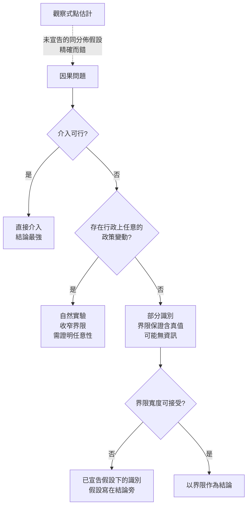

+++
title = "不能做實驗的時候：因果階梯上還剩什麼"
date = "2026-09-09T00:35:14+08:00"
author = "TTL::0"
draft = false
isCJKLanguage = true
description = "一個信用風險團隊要回報放款部位的違約風險。他們的模型只在被核准的申請上取得標籤——被拒絕的申請沒有後續，也就沒有結果可觀察。"
tags = [
    "分析論述", # term:AnalyticalEssay
  ]
series = ["能力失效歸因：一個聚合讀數能證明什麼，不能證明什麼"]
[ai_info]
    [ai_info.generation]
        model = "Claude Opus 5"
        agent = "Claude Code VSCode Extension 2.1.261"
    [ai_info.refinement]
        model = "Claude Opus 5"
        agent = "Claude Code VSCode Extension 2.1.263"
+++

<!--more-->

## 導言

一個信用風險團隊要回報放款部位的違約風險。他們的模型只在被核准的申請上取得標籤——被拒絕的申請沒有後續，也就沒有結果可觀察。

團隊提出對一小部分申請隨機核准，以取得無偏樣本。法遵部門否決：對申請人採用隨機化的核准決定，在該司法管轄區不可行。

於是三年來，回報的數字是已核准者的違約率：6.4%。這個數字誠實、可稽核、每季重算。它也與「這批申請人的違約風險」這個問題幾乎無關。

前面所有討論裡反覆出現同一個動作：要建立因果，就去介入——打亂潛在碼、翻轉環境、替換單一座標、凍結政策。而這個團隊面對的是介入被禁止的情形，而那在受規範的領域裡是常態，不是例外。

本文因此要處理：當介入不可行時，因果階梯上還剩下什麼？哪些主張仍然可以建立，哪些必須被放棄？

## 分析

### 兩層階梯

先把前面隱含的階梯寫明白。

**觀察**（observation）回答的是「在既有的資料生成程序下，量與量之間如何共同出現」。它不需要改變任何東西。

**介入**（intervention）回答的是「若把某個機制換掉，讀數會如何改變」。它需要實際去換。

兩者的差別不是精確度，而是所回答的問題。觀察式的量再精確，也不回答介入式的問題。而本文關心的所有失效判定——是模型變了、是資料變了、是決策改變了世界——全都是介入式的問題。

### 觀察式估計的偏誤不會隨精確度縮小

下面把導言那個情形做成可執行的最小系統。母體的違約機率隨特徵 $s$ 下降；核准規則是 $s \ge t$；只有被核准者產生標籤。

```python
import random, math
rnd = random.Random(17)
N = 20000
POP = []
for _ in range(N):
    s = rnd.gauss(0, 1)
    p = 1/(1+math.exp(3.0*s))
    POP.append((s, 1 if rnd.random() < p else 0))
TRUE = sum(y for _, y in POP)/N

def observe(t):                      # 只有 s >= t 者被核准並產生標籤
    app = [(s, y) for s, y in POP if s >= t]
    return sum(y for _, y in app)/len(app), len(app)/N

print(f"母體真實違約率（無法直接觀察）: {TRUE:.4f}")
for t in (1.0, 0.5, 0.0):
    obs, frac = observe(t)
    print(f"  門檻 {t:+.1f}：核准 {frac:.3f}，觀察違約率 {obs:.4f}，偏誤 {obs-TRUE:+.4f}")
```

實際執行的輸出：

```text
母體真實違約率（無法直接觀察）: 0.4971

一、純觀察式估計（單一政策）
  門檻 +1.0：核准 0.158，觀察違約率 0.0187，偏誤 -0.4785
  門檻 +0.5：核准 0.311，觀察違約率 0.0636，偏誤 -0.4336
  門檻 +0.0：核准 0.503，觀察違約率 0.1640，偏誤 -0.3332
```

真值是 $0.4971$。觀察值是 $0.0187$ 到 $0.1640$。偏誤在 $-0.33$ 到 $-0.48$ 之間。

要緊的是這個偏誤的性質。它不是抽樣誤差——樣本已有兩萬筆，觀察值本身的信賴區間很窄。加大樣本會讓那個錯誤的數字更精確，不會讓它更接近真值。**偏誤來自誰進入了樣本，而那由政策決定，不由樣本量決定。**

### 退路一：部分識別，不求點估計而求界限

介入不可行時，第一個可用的退路是放棄點估計，改求一個保證包含真值的區間。

未被觀察者的違約率是未知的，但它必然落在 $[0, 1]$。這一個事實就足以給出界限：

$$
\underbrace{\hat{p}_{\text{obs}} \cdot f}_{\text{下界}} \;\le\; p_{\text{pop}} \;\le\; \underbrace{\hat{p}_{\text{obs}} \cdot f + (1 - f)}_{\text{上界}},
$$

其中 $f$ 是被觀察的比例。下界對應未觀察者全不違約，上界對應全部違約。

```python
print("二、無假設的部分識別界限（未觀察者的違約率只知落在 [0,1]）")
for t in (1.0, 0.5, 0.0, -1.0, -2.0):
    obs, frac = observe(t)
    lo, hi = obs*frac, obs*frac + (1-frac)
    print(f"  門檻 {t:+.1f}：界限 [{lo:.4f}, {hi:.4f}]  寬度 {hi-lo:.4f}"
          f"  含真值: {lo <= TRUE <= hi}")
```

實際執行的輸出：

```text
二、無假設的部分識別界限（未觀察者的違約率只知落在 [0,1]）
  門檻 +1.0：界限 [0.0029, 0.8450]  寬度 0.8420  含真值: True
  門檻 +0.5：界限 [0.0197, 0.7091]  寬度 0.6893  含真值: True
  門檻 +0.0：界限 [0.0825, 0.5791]  寬度 0.4965  含真值: True
  門檻 -1.0：界限 [0.3412, 0.5004]  寬度 0.1592  含真值: True
  門檻 -2.0：界限 [0.4731, 0.4972]  寬度 0.0241  含真值: True
```

每一列的界限都包含真值。這不是運氣——界限是由一個必然為真的事實推出的，所以它的覆蓋是保證的，不是機率性的。

而界限的寬度由被觀察的比例決定：核准 15.8% 時寬度 $0.8420$，幾乎無資訊；核准 97.7% 時寬度 $0.0241$，很有用。

這給出本文最重要的一次重新框定。可選項不是「精確的估計」與「什麼都沒有」，而是：

| | 點估計（觀察式） | 界限（部分識別） |
| :--- | :--- | :--- |
| 精確度 | 高（區間很窄） | 低（區間可能很寬） |
| 是否包含真值 | 不包含（偏誤 $-0.43$） | 保證包含 |
| 隨樣本量 | 更精確，同樣錯 | 更精確，仍然對 |
| 誠實地說出自己不知道什麼 | 否 | 是 |

**精確而錯，對比不精確而對。** 前者的危險在於它的窄區間會被讀成可信度，而那個窄度只描述了抽樣噪聲，與偏誤無關。

### 退路二：自然實驗，讓政策自己露出帶區

第二個退路是找出資料裡已經存在的準隨機變動。最常見的來源是政策本身曾經改變過。

若核准門檻曾從 $+0.5$ 調到 $0.0$，那麼特徵落在 $[0.0, 0.5)$ 的申請人在前期被拒、後期被核准。這個帶區因此有了標籤，而進入帶區與否由一個與申請人無關的行政決定所致。

```python
print("三、自然實驗：政策曾把門檻由 +0.5 調到 0.0，因而露出一個帶區")
band = [(s, y) for s, y in POP if 0.0 <= s < 0.5]
above = [(s, y) for s, y in POP if s >= 0.5]
b_rate = sum(y for _, y in band)/len(band)
a_rate = sum(y for _, y in above)/len(above)
seen_frac = (len(band)+len(above))/N
seen_rate = (sum(y for _,y in band)+sum(y for _,y in above))/(len(band)+len(above))
lo, hi = seen_rate*seen_frac, seen_rate*seen_frac + (1-seen_frac)
print(f"  帶區 [0.0,0.5) 違約率 {b_rate:.4f}   帶區以上 {a_rate:.4f}")
print(f"  合併已觀察比例 {seen_frac:.3f}，界限 [{lo:.4f}, {hi:.4f}]  寬度 {hi-lo:.4f}")
```

實際執行的輸出：

```text
三、自然實驗：政策曾把門檻由 +0.5 調到 0.0，因而露出一個帶區
  帶區 [0.0,0.5) 違約率 0.3257   帶區以上 0.0636
  合併已觀察比例 0.503，界限 [0.0825, 0.5791]  寬度 0.4965
  （對照：只用單一門檻 +0.5 時寬度 0.6893）
```

帶區的違約率是 $0.3257$，而帶區以上是 $0.0636$——**五倍以上的差距**。這個帶區在政策變更之前完全不可見，而它的存在使先前那個 6.4% 的數字看起來遠比實際樂觀。

界限的寬度從 $0.6893$ 收到 $0.4965$。自然實驗的價值因此是可計量的：它把一塊未觀察區轉成已觀察區，收窄了界限。它不提供點估計，但它把界限推向有用的方向。

這個退路的資格條件必須寫明：變更的時點必須與申請人的特性無關。若門檻是因為壞帳上升才調整的，那麼變更本身就與結果相關，帶區的違約率會被那個相關性汙染。**「行政上任意」是自然實驗的核心要求**，而它需要獨立的證據支持，不能從資料本身推出。

### 退路三：已宣告假設下的識別

第三個退路是明白地假設一件無法驗證的事，並把它寫在結論旁邊。例如假設未觀察者的違約率不超過已觀察者中最差切片的兩倍。

這個退路唯一的價值在於**它的假設是可被爭論的**。讀者可以不同意那個係數，並看到結論如何隨之改變。相較之下，觀察式的點估計也依賴一個假設——未觀察者與已觀察者同分佈——只是那個假設沒有被寫下來，因此無法被爭論。

因此三個退路的排序不是依精確度，而是依假設的可見度：



圖裡的虛線是導言那個團隊三年來走的路。它之所以危險，不是因為它用了假設——三個退路都用假設——而是因為那個假設沒有出現在結論裡。

### 什麼是無法回復的

誠實地標出硬限制。若某個區域從未被任何政策核准過，且沒有任何行政上任意的變動曾經觸及它，那麼關於該區域的結果分佈，資料裡沒有任何資訊。此時可得的只有 $[0, 1]$ 這個平凡界限。

這種情形下正確的輸出不是一個帶著大信賴區間的估計，而是「該區域不可識別」。把它寫成一個很寬的區間仍然過度承諾，因為區間的形式暗示了某種機率性的知識；而事實是零知識。

## 反思

本文不主張界限總是夠用。實測顯示核准 15.8% 時界限寬度是 $0.8420$，那對任何決策都沒有幫助。此時誠實的結論是「以現有資料無法回答這個問題」，而該結論的價值在於它會把資源導向取得新資料——擴大核准帶、爭取一個受監理核可的試點、或尋找歷史上的政策變動——而不是導向更精細的模型。

一個反例可以標出界限的誤用方向。若一個團隊把界限的下界當成樂觀情境、上界當成悲觀情境來做壓力測試，那是合理的使用。但若把界限的中點當成點估計，那就取消了部分識別的全部價值——中點沒有任何保證，它只是兩個極端的算術平均。

另一個邊界關於自然實驗的資格。上面的示範假設門檻變更與申請人特性無關，而該假設在真實系統中很少完全成立：政策通常因為某些原因而改變，那些原因往往與結果相關。因此自然實驗的結論強度取決於「任意性」的證據，而那個證據來自制度脈絡——會議紀錄、法規時程、行政公文——不來自資料。**這是一個資料科學無法自給的環節。**

還有一個關於本文範圍的說明。本文不處理介入為何不可行——法遵、倫理審查、商業契約各有自己的判準與程序，而那些判準不該由分析的便利性來評價。本文接受介入不可行作為給定條件，處理的是在該條件下還能建立什麼。

最後，本文的實驗是單一特徵、二元結果、選擇規則已知的。它足以證明三個結構性主張——觀察式偏誤不隨樣本量縮小、無假設界限保證含真值、自然實驗可計量地收窄界限。它不足以處理真實系統中選擇規則本身未知的情形，而那會讓界限的計算更保守。

## 實務對比

**回報放款部位的風險。** 錯誤做法是報告已核准者的違約率。實測顯示該數字的偏誤達 $-0.4336$，而它的信賴區間很窄——窄度描述抽樣噪聲，與偏誤無關。正確做法是報告界限，並在旁邊註明被觀察的比例；界限很寬時，那個寬度本身就是關於系統可觀察性的重要資訊。

**面對介入被否決。** 錯誤做法是退回觀察式估計並照常報告。正確做法是依序檢查三個退路：是否存在行政上任意的歷史政策變動、無假設界限是否已足夠窄、若不夠窄則需要哪一個明確假設。三者都不可行時，正確的輸出是「不可識別」。

**使用歷史政策變更。** 錯誤做法是找到任何一次門檻調整就當成自然實驗。若該調整是因為壞帳上升而做的，變更本身與結果相關，帶區的違約率會被汙染。正確做法是先從制度紀錄確認變更的時點與理由與申請人特性無關，並把那份證據與結論一起呈現。

**使用部分識別的結果。** 錯誤做法是取界限的中點當作估計。中點沒有任何保證，它取消了界限的全部價值。正確做法是把下界與上界分別用於它們對應的決策情境，並在界限跨越決策門檻時明確回報「以現有資料無法支持該決策」。

**描述一個未被核准區域的風險。** 錯誤做法是用模型外推並附上一個信賴區間。該區間只反映模型的內部一致性，不反映對該區域的任何實際觀察。正確做法是標示該區域為不可識別，並把它與可識別區域分開呈現——把兩者混成一個彙總數字，會讓零知識的部分借用了有知識部分的可信度。

## 結論

前面反覆使用的診斷動作都建立在介入之上：替換一個座標、打亂一個通道、翻轉一個環境、凍結一個政策。而在受規範的領域裡，介入常常不可行，這是常態而非例外。

本文的量測給出介入不可得時的實際處境：

1. **觀察式估計的偏誤不隨樣本量縮小。** 兩萬筆樣本下偏誤仍達 $-0.4336$，因為偏誤來自誰進入樣本，而那由政策決定。更多資料只讓錯誤的數字更精確。
2. **無假設的界限保證包含真值。** 實測中每個門檻下的界限皆含真值，寬度由被觀察比例決定——從 $0.8420$ 到 $0.0241$。可選項不是「精確的估計」對「什麼都沒有」，而是精確而錯對比不精確而對。
3. **自然實驗可計量地收窄界限。** 一次歷史門檻變更露出的帶區違約率是 $0.3257$，而帶區以上僅 $0.0636$；納入該帶區使界限寬度從 $0.6893$ 收到 $0.4965$。其資格條件是變更在行政上任意，而該證據來自制度脈絡，不來自資料。

三個退路的排序依據不是精確度，而是假設的可見度。三者都使用假設；差別在於部分識別把假設降到最低且明示，自然實驗把假設寫成一個可被制度證據檢驗的命題，而已宣告假設下的識別至少讓假設可被爭論。觀察式點估計同樣依賴一個假設——未觀察者與已觀察者同分佈——只是它從不寫下來。

而當某個區域從未被任何政策觸及，也沒有任何任意變動曾經覆蓋它時，正確的輸出是「不可識別」，不是一個很寬的區間。區間的形式暗示了某種機率性的知識；此時的事實是零知識，而把零知識與有知識的部分彙總成一個數字，會讓前者借用後者的可信度。