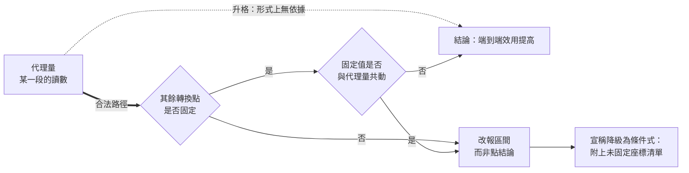

+++
title = "一段的證據，整條鏈的結論：代理量升格的形式錯誤"
date = "2026-09-08T23:58:01+08:00"
author = "TTL::0"
draft = false
isCJKLanguage = true
description = "2021 年 11 月，Zillow 宣布關閉 Zillow Offers，並在該季認列約 3.04 億美元的存貨減損，同時裁減約四分之一員工。公司對外的解釋集中在一個技術判斷上：房價預測的不可預測性遠超預期。[Zillow 2021 Q3 shareholder letter](https://s24.q4cdn.com/723050407/files/doc_financials/2021/q"
tags = [
    "分析論述", # term:AnalyticalEssay
    "AI 經濟與社會", # term:AiEconomics
    "端到端效用", # term:EndToEndUtility
    "中介變數", # term:MediatingVariable
  ]
series = ["從代理量到可追責結果：AI 效用宣稱的轉換鏈"]
[ai_info]
    [ai_info.generation]
        model = "Claude Opus 5"
        agent = "Claude Code VSCode Extension 2.1.261"
    [ai_info.refinement]
        model = "Claude Opus 5"
        agent = "Claude Code VSCode Extension 2.1.263"
+++

<!--more-->

## 導言

2021 年 11 月，Zillow 宣布關閉 Zillow Offers，並在該季認列約 3.04 億美元的存貨減損，同時裁減約四分之一員工。公司對外的解釋集中在一個技術判斷上：房價預測的不可預測性遠超預期。[Zillow 2021 Q3 shareholder letter](https://s24.q4cdn.com/723050407/files/doc_financials/2021/q3/Q3-2021-Zillow-Shareholder-Letter-FINAL.pdf)

這個解釋把失敗歸給鏈上的第一段。但同一段時間發生的另一件事沒有出現在那句話裡：為了衝高收購量，出價被系統性地拉高，也就是把「模型說多少就買」的授權範圍放寬了。預測誤差沒有變成小額虧損，是因為它被乘上了一個被同時放大的曝險量。

**同一個模型誤差，配上兩種授權寬度，會得到兩個量級不同的後果。** 所以「預測不夠準」這句話即使為真，也不是那個結果的成因——它是成因之一，而另一個成因與它同時被改動。

這個結構不特屬於房地產。它出現在每一次以某一段的觀察量作為整條價值鏈結論的場合：以模型分數宣稱職業被取代、以資本支出宣稱終端需求存在、以工具登入率宣稱生產力提高、以固定月費宣稱軟體式毛利。本文要處理的問題是：**從一段觀察量跨到整條鏈的結論，這一步在什麼條件下合法，以及不合法時它會錯到什麼程度。**

## 分析

### 鏈的形式，以及代理量所在的位置

一條交付流程的實現價值不是單一函數的輸出，而是一串轉換的複合。寫成最小形式：

$$
U=g_k\big(g_{k-1}(\cdots g_1(x)\cdots)\big),
$$

其中每個 $g_j$ 是一個轉換點——輸出被授權、被執行、被覆核、被承擔後果。**中介變數**（Mediating Variable） <!-- term:MediatingVariable -->是位於原因與結果之間、承載並使該段因果得以被觀察的可測量變數。實務中被量測與被宣傳的，通常只有 $g_1$ 附近的一個中介變數 <!-- term:MediatingVariable -->。

> [!IMPORTANT]
> **中介變數** <!-- term:MediatingVariable --> (Mediating Variable): 位於原因與結果之間、承載並使該段因果得以被觀察的可測量變數。 <!-- anchor:MediatingVariable -->


把那個變數稱為代理量。代理量升格的意思是：把 $g_1$ 上的一個讀數，當成關於 $U$ 的結論。

這一步要合法，需要兩個條件同時成立。第一，其餘 $g_2$ 到 $g_k$ 的參數在比較期間固定。第二，這些參數與被觀察的代理量之間不存在共同變動。Zillow 的個案在第二個條件上失敗，而這正是最難察覺的一種失敗——因為第二個條件的違反通常是理性的組織行為，不是疏失。

### 回推：授權寬度為何會跟著模型一起動

把個案的結果往回推，因果鏈是這樣接起來的。模型被認為足夠準，於是「不需要人工核價」的比例被調高；比例調高使成交量上升，成交量上升被讀成模型有效；出價因此進一步放寬。誤差率或許沒有惡化，但每一單位誤差所對應的存貨曝險持續變大。

這條鏈的關鍵性質是：**放寬授權的理由，正是那個代理量的改善。** 兩者不是獨立座標，後者是前者的函數。

下面的程式把這條鏈寫成三段：模型正確率、授權寬度、損害承擔。只有第一段被量測。

```python
# 三段鏈：第一段是模型正確率（被觀察的代理量），第二段是授權寬度
# （直接執行的比例），第三段是損害承擔。只有第一段被量測與宣傳。
def chain(accuracy, gate, n=10_000, benefit=1.0, harm=25.0, review=0.30):
    auto, manual = int(n * gate), n - int(n * gate)
    bad = auto * (1 - accuracy)
    value = auto * accuracy * benefit - bad * harm
    value += manual * benefit - manual * review
    return round(value, 1), int(bad)

rows = (("baseline        ", 0.90, 0.50), ("model only      ", 0.96, 0.50),
        ("model + wider   ", 0.96, 0.95), ("model + full    ", 0.96, 1.00))
print("scenario           acc   gate   end-to-end   harm cases")
for label, acc, gate in rows:
    v, h = chain(acc, gate)
    print(f"{label}  {acc:.2f}   {gate:.2f}   {v:>10.1f}   {h:>10d}")
```

實際執行的輸出：

```text
scenario           acc   gate   end-to-end   harm cases
baseline          0.90   0.50      -4500.0          499
model only        0.96   0.50       3300.0          200
model + wider     0.96   0.95        -30.0          380
model + full      0.96   1.00       -400.0          400
```

第二列是把模型改好、其餘不動：淨值從 $-4500$ 變成 $+3300$。這是那個改善確實值得的情形。

第三列與第四列的模型正確率完全相同，只是授權寬度跟著調高。淨值回到 $-30$ 與 $-400$，而損害件數從 200 件升到 380 與 400 件。**模型變好了，損害件數反而比只升級模型時多了一倍。**

值得注意的是第三列與第一列的對照。相對於升級前，模型正確率從 $0.90$ 提高到 $0.96$，端到端淨值從 $-4500$ 改善到 $-30$。若只看這兩列，升級是有效的。但那個改善幅度中有多少來自模型、有多少被授權放寬吃掉，只有把第二列也擺出來才看得見。實務中第二列通常不存在——因為沒有人會在放寬授權之前先跑一次不放寬的對照。

### 一個代理量對應的不是一個結論，是一個區間

上面的實驗操弄了兩個座標。更基本的問題是：如果只知道代理量，關於端到端還能說什麼？

下面的程式把正確率固定在 $0.96$，只讓三個未被列入宣稱的座標在合理範圍內取值。

```python
# 固定被觀察的代理量，只讓未被列入的座標在合理範圍內變動。
ACC = 0.96                    # 唯一被量測與宣傳的數字
def value(gate, harm, review, n=10_000):
    auto, manual = int(n*gate), n - int(n*gate)
    return round(auto*ACC - auto*(1-ACC)*harm + manual - manual*review, 1)

space = [(g, h, r) for g in (0.50, 0.75, 0.95)
                   for h in (5.0, 25.0, 60.0)
                   for r in (0.10, 0.30, 0.60)]
vals = [value(*p) for p in space]
best = max(space, key=lambda p: value(*p)); worst = min(space, key=lambda p: value(*p))
print(f"acc = {ACC} 固定不動，未列座標的 {len(space)} 種組合：")
print(f"  端到端淨值範圍 : {min(vals):.1f} 到 {max(vals):.1f}")
print(f"  正負號分佈     : 正 {sum(v>0 for v in vals)} 個 / 負 {sum(v<0 for v in vals)} 個")
print(f"  最佳組合 gate={best[0]} harm={best[1]} review={best[2]} -> {value(*best):.1f}")
print(f"  最差組合 gate={worst[0]} harm={worst[1]} review={worst[2]} -> {value(*worst):.1f}")
```

實際執行的輸出：

```text
acc = 0.96 固定不動，未列座標的 27 種組合：
  端到端淨值範圍 : -13480.0 到 8300.0
  正負號分佈     : 正 16 個 / 負 11 個
  最佳組合 gate=0.5 harm=5.0 review=0.1 -> 8300.0
  最差組合 gate=0.95 harm=60.0 review=0.6 -> -13480.0
```

代理量完全固定。端到端的可能值跨過兩萬一千個單位，且正負號兩邊都有。

這個結果比第一個實驗更強：它說的不是「代理量可能誤導」，而是**代理量在形式上不決定端到端的正負號**。一個只報告代理量的宣稱，沒有把區間收窄到能支持任何方向的結論。

### 合法的路徑與被走成捷徑的路徑

下圖把兩條路徑並排。虛線是實務中最常見的推論，它在形式上就沒有依據。



圖裡有兩個菱形，實務中被跳過的通常是第二個。第一個菱形——其餘座標是否固定——至少會在嚴謹的評估設計中被問到。第二個菱形問的是這些座標與代理量之間是否獨立，而 Zillow 的個案正是死在這裡：授權寬度被固定在一個值上報告，但那個值本身是隨代理量改善而被調高的。

### 讓宣稱可被檢查的最小形式

要讓一個效用宣稱進入可檢查狀態，它必須攜帶四樣東西：代理量是什麼、量在哪一段、鏈上有哪些轉換點、以及哪些轉換點沒有被固定。下面的程式把這四樣寫成一個可執行的稽核。

```python
# 一個效用宣稱的最小可檢查形式：代理量、轉換點、未固定座標。
REQUIRED = ("proxy", "measured_at", "conversions", "unpinned")

def audit(claim):
    missing = [k for k in REQUIRED if k not in claim]
    if missing:
        return f"不可檢查：缺 {missing}"
    if claim["unpinned"]:
        return f"條件式：僅在 {claim['unpinned']} 固定時成立"
    return "無條件（需另證所有轉換點皆已固定）"

claims = [
    {"text": "模型正確率提高 6 個百分點，所以流程效益提高",
     "proxy": "accuracy", "measured_at": "stage-1",
     "conversions": ["gate", "harm", "review"],
     "unpinned": ["gate", "harm", "review"]},
    {"text": "模型正確率提高 6 個百分點（授權寬度與覆核成本鎖定），淨值提高",
     "proxy": "accuracy", "measured_at": "stage-1",
     "conversions": ["gate", "harm", "review"], "unpinned": []},
    {"text": "AI 讓客服效率提升 15%", "proxy": "resolutions_per_hour"},
]
for c in claims:
    print(f"[{audit(c)}]\n  {c['text']}\n")
```

實際執行的輸出：

```text
[條件式：僅在 ['gate', 'harm', 'review'] 固定時成立]
  模型正確率提高 6 個百分點，所以流程效益提高

[無條件（需另證所有轉換點皆已固定）]
  模型正確率提高 6 個百分點（授權寬度與覆核成本鎖定），淨值提高

[不可檢查：缺 ['measured_at', 'conversions', 'unpinned']]
  AI 讓客服效率提升 15%
```

第三個宣稱的處境值得停一下。它是最常見的形式，也是唯一連降級都做不到的形式——因為它沒有交出足夠資訊來說明自己在什麼條件下成立。它不是錯的，它是**沒有真假值的**。

第一個與第二個宣稱在字面內容上幾乎相同，差別只在括號裡那一句。那一句把宣稱從「不成立」變成「條件式成立」，而條件式的宣稱是可以被檢查與推翻的。

### 四個詞

上面的推論只需要四個詞，後面所有具體領域的討論都用得上它們：

| 詞 | 意義 | 誤用的樣子 |
| :--- | :--- | :--- |
| 代理量 | 鏈上某一段被實際量測的讀數 | 被當成整條鏈的輸出 |
| 轉換點 | 讀數要通過才會變成後果的一次授權或處理 | 被當成透明的、不消耗成本的 |
| 未固定座標 | 比較期間並未鎖定、卻影響結果的參數 | 不出現在宣稱裡 |
| **端到端效用**（End-To-End Utility） <!-- term:EndToEndUtility --> | 扣除整合、人工與失誤成本後，一條完整流程實際交付給使用者的價值 | 與代理量互換使用 |

> [!IMPORTANT]
> **端到端效用** <!-- term:EndToEndUtility --> (End-To-End Utility): 扣除整合、人工與失誤成本後，一條完整流程實際交付給使用者的價值。 <!-- anchor:EndToEndUtility -->


第四欄是這張表的用途。四種誤用都有同一個形狀：把鏈上的一個位置與鏈的輸出混為一談。

## 反思

本文的主張有一個明確的不適用範圍：當鏈只有一段時，代理量就是端到端效用 <!-- term:EndToEndUtility -->，升格不是錯誤而是恆等式。這種情形確實存在——輸出直接交付給提出請求的人、沒有外部行動、錯誤完全可逆、且沒有人工處理成本。低風險的創意草稿大致落在這裡。在這種場合要求「附上未固定座標清單」是形式主義，不是嚴謹。

一個反例可以標出主張的另一側邊界。假設代理量惡化，端到端卻改善：模型被換成一個離線分數較低但輸出格式更穩定的版本，整合失敗率因此下降，人工重工大幅減少。此時「分數下降代表退步」與「分數上升代表進步」錯在同一個地方。所以本文不是在說代理量與端到端負相關，而是在說**兩者之間的符號關係由未固定座標決定，因此不能從單邊讀出**。

還有一個更難處理的邊界。要求列出未固定座標，預設了那些座標是可以被列舉的。實務中鏈上常有沒人知道存在的轉換點——一個下游團隊自行加上的重試邏輯、一份沒有進版本控制的例外清單。這種情況下「未固定座標清單」本身是不完備的，而不完備的清單會給人虛假的完整感。能做的不是把清單補完，而是在清單旁記下它由誰列、依據什麼列、以及最後一次覆核的時間。

最後是實驗的限制。三個實驗都是低維、參數由程式指定、且損害值是單一常數。它們足以證明「代理量不決定端到端的正負號」這個結構性主張——反例只需要一個——不足以估計任何真實流程中各座標的實際幅度。第二個實驗的區間寬度來自我所選的取值範圍，換一組範圍就會得到另一個寬度；它證明區間存在，不證明區間有多寬。

## 實務對比

**報告一次模型升級的效益。** 錯誤做法是把升級前後的端到端指標相減，歸因給模型。實測顯示同樣把正確率從 $0.90$ 提到 $0.96$，授權寬度不動時淨值是 $+3300$，跟著放寬時是 $-30$。正確做法是先跑「只換模型、其餘鎖定」的對照，再單獨跑「放寬授權」的變更，兩個效果分開報告。

**宣稱某能力具有商業價值。** 錯誤做法是報告代理量與一個方向詞，例如「準確率提高，因此效益提高」。實測顯示代理量固定在 $0.96$ 時，端到端淨值可以落在 $-13480$ 到 $+8300$ 之間，正負號兩邊都有。正確做法是把宣稱寫成條件式：在哪些座標固定的前提下、什麼幅度、以及哪些座標沒有固定。

**決定放寬自動執行的比例。** 錯誤做法是以代理量的改善作為放寬的依據，因為兩者看起來是同一件事的兩面。實測顯示這正是使損害件數從 200 件升到 400 件的路徑。正確做法是把授權寬度當成獨立決策，依損害的可承受上限來定，並在放寬之後重新量一次端到端。

**接收一個外部的效用宣稱。** 錯誤做法是判斷它可信或不可信。實測顯示缺少轉換點與未固定座標的宣稱連降級都做不到，它沒有真假值。正確做法是先問它交出了四樣東西中的幾樣；交不出來時，要求的不是更多證據，而是把宣稱改寫成有條件的形式。

**歸因一次失敗。** 錯誤做法是找出鏈上表現最差的那一段，把責任歸給它。Zillow 的公開解釋屬於這一類：預測不準是真的，但它不足以解釋損失的量級。正確做法是問哪些座標在同一期間一起動了，以及它們之間有沒有因果依賴。

## 結論

代理量升格是一個形式錯誤，不是一個判斷失誤。它的錯誤不在於估計得不夠準，而在於它所使用的推論在鏈上根本不存在。

本文的量測給出四個具體結果：

1. **同一個模型改善，配上不同的授權寬度，端到端可以差一個量級。** 正確率同為 $0.96$，授權寬度 $0.50$ 時淨值 $+3300$，$0.95$ 時 $-30$，而損害件數從 200 件升到 380 件。
2. **代理量在形式上不決定端到端的正負號。** 正確率固定在 $0.96$、只讓三個未列座標變動，端到端落在 $-13480$ 到 $+8300$ 的區間，27 種組合中 16 正 11 負。
3. **放寬授權的理由常常就是代理量的改善，所以兩者不是獨立座標。** 這使「其餘條件不變」這個前提在最需要它的時候失效。
4. **缺少轉換點與未固定座標的宣稱沒有真假值。** 它不是待驗證的假說，而是尚未進入可驗證形式的句子。

所以在把一段觀察升格為整條鏈的結論之前，有三個問題必須先有答案：這個讀數量在鏈上的哪一段、它與結果之間還有幾次授權或處理、以及這些轉換點裡有哪些在比較期間跟著它一起動了。

三個問題都有答案時，得到的不會是一個更強的結論，而是一個更窄、但可以被推翻的結論。這是本文所能主張的全部：**可推翻的窄結論比不可檢查的寬結論有用，而後者在數量上遠多於前者。**