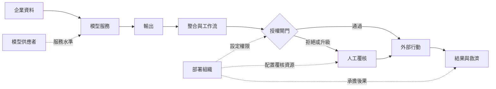

+++
title = "買到的是哪幾層：模型輸出與可追責結果之間的交付邊界"
date = "2026-09-09T00:12:02+08:00"
author = "TTL::0"
draft = false
isCJKLanguage = true
description = "2017 年 2 月，德州大學系統的內部稽核報告檢視了 MD Anderson 癌症中心與 IBM 合作的腫瘤學專家顧問專案。報告指出該中心已支付約 6,200 萬美元，而系統並未進入臨床使用，採購程序也未依規定執行。[UT System internal audit report](https://www.utsystem.edu/sites/default/files/documents/UT"
tags = [
    "分析論述", # term:AnalyticalEssay
    "AI 經濟與社會", # term:AiEconomics
    "社會技術系統", # term:SociotechnicalSystem
    "端到端效用", # term:EndToEndUtility
  ]
series = ["從代理量到可追責結果：AI 效用宣稱的轉換鏈"]
[ai_info]
    [ai_info.generation]
        model = "Claude Opus 5"
        agent = "Claude Code VSCode Extension 2.1.261"
    [ai_info.refinement]
        model = "Claude Opus 5"
        agent = "Claude Code VSCode Extension 2.1.263"
+++

<!--more-->

## 導言

2017 年 2 月，德州大學系統的內部稽核報告檢視了 MD Anderson 癌症中心與 IBM 合作的腫瘤學專家顧問專案。報告指出該中心已支付約 6,200 萬美元，而系統並未進入臨床使用，採購程序也未依規定執行。[UT System internal audit report](https://www.utsystem.edu/sites/default/files/documents/UT%20System%20Administration%20Special%20Review%20of%20Procurement%20Procedures%20Related%20to%20UTMDACC%20Oncology%20Expert%20Advisor%20Project/ut-system-administration-special-review-procurement-procedures-related-utmdacc-oncology-expert-advisor-project.pdf)

報告裡有一句話特別值得注意：它明確聲明本次檢視不評價該技術的科學正確性。稽核者刻意把技術層與其餘各層分開，因為他們發現的問題全部不在技術層——資料無法從既有病歷系統流入、臨床工作流沒有接上、採購與付款程序失控、專案的責任歸屬不清。

**一個關於模型的問題完全沒有被問到，專案就已經無法交付。** 這不是說模型沒有問題，而是說模型的問題在這條鏈上排不到前面。

企業採購 AI 系統時，簡報上的商品通常是模型；合約實際交付的卻是一組層。本文要處理的問題是：**這條鏈上有幾層、每一層各自能失效成什麼樣子，以及為什麼把注意力集中在其中一層在形式上沒有依據。**

## 分析

### 六層，以及每層的失效樣態

把一次「模型產生輸出」到「使用者得到可追責結果」之間的路徑攤開，實務中穩定出現六層。這裡的分析單位是**社會技術系統**（Sociotechnical System） <!-- term:SociotechnicalSystem -->——由技術元件與組織安排共同構成、必須整體運作才產生價值的系統。

> [!IMPORTANT]
> **社會技術系統** <!-- term:SociotechnicalSystem --> (Sociotechnical System): 由技術元件與組織安排共同構成、必須整體運作才產生價值的系統。 <!-- anchor:SociotechnicalSystem -->


| 層 | 交付內容 | 失效樣態 |
| :--- | :--- | :--- |
| 模型服務 | 推論、容量、延遲、版本穩定性 | 輸出品質不足；尖峰時段不可用 |
| 資料連接 | 企業資料的讀取權、時效、欄位語意 | 資料進不來；進來的欄位語意與假設不同 |
| 整合與工作流 | 與既有系統的接點、狀態同步、退回路徑 | 輸出無處可去；人必須手動搬運 |
| 授權閘門 | 哪些輸出可直接執行、哪些須升級 | 權限過寬放大損害；過嚴使效益歸零 |
| 人工覆核 | 覆核者的時間、資訊、否決權 | 覆核成為形式；覆核者無法承擔 |
| 救濟與事故 | 停止機制、通知、補償、責任歸屬 | 錯誤發生後無人負責、無法回復 |

第三欄是這張表的用途。六種失效彼此獨立，且沒有一種可以由另一層的改善補救。

回推 MD Anderson 個案的因果鏈：模型能力被當作採購標的，於是合約與付款圍繞模型能力設計；資料連接與臨床工作流被當成後續的實作細節，沒有進入驗收條件；當這兩層做不出來，專案就沒有可交付物，而此時模型層的表現已經與結果無關。**失效的位置不在被量測的那一層，而在沒有被寫進驗收條件的那幾層。**

### 鏈不分辨是哪一層

如果每一層都必須通過，端到端的通過率是各層通過率的乘積。這個形式帶來一個容易被忽略的結果。

```python
# 六層交付鏈：每層各自「表現優異」，端到端仍可能不堪用。
LAYERS = ("模型服務", "資料連接", "整合與工作流", "授權閘門", "人工覆核", "救濟與事故")

def end_to_end(rates):
    p = 1.0
    for r in rates:
        p *= r
    return p

for level in (0.999, 0.99, 0.97, 0.95):
    p = end_to_end([level] * len(LAYERS))
    print(f"每層皆 {level:.3f} -> 端到端 {p:.4f}   每萬件失敗 {round((1-p)*10000):>4d} 件")

print()
outs = set()
for i in range(len(LAYERS)):
    rates = [0.999] * len(LAYERS)
    rates[i] = 0.80
    outs.add(round(end_to_end(rates), 6))
print(f"任一層單獨降到 0.80、其餘 0.999：端到端有 {len(outs)} 種可能值 -> {outs}")
print("（把 0.80 放在哪一層都一樣，鏈不分辨是哪一層）")
```

實際執行的輸出：

```text
每層皆 0.999 -> 端到端 0.9940   每萬件失敗   60 件
每層皆 0.990 -> 端到端 0.9415   每萬件失敗  585 件
每層皆 0.970 -> 端到端 0.8330   每萬件失敗 1670 件
每層皆 0.950 -> 端到端 0.7351   每萬件失敗 2649 件

任一層單獨降到 0.80、其餘 0.999：端到端有 1 種可能值 -> {0.796008}
（把 0.80 放在哪一層都一樣，鏈不分辨是哪一層）
```

第一組數字給出一個具體的量級感。每層都達到 $0.97$——在任何單層評估裡這是好成績——端到端只有 $0.833$，每萬件有 1,670 件走不完整條鏈。

第二個結果是這個實驗真正的重點。把那個 $0.80$ 放在模型層、放在資料連接層、或放在救濟層，端到端都是 $0.796008$，一模一樣。**鏈在形式上不分辨是哪一層。** 因此「模型層最重要」這個判斷若要成立，必須由該場景的實際數值支撐，不能由鏈的結構支撐——而結構恰恰說的是相反的話。

### 兩種估算：席次式與分層盤點

第二個問題是成本。採購階段最常用的估算是把可自動化比例乘上人力成本，再乘一個模型正確率。下面的程式把它與分層盤點並排。

```python
STAFF, HOURS, WAGE = 100, 1600, 40.0        # 100 人，年 1600 小時，每小時 40 元
AUTOMATABLE, ACCURACY = 0.60, 0.95           # 六成任務可交付模型，離線正確率 0.95

naive = STAFF * HOURS * WAGE * AUTOMATABLE * ACCURACY
tasks = STAFF * HOURS * AUTOMATABLE

def layered(gate_pass, review_ratio, harm_rate, harm_cost, integrate=380_000/3):
    saved  = tasks * gate_pass * WAGE
    service = tasks * 0.9
    review = tasks * (1 - gate_pass) * review_ratio * WAGE
    harm   = tasks * harm_rate * harm_cost
    return saved - service - integrate - review - harm

print(f"席次式估算 : {naive:>12,.0f}（此數字不隨下列任何一列改變）\n")
cases = (
    ("整合順利、閘門寬鬆、低風險", 0.88, 0.55, 0.004,   900),
    ("整合順利、閘門嚴格、低風險", 0.55, 0.55, 0.002,   900),
    ("整合勉強、閘門嚴格、中風險", 0.55, 0.85, 0.004,  4_000),
    ("整合困難、閘門嚴格、高風險", 0.40, 1.00, 0.006, 12_000),
)
for label, g, r, hr, hc in cases:
    net = layered(g, r, hr, hc)
    print(f"{label}  分層淨額 {net:>12,.0f}   席次式高估 {naive - net:>12,.0f}")
```

實際執行的輸出：

```text
席次式估算 :    3,648,000（此數字不隨下列任何一列改變）

整合順利、閘門寬鬆、低風險  分層淨額    2,567,093   席次式高估    1,080,907
整合順利、閘門嚴格、低風險  分層淨額      775,733   席次式高估    2,872,267
整合勉強、閘門嚴格、中風險  分層淨額   -1,105,867   席次式高估    4,753,867
整合困難、閘門嚴格、高風險  分層淨額   -7,893,067   席次式高估   11,541,067
```

四列的模型正確率完全相同，都是 $0.95$。分層淨額從 $+2,567,093$ 走到 $-7,893,067$，跨過零點兩次。而席次式估算在四列都是 $3,648,000$，一動也沒動。

這說明席次式估算的問題不是誤差，是**不敏感**。它對五個層的參數完全沒有反應，所以它無論算出什麼數字，都不構成關於這個部署的資訊。第四列的情形值得特別記下來：席次式高估了 1,154 萬，而真實答案是不要買。

### 盤點式，而不是恆等式

把上面的計算寫成一般形式，一次流程的實現價值是

$$
V=p_a(B_q+B_t)-C_s-C_i-C_h-p_eL.
$$

$p_a$ 是輸出被正確採用的機率，$B_q$ 與 $B_t$ 是品質與時間收益，$C_s$、$C_i$、$C_h$ 是服務、整合與人工成本，$p_eL$ 是錯誤機率乘以平均損害。

這個式子的地位需要說清楚：**它不是會計恆等式，而是一份盤點清單。** 它的用途不是算出正確答案，是讓每一項成本都有一個必須被填的欄位。模型分數影響的只有 $p_a$ 與 $p_e$ 兩項，而這兩項無法單獨決定 $V$ 的正負號。空著的欄位就是沒有人負責的層。

### 資料流與責任流疊在一起

下圖把兩件事畫在同一張圖上：輸出如何往下游走，以及責任如何往上游收。它要回答的閱讀問題是：錯誤在哪一個轉換點從「文字」變成「後果」。



虛線是責任線，實線是資料線。兩條線在同一個地方分岔：模型供應者的責任止於服務水準，而外部行動的後果落在部署組織。這個分岔點通常不在合約的顯眼處，卻決定事故發生時誰要出面。

圖上「輸出」到「外部行動」之間有兩個節點，而那兩個節點是唯一把文字變成後果的地方。這是六層裡最容易被當成透明的兩層，因為它們不產生任何看得見的交付物。

## 反思

六層的劃分不是自然事實，是一個為了讓成本無處可躲而選的切法。同一條鏈可以切成四層或九層，切法的好壞由一個標準決定：**每一層是否對應一個能指名道姓的負責者。** 切出一個沒有負責者的層，只是增加圖上的方框。

主張的第一個邊界是高度標準化的 API 採購。當供應者只承諾服務可用性、客戶自行決定如何使用輸出時，六層裡有四層完全落在客戶側，而合約邊界是清楚的。此時抱怨「供應者沒有交付**端到端效用**（End-To-End Utility） <!-- term:EndToEndUtility -->」是誤置的要求。問題會轉移成另一個：客戶側是否知道自己接下了四層。

> [!IMPORTANT]
> **端到端效用** <!-- term:EndToEndUtility --> (End-To-End Utility): 扣除整合、人工與失誤成本後，一條完整流程實際交付給使用者的價值。 <!-- anchor:EndToEndUtility -->


第二個邊界是低風險、完全可逆的用途。當 $p_eL$ 接近零時，授權閘門與救濟層的成本大部分消失，六層盤點會顯得過重。這種場合的正確判斷是層數減少，不是盤點方法錯誤。

一個反例可以標出主張的另一側。假設某部署的每一層都有明確負責者、每一項成本都被盤點，而專案仍然失敗——因為六層之外還有一層沒有被列出：使用者是否願意改變工作方式。這一層無法由採購方單邊決定，也不容易在驗收條件裡寫成數字。所以本文的清單不是完備的，它只主張這六層是實務中最常空著的欄位。

最後，兩個實驗都有明確的限制。第一個實驗假設各層獨立且串聯，而真實鏈上有並聯的退回路徑與重試，獨立性通常不成立；乘積形式因此低估了有退路的鏈、高估了有共同失效原因的鏈。第二個實驗的四組參數是我指定的，它證明席次式估算對這些參數不敏感，不證明任何真實部署會落在第三列或第四列。

## 實務對比

**寫一份 AI 系統的驗收條件。** 錯誤做法是把模型指標寫成驗收標準，其餘列為實作細節。MD Anderson 個案顯示這種寫法會讓資料連接與工作流的失效不觸發任何合約後果。正確做法是六層各有一條可觀察的驗收條件，其中至少包含資料連接的時效與工作流的退回路徑。

**估算採購效益。** 錯誤做法是以離線正確率乘可自動化比例乘人力成本。實測顯示這個數字在四組截然不同的部署條件下都是 $3,648,000$，而真實淨額從 $+2,567,093$ 到 $-7,893,067$。正確做法是選一條實際流程，先記錄輸入、輸出、授權、接手與結果，再逐項填入盤點式。

**決定改善哪一層。** 錯誤做法是預設模型層的邊際報酬最高。實測顯示把單一層降到 $0.80$，端到端都是 $0.796008$，鏈不分辨是哪一層。正確做法是實測各層當前的通過率，把資源投向數值最低的那一層，而那一層經常不是模型。

**談一份 AI 服務合約。** 錯誤做法是比較各家模型的能力宣稱。正確做法是先問責任線在哪裡分岔：供應者承諾到哪一層、外部行動的後果落在誰身上、以及事故發生時由誰通知受影響者。這三個答案決定了剩下四層要自己補多少。

**回報一次專案失敗。** 錯誤做法是歸因給「技術不成熟」。UT System 的稽核報告刻意不評價技術，因為它發現的問題全在其餘各層。正確做法是逐層列出當時的狀態，並指出哪些層在專案啟動時就沒有負責者。

## 結論

企業買到的不是模型，是一組必須全部運作的層。這件事的實務後果可以壓成四個量測結果：

1. **每層都優異不代表鏈可用。** 六層皆 $0.97$ 時端到端只有 $0.833$，每萬件有 1,670 件走不完。
2. **鏈在形式上不分辨是哪一層。** 把單一層降到 $0.80$，無論放在哪一層，端到端都是 $0.796008$。所以「模型層最重要」需要該場景的數值支撐，不能由鏈的結構支撐。
3. **席次式估算不是誤差問題，是不敏感問題。** 四組部署條件下它始終是 $3,648,000$，而分層淨額跨過零點，最差時為 $-7,893,067$。
4. **失效經常發生在沒有被寫進驗收條件的層。** 一份稽核在明確不評價技術的前提下，仍然足以判定專案無法交付。

因此判斷一項 AI 能力是否進入現實，要逐層問同一個問題：這一層由誰負責、當前的通過率是多少、以及它的成本記在哪一本帳上。

任何一層在這三個問題上是空的，那一層就是這條鏈的實際上限。而漂亮的輸出在通過那一層之前，都還只是一個候選行動。