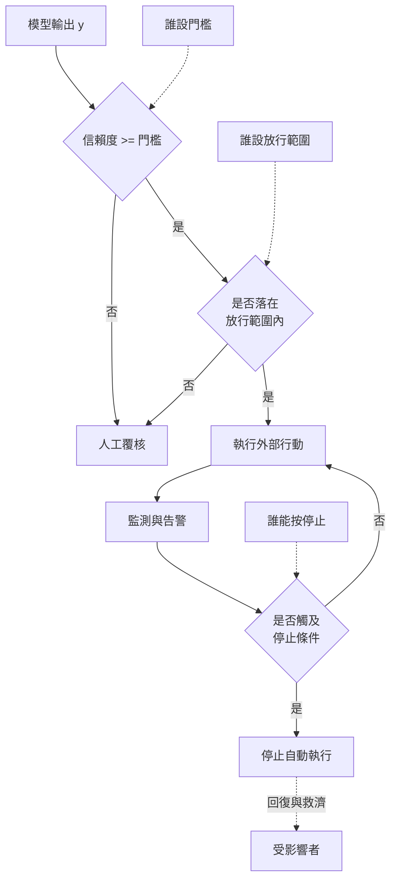

+++
title = "文字在哪一點變成後果：授權閘門的兩個參數"
date = "2026-09-09T00:26:03+08:00"
author = "TTL::0"
draft = false
isCJKLanguage = true
description = "2012 年 8 月 1 日，Knight Capital 在美股開盤後約 45 分鐘內送出約 400 萬筆執行，涉及 154 檔股票，造成約 4.6 億美元損失。美國證券交易委員會後續的行政命令指出，該公司在部署當週把新程式送上八台伺服器中的七台，一個被重新指派用途的旗標在第八台上啟動了一段早已退役的程式碼。命令同時記載，開盤前系統發出的 97 封自動警示郵件沒有被處理。[SEC adminis"
tags = [
    "分析論述", # term:AnalyticalEssay
    "AI 經濟與社會", # term:AiEconomics
    "校準", # term:Calibration
  ]
series = ["從代理量到可追責結果：AI 效用宣稱的轉換鏈"]
[ai_info]
    [ai_info.generation]
        model = "Claude Opus 5"
        agent = "Claude Code VSCode Extension 2.1.261"
    [ai_info.refinement]
        model = "Claude Opus 5"
        agent = "Claude Code VSCode Extension 2.1.263"
+++

<!--more-->

## 導言

2012 年 8 月 1 日，Knight Capital 在美股開盤後約 45 分鐘內送出約 400 萬筆執行，涉及 154 檔股票，造成約 4.6 億美元損失。美國證券交易委員會後續的行政命令指出，該公司在部署當週把新程式送上八台伺服器中的七台，一個被重新指派用途的旗標在第八台上啟動了一段早已退役的程式碼。命令同時記載，開盤前系統發出的 97 封自動警示郵件沒有被處理。[SEC administrative proceeding, 2013](https://www.sec.gov/litigation/admin/2013/34-70694.pdf)

這個個案的技術成因是一次部署疏失。但它的**損失量級**不是由那次疏失決定的。決定量級的是兩件事：錯誤的動作以多快的速率被真正執行，以及從開始執行到有人能停下來之間隔了多久。

**同一個程式錯誤，若放在一個每分鐘只放行少量動作、且 30 秒內可停的系統上，會是一則工單，不是一則新聞。** SEC 的命令記載該公司當時沒有書面的程式部署審查程序，風險系統也沒有在總量層級自動阻斷。它缺的不是更好的程式，是一個會綁住手的閘門。

把這個結構搬到 AI 系統上，問題變成：模型輸出在哪一點被授權成為外部行動、那個授權有多寬、以及授權之後多久才停得下來。本文要處理的正是這三個問題，因為它們合起來決定一個輸出錯誤的後果規模。

## 分析

### 授權函數，以及它不在模型裡

模型的輸出可以寫成一個條件分佈：給定輸入 $x$ 與上下文 $c$，輸出 $y\sim p_\theta(y\mid x,c)$。這個分佈描述文字如何被產生，它不包含付款權、下單權或政策變更權。

外部後果需要另一個函數：

$$
a(y,u,p)\in\{0,1\},
$$

其中 $u$ 是發起者的角色，$p$ 是當時生效的政策。這個函數不在模型裡，它由部署組織設定。**它是整條鏈上唯一把文字變成後果的地方。**

這個分離帶來一個實務後果：模型完全不動，只調整 $a$，外部效果的規模就會改變。反過來也成立——模型大幅改善，若 $a$ 同時被放寬，後果可以不變甚至變差。

### 閘門有兩個參數，而第二個常被漏掉

「授權寬度」是第一個參數：多少比例的輸出可以直接執行。它通常有人負責。

第二個參數是**從放行到停止之間的時間**。它決定在有人介入之前，錯誤能累積到什麼程度。Knight Capital 的 45 分鐘就是這個參數的值。實務中它常常沒有負責者，因為它不是任何單一決策的結果，而是監測、告警、值班與停止機制四件事的複合。

下面的程式把兩個參數分開操弄。損害率固定不動。

```python
# 閘門有兩個參數：放行寬度，以及從放行到停止之間的時間。
def exposure(rate_per_min, error_rate, harm_per_case, minutes_to_stop):
    return rate_per_min * minutes_to_stop * error_rate * harm_per_case

RATE, ERR, HARM = 88_000, 0.004, 1_300.0   # 每分鐘動作數、錯誤率、每件損害
print("同一個模型錯誤率，只改「多久才停下來」：")
for m in (0.5, 2, 10, 45):
    print(f"  {m:>4} 分鐘  -> 累積損害 {exposure(RATE, ERR, HARM, m):>16,.0f}")
print()
print("同一個停止時間 45 分鐘，只改放行寬度：")
for w in (0.01, 0.10, 0.50, 1.00):
    print(f"  放行 {w:>4.0%}  -> 累積損害 {exposure(RATE*w, ERR, HARM, 45):>16,.0f}")
```

實際執行的輸出：

```text
同一個模型錯誤率，只改「多久才停下來」：
   0.5 分鐘  -> 累積損害          228,800
     2 分鐘  -> 累積損害          915,200
    10 分鐘  -> 累積損害        4,576,000
    45 分鐘  -> 累積損害       20,592,000

同一個停止時間 45 分鐘，只改放行寬度：
  放行   1%  -> 累積損害          205,920
  放行  10%  -> 累積損害        2,059,200
  放行  50%  -> 累積損害       10,296,000
  放行 100%  -> 累積損害       20,592,000
```

兩個參數在這個形式裡是對稱的：把停止時間從 45 分鐘壓到 30 秒，與把放行寬度從 100% 收到 1%，效果同樣是把損害縮小到約九十分之一。

對稱性有一個實務含義。若一個系統的放行寬度因為業務理由不能收，還有第二個旋鈕可以轉；反過來，若停止機制受限於人力排班無法再快，收窄放行寬度可以達到同樣效果。**兩個旋鈕都轉不動的系統，才是真正沒有閘門的系統。**

這個對稱性也解釋了 2024 年 7 月一次全球規模的端點軟體事故後，供應者的補救方向為何是分批發布與客戶自選更新時間，而不只是修好那個檔案。修好檔案處理的是這一次；分批發布改變的是下一次的放行寬度。[CrowdStrike external technical root cause analysis](https://www.crowdstrike.com/wp-content/uploads/2024/08/Channel-File-291-Incident-Root-Cause-Analysis-08.06.2024.pdf)

### 以信賴度當閘門，需要模型是校準的

實務中最常見的閘門規則是「信賴度高於門檻就直接執行」。這個規則有一個先決條件很少被檢查：**校準**（Calibration） <!-- term:Calibration -->——模型輸出機率與實際正確率的一致程度。

> [!IMPORTANT]
> **校準** <!-- term:Calibration --> (Calibration): 模型輸出機率與實際正確率的一致程度。 <!-- anchor:Calibration -->


下面的實驗讓兩個模型的正確率完全相同，只有信賴度的分佈不同。

```python
import random
# 兩個正確率完全相同的模型，只有信賴度的校準不同。
# 閘門規則：信賴度 >= 0.90 直接執行，否則送人工覆核。
N, ACC, THRESHOLD = 200_000, 0.92, 0.90
clamp = lambda x: min(1.0, max(0.0, x))

def run(kind, seed=11):
    rng = random.Random(seed)
    auto = auto_wrong = manual = manual_ok = 0
    for _ in range(N):
        correct = rng.random() < ACC
        if kind == "calibrated":
            conf = clamp(rng.gauss(0.93, 0.06) if correct else rng.gauss(0.70, 0.15))
        else:                                    # 過度自信：信賴度幾乎不隨對錯改變
            conf = clamp(rng.gauss(0.96, 0.03) if correct else rng.gauss(0.94, 0.04))
        if conf >= THRESHOLD:
            auto += 1
            auto_wrong += int(not correct)
        else:
            manual += 1
            manual_ok += int(correct)
    return auto, auto_wrong, manual, manual_ok

for kind in ("calibrated", "overconfident"):
    a, w, m, mo = run(kind)
    print(f"{kind:<14} 模型正確率 {ACC}")
    print(f"  直接執行 {a:>7d} 件（{a/N:>5.1%}）  其中錯誤 {w:>6d} 件（{w/max(a,1):>6.2%}）")
    print(f"  送人工   {m:>7d} 件（{m/N:>5.1%}）  其中本來就對 {mo:>6d} 件（{mo/max(m,1):>6.2%}）")
    print(f"  閘門攔下的錯誤佔全部錯誤 {1 - w/(N*(1-ACC)):>6.1%}")
```

實際執行的輸出：

```text
calibrated     模型正確率 0.92
  直接執行  128300 件（64.1%）  其中錯誤   1421 件（ 1.11%）
  送人工     71700 件（35.9%）  其中本來就對  57145 件（79.70%）
  閘門攔下的錯誤佔全部錯誤  91.1%
overconfident  模型正確率 0.92
  直接執行  193149 件（96.6%）  其中錯誤  13437 件（ 6.96%）
  送人工      6851 件（ 3.4%）  其中本來就對   4312 件（62.94%）
  閘門攔下的錯誤佔全部錯誤  16.0%
```

兩個模型的正確率都是 $0.92$。校準 <!-- term:Calibration -->的那個攔下了 91.1% 的錯誤，過度自信的那個只攔下 16.0%。

這個結果的方向值得注意。過度自信的模型看起來表現更好——它送人工的比例只有 3.4%，覆核成本低得多。**閘門在它身上幾乎不作用，而低成本正是這件事的症狀。** 一個「送人工比例很低」的閘門，可能是因為模型很可靠，也可能是因為信賴度不帶資訊，而這兩者從閘門的通過率看不出差別。

校準 <!-- term:Calibration -->的那一組也交出了代價：35.9% 送人工，而其中 79.70% 本來就是對的。閘門把大量正確案件也擋了下來，這是真實的人力成本。所以校準 <!-- term:Calibration -->不是免費的改善，它讓那個成本變成可控——因為只有在信賴度帶資訊時，調整門檻才會沿著一條有意義的取捨曲線移動。

### 三個旋鈕與它們的負責者

下圖把授權閘門的內部攤開。它要回答的問題是：一次「放行」實際上由幾個獨立設定共同決定。



三條虛線是這張圖的重點。它們指向三個必須有名字的角色：設門檻的人、設放行範圍的人、以及有權按停止的人。

Knight Capital 個案的形狀在圖上是清楚的：最上面兩個菱形實質上被繞過，最下面那個菱形沒有自動路徑，於是唯一的停止方式是人在 45 分鐘裡想清楚發生了什麼。而 97 封警示郵件說明監測節點是有輸出的——輸出沒有連到停止條件。

## 反思

閘門的價值不是普遍的。當一個動作完全可逆、且回復成本接近零時，閘門的期望收益是負的：它花掉覆核成本去防止一件本來就可以事後修正的事。純內部的草稿生成大致落在這裡。所以「所有 AI 輸出都應該經過閘門」不是本文的主張，本文的主張是閘門的鬆緊應由損害的不可逆程度決定，而不是由模型的分數決定。

一個反例可以標出主張的邊界。假設某系統把閘門收得極窄、停止時間壓到數秒，而它仍然造成重大損害——因為損害來自一個單筆就足夠大的動作，速率與時間在這裡不起作用。醫療劑量、法律時效、單筆大額匯款都屬於這一類。此時速率乘時間的模型不適用，必須改為逐筆的事前授權，而那是一個不同的機制。

第二個邊界關於停止機制自身的風險。一個能被自動觸發的停止條件，本身就是一個可被誤觸的動作；把停止設得太靈敏，會用可用性事故換取損害事故。這是一個真實的取捨，本文不主張它總是值得。可以主張的是：這個取捨必須被明文決定，而不是因為沒有人建停止機制而預設落在一側。

還有一個更難處理的問題。上面的分析假設放行範圍是可以被列舉的——哪些動作類型、哪些額度、哪些對象。當模型被賦予工具使用能力時，可執行的動作集合是組合出來的，不是列舉出來的。此時「放行範圍」需要改用可執行動作的邊界來描述，而那個邊界的完備性無法從內部證明。這一點超出本文範圍，但它讓上面的第二個旋鈕在代理系統上比在單一動作系統上難設得多。

最後是實驗的限制。第一個實驗把損害寫成速率乘時間乘常數，它假設每件損害獨立且等值；真實市場與真實客戶關係都有非線性——前十件的聲譽損害可能大於後一千件，也可能反過來。第二個實驗的兩組信賴度分佈是我指定的高斯形狀，它證明「同一正確率下閘門效力可以相差 5 倍以上」，不證明任何真實模型的校準 <!-- term:Calibration -->程度。

## 實務對比

**設計自動執行的範圍。** 錯誤做法是以模型評測分數作為放寬的依據。實測顯示放行寬度與停止時間在損害上是對稱的兩個旋鈕，而模型分數不出現在那個式子裡。正確做法是先定損害的可承受上限，再由該上限反推放行寬度與停止時間的組合。

**用信賴度當閘門。** 錯誤做法是設一個門檻就上線，並以「送人工比例很低」作為系統健康的證據。實測顯示過度自信的模型送人工只有 3.4%，而閘門只攔下 16.0% 的錯誤。正確做法是先量校準 <!-- term:Calibration -->——把信賴度分桶，比較每桶的宣稱機率與實際正確率——再決定門檻。

**回應一次自動化事故。** 錯誤做法是修好那個缺陷並回報根因已排除。Knight Capital 的個案顯示缺陷只決定事故的觸發，量級由放行寬度與停止時間決定。正確做法是同時交出兩個數字：這次從開始到停止經過多久、以及下一次同類事故的上限是多少。

**建立監測告警。** 錯誤做法是讓告警只產生郵件或訊息。該個案記載開盤前有 97 封自動警示郵件未被處理。正確做法是把至少一條告警直接連到停止動作，讓那條路徑不需要任何人的判斷就能收窄放行寬度。

**上線一個新版本。** 錯誤做法是同時推給全部流量，理由是版本已經測過。正確做法是把「同時影響多少對象」當成一個獨立於程式品質的參數來設定，並保留一個不需要重新部署就能收窄它的開關。

## 結論

模型的輸出分佈不包含行動權。行動權來自一個由組織設定的授權函數，而那個函數是整條鏈上唯一把文字變成後果的地方。

本文的量測給出四個結果：

1. **閘門有兩個參數，而它們在損害上是對稱的。** 停止時間從 45 分鐘壓到 30 秒，與放行寬度從 100% 收到 1%，都把累積損害縮到約九十分之一。
2. **第二個參數常常沒有負責者。** 它是監測、告警、值班與停止機制的複合，不是任何單一決策的結果，因此容易在組織圖上落空。
3. **以信賴度當閘門需要校準 <!-- term:Calibration -->作為先決條件。** 正確率同為 $0.92$，校準 <!-- term:Calibration -->的模型讓閘門攔下 91.1% 的錯誤，過度自信的只攔下 16.0%。
4. **低覆核成本不是好消息，它是一個需要解釋的觀察。** 過度自信的那組送人工只有 3.4%，而那正是閘門失效的症狀。

所以判斷一個 AI 系統的風險是否可控，不必先評價模型。先問三個問題就夠了：誰設門檻、誰設放行範圍、誰能按停止。

三個角色都有名字時，模型的錯誤率決定事故的頻率；有任何一個角色空著時，模型的錯誤率決定的是事故的下限，而上限由那個空缺決定。