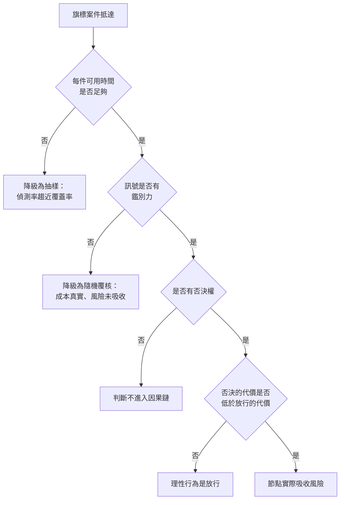

+++
title = "覆核何時只是責任裝飾：人工補償的四本帳"
date = "2026-09-09T00:41:04+08:00"
author = "TTL::0"
draft = false
isCJKLanguage = true
description = "2018 年 3 月 18 日晚間，一輛自動駕駛測試車在亞利桑那州 Tempe 撞死一名推著自行車橫越馬路的行人。美國國家運輸安全委員會的調查報告記載了幾個彼此獨立的設計事實：自動駕駛系統在撞擊前約 5.6 秒就偵測到物體，但反覆改變它的分類，且沒有預測出它會進入車道；車輛原廠的自動緊急煞車在自動駕駛模式下被停用；系統設計包含一秒的動作抑制期；車上只有一名操作員，而該公司先前把配置從兩人改為一人。"
tags = [
    "分析論述", # term:AnalyticalEssay
    "AI 經濟與社會", # term:AiEconomics
    "人工補償", # term:HumanCompensation
  ]
series = ["從代理量到可追責結果：AI 效用宣稱的轉換鏈"]
[ai_info]
    [ai_info.generation]
        model = "Claude Opus 5"
        agent = "Claude Code VSCode Extension 2.1.261"
    [ai_info.refinement]
        model = "Claude Opus 5"
        agent = "Claude Code VSCode Extension 2.1.263"
+++

<!--more-->

## 導言

2018 年 3 月 18 日晚間，一輛自動駕駛測試車在亞利桑那州 Tempe 撞死一名推著自行車橫越馬路的行人。美國國家運輸安全委員會的調查報告記載了幾個彼此獨立的設計事實：自動駕駛系統在撞擊前約 5.6 秒就偵測到物體，但反覆改變它的分類，且沒有預測出它會進入車道；車輛原廠的自動緊急煞車在自動駕駛模式下被停用；系統設計包含一秒的動作抑制期；車上只有一名操作員，而該公司先前把配置從兩人改為一人。[NTSB HAR-19/03](https://www.ntsb.gov/investigations/AccidentReports/Reports/HAR1903.pdf)

在事故發生前的組織敘述裡，這套系統是有人監督的。表格上有一個人工節點，那個節點的職責是在系統失效時接管。

但把上面的設計事實排在一起，那個節點的實際處境是：**它沒有被告知系統看到了什麼，它沒有煞車權，它的同伴被移除，而它要保持的警覺是針對一個絕大多數時間都正常運作的系統。** 報告記載該操作員在撞擊前約一秒才抬頭。

這不是一個關於某個人的故事。它是一個關於節點設計的故事：一個人被放在圖上的某個位置，並不使那個位置具備吸收風險的能力。

**人工補償**（Human Compensation） <!-- term:HumanCompensation -->是以人力審核與例外處理填補模型不可靠之處，使系統整體達到可交付品質的做法。本文要處理兩個問題：**人工節點在什麼條件下真的吸收風險，以及當它有效時，它的成本被記在哪一本帳上。**

> [!IMPORTANT]
> **人工補償** <!-- term:HumanCompensation --> (Human Compensation): 以人力審核與例外處理填補模型不可靠之處，使系統整體達到可交付品質的做法。 <!-- anchor:HumanCompensation -->


## 分析

### 第一個條件：時間，而它與量成反比

覆核者的產能是固定的。旗標量上升時，每件可用的時間就下降，而偵測率對每件時間是遞減報酬的關係。這兩件事合起來產生一個比直覺更陡的塌陷。

```python
import math
# 覆核者的時間是固定的。旗標量上升時，每件可用的時間下降，
# 而偵測率對每件時間是遞減報酬的。
CAPACITY_MIN = 6 * 8 * 60 * 20  # 6 人 x 8 小時 x 60 分 x 20 日
K = 0.55                        # 每分鐘的偵測效率

print(f"覆核產能 {CAPACITY_MIN:,} 分鐘/月，覆核人數固定 6 人")
print(f"{'旗標件數':>10}{'每件分鐘':>10}{'偵測率':>9}{'漏出件數':>10}")
for flagged in (2_000, 8_000, 20_000, 60_000, 150_000):
    per_case = CAPACITY_MIN / flagged
    detect = 1 - math.exp(-K * per_case)
    leaked = flagged * (1 - detect)
    print(f"{flagged:>10,}{per_case:>10.2f}{detect:>9.1%}{leaked:>10,.0f}")
```

實際執行的輸出：

```text
覆核產能 57,600 分鐘/月，覆核人數固定 6 人
      旗標件數      每件分鐘      偵測率      漏出件數
     2,000     28.80   100.0%         0
     8,000      7.20    98.1%       153
    20,000      2.88    79.5%     4,103
    60,000      0.96    41.0%    35,387
   150,000      0.38    19.0%   121,442
```

覆核人數一個都沒減。旗標量從 2,000 件成長到 150,000 件——這是採用擴大時的正常成長——偵測率從 100% 掉到 19.0%。

這個曲線的形狀是關鍵。從 2,000 到 8,000 件，偵測率只掉了不到兩個百分點，看起來這個節點很耐用。從 20,000 到 60,000 件，它從 79.5% 掉到 41.0%。**塌陷發生在採用被視為成功的那一段。** 因此「覆核機制上線時運作良好」不構成它在規模化後仍然有效的證據，而規模化的決策通常引用的正是上線時的那個觀察。

### 第二個條件：訊號的鑑別力

第二個條件是覆核者收到的資訊。若旗標與案件對錯無關，覆核者面對的是一個隨機抽樣，而偵測率會退化到抽樣覆蓋率。

下面的實驗讓三種情形的每件覆核成本完全相同，只改訊號的鑑別力。

```python
import random
# 覆核者拿到的訊號有多少鑑別力？三種情形的每件覆核成本相同。
N, ERR = 100_000, 0.06
COST_PER_REVIEW, HARM = 3.0, 40.0        # 一次人工覆核的成本 / 一件漏出錯誤的損害

def run(signal_quality, seed=23):
    rng = random.Random(seed)
    reviewed = caught = leaked = 0
    for _ in range(N):
        bad = rng.random() < ERR
        flagged = (rng.random() < signal_quality if bad else False) \
                  or rng.random() < (1 - signal_quality) * 0.25
        if flagged:
            reviewed += 1
            caught += int(bad)
        else:
            leaked += int(bad)
    cost = reviewed * COST_PER_REVIEW
    return reviewed, caught, leaked, cost, caught * HARM - cost

for q, label in ((0.0, "無鑑別力  "), (0.45, "部分鑑別力"), (0.90, "高鑑別力  ")):
    r, c, l, cost, net = run(q)
    ratio = r / max(c, 1)
    print(f"{label} 覆核 {r:>6,} 件   攔下 {c:>5,} 件   漏出 {l:>5,} 件")
    print(f"           每攔下一件需覆核 {ratio:>5.1f} 件   成本 {cost:>9,.0f}   淨效益 {net:>10,.0f}")
```

實際執行的輸出：

```text
無鑑別力   覆核 25,016 件   攔下 1,518 件   漏出 4,480 件
           每攔下一件需覆核  16.5 件   成本    75,048   淨效益    -14,328
部分鑑別力 覆核 16,071 件   攔下 3,132 件   漏出 2,904 件
           每攔下一件需覆核   5.1 件   成本    48,213   淨效益     77,067
高鑑別力   覆核  7,771 件   攔下 5,348 件   漏出   612 件
           每攔下一件需覆核   1.5 件   成本    23,313   淨效益    190,607
```

無鑑別力那一組覆核了 25,016 件，比另外兩組都多，而它的淨效益是 $-14,328$。它花掉最多的人力，攔下最少的錯誤，並且在帳面上仍然是一個「有人工覆核」的流程。

這就是責任裝飾的可計量形式：**節點存在、成本真實、風險沒有被吸收。** 而從流程外部看，這三組都符合「有人工覆核」的描述。

Tempe 個案在這兩個條件上同時失敗。系統沒有把它偵測到的物體與分類信賴度傳給操作員，所以訊號的鑑別力對那個人來說是零；而自動系統在絕大多數時間正常運作，使得那個人的警覺任務沒有任何可用的內部訊號可供對照。

### 第三與第四個條件：權限與退出

前兩個條件可以計量，後兩個不容易，但缺少它們的後果同樣具體。

第三個條件是否決權。一個人若無法阻止動作，他的判斷不進入因果鏈。Tempe 個案裡自動緊急煞車在自動模式下被停用，這使得「接管」必須是一個完整的人類駕駛動作，而不是一次按鈕。

第四個條件是退出機制。當覆核者知道自己的否決會被追究、而放行不會，理性行為是放行。這個非對稱不需要任何人下命令就會出現，它由誰承擔錯誤的成本決定。

下圖把四個條件畫成一次覆核必須通過的檢查。它要回答的問題是：一個人工節點在什麼時候只是圖上的一個方框。



四個菱形都是必要條件，任何一個為否就落到一個降級狀態。四個降級狀態的共同特徵是：從組織圖上看不出差別。

### 同一批工時，四本帳都不記

假設節點是有效的——四個條件都滿足。那麼它的成本存在，而這個成本會出現在四個不同的地方。下面的程式把同一批覆核工時放進四本帳，比較記與不記的差異。

```python
# 同一批人工覆核工時，在四本帳上各自被記或不記。
CASES        = 100_000     # 每月案件
MODEL_ACC    = 0.920       # 模型單獨的正確率
POST_ACC     = 0.985       # 覆核後交付給客戶的正確率
REVIEW_MIN   = 57_600      # 覆核工時（分鐘）
WAGE_MIN     = 0.58        # 每分鐘人力成本
REVENUE      = 300_000.0
INFER_COST   = 42_000.0
HOURS_SAVED  = 9_400.0     # 對外宣稱節省的工時

review_cost  = REVIEW_MIN * WAGE_MIN
review_hours = REVIEW_MIN / 60

print("           帳目            不記覆核        記入覆核        差異")
print(f"交付品質（正確率）      {POST_ACC:>12.3f}   {MODEL_ACC:>12.3f}   {POST_ACC-MODEL_ACC:>+11.3f}")
g0 = (REVENUE - INFER_COST) / REVENUE
g1 = (REVENUE - INFER_COST - review_cost) / REVENUE
print(f"單位經濟（毛利率）      {g0:>12.1%}   {g1:>12.1%}   {g1-g0:>+11.1%}")
print(f"生產力（淨節省工時）    {HOURS_SAVED:>12,.0f}   {HOURS_SAVED-review_hours:>12,.0f}   {-review_hours:>+11,.0f}")
per_case = REVIEW_MIN / CASES
print(f"責任（每件覆核分鐘）    {'宣稱有人覆核':>12}   {per_case:>12.2f}   {'—':>11}")
print()
print(f"覆核成本 {review_cost:,.0f}／覆核工時 {review_hours:,.0f} 小時／每件 {per_case:.2f} 分鐘")
```

實際執行的輸出：

```text
           帳目            不記覆核        記入覆核        差異
交付品質（正確率）             0.985          0.920        +0.065
單位經濟（毛利率）             86.0%          74.9%        -11.1%
生產力（淨節省工時）           9,400          8,440          -960
責任（每件覆核分鐘）          宣稱有人覆核           0.58             —

覆核成本 33,408／覆核工時 960 小時／每件 0.58 分鐘
```

四本帳的高估各自都不大：正確率 6.5 個百分點、毛利率 11.1 個百分點、節省工時 960 小時。單獨看，每一項都在合理誤差裡。

問題是它們指的是**同一批 57,600 分鐘**。這批工時不是被記錯了四次，是被漏記了四次，而四本帳分屬不同部門、不同報表週期、不同的稽核對象。因此沒有任何一份報表會顯示矛盾。

最後那一列是四本帳連在一起的地方。每件 $0.58$ 分鐘——約 35 秒——是「宣稱有人覆核」的實際內容。回頭對照第一個實驗：在每件不到一分鐘的區間裡，偵測率落在 41.0% 以下。**所以第四本帳上的那個宣稱，在第一本帳的曲線上是不成立的。**

一個真實世界的對照可以說明這四本帳如何在同一家公司裡先後翻面。2024 年初，Klarna 公開宣布其 AI 客服助理在上線第一個月處理了約三分之二的客服對話，工作量相當於 700 名全職客服。一年多之後，該公司負責人公開表示成本導向走得過頭、服務品質受損，並開始重新招募人類客服。第一則宣布記在生產力帳上，第二則修正記在交付品質帳上，而中間那批被移除又補回的人力，兩則都沒有給出數字。

## 反思

四個條件不是一個評分表。它們是必要條件的合取，所以「滿足三個」不代表節點有 75% 的效力——它代表節點落在某一個降級狀態裡。這個性質使得覆核機制的評估不能用加權平均，只能逐條檢查。

主張的第一個邊界是低風險、完全可逆的流程。當漏出一件錯誤的損害接近零時，第二個實驗的淨效益計算會讓所有覆核都變成淨損失，而正確結論是不要覆核，不是把覆核做好。本文不主張人工節點總是必要。

一個反例可以標出另一側。假設一個流程的四個條件全部滿足、覆核成本被完整記帳，而它仍然失敗——因為覆核者與模型犯同一種錯。當覆核者依據的判準與模型可取用的資訊相同時，這個節點對該類錯誤沒有鑑別力，而這件事無法從節點的通過率看出來。所以四個條件是必要的，不是充分的；第五個條件是覆核者的資訊來源必須與模型不同，而那個條件通常最貴。

第二個邊界關於覆核成本的性質。把所有人工覆核都當成應該歸零的暫時成本，會低估成熟服務的正常結構；成熟的專業服務本來就包含大量人工判斷。合理的做法是把覆核分成四類——學習期缺陷、模型不確定、法律責任、高風險例外——而只有第一類可以合理預期快速下降。後三類是這個服務的常態成本，把它們寫成過渡成本是預算問題，不是技術問題。

最後是實驗的限制。第一個實驗的偵測率用指數形式表達遞減報酬，那個形狀是我選的；換成別的凹函數，塌陷的位置會移動，但塌陷會存在。第二個實驗把「訊號鑑別力」壓成一個純量，而真實旗標系統的鑑別力隨錯誤類型變化，對某類錯誤高、對另一類近乎為零。第三段的四本帳用的是我指定的數字，它證明四本帳可以同時漏記同一批工時而不產生矛盾，不估計任何真實組織的漏記幅度。

## 實務對比

**宣稱流程有人工覆核。** 錯誤做法是把它寫成一句治理陳述。實測顯示無鑑別力的覆核花掉最多人力、攔下最少錯誤，淨效益 $-14,328$，而它同樣符合「有人工覆核」的描述。正確做法是交出三個數字：每件可用的分鐘數、每攔下一件錯誤需覆核幾件、以及覆核者的資訊是否與模型不同。

**規模化一個已上線的覆核機制。** 錯誤做法是引用上線時的偵測率作為依據。實測顯示旗標量從 2,000 到 8,000 件時偵測率只掉不到兩個百分點，而從 20,000 到 60,000 件時從 79.5% 掉到 41.0%。正確做法是把覆核產能寫成隨量成長的函數，並在擴張計畫裡標出偵測率跌破可接受值的那個量。

**報告 AI 帶來的品質提升。** 錯誤做法是報告覆核後的交付正確率。實測顯示這會把 6.5 個百分點的人工貢獻記進模型。正確做法是同時報告模型單獨的正確率與覆核後的正確率，兩個數字並列。

**計算 AI 產品的毛利。** 錯誤做法是把覆核與例外處理歸入客戶支援，不進入該產品的成本。實測顯示這會讓毛利率高估 11.1 個百分點。正確做法是把覆核成本按案件歸屬到產品，並與推論成本並列。

**設計人工接管的介面。** 錯誤做法是要求人保持警覺，但不把系統的判斷信賴度傳給他。Tempe 個案顯示自動系統偵測到物體卻反覆改變分類時，那個資訊沒有到達操作員。正確做法是把判斷信賴度、候選分類與剩餘反應時間直接呈現，並確保接管動作是一次按鈕而不是一整套人類操作。

## 結論

人工節點的存在不等於風險被吸收。它要吸收風險，需要四個條件同時成立：足夠的每件時間、有鑑別力的訊號、真實的否決權、以及否決的代價不高於放行的代價。

本文的量測給出四個結果：

1. **時間條件會在採用被視為成功的那一段塌陷。** 覆核人數不變，旗標量從 20,000 成長到 60,000 件時，偵測率從 79.5% 掉到 41.0%。
2. **無鑑別力的覆核是淨損失，而它在流程描述上與有效的覆核無法區分。** 它覆核 25,016 件、攔下 1,518 件、淨效益 $-14,328$。
3. **有效的覆核有真實成本，而這個成本會同時從四本帳上消失。** 同一批 57,600 分鐘可以讓正確率高估 0.065、毛利率高估 11.1 個百分點、節省工時高估 960 小時，並支撐一句「有人工覆核」。
4. **四本帳的漏記不會互相矛盾，因為它們分屬不同報表。** 沒有任何一份報表需要說謊，那批工時仍然不出現在任何地方。

所以要判斷一個 AI 流程的人工節點是裝飾還是機制，不必檢查它的治理文件。問一個數字就夠了：每件案子實際有幾分鐘。

那個數字若低於一分鐘，第一個實驗的曲線已經給出答案；而那個數字若沒有人算過，答案是這個節點目前不在任何人的帳上。