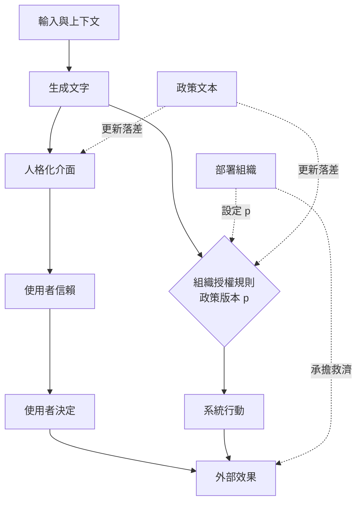

+++
title = "語氣不是權限：一個名字吞掉的四個角色"
date = "2026-09-09T00:58:05+08:00"
author = "TTL::0"
draft = false
isCJKLanguage = true
description = "2022 年，一名旅客的祖母過世，他在航空公司官網的對話介面詢問喪親票價。介面告訴他可以先購票、之後再申請喪親折扣。他依此購票，事後申請卻被拒絕，因為官網另一頁的正式政策寫明該折扣不適用於已完成的旅程。"
tags = [
    "分析論述", # term:AnalyticalEssay
    "AI 經濟與社會", # term:AiEconomics
    "擬人化", # term:Anthropomorphism
  ]
series = ["從代理量到可追責結果：AI 效用宣稱的轉換鏈"]
[ai_info]
    [ai_info.generation]
        model = "Claude Opus 5"
        agent = "Claude Code VSCode Extension 2.1.261"
    [ai_info.refinement]
        model = "Claude Opus 5"
        agent = "Claude Code VSCode Extension 2.1.263"
+++

<!--more-->

## 導言

2022 年，一名旅客的祖母過世，他在航空公司官網的對話介面詢問喪親票價。介面告訴他可以先購票、之後再申請喪親折扣。他依此購票，事後申請卻被拒絕，因為官網另一頁的正式政策寫明該折扣不適用於已完成的旅程。

2024 年，卑詩省民事解決法庭認定該公司構成疏忽性不實陳述，判賠 650.88 加元的損害。判決書裡記載了公司的一項抗辯：對話介面是一個分離的法律實體，應對自己的行為負責。法庭用了「remarkable」這個詞來形容這個主張。[Moffatt v. Air Canada, 2024 BCCRT 149](https://www.canlii.org/en/bc/bccrt/doc/2024/2024bccrt149/2024bccrt149.html)

這個抗辯之所以值得記下來，不是因為它荒謬，而是因為**它精確地說出了介面設計實際造成的認知效果**。那個介面使用第一人稱，它承諾了一件事，而公司內部真的把它當成一個獨立於官網的東西來管理——否則兩處的政策不會不一致。抗辯只是把這個內部狀態說出來。

法庭的判定則指出另一件事：責任從來沒有移動過。**能說話的介面可以產生行動者的外觀，但它不會因此取得行動權，也不會因此取得責任。** 本文要處理的問題是：那個外觀是怎麼產生的、它吞掉了哪幾個角色、以及要把那幾個角色分開需要記下什麼。

## 分析

### 分佈裡沒有權限

模型的輸出是一個條件分佈：給定輸入 $x$ 與上下文 $c$，輸出 $y\sim p_\theta(y\mid x,c)$。這個分佈描述文字如何被產生。它不包含付款權、政策變更權，也不包含法律人格。

外部後果需要另一個函數，由組織設定：

$$
a(y,u,p)\in\{0,1\},
$$

其中 $u$ 是使用者角色，$p$ 是當時生效的政策版本。**擬人化**（Anthropomorphism） <!-- term:Anthropomorphism -->是以人的意圖、知識或意志描述系統行為的傾向，它不必然預設使用者相信系統具有人格。1994 年的「電腦即社會行動者」實驗顯示，人們會對電腦套用社會規則，而且不需要相信電腦真的是人。[Nass、Steuer 與 Tauber](https://doi.org/10.1145/191666.191703)

> [!IMPORTANT]
> **擬人化** <!-- term:Anthropomorphism --> (Anthropomorphism): 以人的意圖、知識或意志描述系統行為的傾向，不必然預設使用者相信系統具有人格。 <!-- anchor:Anthropomorphism -->


所以流暢的第一人稱語氣有兩個效果，且兩者方向相反。它降低互動成本，也提高採納率——而採納率提高會同時放大正確採納與錯誤採納。

### 採納率提高不是單向的好事

下面的實驗把答案正確率固定，只改介面框架帶來的採納率，並在三種損害水準下計算淨值。

```python
import random
# 答案正確率固定，只改介面框架帶來的採納率。
N, ACC = 200_000, 0.92
def simulate(trust, harm, seed=17):
    rng = random.Random(seed)
    adopted = wrong = 0
    for _ in range(N):
        correct = rng.random() < ACC
        if rng.random() < trust:
            adopted += 1
            wrong += int(not correct)
    right = adopted - wrong
    return adopted, wrong, right * 1.0 - wrong * harm

for harm in (2.0, 12.0, 40.0):
    print(f"每件誤導損害 = {harm}")
    for trust, label in ((0.45, "工具式框架"), (0.75, "人格化框架")):
        a, w, net = simulate(trust, harm)
        print(f"  {label}  採納 {a:>7,}（{a/N:>5.1%}）  錯誤採納 {w:>6,}  淨值 {net:>12,.0f}")
    print()
```

實際執行的輸出：

```text
每件誤導損害 = 2.0
  工具式框架  採納  89,801（44.9%）  錯誤採納  7,098  淨值       68,507
  人格化框架  採納 149,960（75.0%）  錯誤採納 12,054  淨值      113,798

每件誤導損害 = 12.0
  工具式框架  採納  89,801（44.9%）  錯誤採納  7,098  淨值       -2,473
  人格化框架  採納 149,960（75.0%）  錯誤採納 12,054  淨值       -6,742

每件誤導損害 = 40.0
  工具式框架  採納  89,801（44.9%）  錯誤採納  7,098  淨值     -201,217
  人格化框架  採納 149,960（75.0%）  錯誤採納 12,054  淨值     -344,254
```

損害為 $2.0$ 時，人格化框架的淨值高出約 66%。損害為 $40.0$ 時，它的淨值比工具式框架低了 14 萬。

**同一個介面設計，在兩種損害水準下的正確答案相反。** 這使得「人格化介面是否恰當」不是一個可以脫離用途回答的問題。而實務中這個決定通常由品牌與轉換率負責，那兩個部門不掌握損害資料。

還要注意錯誤採納的絕對量：從 7,098 件升到 12,054 件。人格化沒有讓模型變差，它讓同樣的錯誤率接觸到更多的決策。

### 一個名字吞掉四個角色

那個外觀真正遮蔽的東西不是模型的能力，是四個角色的分工。一次對外互動至少有四個角色：誰生成了那段文字、誰授權它成為承諾、誰執行了後續動作、誰在出錯時提供救濟。

介面給自己一個名字，這四個角色就都可以被讀成那個名字。下面的程式把可稽核的最低要求寫成一個檢查。

```python
# 一次對外互動的可稽核紀錄：四個角色必須各自有名字。
ROLES = ("generator", "authorizer", "executor", "remedy")

def trace(record):
    named = {r: record.get(r) for r in ROLES}
    missing = [r for r, v in named.items() if not v]
    collapsed = [r for r, v in named.items() if v == record.get("display_name")]
    if missing:
        return f"不可稽核：{missing} 無人承擔"
    if collapsed:
        return f"角色塌縮：{collapsed} 被介面名稱吸收"
    return "可稽核"

records = [
    {"display_name": "Aria", "generator": "Aria",
     "authorizer": "Aria", "executor": "Aria", "remedy": "Aria"},
    {"display_name": "Aria", "generator": "llm-svc@2026-06",
     "authorizer": "refund-policy@v14", "executor": "payments-api"},
    {"display_name": "Aria", "generator": "llm-svc@2026-06",
     "authorizer": "refund-policy@v14", "executor": "payments-api",
     "remedy": "customer-relations-queue"},
]
for r in records:
    print(f"[{trace(r)}]")
    print(f"  {r}\n")
```

實際執行的輸出：

```text
[角色塌縮：['generator', 'authorizer', 'executor', 'remedy'] 被介面名稱吸收]
  {'display_name': 'Aria', 'generator': 'Aria', 'authorizer': 'Aria', 'executor': 'Aria', 'remedy': 'Aria'}

[不可稽核：['remedy'] 無人承擔]
  {'display_name': 'Aria', 'generator': 'llm-svc@2026-06', 'authorizer': 'refund-policy@v14', 'executor': 'payments-api'}

[可稽核]
  {'display_name': 'Aria', 'generator': 'llm-svc@2026-06', 'authorizer': 'refund-policy@v14', 'executor': 'payments-api', 'remedy': 'customer-relations-queue'}
```

第一筆紀錄是那個抗辯的資料結構形式。四個欄位都填了，而且都填同一個值——所以它在形式上完整，在稽核上無用。

第二筆是實務中最常見的狀態。生成、授權、執行都有具體的技術識別，而救濟欄是空的。這個狀態的特徵是：**日常運作完全正常，只有在出錯時才會發現沒有人接。**

第三筆是可稽核的最低形式。值得注意的是授權欄填的是政策版本，不是一個人名。這是刻意的——授權來自一份可被引用、可被比對的政策文本，而不是來自某個當班的人。

### 一句話為什麼會成為公司的承諾

把個案的結果往回推，那個判定的因果鏈相當短：公司在自己的官方網站提供對話介面；介面的輸出與正式政策衝突；旅客依賴輸出做了不可逆的購買；公司拒絕事後折扣；爭議因此進入法庭。

鏈上沒有任何一步需要「機器有惡意」。失效的是政策一致性——同一家公司在兩個通道上說了不同的話。

歐盟 AI Act 第 50 條要求直接與自然人互動的 AI 系統原則上應告知對方正在與 AI 互動。這條規範處理的是辨識問題，它不改變部署者的責任歸屬。[Regulation (EU) 2024/1689](https://eur-lex.europa.eu/legal-content/EN/TXT/?uri=celex%3A32024R1689)

### 多通道的政策版本落差

政策一致性的失效有一個結構性原因：各通道的更新速度不同，而回答量最大的通道經常是更新最慢的那個。

```python
# 政策在第 0 天更新。各通道的更新落差不同，回答量也不同。
POLICY_DAY = 0
CHANNELS = (("官方政策頁", 0, 1_000), ("客服人員話術", 5, 4_000), ("對話介面索引", 21, 60_000))
HORIZON = 30

total = stale = 0
print(f"{'通道':<12}{'更新落差(天)':>12}{'每日詢問':>10}{'落差期內回答':>14}{'其中過期':>10}")
for name, lag, per_day in CHANNELS:
    answers = per_day * HORIZON
    stale_answers = per_day * lag
    total += answers
    stale += stale_answers
    print(f"{name:<12}{lag:>12}{per_day:>10,}{answers:>14,}{stale_answers:>10,}")
print()
print(f"30 天內全通道回答 {total:,} 次，其中依過期政策回答 {stale:,} 次（{stale/total:.1%}）")
print(f"過期回答中有 {60_000*21/stale:.1%} 來自對話介面這一個通道")
```

實際執行的輸出：

```text
通道               更新落差(天)      每日詢問        落差期內回答      其中過期
官方政策頁                  0     1,000        30,000         0
客服人員話術                 5     4,000       120,000    20,000
對話介面索引                21    60,000     1,800,000 1,260,000

30 天內全通道回答 1,950,000 次，其中依過期政策回答 1,280,000 次（65.6%）
過期回答中有 98.4% 來自對話介面這一個通道
```

政策頁在第 0 天就是正確的。而 65.6% 的回答依據過期政策，其中 98.4% 來自那個更新最慢、回答量最大的通道。

這解釋了為什麼「官網上寫得很清楚」不構成抗辯。**公司說了兩次話，而聽到第二次的人多了六十倍。** 這個結構不需要任何人疏忽就會出現：對話介面的索引重建有工程成本，而政策頁只要改一段文字。

### 兩條線：外觀與權力

下圖把介面的外觀與實際的權力路徑分開畫。它要回答的閱讀問題是：使用者的信賴沿哪條線走，而外部效果沿哪條線走。



兩條虛線指向同一份政策文本，而它們的更新落差不同。這是個案裡真正的失效點：使用者信賴那一條線讀到的是舊政策，而組織授權那一條線用的是新政策。

## 反思

擬人化 <!-- term:Anthropomorphism -->本身不是缺陷。專業團隊使用「模型認為」作為技術簡寫、且所有人都知道輸出不會自動執行時，第一人稱沒有遮蔽任何權限。所以本文不主張所有第一人稱都具操控性；它主張第一人稱的成本隨損害與使用者的資訊不對稱而上升。

一個反例可以標出另一側邊界。緊急警報系統的設計常刻意提高社會存在感，因為需要的是立即回應而不是審慎評估。完全去人格化的警報可能被忽略，而那個代價高於過度信賴的代價。第一個實驗的低損害情形對應的正是這種場合。

主張的第二個邊界關於揭露。告知使用者正在與 AI 互動，處理的是辨識問題——使用者知道對面是什麼。它不處理信賴校正問題，因為知道對面是 AI 並不告訴使用者這句話的依據是什麼、依據的政策是哪一版、以及說錯了要找誰。所以「已揭露」不能推出「已治理」，兩者針對不同的失效。

第三個邊界比較難處理。四角色紀錄的可稽核性依賴一個前提：授權可以被指向一份具體的政策版本。當授權來自模型自身的判斷——例如一個被賦予退款額度的代理——授權欄要填什麼並不清楚。填模型版本會把政策決定與生成混為一談，填當班主管會把一個沒有人看過的動作歸給他。這個問題超出本文範圍，但它使代理系統的稽核比單輪問答的稽核困難得多。

最後是實驗的限制。第一個實驗的兩個採納率是我指定的，它證明「同一介面設計在兩種損害水準下正確答案相反」，不估計人格化對真實信賴的效果——那需要隨機介面實驗。第三個實驗的更新落差與回答量同樣是指定值，它說明「量最大的通道落差最長時會發生什麼」，不主張所有組織都是這個形狀。

## 實務對比

**描述一次自動決定。** 錯誤做法是說「AI 拒絕了這筆申請」。較準確的描述是「模型產生分數，組織設定門檻，系統依 v14 政策拒絕」。後者保留模型的因果作用，也留下一個可被追問的決策者。

**設計介面的自我指稱。** 錯誤做法是讓角色說「我已經替你核准了」，卻不顯示政策版本或救濟入口。實測顯示人格化把錯誤採納從 7,098 件推到 12,054 件。正確做法是說明「系統依 2026-06 政策完成初步判定」，並提供依據、人工覆核與申訴入口。社交便利仍在，責任邊界不再消失。

**更新一項政策。** 錯誤做法是改完政策頁就視為完成。實測顯示回答量最大的通道落差 21 天時，65.6% 的回答依據過期政策。正確做法是把政策更新寫成一次跨通道的發布，並以「最慢通道的落差」而不是「政策頁的時間」作為生效時間。

**回應一次介面誤導的爭議。** 錯誤做法是主張介面是獨立的實體，或主張正式政策已在官網公開。該個案顯示前者被法庭形容為 remarkable，後者無法處理「公司說了兩次話」這個事實。正確做法是承認兩個通道的輸出都是公司的陳述，並修正使兩者同源。

**建立互動的稽核紀錄。** 錯誤做法是記錄對話全文與時間戳。實測顯示這種紀錄可以四個角色都填同一個介面名稱，形式完整而稽核無用。正確做法是四個欄位分別記生成服務版本、授權政策版本、執行系統、以及救濟隊列。

## 結論

語言介面能產生行動者的外觀，卻不能自行取得行動權或責任。那個外觀的代價不在於使用者是否相信它有人格，而在於它讓四個角色可以被讀成同一個名字。

本文的量測給出四個結果：

1. **人格化的正確與否取決於損害水準。** 每件誤導損害為 $2.0$ 時人格化框架淨值高出約 66%；為 $40.0$ 時它比工具式框架低 14 萬。
2. **採納率提高會等比放大錯誤採納。** 正確率不變的情形下，錯誤採納從 7,098 件升到 12,054 件。
3. **四個欄位可以都填同一個名字，形式完整而稽核無用。** 而實務中最常見的狀態是救濟欄空著——日常運作正常，出錯時沒有人接。
4. **「官網寫得很清楚」不構成抗辯。** 當回答量最大的通道更新落差 21 天時，65.6% 的回答依據過期政策，其中 98.4% 來自那一個通道。

所以評估一個對話介面是否適當，要問四件事：誰生成、誰授權、誰執行、誰提供救濟。

四個答案都能指向一個具體的版本或隊列時，擬人化 <!-- term:Anthropomorphism -->是一種便利。四個答案指向同一個名字時，那個名字承擔不了任何東西——它只是把責任從可追問的位置移到一個不存在的位置。