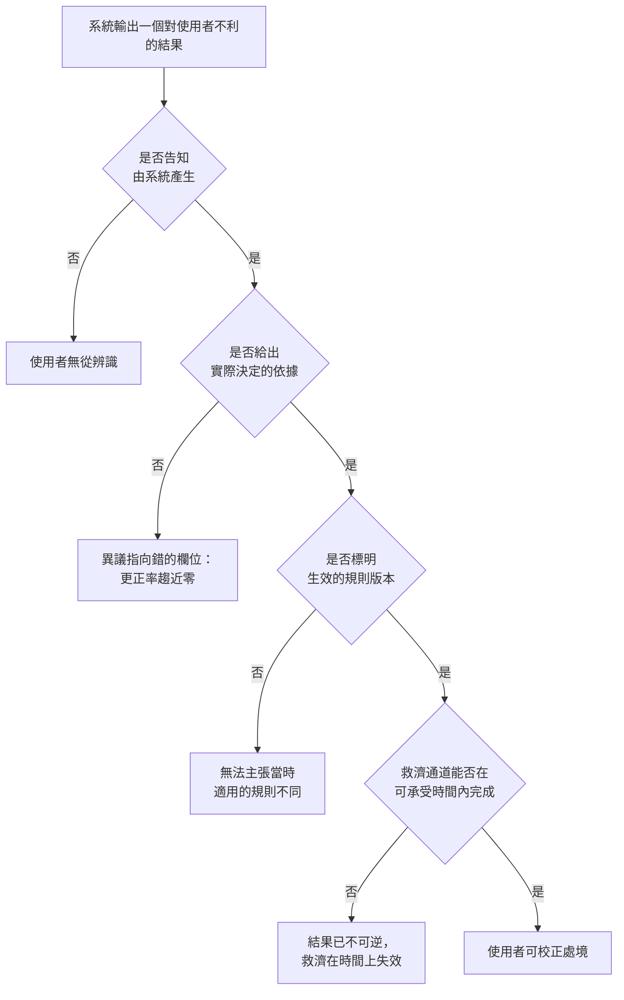

+++
title = "告知之後還缺什麼：揭露的資格條件與救濟鏈"
date = "2026-09-09T01:14:06+08:00"
author = "TTL::0"
draft = false
isCJKLanguage = true
description = "荷蘭稅務機關在 2010 年代使用風險分類系統篩檢育兒津貼的詐領嫌疑。數萬家庭被要求返還高額款項，其中大量指認後來被認定是錯的。荷蘭資料保護機關在 2021 年對稅務機關開罰 275 萬歐元，理由包含以國籍作為風險指標而非法處理個人資料。議會調查報告以「未曾見過的不公」為題，認定法治的基本原則遭到違反，內閣隨後在 2021 年 1 月總辭。[Autoriteit Persoonsgegevens "
tags = [
    "分析論述", # term:AnalyticalEssay
  ]
series = ["從代理量到可追責結果：AI 效用宣稱的轉換鏈"]
[ai_info]
    [ai_info.generation]
        model = "Claude Opus 5"
        agent = "Claude Code VSCode Extension 2.1.261"
    [ai_info.refinement]
        model = "Claude Opus 5"
        agent = "Claude Code VSCode Extension 2.1.263"
+++

<!--more-->

## 導言

荷蘭稅務機關在 2010 年代使用風險分類系統篩檢育兒津貼的詐領嫌疑。數萬家庭被要求返還高額款項，其中大量指認後來被認定是錯的。荷蘭資料保護機關在 2021 年對稅務機關開罰 275 萬歐元，理由包含以國籍作為風險指標而非法處理個人資料。議會調查報告以「未曾見過的不公」為題，認定法治的基本原則遭到違反，內閣隨後在 2021 年 1 月總辭。[Autoriteit Persoonsgegevens 罰款決定](https://www.autoriteitpersoonsgegevens.nl/en/documents/fine-tax-administration-discriminatory-and-unlawful-data-processing)

這個個案有一個容易被忽略的性質：**它不是一個「沒有揭露」的案子。** 該制度是公開的法定制度，運作方式在法律層面有依據。海牙地方法院在 2020 年 2 月就另一套風險指標系統作出判決，認定相關立法違反歐洲人權公約第 8 條，理由之一正是透明度不足。[SyRI 判決，2020](https://uitspraken.rechtspraak.nl/details?id=ECLI:NL:RBDHA:2020:1878)

被指認的家庭知道有一個系統在運作。他們不知道的是三件更具體的事：自己被標記的依據是什麼、當時適用的是哪一版規則、以及要向誰申訴才能在可承受的時間內得到結果。異議程序存在，但走完它要數年，而返還命令立即生效。

**所以問題不是使用者是否知道對面有 AI，而是使用者拿到的資訊能不能讓他修正自己的處境。** 本文要處理的問題是：一次揭露要附帶什麼才具備治理效力，以及當它缺少那些東西時，缺口具體落在哪裡。

## 分析

### 揭露處理的是辨識，不是校正

歐盟 AI Act 第 50 條要求直接與自然人互動的 AI 系統原則上應告知對方正在與 AI 互動。[Regulation (EU) 2024/1689](https://eur-lex.europa.eu/legal-content/EN/TXT/?uri=celex%3A32024R1689) 這條規範解決的是辨識問題：使用者知道對面是什麼。

辨識與校正是兩件不同的事。知道對面是 AI，並不告訴使用者這個回答的依據是什麼、依據哪一版規則、以及說錯了要找誰。校正需要的是這三樣，而它們與「是不是 AI」無關——同樣的三樣東西對人類客服的回答也是必要的。

下面的實驗把揭露分成四種形式，比較它們對使用者行為的作用。使用者的行為模型很簡單：資訊越足夠，二次確認的比例越高；申訴入口存在時，未被攔下的錯誤還有機會被事後救濟。

```python
# 揭露的四種形式，對使用者的信賴校正各有什麼作用。
# 使用者的行為模型：依「可校正資訊量」決定是否二次確認。
N = 100_000
FORMS = (
    ("無揭露",                 0.00, 0.00),
    ("僅告知這是 AI",           0.05, 0.00),
    ("告知＋依據來源",           0.35, 0.10),
    ("告知＋依據＋政策版本",      0.55, 0.35),
    ("告知＋依據＋版本＋申訴入口", 0.70, 0.85),
)
ERR = 0.08          # 回答錯誤率
HARM_UNCAUGHT = 30.0
HARM_CAUGHT_LATE = 6.0    # 事後透過申訴取得救濟，損害較小

print(f"{'揭露形式':<26}{'二次確認率':>11}{'可救濟率':>10}{'未救濟損害':>12}{'總損害':>11}")
for name, verify, remedy in FORMS:
    errors = N * ERR
    caught_before = errors * verify
    rest = errors - caught_before
    remedied = rest * remedy
    uncaught = rest - remedied
    total = uncaught * HARM_UNCAUGHT + remedied * HARM_CAUGHT_LATE
    print(f"{name:<26}{verify:>11.0%}{remedy:>10.0%}{uncaught:>12,.0f}{total:>11,.0f}")
```

實際執行的輸出：

```text
揭露形式                            二次確認率      可救濟率       未救濟損害        總損害
無揭露                                0%        0%       8,000    240,000
僅告知這是 AI                           5%        0%       7,600    228,000
告知＋依據來源                           35%       10%       4,680    143,520
告知＋依據＋政策版本                        55%       35%       2,340     77,760
告知＋依據＋版本＋申訴入口                     70%       85%         360     23,040
```

「僅告知這是 AI」把總損害從 240,000 降到 228,000，改善 5%。加上依據、版本與申訴入口之後降到 23,040，改善約 90%。

**第二列與第五列的法規遵循狀態相同，效果相差十七倍。** 這是本文的核心觀察：揭露義務的最低要求與治理效力之間有一段距離，而那段距離不由揭露的「有無」決定，由揭露攜帶了什麼決定。

### 依據必須是實際決定結果的那一項

第二個資格條件比第一個難滿足。給出「依據」不夠——那個依據必須是實際決定該筆結果的東西。

一個看起來合理但不決定結果的依據，會讓使用者去修正一個不影響結果的欄位。他花了力氣，走完了流程，而處境沒有改變。

```python
import random
# 系統都提供「依據」。差別只在依據有多大機率指向實際決定該筆結果的欄位。
N, SEED = 60_000, 31

def run(fidelity):
    rng = random.Random(SEED)
    contested = corrected = 0
    for _ in range(N):
        deciding_wrong  = rng.random() < 0.09   # 真正決定結果的欄位在本筆有誤
        plausible_wrong = rng.random() < 0.09   # 另一個看起來合理、但不決定結果的欄位有誤
        points_at_deciding = rng.random() < fidelity
        shown_wrong = deciding_wrong if points_at_deciding else plausible_wrong
        if shown_wrong:                          # 使用者只能對看到的依據提出異議
            contested += 1
            corrected += int(points_at_deciding and deciding_wrong)
    return contested, corrected

print(f"{'依據忠實度':>10}{'提出異議':>10}{'成功更正':>10}{'更正率':>9}")
for f in (0.0, 0.3, 0.6, 1.0):
    c, k = run(f)
    print(f"{f:>10.1f}{c:>10,}{k:>10,}{k/max(c,1):>9.1%}")
print()
print("四列的『已提供依據』皆為真；申訴量幾乎相同，可稽核紀錄無法區分。")
```

實際執行的輸出：

```text
     依據忠實度      提出異議      成功更正      更正率
       0.0     5,477         0     0.0%
       0.3     5,544     1,672    30.2%
       0.6     5,529     3,351    60.6%
       1.0     5,528     5,528   100.0%

四列的『已提供依據』皆為真；申訴量幾乎相同，可稽核紀錄無法區分。
```

四列的異議量落在 5,477 到 5,544 之間，幾乎沒有差別。成功更正從 0 件到 5,528 件。

這使**申訴量不能作為系統健康的指標**。一個依據完全不忠實的系統，會產生與忠實系統相同的申訴量，而它的更正率是零。從營運報表看，兩者的差別只出現在一個很少被單獨列出的比率上：申訴中實際導致結果改變的比例。

荷蘭個案的形狀在這裡：家庭知道自己被要求返還，也知道有異議程序，卻無法得知標記的依據。他們的異議因此無法指向那個實際造成結果的判準。

### 救濟通道的產能是第三個資格條件

第三個條件是救濟通道能否在可承受的時間內完成。一個存在但排隊數年的申訴程序，在使用者的時間尺度上等於不存在——因為返還命令已經執行，而返還本身造成的損害不可逆。

這個條件與前兩個的性質不同：它不是資訊問題，是資源配置問題。而它有一個與人工覆核相同的塌陷曲線——通道產能固定時，申訴量上升會使等待時間線性成長，而使用者的可承受時間是一個固定的上限。

下圖把三個資格條件排成一條鏈。它要回答的問題是：一次揭露在哪一段失去治理效力。



四個菱形是必要條件的合取。四個失效狀態的共同特徵是：在法規遵循的檢核表上都可以填「已揭露」。

### 為什麼版本是獨立的一項

政策版本容易被當成依據的一部分，但它承擔一個不同的功能。依據回答「我為什麼得到這個結果」，版本回答「當時適用的規則是哪一份」。

這兩個問題在爭議中分開。若使用者能證明當時生效的規則與系統所用的不同，他不需要證明自己的資料無誤——規則適用錯誤本身就是理由。缺少版本標記時，這條路徑不存在，而使用者只剩下爭論事實這一條路，那條路的舉證責任重得多。

## 反思

四個資格條件不是對所有輸出的要求。當一個結果對使用者沒有不利效果時，這些條件的成本沒有對應的收益——為一次搜尋建議附上規則版本與申訴入口是形式主義。四個條件的觸發點是輸出對使用者的處境產生不可逆的不利影響。

主張的第一個邊界是揭露本身的代價。在某些場合，說明實際依據會使系統可被規避——詐欺偵測與資安是典型例子。這是一個真實的衝突，本文不主張透明度總是優先。可以主張的是：選擇不揭露依據時，救濟通道的產能必須相應提高，因為使用者已經失去自行校正的能力。用「不能說」換來的是「必須有人替他查」。

一個反例可以標出另一側。假設四個條件全部滿足，而使用者仍然受害——因為他不知道自己有資格申訴，或申訴需要的文件他拿不到。四個條件處理的是通道的存在與品質，不處理使用者的取用能力。荷蘭個案裡有相當比例的受影響家庭處於這種狀態。所以四個條件是必要的，不是充分的；第五項是通道的可觸及性，而它通常需要主動聯繫而不是被動等待。

第二個邊界關於「實際決定的依據」在技術上是否可得。對線性規則系統，決定該筆結果的項可以精確指出。對高維模型，事後歸因方法給出的是近似，而不同方法可以給出不同的解釋。第二個實驗把忠實度當成一個可調的純量，這掩蓋了一個更難的問題：忠實度本身經常無法被量測。此時能做的是記錄解釋方法與其已知的失效情形，而不是把近似解釋當成依據交付。

最後是實驗的限制。第一個實驗的四組行為參數是我指定的，它證明「揭露的形式決定效力，而法規遵循狀態不決定效力」，不估計任何真實使用者的二次確認率。第二個實驗把依據的忠實度與使用者的異議行為都簡化成單一機率，真實流程裡使用者會對多個欄位同時提出異議，那會使更正率的曲線變得平緩但不會改變它的方向。

## 實務對比

**滿足 AI 揭露義務。** 錯誤做法是在對話開頭加一句「您正在與 AI 助理對話」，並視為完成。實測顯示這只把總損害從 240,000 降到 228,000。正確做法是把揭露設計成一組欄位：這是系統產生的、依據是哪些資料、適用哪一版規則、以及申訴入口在哪。

**提供決策依據。** 錯誤做法是給出一段可讀的說明，而不檢查那段說明是否指向實際決定結果的項。實測顯示忠實度為零時申訴量與忠實度為一時幾乎相同，而更正率是 0.0% 對 100.0%。正確做法是記錄該筆結果的決定項，並確認揭露內容與它一致。

**用申訴量評估系統。** 錯誤做法是把低申訴量讀成使用者滿意，或把高申訴量讀成系統有問題。實測顯示申訴量對依據的忠實度幾乎不敏感。正確做法是追蹤申訴中實際導致結果改變的比例，並把它與依據的忠實度一起檢視。

**設計救濟通道。** 錯誤做法是建立程序而不配置產能，並以程序存在作為治理證據。荷蘭個案顯示異議走完要數年，而返還命令立即生效。正確做法是先確定不利結果的可逆時間窗，再把救濟通道的完成時間設在那個窗內。

**選擇不公開決策依據。** 錯誤做法是以規避風險為理由完全關閉解釋，且不做任何補償設計。正確做法是在關閉解釋的同時提高救濟通道的產能與主動性，因為使用者已經失去自行校正的能力，那個能力必須由組織代為執行。

## 結論

告知使用者正在與 AI 互動，處理的是辨識問題。使用者能否修正自己的處境，是另一個問題，而它需要三樣揭露之外的東西。

本文的量測給出四個結果：

1. **法規遵循狀態相同，治理效力可以相差十七倍。** 僅告知這是 AI 時總損害 228,000，附上依據、版本與申訴入口後為 23,040。
2. **依據不忠實時，使用者的努力不改變結果。** 忠實度從 $1.0$ 降到 $0.0$，申訴量幾乎不變，更正率從 100.0% 降到 0.0%。
3. **申訴量不是系統健康的指標。** 它對依據的忠實度不敏感；能區分的是申訴中實際導致結果改變的比例。
4. **救濟通道的產能是一個獨立條件。** 一個排隊時間長於結果可逆時間窗的通道，在使用者的尺度上等於不存在。

所以一次揭露要具備治理效力，需要四樣東西同時到位：告知、實際決定的依據、生效的規則版本、以及在可承受時間內完成的救濟。

四樣缺任何一樣，剩下的都仍然可以在檢核表上填「已揭露」——這正是這個缺口難以被發現的原因。檢核表問的是有沒有說，而使用者需要的是能不能改。