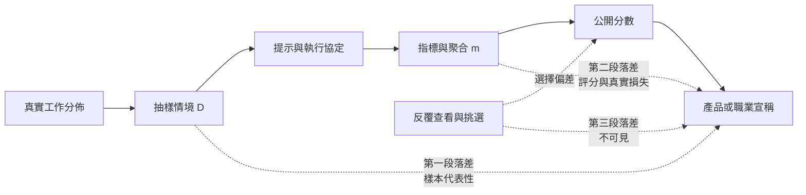

+++
title = "挑選之後的最佳值：公開分數與部署表現之間的三段落差"
date = "2026-09-09T01:32:07+08:00"
author = "TTL::0"
draft = false
isCJKLanguage = true
description = "2021 年 6 月，一份發表於 JAMA Internal Medicine 的外部驗證研究檢視了一套被廣泛部署的敗血症預警模型。研究在密西根醫學中心以 27,697 名病人的 38,455 次住院進行驗證，測得的接收者操作特徵曲線下面積為 0.63，而開發者公布的區間是 0.76 到 0.83。該模型漏掉了 67% 的敗血症病人，同時對全部住院病人中的 18% 發出警示。[Wong 等人，JA"
tags = [
    "分析論述", # term:AnalyticalEssay
    "AI 經濟與社會", # term:AiEconomics
    "適應性過擬合", # term:AdaptiveOverfitting
    "校準", # term:Calibration
    "選擇偏差", # term:SelectionBias
  ]
series = ["從代理量到可追責結果：AI 效用宣稱的轉換鏈"]
[ai_info]
    [ai_info.generation]
        model = "Claude Opus 5"
        agent = "Claude Code VSCode Extension 2.1.261"
    [ai_info.refinement]
        model = "Claude Opus 5"
        agent = "Claude Code VSCode Extension 2.1.263"
+++

<!--more-->

## 導言

2021 年 6 月，一份發表於 JAMA Internal Medicine 的外部驗證研究檢視了一套被廣泛部署的敗血症預警模型。研究在密西根醫學中心以 27,697 名病人的 38,455 次住院進行驗證，測得的接收者操作特徵曲線下面積為 0.63，而開發者公布的區間是 0.76 到 0.83。該模型漏掉了 67% 的敗血症病人，同時對全部住院病人中的 18% 發出警示。[Wong 等人，JAMA Intern Med 2021](https://jamanetwork.com/journals/jamainternalmedicine/fullarticle/2781307)

開發者公布的數字不必是假的。它是在某一組資料、某一套定義、某一種評分程序下測得的值。外部驗證測得的也是真值——在另一組資料、另一套定義、另一種部署條件下。

**兩個都是真的，而它們之間的距離足以改變採購決定。** 這個距離不是誰造假造成的，它由三段獨立的落差組成，而其中至少一段在公開分數裡看不到。

本文要處理的問題是：**一個有限測量在什麼條件下足以支撐更大的宣稱，以及當條件不成立時，落差來自哪三段。**

## 分析

### 分數估計的是什麼

對模型 $f$、資料集 $D$ 與指標 $m$，分數是

$$
\hat S(f;D,m)=\frac{1}{n}\sum_{i=1}^{n}m(f(x_i),y_i).
$$

這個量直接估計的只有一件事：$D$ 與 $m$ 共同定義的那個任務上的期望表現。從它跨到工作效用需要三段中介，任一段失效都會使一個準確的分數變成錯誤的市場訊號。

第一段是**樣本代表性**：$D$ 中的分佈與部署時遇到的分佈是否相同。敗血症個案的落差有相當部分落在這裡——不同醫院的病人組成、編碼慣例與敗血症的操作定義都不同。

第二段是**評分與真實損失的一致性**：$m$ 所懲罰的錯誤與部署時真正代價高的錯誤是否同一類。18% 的住院病人收到警示，這個數字在曲線下面積裡不出現，卻決定臨床上是否可用。

第三段是**選擇程序**：公布的那個數字是從幾次嘗試中挑出來的。這一段與前兩段不同，它不是模型或資料的性質，是報告程序的性質，而它通常完全不可見。

一份 2022 年的整體性評估研究以多情境、多指標的方式評測語言模型，指標包含準確率、**校準**（Calibration） <!-- term:Calibration -->、穩健性、公平性與效率，目的正是暴露單一排名壓掉的取捨。[Holistic Evaluation of Language Models](https://arxiv.org/abs/2211.09110) 而反覆在同一測試集上查看並挑選最佳結果會形成**適應性過擬合**（Adaptive Overfitting） <!-- term:AdaptiveOverfitting -->；可重複使用留出集的研究把這項風險形式化。[Dwork 等人](https://pubmed.ncbi.nlm.nih.gov/26250683/)

> [!IMPORTANT]
> **校準** <!-- term:Calibration --> (Calibration): 模型輸出機率與實際正確率的一致程度。 <!-- anchor:Calibration -->
> **適應性過擬合** <!-- term:AdaptiveOverfitting --> (Adaptive Overfitting): 反覆在同一測試集上查看並挑選最佳結果，使公開分數高於真實泛化能力的偏差。 <!-- anchor:AdaptiveOverfitting -->


### 第三段：挑選本身能製造多少分數

下面的程式讓候選模型的真實正確率完全相同，只改在同一有限測試集上查看並挑選的次數。

```python
import random
# 候選模型的真實正確率完全相同，只改「在同一有限測試集上查看並挑選」的次數。
def best_score(trials, seed=21, n=100, p=0.70):
    rng = random.Random(seed)
    return max(sum(rng.random() < p for _ in range(n)) / n for _ in range(trials))

print("真實正確率一律 0.70，測試集 100 題：")
for trials in (1, 5, 20, 100, 1000):
    print(f"  查看 {trials:>4} 次 -> 公開的最佳分數 {best_score(trials):.3f}")
```

實際執行的輸出：

```text
真實正確率一律 0.70，測試集 100 題：
  查看    1 次 -> 公開的最佳分數 0.670
  查看    5 次 -> 公開的最佳分數 0.740
  查看   20 次 -> 公開的最佳分數 0.810
  查看  100 次 -> 公開的最佳分數 0.830
  查看 1000 次 -> 公開的最佳分數 0.850
```

真實能力一律是 $0.70$。查看 20 次得到 $0.810$，查看 1000 次得到 $0.850$。這 15 個百分點完全來自挑選，沒有任何一分來自模型。

### 挑選增益足以壓過真實差異

上一個結果本身容易被讀成「高分可能虛假」，那個讀法太弱。更強的問題是：一個真的更好的模型，在只跑一次的情況下，能不能在公開分數上贏過一個查看多次的對手。

```python
import random, statistics
# 甲隊只跑一次；乙隊查看 k 次取最佳。要贏，甲的真實正確率必須高出多少？
N, REPS = 100, 400

def once(p, seed): 
    rng = random.Random(seed)
    return sum(rng.random() < p for _ in range(N)) / N

def best(p, k, seed):
    rng = random.Random(seed)
    return max(sum(rng.random() < p for _ in range(N)) / N for _ in range(k))

BASE = 0.70
print(f"乙隊真實正確率 {BASE}，甲隊只跑一次。甲隊在公開分數上勝出的機率：")
for k in (1, 10, 50):
    print(f"  乙隊查看 {k:>2} 次")
    for lift in (0.00, 0.03, 0.06, 0.10):
        wins = sum(once(BASE + lift, 900 + r) > best(BASE, k, 5000 + r)
                   for r in range(REPS))
        print(f"    甲隊真實高出 {lift:+.2f} -> 勝率 {wins/REPS:>6.1%}")
```

實際執行的輸出：

```text
乙隊真實正確率 0.7，甲隊只跑一次。甲隊在公開分數上勝出的機率：
  乙隊查看  1 次
    甲隊真實高出 +0.00 -> 勝率  52.2%
    甲隊真實高出 +0.03 -> 勝率  69.2%
    甲隊真實高出 +0.06 -> 勝率  83.8%
    甲隊真實高出 +0.10 -> 勝率  93.2%
  乙隊查看 10 次
    甲隊真實高出 +0.00 -> 勝率   8.8%
    甲隊真實高出 +0.03 -> 勝率  21.5%
    甲隊真實高出 +0.06 -> 勝率  38.8%
    甲隊真實高出 +0.10 -> 勝率  67.5%
  乙隊查看 50 次
    甲隊真實高出 +0.00 -> 勝率   1.8%
    甲隊真實高出 +0.03 -> 勝率   7.0%
    甲隊真實高出 +0.06 -> 勝率  20.5%
    甲隊真實高出 +0.10 -> 勝率  47.2%
```

看最後一組。甲隊的真實正確率高出 10 個百分點——在這個尺度上是一個很大的差距——而它在公開分數上輸掉 52.8% 的比較。

這個結果把問題的性質改變了。挑選次數不只讓分數膨脹，它**讓排名的方向不可靠**。因此在不知道各方挑選次數的情況下，一份排行榜的相鄰名次不承載關於真實能力的資訊，而這一點無法由增加測試題數解決——它必須由登記挑選次數解決。

### Demo 的證據不對稱

第三段落差在展示場合有一個特別的形式。成功的展示與失敗的展示，在證據力上不對稱。

```python
# Demo 的證據不對稱：n 次成功能把錯誤率的上界壓到哪裡？
# 找出最大的 p，使得「n 次全成功」在 p 之下仍有 5% 以上的機率。
def upper_bound(n, conf=0.95):
    return 1 - (1 - conf) ** (1 / n)

print("連續成功次數 -> 錯誤率的 95% 上界")
for n in (1, 5, 20, 100, 1000):
    print(f"  {n:>4} 次全成功 -> 錯誤率可能高達 {upper_bound(n):>6.2%}")
print()
print("反方向：一次失敗即足以推翻的宣稱")
for claim, refuted in (("永不失敗", True), ("錯誤率低於 1%", False), ("平均表現優於人類", False)):
    print(f"  「{claim}」 -> 單次失敗即推翻：{refuted}")
```

實際執行的輸出：

```text
連續成功次數 -> 錯誤率的 95% 上界
     1 次全成功 -> 錯誤率可能高達 95.00%
     5 次全成功 -> 錯誤率可能高達 45.07%
    20 次全成功 -> 錯誤率可能高達 13.91%
   100 次全成功 -> 錯誤率可能高達  2.95%
  1000 次全成功 -> 錯誤率可能高達  0.30%

反方向：一次失敗即足以推翻的宣稱
  「永不失敗」 -> 單次失敗即推翻：True
  「錯誤率低於 1%」 -> 單次失敗即推翻：False
  「平均表現優於人類」 -> 單次失敗即推翻：False
```

20 次成功展示看起來很有說服力。它把錯誤率的上界壓到 13.91%——也就是說，一個每七次錯一次的系統，連續 20 次成功並不罕見。

反方向的三列同樣重要。單次失敗只推翻「永不失敗」這一種形式的宣稱；它不推翻「錯誤率低於 1%」，也不推翻「平均優於人類」。**所以以一次失敗 Demo 反駁一個統計性宣稱，犯的是同一類錯誤，只是方向相反。**

### 三段落差在圖上的位置

下圖把從真實工作分佈到市場宣稱之間的每一次選擇外化。它要回答的閱讀問題是：一個公開分數在哪些點上已經被縮窄。



三條虛線標出三段落差匯入宣稱的位置。前兩段可以由公開資料部分評估——資料集的組成與指標的定義都是可查的。第三段不行：挑選次數不在任何公開產物裡，除非它被主動登記。

## 反思

主張的第一個邊界是測量目標與部署任務完全相同的情形。當評測協定預先註冊、只執行一次、且樣本持續更新時，三段落差同時收窄，此時分數可以直接支撐一個狹窄的產品宣稱。所以本文不主張評測沒有價值，它主張評測的價值隨這三個條件的滿足程度變化。

一個反例可以標出另一側。假設某模型的公開分數完全誠實——只跑一次、預先註冊、資料未被污染——而它在部署後仍然表現差得多。原因可以是評分器與真實損失不一致：在指標上等價的兩種錯誤，在臨床上一種是延遲治療、另一種是不必要的抗生素。此時問題不在分數的產生程序，而在指標的選擇，而那個選擇通常不由部署方作出。

第二個邊界關於挑選次數的可登記性。要求登記挑選次數，預設了「一次嘗試」是可界定的。實務中提示調整、解碼參數與後處理都可以微調，而其中哪些算一次獨立嘗試沒有客觀界線。此時能做的是報告一個範圍與一個程序描述，而不是一個精確的次數；把不精確的次數當成精確的，會給人虛假的可比性。

第三個邊界關於曲線下面積這類單一聚合量。敗血症個案的 18% 警示率說明一個系統可以在排序指標上有數值、而在營運上不可用。這不是那個指標算錯了，是那個指標不承載警示負擔這個維度。所以增加指標數量有實質作用，但代價是取捨變得不可排序——多指標評估的結果通常無法產生一個名次，而市場需要名次。這個張力本文無法解決。

最後是實驗的限制。三個實驗都是二項抽樣模型，測試集大小固定為 100 題。第一與第二個實驗的挑選增益幅度與測試集大小直接相關——題數越多，同樣的挑選次數帶來的膨脹越小。它們證明「挑選可以製造分數並翻轉排名」，不估計任何真實排行榜的膨脹幅度。第三個實驗使用的是二項分佈的單邊上界，它假設各次展示獨立且同分佈，而真實展示的題目通常是挑過的，因此那個上界仍然偏樂觀。

## 實務對比

**引用一個評測分數。** 錯誤做法是把分數當成能力的度量。實測顯示真實正確率一律 $0.70$ 時，查看 1000 次可得到公開分數 $0.850$。正確做法是連同資料集版本、提示、解碼設定、評分器與嘗試次數一起引用；缺少最後一項時，把該分數視為上界而非估計。

**比較兩個模型的排名。** 錯誤做法是相信相鄰名次的順序。實測顯示真實高出 10 個百分點的模型，在對手查看 50 次的情況下輸掉 52.8% 的比較。正確做法是要求雙方登記嘗試次數，或改以雙方都未見過的封存資料重跑一次。

**用 Demo 建立可靠度預期。** 錯誤做法是把連續成功當成日常可靠度的證據。實測顯示 20 次全成功只能把錯誤率上界壓到 13.91%。正確做法是分開呈現三件事：能力上限、隨機抽取任務的平均表現、以及已知的失敗模式，並公開重試次數。

**用一次失敗反駁一個宣稱。** 錯誤做法是把單次失敗當成系統不可用的證明。實測顯示單次失敗只推翻「永不失敗」這一種形式。正確做法是先確認對方宣稱的形式：全稱宣稱可被單例推翻，統計宣稱需要樣本。

**採購一個有外部驗證落差的模型。** 錯誤做法是判定開發者的數字造假，或判定外部驗證有偏。敗血症個案顯示兩個數字可以都是真的。正確做法是逐段定位落差：病人組成、標籤定義、指標與部署條件各貢獻多少，並要求在自己的資料上重測一次。

## 結論

評測分數與展示都是能力的測量介面，不是能力本身。分數到宣稱之間有三段落差，而它們的可見度不同。

本文的量測給出四個結果：

1. **挑選本身可以製造分數。** 真實正確率一律 $0.70$ 時，查看 20 次得 $0.810$，查看 1000 次得 $0.850$。
2. **挑選增益足以翻轉排名。** 真實高出 10 個百分點的模型，對上查看 50 次的對手，在公開分數上輸掉 52.8% 的比較。
3. **成功展示的證據力遠低於直覺。** 20 次全成功只能把錯誤率上界壓到 13.91%。
4. **證據不對稱是雙向的。** 單次失敗推翻全稱宣稱，但不推翻統計宣稱；以一次失敗否定平均表現，與以 20 次成功宣稱可靠，犯的是同一類錯誤。

所以一個公開分數要成為可信的市場訊號，必須保留五樣東西：資料、提示、指標、挑選程序、以及部署條件的差異。

前四樣是報告紀律，第五樣需要在採購方自己的資料上重測一次。這兩件事都做了，分數仍然只支撐一個狹窄的宣稱——但那個宣稱可以被推翻，而這正是它與行銷語言的差別。