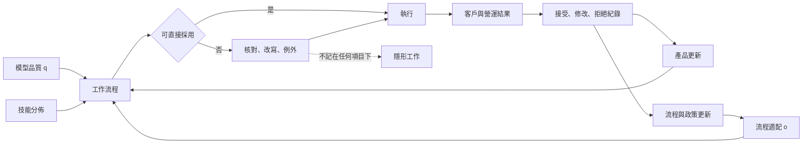

+++
title = "組織那一半的因果：同一個工具為何產生相反的結果"
date = "2026-09-09T01:49:08+08:00"
author = "TTL::0"
draft = false
isCJKLanguage = true
description = "一項涵蓋 5,000 多名客服人員的實地研究發現，導入生成式 AI 助理後，每小時解決問題數平均提高約 15%。效果並不均勻：增益集中在較新、較低技能的工作者，而經驗最豐富的一群幾乎沒有改善。研究把機制歸給知識擴散——工具從高績效對話中萃取可用模式，讓新手更快採用那些模式。[Generative AI at Work](https://academic.oup.com/qje/article/14"
tags = [
    "分析論述", # term:AnalyticalEssay
    "AI 經濟與社會", # term:AiEconomics
    "技術與組織互補", # term:OrganizationalComplementarity
    "資料回流", # term:DataFeedbackLoop
    "人工補償", # term:HumanCompensation
  ]
series = ["從代理量到可追責結果：AI 效用宣稱的轉換鏈"]
[ai_info]
    [ai_info.generation]
        model = "Claude Opus 5"
        agent = "Claude Code VSCode Extension 2.1.261"
    [ai_info.refinement]
        model = "Claude Opus 5"
        agent = "Claude Code VSCode Extension 2.1.263"
+++

<!--more-->

## 導言

一項涵蓋 5,000 多名客服人員的實地研究發現，導入生成式 AI 助理後，每小時解決問題數平均提高約 15%。效果並不均勻：增益集中在較新、較低技能的工作者，而經驗最豐富的一群幾乎沒有改善。研究把機制歸給知識擴散——工具從高績效對話中萃取可用模式，讓新手更快採用那些模式。[Generative AI at Work](https://academic.oup.com/qje/article/140/2/889/7990658)

2025 年一項隨機對照試驗給出方向相反的結果。16 名長期維護大型開源專案的資深開發者在 246 項任務上被隨機分派是否使用 AI 工具，測得的完成時間**增加**了 19%。同一批參與者事後估計自己快了約 20%。[METR randomised controlled trial](https://metr.org/blog/2025-07-10-early-2025-ai-experienced-os-dev-study/)

兩項研究都是隨機化的，都測量真實工作，而結論的符號相反。

**所以「AI 提高多少生產力」這個問句的形式就是錯的。** 它預設效果是工具的性質。兩項研究合起來說的是另一件事：效果是工具、流程與人的交互作用，而符號由後兩者決定。

本文要處理的問題是：**當模型品質固定時，什麼決定產出，以及為什麼只量登入率或平均值會讓一半的因果消失。**

## 分析

### 互補式產出，以及短板為何可見

**技術與組織互補**（Organizational Complementarity） <!-- term:OrganizationalComplementarity -->指技術能力必須搭配流程重排與技能調整才形成產出。用一個乘法形式表達：

> [!IMPORTANT]
> **技術與組織互補** <!-- term:OrganizationalComplementarity --> (Organizational Complementarity): 技術能力必須搭配流程重排與技能調整才形成產出的互補關係。 <!-- anchor:OrganizationalComplementarity -->


$$
Y=Aq^\alpha o^{1-\alpha},\qquad 0<\alpha<1,
$$

$q$ 是任務上的模型品質，$o$ 是資料、權限、流程、訓練與例外處理的適配度，$A$ 是其他條件。乘法形式讓短板可見：任一項趨近零時 $Y$ 趨近零，而加法形式做不到這件事。

這個形式不是經驗定律，它是一個記帳約定。它的用途是強迫 $o$ 出現在式子裡——因為 $o$ 通常不出現在任何報表上。

真實效果還依技能改寫。把技能 $s$ 加進來，新手從建議中學到既有模式，老手則替不合流程的輸出收尾。下面的程式把三者放在一起。

```python
# 互補式產出：模型品質 q 與流程適配 o 相乘，另加技能異質性。
def output(q, o, skill, alpha=0.5):
    complement    = q ** alpha * o ** (1 - alpha)
    learning_gain = (1 - skill) * 0.20 * o      # 新手從建議中學到既有模式
    review_drag   = skill * 0.10 * (1 - o)      # 老手替不合流程的輸出收尾
    return complement + learning_gain - review_drag

print("模型品質固定 0.90，登入率假設同為 100%：")
print(f"{'流程適配':>9}{'新手產出':>10}{'老手產出':>10}{'平均':>9}{'兩者差':>9}")
for o in (0.30, 0.50, 0.70, 0.90):
    nov, exp = output(0.90, o, 0.20), output(0.90, o, 0.90)
    print(f"{o:>9.2f}{nov:>10.3f}{exp:>10.3f}{(nov+exp)/2:>9.3f}{nov-exp:>+9.3f}")

print()
print("流程適配固定 0.40，只提升模型品質：")
for q in (0.70, 0.85, 0.95, 0.99):
    nov, exp = output(q, 0.40, 0.20), output(q, 0.40, 0.90)
    print(f"  q={q:.2f}  新手 {nov:.3f}   老手 {exp:.3f}   平均 {(nov+exp)/2:.3f}")
```

實際執行的輸出：

```text
模型品質固定 0.90，登入率假設同為 100%：
     流程適配      新手產出      老手產出       平均      兩者差
     0.30     0.554     0.463    0.508   +0.091
     0.50     0.741     0.636    0.688   +0.105
     0.70     0.900     0.781    0.840   +0.119
     0.90     1.042     0.909    0.976   +0.133

流程適配固定 0.40，只提升模型品質：
  q=0.70  新手 0.581   老手 0.483   平均 0.532
  q=0.85  新手 0.635   老手 0.537   平均 0.586
  q=0.95  新手 0.668   老手 0.570   平均 0.619
  q=0.99  新手 0.681   老手 0.583   平均 0.632
```

把流程適配從 $0.30$ 提到 $0.90$，平均產出從 $0.508$ 到 $0.976$，接近翻倍。把模型品質從 $0.70$ 提到 $0.99$——幾乎到達上限——平均產出從 $0.532$ 到 $0.632$。

**在低流程適配的條件下，模型品質的邊際報酬只有流程適配的五分之一左右。** 而採購與研發的注意力幾乎全部落在前者。

### 沒有基線就看不出符號

上面的數字全部是正的，這掩蓋了一件重要的事。要判斷工具是否有幫助，必須與「不用工具」比較，而那個基線隨技能上升——老手本來就比新手快。

```python
# 加入「不用工具」的基線，才看得出符號。基線隨技能上升。
def with_tool(q, o, skill, alpha=0.5):
    return (q ** alpha * o ** (1 - alpha)
            + (1 - skill) * 0.20 * o
            - skill * 0.35 * (1 - o))        # 老手替不合流程的輸出收尾，成本較高

def baseline(skill):
    return 0.45 + 0.45 * skill               # 老手本來就比新手快

print("模型品質固定 0.90。相對於不用工具的變化：")
print(f"{'流程適配':>9}{'新手變化':>10}{'老手變化':>10}")
for o in (0.30, 0.50, 0.70, 0.90):
    for_novice = with_tool(0.90, o, 0.20) / baseline(0.20) - 1
    for_expert = with_tool(0.90, o, 0.90) / baseline(0.90) - 1
    print(f"{o:>9.2f}{for_novice:>+10.1%}{for_expert:>+10.1%}")
print()
print("同一組數字的平均值：")
for o in (0.30, 0.50, 0.70, 0.90):
    a = (with_tool(0.90, o, 0.20) + with_tool(0.90, o, 0.90))
    b = (baseline(0.20) + baseline(0.90))
    print(f"  流程適配 {o:.2f} -> 整體變化 {a/b - 1:+.1%}")
```

實際執行的輸出：

```text
模型品質固定 0.90。相對於不用工具的變化：
     流程適配      新手變化      老手變化
     0.30     -4.0%    -64.3%
     0.50    +32.6%    -38.8%
     0.70    +63.8%    -16.6%
     0.90    +92.0%     +3.7%

同一組數字的平均值：
  流程適配 0.30 -> 整體變化 -41.0%
  流程適配 0.50 -> 整體變化 -11.2%
  流程適配 0.70 -> 整體變化 +14.5%
  流程適配 0.90 -> 整體變化 +37.9%
```

看流程適配 $0.50$ 那一列。新手 $+32.6\%$，老手 $-38.8\%$，而平均值是 $-11.2\%$。

三個數字都是真的，且它們支持三種不同的結論。只報告新手那一組，得到「AI 大幅提升生產力」；只報告老手那一組，得到「AI 拖慢工作」；只報告平均值，得到「AI 小幅有害」。**這三種報告方式在真實的組織裡都會出現，而它們的差別不是誠實度，是分層。**

這也解釋了兩項研究為何不矛盾。客服研究的樣本以新手為主、流程適配高——工具直接嵌在既有的對話介面裡。開源研究的樣本是該專案的長期維護者、流程適配低——他們對自己的程式庫有大量無法被工具取用的脈絡。兩者落在同一張表的不同格子裡。

### 自我報告與量測的落差

開源研究還記錄了一件與分層無關的事：參與者估計自己快了 20%，實際慢了 19%。這個落差有一個具體的機制。使用工具時，等待與閱讀建議的時間感受上不像工作，而放棄建議、重寫、驗證的時間被歸類為「本來就要做的事」。

它的實務後果是：**任何以使用者感受為基礎的生產力證據，方向都不可靠。** 而導入後的滿意度調查恰好是最容易取得的證據。

### 隱形工作與資料回流

共同生產還包含**人工補償**（Human Compensation） <!-- term:HumanCompensation -->——以人力審核與例外處理填補模型不可靠之處，使系統整體達到可交付品質的做法。員工核對、改寫、找資料與處理例外，這些時間存在，但通常不記在任何項目下。

> [!IMPORTANT]
> **人工補償** <!-- term:HumanCompensation --> (Human Compensation): 以人力審核與例外處理填補模型不可靠之處，使系統整體達到可交付品質的做法。 <!-- anchor:HumanCompensation -->


下圖把隱形工作與**資料回流**（Data Feedback Loop） <!-- term:DataFeedbackLoop -->放回系統裡。資料回流 <!-- term:DataFeedbackLoop -->是使用者接受、修改或拒絕的紀錄回到產品與流程更新，進而改變後續系統行為的循環。

> [!IMPORTANT]
> **資料回流** <!-- term:DataFeedbackLoop --> (Data Feedback Loop): 使用者接受、修改或拒絕的紀錄回到產品與流程更新，進而改變後續系統行為的循環。 <!-- anchor:DataFeedbackLoop -->




圖上有一條回流路徑與一條隱形路徑。回流路徑的方向看起來是好的——使用紀錄回到產品，產品改善。但那些紀錄受介面與管理政策塑形：當「採用建議」被計入績效時，接受紀錄會上升，而它上升的原因與品質無關。

失效點因此有四個：員工無權拒絕、難例累積、回流標籤偏向管理目標、以及速度改善被重工抵銷。前三個在登入率上完全看不見。

### 覆核成本的四類分解

導入計畫常把人工覆核列為「三個月後歸零」的過渡成本。這個假設可以被檢查，只要把覆核工時按來源分類。

```python
# 覆核成本的四類分解：只有第一類可合理預期快速下降。
# (起始工時, 每月衰減率)
KINDS = (("學習期缺陷", 900, 0.72), ("模型不確定", 500, 0.97),
         ("法律責任",   400, 1.00), ("高風險例外", 300, 1.00))

print(f"{'月':>3}" + "".join(f"{k:>10}" for k, _, _ in KINDS) + f"{'合計':>9}{'對第0月':>9}")
for m in (0, 3, 6, 12, 24):
    vals = [h * (r ** m) for _, h, r in KINDS]
    total = sum(vals)
    base = sum(h for _, h, _ in KINDS)
    print(f"{m:>3}" + "".join(f"{v:>10.0f}" for v in vals) + f"{total:>9.0f}{total/base:>9.1%}")
print()
print("若把全部覆核工時當成『三個月後歸零』的過渡成本：")
plan = 0.0
actual = sum(h * (r ** 12) for _, h, r in KINDS)
print(f"  第 12 個月的預算 {plan:.0f} 小時 vs 實際 {actual:.0f} 小時")
```

實際執行的輸出：

```text
  月     學習期缺陷     模型不確定      法律責任     高風險例外       合計     對第0月
  0       900       500       400       300     2100   100.0%
  3       336       456       400       300     1492    71.1%
  6       125       416       400       300     1242    59.1%
 12        17       347       400       300     1064    50.7%
 24         0       241       400       300      941    44.8%

若把全部覆核工時當成『三個月後歸零』的過渡成本：
  第 12 個月的預算 0 小時 vs 實際 1064 小時
```

學習期缺陷在第 12 個月只剩 17 小時，衰減得很乾淨。合計卻只降到 50.7%，第 24 個月停在 44.8%。

第三與第四類完全不衰減，因為它們的存在理由與模型能力無關——法律責任要求有人簽名，高風險例外要求有人判斷。把這兩類寫成過渡成本，是一個預算問題而不是技術問題。

## 反思

主張的第一個邊界是可完全自動化、輸入規格固定、錯誤成本低的任務。若組織適配只需一次介面串接，$o$ 的變異很小，此時模型改善確實主導結果，而互補式的分析是多餘的。

一個反例可以標出另一側。假設某工具在專家身上取得的增益**大於**新手：高品質的科研或分析工具經常如此，因為專家能判斷輸出的可信度、知道該問什麼，而新手不能。所以本文不主張新手總是受益較多——客服研究的方向來自該工具的機制是擴散既有模式，而不是來自某個關於技能的普遍規律。機制決定方向。

第二個邊界關於歸因。把全部流程改造的效益算成 AI 的效益會高估模型，因為流程改造本身可以在沒有 AI 的情況下進行。反過來，把永久性的合規覆核都算成模型失敗，會低估一個完整服務——成熟的專業服務本來就包含大量人工判斷。兩種歸因錯誤都會發生，而它們指向同一個修正：$o$ 與 $q$ 的改善必須分開計價。

第三個邊界關於分層本身。要按技能分層報告，預設技能是可觀察且可分級的。實務中技能與任務難度混在一起——被指派難案件的通常是老手，而難案件的完成時間本來就長。若分層依據的是職級而非任務難度，分層報告會把難度效應誤讀成技能效應。這個問題需要在指派上隨機化，而多數組織不願意這樣做。

最後是實驗的限制。三個實驗的函數形式與係數都是我指定的。第一與第二個實驗證明「平均值可以與兩個分組的符號都不一致」，不估計任何真實部署的效果大小；把 $\alpha$ 改成 $0.7$ 會讓模型品質的邊際報酬上升，但短板效應仍然存在。第三個實驗的四類衰減率是假設值，它證明「只有一類可合理預期快速下降」這個結構，不預測任何組織的實際覆核工時。

## 實務對比

**評估一次 AI 導入。** 錯誤做法是報告平均變化。實測顯示流程適配 $0.50$ 時新手 $+32.6\%$、老手 $-38.8\%$、平均 $-11.2\%$，三個數字支持三種結論。正確做法是先分層，再在每層內與該層的無工具基線比較。

**決定投資方向。** 錯誤做法是把預算放在模型品質上，因為它有分數可比。實測顯示流程適配從 $0.30$ 到 $0.90$ 使平均產出接近翻倍，而模型品質從 $0.70$ 到 $0.99$ 只帶來五分之一的效果。正確做法是先量當前的流程適配，把資源投向較低的那一項。

**收集導入成效的證據。** 錯誤做法是做滿意度或自評速度調查。開源研究顯示參與者自評快 20%，實測慢 19%。正確做法是量測任務完成時間與一次解決率，並把自評結果單獨記錄成一個關於感受的觀察，不當成生產力證據。

**以採用率追蹤進度。** 錯誤做法是把登入率或建議採納率當成成功指標。實測顯示登入率同為 100% 的四種情形，整體變化從 $-41.0\%$ 到 $+37.9\%$。正確做法是追蹤端到端結果：每小時成功件數、重工率、升級率與覆核分鐘。

**編列覆核預算。** 錯誤做法是把全部覆核工時列為三個月後歸零的過渡成本。實測顯示第 12 個月的實際需求是 1,064 小時而預算是 0。正確做法是把覆核分成學習期缺陷、模型不確定、法律責任與高風險例外四類，只有第一類編為過渡成本。

**設計回流資料的採集。** 錯誤做法是直接使用「採用建議」的紀錄作為品質訊號。當採用率被計入績效時，那個紀錄的上升與品質無關。正確做法是把採用紀錄與獨立的結果指標分開採集，並記錄採集期間的管理政策版本。

## 結論

生產力不是模型隨安裝附送的常數。它由模型品質、流程適配、技能分佈、人工補償 <!-- term:HumanCompensation -->與資料回流 <!-- term:DataFeedbackLoop -->共同生產，而其中至少三項不在任何 AI 產品的規格表上。

本文的量測給出四個結果：

1. **在低流程適配下，模型品質的邊際報酬約為流程適配的五分之一。** 前者從 $0.70$ 到 $0.99$ 使平均產出從 $0.532$ 到 $0.632$；後者從 $0.30$ 到 $0.90$ 使之從 $0.508$ 到 $0.976$。
2. **平均值可以與兩個分組的符號都不一致。** 流程適配 $0.50$ 時新手 $+32.6\%$、老手 $-38.8\%$、平均 $-11.2\%$。
3. **使用者的自我評估方向不可靠。** 一項隨機對照試驗中參與者自評快 20%，實測慢 19%。
4. **只有一類覆核成本可合理預期快速下降。** 學習期缺陷在 12 個月內從 900 小時降到 17 小時，而合計只降到 50.7%，第 24 個月停在 44.8%。

所以要判斷一項 AI 採用是否產生效用，要問的不是「提升了多少」，而是四個更具體的問題：分層之後每一層相對於自己的基線變化多少、流程適配目前是多少、隱形工作記在哪裡、以及不會衰減的那兩類覆核成本編了多少預算。

四個問題都沒有答案時，登入率仍然會上升。而那條上升的曲線與組織付出的那一半因果之間，沒有任何關係。