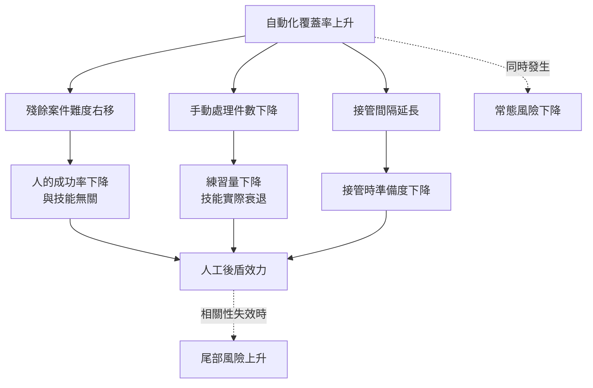

+++
title = "留下來的案例更難：自動化反諷與人工後盾的兩段衰退"
date = "2026-09-09T02:07:09+08:00"
author = "TTL::0"
draft = false
isCJKLanguage = true
description = "2009 年 6 月 1 日，一架從里約飛往巴黎的班機在大西洋上空失事，228 人死亡。法國航空事故調查局的最終報告記載，空速管結冰使指示失效，自動駕駛隨即斷開，飛機進入失速；從自動駕駛斷開到撞擊海面約 3 分 30 秒，而機組在下降過程中大部分時間保持機頭上仰的操縱輸入。報告把原因指向機組未能辨識失速，並指出高空手動操縱訓練不足、以及在系統降級狀態下突然移交手動操控的問題。[BEA final "
tags = [
    "分析論述", # term:AnalyticalEssay
    "AI 經濟與社會", # term:AiEconomics
    "自動化反諷", # term:IroniesOfAutomation
  ]
series = ["從代理量到可追責結果：AI 效用宣稱的轉換鏈"]
[ai_info]
    [ai_info.generation]
        model = "Claude Opus 5"
        agent = "Claude Code VSCode Extension 2.1.261"
    [ai_info.refinement]
        model = "Claude Opus 5"
        agent = "Claude Code VSCode Extension 2.1.263"
+++

<!--more-->

## 導言

2009 年 6 月 1 日，一架從里約飛往巴黎的班機在大西洋上空失事，228 人死亡。法國航空事故調查局的最終報告記載，空速管結冰使指示失效，自動駕駛隨即斷開，飛機進入失速；從自動駕駛斷開到撞擊海面約 3 分 30 秒，而機組在下降過程中大部分時間保持機頭上仰的操縱輸入。報告把原因指向機組未能辨識失速，並指出高空手動操縱訓練不足、以及在系統降級狀態下突然移交手動操控的問題。[BEA final report, AF447](https://bea.aero/docspa/2009/f-cp090601.en/pdf/f-cp090601.en.pdf)

這幾位機組不是不會飛。他們是在一個絕大多數時間由自動系統操控的機隊裡工作，而他們拿到的那一次，正好是自動系統無法處理的那一種。

**自動化把例行工作接走之後，留給人的是剩下的部分，而剩下的部分不是隨機抽樣。** 它是分佈的右尾。Bainbridge 在 1983 年把這個設計張力稱為**自動化反諷**（Ironies Of Automation） <!-- term:IroniesOfAutomation -->——自動化接手例行工作後，留給人的案例更難且練習更少，反而更難在關鍵時刻接管。[Ironies of Automation](https://www.sciencedirect.com/science/article/pii/0005109883900468)

> [!IMPORTANT]
> **自動化反諷** <!-- term:IroniesOfAutomation --> (Ironies Of Automation): 自動化接手例行工作後，留給人的案例更難且練習更少，反而更難在關鍵時刻接管的設計張力。 <!-- anchor:IroniesOfAutomation -->


本文要處理的問題是：**這個張力有幾段獨立的衰退、每段能計量到什麼程度，以及為什麼提高自動化的可靠度會讓人工後盾變得更不可靠。**

## 分析

### 第一段：留下來的案例不是隨機抽樣

自動化接手的是它能處理的案件，也就是難度低於某個門檻的那些。這個選擇機制使殘餘案件的難度分佈右移。

```python
import random
# 自動化接手難度低於門檻的案件。留給人的案件分佈因此右移。
N, SEED = 200_000, 43

def split(coverage):
    """coverage: 自動化接手的比例（依難度由低到高接手）"""
    rng = random.Random(SEED)
    auto, residual = [], []
    for _ in range(N):
        d = rng.random()                    # 難度 0..1，均勻分佈
        (auto if d < coverage else residual).append(d)
    return auto, residual

def human_success(difficulty, skill):
    return max(0.0, min(1.0, 0.97 - 0.9 * difficulty + 0.35 * (skill - 0.5)))

print(f"{'自動化覆蓋':>10}{'留給人的件數':>13}{'平均難度':>10}{'人的成功率':>11}")
for cov in (0.0, 0.50, 0.80, 0.95, 0.99):
    _, res = split(cov)
    md = sum(res) / len(res)
    sr = sum(human_success(d, 0.5) for d in res) / len(res)
    print(f"{cov:>10.0%}{len(res):>13,}{md:>10.3f}{sr:>11.1%}")
```

實際執行的輸出：

```text
     自動化覆蓋       留給人的件數      平均難度      人的成功率
        0%      200,000     0.500      52.0%
       50%       99,970     0.751      29.4%
       80%       40,236     0.900      16.0%
       95%       10,070     0.975       9.2%
       99%        1,986     0.995       7.4%
```

這一段的技能參數固定在 $0.5$，完全沒有動。人的成功率從 52.0% 掉到 7.4%。

**這個下降與人無關。** 它純粹來自選擇機制——把簡單的案件拿走，剩下的平均難度從 $0.500$ 升到 $0.995$。所以「人工覆核的攔截率下降」這個觀察，不能直接讀成覆核者變差了。

這個結果有一個立即的實務含義：覆核者的績效指標若以攔截率或處理成功率計算，自動化擴張會自動使他們的數字變差，而這與他們的工作品質無關。

### 第二段：練習量隨覆蓋率下降

第二段衰退才是關於人的。手動處理的件數就是練習量，而練習量隨自動化覆蓋率下降。

下面的程式把三個效應疊起來：難例累積、練習減少、以及難例的單件損害較大。

```python
import math, random
# 三個效應疊在一起：難例累積、練習減少、以及難例的單件損害較大。
N, SEED = 200_000, 43
def residual(coverage):
    rng = random.Random(SEED)
    return [d for d in (rng.random() for _ in range(N)) if d >= coverage]

def skill_from_practice(cases_per_month):
    return min(1.0, 0.05 + 0.105 * math.log1p(cases_per_month))

def human_success(d, skill):
    return max(0.0, min(1.0, 0.97 - 0.9 * d + 0.35 * (skill - 0.5)))

harm_of = lambda d: 1.0 + 30.0 * d * d      # 難例的單件損害較大

print(f"{'覆蓋':>6}{'每月手動':>10}{'技能':>7}{'平均難度':>10}{'成功率':>8}{'漏出件數':>10}{'漏出損害':>12}")
for cov in (0.0, 0.50, 0.80, 0.95, 0.99):
    res = residual(cov)
    per_month = len(res) / 24
    sk = skill_from_practice(per_month)
    md = sum(res) / len(res)
    sr = sum(human_success(d, sk) for d in res) / len(res)
    loss = sum((1 - human_success(d, sk)) * harm_of(d) for d in res)
    print(f"{cov:>6.0%}{per_month:>10,.0f}{sk:>7.3f}{md:>10.3f}{sr:>8.1%}"
          f"{len(res)*(1-sr):>10,.0f}{loss:>12,.0f}")
```

實際執行的輸出：

```text
    覆蓋      每月手動     技能      平均難度     成功率      漏出件數        漏出損害
    0%     8,333  0.998     0.500   68.2%    63,514   1,127,933
   50%     4,165  0.925     0.751   44.3%    55,671   1,116,206
   80%     1,676  0.830     0.900   27.5%    29,156     747,072
   95%       420  0.684     0.975   15.7%     8,490     250,867
   99%        83  0.515     0.995    8.0%     1,828      56,114
```

技能從 $0.998$ 降到 $0.515$，而這一次它是被自動化的覆蓋率驅動的。

這張表必須誠實地讀。漏出損害從 1,127,933 降到 56,114——**自動化確實降低了總損害，降幅約 95%。** 本文不主張自動化使系統更危險。

要注意的是另一件事：人工後盾的效力從 68.2% 降到 8.0%。系統的總風險降低了，而**殘餘風險的承接機制幾乎不再運作**。這兩件事同時為真，而它們對不同的問題給出答案。第一件回答「要不要自動化」，答案是要。第二件回答「當自動化本身出錯時誰接得住」，答案是沒有人。

### 相關性失效，以及間隔如何吃掉準備度

上一段的計算假設殘餘案件獨立到達。當自動化本身出現系統性錯誤時，難例會同時湧入，而人工後盾的準備度取決於它上一次被啟動是多久以前。

```python
# 自動化越可靠，接管間隔越長，而接管時的準備度隨間隔下降。
OPS_PER_MONTH = 30_000
readiness = lambda days: max(0.02, 0.95 * (0.97 ** days))

print(f"{'可靠度':>10}{'每月接管次數':>13}{'平均間隔(天)':>13}{'接管準備度':>11}{'接管失敗次數':>13}")
for rel in (0.90, 0.99, 0.999, 0.9999, 0.99999):
    events = OPS_PER_MONTH * (1 - rel)
    interval = 30 / events
    r = readiness(interval)
    print(f"{rel:>10.5f}{events:>13.1f}{interval:>13.2f}{r:>11.1%}{events*(1-r):>13.2f}")
print()
print("一次相關性失效（同時出現 500 件難例）時，人工後盾攔下多少：")
for rel, r in ((0.999, None), (0.9999, None), (0.99999, None)):
    events = OPS_PER_MONTH * (1 - rel)
    r = readiness(30 / events)
    print(f"  可靠度 {rel:.5f} -> 準備度 {r:.1%}，500 件中攔下 {500*r:.0f} 件，漏出 {500*(1-r):.0f} 件")
```

實際執行的輸出：

```text
       可靠度       每月接管次數      平均間隔(天)      接管準備度       接管失敗次數
   0.90000       3000.0         0.01      95.0%       150.87
   0.99000        300.0         0.10      94.7%        15.87
   0.99900         30.0         1.00      92.2%         2.36
   0.99990          3.0        10.00      70.1%         0.90
   0.99999          0.3       100.00       4.5%         0.29

一次相關性失效（同時出現 500 件難例）時，人工後盾攔下多少：
  可靠度 0.99900 -> 準備度 92.2%，500 件中攔下 461 件，漏出 39 件
  可靠度 0.99990 -> 準備度 70.1%，500 件中攔下 350 件，漏出 150 件
  可靠度 0.99999 -> 準備度 4.5%，500 件中攔下 23 件，漏出 477 件
```

第一張表的最後兩列是這篇的核心。可靠度從 $0.9999$ 提到 $0.99999$——十倍的改善——接管間隔從 10 天延長到 100 天，準備度從 70.1% 掉到 4.5%。

在獨立到達的假設下，這仍然是好交易：每月接管失敗次數從 $0.90$ 降到 $0.29$。但第二張表換掉了那個假設。同樣的一次相關性失效，在可靠度 $0.99900$ 時漏出 39 件，在 $0.99999$ 時漏出 477 件。

**提高可靠度使常態風險下降，同時使尾部風險上升。** 這不是一個矛盾，它是兩個不同的風險分佈；問題在於通常只有第一個被量測，因為它每個月都有數字。

### 三段衰退在圖上的位置

下圖把三段衰退與它們各自的成因分開。它要回答的閱讀問題是：一個「有人可以接管」的設計在哪幾點失去效力。



圖上有兩條虛線指向相反的方向。左邊那條是自動化的正面效果，它有月度數字。右邊那條只在相關性失效發生時才顯現，而那種事件在正常的量測週期裡不出現。

### 為什麼「保持警覺」不是可執行的要求

三段衰退都不是靠要求人更專注可以解決的。第一段是選擇機制的結果，第二段是練習量的結果，第三段是間隔的結果。三者都是自動化擴張的副產品，而不是態度問題。

航空業對這一點有明確的制度回應。美國聯邦航空總署在 2013 年發出安全公告，鼓勵航空公司在營運中積極推動手動飛行操作，理由是對手動操縱技能退化的關切。[FAA SAFO 13002](https://www.faa.gov/sites/faa.gov/files/other_visits/aviation_industry/airline_operators/airline_safety/safo/all_safos/SAFO13002.pdf)

這份公告的形式值得注意：它處理的不是訓練內容，是**日常營運中刻意保留手動操作的機會**。也就是說，它把練習量當成一個必須被主動配置的資源，而不是工作的自然副產品。

## 反思

主張的第一個邊界是不需要人接管的系統。當自動化失敗的後果可以由重試、回滾或延遲吸收時，三段衰退都不重要——因為沒有任何一個時刻需要人在幾秒內做出正確判斷。多數後台批次處理落在這裡，而把航空業的結論搬到那裡是誤置的。

第二個邊界關於自動化的失效模式。上面的分析假設自動化的錯誤與案件難度正相關——難的它做不好。當失效與難度無關時，例如一次組態錯誤影響全部案件，殘餘難度分佈的分析不適用，而應該回到停止機制與放行寬度的設計。三段衰退處理的是「難例落到人身上」這一類，不處理「全部案件同時出錯」那一類。

一個反例可以標出另一側。假設一個組織把自動化覆蓋率提到 99%，同時把覆核團隊的規模縮到原來的十分之一，而人工後盾的效力**沒有**下降——因為那十分之一的人被重新設計成專責難例處理，他們每天處理的都是右尾案件，練習量在難例上反而增加了。這是可行的設計，它說明本文的第二段衰退不是必然的：練習量下降來自「保留原有分工」這個預設，而不是來自自動化本身。

但這個反例有代價。專責難例的團隊會失去對簡單案件的感覺，而簡單案件的判斷是判斷難例的基準。所以它不是免費的修正，它把技能折舊從「量」轉移到「範圍」。

最後是實驗的限制。三個實驗的函數形式都是我選的：難度均勻分佈、成功率對難度線性、技能對練習量取對數、準備度對間隔指數衰減。它們共同證明「三段衰退可以在人的態度完全不變的情況下發生」，不估計任何真實系統的衰退速率。特別是準備度的日衰減率 $0.97$ 沒有經驗依據，它只用來說明間隔延長會吃掉準備度這個方向；換一個衰減率會移動臨界點，不會消除臨界點。第二個實驗的損害權重把難例設成單件損害較大，若真實系統的損害與難度無關，那一欄的結論會改變。

## 實務對比

**評估覆核團隊的績效。** 錯誤做法是以攔截率或處理成功率作為指標。實測顯示技能完全不動時，覆蓋率從 0% 到 99% 會使成功率從 52.0% 掉到 7.4%。正確做法是把殘餘案件的難度分佈一起報告，或改用同難度區間內的相對表現。

**規劃自動化擴張。** 錯誤做法是只計算自動化接手部分的節省。實測顯示覆蓋率 99% 時人工後盾效力剩 8.0%。正確做法是把人工後盾的效力當成一個獨立的追蹤指標，並在擴張計畫裡標出它跌破可接受值的那個覆蓋率。

**提高自動化的可靠度。** 錯誤做法是把它當成純粹的改善。實測顯示可靠度從 $0.9999$ 提到 $0.99999$ 使接管準備度從 70.1% 掉到 4.5%，而同一次相關性失效的漏出從 150 件變成 477 件。正確做法是同時報告常態風險與尾部風險，並在可靠度提高後重新演練一次接管。

**要求操作員保持警覺。** 錯誤做法是把它寫進作業程序並定期宣導。三段衰退都不是態度造成的。正確做法是把練習量當成需要主動配置的資源——刻意保留一定比例的手動處理，即使那些案件自動化本來就能處理。

**設計接管介面。** 錯誤做法是在系統放棄時把控制權交還給人，並期待他重建情境。AF447 個案顯示從自動狀態突然移交到降級手動狀態是一個獨立的失效源。正確做法是把系統當時看到的、不確定的、以及剩餘的反應時間直接呈現，並讓接管是分段的而不是全有全無。

**縮減覆核團隊。** 錯誤做法是按自動化覆蓋率等比縮減。正確做法是先決定這個團隊的職責是處理殘餘案件還是保留全域感，兩者需要的練習配置不同；按比例縮減會同時損失兩者。

## 結論

自動化接手例行工作後，人工後盾的效力沿三條互相獨立的路徑下降，而三條都不是態度問題。

本文的量測給出四個結果：

1. **第一段衰退與人無關。** 技能固定不動時，覆蓋率從 0% 到 99% 使人的成功率從 52.0% 掉到 7.4%，全部來自殘餘案件的難度從 $0.500$ 升到 $0.995$。
2. **第二段衰退由練習量驅動。** 覆蓋率上升使每月手動件數從 8,333 降到 83，技能從 $0.998$ 降到 $0.515$。
3. **自動化確實降低總損害，同時使後盾失效。** 漏出損害降幅約 95%，而人工後盾的效力從 68.2% 降到 8.0%。兩者同時為真。
4. **提高可靠度會把風險從常態移到尾部。** 可靠度從 $0.9999$ 到 $0.99999$ 使接管準備度從 70.1% 降到 4.5%；同一次相關性失效的漏出從 150 件升到 477 件。

所以在擴張自動化時，需要兩個而不是一個指標：自動化本身的可靠度，以及人工後盾在殘餘案件上的效力。

第一個指標會隨投資自然改善，第二個不會——它隨第一個的改善而惡化。因此後盾的練習量必須被當成一項預算來配置，而不是當成日常工作的副產品。當它不再是副產品時，就沒有人負責它了。