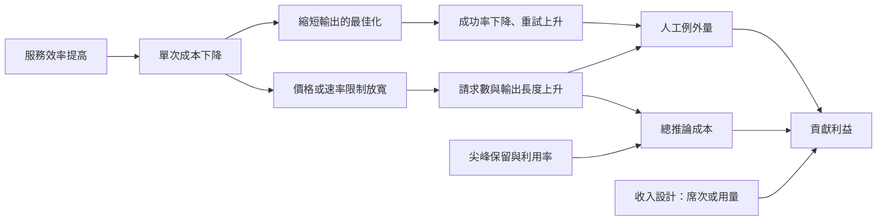

+++
title = "兩個口徑不同步：用量成長為何吃掉貢獻利益"
date = "2026-09-09T02:24:10+08:00"
author = "TTL::0"
draft = false
isCJKLanguage = true
description = "Microsoft 截至 2026 年 6 月的年報同時記載兩件事：AI 產品的席次與用量成長推升營收，以及 AI 基礎設施投資與使用量對雲端毛利率造成壓力，其中部分由效率改善抵銷。[Microsoft 2026 Form 10-K](https://www.sec.gov/Archives/edgar/data/789019/000119312526323660/msft-20260630.ht"
tags = [
    "分析論述", # term:AnalyticalEssay
    "AI 經濟與社會", # term:AiEconomics
    "貢獻利益", # term:ContributionMargin
    "反彈效應", # term:ReboundEffect
    "自回歸", # term:Autoregressive
    "人工補償", # term:HumanCompensation
  ]
series = ["從代理量到可追責結果：AI 效用宣稱的轉換鏈"]
[ai_info]
    [ai_info.generation]
        model = "Claude Opus 5"
        agent = "Claude Code VSCode Extension 2.1.261"
    [ai_info.refinement]
        model = "Claude Opus 5"
        agent = "Claude Code VSCode Extension 2.1.263"
+++

<!--more-->

## 導言

Microsoft 截至 2026 年 6 月的年報同時記載兩件事：AI 產品的席次與用量成長推升營收，以及 AI 基礎設施投資與使用量對雲端毛利率造成壓力，其中部分由效率改善抵銷。[Microsoft 2026 Form 10-K](https://www.sec.gov/Archives/edgar/data/789019/000119312526323660/msft-20260630.htm)

這兩件事寫在同一份文件裡，並不衝突。它們是同一個結構的兩面：**收入按席次計，成本按用量計。**

固定月費容易讓 AI 產品看起來像傳統席次軟體——新增客戶提高收入，而複製程式幾乎免費。但每次生成都消耗運算，長輸出占用更多時間與記憶體，失敗的請求還可能觸發人工處理。這三項都隨用量走，而月費不隨用量走。

本文要處理的問題是：**當這兩個口徑不同步時，採用擴大在什麼條件下擴張**貢獻利益**（Contribution Margin） <!-- term:ContributionMargin -->、在什麼條件下收縮它。**

> [!IMPORTANT]
> **貢獻利益** <!-- term:ContributionMargin --> (Contribution Margin): 收入扣除隨使用量變動的成本後，可用以覆蓋固定支出的餘額。 <!-- anchor:ContributionMargin -->


## 分析

### 貢獻利益的形式，以及變動項在哪裡

**貢獻利益** <!-- term:ContributionMargin -->是收入扣除隨使用量變動的成本後，可用以覆蓋固定支出的餘額。對單一客戶可寫成

$$
CM=P-q(c_i+c_o\ell+c_rh)-c_f,
$$

$P$ 是期間收入，$q$ 是請求數，$c_i$ 是每次固定推論成本，$c_o\ell$ 是平均輸出長度 $\ell$ 帶來的生成成本，$c_rh$ 是需人工覆核的比率乘單次人力成本，$c_f$ 是客戶層固定服務成本。

自建推論與第三方 API 只是把成本記在不同科目，物理資源不會消失。式子裡有三個乘上 $q$ 的項，而 $P$ 不乘 $q$。

```python
# 固定月費下的貢獻利益：價格不隨用量走，成本隨用量走。
PRICE, FIXED = 30.0, 4.0
C_REQ, C_TOK, FLAG, C_REVIEW = 0.004, 0.0009, 0.02, 0.60

def margin(requests, out_len=700):
    variable = requests * (C_REQ + C_TOK * out_len / 100 + FLAG * C_REVIEW)
    cm = PRICE - FIXED - variable
    return cm, cm / PRICE

print(f"{'每月請求':>10}{'變動成本':>10}{'貢獻利益':>10}{'利益率':>9}")
for q in (100, 500, 1_000, 3_000, 5_000):
    cm, r = margin(q)
    var = PRICE - FIXED - cm
    print(f"{q:>10,}{var:>10.2f}{cm:>10.2f}{r:>9.1%}")
print()
print("同一價格下，輸出長度的影響（請求數固定 1,000）：")
for L in (200, 700, 2_000, 6_000):
    cm, r = margin(1_000, L)
    print(f"  平均輸出 {L:>5} token -> 貢獻利益 {cm:>8.2f}   利益率 {r:>7.1%}")
```

實際執行的輸出：

```text
      每月請求      變動成本      貢獻利益      利益率
       100      2.23     23.77    79.2%
       500     11.15     14.85    49.5%
     1,000     22.30      3.70    12.3%
     3,000     66.90    -40.90  -136.3%
     5,000    111.50    -85.50  -285.0%

同一價格下，輸出長度的影響（請求數固定 1,000）：
  平均輸出   200 token -> 貢獻利益     8.20   利益率   27.3%
  平均輸出   700 token -> 貢獻利益     3.70   利益率   12.3%
  平均輸出  2000 token -> 貢獻利益    -8.00   利益率  -26.7%
  平均輸出  6000 token -> 貢獻利益   -44.00   利益率 -146.7%
```

利益率從 79.2% 走到 $-285.0\%$，跨過零點。跨越發生在每月約 1,000 到 3,000 次請求之間——那個區間正是「這位客戶把產品用起來了」的區間。

第二段的結果同樣重要：請求數完全不變，只讓平均輸出長度從 200 token 增加到 6,000 token，利益率從 27.3% 掉到 $-146.7\%$。**所以「用量」不是一個純量。** 同一個請求數可以對應差二十倍的成本，而定價通常只看請求數或席次。

**自回歸**（Autoregressive） <!-- term:Autoregressive -->生成逐 token 執行，這使得完成時間與輸出長度直接相關，而完成時間又決定容量占用。這是輸出長度能造成上述差距的物理原因。

> [!IMPORTANT]
> **自回歸** <!-- term:Autoregressive --> (Autoregressive): 逐步以先前輸出作為後續輸入條件的生成方式，使完成時間與輸出長度相關。 <!-- anchor:Autoregressive -->


### 每 token 成本不是自然常數

上面的計算把每 token 成本當成給定值。它不是。服務層的排程與記憶體管理直接改變它。

Orca 以 iteration-level scheduling 取代整批同步完成，使一批請求中先結束的可以立即讓位，批次利用率因此上升。[Orca](https://www.usenix.org/conference/osdi22/presentation/yu) PagedAttention 以分頁方式管理鍵值快取，降低為最長可能序列預留記憶體所造成的浪費。[PagedAttention](https://arxiv.org/abs/2309.06180)

兩者的共同含義是：每 token 成本是模型、硬體、負載形狀與服務軟體的共同結果。一份 API 報價不是這個成本的下界，也不是上界——它是某一組上述條件下的一個值。

這件事讓上一段的悲觀結論不成立為必然。若服務效率的改善速度快於用量與價格的下降速度，貢獻利益 <!-- term:ContributionMargin -->可以隨規模擴張。問題是這變成一場賽跑，而賽跑的另一邊有一個機制在加速。

### 反彈效應：效率改善會被用量吃掉

**反彈效應**（Rebound Effect） <!-- term:ReboundEffect -->是單位成本下降刺激用量上升，使總成本不降反增的現象。在 AI 服務上它有一條具體的傳導路徑：單次成本下降使供應者放寬速率限制或降價，有效價格下降使用量上升。

> [!IMPORTANT]
> **反彈效應** <!-- term:ReboundEffect --> (Rebound Effect): 單位成本下降刺激用量上升，使總成本不降反增的現象。 <!-- anchor:ReboundEffect -->


```python
# 效率改善使單次成本下降，價格或限制隨之放寬，用量上升。
BASE_Q, BASE_C = 1_000, 0.010     # 起始請求數與每次成本
ELASTICITY = -1.4                  # 用量對有效價格的彈性

print(f"{'效率改善':>9}{'單次成本':>10}{'請求數':>10}{'總推論成本':>12}{'相對起點':>10}")
base_total = BASE_Q * BASE_C
for gain in (1.0, 2.0, 5.0, 10.0, 40.0):
    unit = BASE_C / gain
    q = BASE_Q * (gain ** (-ELASTICITY))     # 有效價格下降 -> 用量上升
    total = q * unit
    print(f"{gain:>8.0f}x{unit:>10.5f}{q:>10,.0f}{total:>12,.2f}{total/base_total:>10.2f}x")
```

實際執行的輸出：

```text
     效率改善      單次成本       請求數       總推論成本      相對起點
       1x   0.01000     1,000       10.00      1.00x
       2x   0.00500     2,639       13.20      1.32x
       5x   0.00200     9,518       19.04      1.90x
      10x   0.00100    25,119       25.12      2.51x
      40x   0.00025   174,938       43.73      4.37x
```

效率改善 40 倍，單次成本降到原來的四十分之一，而總推論成本變成起點的 4.37 倍。

這個結果的關鍵是彈性的絕對值大於 1。當用量對有效價格的彈性超過 $-1$ 時，效率改善使總支出上升。而 AI 產品的用量彈性有理由偏高——降價會打開原本不划算的新用途，那不只是既有用量的擴大。

反過來說，這個機制在彈性小於 1 的市場不成立。所以「效率改善會被用量吃掉」不是普遍規律，它是一個關於彈性的條件式主張，而彈性是可以量測的。

### 尾部延遲與容量利用率

第二個吃掉效率改善的機制不涉及需求。它來自尖峰保留：容量必須依尖峰配置，而尖峰與平均之間的比值決定閒置成本。

一台帳面上便宜的加速器，若只在尖峰的十分鐘被充分使用，其餘時間的攤提仍然要記在每一個請求上。這使得「每 token 成本」在帳面與實際之間有一個由利用率決定的乘數，而該乘數不出現在任何報價表上。

### 錯誤的最佳化：每請求成本與每成功任務成本

最後一個機制是口徑本身選錯。以降低每請求成本為目標的最佳化，最常見的手段是縮短輸出，而縮短輸出會降低任務成功率並提高重試與人工接手。

```python
# 縮短輸出以省 token：每請求成本下降，每成功任務成本可能上升。
C_REQ, C_TOK, C_REVIEW = 0.004, 0.0009, 0.60

def per_success(out_len, success_rate, handoff_rate):
    cost_per_call = C_REQ + C_TOK * out_len / 100
    calls_per_task = 1 / success_rate          # 期望呼叫次數（含重試）
    review = handoff_rate * C_REVIEW / success_rate
    return cost_per_call, cost_per_call * calls_per_task + review

CONFIGS = (
    ("長輸出、完整說明", 1400, 0.94, 0.05),
    ("中等輸出",          700, 0.88, 0.09),
    ("縮短輸出",          300, 0.71, 0.18),
    ("極短輸出",          120, 0.52, 0.31),
)
print(f"{'設定':<18}{'每次呼叫':>10}{'成功率':>8}{'人工接手':>10}{'每成功任務':>12}")
for label, L, sr, hr in CONFIGS:
    call, task = per_success(L, sr, hr)
    print(f"{label:<18}{call:>10.5f}{sr:>8.0%}{hr:>10.0%}{task:>12.5f}")
print()
best_call = min(per_success(L, s, h)[0] for _, L, s, h in CONFIGS)
best_task = min(per_success(L, s, h)[1] for _, L, s, h in CONFIGS)
print(f"每次呼叫最低 {best_call:.5f}（極短輸出）；每成功任務最低 {best_task:.5f}（長輸出）")
```

實際執行的輸出：

```text
設定                      每次呼叫     成功率      人工接手       每成功任務
長輸出、完整說明             0.01660     94%        5%     0.04957
中等輸出                 0.01030     88%        9%     0.07307
縮短輸出                 0.00670     71%       18%     0.16155
極短輸出                 0.00508     52%       31%     0.36746

每次呼叫最低 0.00508（極短輸出）；每成功任務最低 0.04957（長輸出）
```

兩個口徑的最佳解剛好相反。以每次呼叫計，極短輸出最便宜；以每成功任務計，它最貴——貴 7.4 倍。

這是一個純粹的口徑錯誤，不涉及任何預測。而它在實務中很常見，因為每次呼叫成本可以從帳單直接讀出，而每成功任務成本需要定義什麼算成功。

### 單位成本與總支出的分岔

下圖把上述機制排在一起。它要回答的閱讀問題是：一次效率改善沿哪些路徑影響貢獻利益 <!-- term:ContributionMargin -->。



圖上只有一條邊指向收入。其餘所有邊都通向成本，而其中三條由「效率改善」出發。這是本文的整體形狀：效率改善是一個有多條下游路徑的變更，而其中兩條會回頭增加總成本。

## 反思

主張的第一個邊界是收入設計本身。上面的分析假設 $P$ 不隨 $q$ 變動。當收入按用量計價、或 AI 功能主要提升留存而非直接產生用量成本時，兩個口徑同步，貢獻利益 <!-- term:ContributionMargin -->可以隨規模擴張。所以本文不主張 AI 產品不能有軟體式毛利，它主張固定月費加上量價分離會使成功採用惡化單位經濟。

第二個邊界是把這個內部公式當成正式財報數字。訓練、研發、推論與支援在不同公司的會計政策下落在不同科目，而上面的式子沒有對應任何 GAAP 定義。它是一份管理用的盤點式，用來確認沒有成本項目消失。把它與正式毛利率相提並論會產生兩份互相矛盾的數字。

第三個邊界關於「AI 不是普通 SaaS」這個說法。傳統影音、搜尋與儲存服務同樣有邊際成本，所以那句話若被讀成「其他軟體零成本」是錯的。可以主張的較弱版本是：生成成本與互動量的連動比多數既有 SaaS 更直接，因為每一次互動都對應一次運算，而不是一次資料庫讀取。

一個反例可以標出主張的另一側。假設某產品的用量彈性小於 1、效率改善速度快於價格下降、且人工接手率隨模型改善而下降——這三者同時成立時，反彈效應 <!-- term:ReboundEffect -->不發生，貢獻利益 <!-- term:ContributionMargin -->隨規模擴張。這是可能的，而且在成熟的推論服務上已經部分發生。本文的主張因此是條件式的：三個條件都需要量測，而不是假設。

最後是實驗的限制。第一個實驗的價格與成本參數是我指定的，它證明「固定月費下利益率可以跨過零點」以及「輸出長度可以造成二十倍的成本差異」，不對應任何真實報價。第二個實驗的彈性 $-1.4$ 是假設值，這個結論對彈性極為敏感——彈性為 $-0.8$ 時同樣的效率改善會使總成本下降。第三個實驗的成功率與接手率是我指定的對應關係，它證明兩個口徑的最佳解可以相反，不預測任何真實系統的成功率曲線。

## 實務對比

**判斷產品的毛利結構。** 錯誤做法是以年度經常性收入除以席次，宣稱具有軟體式高毛利。實測顯示同一定價下利益率從 79.2% 走到 $-285.0\%$。正確做法是按客戶與工作負載扣除推論、第三方模型、容量閒置與人工例外，再分別比較輕度與重度使用群組。

**定價一個 AI 功能。** 錯誤做法是只按席次或請求數計價。實測顯示請求數固定時，輸出長度從 200 到 6,000 token 使利益率從 27.3% 掉到 $-146.7\%$。正確做法是讓計價的單位包含輸出量，或設定一個與成本掛鉤的用量上限。

**最佳化推論成本。** 錯誤做法是以每次呼叫成本為目標，縮短輸出。實測顯示極短輸出的每次呼叫成本最低，而每成功任務成本是最高的，貴 7.4 倍。正確做法是以每成功任務成本為目標，並同時追蹤品質、重試、延遲與人工接手。

**評估一次效率改善的財務效果。** 錯誤做法是把單次成本的降幅直接當成總支出的降幅。實測顯示 40 倍的效率改善在彈性 $-1.4$ 下使總成本變成 4.37 倍。正確做法是先量用量對有效價格的彈性，再據此決定要不要把效率改善轉成降價或放寬限制。

**引用 API 報價作為成本基準。** 錯誤做法是把某一時點的報價當成永久的每 token 成本。正確做法是把它視為特定模型版本、批次策略、快取命中率與容量利用率下的一個值，並記錄那四個條件；其中利用率通常是最大的乘數。

## 結論

AI 可以用 SaaS 的形式銷售，但形式不會消除每次推論與每次例外處理。判斷規模是否改善經濟性，取決於兩個口徑是否同步。

本文的量測給出四個結果：

1. **固定月費下，成功採用會使利益率跨過零點。** 從每月 100 次到 5,000 次請求，利益率從 79.2% 走到 $-285.0\%$，跨越發生在 1,000 到 3,000 次之間。
2. **用量不是純量。** 請求數不變、輸出長度從 200 到 6,000 token，利益率從 27.3% 掉到 $-146.7\%$。
3. **效率改善可以被用量吃掉，而條件是彈性。** 彈性 $-1.4$ 時，40 倍的效率改善使總推論成本變成 4.37 倍；彈性小於 1 時結論相反。
4. **兩個成本口徑的最佳解可以相反。** 極短輸出的每次呼叫成本最低（$0.00508$），而每成功任務成本最高（$0.36746$），是最佳解的 7.4 倍。

所以要判斷一個 AI 產品的單位經濟是否隨規模改善，要同時問四件事：價格如何隨用量變、服務效率如何變、**人工補償**（Human Compensation） <!-- term:HumanCompensation -->是否變、以及保留的容量是否被利用。

> [!IMPORTANT]
> **人工補償** <!-- term:HumanCompensation --> (Human Compensation): 以人力審核與例外處理填補模型不可靠之處，使系統整體達到可交付品質的做法。 <!-- anchor:HumanCompensation -->


真正的護城河不是「軟體」這個標籤。它是每個成功結果的成本下降得比價格更快——而這是一個可以每季量測的比值，不是一個關於商業模式的判斷。