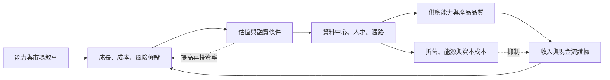

+++
title = "敘事寫進哪一個參數：成長、機率、成本與折現率的重分配"
date = "2026-09-09T02:41:11+08:00"
author = "TTL::0"
draft = false
isCJKLanguage = true
description = "2023 年 5 月 1 日，線上教育服務商 Chegg 在季報說明會上表示，生成式 AI 聊天服務正在影響新客戶的成長。隔日該公司股價下跌約 48%。"
tags = [
    "分析論述", # term:AnalyticalEssay
    "AI 經濟與社會", # term:AiEconomics
    "折現現金流", # term:DiscountedCashFlow
  ]
series = ["從代理量到可追責結果：AI 效用宣稱的轉換鏈"]
[ai_info]
    [ai_info.generation]
        model = "Claude Opus 5"
        agent = "Claude Code VSCode Extension 2.1.261"
    [ai_info.refinement]
        model = "Claude Opus 5"
        agent = "Claude Code VSCode Extension 2.1.263"
+++

<!--more-->

## 導言

2023 年 5 月 1 日，線上教育服務商 Chegg 在季報說明會上表示，生成式 AI 聊天服務正在影響新客戶的成長。隔日該公司股價下跌約 48%。

那一天該公司的當期現金流沒有改變。改變的是一個參數：未來的收入成長率。

同年 5 月下旬，NVIDIA 公布的下一季營收指引約為 110 億美元，遠高於當時市場預期的約 72 億美元，股價隔日上漲約 24%。這一次改變的參數也是成長率，方向相反，而它附帶了一項具體證據——公司自己對下一季的承諾。

**兩件事的形式相同：敘事沒有取消現金流，它改寫了折現公式裡的一個輸入。** 差別在於改寫的依據，一個是關於替代品的推論，一個是關於下一季的承諾。

本文要處理的問題是：**一個能力敘事進入資本市場時，它具體改寫哪些參數、各參數的敏感度差多少，以及為什麼「更樂觀的敘事」不必然推出「更高的估值」。**

## 分析

### 折現公式是一份參數清單

上市公司估值的基本語言是**折現現金流**（Discounted Cash Flow） <!-- term:DiscountedCashFlow -->——將未來現金流以資金成本折算為現值的估值方法：

> [!IMPORTANT]
> **折現現金流** <!-- term:DiscountedCashFlow --> (Discounted Cash Flow): 將未來現金流以資金成本折算為現值的估值方法。 <!-- anchor:DiscountedCashFlow -->


$$
V_0=\sum_{t=1}^{T}\frac{\mathbb E[FCF_t]}{(1+r)^t}+\frac{TV_T}{(1+r)^T}.
$$

$FCF_t$ 是第 $t$ 期自由現金流，$r$ 是與風險一致的折現率，$TV_T$ 是終值。Damodaran 的教材反覆強調現金流與折現率必須配對：成長敘事若提高收入，也必須反映再投資、成本與風險。[NYU Valuation](https://pages.stern.nyu.edu/~adamodar/New_Home_Page/lectures/val.html)

這個式子的地位與前面幾種盤點式相同：它不是預測工具，是一份必須被填滿的欄位清單。敘事的作用是改寫其中某些欄位，而**敘事本身不能改寫的那些欄位，正是檢查敘事一致性的地方**。

### 四個參數的敏感度不同

下面的程式逐一操弄四個參數，其餘固定。

```python
# 敘事不取消現金流，它改寫參數。逐一操弄，看現值的敏感度。
def dcf(growth, margin, reinvest, r, years=10, rev0=100.0, terminal_g=0.025):
    pv, rev = 0.0, rev0
    for t in range(1, years + 1):
        rev *= (1 + growth)
        fcf = rev * margin - rev * reinvest
        pv += fcf / (1 + r) ** t
    tv = (rev * margin - rev * reinvest) * (1 + terminal_g) / (r - terminal_g)
    return pv + tv / (1 + r) ** years

BASE = dict(growth=0.12, margin=0.30, reinvest=0.10, r=0.09)
print(f"基準情境現值 {dcf(**BASE):,.1f}")
print()
print("每次只改一個參數：")
for key, alts in (("growth", (0.06, 0.12, 0.20, 0.30)),
                  ("margin", (0.20, 0.30, 0.38)),
                  ("reinvest", (0.06, 0.10, 0.18, 0.26)),
                  ("r", (0.07, 0.09, 0.12, 0.15))):
    line = []
    for a in alts:
        p = dict(BASE); p[key] = a
        line.append(f"{a:.2f}->{dcf(**p):>9,.0f}")
    print(f"  {key:<9} " + "   ".join(line))
print()
# 敘事同時改動成長與再投資：兩者互相抵銷到什麼程度
print("成長與再投資同時上調（敘事一致的情形）：")
for g, ri in ((0.12, 0.10), (0.20, 0.18), (0.30, 0.28), (0.40, 0.38)):
    p = dict(BASE); p["growth"], p["reinvest"] = g, ri
    print(f"  成長 {g:.0%} / 再投資 {ri:.0%} -> 現值 {dcf(**p):>9,.0f}")
```

實際執行的輸出：

```text
基準情境現值 646.7

每次只改一個參數：
  growth    0.06->      411   0.12->      647   0.20->    1,177   0.30->    2,434
  margin    0.20->      323   0.30->      647   0.38->      905
  reinvest  0.06->      776   0.10->      647   0.18->      388   0.26->      129
  r         0.07->      979   0.09->      647   0.12->      416   0.15->      299

成長與再投資同時上調（敘事一致的情形）：
  成長 12% / 再投資 10% -> 現值       647
  成長 20% / 再投資 18% -> 現值       706
  成長 30% / 再投資 28% -> 現值       243
  成長 40% / 再投資 38% -> 現值    -1,947
```

前半段給出一個直觀的排序：成長率的槓桿最大，從 6% 到 30% 使現值從 411 變成 2,434。

後半段是這篇報告的核心結果。當敘事被寫得一致時——高成長需要高再投資，因為產能不會自己出現——現值在成長率 20% 處達到 706，然後掉到 243，最後在 40% 處變成 $-1,947$。

**一個更樂觀的敘事，在內部一致的前提下，可以產生更低的估值。** 這不是一個修辭，它是折現公式的算術：再投資直接扣減自由現金流，而成長的效益要到後期才回收，並被折現率削弱。

這個結果給出一個具體的檢查方法。當一份估值模型的成長率被上調而再投資率沒有同步上調時，那份模型不是樂觀，是不一致——它假設產能免費出現。

### 創投的形式不同：離散尾部與分配順序

早期投資不使用連續現金流。它使用離散的退出情境：令退出值為 $X_j$、機率為 $p_j$、目標報酬率為 $k$，簡化現值是 $\sum_j p_j X_j/(1+k)^T$。

少數巨大結果支撐大部分期望值，這使現值對尾部機率極為敏感。

```python
# 早期投資：離散退出情境。現值對尾部機率極為敏感。
def value(tail_p, target_return, years=5, mid_p=0.25, mid_x=300, tail_x=2000):
    fail_p = max(0.0, 1.0 - mid_p - tail_p)
    expected = fail_p * 0 + mid_p * mid_x + tail_p * tail_x
    return expected / (1 + target_return) ** years

print(f"{'尾部機率':>9}{'期望退出值':>12}{'目標報酬 50%':>14}{'目標報酬 30%':>14}")
for p in (0.01, 0.03, 0.10, 0.20):
    exp = 0.25 * 300 + p * 2000
    print(f"{p:>9.0%}{exp:>12,.0f}{value(p, 0.50):>14,.1f}{value(p, 0.30):>14,.1f}")
print()
# 優先權與稀釋：企業價值不等於投資人所得
def investor_share(exit_value, invested=20.0, pref_multiple=1.0, ownership=0.18, dilution=0.65):
    liquidation = min(exit_value, invested * pref_multiple)
    residual = max(0.0, exit_value - liquidation)
    as_converted = residual * ownership * dilution
    return max(liquidation + 0.0, as_converted) if exit_value > invested * 3 else liquidation

print("同一個退出金額，投資人實得（投入 20，1x 優先權，18% 持股，後續稀釋 0.65）：")
for x in (0, 15, 60, 300, 2000):
    got = investor_share(x)
    print(f"  退出 {x:>5,} -> 實得 {got:>8.1f}   倍數 {got/20:>6.2f}x")
```

實際執行的輸出：

```text
     尾部機率       期望退出值      目標報酬 50%      目標報酬 30%
       1%          95          12.5          25.6
       3%         135          17.8          36.4
      10%         275          36.2          74.1
      20%         475          62.6         127.9

同一個退出金額，投資人實得（投入 20，1x 優先權，18% 持股，後續稀釋 0.65）：
  退出     0 -> 實得      0.0   倍數   0.00x
  退出    15 -> 實得     15.0   倍數   0.75x
  退出    60 -> 實得     20.0   倍數   1.00x
  退出   300 -> 實得     32.8   倍數   1.64x
  退出 2,000 -> 實得    231.7   倍數  11.58x
```

尾部機率從 1% 到 20% 使現值變成五倍。而尾部機率恰好是最難估計的那一個數字，因為關於它的資料按定義很少。

第二段的結果指出另一件事。同一個退出金額對企業與對投資人不是同一件事：退出 60 時投資人實得 20，剛好是 1.00 倍——五年零報酬。優先權在下行時保護本金，稀釋在中段吃掉上行，只有真正的尾部才產生倍數。

**所以「這輪估值代表市場相信這家公司值多少」是一個過度簡化。** 條款決定了同一個結果如何分配，而條款不在估值數字裡。

### 資本會回頭改變被估值的對象

上面兩段把敘事當成單向的輸入。實際上資本一旦形成產能，它會改變後續的現金流證據。下圖把這個迴圈與它的抑制項畫在一起。



圖上有兩條回頭的邊。上面那條是正向的：投資形成產能，產能改善產品，產品產生現金流證據，證據更新假設。下面兩條是抑制的：折舊與能源成本直接扣減現金流，而融資帶來的再投資義務直接提高再投資率——也就是第一個實驗裡使現值下降的那一項。

關鍵中介是產能、利用率、價格、留存、折舊與自由現金流。失效點有三個：資本未形成產能、產能未改善效用、或需求不足以吸收固定成本。

### 為什麼高估值不是能力實驗，當期虧損也不是不合理的證明

這兩個推論都跨過了上圖的多條邊。

高估值只說明市場參與者對某組參數的共識落在某個位置，而參數受利率、流動性與相對估值影響。第一個實驗顯示折現率從 7% 到 15% 使現值從 979 降到 299——這個變化與該公司的能力完全無關。

當期虧損同樣不決定投資是否合理。合理的問題是三段的：新增投入何時形成可售容量、該容量以何種利用率與價格轉成現金流、以及是否足以補償資本成本。這三段各自有可觀察的量。

## 反思

主張的第一個邊界是成熟且合約穩定的服務。當再投資需求低、續約可預測時，AI 敘事對估值的邊際作用很小，現金流證據主導。此時上面的敏感度分析仍然成立，但敘事沒有可改寫的欄位。

第二個邊界是平台投資的歸因。同一座資料中心可以服務搜尋、雲端與 AI 三類業務，因此不能把全部資本支出歸給單一產品。這使「AI 的資本報酬率」在多數大型公司裡不是一個可計算的量，而只能以分部毛利與增量利用率間接觀察。任何把整體資本支出除以 AI 營收的計算都會得到一個沒有意義的比值。

一個反例可以標出主張的另一側。假設某公司過度投資、投資人報酬不佳，而技術確實進步、使用者確實受益——這三者可以同時成立。過度投資留下的是便宜的基礎設施，而便宜的基礎設施由後續使用者享用。所以「投資人虧損」不推出「技術沒有進步」，兩者是不同的命題，而市場討論經常把它們綁在一起。

第三個邊界關於一致性檢查本身。要求成長率與再投資率同步上調，預設兩者之間有一個穩定的關係。在資本密集度快速變化的期間，那個關係本身在移動——同樣的收入成長在不同世代的硬體上需要不同的資本投入。此時一致性檢查只能給出方向，不能給出比例。

最後是實驗的限制。第一個實驗的十年期、終值成長率 2.5% 與各參數的取值範圍都是我指定的，它證明「內部一致的樂觀敘事可以降低現值」這個結構，不對應任何公司。第二個實驗的條款結構是簡化的——真實的優先權有參與式與非參與式之別，後續輪次的優先順序也會疊加；它證明「企業價值不等於投資人所得」，不計算任何真實 term sheet 的分配。

## 實務對比

**評估一個 AI 敘事對估值的影響。** 錯誤做法是把它讀成「市場相信或不相信 AI」。正確做法是問它改寫了哪一個參數：成長率、利潤率、再投資率、還是折現率。Chegg 那一天改寫的是成長率，NVIDIA 那一次也是，而兩者的依據不同。

**上調一份模型的成長假設。** 錯誤做法是只改成長率。實測顯示成長 40% 配再投資 38% 時現值是 $-1,947$，而成長 12% 配再投資 10% 時是 647。正確做法是同步上調再投資率，並讓模型自己說出這個敘事值多少。

**引用一輪融資的估值。** 錯誤做法是把它當成市場對公司價值的判斷。實測顯示退出 60 時投資人實得 1.00 倍，而退出 2,000 時是 11.58 倍。正確做法是同時看條款：優先權倍數、參與方式、以及預期的後續稀釋。

**用高估值論證能力已被驗證。** 錯誤做法是把市值變化當成技術證據。實測顯示折現率從 7% 到 15% 使現值從 979 降到 299，而這與能力無關。正確做法是分開追蹤三段：資本是否形成產能、產能是否被使用、使用是否產生扣除成本後的現金流。

**用當期虧損論證投資不合理。** 錯誤做法是以損益表的符號作結論。正確做法是問三個時間問題：投入何時形成可售容量、該容量的利用率與價格是多少、以及回收期是否短於資本成本所要求的期間。

**計算 AI 業務的資本報酬。** 錯誤做法是把整體資本支出除以 AI 相關營收。正確做法是以分部毛利與增量利用率間接觀察，並明確記錄哪些資產是共用的、以何種比例分攤。

## 結論

AI 敘事進入資本市場時，不是把現金流魔法般取消，而是改寫成長、成功機率、成本、風險與再投資這幾個欄位。

本文的量測給出四個結果：

1. **四個參數的槓桿不同。** 成長率從 6% 到 30% 使現值從 411 到 2,434；折現率從 7% 到 15% 使現值從 979 到 299。
2. **內部一致的樂觀敘事可以降低估值。** 成長與再投資同步上調時，現值在成長 20% 處達 706，在 40% 處變成 $-1,947$。
3. **創投現值對尾部機率極敏感。** 尾部機率從 1% 到 20% 使現值變成五倍，而它是資料最少的那個數字。
4. **企業價值不等於投資人所得。** 同一組條款下，退出 60 產生 1.00 倍，退出 2,000 產生 11.58 倍。

所以要判斷一份 AI 估值是否可信，不必先判斷那個技術敘事是否正確。先做一件更便宜的事：檢查成長率被上調時，再投資率有沒有跟著動。

沒有跟著動的模型不是樂觀的，它是不一致的——它假設產能免費出現。而那個假設是這類模型裡最常見、也最容易被檢查出來的一項。