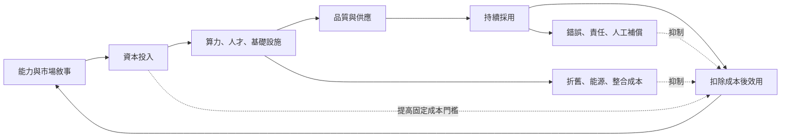

+++
title = "四段轉換：反身迴圈在哪一段沒有閉合"
date = "2026-09-09T02:58:12+08:00"
author = "TTL::0"
draft = false
isCJKLanguage = true
description = "Alphabet 在 2025 年投入約 910 億美元資本支出，並表示 2026 年將顯著增加；其中約六成投向伺服器，四成投向資料中心與網路等長期資產。公司同時說明折舊與資料中心營運成本正在上升。[Alphabet 2025 Q4 earnings call](https://abc.xyz/investor/events/event-details/2026/2025-Q4-Earnings-"
tags = [
    "分析論述", # term:AnalyticalEssay
    "AI 經濟與社會", # term:AiEconomics
    "反身性", # term:Reflexivity
    "人工補償", # term:HumanCompensation
  ]
series = ["從代理量到可追責結果：AI 效用宣稱的轉換鏈"]
[ai_info]
    [ai_info.generation]
        model = "Claude Opus 5"
        agent = "Claude Code VSCode Extension 2.1.261"
    [ai_info.refinement]
        model = "Claude Opus 5"
        agent = "Claude Code VSCode Extension 2.1.263"
+++

<!--more-->

## 導言

Alphabet 在 2025 年投入約 910 億美元資本支出，並表示 2026 年將顯著增加；其中約六成投向伺服器，四成投向資料中心與網路等長期資產。公司同時說明折舊與資料中心營運成本正在上升。[Alphabet 2025 Q4 earnings call](https://abc.xyz/investor/events/event-details/2026/2025-Q4-Earnings-Call-2026-Dr_C033hS6/default.aspx)

這筆支出是一個已經發生的物理事實。混凝土已經灌了，機櫃已經上架了，電力合約已經簽了。

**供應方對未來需求的信念，已經改變了今天的物理世界。** 這件事本身值得停下來看：一個關於未來的敘述，透過資本配置，變成了現在的資產與現在的折舊。

但已經發生的支出證明的只有一件事：有人下了注。它不證明需求存在，也不證明那些產能會被使用。二十世紀末的長途光纖建設是一個現成的對照：資本形成了產能，產能在多年後才被使用，投資人在中間虧損，而後續的使用者享用了便宜的頻寬。技術進步與投資報酬在那一段歷史裡是兩個不同的命題。

**反身性**（Reflexivity） <!-- term:Reflexivity -->是描述未來的敘事改變參與者行動，行動再改變被描述的現實，形成互相決定的迴圈。本文要處理的問題是：**這個迴圈要閉合需要幾段轉換各自成立、每段的證據是什麼、以及這個框架自身如何避免變成事後命名。**

> [!IMPORTANT]
> **反身性** <!-- term:Reflexivity --> (Reflexivity): 描述未來的敘事改變參與者行動，行動再改變被描述的現實，形成互相決定的迴圈。 <!-- anchor:Reflexivity -->


## 分析

### 四段轉換，以及它們是乘積關係

從敘事到可驗證效用之間有四段轉換：

1. **資本形成可售產能**：支出變成可以賣出去的容量。
2. **產能改善產品品質**：容量使產品變好，而不只是變多。
3. **品質形成持續採用**：使用者留下來，而不只是試用。
4. **採用產生扣除成本後的效用**：扣掉折舊、能源、整合與失敗摩擦之後仍有餘額。

四段是乘積關係，因為任一段失效都使後續各段的成果無法回收。

```python
# 四段轉換的乘積。每段各自「不錯」，端到端可以很小。
STAGES = ("資本->可售產能", "產能->品質改善", "品質->持續採用", "採用->扣成本後效用")

def closure(rates):
    p = 1.0
    for r in rates:
        p *= r
    return p

for lvl in (0.95, 0.85, 0.70, 0.55):
    print(f"每段皆 {lvl:.2f} -> 閉合率 {closure([lvl]*4):.3f}")
print()
print("常見的實際形狀：前兩段高、後兩段低")
shapes = (
    ("供應方下注，需求未驗證", (0.92, 0.80, 0.30, 0.35)),
    ("需求真實但成本未覆蓋",   (0.92, 0.85, 0.75, 0.30)),
    ("四段皆通",             (0.90, 0.85, 0.72, 0.68)),
)
for label, rs in shapes:
    per = "  ".join(f"{r:.2f}" for r in rs)
    print(f"  {label:<24} [{per}] -> 閉合率 {closure(rs):.3f}")
```

實際執行的輸出：

```text
每段皆 0.95 -> 閉合率 0.815
每段皆 0.85 -> 閉合率 0.522
每段皆 0.70 -> 閉合率 0.240
每段皆 0.55 -> 閉合率 0.092

常見的實際形狀：前兩段高、後兩段低
  供應方下注，需求未驗證              [0.92  0.80  0.30  0.35] -> 閉合率 0.077
  需求真實但成本未覆蓋               [0.92  0.85  0.75  0.30] -> 閉合率 0.176
  四段皆通                     [0.90  0.85  0.72  0.68] -> 閉合率 0.375
```

第一組數字給出量級感：每段 $0.85$——在任何單段檢視裡都算成功——閉合率只有 $0.522$。

第二組是實務中的形狀。前兩段是供應方能單邊完成的，所以它們的數值高：花錢建產能、產能提升規格，這兩件事不需要任何人同意。後兩段需要使用者與市場，所以它們的數值低，而它們決定閉合率。

「供應方下注，需求未驗證」那一列的閉合率是 $0.077$。它的前兩段是三列中最高的。**所以資本支出的規模與閉合率之間沒有可靠的關係，而資本支出是四段中最容易觀察的一個數字。**

### 迴圈是雙穩的，而臨界點可以算出來

上面的計算是靜態的。反身性 <!-- term:Reflexivity -->的核心是動態：效用回頭改變信念，信念再改變投資。

令信念為 $b_t$、投資為 $i_t$、可用效用為 $u_t$、摩擦為 $f_t$，最小動態模型是

$$
i_t=\kappa b_t,\qquad
u_{t+1}=\rho u_t+g i_t-f_t,\qquad
b_{t+1}=\beta b_t+\lambda u_{t+1}.
$$

$\kappa$ 是信念轉成資本的強度，$g$ 是資本轉成效用的效率，$\rho$ 是效用持續性。這組式子不是市場預測，它的用途是指定中介與臨界點。

```python
# 最小動態：投資 = κ·信念；效用 = ρ·效用 + g·投資 − 摩擦；信念 = 0.5·信念 + 效用。
KAPPA, RHO, BETA = 1.0, 0.60, 0.50

def simulate(gain, friction, periods=12, belief=0.40, utility=0.20):
    hist = []
    for _ in range(periods):
        utility = max(0.0, RHO * utility + gain * KAPPA * belief - friction)
        belief = max(0.0, min(1.0, BETA * belief + utility))
        hist.append((round(belief, 3), round(utility, 3)))
    return hist

# 固定點：0.5b = u 且 0.4u = g·b − f  =>  b* = f / (g − 0.2)
threshold = lambda g, f: (f / (g - 0.2)) if g > 0.2 else float("inf")

print(f"{'轉換效率 g':>11}{'摩擦 f':>8}{'臨界信念 b*':>13}{'起始信念':>10}{'第12期信念':>12}")
for g, f in ((0.35, 0.05), (0.30, 0.05), (0.26, 0.05), (0.24, 0.05),
             (0.22, 0.05), (0.22, 0.12), (0.10, 0.05)):
    b = threshold(g, f)
    end = simulate(g, f)[-1][0]
    bs = "無正值解" if b == float("inf") else f"{b:.3f}"
    print(f"{g:>11.2f}{f:>8.2f}{bs:>13}{0.40:>10.2f}{end:>12.3f}")
print()
print("兩條軌跡（起始信念同為 0.40）：")
for label, g, f in (("g=0.35 f=0.05", 0.35, 0.05), ("g=0.24 f=0.05", 0.24, 0.05)):
    h = simulate(g, f)
    print(f"  {label}  信念 " + " ".join(f"{b:.2f}" for b, _ in h))
```

實際執行的輸出：

```text
     轉換效率 g    摩擦 f      臨界信念 b*      起始信念      第12期信念
       0.35    0.05        0.333      0.40       0.896
       0.30    0.05        0.500      0.40       0.058
       0.26    0.05        0.833      0.40       0.003
       0.24    0.05        1.250      0.40       0.002
       0.22    0.05        2.500      0.40       0.001
       0.22    0.12        6.000      0.40       0.000
       0.10    0.05         無正值解      0.40       0.000

兩條軌跡（起始信念同為 0.40）：
  g=0.35 f=0.05  信念 0.41 0.42 0.44 0.46 0.49 0.52 0.56 0.60 0.66 0.72 0.80 0.90
  g=0.24 f=0.05  信念 0.37 0.32 0.27 0.21 0.16 0.10 0.05 0.02 0.01 0.01 0.00 0.00
```

這個迴圈是雙穩的，而臨界信念有封閉形式。在固定點上 $u(1-\rho)=g\kappa b-f$ 且 $b(1-\beta)=\lambda u$，兩式消去 $u$ 得

$$
b^{*}=\frac{f}{g\kappa-\dfrac{(1-\beta)(1-\rho)}{\lambda}}.
$$

本文的係數為 $\kappa=\lambda=1$、$\beta=0.5$、$\rho=0.6$，分母的第二項因此是 $0.2$，臨界值化為 $f/(g-0.2)$。

第一列與第二列的差別只有轉換效率 $0.35$ 與 $0.30$。第 12 期的信念是 $0.896$ 與 $0.058$——同一個起始信念，完全相反的結局。臨界值分別是 $0.333$ 與 $0.500$，而起始信念 $0.40$ 落在兩者之間。

最後一列是無條件崩解的情形：當 $g$ 低於 $0.20$ 時臨界值沒有正值解，任何起始信念都會衰退。這對應「資本轉成效用的效率太低」——無論多少人相信都不會閉合。

這個結果對「敘事必然自我實現」給出一個明確的否證。**自我實現需要 $g$ 超過一個由持續性決定的下界，並且起始信念超過一個由摩擦決定的臨界值。** 兩個條件都不是敘事本身能提供的。

反過來也成立：在 $g$ 足夠高、$f$ 足夠低的情形下，敘事確實可以把系統推過臨界點。所以反身性 <!-- term:Reflexivity -->既不是錯覺，也不是必然，它是一個有臨界條件的機制。

### 增強與抑制同時存在

下圖把兩類迴圈畫在一起。它要回答的閱讀問題是：沿每條箭頭應該找什麼可觀察證據。



正向鏈上的四段各有可觀察量：上線容量、規格與可用性、留存率、以及扣除成本後的餘額。三條抑制線也各有可觀察量：折舊與能源支出、事故與覆核成本、以及固定成本的吸收門檻。

資料中心在建只證明供應方下注。利用率、價格、留存、生產力與事故率才檢查需求是否跟上。

### 這個框架如何避免變成事後命名

反身性 <!-- term:Reflexivity -->最危險的誤用是不可證偽：成功時稱為正向迴圈，失敗時稱為負向迴圈，而兩種說法都在事後成立。

上面的動態模型給出一個具體的解藥。它把「閉合」寫成兩個可事前指定的條件：轉換效率的下界，與起始信念相對於臨界值的位置。這兩者都對應可量測的季度數據——轉換效率對應「每單位資本支出帶來的增量效用」，摩擦對應「折舊加能源加事故成本佔營收比」。

因此一份可證偽的反身性 <!-- term:Reflexivity -->主張必須在事前寫下四段轉換率的門檻與時間窗。事前沒有寫下這些，這個框架就只是在事後給結果取名字。

## 反思

主張的第一個邊界是受固定公共預算與長期合約約束的基礎設施。短期市場敘事不改變這類投資，因此 $\kappa$ 接近零，整個迴圈不啟動。此時上面的分析仍然正確，但沒有可分析的對象。

第二個邊界是供應過剩留下的便宜產能。投資人可能虧損，而後續使用者受益——光纖建設就是這個形狀。這說明四段轉換的閉合率是關於**這一輪投資者**的量，不是關於社會效用的量。兩者可以有相反的答案，而把它們混在一起會使「泡沫」與「技術進步」被錯誤地當成互斥。

一個反例可以標出主張的另一側。假設四段轉換全部通過、閉合率很高，而投資仍然是壞的——因為競爭使價格下降的速度快於成本，效用真實地產生了但被競爭移轉給客戶。此時閉合成立而報酬不成立。所以四段轉換檢查的是「效用是否產生」，不是「誰取得那個效用」，後者由市場結構決定。

第三個邊界關於歸因。不能把所有內容分佈或需求變化都歸因於 AI；政策、競爭者與總體景氣同樣改變資料。這使四段轉換率的估計需要控制變因，而在單一公司的季度資料上通常控制不足。

最後是實驗的限制。第一個實驗把四段設為獨立乘積，而真實鏈上各段相關——產能過剩會壓低價格，價格下降會提高採用，因此第一段的失敗有時反而推升第三段。第二個實驗的係數 $\kappa$、$\rho$、$\beta$ 都是我指定的，臨界值的封閉形式只在這組係數下成立；改變 $\rho$ 會移動下界。兩個實驗共同證明「閉合有臨界條件、而條件可事前寫下」，不預測任何產業的規模或時程。

## 實務對比

**評估一輪大規模資本支出。** 錯誤做法是把支出規模當成需求證明。實測顯示「供應方下注、需求未驗證」的形狀有最高的前兩段與最低的閉合率 $0.077$。正確做法是逐段查驗：支出是否形成可售容量、容量是否被使用、使用是否留存、留存是否產生扣除成本後效用。

**判斷一個敘事是否會自我實現。** 錯誤做法是依敘事的說服力判斷。實測顯示轉換效率 $0.35$ 與 $0.30$ 在同一起始信念下給出 $0.896$ 與 $0.058$ 的相反結局。正確做法是估計轉換效率與摩擦，算出臨界信念，再看當前信念在哪一側。

**使用反身性 <!-- term:Reflexivity -->作為分析框架。** 錯誤做法是在事後以正向或負向迴圈解釋已發生的結果。正確做法是在事前寫下四段轉換率的門檻與時間窗，並約定連續兩期低於門檻即視為該敘事被反駁。

**討論「泡沫」與「技術進步」。** 錯誤做法是把兩者當成互斥的判斷。光纖建設的歷史顯示投資人虧損與後續使用者受益可以同時成立。正確做法是分開回答三個問題：基礎設施是否改善、使用者是否得到效用、投資價格是否合理。

**引用折舊上升作為警訊。** 錯誤做法是把它單獨讀成壞消息。折舊上升是第一段轉換成功的必然結果——資本確實變成了資產。正確做法是把折舊與利用率並列：折舊上升而利用率未上升才是警訊。

**設定停止條件。** 錯誤做法是等到累積虧損達到某個金額才重估。正確做法是把四段轉換率各設一個事前門檻，任一段連續兩期低於門檻即停止沿用原模型；並且在資料定義中途改變時停止序列比較，重建基線。

## 結論

AI 敘事能參與生產現實，因為它協調資本、基礎設施與組織行動。但故事只有在四段轉換都留下證據時才成真。

本文的量測給出四個結果：

1. **四段是乘積關係，每段的成功不足以推出閉合。** 每段皆 $0.85$ 時閉合率只有 $0.522$。
2. **資本支出規模與閉合率沒有可靠關係。** 前兩段最高的那一組形狀，閉合率是三組中最低的 $0.077$。
3. **迴圈是雙穩的，臨界信念有封閉形式。** 在本文的係數下 $b^{*}=f/(g-0.2)$；轉換效率 $0.35$ 與 $0.30$ 在同一起始信念下給出 $0.896$ 與 $0.058$。
4. **轉換效率低於下界時，任何信念都不會閉合。** $g<0.20$ 時臨界值沒有正值解。

所以判斷一個反身迴圈是否閉合，要問四段各自的證據：資本是否形成產能、產能是否改善產品、產品是否形成持續採用、採用是否產生扣除成本與事故後的效用。

任何一段只能靠更多承諾維持，迴圈就還沒有閉合。而要讓這個判斷不是事後命名，四段的門檻與時間窗必須寫在觀察之前——這是這個框架與一個修辭之間唯一的差別。