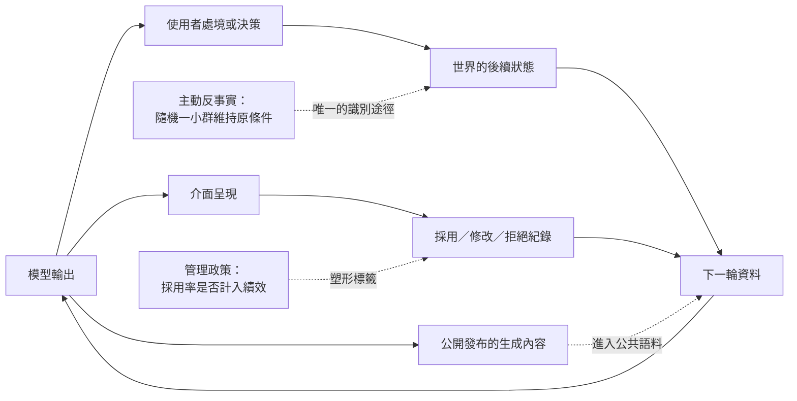

+++
title = "系統參與造成的世界：回流資料與表演性預測"
date = "2026-09-09T03:15:13+08:00"
author = "TTL::0"
draft = false
isCJKLanguage = true
description = "Google Flu Trends 在 2009 年前後以搜尋查詢估計流感活動，早期表現與官方監測數據相當接近。2013 年初的流感季，它的估計高出美國疾病管制中心事後公布數值約兩倍。2014 年發表於 Science 的分析指出幾個原因，其中一項特別值得記下來：媒體對流感的報導本身改變了人們的搜尋行為，而該系統的輸入正是搜尋行為。[Lazer 等人，Science 2014](https://w"
tags = [
    "分析論述", # term:AnalyticalEssay
    "AI 經濟與社會", # term:AiEconomics
    "表演性預測", # term:PerformativePrediction
    "資料回流", # term:DataFeedbackLoop
  ]
series = ["從代理量到可追責結果：AI 效用宣稱的轉換鏈"]
[ai_info]
    [ai_info.generation]
        model = "Claude Opus 5"
        agent = "Claude Code VSCode Extension 2.1.261"
    [ai_info.refinement]
        model = "Claude Opus 5"
        agent = "Claude Code VSCode Extension 2.1.263"
+++

<!--more-->

## 導言

Google Flu Trends 在 2009 年前後以搜尋查詢估計流感活動，早期表現與官方監測數據相當接近。2013 年初的流感季，它的估計高出美國疾病管制中心事後公布數值約兩倍。2014 年發表於 Science 的分析指出幾個原因，其中一項特別值得記下來：媒體對流感的報導本身改變了人們的搜尋行為，而該系統的輸入正是搜尋行為。[Lazer 等人，Science 2014](https://www.science.org/doi/10.1126/science.1248506)

這不是一個關於樣本不足的故事。搜尋量非常大。問題是那個資料的產生過程被系統自己的存在改變了——當一個估計被廣泛報導，它就進入了它所要測量的那個現象。

**表演性預測**（Performative Prediction） <!-- term:PerformativePrediction -->指模型輸出影響人類行動，進而改變後續資料分佈的回饋情形。信用評分改變借款條件，推薦改變消費，生成內容改變未來的訓練語料。[Perdomo 等人](https://proceedings.mlr.press/v119/perdomo20a.html)

> [!IMPORTANT]
> **表演性預測** <!-- term:PerformativePrediction --> (Performative Prediction): 模型輸出影響人類行動，進而改變後續資料分佈的回饋情形。 <!-- anchor:PerformativePrediction -->


本文要處理的問題是：**當模型的輸出改變後續資料時，重訓在追蹤什麼、什麼樣的觀察會自我確認、以及回流資料的標籤如何被管理目標塑形。**

## 分析

### 自我確認：模型的判斷改變了它要預測的事

第一個機制是分佈的改變。當模型的輸出決定了人們的處境，那個處境會改變結果，而改變後的結果看起來像是對模型的驗證。

下面的實驗設定一個信用評分流程：分數低的人拿到較差的條件，較差的條件提高違約機率。兩組的基準違約率完全相同，只有是否表演性不同。

```python
import random
# 表演性預測：模型輸出改變後續資料分佈。重訓在追蹤誰？
# 情境：信用評分決定貸款條件，條件改變違約率。
N, ROUNDS, SEED = 20_000, 6, 7

def run(performative):
    rng = random.Random(SEED)
    people = [(rng.random(), rng.random() < 0.15) for _ in range(N)]  # (訊號, 基準違約)
    threshold = 0.50
    hist = []
    for _ in range(ROUNDS):
        approved = defaults = 0
        observed = []
        for signal, base_bad in people:
            if signal < threshold:            # 分數低 -> 較差條件（較高利率）
                bad = base_bad or (rng.random() < (0.22 if performative else 0.0))
            else:
                bad = base_bad and (rng.random() < (0.55 if performative else 1.0))
            approved += 1
            defaults += bad
            observed.append((signal, bad))
        rate = defaults / approved
        # 以觀察到的資料重訓：把門檻移到讓違約率等於目標
        bads_low = sum(1 for s, b in observed if s < threshold and b)
        n_low = sum(1 for s, _ in observed if s < threshold)
        hist.append((round(threshold, 3), round(rate, 4),
                     round(bads_low / max(n_low, 1), 4)))
        threshold = min(0.95, threshold + 0.08)   # 重訓後收緊
    return hist

for perf, label in ((False, "非表演性"), (True, "表演性")):
    print(f"{label}：")
    print(f"  {'期':>3}{'門檻':>8}{'整體違約率':>12}{'低分組違約率':>14}")
    for i, (t, r, lr) in enumerate(run(perf), 1):
        print(f"  {i:>3}{t:>8.2f}{r:>12.4f}{lr:>14.4f}")
```

實際執行的輸出：

```text
非表演性：
    期      門檻       整體違約率        低分組違約率
    1    0.50      0.1504        0.1497
    2    0.58      0.1504        0.1481
    3    0.66      0.1504        0.1506
    4    0.74      0.1504        0.1497
    5    0.82      0.1504        0.1496
    6    0.90      0.1504        0.1499
表演性：
    期      門檻       整體違約率        低分組違約率
    1    0.50      0.2105        0.3369
    2    0.58      0.2316        0.3347
    3    0.66      0.2519        0.3385
    4    0.74      0.2727        0.3381
    5    0.82      0.2965        0.3416
    6    0.90      0.3114        0.3353
```

非表演性那一組的整體違約率固定在 $0.1504$，收緊門檻完全沒有效果——因為違約與條件無關。

表演性那一組的整體違約率從 $0.2105$ 上升到 $0.3114$。**每一次收緊門檻，都把更多人推進較差的條件，而較差的條件製造更多違約。** 系統的每一次「修正」都使它要預測的問題變大。

第三欄是這個機制最難察覺的部分。低分組的違約率六期都落在 $0.335$ 到 $0.342$ 之間，幾乎不動。從模型驗證的角度看，這是一個表現良好的指標——它說明「被判低分的人確實違約率高」。這個觀察是真的，而它的成因有一部分是模型自己造成的。

**所以「模型的判斷被資料驗證」在表演性情境下不構成證據。** 它與「模型的判斷製造了驗證它的資料」在觀察上不可區分，除非有人主動製造反事實——例如對隨機一小群低分者給予標準條件。

### 回流標籤被管理目標塑形

第二個機制不涉及外部世界，只涉及標籤的產生方式。**資料回流**（Data Feedback Loop） <!-- term:DataFeedbackLoop -->是使用者接受、修改或拒絕的紀錄回到產品與流程更新，進而改變後續系統行為的循環。

> [!IMPORTANT]
> **資料回流** <!-- term:DataFeedbackLoop --> (Data Feedback Loop): 使用者接受、修改或拒絕的紀錄回到產品與流程更新，進而改變後續系統行為的循環。 <!-- anchor:DataFeedbackLoop -->


這個循環的方向看起來是好的。問題出在標籤——「使用者採用了這個建議」被當成品質訊號，而採用行為受管理政策影響。

```python
import random
# 資料回流：以「採用紀錄」為標籤重訓。當採用被計入績效時會發生什麼。
N, ROUNDS, SEED = 30_000, 8, 13

def run(acceptance_pressure):
    rng = random.Random(SEED)
    # 政策以兩個特徵加權：correctness 與 plausibility（看起來合理）
    w_correct, w_plausible = 0.50, 0.50
    hist = []
    for _ in range(ROUNDS):
        accepted_correct = accepted_plausible = 0
        for _ in range(N):
            # 依當前權重挑一個候選輸出
            pick_correct = rng.random() < w_correct / (w_correct + w_plausible)
            if pick_correct:
                accept = rng.random() < 0.82
                accepted_correct += accept
            else:
                # 看起來合理但錯：在採用壓力下更容易被按下「採用」
                accept = rng.random() < (0.55 + acceptance_pressure)
                accepted_plausible += accept
        total = accepted_correct + accepted_plausible
        # 以採用紀錄重訓：被採用得多的那一類權重上升
        w_correct = accepted_correct / total
        w_plausible = accepted_plausible / total
        true_acc = w_correct * 1.0 + w_plausible * 0.0
        hist.append((round(w_correct, 3), round(true_acc, 3)))
    return hist

for press, label in ((0.00, "無採用壓力      "), (0.25, "採用計入績效    "), (0.35, "採用權重高於品質")):
    h = run(press)
    print(f"{label}：")
    print("  正確候選的權重 " + " ".join(f"{w:.2f}" for w, _ in h))
    print(f"  第 8 期的真實正確率 {h[-1][1]:.3f}")
```

實際執行的輸出：

```text
無採用壓力      ：
  正確候選的權重 0.59 0.69 0.77 0.83 0.88 0.92 0.94 0.96
  第 8 期的真實正確率 0.961
採用計入績效    ：
  正確候選的權重 0.51 0.51 0.52 0.53 0.53 0.54 0.54 0.55
  第 8 期的真實正確率 0.553
採用權重高於品質：
  正確候選的權重 0.47 0.46 0.43 0.41 0.38 0.36 0.34 0.32
  第 8 期的真實正確率 0.321
```

無採用壓力時，回流循環運作良好：正確候選的權重從 $0.50$ 升到 $0.96$。

加入採用壓力後，同一個循環把權重推向 $0.55$，再推向 $0.32$。第三組的真實正確率在八期內從 $0.50$ 掉到 $0.321$——**回流機制沒有壞掉，它忠實地學了它被給的標籤。**

值得注意的是這三組的採用率都在上升。從營運儀表板看，三組都是好消息。區分它們需要一個獨立於採用紀錄的結果指標，而那個指標通常要另外花錢採集。

### 生成內容進入下一輪語料

第三個機制的形式與前兩者相同，尺度不同。當生成內容被公開發布，它成為未來訓練語料的一部分。此時「後續資料分佈」的改變不由任何單一部署者決定，而由整體發布量決定。

這使個別組織無法透過自己的行為控制這個回饋。可以控制的只有兩件事：自己發布內容的標記，以及自己訓練資料的來源記錄。兩者都是關於可追溯性的措施，不是關於效果的措施。

### 三個機制的共同形狀

下圖把三者放在一起。它要回答的閱讀問題是：一次重訓所追蹤的分佈裡，有多少是系統自己造成的。



三條路徑匯入「下一輪資料」，而只有最下面那條虛線提供識別能力。它的內容是主動製造反事實：保留一小群不受模型輸出影響的對象。

這是一項有成本的措施——它意味著對某些人刻意不套用模型的建議，而那在效益與公平上都需要說明理由。但沒有它，前三條路徑造成的分佈改變無法與世界本身的改變區分。

### 重訓在追蹤什麼

把上面三個機制合起來，可以回答導言的問題。一次以近期資料進行的重訓，追蹤的是三樣東西的混合：世界的真實變化、系統自己造成的變化、以及標籤產生程序的變化。

三者在資料上不留標記，因此重訓的結果無法告訴我們哪一部分佔多少。能做的是把三者各自對應一個可觀察量：世界的變化對應不受系統影響的外部指標，系統造成的變化對應保留對照組的差異，標籤程序的變化對應管理政策的版本記錄。

## 反思

主張的第一個邊界是輸出不影響後續資料的情形。天氣預報是標準例子——預報不改變天氣。此時表演性的分析完全不適用，而以近期資料重訓是無爭議的正確做法。所以本文不主張所有重訓都有問題，它主張輸出是否進入後續資料是一個必須先回答的問題。

第二個邊界關於歸因的界線。不能把所有內容分佈的變化都歸因於 AI 系統——政策改變、競爭者行為與總體景氣同樣改變資料。第一個實驗的整體違約率上升在真實資料裡會與利率環境、就業狀況混在一起，而那些混淆因子的量級可能大於系統自身的貢獻。

一個反例可以標出主張的另一側。假設一個系統是強表演性的，而它造成的分佈改變**方向是好的**：健康提示改變飲食行為，使後續資料裡的風險真的下降。此時「模型製造了驗證它的資料」在效用上是成功而不是失敗。所以表演性本身不是缺陷；缺陷是把表演性造成的改變讀成關於世界的發現。兩者的區別在於主張的內容，不在於機制。

第三個邊界關於反事實對照的可行性。在受規範的領域，對隨機一小群人維持不同條件可能是被禁止的——信用、醫療與司法都有這個問題。此時識別能力無法取得，能守住的是界限而非點估計：報告一個區間，並明確記錄該區間之所以無法收窄的原因是介入被禁止，而不是資料不足。

最後是實驗的限制。第一個實驗把「較差條件提高違約機率」寫成一個固定機率，而真實的因果強度未知且異質。它證明「自我確認的觀察在表演性情境下不構成證據」，不估計任何真實信用系統的表演性強度。第二個實驗把政策的偏好壓成兩個權重，並讓重訓直接以採用比例更新它們；真實的訓練程序複雜得多，而那個複雜性會使退化更慢但不會改變方向。

## 實務對比

**以近期資料重訓一個模型。** 錯誤做法是直接使用近期資料，理由是它最接近當前分佈。實測顯示表演性情境下整體違約率從 $0.2105$ 升到 $0.3114$，而這個上升有一部分是模型自己造成的。正確做法是先判斷輸出是否進入後續資料；若是，保留一個不受輸出影響的對照組。

**驗證一個評分模型的判斷。** 錯誤做法是檢查低分組的實際結果是否較差。實測顯示低分組違約率六期都落在 $0.335$ 到 $0.342$ 之間，這個觀察在表演性與非表演性情境下都成立。正確做法是對隨機一小群低分者維持標準條件，並比較兩組的結果。

**使用採用紀錄改善產品。** 錯誤做法是把「使用者採用了建議」當成品質訊號。實測顯示採用壓力使真實正確率在八期內從 $0.50$ 掉到 $0.321$，而採用率一路上升。正確做法是把採用紀錄與一個獨立的結果指標分開採集，並記錄採集期間的管理政策版本。

**設定團隊的採用率目標。** 錯誤做法是把 AI 建議的採用率列為績效指標。這會直接污染回流標籤。正確做法是以端到端結果為績效指標，並明確告知採用與否不影響評核。

**報告一次重訓後的改善。** 錯誤做法是比較重訓前後在近期資料上的表現。正確做法是同時報告三樣東西：不受系統影響的外部指標、對照組與處理組的差異、以及該期間的管理政策版本是否改變。

**處理無法設對照組的情形。** 錯誤做法是因為不能做實驗而放棄識別，直接沿用近期資料。正確做法是報告一個界限而非點估計，並明文記錄該界限無法收窄的原因是介入被禁止。

## 結論

當一個系統的輸出進入它要測量的世界時，以近期資料重訓所追蹤的不只是世界，還包括系統自己參與造成的那一部分。

本文的量測給出四個結果：

1. **系統的每次修正可以使它要預測的問題變大。** 表演性情境下收緊門檻六期，整體違約率從 $0.2105$ 升到 $0.3114$；非表演性情境下固定在 $0.1504$。
2. **自我確認的觀察不構成證據。** 低分組違約率六期都落在 $0.335$ 到 $0.342$ 之間，這個「模型判斷正確」的證據在兩種情境下都出現。
3. **回流機制會忠實地學它被給的標籤。** 採用壓力使真實正確率在八期內從 $0.50$ 掉到 $0.321$，而採用率同時上升。
4. **三條路徑在資料上不留標記。** 世界的變化、系統造成的變化、標籤程序的變化混在同一批資料裡，重訓的結果無法分辨比例。

所以在把一次重訓後的改善當成進步之前，要先回答一個問題：這個系統的輸出有沒有進入它的下一批訓練資料。

答案是有的時候，唯一的識別途徑是主動製造反事實——保留一小群不受輸出影響的對象。這件事有成本，而且在某些領域被禁止；那種情形下能守住的不是更準的估計，而是一個誠實標明無法收窄的區間。