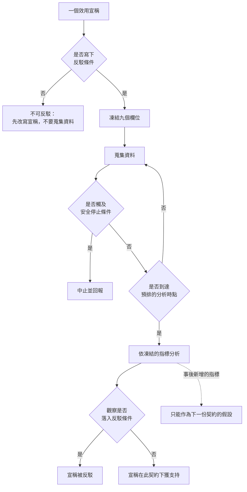

+++
title = "一個效用宣稱要附什麼：驗證契約的九個欄位"
date = "2026-09-09T03:34:14+08:00"
author = "TTL::0"
draft = false
isCJKLanguage = true
description = "2016 年，一組研究者系統性地比對了發表在五份頂尖醫學期刊上的 67 篇臨床試驗報告與它們事前登記的計畫。結果是：只有 9 篇正確報告了全部事先指定的結果指標；累計有 354 個事先指定的指標沒有被報告，而 357 個未經事先指定的新指標被加了進來。[COMPare Trials Project](https://compare-trials.org/)"
tags = [
    "分析論述", # term:AnalyticalEssay
    "AI 經濟與社會", # term:AiEconomics
    "端到端效用", # term:EndToEndUtility
    "貢獻利益", # term:ContributionMargin
  ]
series = ["從代理量到可追責結果：AI 效用宣稱的轉換鏈"]
[ai_info]
    [ai_info.generation]
        model = "Claude Opus 5"
        agent = "Claude Code VSCode Extension 2.1.261"
    [ai_info.refinement]
        model = "Claude Opus 5"
        agent = "Claude Code VSCode Extension 2.1.263"
+++

<!--more-->

## 導言

2016 年，一組研究者系統性地比對了發表在五份頂尖醫學期刊上的 67 篇臨床試驗報告與它們事前登記的計畫。結果是：只有 9 篇正確報告了全部事先指定的結果指標；累計有 354 個事先指定的指標沒有被報告，而 357 個未經事先指定的新指標被加了進來。[COMPare Trials Project](https://compare-trials.org/)

這些試驗都是合法的、經過同儕審查的、由有資格的研究者執行的。它們也都有事前登記——那是法規要求。

**問題不在於有沒有登記，而在於登記之後有沒有被綁住。** 當結果指標可以在看過資料之後更換，一份登記文件就不再構成約束；它變成一份可選菜單。

醫學研究花了數十年建立這套紀律，而它仍然被繞過的比例如此之高。AI 效用宣稱目前完全沒有對應的制度。本文要處理的問題是：**一份使某個效用宣稱可被推翻的契約，最少要包含哪些欄位、每個欄位各自防的是什麼、以及缺少它們時具體會錯到什麼程度。**

## 分析

### 為什麼「可反駁」不等於「可能是錯的」

一個宣稱可反駁，意思是存在一組可觀察的結果，一旦出現就使該宣稱失敗。這與「該宣稱可能是錯的」不同——後者是一個關於信念的陳述，前者是一個關於宣稱形式的性質。

「AI 提升生產力」不可反駁，不是因為它一定對，而是因為沒有任何觀察會使它失敗。生產力可以指多種量，提升可以在任何時間尺度上發生，而「AI」涵蓋任何工具。要使它可反駁，必須把這三者各自收窄到一個具體值。

這使「事前指定」成為可反駁性的前提，而不是一種嚴謹的裝飾。下面兩個實驗把不事前指定的代價算了出來。

### 第一個代價：指標更換

事前不鎖定結果指標時，研究者可以在多個候選中挑選看起來有效的那一個。這個動作的效果可以精確計算。

```python
import random, math
# 指標更換：事前不鎖定指標時，「至少一個看起來有效」的機率。
def any_significant(k_metrics, trials=20_000, n=200, seed=5):
    rng = random.Random(seed)
    hits = 0
    for _ in range(trials):
        for _ in range(k_metrics):
            # 兩組各 n 個樣本，真實效果為零
            a = sum(rng.gauss(0, 1) for _ in range(n)) / n
            b = sum(rng.gauss(0, 1) for _ in range(n)) / n
            z = (a - b) / math.sqrt(2.0 / n)
            if abs(z) > 1.96:
                hits += 1
                break
    return hits / trials

print("真實效果為零。事前不鎖定指標時：")
for k in (1, 3, 6, 12, 20):
    print(f"  候選指標 {k:>2} 個 -> 至少一個顯著的機率 {any_significant(k, trials=4000):.1%}")
```

實際執行的輸出：

```text
真實效果為零。事前不鎖定指標時：
  候選指標  1 個 -> 至少一個顯著的機率 5.0%
  候選指標  3 個 -> 至少一個顯著的機率 14.8%
  候選指標  6 個 -> 至少一個顯著的機率 27.3%
  候選指標 12 個 -> 至少一個顯著的機率 46.5%
  候選指標 20 個 -> 至少一個顯著的機率 64.8%
```

真實效果一律為零。20 個候選指標時，有 64.8% 的機率至少一個看起來顯著。

20 個候選指標在 AI 導入的評估裡不是誇張的數字。完成時間、一次解決率、客戶滿意度、重工率、升級率、覆核分鐘、採用率、留存率、每件成本、每成功任務成本——十個很容易列出，再乘上幾種分組就超過 20 個。

**這就是導言那個比對結果的機制。** 354 個未報告與 357 個新增，不需要任何人存心造假；只要指標在看過資料之後才被選定，這個分佈就會自然出現。

### 第二個代價：停止時點

第二個常被忽略的欄位是停止規則。當觀察可以持續累積、而分析者能決定何時停下來時，名目上的顯著水準不再成立。

```python
import random, math
# 可選擇的停止時點：真實效果為零，邊看邊決定何時停。
def fpr(peeks, n_max=2000, trials=4000, seed=9):
    rng = random.Random(seed)
    hits = 0
    checkpoints = [n_max * (i + 1) // peeks for i in range(peeks)]
    for _ in range(trials):
        sa = sb = 0.0
        significant = False
        for i in range(1, n_max + 1):
            sa += rng.gauss(0, 1); sb += rng.gauss(0, 1)
            if i in checkpoints and i >= 30:
                z = (sa / i - sb / i) / math.sqrt(2.0 / i)
                if abs(z) > 1.96:
                    significant = True
                    break
        hits += significant
    return hits / trials

print("真實效果為零，名目顯著水準 5%：")
for p in (1, 2, 5, 10, 20):
    print(f"  中途查看 {p:>2} 次 -> 實際偽陽性率 {fpr(p):.1%}")
```

實際執行的輸出：

```text
真實效果為零，名目顯著水準 5%：
  中途查看  1 次 -> 實際偽陽性率 5.0%
  中途查看  2 次 -> 實際偽陽性率 8.1%
  中途查看  5 次 -> 實際偽陽性率 13.9%
  中途查看 10 次 -> 實際偽陽性率 18.5%
  中途查看 20 次 -> 實際偽陽性率 24.7%
```

名目水準是 5%。中途查看 20 次使實際偽陽性率變成 24.7%——接近五倍。

這個機制在 AI 部署評估裡幾乎是預設行為，因為儀表板是即時的。**沒有人需要決定「現在停下來」；只要在數字好看的那一週開會報告，效果就等同於在那個時點停止。** 這使停止規則不是一項統計技術細節，而是一項組織紀律。

### 九個欄位，以及每個防的是什麼

把上面兩個代價與其餘常見失效放在一起，一份最低限度的驗證契約有九個欄位。

| 欄位 | 內容 | 防的是什麼 |
| :--- | :--- | :--- |
| 母體 | 資料來自哪些對象、哪條流程 | 事後改變比較對象 |
| 期間 | 觀察起訖與長度 | 挑選有利的時間窗 |
| 分層 | 依什麼分組報告 | 平均值掩蓋反向的分組 |
| 分割 | 建模與封存測試的切法 | 在同一份資料上調參又驗證 |
| seed | 隨機程序的固定值 | 執行變異被讀成效果 |
| 指標 | 事前鎖定的結果指標清單 | 指標更換 |
| 控制變因 | 必須固定或記錄的參數 | 未固定座標的共同變動 |
| 反駁條件 | 哪一組觀察會使宣稱失敗 | 宣稱不可反駁 |
| 停止規則 | 何時必須中止或結束 | 可選擇的停止時點 |

第三欄是這張表的用途。九個欄位不是格式要求，每一個對應一種已經被算出代價的失效。

下面的程式把這張表寫成一個可執行的分級。

```python
# 一份驗證契約的最低形式：九個欄位，缺一即降級。
FIELDS = ("population", "period", "strata", "split", "seed",
          "metrics", "controls", "refutation", "stop_rule")

def grade(contract):
    missing = [f for f in FIELDS if f not in contract]
    if "refutation" in missing:
        return "不可反駁：沒有任何觀察會使該宣稱失敗"
    if missing:
        return f"可反駁但不可重現：缺 {missing}"
    return "可反駁且可重現"

CONTRACTS = [
    {"population": "一條工作流", "period": "12 週", "metrics": ["完成時間"]},
    {"population": "一條工作流", "period": "12 週", "strata": "任務類型",
     "split": "前 8 週建模／後 4 週鎖定", "seed": 41,
     "metrics": ["完成時間", "重工率", "重大損害率", "每件貢獻利益"],
     "controls": ["客戶層級", "模型版本", "權限"],
     "refutation": "模型指標改善而端到端效用未改善"},
    {"population": "一條工作流", "period": "12 週", "strata": "任務類型",
     "split": "前 8 週建模／後 4 週鎖定", "seed": 41,
     "metrics": ["完成時間", "重工率", "重大損害率", "每件貢獻利益"],
     "controls": ["客戶層級", "模型版本", "權限"],
     "refutation": "模型指標改善而端到端效用未改善",
     "stop_rule": "重大損害超過預設上限即停止"},
]
for c in CONTRACTS:
    print(f"[{grade(c)}]")
    print(f"  欄位數 {len(c)}/9\n")
```

實際執行的輸出：

```text
[不可反駁：沒有任何觀察會使該宣稱失敗]
  欄位數 3/9

[可反駁但不可重現：缺 ['stop_rule']]
  欄位數 8/9

[可反駁且可重現]
  欄位數 9/9
```

三個層級的區分方式值得說明。反駁條件缺席時，契約落在最低層——不是品質差，是類型不同。缺少其餘欄位的契約仍然可以被推翻，只是別人無法重現它的推翻過程。

### 兩個特別容易缺的欄位

九個欄位裡有兩個在實務中最常空著，而它們空著的理由不同。

**反駁條件**空著，是因為寫下它需要事先承認自己可能錯。一份寫著「若模型指標改善而**端到端效用**（End-To-End Utility） <!-- term:EndToEndUtility -->未改善，則本主張被反駁」的契約，把作者置於一個可以輸的位置。這是一個組織政治問題，不是方法問題。

> [!IMPORTANT]
> **端到端效用** <!-- term:EndToEndUtility --> (End-To-End Utility): 扣除整合、人工與失誤成本後，一條完整流程實際交付給使用者的價值。 <!-- anchor:EndToEndUtility -->


**停止規則**空著，是因為它同時承擔兩個不同的功能：一個是統計上的（不可任意查看後停止），一個是安全上的（損害超過上限即中止）。兩者都必須寫，而它們常被誤認為同一件事。安全停止是無條件的，統計停止是預先排定的；把安全停止寫成唯一的停止規則，會讓偽陽性率保持在 24.7% 那一列。

### 契約的位置

下圖把契約放在整個判斷流程裡。它要回答的閱讀問題是：契約在什麼時候必須被凍結。



圖上有一條刻意畫出的虛線：事後新增的指標不是禁忌，它只是不能用來支持當前這個宣稱。它的正確去處是下一份契約的假設。這條路徑存在，才使凍結是可執行的紀律而不是對探索的禁令。

「凍結」的時點也值得注意：它在蒐集資料之前，不在分析之前。分析之前凍結是不夠的，因為資料已經可見。

## 反思

九個欄位不是對所有主張的要求。當一個決定完全可逆、成本很低、且錯了立刻會知道時，寫一份九欄契約的成本高於它防止的損失。這類決定應該直接試，而不是先設計驗證。九個欄位的觸發點是決定不可逆、或錯誤要很久才顯現。

一個反例可以標出主張的邊界。假設一份契約九欄齊備、程序完全遵守，而結論仍然錯——因為契約所依據的參考點本身有問題。若比較的基準是由同一批人依同一份指引產生的，那份契約會忠實地確認一個共同的錯誤。九個欄位保護的是程序的可反駁性，不保護基準的正確性；後者需要至少兩個失格條件不重疊的參考來源，而那通常昂貴得多。

第二個邊界關於凍結的成本。事前鎖定指標意味著放棄在過程中學到的東西。當研究對象本身是新的、沒人知道該量什麼時，過早凍結會鎖進一組不相關的指標。此時較合理的做法是分兩階段：第一階段明確標示為探索性、不產生任何宣稱，第二階段依探索結果凍結一份新契約。把探索階段的結果當成結論，是這個邊界最常見的誤用。

第三個邊界關於可行性。九個欄位假設分割、控制與停止都在執行者的權限內。在觀察性資料上——例如只能取得公司季報的情形——分割與控制大部分不可得。此時能守住的是把不可得的欄位明文標記為不可得，而不是留空。標記為不可得的契約仍然可反駁，只是反駁的力度較弱；留空的契約看起來與齊備的契約相同。

最後是實驗的限制。兩個實驗都用常態抽樣與雙尾檢定，並假設各指標獨立。真實的候選指標高度相關，因此第一個實驗高估了獨立情形下的膨脹——相關性會使 20 個指標的有效檢定數少於 20。第二個實驗的查看時點是等距的，而真實的查看由會議排程與數字好壞共同決定，那會使偽陽性率高於此處的估計。兩者共同證明「不事前鎖定有可計算的代價」，不給出任何真實評估的偽陽性率。

## 實務對比

**提出一個 AI 效用宣稱。** 錯誤做法是寫「導入後生產力提升」。正確做法是寫成九欄形式，其中反駁條件必須是一組具體的觀察，例如「模型指標改善而端到端每件成本未下降」。

**選擇評估指標。** 錯誤做法是先蒐集所有可得的指標，之後報告有改善的那些。實測顯示真實效果為零時，20 個候選指標有 64.8% 的機率至少一個顯著。正確做法是在蒐集資料之前鎖定四到五個主要指標，其餘明確標示為探索性。

**決定何時回報結果。** 錯誤做法是在儀表板數字好看的那一週安排報告。實測顯示中途查看 20 次使偽陽性率從 5.0% 升到 24.7%。正確做法是事前排定分析時點，並把安全停止與統計停止分開寫。

**處理事後才想到的指標。** 錯誤做法是把它加進當前的報告。正確做法是把它記為下一份契約的假設，並在當前報告中標明它未被事前指定。

**在只有觀察性資料時做出宣稱。** 錯誤做法是把不可得的欄位留空，讓契約看起來齊備。正確做法是把分割、控制與停止規則明文標記為不可得，並據此把宣稱的強度降級為條件式。

**檢查別人的效用宣稱。** 錯誤做法是評估它的證據是否充分。正確做法是先數欄位：反駁條件缺席時，這個宣稱還不在可討論的類型裡，要求更多證據沒有意義；要求的應該是把宣稱改寫成可反駁的形式。

## 結論

一個效用宣稱要進入可討論的狀態，需要的不是更多證據，而是一份把自己綁住的契約。

本文的量測給出四個結果：

1. **不鎖定指標的代價可以精確計算。** 真實效果為零時，20 個候選指標有 64.8% 的機率至少一個顯著。
2. **不寫停止規則的代價同樣可以計算。** 名目 5% 的顯著水準，在中途查看 20 次後實際偽陽性率是 24.7%。
3. **這兩個代價不需要任何人造假就會出現。** 一份跨越五份頂尖期刊、67 篇試驗的比對顯示 354 個事先指定的指標未被報告、357 個新指標被加入，而這些試驗都有法規要求的事前登記。
4. **契約的欄位缺席有兩種不同的後果。** 反駁條件缺席使宣稱落到另一個類型——不可反駁；其餘欄位缺席使宣稱可反駁但不可重現。

所以在蒐集任何資料之前，先寫下一句話：什麼樣的觀察會使我放棄這個主張。

寫不出那句話時，問題不在資料不足。問題在這個主張目前還不是一個主張——它是一個立場，而立場不會被資料改變。