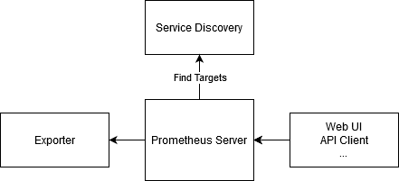
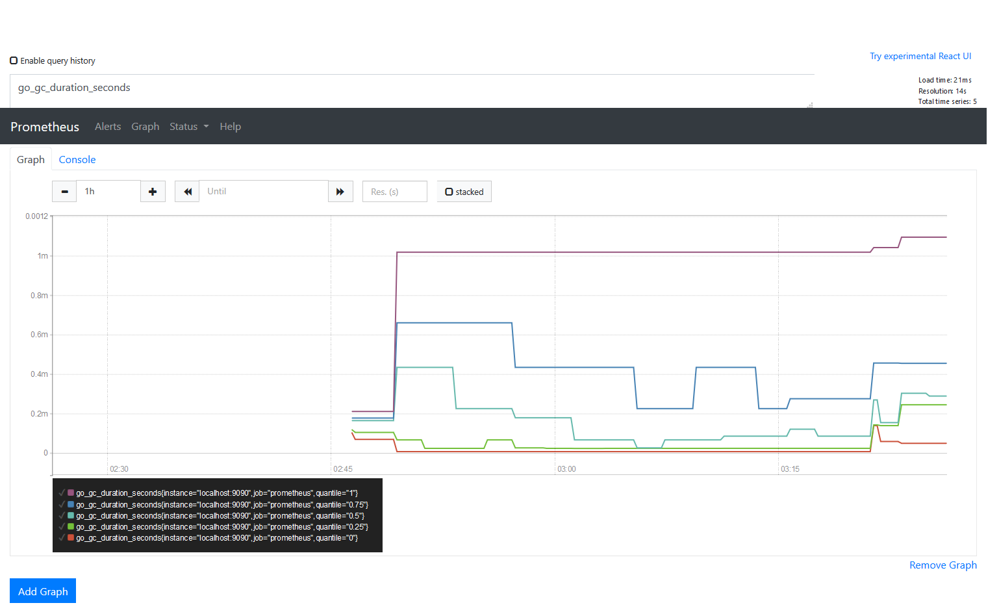
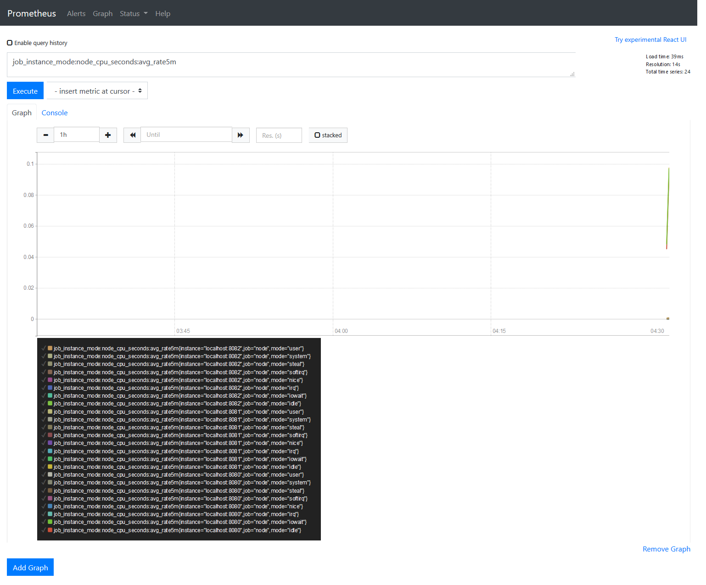
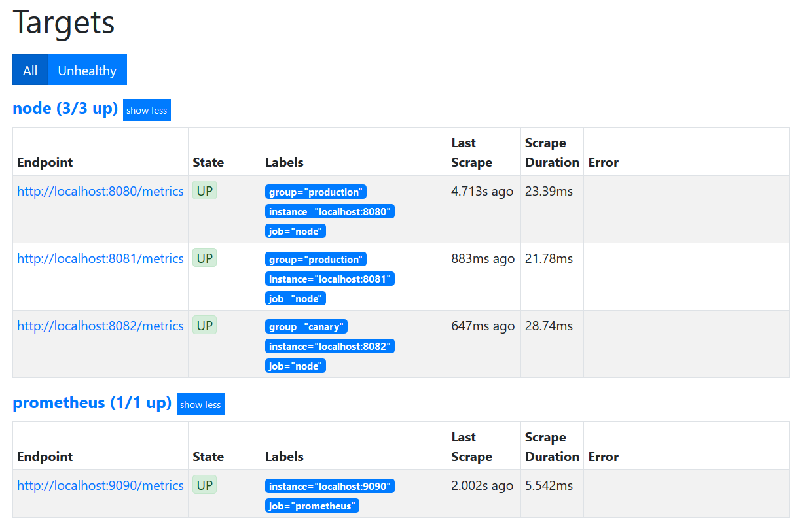
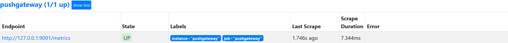

<!--more-->

Prometheus 的基礎運作架構其實非常直觀，這是當時參考官方說明所理解的架構圖：
  

  
從架構圖中可以看出，Prometheus 收集時間序列資料 (metrics) 的核心邏輯是由 Server 端主動向 Exporter 發起請求。在這次的「整活」實驗中，我完成了以下幾個核心環節。

## 1. 我啟動 Prometheus 服務

部署 Prometheus 的過程比我想像中簡單許多。它基本上就是一個 binary 執行檔配上一個設定檔。當時的部署指令如下：

```bash
$ wget https://github.com/prometheus/prometheus/releases/download/v2.20.1/prometheus-2.20.1.linux-amd64.tar.gz
$ tar zxvf prometheus-2.20.1.linux-amd64.tar.gz
$ cd prometheus-2.20.1.linux-amd64
```

接著是我當時定義的基礎設定檔 `prometheus.yml`：

```yaml:prometheus.yml
# global config
global:
  scrape_interval:     15s 
  evaluation_interval: 15s 

# Alertmanager configuration
alerting:
  alertmanagers:
  - static_configs:
    - targets:
      # - alertmanager:9093

# A scrape configuration
scrape_configs:
  - job_name: 'prometheus'
    static_configs:
    - targets: ['localhost:9090']
```

啟動服務：

```bash
$ ./prometheus --config.file=prometheus.yml
```

隨即使用 cURL 測試了一下輸出的 metrics，看到一串長長的資料跳出來時，那種實驗成功的快感真的很紮實。即便算上下載時間，整個過程竟然不到五分鐘。

拿到數據後，我直接進入瀏覽器查看 `http://prometheus_ip:9090/graph`。簡單選了幾個 Graph，Prometheus 就已經能幫我畫出漂亮的圖表了。



## 2. 我啟動 Exporter 進行監控

Prometheus Server 跑起來後，接著嘗試監控具體的主機狀態，於是下載了 `node_exporter` 來做測試：

```bash
wget https://github.com/prometheus/node_exporter/releases/download/v1.0.1/node_exporter-1.0.1.linux-amd64.tar.gz
tar zxvf node_exporter-1.0.1.linux-amd64.tar.gz
cd node_exporter-1.0.1.linux-amd64
```

這裡同樣只需要執行 binary file：

```bash
./node_exporter --web.listen-address 127.0.0.1:8080
```

同樣地，我用 `curl localhost:8080/metrics` 測試，服務立刻就返回了大量的系統指標。這種簡單快速的設計，正是 Prometheus 令人著迷的地方。

## 3. 使用 Static Config 工具監控

確定 Exporter 運作正常後，開始建立正式的 Job 來獲取數據。參考了官方文件，試著建立一個更完整的監控定義。

首先建立了 `prometheus.rules.yml`，用來定義如何控制記錄方式，例如計算五分鐘的平均 CPU 狀態，這能大大減輕監控 Server 的負擔：

```yaml:prometheus.rules.yml
groups:
- name: cpu-node
  rules:
  - record: job_instance_mode:node_cpu_seconds:avg_rate5m
    expr: avg by (job, instance, mode) (rate(node_cpu_seconds_total[5m]))
```

接著我修改了 `prometheus.yml`，將剛才我啟動的 Exporter 加入監控對象：

```yaml:prometheus.yml
global:
  scrape_interval:     15s
  evaluation_interval: 15s

rule_files:
  - 'prometheus.rules.yml'

scrape_configs:
  - job_name: 'prometheus'
    scrape_interval: 5s
    static_configs:
      - targets: ['localhost:9090']

  - job_name: 'node'
    scrape_interval: 5s
    static_configs:
      - targets: ['localhost:8080', 'localhost:8081']
        labels:
          group: 'production'
```

重啟 Prometheus 後，我在 Graph 介面就能成功 Query 到剛才定義的 Job info 了。



## 4. 進階：使用 File-based Service Discovery

在實際的工程環境中，不可能每增加一個 Exporter 就去手動改設定並重啟 Server，這太不優雅了。這時 **File-based Service Discovery** 就派上用場了。

只需在目錄中建立一個 `file_sd.yml`，並讓 Prometheus 去讀取它即可。

```yaml:prometheus.yml
  - job_name: 'node'
    scrape_interval: 5s
    file_sd_configs:
      - files:
        - ./file_sd.yml
```

接著，我直接在 `file_sd.yml` 中填寫我的監控目標。神奇的是，當我修改這個外部檔案時，Prometheus 會自動感知到變化並抓取新數據，完全不需要我們手動 Reload。



## 5. 跨越網路限制：Pushgateway 的應用

Prometheus 原本設計是 Pull 模式，但在許多複雜的網路架構下，並不一定能讓 Prometheus Server 穿透層層防火牆去拉資料。這時 **Pushgateway** 就是救星。

簡單來說，讓那些分散的服務主動把 metrics 「推」到 Pushgateway，然後再讓 Prometheus 去 Pushgateway 統一拉取，如下圖所示：
  


下載與我啟動一樣極其快速：

```bash
$ ./pushgateway --web.listen-address 0.0.0.0:9091 --persistence.file pg_file
```

隨後我嘗試了一次手動 Push 測試：

```bash
$ cat <<EOF | curl --data-binary @- http://127.0.0.1:9091/metrics/job/some_job/instance/some_instance
# TYPE some_metric counter
some_metric{label="val1"} 42
EOF
```

我在 Web 介面上立刻就看到了剛才推上去的資料。最後，只需在 `prometheus.yml` 中把這個 Pushgateway 當成一個常規的 Job 就完事了：

```yaml:prometheus.yml
  - job_name: 'pushgateway'
    static_configs:
    - targets: ['127.0.0.1:9091']
      labels:
        instance: pushgateway
```



## 實驗總結

透過這次的初探實驗，深刻體會到 Prometheus 的彈性。無論是靜態監控、動態發現數據源，還是透過 Pushgateway 應對複雜網路環節，它都展現了極高的可用性。這份筆記記錄了我最初的腳步，也是我日後構建更複雜觀測系統的基礎。