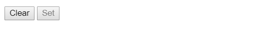

首先，建立一個空空如也的 Vue Instance
```html {linenos=table, linenostart=1}
<div id="app">
</div>

<script src="https://cdn.jsdelivr.net/npm/vue/dist/vue.js"></script>
<script>
  new Vue({
    el: '#app'
  })
</script>
```

動態更新勢必要用個timer，所以預計採用setInterval()及clearInterval()，那麼做兩個按鈕，分別叫「Start」及「Stop」方便辨識，並做互鎖
```html {linenos=table, linenostart=1, hl_lines=["2-14", 22]}
<div id="app">
  <button
    :disabled="!isStarted"
    v-on:click="isStarted = false"
  >
    Stop
  </button>

  <button
    :disabled="isStarted"
    v-on:click="isStarted = true"
  >
    Start
  </button>
</div>

<script src="https://cdn.jsdelivr.net/npm/vue/dist/vue.js"></script>
<script>
  new Vue({
    el: '#app',
    data: {
      isStarted: true
    }
  })
</script>
```

按鈕完成囉
  

  

## 1. 整理API Query Parameters