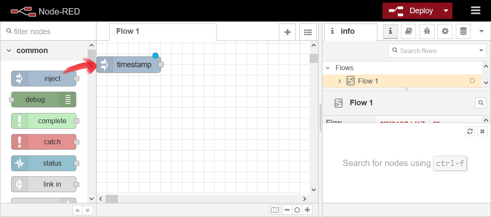
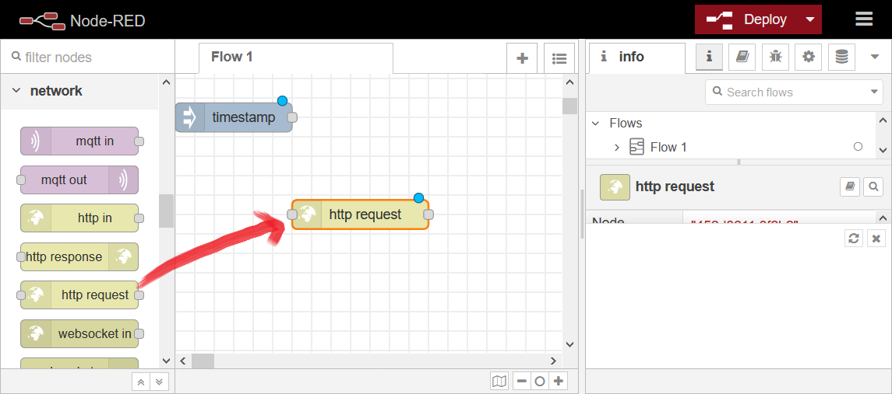
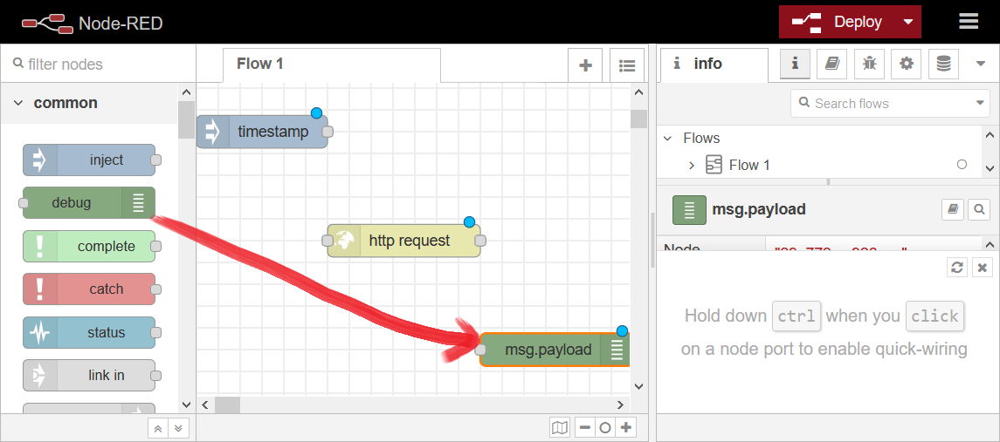
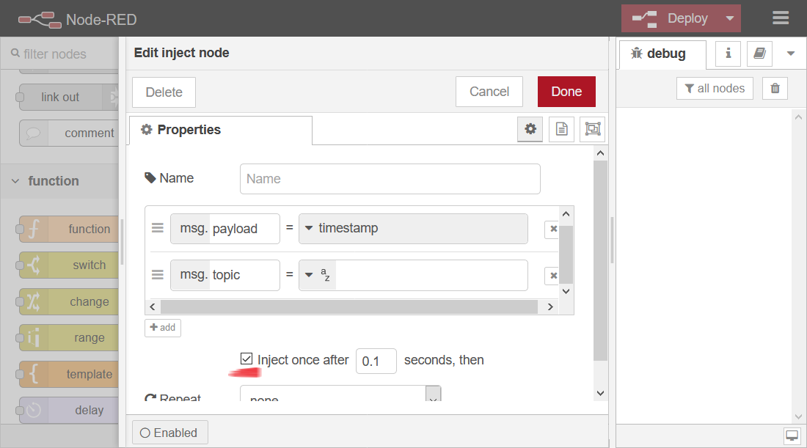
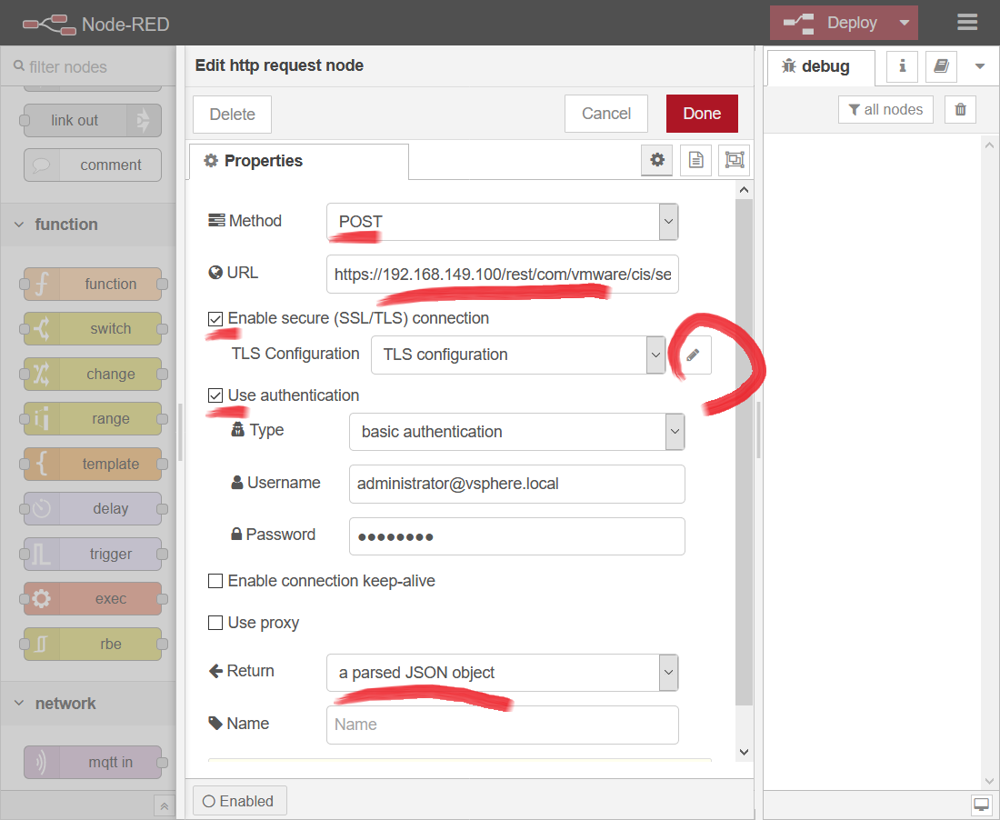
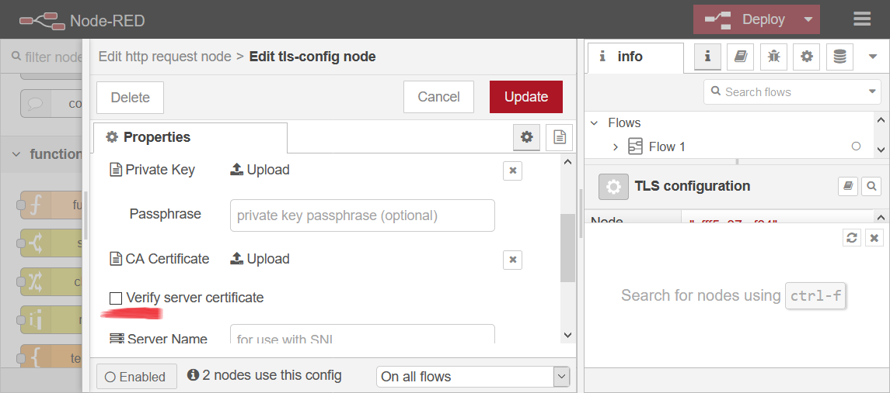
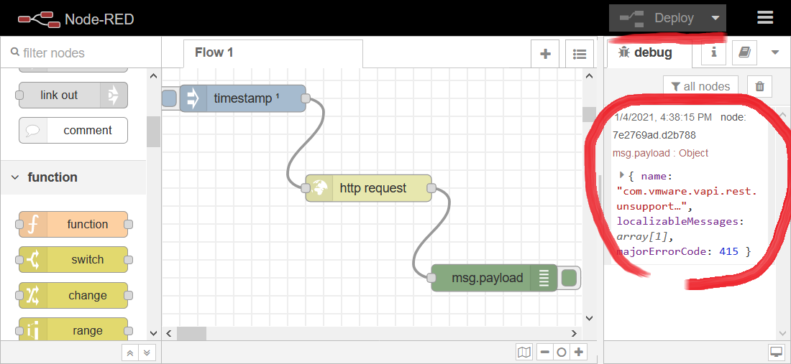
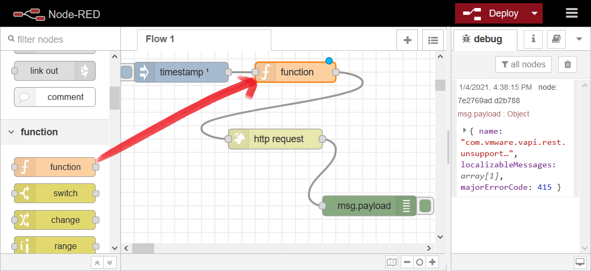
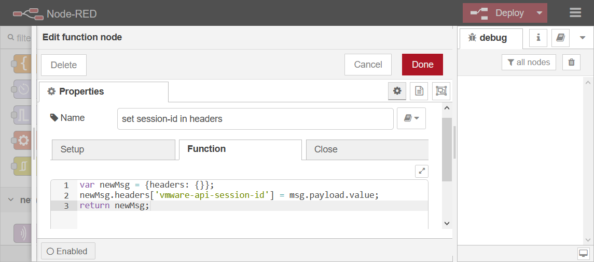
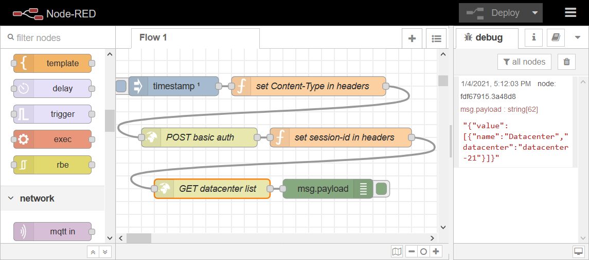

<!--more-->
  

## 1. 測試vCenter

首先參考<a href="https://developer.vmware.com/docs/vsphere-automation/latest/vcenter/vcenter/" target="_blank">VMware官方文件的記述</a>來使用vCenter的REST API，本次實驗操作vCenter的步驟，就選擇抓datacenter的列表了，以cURL的操作範例如下：
  

* 使用basic auth取得session id
  
```
$ curl -k -X POST -u 'administrator@vsphere.local:password' https://192.168.149.100/rest/com/vmware/cis/session
{"value":"b66ece43566e6b325dd7cdfc30fd2457"}
```
  
* 使用session id取得datacenter列表
  
```
$ curl -k -X GET --header 'vmware-api-session-id: b66ece43566e6b325dd7cdfc30fd2457' https://192.168.149.100/rest/vcenter/datacenter
{"value":[{"name":"Datacenter","datacenter":"datacenter-21"}]}
```

所以理論上要獲得一模一樣的結果

## 2. 安裝Node-RED

準備安裝主角的<a href="https://nodered.org/docs/getting-started/" target="_blank">Node-RED</a>，安裝方法眾多，這裡選擇用docker compose
```:docker-compose.yml
version: "3.7"

services:
  node-red:
    image: nodered/node-red:latest
    ports:
      - "1880:1880"
    networks:
      - node-red-net
    volumes:
      - node-red-data

volumes:
  node-red-data:

networks:
  node-red-net:
```

輸入指令就能用了，接下來只要打開瀏覽器，在網址輸入http://[hostname or ip]:1880，就能使用，且會是第一個flow的畫面
```text {hl_lines=[26]}
# docker-compose up
Starting node-red_node-red_1 ... done
Attaching to node-red_node-red_1
node-red_1  | 
node-red_1  | > node-red-docker@1.2.6 start /usr/src/node-red
node-red_1  | > node $NODE_OPTIONS node_modules/node-red/red.js $FLOWS "--userDir" "/data"
node-red_1  | 
node-red_1  | 5 Jan 03:17:37 - [info] 
node-red_1  | 
node-red_1  | Welcome to Node-RED
node-red_1  | ===================
node-red_1  | 
node-red_1  | 5 Jan 03:17:37 - [info] Node-RED version: v1.2.6
node-red_1  | 5 Jan 03:17:37 - [info] Node.js  version: v10.23.0
node-red_1  | 5 Jan 03:17:37 - [info] Linux 3.10.0-1160.11.1.el7.x86_64 x64 LE
node-red_1  | 5 Jan 03:17:37 - [info] Loading palette nodes
node-red_1  | 5 Jan 03:17:38 - [info] Settings file  : /data/settings.js
node-red_1  | 5 Jan 03:17:38 - [info] Context store  : 'default' [module=memory]
node-red_1  | 5 Jan 03:17:38 - [info] User directory : /data
node-red_1  | 5 Jan 03:17:38 - [warn] Projects disabled : editorTheme.projects.enabled=false
node-red_1  | 5 Jan 03:17:38 - [info] Flows file     : /data/flows.json
node-red_1  | 5 Jan 03:17:38 - [warn] 
...
node-red_1  | 5 Jan 03:17:38 - [info] Starting flows
node-red_1  | 5 Jan 03:17:38 - [info] Started flows
node-red_1  | 5 Jan 03:17:38 - [info] Server now running at http://127.0.0.1:1880/
```

## 3. Node基本介紹

首先我建立基本的三個node，由inject開始，此為flow我啟動的起始點，拉過來名稱會自動顯示為timestamp



再來是http request



最後是debug，能將最後的msg顯示出來



## 4. 從vCenter取得session id

現在有三個node了，接下來就取得必要的id，基本上vCenter REST API所有動作都必須要帶上這個id


設定inject node，紅色處打勾勾，如此一來在deploy的0.1秒會執行，repeat維持None，不做repeat



設定request，這裡比較複雜一點，method為POST，url指向vCenter的auth url，如果vCenter沒有有效憑證的話請設定TLS configuration，停用Verify server certificate(註1)，最後設定basic auth



此為註1



接下來把各node連起來就能deploy了，得到一個華麗的error，unsupported media type



unsupported media type是指API無法辨識POST content type，這裡要給他多一個http header告訴server咱們的type是啥，所以在inject與request之前增加一個function node



msg本身為object，增加一個nested object，key為headers，裡面放的就是咱們的header


接下來再deploy一次就能取得session id了


## 5. 使用session id

接下來新增一些node，主要是再來一組function與http request，避免混亂補上命名


建立一個新的nested object做為新的msg，並於headers中增加`vmware-api-session-id`，value則是從舊的msg中抽出



取得datacenter list的request，method為GET，比POST basic auth單純許多


deploy後就能看到datacenter list了，跟最前面使用cURL測試的結果一樣

