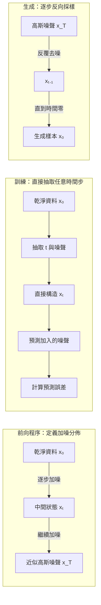

+++
title = "Diffusion 如何從噪聲生成：加噪分佈、去噪目標與反向採樣"
date = "2026-09-06T02:36:08+08:00"
author = "TTL::0"
draft = false
isCJKLanguage = true
description = "擴散模型把生成拆成多個小步驟：前向逐步加噪，模型在各噪聲尺度預測噪聲，生成時反向採樣。說明多步轉移為何比一次映射更容易訓練。"
tags = [
    "分析論述", # term:AnalyticalEssay
    "大型語言模型", # term:Llm
    "擴散模型", # term:DiffusionModel
    "實務對比", # term:PracticalContrastiveExamples
    "差異", # term:Delta
    "反思", # term:Reflection
    "導言", # term:Introduction
  ]
series = ["統計模型如何學習：同一套骨架，如何長出不同的參數與表示"]
[ai_info]
    [ai_info.generation]
        model = "GPT 5.6 Sol"
        agent = "Codex VS Code extension 26.901.22334"
    [ai_info.refinement]
        model = "Claude Opus 5"
        agent = "Claude Code VSCode Extension 2.1.261"
+++

---

<!--more-->

## 導言

**擴散模型**（Diffusion Model） <!-- term:DiffusionModel -->把生成問題拆成多個較小步驟。訓練時逐步對真實資料加入噪聲，模型學習在不同噪聲程度下預測被加入的噪聲；生成時則從隨機噪聲開始反向取樣。

> [!IMPORTANT]
> **擴散模型** <!-- term:DiffusionModel --> (Diffusion Model): 以前向加噪與反向去噪的多步轉移建立生成程序的模型族。 <!-- anchor:DiffusionModel -->


「去噪」容易讓人以為模型只是在修復影像。它真正學習的是一族受時間條件控制的向量場或轉移分佈，使樣本逐步朝訓練資料的高機率區域移動。

## 分析

常見前向程序定義為：

$$
q(x_t\mid x_{t-1})
=\mathcal N(\sqrt{1-\beta_t}\,x_{t-1},\beta_tI).
$$

令 $\alpha_t=1-\beta_t$ 且 $\bar\alpha_t=\prod_{s=1}^{t}\alpha_s$，便能直接從原始資料取得任意時間步：

$$
x_t=\sqrt{\bar\alpha_t}x_0
+\sqrt{1-\bar\alpha_t}\epsilon,
\qquad \epsilon\sim\mathcal N(0,I).
$$

這個封閉形式讓訓練不必真的逐步加噪。模型可隨機抽取 $t$，再最小化噪聲預測誤差：

$$
L(\theta)=
\mathbb E_{x_0,t,\epsilon}
\left[\|\epsilon-\epsilon_\theta(x_t,t)\|_2^2\right].
$$

前向程序、訓練與生成共用相同的時間索引，卻不是同一條逐步運算。下圖將三者分開：



關鍵**差異**（Delta） <!-- term:Delta -->是訓練可直接構造某個 $x_t$，生成時卻通常必須沿反向路徑多次更新。這也解釋了為何訓練目標相似的模型，仍可能因採樣器與步數不同而有不同速度和品質。

> [!IMPORTANT]
> **差異** <!-- term:Delta --> (Delta): 特定變更的契約，用於驅動實作並作為驗證實作的基準對象。 <!-- anchor:Delta -->


下列實驗展示訊號與噪聲的比例如何隨 $\bar\alpha_t$ 改變：

```python
import numpy as np

rng = np.random.default_rng(11)
x0 = np.array([1.0, -1.0, 0.5, -0.5])
noise = rng.normal(size=x0.shape)

for alpha_bar in (0.9, 0.5, 0.1, 0.01):
    xt = (np.sqrt(alpha_bar) * x0
          + np.sqrt(1 - alpha_bar) * noise)
    correlation = np.corrcoef(x0, xt)[0, 1]
    print(alpha_bar, np.round(xt, 3), round(correlation, 3))
```

當 $\bar\alpha_t$ 變小，原始訊號係數下降。單次四維樣本的相關係數會受隨機性影響，但公式清楚顯示訊號與噪聲如何混合。

生成階段使用學得的 $\epsilon_\theta$ 估計反向轉移。採樣器、步數與噪聲排程會影響速度和品質，但不能在沒有實驗時籠統宣稱誤差必然逐步放大。

## 反思

擴散模型 <!-- term:DiffusionModel -->的能力來自把困難的整體生成拆成多個條件去噪問題。這個分解通常讓訓練比對抗式目標穩定，但生成需要多次網路評估，形成新的計算取捨。

前向加噪是預先指定的程序，反向去噪才由資料學得。模型不是從噪聲中發現自然法則，而是在選定的噪聲程序與目標函數下估計資料分佈的局部方向。

## 實務對比

錯誤說法是「每一步都有誤差，所以步數越多品質必然越差」。更多步驟可能降低離散化誤差，也可能增加計算；結果取決於模型、採樣器與排程。

另一個錯誤是把訓練中的噪聲當成污染資料。人工加噪具有已知分佈與明確預測目標；錯誤標註或未知來源偏差則會改變模型所估計的資料關係。

合理比較需要固定模型與資料，只改變採樣方法或步數。若同時改動 guidance、解析度與隨機種子，就無法把品質差異 <!-- term:Delta -->歸因於單一因素。

## 結論

擴散模型 <!-- term:DiffusionModel -->以已知前向程序建立不同噪聲尺度，再學習反向去噪所需的條件估計。它的生成能力不是一次完成映射，而是由多步轉移共同形成。

噪聲在這裡是受控的訓練工具，不是泛稱的錯誤資訊。理解前向分佈、訓練目標與反向採樣的分工，才能準確討論擴散模型 <!-- term:DiffusionModel -->學到了什麼。

基本公式與簡化目標見 Ho、Jain 與 Abbeel 的 [Denoising Diffusion Probabilistic Models](https://arxiv.org/abs/2006.11239)。