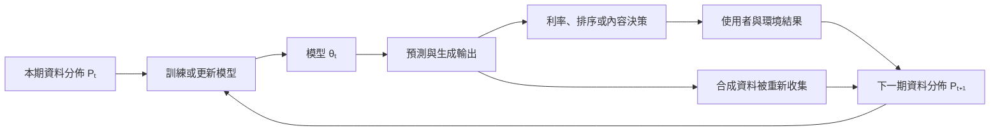

+++
title = "模型沒有改變，世界卻改變了：分佈漂移與回饋迴圈"
date = "2026-09-06T02:58:06+08:00"
author = "TTL::0"
draft = false
isCJKLanguage = true
description = "參數完全不變，模型仍可能失去效用。拆解分佈漂移與模型內部退化為何症狀相同，以及輸出影響行動後形成的動態回饋。"
tags = [
    "分析論述", # term:AnalyticalEssay
    "AI 代理人", # term:AiAgent
    "分佈漂移", # term:DistributionShift
    "表演性預測", # term:PerformativePrediction
    "實務對比", # term:PracticalContrastiveExamples
    "差異", # term:Delta
    "反思", # term:Reflection
    "導言", # term:Introduction
  ]
series = ["模型能力如何失效：在歸咎模型之前，先固定比較條件"]
[ai_info]
    [ai_info.generation]
        model = "GPT 5.6 Sol"
        agent = "Codex VS Code extension 26.901.22334"
    [ai_info.refinement]
        model = "Claude Opus 5"
        agent = "Claude Code VSCode Extension 2.1.261"
+++

---

<!--more-->

## 導言

部署模型可以在參數完全不變時失去效用。使用者族群、感測器、政策與語言都可能改變，使訓練資料不再代表目前世界。

這種**分佈漂移**（Distribution Shift） <!-- term:DistributionShift -->與模型內部退化具有相同症狀，卻需要不同處理。更複雜的是，模型輸出可能影響人類行動，進而改變下一批資料。

> [!IMPORTANT]
> **分佈漂移** <!-- term:DistributionShift --> (Distribution Shift): 部署資料的分佈偏離訓練分佈，使模型在參數不變下失去效用的現象。 <!-- anchor:DistributionShift -->


## 分析

固定模型 $f_\theta$ 時，來源與目標風險分別為：

$$
R_{P_0}(\theta)=
\mathbb E_{(x,y)\sim P_0}[\ell(f_\theta(x),y)],
\qquad
R_{P_1}(\theta)=
\mathbb E_{(x,y)\sim P_1}[\ell(f_\theta(x),y)].
$$

即使 $\theta$ 不變，只要 $P_0\neq P_1$，兩個風險就可能不同。輸入比例改變、標籤比例改變，以及 $P(y\mid x)$ 改變具有不同含義；只看單一特徵平均值無法完整辨認。

當預測導致決策，資料分佈還可能依賴模型：

$$
P_{t+1}=\mathcal D(\theta_t,P_t).
$$

這類**表演性預測**（Performative Prediction） <!-- term:PerformativePrediction -->不是單純被動漂移。例如信用風險分數影響利率，利率又可能影響違約結果；重新訓練因此追逐的是受自身決策改變的目標。

> [!IMPORTANT]
> **表演性預測** <!-- term:PerformativePrediction --> (Performative Prediction): 模型輸出影響人類行動，進而改變後續資料分佈的回饋情形。 <!-- anchor:PerformativePrediction -->


一旦模型輸出介入世界，資料、模型與決策便形成兩個相扣的回饋迴圈：



上方主迴圈描述決策改變真實結果，下方支線描述模型輸出直接進入未來訓練資料。兩者都會讓 $P_{t+1}$ 依賴目前模型，但介入機制不同，診斷與治理方式也不能混為一談。

遞迴生成資料提供另一種回饋。下列玩具實驗讓每一代從上一代估計的罕見事件機率重新抽樣。有限樣本可能使尾端事件消失。

```python
import random

rng = random.Random(8)
rare_probability = 0.05
sample_size = 100

for generation in range(12):
    rare_count = sum(
        rng.random() < rare_probability
        for _ in range(sample_size)
    )
    print(generation, round(rare_probability, 3), rare_count)
    rare_probability = rare_count / sample_size
```

這個模型只展示有限抽樣如何累積尾部資訊損失。它不能證明所有合成資料都會造成模型坍縮；保留真實資料、標示來源、改善抽樣與改變資料混合都可能改變結果。

## 反思

環境失配揭示「能力」具有關係性。模型可能仍精確執行原來的映射，但那個映射已不適合新的資料生成程序。稱它退化並非完全錯誤，卻會模糊修復位置。

回饋迴圈還破壞了資料獨立於模型的直覺。推薦、定價、信貸與內容生成系統都可能參與塑造下一輪觀察；歷史資料不再只是世界的被動紀錄。

## 實務對比

錯誤做法是線上準確率下降便立即微調。若上游感測器校準錯誤，微調可能讓模型適應故障訊號，並在修復感測器後再次失效。

較好的做法先比較輸入、標籤與錯誤切片，確認改變位於哪個條件分佈。偵測到統計**差異**（Delta） <!-- term:Delta -->也不等於差異 <!-- term:Delta -->有害；還要測量它是否真的改變任務風險。

> [!IMPORTANT]
> **差異** <!-- term:Delta --> (Delta): 特定變更的契約，用於驅動實作並作為驗證實作的基準對象。 <!-- anchor:Delta -->


另一個錯誤是宣稱「AI 生成資料必然毒害 AI」。研究中的遞迴取代比例、有限樣本與資料保留策略都是結論邊界。合成資料是一種來源，失去來源資訊與不加區別地遞迴取樣才是需要檢驗的程序。

## 結論

固定參數不保證固定表現，因為部署風險取決於目前資料分佈。若模型還會影響決策，資料與模型便形成動態系統，單次離線評測無法描述完整行為。

診斷下降時應先區分內部改變與外部失配。對回饋資料則需追蹤來源、代次與保留比例，避免把特定實驗條件誇張成所有合成資料的普遍命運。

資料漂移偵測的實驗比較見 [Failing Loudly](https://proceedings.neurips.cc/paper/2019/hash/846c260d715e5b854ffad5f70a516c88-Abstract.html)；模型影響資料分佈的形式化見 [表演性預測 <!-- term:PerformativePrediction -->](https://proceedings.mlr.press/v119/perdomo20a.html)；遞迴生成資料的邊界見 [AI Models Collapse When Trained on Recursively Generated Data](https://www.nature.com/articles/s41586-024-07566-y)。