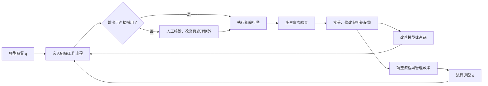

+++
title = "企業如何與 AI 共同生產價值：流程改造、人工補償與資料回流"
date = "2026-09-06T03:14:06+08:00"
author = "TTL::0"
draft = false
isCJKLanguage = true
description = "同一套工具進入兩家公司，結果可能完全不同。差異不在模型版本，而在資料權限、流程拆分與例外處理——生產力是技術與組織互補的結果。"
tags = [
    "分析論述", # term:AnalyticalEssay
    "大型語言模型", # term:Llm
    "技術與組織互補", # term:OrganizationalComplementarity
    "人工補償", # term:HumanCompensation
    "實務對比", # term:PracticalContrastiveExamples
    "差異", # term:Delta
    "反思", # term:Reflection
  ]
series = ["智慧敘事如何進入現實：不是市場受騙，而是敘事協調了投資與改造"]
[ai_info]
    [ai_info.generation]
        model = "GPT 5.6 Sol"
        agent = "Codex VS Code extension 26.901.22334"
    [ai_info.refinement]
        model = "Claude Opus 5"
        agent = "Claude Code VSCode Extension 2.1.261"
+++

---

<!--more-->

## 導言

同一套 AI 工具進入兩家公司，結果可能完全不同。**差異**（Delta） <!-- term:Delta -->不一定來自模型版本，而可能來自資料權限、流程拆分、教育訓練與例外處理。

> [!IMPORTANT]
> **差異** <!-- term:Delta --> (Delta): 特定變更的契約，用於驅動實作並作為驗證實作的基準對象。 <!-- anchor:Delta -->


因此，生產力不是模型單方面交付的固定屬性。它是**技術與組織互補**（Organizational Complementarity） <!-- term:OrganizationalComplementarity -->的結果：模型提供某種能力，企業重新安排工作，兩者才形成可觀察產出。

> [!IMPORTANT]
> **技術與組織互補** <!-- term:OrganizationalComplementarity --> (Organizational Complementarity): 技術能力必須搭配流程重排與技能調整才形成產出的互補關係。 <!-- anchor:OrganizationalComplementarity -->


## 分析

最簡單的互補模型可寫成：

$$
Y=A\,q^\alpha o^{1-\alpha},
\qquad 0<\alpha<1,
$$

其中 $q$ 表示模型在任務上的品質，$o$ 表示流程適配程度。這是分析用生產函數，不是經驗上已確立的普遍定律；它只表達任一投入接近零時，另一項很難單獨實現全部價值。

下列實驗比較只改善模型與同時改善流程的結果：

```python
def output(model_quality, process_fit, alpha=0.5):
    return model_quality ** alpha * process_fit ** (1 - alpha)

cases = {
    "weak model, strong process": (0.4, 0.9),
    "strong model, weak process": (0.9, 0.4),
    "both aligned": (0.9, 0.9),
}

for name, values in cases.items():
    print(name, round(output(*values), 3))
```

乘法形式使短板可見。真實組織未必符合平方根關係，但任何生產力主張都應說明模型之外的互補投入。

**人工補償**（Human Compensation） <!-- term:HumanCompensation -->是這些投入的一部分。員工會改寫提示、補找資料、核對答案、處理例外，甚至替模型輸出維持禮貌與責任。若研究只量測完成速度，這些新增工作可能被藏在「使用工具」之中。

> [!IMPORTANT]
> **人工補償** <!-- term:HumanCompensation --> (Human Compensation): 以人力審核與例外處理填補模型不可靠之處，使系統整體達到可交付品質的做法。 <!-- anchor:HumanCompensation -->


自動化還可能留下最難的案例給人類。當日常案例被系統處理，操作員較少練習，卻要在異常時立即接手。這種自動化反諷不是生成式 AI 新發明，而是長期存在的人因工程問題。

資料回流讓共同生產更加明顯。人類接受、修改與拒絕輸出的紀錄可以改善產品；但這些紀錄也反映既有介面與管理政策，不是中立的「人類真實偏好」。

將隱藏的人工作業與資料回流放回流程後，價值便不再像是模型單獨產生：



圖中的人工節點不是暫時雜訊，而可能是產品可靠度的一部分。資料回流也同時受到模型、介面與組織規則塑形，因此不能把紀錄直接視為不受條件影響的偏好標籤。

## 反思

把流程改造全部算成 AI 效益會高估模型，把所有人工補償 <!-- term:HumanCompensation -->算成 AI 失敗則會低估系統。合理的分析單位是端到端工作，而不是只看模型或只看員工。

效果也可能在人群間高度異質。經驗較少的工作者可能更容易從建議中受益，專家則可能花更多時間核查低品質輸出。平均生產力不能直接代表每種技能與任務。

## 實務對比

錯誤做法是購買工具後要求所有員工立即使用，再以登入率當成功指標。登入只能證明接觸，不能證明工作品質或風險改善。

較好的做法先找出可逆、可覆核且錯誤成本較低的子任務，建立基線後分階段導入。除了速度，也量測重工、升級處理、員工學習與客戶結果。

另一個錯誤是把人工覆核標成臨時成本，假設模型升級後必然歸零。某些覆核來自責任制度與高風險例外，即使模型更準確也可能永久存在。

## 結論

AI 的實現價值由模型與組織共同生產。流程、技能、責任與資料回流不是部署後的雜項，而是產品能力得以轉成結果的必要條件。

因此，AI 是否有效不能只問模型進步多少。還要問企業改造了什麼、增加了哪些隱形工作，以及收益與風險由誰承擔。

生成式 AI 在特定客服場景中的異質生產力效果與研究邊界，見已發表於 QJE 的 [Generative AI at Work](https://academic.oup.com/qje/article/140/2/889/7990658)。自動化可能增加人類異常處理負擔的經典分析見 Bainbridge 的 [Ironies of Automation](https://www.sciencedirect.com/science/article/pii/0005109883900468)。