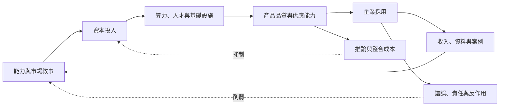

+++
title = "敘事何時成真，何時破裂：反身性成長與現實約束"
date = "2026-09-06T03:14:07+08:00"
author = "TTL::0"
draft = false
isCJKLanguage = true
description = "相信市場會成長，可以促使資本建立資料中心並補貼採用，而這些投入確實可能改善產品。但反身性不是自動成真的魔法，負向回饋同樣存在。"
tags = [
    "分析論述", # term:AnalyticalEssay
    "大型語言模型", # term:Llm
    "反身性", # term:Reflexivity
    "實務對比", # term:PracticalContrastiveExamples
    "機器學習", # term:MachineLearning
    "人工補償", # term:HumanCompensation
    "反思", # term:Reflection
  ]
series = ["智慧敘事如何進入現實：不是市場受騙，而是敘事協調了投資與改造"]
[ai_info]
    [ai_info.generation]
        model = "GPT 5.6 Sol"
        agent = "Codex VS Code extension 26.901.22334"
    [ai_info.refinement]
        model = "Claude Opus 5"
        agent = "Claude Code VSCode Extension 2.1.261"
+++

---

<!--more-->

## 導言

市場敘事通常被放在產品之外，像是替既有技術加上的廣告。AI 卻提供更複雜的情況：相信市場會成長，可以促使資本建立資料中心、招募人才並補貼採用，而這些投入確實可能改善產品。

這使敘事具有**反身性**（Reflexivity） <!-- term:Reflexivity -->：描述未來的故事會改變參與者行動，行動再改變故事所描述的現實。但反身性 <!-- term:Reflexivity -->不是自動成真的魔法，負向回饋同樣存在。

> [!IMPORTANT]
> **反身性** <!-- term:Reflexivity --> (Reflexivity): 描述未來的敘事改變參與者行動，行動再改變被描述的現實，形成互相決定的迴圈。 <!-- anchor:Reflexivity -->


## 分析

可以先畫出正向迴圈：



上半部是增強迴圈，下半部是制衡迴圈。敘事可以提前取得資源，產品品質與採用則提供後續驗證；成本、事故與責任會降低可投入資本或敘事可信度。

下面用簡化動態模型展示兩種結果。`gain` 表示每期由信念轉成新增效用的綜合效率，`friction` 表示成本與失敗的抑制。

```python
def simulate(gain, friction, periods=8):
    belief = 0.4
    utility = 0.2
    history = []
    for _ in range(periods):
        investment = belief
        utility = 0.6 * utility + gain * investment
        belief = max(0.0, min(1.0, 0.5 * belief + utility - friction))
        history.append((round(belief, 3), round(utility, 3)))
    return history

print("supported:", simulate(gain=0.35, friction=0.12))
print("unsupported:", simulate(gain=0.10, friction=0.28))
```

這個玩具模型只展示回饋方向，不是市場預測。係數若稍微改變，軌跡也會改變；真正研究必須把資本、效用與信念換成可觀察變數。

模型輸出還可能直接改變資料分佈。推薦影響消費，信用分數影響借款條件，內容生成改變網路文本。此時產品不只回應市場，也參與生產下一輪訓練與評估環境。

「自我實現」只有在新增資源轉成可驗證效用時成立。若資本主要推高供應、競爭壓低價格，而需求沒有形成，迴圈可能表現為產能過剩。若企業只靠**人工補償**（Human Compensation） <!-- term:HumanCompensation -->維持品質，成長也可能放大隱形成本。

> [!IMPORTANT]
> **人工補償** <!-- term:HumanCompensation --> (Human Compensation): 以人力審核與例外處理填補模型不可靠之處，使系統整體達到可交付品質的做法。 <!-- anchor:HumanCompensation -->


## 反思

反身性 <!-- term:Reflexivity -->框架容易滑向不可證偽：成功被解釋成正向迴圈，失敗又被解釋成負向迴圈。要避免這點，分析前應先指定中介變數，例如單位推論成本、留存率、端到端生產力與事故率。

敘事也不是單一中心發出。模型公司、雲端平台、投資人、媒體、顧問與採用企業各有不同誘因；同一句「AI 革命」可以同時服務融資、預算與職涯定位。

## 實務對比

錯誤做法是把大量資本支出直接當成需求證明。資料中心在建只能證明供應方下注；產能利用、價格與客戶效用才顯示需求是否跟上。

另一個錯誤是把泡沫與技術進步視為互斥。過度投資仍可能留下便宜基礎設施與人才，真實技術進步也可能伴隨錯誤估值；技術史與投資報酬不是同一判斷。

較好的分析會沿迴圈逐段驗證：資本是否形成產能，產能是否改善品質，品質是否產生持續採用，採用是否帶來扣除成本後的效用。任何斷點都應允許推翻原敘事。

## 結論

AI 敘事可以參與生產現實，因為它協調資本、基礎設施與組織改造。這比「純粹炒作」更接近完整因果，也比「技術必然勝利」更可檢驗。

敘事真正成真時，會逐步被可測量效用取代；若始終只能以更多承諾維持，它便沒有閉合因果鏈。判斷關鍵不是故事是否動人，而是每一段資源轉換是否留下可驗證結果。

預測會改變其目標分佈的形式化研究見 [**表演性預測**（Performative Prediction） <!-- term:PerformativePrediction -->](https://proceedings.mlr.press/v119/perdomo20a.html)；**機器學習**（Machine Learning） <!-- term:MachineLearning -->系統中的直接與隱藏回饋見 [Hidden **技術債**（Technical Debt） <!-- term:TechnicalDebt --> in 機器學習 <!-- term:MachineLearning --> Systems](https://proceedings.neurips.cc/paper_files/paper/2015/file/86df7dcfd896fcaf2674f757a2463eba-Paper.pdf)。

> [!IMPORTANT]
> **表演性預測** <!-- term:PerformativePrediction --> (Performative Prediction): 模型輸出影響人類行動，進而改變後續資料分佈的回饋情形。 <!-- anchor:PerformativePrediction -->
> **機器學習** <!-- term:MachineLearning --> (Machine Learning): 先界定可選函數的範圍，再以資料估計其中參數的建模方法。 <!-- anchor:MachineLearning -->
> **技術債** <!-- term:TechnicalDebt --> (Technical Debt): 程式碼中為求快速交付而妥協、待重構與修復的設計或品質缺陷。 <!-- anchor:TechnicalDebt -->