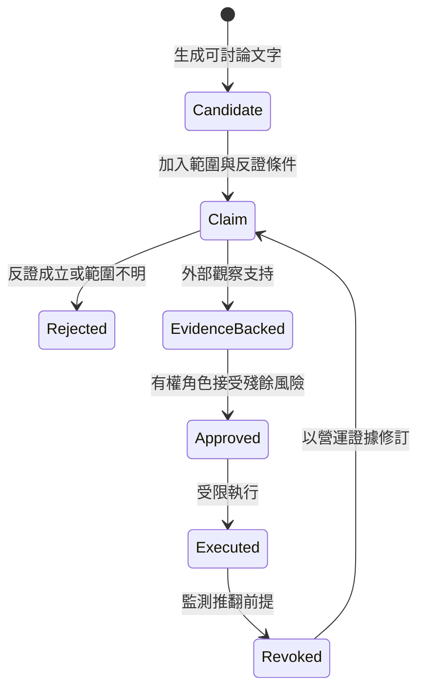

+++
title = "從生成到主張：機率輸出如何取得工程上的可判定性"
date = "2026-09-16T06:16:01+08:00"
author = "梅乾"
draft = false
isCJKLanguage = true
description = "指出高似然文本與可判定工程主張之型別差異，建立包含適用範圍、反例空間、真值來源與處置規範的主張契約，防止將機率候選誤認為具約束力的系統決策。"
tags = [
    "分析論述", # term:AnalyticalEssay
    "大型語言模型", # term:LargeLanguageModel
    "型別誤認", # term:TypeMisidentification
    "幻覺", # term:Hallucination
    "校準", # term:Calibration
  ]
series = ["機率工程化：從機率生成到可撤銷承諾的五道邊界"]
[ai_info]
    [ai_info.generation]
        model = "GPT-5.6 Sol"
        agent = "Codex VS Code extension 26.908.40401"
    [ai_info.refinement]
        model = "Gemini 3.8 Flash"
        agent = "Antigravity IDE 2.5.5"
+++

<!--more-->

## 導言

假設模型替支付服務寫出一條需求：「退款應在合理時間內完成。」這句話語法完整，也符合多數人的直覺。模型還能繼續產生設計、測試與監控指標，使整套材料看起來像已經準備進入開發。然而「合理」可能是三十秒、二十四小時或一個帳務週期；對不同付款軌道、司法管轄區與失敗類型，答案也不同。

這裡發生的首要錯誤不是**幻覺**（Hallucination） <!-- term:Hallucination -->，而是**型別誤認**（Type Misidentification） <!-- term:TypeMisidentification -->：系統把一個容易繼續生成的候選句，當成已經能約束產品的工程主張。兩者的差異不在文字品質，而在後者必須具備適用範圍、反例、真值來源與失敗後的處置。

> [!IMPORTANT]
> **幻覺** <!-- term:Hallucination --> (Hallucination): 大型語言模型在面對不實或矛盾資訊時，生成不符合客觀現實或超出脈絡之回應的錯誤現象。 <!-- anchor:Hallucination -->
> **型別誤認** <!-- term:TypeMisidentification --> (Type Misidentification): 指將生成模型產出之流暢候選句，誤認為已具備適用範圍、反例、真值來源與處置規範的工程主張。 <!-- anchor:TypeMisidentification -->


Transformer 類語言模型以條件分布生成序列；原始架構論文清楚描述了模型如何依先前位置計算後續輸出的機率，但沒有把這個機率定義成外部世界中的真值或組織授權（[Vaswani 等人，2017／Attention Is All You Need](https://arxiv.org/abs/1706.03762)）。因此本報告不以「機率性」作為貶義詞。問題是：機率性生成提供了什麼，以及工程制度額外需要什麼。

## 分析

### 一、模型似然、命題真值與行動價值是三個不同座標

令輸入脈絡為 $x$，模型對文字序列 $y$ 給出的分布為：

$$
q_\theta(y\mid x)=\prod_{t=1}^{n}q_\theta(y_t\mid x,y_{<t}).
$$

這個量回答「在模型與脈絡之下，哪個後續序列較合適」。若要判斷句子是否符合世界，還需要世界狀態 $w$ 與真值謂詞 $\tau(y,w)\in\{0,1\}$。若要決定是否執行，則還要知道行動 $a$ 在該世界的效用與損失 $U(a,w)$。三者之間不存在由定義自動給出的等號：

$$
q_\theta(y\mid x)\not\equiv P(\tau(y,w)=1),
\qquad
P(\tau(y,w)=1)\not\equiv \arg\max_a E[U(a,w)].
$$

第一個不等式說，常見文字不必然為真；第二個不等式說，即使描述為真，也不必然值得採取特定行動。例如「九成退款在一天內完成」可能符合歷史資料，但若剩餘一成包含法定時限即將屆滿的案件，把它當自動化政策仍可能造成不可接受的損失。

因此，生成結果要先被改造成「可判定的主張」。一份最小主張契約可寫成：

$$
C=(p,S,F,O),
$$

其中 $p$ 是命題，$S$ 是適用範圍，$F$ 是能推翻或限制命題的觀察集合，$O$ 是取得觀察的方法。若 $S$、$F$ 或 $O$ 為空，文字仍可用於探索，但不具備工程上的可判定性。

### 二、升格不是信心增加，而是資訊種類改變

候選成為承諾，不應只靠同一生成器把理由寫得更長。每次升格都應加入前一狀態沒有的新資訊。



圖中的關鍵不是狀態數量，而是禁止 `Candidate → Executed`。此外，`Executed` 也不是終點。營運環境會改變，原本的證據可能過期；撤銷必須能把新觀察帶回主張層，而不是只把服務恢復到上一版。

NIST AI RMF 要求記錄系統的知識限制、輸出如何被使用與監督，並把測量連回部署脈絡（[NIST，2023／AI RMF Core，Map 2.2、Measure 4](https://airc.nist.gov/airmf-resources/airmf/5-sec-core/)）。這支持一個較窄但實用的結論：輸出不能脫離用途與使用條件被評價。

### 三、把退款案例完整走一遍

以下表格展示的不是文件流程，而是每一步新增了什麼可反駁資訊。

| 狀態 | 目前內容 | 新增的外部資訊 | 拒絕條件 | 可否改變外部狀態 |
| :--- | :--- | :--- | :--- | :---: |
| 候選 | 「退款應在合理時間內完成」 | 無 | 無法判定「合理」 | 否 |
| 主張 | 「一般信用卡退款，95% 應在 24 小時內送出」 | 適用付款軌道、分位數、時間起點 | 軌道不符、時間起點不明 | 否 |
| 有證據 | 近 90 日分布、sandbox 回應、例外清單 | 真實資料與協議行為 | 樣本漂移、例外未覆蓋 | 否 |
| 已核准 | 產品與法遵 owner 接受剩餘 5% 的處理方式 | 風險容忍與補救義務 | owner 無權或證據過期 | 是，限核准範圍 |
| 執行中 | 監控分位數、逾時告警、人工接管 | 現場結果 | 門檻超界或申訴異常 | 是，可撤銷 |

走到第三列時，句子並沒有因為「更像正式需求」而變強；它因為能被資料與例外推翻而變強。走到第四列時，也不是又增加了一份事實，而是組織明確接受已揭露的殘餘風險。

### 四、最小可執行模型

下列 Python 只驗證狀態邊界，不宣稱能替組織決定證據是否充分。它刻意不讓 `model_score` 參與升格判定。

```python
from dataclasses import dataclass

@dataclass(frozen=True)
class Candidate:
    text: str
    model_score: float

@dataclass(frozen=True)
class Claim:
    text: str
    scope: str
    falsifiers: tuple[str, ...]

@dataclass(frozen=True)
class Decision:
    claim: Claim
    observations: tuple[str, ...]
    owner: str

def articulate(c: Candidate, scope: str,
               falsifiers: tuple[str, ...]) -> Claim:
    assert scope.strip(), "主張必須界定適用範圍"
    assert falsifiers, "主張必須允許某些觀察推翻它"
    return Claim(c.text, scope, falsifiers)

def promote(c: Claim, observations: tuple[str, ...],
            owner: str) -> Decision:
    assert observations, "升格必須加入外部觀察"
    assert owner.strip(), "決定必須有具名責任角色"
    return Decision(c, observations, owner)

fluent = Candidate("95% 的退款在 24 小時內送出", 0.99)
try:
    articulate(fluent, "", ())
    raise AssertionError("高模型分數不應繞過主張契約")
except AssertionError as error:
    assert "適用範圍" in str(error)

claim = articulate(
    fluent,
    "一般信用卡退款；自核准時計",
    ("90 日 p95 > 24h", "付款軌道不屬信用卡"),
)
decision = promote(
    claim,
    ("refund-distribution-90d", "gateway-sandbox-run-42"),
    "payments-product-owner",
)
assert decision.claim.scope.startswith("一般信用卡")
assert fluent.model_score == 0.99  # 存在，但沒有授權效果
```

這段程式的價值是讓某些錯誤無法被表示成合法狀態。它不能判定 `refund-distribution-90d` 是否造假，也不能證明 owner 的判斷良好；那些是下一層驗證與治理問題。

### 五、跨維度診斷

當團隊說「這份輸出品質很高」時，可以用下表判斷它實際高在哪個維度。

| 表面現象 | 底層狀態 | 脆弱做法 | 嚴格防線 |
| :--- | :--- | :--- | :--- |
| 語句流暢、格式完整 | 生成品質高 | 直接進入 backlog | 補範圍、反證與真值來源 |
| 理由很多且彼此一致 | 敘事密度高 | 把解釋長度當證據量 | 要求外部觀察與反例 |
| 信心分數很高 | 模型內部偏好強 | 把分數映射成業務風險 | 用部署資料**校準**（Calibration） <!-- term:Calibration -->，分開兩種分數 |
| 測試通過 | 指定行為被實現 | 宣稱需求正確 | 另做使用情境 validation |
| owner 已核准 | 風險已被授權承擔 | 宣稱結果必然正確 | 保留監測、期限與撤銷 |

> [!IMPORTANT]
> **校準** <!-- term:Calibration --> (Calibration): 模型輸出機率與實際正確率的一致程度。 <!-- anchor:Calibration -->


這個矩陣也說明，低品質文字未必是最危險的輸出。真正危險的是高品質候選在沒有型別轉換的情況下，被系統當成決定使用。

## 反思

最強的反方是：人類同樣依經驗、語言與直覺作判斷，為何生成式模型需要特殊隔離？答案不應是「人有理解、模型沒有」這類無法操作的本體論宣告。工程上真正可用的差異是制度位置：某個角色能否取得受保護資料、說明適用範圍、拒絕執行、承擔後續行動，並在錯誤時被要求修正。若一個人也沒有這些條件，他的意見同樣只能是候選。

另一個反方是，逐層升格會讓低風險工作充滿儀式。這個批評成立。格式化、排序、可自動回滾的局部重構，往往已有編譯器、測試與差異檔作為便宜 oracle；此時 `Candidate → EvidenceBacked → Executed` 可以在毫秒內自動完成。狀態仍然存在，只是轉換成本低，而不是候選與決定突然成為同一型別。

主張契約也可能被形式化成另一種官僚文字：範圍寫「所有情況」，反證寫「結果錯誤」，owner 寫一個無權停機的團隊名稱。判準很簡單：欄位缺失或內容不合格時，是否真的有操作會失敗？若沒有，它只是註解，不是邊界。

最後，機率值並非沒有工程用途。經過適當校準 <!-- term:Calibration -->且對應明確事件的機率，可以支援風險排序與資源配置。需要拒絕的是把「某段文字在生成分布中很自然」直接解讀為「該段文字描述的世界很可能為真」。兩者若要建立映射，必須靠外部標註、部署觀察與持續校準 <!-- term:Calibration -->，而不能靠語氣完成。

## 結論

機率生成最適合做的是快速擴張候選空間、整理可能解釋與提出待驗證主張。工程制度要補上的，不是對機率性的道德懷疑，而是一條可檢查的升格鏈：候選先取得範圍與反證條件，再取得外部觀察，之後才由有權角色接受殘餘風險，並在受限環境中執行。

可攜帶的原則有三條：

- 模型似然、世界真值與行動價值不得共用同一個分數。
- 每次升格都必須加入前一狀態沒有的新資訊，而不是增加同源敘事。
- 執行不是證明的終點；營運結果必須能推翻、縮限或撤銷原主張。

因此，真正的分界不是「人寫」或「AI 寫」，而是：**這段輸出是否仍只是容易繼續的文字，還是已經成為能被世界拒絕的主張。**