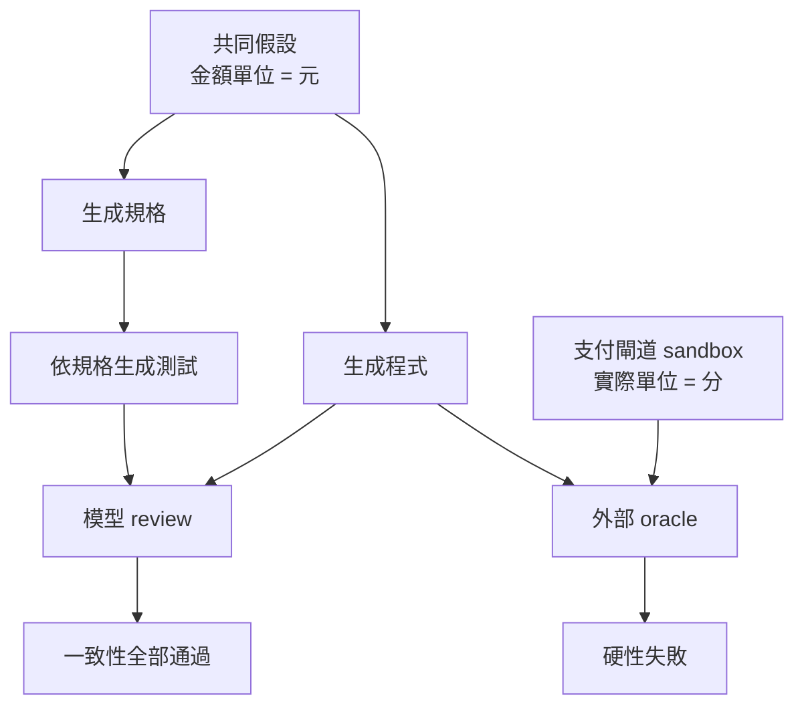

+++
title = "驗證不是重複生成：從自洽失敗到異源拒絕機制"
date = "2026-09-16T06:16:02+08:00"
author = "梅乾"
draft = false
isCJKLanguage = true
description = "分析同源多模型驗證中因共用假設而導致的自洽失敗，提出以獨立錯誤模式、外部 Oracle 與可證偽觀察構建的異源拒絕機制，阻斷同質模型相互驗證的盲區。"
tags = [
    "分析論述", # term:AnalyticalEssay
    "多代理", # term:MultiAgent
    "不同模型", # term:DifferentModels
    "選擇偏差", # term:SelectionBias
    "不變式", # term:Invariant
    "身分", # term:Identity
  ]
series = ["機率工程化：從機率生成到可撤銷承諾的五道邊界"]
[ai_info]
    [ai_info.generation]
        model = "GPT-5.6 Sol"
        agent = "Codex VS Code extension 26.908.40401"
    [ai_info.refinement]
        model = "Gemini 3.8 Flash"
        agent = "Antigravity IDE 2.5.5"
+++

<!--more-->

## 導言

一個模型生成 API 規格，另一個模型依規格寫程式，第三個模型再產生測試與 review。三份產物互相吻合，CI 全數通過；上線後卻發現它們共同把「金額以分為單位」解讀成「金額以元為單位」。一致性檢查沒有失靈。它正確證明了規格、實作與測試共享同一解釋。真正失靈的是團隊把「共享解釋」當成「符合外部系統」。

這個例子揭露兩個常被混用的詞。**一致性**問的是多個產物是否互相矛盾；**有效性**問的是產物是否對準欲解決的世界。前者可由更多文字與更多模型協助，後者需要某種不受原生成假設控制的觀察。

軟體測試把「如何知道輸出正確」稱為 test oracle problem。Barr 等人的綜述指出，許多系統不存在便宜而完整的預期結果判定器，因此測試必須借助規格、部分 oracle、蜕變關係或多種近似機制（[Barr 等人，2015／The Oracle Problem in Software Testing](https://doi.org/10.1109/TSE.2014.2372785)）。生成式工作流把問題推得更前面：若規格本身也是由相同上下文生成，測試可能只是在驗證生成鏈對自己的忠誠。

## 分析

### 一、驗證收益取決於失敗相依性，不取決於 reviewer 數量

令 $M_1$ 與 $M_2$ 表示兩個驗證器漏掉同一錯誤。若兩者真的獨立，則：

$$
P(M_1\cap M_2)=P(M_1)P(M_2).
$$

這是「各有 10% 漏檢率，兩者共同漏掉只剩 1%」的來源。但獨立性是額外假設，不是因為驗證器有兩個名字就成立。若兩個 Bernoulli 失敗事件的相關係數為 $\rho$，共同漏檢率為：

$$
P(M_1\cap M_2)
=m_1m_2+\rho\sqrt{m_1(1-m_1)m_2(1-m_2)}.
$$

當 $m_1=m_2=0.1$ 且 $\rho=0.9$，共同漏檢率是 $0.091$，幾乎沒有比單一驗證器的 $0.1$ 好。這個數字只是形式示例，不是對任何模型的實測估計；它顯示的是，正相關會吃掉冗餘帶來的安全收益。

多版本軟體早已遭遇同一問題。Knight 與 Leveson 的實驗檢驗獨立開發版本是否真的獨立失敗，結果支持「不能直接假設失敗獨立」這個較窄的結論（[Knight 與 Leveson，1986／An Experimental Evaluation of the Assumption of Independence in Multiversion Programming](https://doi.org/10.1109/TSE.1986.6312924)）。對**多代理**（Multi-Agent） <!-- term:MultiAgent -->工作流而言，換模型、換提示或換 persona 可能增加觀點差異，但不會自動消除共同規格、共同資料或共同 framing。

> [!IMPORTANT]
> **多代理** <!-- term:MultiAgent --> (Multi-Agent): 多個智慧代理程式協同運作，共同完成複雜任務的系統架構。 <!-- anchor:MultiAgent -->


### 二、來源圖比 reviewer 清單更能解釋獨立性

真正需要追蹤的不是「誰說同意」，而是每個判定依賴哪些上游實體與活動。W3C PROV 將 provenance 描述為參與產生資料或事物的實體、活動與人員資訊，並說明這些資訊可用於評估品質、可靠性與可信度（[W3C，2013／PROV Overview](https://www.w3.org/TR/prov-overview/)）。來源本身不是正確性證明；它的用途是揭露兩份看似獨立的證據是否其實共用祖先。



上圖只有 `支付閘道 sandbox` 帶入共同假設以外的資訊。若把它換成「另一個模型讀同一份規格」，圖的節點增加了，祖先卻沒有增加。這就是表面冗餘與認識論冗餘的差別。

### 三、把金額單位錯誤走一遍

以下決策表追蹤同一錯誤在不同驗證機制下的命運。重點是每個機制能讓哪一類錯誤硬性失敗。

| 輸入案例 | 驗證器所見 | 判定機制 | 結果 | 尚未排除的錯誤 |
| :--- | :--- | :--- | :--- | :--- |
| 規格寫「amount=100」 | 只有範例文字 | 模型檢查敘述一致 | 通過 | 100 是元或分 |
| 程式乘以 100 | 規格與程式 | 靜態型別檢查 | 通過 | 兩者共用錯單位 |
| 測試期望 10000 | 規格生成的測試 | 單元測試 | 通過 | oracle 被錯規格污染 |
| sandbox 建立 1 元交易 | 真實 API 回應 | 協議比對 | 失敗 | 尚未覆蓋其他幣別 |
| 小額 canary | 真實帳務與對帳 | 端到端監測 | 可發現或回滾 | 長尾營運情境 |

型別檢查與單元測試並非無用。它們精確排除了語法、介面與局部行為錯誤。錯誤在於把每一層的「通過」解讀成全域有效性，而沒有記錄該層的可見範圍。

### 四、最小數值驗證

下列程式直接計算相關性對共同漏檢率的影響，並驗證獨立性只能作為特例使用。

```python
from math import sqrt

def joint_miss(m1: float, m2: float, rho: float) -> float:
    assert 0.0 <= m1 <= 1.0
    assert 0.0 <= m2 <= 1.0
    value = m1 * m2 + rho * sqrt(m1 * (1 - m1) * m2 * (1 - m2))
    assert 0.0 <= value <= min(m1, m2)
    return value

independent = joint_miss(0.10, 0.10, 0.0)
shared_failure = joint_miss(0.10, 0.10, 0.9)

assert abs(independent - 0.01) < 1e-12
assert abs(shared_failure - 0.091) < 1e-12
assert shared_failure > independent * 9

# 三個 reviewer 的名字不是輸入；失敗相依性才是。
```

這個模型不主張所有模型互審都有 $\rho=0.9$。實務工作恰恰是找出共同來源、設計實驗並估計相關性，而不是把它預設為零。

### 五、如何選擇真正互補的拒絕機制

NIST AI RMF 的 Measure 1.3 建議讓未參與第一線開發的內部專家、獨立評估者、領域專家與受影響者依風險參與評估；Measure 1.1 則要求先處理最顯著風險（[NIST，2023／AI RMF Core](https://airc.nist.gov/airmf-resources/airmf/5-sec-core/)）。重點不只是「換人」，而是讓評估者能取得不同資料、採取不同方法並擁有拒絕權。

下表可用來挑選驗證組合，而不是單純累加 reviewer。

| 表面做法 | 主要可抓錯誤 | 共同病灶 | 脆弱假設 | 更嚴格的補強 |
| :--- | :--- | :--- | :--- | :--- |
| 同模型自我檢查 | 局部矛盾、漏段 | 相同脈絡與偏好 | 重新閱讀等於新證據 | 指派具體反例任務 |
| **不同模型**（Different Models） <!-- term:DifferentModels -->投票 | 部分推理與表達差異 | 共用規格、資料、訓練慣例 | 多數即真 | 分歧阻擋；一致不升格 |
| 人類閱讀 AI 摘要 | 現場常識缺口 | 接受模型 framing | 人在場即獨立 | 直接查原始來源與樣本 |
| 編譯器、型別系統 | 語法、型別與部分契約 | 不知道產品目的 | 可編譯即正確 | 加入領域 oracle |
| sandbox、真實設備 | 協議、單位、權限 | 測試環境仍可能失真 | 一次成功可外推 | 多情境、canary、監測 |
| 使用者申訴與營運資料 | 真實影響、分布漂移 | 回饋可能有**選擇偏差**（Selection Bias） <!-- term:SelectionBias --> | 沒申訴等於沒問題 | 主動抽樣與申訴通道 |

> [!IMPORTANT]
> **不同模型** <!-- term:DifferentModels --> (Different Models): 在 1:N 協作拓撲中，指使用具備不同權重、上下文或隨機種子的模型進行交叉 Review，以利用其注意力分佈的差異來展開單一模型可能遺漏的盲區。 <!-- anchor:DifferentModels -->
> **選擇偏差** <!-- term:SelectionBias --> (Selection Bias): 從多個候選中挑出表現最好者時，該讀數同時包含真實能力與抽樣噪聲，使其系統性地優於真值的偏差。 <!-- anchor:SelectionBias -->


最強組合通常不是最多元的意見，而是涵蓋不同錯誤類別的機制：靜態分析拒絕結構錯誤，真實 API 拒絕協議錯誤，領域 owner 拒絕目的錯誤，營運監測拒絕時間漂移。

## 反思

第一個反方是，多代理 <!-- term:MultiAgent -->辯論確實能找出單一模型漏掉的問題。這完全成立。正確結論不是「模型互審無效」，而是它的正面結果不能按獨立證據相乘。分歧通常很有資訊，因為至少一方錯誤或規格欠決定；一致則可能表示多方找到同一答案，也可能表示它們繼承同一盲點。兩種結果的證據強度不對稱。

第二個反方是，來源不同不等於品質更高。獨立但粗糙的 reviewer 可能比同源的專業工具更差。這也正確。獨立性只回答「會不會一起錯」，能力則回答「各自多常錯」。設計驗證組合時必須同時考慮邊際漏檢率與相關性；為追求差異而加入隨機噪音，並不會產生可靠 oracle。

第三個邊界是：人類也可能高度同源。若 reviewer 只讀模型摘要、不接觸原始紀錄，或者組織文化懲罰異議，人類簽名只增加權威外觀，沒有增加拒絕機制。反過來說，編譯器、形式證明、不同感測器與真實 sandbox 都可能比匆忙人工審查更異源。分類基準應是失敗模式，不是生物**身分**（Identity） <!-- term:Identity -->。

> [!IMPORTANT]
> **身分** <!-- term:Identity --> (Identity): 系統元件在架構中宣告的核心職責與自我定位。 <!-- anchor:Identity -->


最後，完整 oracle 常常不存在。這不表示只能放棄驗證，而是要把一個巨大問題拆成多個局部可判定問題：協議是否相符、單位是否一致、權限是否最小、關鍵**不變式**（Invariant） <!-- term:Invariant -->是否維持、使用者是否能申訴。每個局部 oracle 都有限，但來源圖可以讓團隊知道還有哪些錯誤沒有觀察通道。

> [!IMPORTANT]
> **不變式** <!-- term:Invariant --> (Invariant): 系統在任何合法狀態下都必須成立的斷言，是把評估規則寫成可執行檢查的基本單位。 <!-- anchor:Invariant -->


## 結論

驗證的價值不在於重複說「看起來合理」，而在於建立不同的拒絕條件。一致性可以證明產物彼此相容；它不能單獨證明產物與世界相容。多一個 reviewer 是否增加安全性，取決於它是否帶入新的觀察來源、方法與失敗模式。

可攜帶的原則是：

- 不以 reviewer 數量推估信心；先畫出來源圖與共同祖先。
- 不把獨立性當預設；相關漏檢會大幅侵蝕冗餘收益。
- 為每種高影響錯誤指定至少一個能讓它硬性失敗的局部 oracle。
- 把「通過」連同覆蓋邊界記錄，避免局部證明被升格為全域保證。

因此，降低共同模式失敗所需要增加的，不是更多聲音，而是更多**不受同一錯誤假設控制的觀察**。