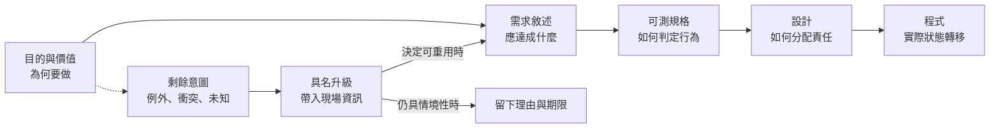

+++
title = "規格的邊界：不可編譯的剩餘意圖與合法的不知道"
date = "2026-09-16T06:16:03+08:00"
author = "梅乾"
draft = false
isCJKLanguage = true
description = "證明規格本質為情境空間上的偏函數，無法窮盡所有未建模情境與價值衝突；提出將剩餘意圖結構化升級與理由保留的機制，區分 Verification 與 Validation 之邊界。"
tags = [
    "分析論述", # term:AnalyticalEssay
    "AI 經濟與社會", # term:AiEconomics
    "剩餘意圖", # term:ResidualIntent
    "偏函數", # term:PartialFunction
    "全函數", # term:TotalFunction
    "技術債", # term:TechnicalDebt
    "可觀測性", # term:Observability
    "社會技術系統", # term:SociotechnicalSystem
  ]
series = ["機率工程化：從機率生成到可撤銷承諾的五道邊界"]
[ai_info]
    [ai_info.generation]
        model = "GPT-5.6 Sol"
        agent = "Codex VS Code extension 26.908.40401"
    [ai_info.refinement]
        model = "Gemini 3.8 Flash"
        agent = "Antigravity IDE 2.5.5"
+++

<!--more-->

## 導言

一個醫院掛號系統的需求寫著：「急症患者應優先處理。」團隊把它細化成生命徵象欄位、嚴重度分數、狀態轉移與驗收案例。所有測試通過後，系統遇到原規格沒有同時考慮的情境：一名高風險孕婦、一名呼吸困難兒童與大量傷患事件同時到達。此時「優先」不只是排序問題，而是臨床政策、資源配置與公平原則之間的衝突。

規格並沒有因此變得無用。它仍可精確處理大量常態情境，也能保存已經作出的政策選擇。錯誤在於把「能執行的規則集合」誤認為「目的本身已被完全消化」。需求工程中，verification 問產物是否按照規格被正確建造；validation 則問規格與產物是否滿足預期用途。NASA SWE-055 把需求 validation 定義為確保軟體能在客戶環境中依預期運作，並要求在生命週期中使用客觀證據與利害關係人參與（[NASA／SWE-055 Requirements Validation](https://swehb.nasa.gov/spaces/SWEHBVD/pages/102695440/SWE-055%2B-%2BRequirements%2BValidation)）。

本報告把規格沒有承載、尚未承載，或不應被預先封死的部分稱為**剩餘意圖**（Residual Intent） <!-- term:ResidualIntent -->。它包括未知情境、價值衝突、例外裁量、分布改變，以及只有現場責任者能取得的資訊。成熟系統的目標不是假裝剩餘為零，而是讓它可見、可升級、可留下理由，也能在重複出現後重新制度化。

> [!IMPORTANT]
> **剩餘意圖** <!-- term:ResidualIntent --> (Residual Intent): 指規格未能承載、尚未承載或不應預先封死的決策空間，包含未知情境、價值衝突與現場例外裁量。 <!-- anchor:ResidualIntent -->


## 分析

### 一、規格是情境空間上的偏函數

令所有可能營運情境構成集合 $\Omega$，允許動作構成集合 $A$。理想政策可被想像成**全函數**（Total Function） <!-- term:TotalFunction -->：

> [!IMPORTANT]
> **全函數** <!-- term:TotalFunction --> (Total Function): 在其定義域的所有可能輸入上皆有明確定義與輸出之函數。 <!-- anchor:TotalFunction -->


$$
f:\Omega\rightarrow A.
$$

但實際規格只對已辨識且已決定的情境子集 $D\subseteq\Omega$ 給出動作：

$$
s:D\rightarrow A.
$$

剩餘情境至少包含 $R=\Omega\setminus D$。此外，即使 $x\in D$，仍可能同時觸發兩條互不相容的政策。若適用規則集合為 $P(x)$，衝突集合可寫成：

$$
C=\{x\in D\mid \exists p_i,p_j\in P(x),\ p_i(x)\neq p_j(x)\}.
$$

因此需要升級的並不只是「沒有規則」的 $R$，還包括「規則彼此不能共同滿足」的 $C$。把未涵蓋情境交給模型猜測，等同在沒有授權的情況下任意延伸 $s$ 的定義域；把衝突情境交給固定優先序，則是在沒有價值判斷的地方偷偷寫入價值判斷。

### 二、從目的到程式是多次有損投影

每一次工程轉譯都會保留某些資訊、丟失另一些資訊。這不是自然語言獨有的缺陷；形式規格同樣必須先決定要形式化哪些變數與關係。



圖中虛線不是待消滅的**技術債**（Technical Debt） <!-- term:TechnicalDebt -->。當情境分布會改變、錯誤代價高、或多個價值無法被單一指標代表時，保留受控裁量比捏造永久規則更精確。真正的技術債 <!-- term:TechnicalDebt -->是沒有升級路徑，迫使執行者把「系統不知道」偽裝成一個確定答案。

> [!IMPORTANT]
> **技術債** <!-- term:TechnicalDebt --> (Technical Debt): 程式碼中為求快速交付而妥協、待重構與修復的設計或品質缺陷。 <!-- anchor:TechnicalDebt -->


### 三、把急症排序走一遍

以下表格把輸入、規則判定、狀態轉移與最終處置放在同一條線上。它顯示自動化的邊界應由可判定性與政策衝突共同決定，而不只由模型信心決定。

| 邊界輸入 | 可取得觀察 | 關鍵判定 | 狀態轉移 | 最終處置 |
| :--- | :--- | :--- | :--- | :--- |
| 嚴重度 9，無政策衝突 | 生命徵象完整 | 命中穩定門檻 | `RECEIVED → PRIORITY` | 自動優先 |
| 嚴重度 5，資料缺漏 | 無法確認關鍵生命徵象 | **可觀測性**（Observability） <!-- term:Observability -->不足 | `RECEIVED → NEEDS_ASSESSMENT` | 由臨床人員補評估 |
| 嚴重度 9，同時命中兩條優先政策 | 規則各自成立 | 動作衝突 | `RECEIVED → POLICY_CONFLICT` | 升級至政策 owner |
| 大量傷患事件 | 資源與到達率異常 | 營運模式已改變 | `NORMAL → INCIDENT_MODE` | 交由當班指揮體系 |
| 同類衝突一月出現 40 次 | 有完整決策紀錄 | 已非罕見例外 | `EXCEPTION → POLICY_REVIEW` | 修訂政策與測試 |

> [!IMPORTANT]
> **可觀測性** <!-- term:Observability --> (Observability): 軟體系統或程式邏輯的運作狀態被外部工具或監控機制感知、偵測與度量的難易程度。 <!-- anchor:Observability -->


「升級」不是把所有困難交給一個人。每一個升級狀態都要有觸發條件、可決策角色、回應時限、保守預設與留痕要求。否則它只會把規格黑洞換成人工佇列。

### 四、讓不知道成為合法狀態

下列程式把未知、資料不足與政策衝突做成不同結果。它不計算臨床倫理，只驗證系統不會把這三種情況靜默壓成一般排序。

```python
from dataclasses import dataclass
from enum import Enum, auto

class Route(Enum):
    PRIORITY = auto()
    QUEUE = auto()
    NEEDS_ASSESSMENT = auto()
    POLICY_CONFLICT = auto()
    INCIDENT_COMMAND = auto()

@dataclass(frozen=True)
class TriageInput:
    severity: int | None
    policy_actions: frozenset[str] = frozenset()
    mass_casualty: bool = False

def route(case: TriageInput) -> Route:
    if case.mass_casualty:
        return Route.INCIDENT_COMMAND
    if case.severity is None:
        return Route.NEEDS_ASSESSMENT
    if len(case.policy_actions) > 1:
        return Route.POLICY_CONFLICT
    return Route.PRIORITY if case.severity >= 8 else Route.QUEUE

assert route(TriageInput(9)) is Route.PRIORITY
assert route(TriageInput(None)) is Route.NEEDS_ASSESSMENT
assert route(TriageInput(9, frozenset({"maternal", "pediatric"}))) \
       is Route.POLICY_CONFLICT
assert route(TriageInput(5, mass_casualty=True)) \
       is Route.INCIDENT_COMMAND
```

程式中的列舉型別具有認識論意義：`NEEDS_ASSESSMENT` 表示觀察不足，`POLICY_CONFLICT` 表示價值或規則衝突，`INCIDENT_COMMAND` 表示原本規格的營運前提失效。若三者都叫 `manual_review`，組織就無法知道應補資料、修政策，還是切換指揮模式。

### 五、剩餘意圖必須受治理，而不是無限自由裁量

以下診斷矩陣用可觀測性 <!-- term:Observability -->與價值衝突兩軸決定合理處理方式。

| 可觀測性 <!-- term:Observability --> | 價值衝突 | 底層病灶 | 脆弱做法 | 嚴格防線 |
| :---: | :---: | :--- | :--- | :--- |
| 高 | 低 | 規則穩定且可判定 | 每次都人工處理 | 自動規則、測試與監測 |
| 高 | 高 | 資料足夠但政策相撞 | 用模型分數偷偷排序價值 | 具名政策 owner、版本與申訴 |
| 低 | 低 | 缺少關鍵觀察 | 用預設值補洞 | 補資料、保守降級、標記不確定 |
| 低 | 高 | 既看不清又涉及價值 | 讓生成器合理補完 | 停止自動決策並升級 |

矩陣也限制了「剩餘意圖 <!-- term:ResidualIntent -->」的使用。團隊不能因為某問題困難，就永久宣稱它只能靠直覺。若同類裁量反覆發生、理由逐漸穩定，而且輸入可被觀測，就應把它回寫成政策、資料需求與驗收案例。反之，罕見且高衝突的情境可能應永久保留人類指揮，而不是追求百分之百自動化。

### 六、完整性不是列舉更多案例，而是封閉決策責任

規格完整性常被理解成「再多寫一些 edge cases」。這只能處理已想像到的缺口。更成熟的完整性至少包含四層：

- **行為完整性**（Behavioral Completeness） <!-- term:BehavioralCompleteness -->：已定義的情境都有可判定結果。
- **觀察完整性**（Observational Completeness） <!-- term:ObservationalCompleteness -->：作出判定所需的資料真的可取得，缺漏有顯式狀態。
- **衝突完整性**（Conflict Completeness） <!-- term:ConflictCompleteness -->：多規則同時成立時，有衝突偵測與授權角色。
- **生命週期完整性**（Lifecycle Completeness） <!-- term:LifecycleCompleteness -->：例外決定會留下理由，並有條件地回寫成新政策。

> [!IMPORTANT]
> **行為完整性** <!-- term:BehavioralCompleteness --> (Behavioral Completeness): 指系統在已定義的情境集合內皆具備可判定且明確的執行結果。 <!-- anchor:BehavioralCompleteness -->
> **觀察完整性** <!-- term:ObservationalCompleteness --> (Observational Completeness): 指作出工程判定所需的觀測資料具備客觀可取得性，且資料缺漏時具有顯式狀態。 <!-- anchor:ObservationalCompleteness -->
> **衝突完整性** <!-- term:ConflictCompleteness --> (Conflict Completeness): 指多項業務或安全規則同時命中且衝突時，具備機械化的衝突偵測與具名授權裁決機制。 <!-- anchor:ConflictCompleteness -->
> **生命週期完整性** <!-- term:LifecycleCompleteness --> (Lifecycle Completeness): 指例外裁決與升級處理必須保留結構化理由，並具備回寫為未來新政策的閉環流程。 <!-- anchor:LifecycleCompleteness -->


這四層不保證系統永遠正確，但會封閉「下一步由誰處理」。未知世界仍然存在，責任不再消失。

## 反思

最強反方是，「剩餘意圖 <!-- term:ResidualIntent -->」會成為拒絕精確化的藉口。只要團隊把模糊處都標成需要判斷，就能逃避設計與測試。這個風險很真實，所以剩餘意圖 <!-- term:ResidualIntent -->不能只是一段散文。它必須落成可觀察的觸發器、有限的決策角色、保守預設、回應期限、理由紀錄與重新制度化門檻。沒有這些欄位的「人工判斷」不是邊界，而是責任真空。

另一個反方是，自然語言本身可以很嚴謹，形式模型也可能錯得很精確。完全正確。問題不在媒介，而在真值來源、可追溯性與拒絕條件。自然語言需求可以連結到利害關係人、使用場景與驗收資料；形式規格若把錯誤前提寫成公理，則只會更可靠地推出錯誤結論。

第三個邊界是封閉微世界。封包解析、編碼格式或小型狀態協定若具有有限且可列舉的狀態空間，形式規格應盡量吞掉剩餘意圖 <!-- term:ResidualIntent -->，模型檢查也能提供很強保證。不能因開放**社會技術系統**（Sociotechnical System） <!-- term:SociotechnicalSystem -->存在價值衝突，就把所有軟體都描述成不可規格化。

> [!IMPORTANT]
> **社會技術系統** <!-- term:SociotechnicalSystem --> (Sociotechnical System): 由技術元件與組織安排共同構成、必須整體運作才產生價值的系統。 <!-- anchor:SociotechnicalSystem -->


最後，「人類判斷」不必永遠由同一個職稱完成。臨床例外、法遵衝突、營運事故與產品取捨需要不同權威。把它們全送給「human reviewer」，仍然是在用一個空泛角色隱藏剩餘意圖 <!-- term:ResidualIntent -->的種類。

## 結論

規格的成熟，不是宣稱自己已代表全部意圖，而是同時精確描述可自動處理的區域與不可自動處理的邊界。把規格視為**偏函數**（Partial Function） <!-- term:PartialFunction -->，可以清楚區分三種情況：定義域內的穩定規則、觀察不足的未知情境，以及規則彼此衝突的價值判斷。

> [!IMPORTANT]
> **偏函數** <!-- term:PartialFunction --> (Partial Function): 僅在輸入定義域的某個真子集上有定義的函數；當面對未定義的輸入時將產生未定義行為或靜默錯誤。 <!-- anchor:PartialFunction -->


可攜帶的原則是：

- 允許系統回傳「不知道」，但必須說明是哪一種不知道。
- 為未知、資料不足、政策衝突與營運模式改變設置不同狀態。
- 反覆出現且逐漸穩定的裁量，應回寫成政策與測試。
- 罕見、高代價且高衝突的情境，應保留具名升級而非由模型補完。

真正危險的模糊不是文件尚未寫完，而是**系統把未被代表的意圖靜默轉換成了一個看似確定的答案**。