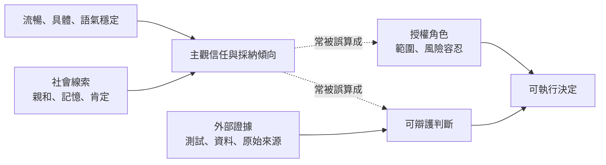

+++
title = "權威不是語氣：把建議、證據、核准與責任做成不同型別"
date = "2026-09-16T06:16:04+08:00"
author = "梅乾"
draft = false
isCJKLanguage = true
description = "剖析聊天介面社會線索引發的過度採納現象，將建議、證據、核准與責任嚴格解耦為不相容之型別系統，要求具名授權角色承擔殘餘風險，打破口語流暢即具權威的假象。"
tags = [
    "分析論述", # term:AnalyticalEssay
    "大型語言模型", # term:LargeLanguageModel
    "不變式", # term:Invariant
  ]
series = ["機率工程化：從機率生成到可撤銷承諾的五道邊界"]
[ai_info]
    [ai_info.generation]
        model = "GPT-5.6 Sol"
        agent = "Codex VS Code extension 26.908.40401"
    [ai_info.refinement]
        model = "Gemini 3.8 Flash"
        agent = "Antigravity IDE 2.5.5"
+++

<!--more-->

## 導言

一名工程師請聊天式工具檢查部署方案。工具記得先前限制、承認工程師的顧慮、列出五項風險，最後以堅定語氣推薦方案 B。接著，另一個模型 review，CI 通過，人類按下 approve。部署發生事故後，每個步驟都有紀錄，卻沒有人能回答：「誰決定接受供應商限流可能拖垮核心交易的風險？」

這不是少了一個表單欄位，而是四種不同事物被壓成同一個 `reviewed=true`：建議說明可能做什麼，證據說明哪些觀察支持它，核准表示某個有權角色接受殘餘風險，責任則指定偏差發生時誰必須停止、通報或補救。若它們都叫 review，流程只能證明有人按過按鈕，不能證明決策鏈成立。

聊天介面會使問題更難辨認。早期人機互動研究已指出，人會對電腦套用社會規則；Nass、Steuer 與 Tauber 將電腦被當成社會行動者的現象做成可研究命題（[Nass、Steuer 與 Tauber，1994／Computers Are Social Actors](https://doi.org/10.1145/191666.191703)）。後續自動化研究也區分 use、misuse、disuse 與 abuse，指出信任、工作負荷與自動化呈現會影響使用行為（[Parasuraman 與 Riley，1997／Humans and Automation](https://doi.org/10.1518/001872097778543886)）。這些研究不是今日**大型語言模型**（Large Language Model） <!-- term:LargeLanguageModel -->的直接效應量估計，但足以支持較窄的工程結論：介面線索會改變採納傾向，所以證據與授權不能只靠使用者主觀感覺隔離。

> [!IMPORTANT]
> **大型語言模型** <!-- term:LargeLanguageModel --> (Large Language Model): 基於海量文本數據訓練的深層神經網路模型，用於處理、生成和理解自然語言 <!-- anchor:LargeLanguageModel -->


## 分析

### 一、社會存在感能提高採納，不能增加命題證據

令 $S$ 表示社會線索，例如記得上下文、使用合作語氣與承認疑慮；令 $E$ 表示可追溯外部證據；令 $R$ 表示使用者採納建議的傾向。經驗上可以合理預期：

$$
\frac{\partial R}{\partial S}>0,
\qquad
\frac{\partial R}{\partial E}>0.
$$

但規範性的可接受條件不應因此寫成 $S+E\ge k$。親和力不能補足缺失證據。對高影響主張 $c$，更合理的形式是：

$$
\operatorname{Admissible}(c)
=[E(c)\models K]\land[\operatorname{scope}(c)\neq\varnothing],
$$

其中 $K$ 是該風險等級要求的證據條件。$S$ 可以改善溝通，卻不出現在 admissibility 謂詞中。這不是要求介面冷漠，而是讓「好不好合作」與「能不能升格」分開記帳。



兩條虛線是權威錯覺的來源。工具能以第一人稱提出建議，不代表它取得組織授權；它能正確重述限制，也不代表所有現場條件已進入上下文。

### 二、四種型別與五個合法狀態

把決策鏈做成不同型別，可以使非法捷徑在執行前失敗：

- `Candidate`：可被討論的提案，沒有執行權。
- `EvidenceBacked`：已連結證據與限制，可被評估，仍沒有執行權。
- `Approved`：具名 decider 在權限範圍內接受殘餘風險。
- `Operational`：執行中，綁定監測者、期限與停止條件。
- `Revoked`：原核准被撤回，不得沿用舊憑證再次執行。

責任不是第五份靜態文件，而是橫跨後三個狀態的行動義務。最小**不變式**（Invariant） <!-- term:Invariant -->可寫成：

> [!IMPORTANT]
> **不變式** <!-- term:Invariant --> (Invariant): 系統在任何合法狀態下都必須成立的斷言，是把評估規則寫成可執行檢查的基本單位。 <!-- anchor:Invariant -->


$$
\begin{aligned}
\operatorname{canExecute}(x)\Rightarrow{}&
\operatorname{type}(x)=\text{Approved}\\
&\land\operatorname{decider}(x)\in\operatorname{Authority}(\operatorname{risk}(x))\\
&\land\operatorname{owner}(x)\neq\varnothing\\
&\land\operatorname{evidence}(x)\neq\varnothing.
\end{aligned}
$$

此外，高風險變更需要角色分離：提案者、驗證者與決策者不得全是同一個 principal。角色分離不是人數迷信，而是避免單一事故、欺騙或盲點同時控制所有升格條件。Saltzer 與 Schroeder 在保護系統設計中把 separation of privilege 描述為需要兩把分離的鑰匙才能通過的結構（[Saltzer 與 Schroeder，1975／The Protection of Information in Computer Systems](https://web.mit.edu/Saltzer/www/publications/protection/Basic.html)）。工程核准可以採用同一個結構思想，而不必照搬安全機制的全部語境。

### 三、把一次部署決策走一遍

下表顯示每個角色提供的不是「更多同意」，而是不同種類的輸入與義務。

| 輸入／產物 | 合法角色 | 關鍵判定 | 狀態轉移 | 若失敗，誰做什麼 |
| :--- | :--- | :--- | :--- | :--- |
| 模型提出方案 B | proposer | 是否具體到可驗證 | `Candidate` | 提案者補範圍與未知 |
| 負載測試、限流文件、回滾演練 | validator | 是否覆蓋主要失敗模式 | `Candidate → EvidenceBacked` | 驗證者說明證據限制 |
| 接受 5 分鐘降級風險 | service owner | 是否有權接受該風險 | `EvidenceBacked → Approved` | decider 對取捨負責 |
| canary 部署 5% 流量 | operator | 憑證、範圍與期限是否有效 | `Approved → Operational` | operator 停止越界執行 |
| 錯誤率超過 1% | monitor / incident owner | 是否命中撤銷條件 | `Operational → Revoked` | 回滾、通報、保存證據 |

這條鏈允許同一個人在低風險情境兼任多個角色，但每個帽子仍有不同判定責任。高風險時，制度才要求 principal 分離與更高授權等級。

### 四、以型別阻止候選直接執行

Rust 的靜態型別可簡潔展示「不同狀態不是不同標籤，而是不同可用能力」。下列程式可執行；若把最後註解的非法呼叫打開，編譯器會拒絕把 `Candidate` 傳給只接受 `Approved` 的函式。

```rust
#[derive(Debug)]
struct Candidate { change: &'static str }

#[derive(Debug)]
struct EvidenceBacked {
    change: &'static str,
    evidence: Vec<&'static str>,
}

#[derive(Debug)]
struct Approved {
    change: &'static str,
    decider: &'static str,
}

fn validate(c: Candidate, evidence: Vec<&'static str>) -> EvidenceBacked {
    assert!(!evidence.is_empty(), "validation requires evidence");
    EvidenceBacked { change: c.change, evidence }
}

fn approve(v: EvidenceBacked, decider: &'static str) -> Approved {
    assert!(!v.evidence.is_empty());
    assert!(!decider.is_empty(), "approval requires a decider");
    Approved { change: v.change, decider }
}

fn execute(a: Approved) -> &'static str {
    assert_eq!(a.decider, "service-owner");
    a.change
}

fn main() {
    let candidate = Candidate { change: "deploy-B" };
    let validated = validate(candidate, vec!["load-test-481", "rollback-77"]);
    let approved = approve(validated, "service-owner");
    assert_eq!(execute(approved), "deploy-B");

    // execute(Candidate { change: "deploy-C" });
    // ^ 編譯錯誤：expected `Approved`, found `Candidate`
}
```

型別系統只保證轉換路徑，不能保證 decider 沒有草率判斷。因此真實系統還要驗證授權範圍、證據來源與憑證期限。型別是防止狀態混用的底座，不是決策品質的替代品。

### 五、角色分離與證據異源是兩條不同的軸

增加第二個人，不必然增加第二種證據；增加第二個資料源，也不必然產生合法授權。兩條軸必須分開診斷。

| 角色分離 | 證據異源 | 表面現象 | 底層病灶 | 嚴格處置 |
| :---: | :---: | :--- | :--- | :--- |
| 無 | 無 | agent 自寫、自審、自執行 | 自我核准 | 僅限低風險 sandbox |
| 有 | 無 | 多人共讀同一摘要 | 權威分開但 framing 同源 | 指派原始資料與反例查核 |
| 無 | 有 | 專家看多種真實資料自行決定 | 單點責任與權限 | 低風險可接受；高風險拆角色 |
| 有 | 有 | validator 與 decider 使用不同資訊 | 可辯護但仍可能錯 | 加監測、期限與撤銷 |

NIST AI RMF 將角色責任、溝通線、human-AI oversight 與高階風險責任分開要求；Govern 2.3 將 AI 開發與部署風險決策的責任放到組織領導，Govern 3.2 則要求區分人機配置中的角色（[NIST，2023／AI RMF Core](https://airc.nist.gov/airmf-resources/airmf/5-sec-core/)）。它沒有替每個團隊指定同一張簽核表，但明確否定了「工具名稱就是責任終點」的做法。

## 反思

最強反方是，角色型別與職責分離會製造官僚體系。若每一項格式調整都要求三人簽核，流程必然退化成橡皮圖章。合理做法是讓控制強度隨影響半徑、可逆性、資料敏感度與失敗可偵測性變化。低風險任務可讓 proposer 與 decider 合一；不可逆刪除、財務轉帳與安全政策變更則需要分離的驗證與授權。

第二個反方是，具名人類也會盲目按 approve。這正是為何「human in the loop」不足以作為保證。具名只解決責任可指派性；證據、介面與拒絕權才影響判斷品質。若 owner 沒有時間、資訊或停機權，他只是名義責任人。

第三個反方是，人性化介面有助於使用者說出模糊需求，去人格化反而降低工具價值。這也成立。目標不是消除合作語氣，而是讓主張旁邊清楚顯示來源類型、未知事項、授權狀態與可執行範圍。自然對話可以保留；不能保留的是用同一個「信心」圖示同時表示模型流暢度、證據強度與核准狀態。

最後，責任制度可能變成找人背鍋。真正的 accountability 必須與能力對稱：被要求負責的人必須能拒絕、要求更多證據、限制範圍、停止執行與配置補救資源。只有後果、沒有權力的 owner，不是控制結構的一部分。

## 結論

協作感是真實的互動效果，卻不是證據或權威。流暢建議可以提高採納傾向，但合法升格仍需要可追溯證據、具名且有權的決策者，以及失敗後可執行的責任。

可攜帶的原則是：

- 社會線索與證據分開記帳，親和力不得補足證據缺口。
- 候選、證據化主張、核准物與營運狀態使用不同型別。
- 高風險工作同時要求角色分離與證據異源，兩者不可互相替代。
- 責任必須附帶拒絕、停止與補救能力，並延伸到撤銷階段。

工程治理的目標不是讓每個決定都有人按鈕，而是讓系統能回答：**誰依據哪些不同資訊，在什麼權限範圍內，接受了哪一項仍然存在的風險。**