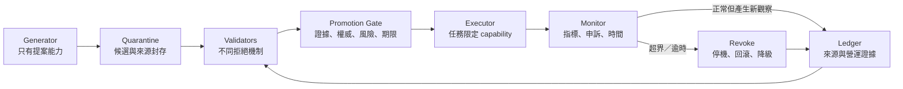

+++
title = "把代理能力關進可撤銷系統：機率工具的工程圍籬"
date = "2026-09-16T06:16:05+08:00"
author = "梅乾"
draft = false
isCJKLanguage = true
description = "針對具備外部操作能力之機率工具，架構包含能力邊界、升格邊界、來源邊界、風險邊界與撤銷邊界的五重工程圍籬，落實最小權限與自動化阻斷機制。"
tags = [
    "分析論述", # term:AnalyticalEssay
    "工程圍籬", # term:EngineeringContainment
    "能力邊界", # term:CapabilityBoundary
    "升格邊界", # term:EscalationBoundary
    "來源邊界", # term:ProvenanceBoundary
    "風險邊界", # term:RiskBoundary
    "撤銷邊界", # term:RevocationBoundary
    "反事實", # term:Counterfactual
  ]
series = ["機率工程化：從機率生成到可撤銷承諾的五道邊界"]
[ai_info]
    [ai_info.generation]
        model = "GPT-5.6 Sol"
        agent = "Codex VS Code extension 26.908.40401"
    [ai_info.refinement]
        model = "Gemini 3.8 Flash"
        agent = "Antigravity IDE 2.5.5"
+++

<!--more-->

## 導言

一個自動化 agent 能讀取監控資料、修改雲端容量、建立部署並在失敗時回滾。團隊為它加上「執行前自我 review」與「高風險時請人工確認」兩條提示，於是認為治理已經完成。事故發生時才發現：agent 使用同一份錯誤分析完成自我 review；「高風險」沒有機械定義；它持有整個雲端帳號的 token；人工確認沒有期限，而舊核准可被重複使用。

問題不在流程缺少動詞，而在動詞沒有改變系統能力。若 `owner` 只是顯示文字、`risk` 不影響權限、`approved` 不會過期、`rollback` 從未演練，這些欄位都是敘事，不是控制。

**工程圍籬**（Engineering Containment） <!-- term:EngineeringContainment -->的目標不是保證生成永遠正確，而是建立**反事實**（Counterfactual） <!-- term:Counterfactual -->：若主張缺乏證據、越過授權範圍、監測超界或核准過期，系統必須真的拒絕、降級或撤銷。這種思路延續了保護系統中的 fail-safe defaults、separation of privilege 與 least privilege：權限應以明示允許為基礎，並只授予完成任務所需的最小集合（[Saltzer 與 Schroeder，1975／The Protection of Information in Computer Systems](https://web.mit.edu/Saltzer/www/publications/protection/Basic.html)）。

> [!IMPORTANT]
> **工程圍籬** <!-- term:EngineeringContainment --> (Engineering Containment): 藉由能力邊界、升格邊界、風險預算與撤銷機制，將機率輸出工具之潛在故障截斷在可承受範圍內的控制架構。 <!-- anchor:EngineeringContainment -->
> **反事實** <!-- term:Counterfactual --> (Counterfactual): 在未實際發生的處置下本應出現的結果，是因果宣稱的基準，也是觀測資料中永遠缺失的那一半。 <!-- anchor:Counterfactual -->


## 分析

### 一、五種圍籬各自封住不同故障路徑

一個能改變外部狀態的生成式系統，至少需要五個互相獨立的控制面：

1. **能力邊界**（Capability Boundary） <!-- term:CapabilityBoundary -->：元件實際能呼叫哪些資源與動作。
2. **升格邊界**（Escalation Boundary） <!-- term:EscalationBoundary -->：什麼證據與角色能把候選變成執行憑證。
3. **來源邊界**（Provenance Boundary） <!-- term:ProvenanceBoundary -->：產物、證據、核准與執行是否可追溯，是否共用同一生成祖先。
4. **風險邊界**（Risk Boundary） <!-- term:RiskBoundary -->：影響半徑、可逆性、暴露時間與偵測延遲如何改變允許策略。
5. **撤銷邊界**（Revocation Boundary） <!-- term:RevocationBoundary -->：憑證如何到期，監測如何停止執行，事後如何避免舊決定復活。

> [!IMPORTANT]
> **能力邊界** <!-- term:CapabilityBoundary --> (Capability Boundary): 某個驅動媒介能穩定保證什麼、以及不能保證什麼的界線；典型失敗來自把決策權威過度延伸到能力邊界之外，要求媒介回答它回答不了的問題。 <!-- anchor:CapabilityBoundary -->
> **升格邊界** <!-- term:EscalationBoundary --> (Escalation Boundary): 在工程控制中，規範需要何種獨立證據與具名授權角色，方可將機率候選轉換為可執行憑證的結構門檻。 <!-- anchor:EscalationBoundary -->
> **來源邊界** <!-- term:ProvenanceBoundary --> (Provenance Boundary): 將建議產生者與動作執行者的責任主體進行物理分立，確保系統可追溯與不可否認性的安全邊界。 <!-- anchor:ProvenanceBoundary -->
> **風險邊界** <!-- term:RiskBoundary --> (Risk Boundary): 限制自動化或生成系統單次執行失敗時之最大影響半徑與損失上限的硬性防線。 <!-- anchor:RiskBoundary -->
> **撤銷邊界** <!-- term:RevocationBoundary --> (Revocation Boundary): 定義授權憑證的自動過期、手動收回與異常條件下立即中斷執行的撤銷機制。 <!-- anchor:RevocationBoundary -->




這不是瀑布流程。Generator 可以反覆產生候選，Validator 可以並行，Monitor 也會在執行期間持續改變證據。圖中的**硬邊界**（Workspace Boundary） <!-- term:WorkspaceBoundary -->是：生成元件不持有 production capability；執行元件不自行擴張核准範圍；監測元件有獨立停止路徑。

> [!IMPORTANT]
> **硬邊界** <!-- term:WorkspaceBoundary --> (Workspace Boundary): 在專案或系統治理中，用於約束 AI Agent 操作權限或限制其可訪問目錄的強制性範圍界限。 <!-- anchor:WorkspaceBoundary -->


Parnas 主張模組分解應依需要隱藏的設計決策，而非照處理步驟切割（[Parnas，1972／On the Criteria To Be Used in Decomposing Systems into Modules](https://doi.org/10.1145/361598.361623)）。在這裡，需要被封裝的設計決策是「未驗證生成物可影響什麼」。若 generator、validator 與 executor 只是同一個高權限程序裡的三個函式，流程名稱並沒有形成安全邊界。

### 二、最小能力不是口號，而是集合約束

令任務 $t$ 所需能力集合為 $N(t)$，政策在風險等級 $r$ 下允許授予的集合為 $A(r)$，一次執行憑證實際授予集合為 $G$。合法授權必須同時滿足：

$$
N(t)\subseteq G\subseteq A(r).
$$

第一個包含關係確保任務做得到，第二個確保不越權。**最小權限**（Least Privilege） <!-- term:LeastPrivilege -->追求的是讓額外能力 $G\setminus N(t)$ 最小，而不是給一枚萬用 token 再以提示要求「不要亂用」。若任務只需調整 `service-a` 的 replica 數，`G` 不應包含刪除資料庫、修改 IAM 或操作其他服務。

> [!IMPORTANT]
> **最小權限** <!-- term:LeastPrivilege --> (Least Privilege): 讓 process 在每個生命週期階段只保留必要能力的設計原則，透過 capabilities、namespace、seccomp、LSM 與 cgroup 等層共同收斂權限邊界。 <!-- anchor:LeastPrivilege -->


能力也需要時間與物件範圍。可把執行憑證寫成：

$$
K=(principal, actions, resources, bounds, expires, approval\_id).
$$

其中 `bounds` 包含數值限額與影響半徑，`expires` 防止舊核准永久存活，`approval_id` 使每次外部效果都能回溯到升格決定。缺少任一欄位時，不是「資訊較少」，而是授權語意改變。

### 三、風險不能壓成一個沒有行為效果的標籤

單一 `risk=high` 很容易成為裝飾。控制策略至少要看四個維度：最大影響 $I$、暴露範圍 $B$、偵測延遲 $D$ 與可逆性 $R_v$。這些量不必硬湊成一個精確機率，但必須改變政策。例如：

$$
I\uparrow\lor B\uparrow\lor D\uparrow\lor R_v\downarrow
\quad\Rightarrow\quad
\text{更小 capability、更短 TTL、更強證據或禁止自動升格}.
$$

NIST AI RMF 將風險治理視為跨生命週期活動，要求持續監測、事件回應、復原、override 與 decommissioning；Manage 2.4 特別要求能取代、脫離或停用與預期用途不符的 AI 系統（[NIST，2023／AI RMF Core](https://airc.nist.gov/airmf-resources/airmf/5-sec-core/)）。因此「可撤銷」不是部署工具的附加功能，而是 AI 風險控制的一部分。

### 四、把雲端容量調整走一遍

以下表格顯示同一項容量建議如何跨越結構邊界。每一列都包含會使操作失敗的條件。

| 邊界輸入 | 判定／**不變式**（Invariant） <!-- term:Invariant --> | 狀態轉移 | 系統能力 | 最終結果 |
| :--- | :--- | :--- | :--- | :--- |
| 建議 `service-a: 10→30` | 無外部證據 | `Generated → Quarantined` | 無 production token | 只能保存候選 |
| 負載重播與成本估算通過 | 來源至少兩類；SLA 未超界 | `Quarantined → Validated` | 仍不可執行 | 可送核准 |
| owner 核准最大 20 replicas、有效 30 分鐘 | 範圍、上限、期限完整 | `Validated → Approved` | 取得限定 capability | 只能調至 20 |
| canary 調至 12 | 指標在門檻內 | `Approved → Operational` | 只碰 `service-a` | 逐步擴張 |
| 錯誤率 >1% 或 TTL 到期 | 命中撤銷條件 | `Operational → Revoked` | token 失效 | 回滾至 10 |
| 同一建議稍後重播 | approval 已撤銷或過期 | 保持 `Revoked` | 拒絕執行 | 必須重新驗證 |

> [!IMPORTANT]
> **不變式** <!-- term:Invariant --> (Invariant): 系統在任何合法狀態下都必須成立的斷言，是把評估規則寫成可執行檢查的基本單位。 <!-- anchor:Invariant -->


這裡的核准並不是「允許 agent 自由調容量」，而是簽發一個具物件、動作、數值與時間範圍的能力。若建議從 30 被核准為最多 20，executor 不得以原候選值覆寫核准值。

### 五、最小可執行政策引擎

下列 Python 模型同時**驗證能力**（Verification Skill） <!-- term:VerificationSkill -->子集、風險條件、期限與撤銷。它使用單調時間的整數代替真實時鐘，使結果可重現。

> [!IMPORTANT]
> **驗證能力** <!-- term:VerificationSkill --> (Verification Skill): 分辨 AI 產出是自洽、正確、可信或仍不確定的能力。可被工具輔助，但核心仍依賴領域經驗；它是人機協作真正的產能瓶頸，因為 AI 擴充的是生成產能而非驗證產能。 <!-- anchor:VerificationSkill -->


```python
from dataclasses import dataclass, replace
from enum import Enum, auto

class Status(Enum):
    APPROVED = auto()
    OPERATIONAL = auto()
    REVOKED = auto()

@dataclass(frozen=True)
class Grant:
    service: str
    actions: frozenset[str]
    max_replicas: int
    expires_at: int
    owner: str
    evidence_sources: frozenset[str]
    status: Status = Status.APPROVED

def execute(g: Grant, *, now: int, service: str,
            action: str, replicas: int) -> Grant:
    assert g.status is Status.APPROVED, "grant is not executable"
    assert now < g.expires_at, "grant expired"
    assert service == g.service, "resource outside capability"
    assert action in g.actions, "action outside capability"
    assert replicas <= g.max_replicas, "blast-radius bound exceeded"
    assert g.owner, "owner required"
    assert len(g.evidence_sources) >= 2, "high-risk change needs diverse evidence"
    return replace(g, status=Status.OPERATIONAL)

def monitor(g: Grant, *, error_rate: float, now: int) -> Grant:
    if error_rate > 0.01 or now >= g.expires_at:
        return replace(g, status=Status.REVOKED)
    return g

grant = Grant(
    service="service-a",
    actions=frozenset({"scale"}),
    max_replicas=20,
    expires_at=30,
    owner="sre-owner",
    evidence_sources=frozenset({"load-replay", "billing-data"}),
)

running = execute(grant, now=5, service="service-a",
                  action="scale", replicas=12)
assert running.status is Status.OPERATIONAL
revoked = monitor(running, error_rate=0.02, now=6)
assert revoked.status is Status.REVOKED

try:
    execute(grant, now=5, service="service-b",
            action="scale", replicas=12)
    raise AssertionError("cross-service execution should fail")
except AssertionError as error:
    assert "outside capability" in str(error)
```

這個範例仍簡化了真實系統：實務上需要不可偽造憑證、原子撤銷、審計儲存與 executor **身分**（Identity） <!-- term:Identity -->驗證。但它已展示核心反事實 <!-- term:Counterfactual -->：即使 agent 想操作其他服務，或想把容量拉到核准上限之外，政策會在外部效果前拒絕。

> [!IMPORTANT]
> **身分** <!-- term:Identity --> (Identity): 系統元件在架構中宣告的核心職責與自我定位。 <!-- anchor:Identity -->


### 六、診斷治理欄位是否真的形成控制

每一個治理欄位都應回答「缺少或超界時，哪個操作會失敗？」下表把常見儀式改寫成結構效果。

| 表面控制 | 底層病灶 | 脆弱做法 | 結構防線 |
| :--- | :--- | :--- | :--- |
| 「執行前請 review」 | reviewer 可同源且無拒絕權 | 記一個布林值 | gate 驗證證據類型與授權簽章 |
| 「高風險請人工確認」 | 高風險不改變能力 | 跳出對話框 | 縮小 capability、縮短 TTL、提高角色分離 |
| `owner=sre` | owner 沒有停止權 | 只供 UI 顯示 | owner 綁定撤銷與事件義務 |
| 「出錯要回滾」 | 回滾可能不可行 | 文件列步驟 | 部署前演練，monitor 可直接觸發 |
| `approved=true` | 核准永久且可重播 | 無期限布林值 | 一次性、範圍化、可撤銷憑證 |
| 「保留完整 log」 | 有紀錄但無法關聯決定 | 收集大量文字 | effect 綁定 approval、來源與狀態版本 |

若 `risk` 值從 3 改成 9，系統授予的能力、所需證據、期限與 rollout 都沒有變，這個欄位就不是風險控制。若刪掉 `owner` 仍可執行，它也不是責任控制。

## 反思

最強反方是，這只是把流程官僚換成架構術語。若 capability 仍是萬用 token、來源欄位可填任意字串、monitor 只能告警不能停止，批評完全成立。結構化不等於有效；只有能改變可達狀態的約束才算圍籬。

第二個反方是，最小權限 <!-- term:LeastPrivilege -->會提高整合成本，短命憑證與細粒度 API 也可能降低可用性。這是實際取捨。合理策略不是一律採最細粒度，而是讓權限粒度與最大損失對稱：小而可逆的內部變更可以使用較寬 session capability；涉及資料刪除、金流、身分 <!-- term:Identity -->或跨帳號操作時，額外整合成本通常就是必要的風險成本。

第三個邊界是局部圍籬不能保證全域安全。每個 agent 都只操作一個服務，串接後仍可能造成級聯失敗；每個動作都在限額內，長時間累積仍可能超出總預算。因此還需要跨元件不變式 <!-- term:Invariant -->，例如全域成本上限、同時變更數、總資料刪除量與熔斷條件。局部 capability 降低單次影響半徑，但不會自動解決組合風險。

最後，回滾也不是所有領域都成立。寄出的郵件、洩漏的資料、完成的轉帳與影響人的決定可能不可逆。對這些動作，圍籬應把控制前移：更強驗證、更小批次、雙重授權、延遲生效或乾脆禁止自主執行，而不是依賴事後補救。

## 結論

機率工具的工程化，不是要求它在每一步聲明不確定，也不是替每次生成增加更多文件。真正工作是把未驗證輸出限制在候選區，讓升格依賴可查驗證據與合法權威，再以最小能力執行，並把監測、逾時與撤銷做成系統可達的狀態。

可攜帶的原則是：

- generator 不應持有它不需要的 production capability。
- 核准應簽發範圍化、限時、可撤銷的執行能力，而非永久布林值。
- 風險欄位必須改變權限、證據、推出方式或自動化等級。
- monitor 必須有獨立停止路徑，營運結果必須回寫為新證據。
- 對不可逆效果，控制必須前移，不能把 rollback 當作想像中的安全網。

治理是否成立，可以用一個反事實 <!-- term:Counterfactual -->檢驗：**如果有人跳過證據、超出範圍、沿用過期核准或忽略超界訊號，系統是否真的不讓他繼續？** 若答案是否定的，剩下的只是善意敘述。