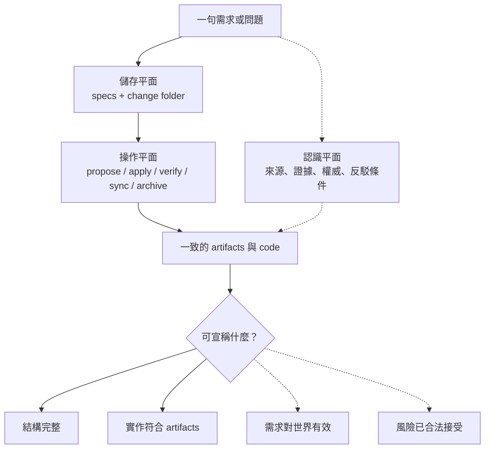

+++
title = "OpenSpec 的忠實解剖：它組織了什麼，又沒有證明什麼"
date = "2026-09-16T06:45:01+08:00"
author = "梅乾"
draft = false
isCJKLanguage = true
description = "解剖 OpenSpec 的儲存平面、操作平面與認識平面。指出其能有效將變更組織為可追蹤的檔案與工作流，但預設結構無法自行產生需求正當性、外部有效性或組織授權，必須精準標定工具的保證範圍。"
tags = [
    "分析論述", # term:AnalyticalEssay
    "軟體工程與規格", # term:SoftwareEngineeringSpecifications
    "不變式", # term:Invariant
    "外部有效性", # term:ExternalValidity
    "反駁條件", # term:Defeater
  ]
series = ["OpenSpec 的權威邊界：從文件一致到可撤銷承諾"]
[ai_info]
    [ai_info.generation]
        model = "GPT-5.6 Sol"
        agent = "Codex VS Code extension 26.908.40401"
    [ai_info.refinement]
        model = "Gemini 3.8 Flash"
        agent = "Antigravity IDE 2.5.5"
+++

<!--more-->

## 導言

假設使用者只說：「替後台加入夜間模式，減少長時間操作造成的眼睛疲勞。」一個順暢的規格工作流可以把這句話展成 proposal、可切換主題的 scenarios、CSS token design 與 tasks。實作也可能完全符合這些文件。最後唯一沒有被檢驗的，恰好是起點最強的因果主張：夜間模式是否真的減少疲勞，以及誰有權把這個效益寫成產品目的。

要分析這個缺口，第一步不是批評 OpenSpec，而是忠實標定它的工作面。截至 2026-09-16，官方把 OpenSpec 描述為人與 AI 之間的輕量協議層；它以 main specs 表示目前共同同意的行為，以 change folder 包裝 proposed modifications，並強調 fluid、iterative、brownfield-first。官方概念與術語可見 [OpenSpec Concepts](https://github.com/Fission-AI/OpenSpec/blob/main/docs/concepts.md) 與 [OpenSpec Overview](https://github.com/Fission-AI/OpenSpec/blob/main/docs/overview.md)。

本文的核心主張是：OpenSpec 的強項是把變更表示成可追蹤的資料結構，並讓 agent 依此協作；它的預設結構不會自行產生需求正當性、**外部有效性**（External Validity） <!-- term:ExternalValidity -->或組織授權。這不是缺陷指控，而是保證範圍的解剖。

> [!IMPORTANT]
> **外部有效性** <!-- term:ExternalValidity --> (External Validity): 評估系統承諾與規格是否真正解決實際問題並符合真實環境、政策與使用者限制的驗證維度，無法單純由內部程式碼與文件的自洽性推導成立。 <!-- anchor:ExternalValidity -->


## 分析

### 三個平面不能混成一個

先把一個 change 拆成三個平面。儲存平面回答「檔案在哪裡」；操作平面回答「命令會做什麼」；認識平面回答「文件中的主張為何可信」。OpenSpec 對前兩者提供明確結構，第三者則多半留給團隊、測試、review 與外部治理。



虛線不是表示認識平面不重要，而是它不會因檔案存在或命令成功而自動成立。這個區分讓評價回到精確問題：工具完成了哪一種工作，使用者又把哪一種額外保證投射到它身上。

### 儲存平面：目前行為與 proposed change

官方預設的 spec-driven schema 以 proposal → specs/design → tasks 組織 artifacts。Main specs 位於 `openspec/specs/`；一個 change 則保存 proposal、delta specs、design、tasks 與 metadata。**約束性規格**（Spec） <!-- term:Spec --> 聚焦可觀察行為，design 承擔實作方法。OpenSpec 自身的 convention spec 也明示 behavior-first 邊界，要求 spec 描述可驗證的行為、介面、錯誤與限制，而不是內部實作細節（[OpenSpec conventions spec](https://github.com/Fission-AI/OpenSpec/blob/main/openspec/specs/openspec-conventions/spec.md)）。

> [!IMPORTANT]
> **約束性規格** <!-- term:Spec --> (Spec): 以結構化或機器可讀格式定義的系統或 API 合約規範。 <!-- anchor:Spec -->


這個分工很重要，因為它排除了一個稻草人：OpenSpec 並非把所有設計細節塞進同一份需求規格。真正的邊界在於，即使 artifact 各司其職，文件角色分開仍不等於主張來源分開。

| Artifact | 主要承載 | 結構可檢查 | 結構本身不能證明 |
| :--- | :--- | :--- | :--- |
| proposal | why、scope、預期價值 | 欄位與依賴存在 | 目的來自合法 stakeholder |
| delta spec | 新增、修改、移除的行為 | requirement/scenario 形狀 | 行為就是正確需求 |
| design | 技術路徑與取捨 | 已描述 approach | 風險被有權角色接受 |
| tasks | 可執行工作與進度 | checkbox 狀態 | 工作有效、完整或已驗收 |

表格的重點不是列出缺點，而是限制推論方向。從「proposal 存在」可以推得目的已被寫下，不能推得目的已被授權。

### 操作平面：命令改變的是 repository state

截至同一觀測日期，OPSX core profile 包含 propose、explore、apply、update、sync、archive；verify 位於 expanded workflow。官方命令文件說 verify 檢查 completeness、correctness、coherence，並把 implementation 與 change artifacts 對照；archive 檢查 artifact 與 task 狀態、可提示同步 delta，然後移動 change folder。**衝突封存**（Archive） <!-- term:Archive --> 對未完成 tasks 會警告，但不會硬性阻擋（[OpenSpec Commands](https://github.com/Fission-AI/OpenSpec/blob/main/docs/commands.md)）。

> [!IMPORTANT]
> **衝突封存** <!-- term:Archive --> (Archive): 這是 SDD 治理框架中的三層防禦之一，旨在記錄版本歷史與衝突狀態，但在底層模型發生無聲漂移時，由於缺乏清晰分界點，難以有效捕捉連續的品質滑坡。 <!-- anchor:Archive -->


這些都是有用而具體的保證。它們的共同特徵是：輸入主要來自 repository 內的 artifacts 與 code，輸出主要改變 repository 內的表示。命令名稱中的 verify 或 complete 不應被翻譯成未寫入其輸入的外部證據。

下面讓夜間模式案例完整走一次。這張表特意把「狀態轉移」與「額外推論」分開。

| 邊界輸入 | 關鍵判定 | **資源庫**（Repository） <!-- term:Repository --> 狀態轉移 | 合理結果 | 仍未回答 |
| :--- | :--- | :--- | :--- | :--- |
| 「加入夜間模式以減少疲勞」 | 能否形成 change | 產生 proposal/spec/design/tasks | 需求已被結構化 | 效益主張是否真實 |
| artifacts 齊全 | tasks 是否可執行 | apply 修改 code、勾選 tasks | code 依計畫產生 | 使用者是否能正確使用 |
| code 與 artifacts | completeness/correctness/coherence | verify 產生問題清單 | 可發現多種 drift | 起始目的是否正確 |
| delta 與 change | 是否同步、是否接受警告 | archive 移動並保存 artifacts | 變更紀錄收束 | 殘餘風險由誰承擔 |

> [!IMPORTANT]
> **資源庫** <!-- term:Repository --> (Repository): 存放專案原始碼、版本歷史紀錄與配置文件的中心儲存庫。 <!-- anchor:Repository -->


表中最後一欄不是要求 OpenSpec 自動解答一切。它只是防止團隊在沒有額外輸入時，從 repository state 跨越到 world state。

### Artifact DAG 的形式邊界

將 artifacts 表為有向無環圖 $G_A=(V,E_A)$。若邊 $(u,v)$ 表示建立 $v$ 需要 $u$，那麼圖完整性可以寫成：

$$
\mathrm{Complete}(G_A)=\bigwedge_{v\in V}\left(\mathrm{requires}(v)\subseteq \mathrm{Created}\right)
$$

這個式子只量到節點與依賴。若主張集合為 $C$，證據關係為 $E_E\subseteq Evidence\times C$，授權關係為 $E_H\subseteq Principal\times C$，則 $E_A$ 完整不推出 $E_E$ 或 $E_H$ 存在：

$$
\mathrm{Complete}(G_A)\not\Rightarrow
\left(\forall c\in C,\ \exists e:(e,c)\in E_E\right)
\land
\left(\forall c\in C,\ \exists h:(h,c)\in E_H\right)
$$

這不是裝飾性數學。它指出 schema dependency 與 evidence/authority 是不同型別的邊；若系統只儲存第一種邊，查詢後兩種必然得到空白，而不是隱含答案。

最小可執行模型可直接驗證這一點：

```python
requires = {
    "proposal": set(),
    "specs": {"proposal"},
    "design": {"proposal"},
    "tasks": {"specs", "design"},
}
created = set(requires)

def graph_complete() -> bool:
    return all(deps <= created for deps in requires.values())

claim_evidence: dict[str, set[str]] = {}
claim_authority: dict[str, set[str]] = {}

assert graph_complete()
assert not claim_evidence
assert not claim_authority
```

程式故意不模擬 OpenSpec 實作；它只驗證一個**不變式**（Invariant） <!-- term:Invariant -->：artifact completeness 與 claim support 是可同時一真一假的獨立狀態。

> [!IMPORTANT]
> **不變式** <!-- term:Invariant --> (Invariant): 系統在任何合法狀態下都必須成立的斷言，是把評估規則寫成可執行檢查的基本單位。 <!-- anchor:Invariant -->


### 可客製性是能力，不是既成治理

OpenSpec 並未把預設 schema 當作永久封閉模型。官方支援 project-local、version-controlled custom schemas；團隊可以 fork `spec-driven`，新增 artifacts、templates 與 `requires` 邊（[OpenSpec Customization](https://github.com/Fission-AI/OpenSpec/blob/main/docs/customization.md)）。因此「預設未表示證據」不等於「OpenSpec 無法承載 evidence artifact」。

但承載與執行仍需分開。**結構合約**（Schema） <!-- term:Schema --> 可以要求先有 `evidence.md` 才產生 `approval.yaml`，卻不會只靠檔名保證證據來自 production、核准者具備權限，或簽章未被偽造。這些控制通常要由 CI、Git hosting、IAM、測試環境與部署平台執行。

> [!IMPORTANT]
> **結構合約** <!-- term:Schema --> (Schema): 定義資料欄位、型別與排版限制的強型別規格定義，用於強制約束模型產出的格式。 <!-- anchor:Schema -->


診斷時可使用下面的四維矩陣，避免把每個綠燈都稱為「驗證完成」。

| 表面現象 | 底層機制 | 脆弱反射 | 嚴密防衛 |
| :--- | :--- | :--- | :--- |
| artifacts 全部存在 | 檔案圖完整 | 宣稱需求已確認 | 另查 claim owner 與來源 |
| verify 無 critical | code-artifact 對照無明顯缺口 | 宣稱產品方向正確 | 加入外部 oracle 與負向案例 |
| tasks 全勾 | checklist 狀態完成 | 宣稱工作已驗收 | 連結可重現 evidence |
| archive 成功 | delta/目錄狀態完成 | 宣稱風險已結案 | 記錄期限、rollback 與 observation |

矩陣的用途是為每個表面讀數找到它真正量到的機制。只有這樣，額外治理才會補在缺口上，而不是重複已有檢查。

## 反思

最強反方是：輕量規格工具本來就不該內建完整企業治理。這個反方成立。對低風險、可逆的 UI 變更，PR review、既有測試與 feature flag 可能已提供足夠控制；硬塞多層 approval 只會把 agreement layer 變成 bureaucratic bottleneck。

因此本文不主張每個 change 都增加同樣儀式。它主張的是風險相稱與語意誠實：低風險可以薄，但不能把「薄」改名為「已獨立驗證」；高風險可以厚，且厚度要來自新資訊與真正權限，不是多幾個由同一 agent 生成的 Markdown 檔。

另一個邊界是文件版本。本文只描述截至 2026-09-16 可觀測的官方 main branch。OpenSpec 的命令、profile 與 wording 仍可能變動；引用日期是技術事實的一部分，不是註腳裝飾。

## 實務對比

把前面的分析放回團隊決策，可得到三種明顯不同的用法。

| 情境 | 脆弱用法 | 合理用法 | 判斷原因 |
| :--- | :--- | :--- | :--- |
| 私有函式改名 | 填滿所有治理 artifacts | 簡短 change＋測試 | 影響小、可逆、oracle 明確 |
| 租戶權限修改 | 同一 agent 產生 spec 與測試後直接 archive | 加 policy owner、負向帳號測試、audit observation | 錯誤可跨租戶且難回收 |
| 資料保留政策 | 把 production 現況同步回 spec 當作正確 | 同時記 observed 與 normative，再由法務 owner 核准 | 現況可能正是違規狀態 |

這些案例顯示，工具角色不是由品牌名稱決定，而是由「它的輸入能支持什麼推論」決定。相同 OpenSpec 可以在小變更中作為完整而足夠的協議層，也可以在高風險變更中只作為治理系統的一個結構化前端。

## 結論

OpenSpec 忠實而有價值的核心，是把目前行為與 proposed change 分離，以 delta、artifact graph 與 agent commands 降低 brownfield 變更的協作成本。它也清楚區分 behavior spec 與 technical design，並允許 schema 客製。

這些能力能證明 artifacts 存在、依賴滿足，以及某些 implementation-artifact 關係成立。它們不會在沒有新輸入時證明需求正確、效益真實或風險已由有權者接受。可靠採用的起點不是替工具加上哲學負擔，而是守住推論邊界：**repository state 可以形成一致的協議；只有證據、權限與外部觀察，才能把協議升格為暫時可信的工程承諾。**