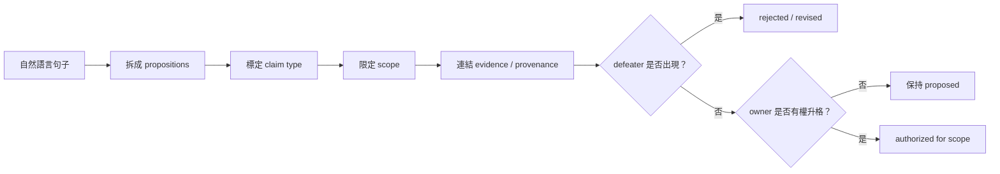

+++
title = "Artifact 不是 Claim：先替主張定型，才談得上驗證與授權"
date = "2026-09-16T06:45:02+08:00"
author = "梅乾"
draft = false
isCJKLanguage = true
description = "指出自然語言需求常混淆觀察、意圖、假說、規範、決策與完成六種主張型別。為主張建立包含適用範圍、來源、反駁條件與授權主體的契約結構，防止進入規格文件的文字被誤認為已證驗的事實。"
tags = [
    "分析論述", # term:AnalyticalEssay
    "主張型別", # term:ClaimTyping
    "反駁條件", # term:Defeater
    "不變式", # term:Invariant
    "身分", # term:Identity
  ]
series = ["OpenSpec 的權威邊界：從文件一致到可撤銷承諾"]
[ai_info]
    [ai_info.generation]
        model = "GPT-5.6 Sol"
        agent = "Codex VS Code extension 26.908.40401"
    [ai_info.refinement]
        model = "Gemini 3.8 Flash"
        agent = "Antigravity IDE 2.5.5"
+++

<!--more-->

## 導言

一句「退款期限應從 30 天改成 90 天」看似是一條 requirement，實際可能包含四種不同主張：production 現在是 90 天、使用者希望 90 天、法定政策允許 90 天、產品 owner 已核准改成 90 天。四句話都能被寫進 spec，卻需要不同來源、反駁方式與責任人。

若系統只把它們視為 Markdown 文字，後續 verify 最多檢查 code 是否實作「90 天」。它無法由字面判斷這個數字是觀察、假說、規範還是已授權決定。問題的根源因此早於驗證：artifact 是容器，claim 才是需要證據與權威的最小單位。

本文建立一套可操作的**主張型別**（Claim Typing） <!-- term:ClaimTyping -->。目的不是把自然語言變成繁重本體論，而是阻止一種常見升格：某句話因為進入 proposal 或 spec，就被當成比原本更真的事實。

> [!IMPORTANT]
> **主張型別** <!-- term:ClaimTyping --> (Claim Typing): 將規格與工程文件中的自然語言陳述依語意與責任邊界劃分為觀察、意圖、假說、規範、決策與完成等範疇的型別系統，要求各範疇提供獨立的來源、反駁條件與授權主體，防止未經證驗的假設被自動升格為事實。 <!-- anchor:ClaimTyping -->


## 分析

### 同一段文字裡至少有六種主張

一個 change 的語句通常跨越下列型別。型別決定「誰能提出」「什麼能支持」「什麼會反駁」，而不是只決定它應放在哪個檔名。

| 主張型別 <!-- term:ClaimTyping --> | 典型問句 | 合法支持 | 典型反駁 |
| :--- | :--- | :--- | :--- |
| observation | 系統現在做什麼 | 可重現量測、log、查詢 | 新量測重現不了 |
| intent | 哪個人的哪個問題要被解決 | 具名 stakeholder 確認 | owner 撤回或範圍不符 |
| hypothesis | 改變 X 是否造成 Y | 實驗、因果資料、對照 | 結果不支持或有替代解釋 |
| norm | 系統應遵守什麼 | 法規、政策、正式契約 | 上位規範不同或已失效 |
| design decision | 採哪條技術路徑 | trade-off、限制、owner 判斷 | 新限制使選擇不再成立 |
| completion claim | 哪項工作已完成 | commit、測試、部署證據 | 證據無法重現或範圍不足 |

這張表讓「spec 裡寫了」不再是萬用支持。**約束性規格**（Spec） <!-- term:Spec --> 可以是多種主張的表示位置，但位置不會改變主張所需的證成規則。

> [!IMPORTANT]
> **約束性規格** <!-- term:Spec --> (Spec): 以結構化或機器可讀格式定義的系統或 API 合約規範。 <!-- anchor:Spec -->


### Claim record 的最小結構

每個需要升格的主張，可用六個欄位表示：

$$
c=\langle type,\ proposition,\ scope,\ provenance,\ defeater,\ owner\rangle
$$

`type` 決定證成規則；`proposition` 是可判定的命題；`scope` 限制適用範圍；`provenance` 記錄來源；`defeater` 指出何種觀察會推翻它；`owner` 則標示誰有權修改或接受它。W3C PROV 把 provenance 建模為 entity、activity 與 agent 的關係，用來支援品質、可靠性與可信度判斷（[W3C PROV Overview](https://www.w3.org/TR/prov-overview/)）。這套報告不要求完整導入 RDF，但保留「誰透過什麼活動產生哪個 entity」是最低限度。

型別化之後，主張的生命週期才可被清楚描述：



流程中最重要的不是多一個 approval 節點，而是 approval 之前已知道「正在核准什麼型別的命題」。產品 owner 可以核准 intent，卻不能靠職稱改寫 production observation；測試可以支持 behavior claim，卻不能授予政策正當性。

### 用退款期限走一遍

考慮客服回報：「現在有人能在購買後 90 天退款；請把規格更新成 90 天。」若不拆主張，update spec 看似最直接。拆開後，狀態會完全不同。

| 邊界輸入 | Claim type | 關鍵判定／**不變式**（Invariant） <!-- term:Invariant --> | 狀態轉移 | 最終處置 |
| :--- | :--- | :--- | :--- | :--- |
| production 接受第 90 天退款 | observation | 可由交易重現 | unknown → observed | 記錄現況 90 |
| 正式退款政策寫 30 天 | norm | 文件有效且適用此市場 | unknown → normative | 保留規範 30 |
| 客服希望減少爭議 | intent | owner 與範圍明確 | proposed → acknowledged | 不直接改政策 |
| 「所以應改成 90 天」 | design/policy decision | 需 policy owner＋影響證據 | blocked | 先判定修 code 或改政策 |
| spec 被更新為 90 天 | canonical description | 不得抹掉 norm drift | observed → recorded | 明示 implementation drift |

> [!IMPORTANT]
> **不變式** <!-- term:Invariant --> (Invariant): 系統在任何合法狀態下都必須成立的斷言，是把評估規則寫成可執行檢查的基本單位。 <!-- anchor:Invariant -->


走完後會發現，更新 spec 可能是描述上正確的動作，但不是規範上正確的結論。Typed claims 保留了這個張力，使團隊能同時看見「系統在做什麼」與「系統應做什麼」。

### 升格規則必須依型別分派

令 $E(c)$ 為支持主張 $c$ 的證據集合，$H(c)$ 為有權角色，$D(c)$ 為已知反駁，則最低升格條件可寫成：

$$
\mathrm{Promotable}(c)=
\mathrm{TypeRule}_{type(c)}(E(c))
\land \mathrm{Authorized}(H(c),type(c),scope(c))
\land \neg D(c)
$$

這個式子禁止兩種偷渡。第一，不能用不相干 evidence 充數；通過 unit tests 不支持「使用者需要這個功能」。第二，不能用沒有該型別權限的角色升格；工程師能確認 code 行為，不必然能核准退款政策。

下面的最小程式把這個不變式 <!-- term:Invariant -->做成可執行檢查：

```python
from dataclasses import dataclass

REQUIRED = {
    "observation": {"runtime"},
    "intent": {"stakeholder"},
    "hypothesis": {"experiment"},
    "norm": {"policy"},
    "completion": {"test"},
}

@dataclass(frozen=True)
class Claim:
    kind: str
    evidence: frozenset[str]
    owner_role: str
    scope: str
    defeated: bool = False

AUTHORITY = {
    "observation": {"operator"},
    "intent": {"product-owner"},
    "hypothesis": {"research-owner"},
    "norm": {"policy-owner"},
    "completion": {"engineering-owner"},
}

def promotable(c: Claim) -> bool:
    return (
        REQUIRED[c.kind] <= c.evidence
        and c.owner_role in AUTHORITY[c.kind]
        and bool(c.scope)
        and not c.defeated
    )

observed = Claim("observation", frozenset({"runtime"}), "operator", "EU")
fake_norm = Claim("norm", frozenset({"test"}), "engineering-owner", "EU")
assert promotable(observed)
assert not promotable(fake_norm)
```

程式沒有判斷證據內容是否誠實；它只保證 evidence kind 與 authority kind 不會因欄位存在而互相冒充。這正是結構可可靠承擔的工作。

### Artifact 與 Claim 是多對多關係

**變更提案**（Proposal） <!-- term:Proposal --> 可能同時含 intent、hypothesis 與 design sketch；spec 可能同時含 norm、observable behavior 與 edge-case assumption。一個 completion claim 也可能引用 spec、test result 與 deployment record。將 artifact 與 claim 做一對一綁定，會把文字位置誤當成語意型別。

> [!IMPORTANT]
> **變更提案** <!-- term:Proposal --> (Proposal): 在差量流程中提交的變更申請，用以詳細描述規格的修改內容與動機。 <!-- anchor:Proposal -->


更精確的模型是二部圖：

$$
G_{AC}=(A\cup C,E_{contains})
$$

其中 artifact 集合 $A$ 是容器，claim 集合 $C$ 是命題。證據與權威再形成不同邊：

$$
E_{supports}\subseteq Evidence\times C,\qquad
E_{authorizes}\subseteq Principal\times C
$$

同一 artifact 可以包含多個 claims；同一 claim 也可在 proposal、spec 與 test plan 中有不同投影。穩定**身分**（Identity） <!-- term:Identity -->應屬於 claim，而不是某一段 Markdown 的行號。

> [!IMPORTANT]
> **身分** <!-- term:Identity --> (Identity): 系統元件在架構中宣告的核心職責與自我定位。 <!-- anchor:Identity -->


下面的診斷矩陣用來發現尚未定型的主張。

| 表面讀數／現象 | 底層病灶 | 脆弱反射 | 嚴密防衛 |
| :--- | :--- | :--- | :--- |
| proposal 有完整 why | intent 與 hypothesis 混寫 | 把故事當證據 | 分成 owner-confirmed intent 與可反駁 hypothesis |
| spec 使用 SHALL | 語氣像規範但來源不明 | 把大寫關鍵字當權威 | 記 norm provenance 與適用範圍 |
| test 全綠 | completion 與 validation 混寫 | 宣稱問題已解決 | 限制為「實作符合測試 oracle」 |
| human reviewed = true | 身分 <!-- term:Identity -->、角色、範圍缺失 | 把人類存在當合法授權 | 記 approver identity、role、scope、expiry |

矩陣顯示，主張型別 <!-- term:ClaimTyping -->不是替文字貼標籤，而是改變後續可接受的推論。

## 反思

最強反方是：工程團隊不需要建立完整 claim database；自然語言與 PR review 已足以運作。對低風險與共享默契強的團隊，這很可能正確。主張定型應該服務風險，不該成為每句話都要填六欄的官僚制度。

實務上可以只型別化「會跨邊界升格」的句子：會進入 main spec 的規範、會驅動 production 行為的 intent、會被拿來宣稱成效的 hypothesis，以及會關閉高風險 change 的 completion claim。普通說明文字不必被結構化。

第二個邊界是，provenance 不等於 truth。W3C PROV 能表示某數字由誰、透過哪個活動產生；它不能保證測量方法正確或 agent 沒有偽造來源。來源可追蹤只是讓審查與反駁成為可能，不是把信任問題消失。

第三個邊界是 owner 不必總是人名。自動化測試可作為 completion evidence，部署平台可產生 runtime observation；但 authorization principal 應落到可追責的角色或制度，而不是把「agent」當成無限權限的抽象主體。

## 實務對比

以下對比把「多寫欄位」與「改變推論」分開。只有後者值得引入。

| 原句 | 未定型讀法 | Typed claim 寫法 | 可阻止的錯誤 |
| :--- | :--- | :--- | :--- |
| 夜間模式減少疲勞 | 已知效益 | hypothesis；需使用者研究；可被無差異結果反駁 | 把願望當因果事實 |
| 退款期限是 90 天 | 單一 truth | observation=90；norm=30；scope=EU | 用現況替違規取得正當性 |
| 管理員可匯出資料 | behavior requirement | norm；policy-owner；tenant-admin scope | 把 authenticated user 寫成 admin |
| 已完成 | change 可關閉 | completion；test+deploy evidence；engineering owner | checkbox 取代驗收 |

Typed claims 的價值不在語言更正式，而在錯誤無法再靠模糊詞彙跨越證據與權威邊界。

## 結論

Artifact 是協作容器，不是認識論單位。同一份 proposal、spec 或 design 可以同時承載觀察、目的、假說、規範與決策；這些主張需要不同來源、**反駁條件**（Defeater） <!-- term:Defeater -->與 owner。

> [!IMPORTANT]
> **反駁條件** <!-- term:Defeater --> (Defeater): 在主張契約中明確定義的證偽觀測或環境條件，一旦在系統運行或審計中被觸發，即強制宣告該主張失效並啟動修訂或撤銷程序。 <!-- anchor:Defeater -->


當系統只看見檔案，verify 只能檢查檔案與 code 的關係。當系統也看見 typed claims，它才能問對問題：這是什麼型別的命題、哪種 evidence 與它相關、誰在什麼 scope 內有權升格，以及什麼事件應使它失效。**可靠治理不是讓每句話變重，而是讓會驅動現實的句子不能在未定型時取得權威。**