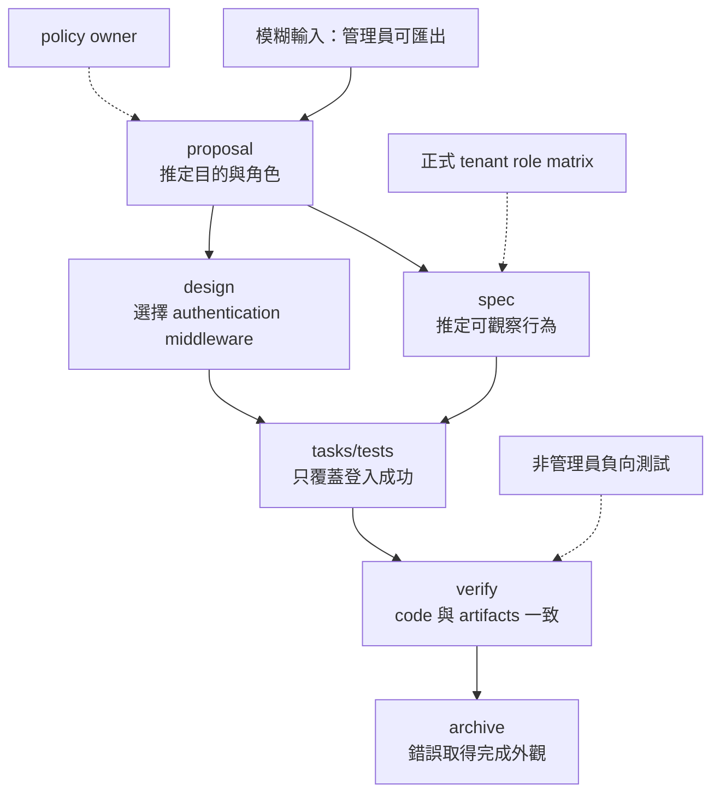

+++
title = "規格坍縮：文件分層如何被同一個錯誤前提穿透"
date = "2026-09-16T06:45:03+08:00"
author = "梅乾"
draft = false
isCJKLanguage = true
description = "剖析提案、規格、設計與工作清單形式分立卻仍共同出錯的「規格坍縮」機制。揭示缺乏非同源新資訊輸入時，各層文件僅是複述同一個未驗證前提，內部自洽反向掩蓋了外部無效性。"
tags = [
    "分析論述", # term:AnalyticalEssay
    "軟體工程與規格", # term:SoftwareEngineeringSpecifications
    "規格坍縮", # term:SpecificationCollapse
    "認識論角色", # term:EpistemologicalRole
    "不變式", # term:Invariant
    "依賴圖", # term:DependencyGraph
    "約束性規格", # term:Spec
  ]
series = ["OpenSpec 的權威邊界：從文件一致到可撤銷承諾"]
[ai_info]
    [ai_info.generation]
        model = "GPT-5.6 Sol"
        agent = "Codex VS Code extension 26.908.40401"
    [ai_info.refinement]
        model = "Gemini 3.8 Flash"
        agent = "Antigravity IDE 2.5.5"
+++

<!--more-->

## 導言

使用者說：「讓管理員匯出租戶資料。」Agent 將「管理員」理解成任何已登入使用者，於是 proposal 寫「authenticated admin」、spec 只要求 session 存在、design 選擇既有 authentication middleware、tasks 加入匯出端點與正向測試。四份文件的主題分工完全正確，卻由同一個錯誤前提貫穿。

這種失敗不能簡化成「spec 與 design 沒有分開」。它們確實分開了。真正坍縮的是**認識論角色**（Epistemological Role） <!-- term:EpistemologicalRole -->：目的、行為、技術選擇與完成證明都從同一份未驗證的世界模型派生，之後又以彼此一致作為可信度來源。

> [!IMPORTANT]
> **認識論角色** <!-- term:EpistemologicalRole --> (Epistemological Role): 指工程文件中各組成部分在知識證成鏈條中所承擔的功能定位（如事實觀察、意圖陳述、規範約束或授權憑證），各角色必須由對應的外部證據與授權者支撐，不能由文字容器形式直接替代。 <!-- anchor:EpistemologicalRole -->


本文把這種現象稱為**規格坍縮**（Specification Collapse） <!-- term:SpecificationCollapse -->。它不是檔案合併，而是多個應由不同證據或權威支撐的主張，在生成與修正過程中失去獨立性。

> [!IMPORTANT]
> **規格坍縮** <!-- term:SpecificationCollapse --> (Specification Collapse): 指提案、規格、設計與工作清單等各層文件形式上各自獨立，但其認識論角色均源自同一個未經外部檢驗的假設或誤解，導致內部一致性掩蓋外部無效性的系統性失效現象。 <!-- anchor:SpecificationCollapse -->


## 分析

### 坍縮不是「同一個人寫」，而是「沒有新資訊進場」

同一個 agent 寫多份文件並不必然有問題。若它在產生 spec 時讀到正式角色矩陣，在驗證時執行負向授權測試，系統已經獲得新資訊。相反地，即使文件由三個人撰寫，只要三人都只複述同一段含糊需求，來源仍高度相關。

因此判準不是作者數量，而是每次跨角色轉換是否引入能反駁前一步的新資訊：



右側虛線是三個可能打破坍縮的入口。它們之所以有效，不是因為形式不同，而是因為內容不由原始誤解推導而來。

### 四種依賴被寫成同一種箭頭

OpenSpec 的 schema dependency 很適合表示「建立下一個 artifact 前需要哪些 artifact」。官方將 dependencies 描述為 enablers，而非 rigid phase gates；預設 schema 的確以 proposal → specs/design → tasks 組織生成（[OpenSpec Concepts](https://github.com/Fission-AI/OpenSpec/blob/main/docs/concepts.md)）。

但工程論證中至少存在四種不同的邊：

| 邊的型別 | 它回答的問題 | 管理員案例 | 單靠 `requires` 是否充分 |
| :--- | :--- | :--- | :---: |
| semantic dependency | 讀懂 B 是否需要 A | tasks 需知道 spec | 是 |
| generation dependency | 產生 B 時讀哪些輸入 | design 讀 proposal | 是 |
| evidence dependency | 哪個獨立觀察支持主張 | role matrix 支持 admin 定義 | 否 |
| authority dependency | 誰可使主張生效 | security owner 核准權限 | 否 |

若四種邊都被口語化成「B depends on A」，就容易誤以為 artifact DAG 已完整表示論證。實際上它主要描述前兩種；後兩種必須另有型別與執行機制。

### 坍縮的五步因果鏈

管理員案例可以逐步走成一個可診斷的狀態轉移，而不是只用「共同前提錯誤」一句帶過。

| 階段 | 邊界輸入 | 關鍵判定 | 狀態轉移 | 錯誤如何存活 |
| :--- | :--- | :--- | :--- | :--- |
| 1. 詞義解析 | 「管理員」 | 是否查正式角色定義 | ambiguous → assumed | 以一般語義補空白 |
| 2. Artifact 展開 | proposal/spec/design | 是否標記 assumption | assumed → distributed | 每份文件都複製 admin=authenticated |
| 3. 實作 | 已一致的 artifacts | middleware 是否符合 spec | distributed → encoded | 錯誤成為 code |
| 4. 驗證 | code＋同源 scenarios | 是否存在負向 oracle | encoded → confirmed | 只驗證登入者成功 |
| 5. 封存 | 全綠報告＋tasks | 完成是否等於合法 | confirmed → canonical | 錯誤被主規格吸收 |

這五步揭示一個反直覺結果：每一步局部上都可能做對。**約束性規格**（Spec） <!-- term:Spec --> 忠實承接 proposal，code 忠實承接 spec，test 忠實承接 scenario。全鏈失敗來自第一步的假設從未被暴露，也沒有跨邊界反駁。

> [!IMPORTANT]
> **約束性規格** <!-- term:Spec --> (Spec): 以結構化或機器可讀格式定義的系統或 API 合約規範。 <!-- anchor:Spec -->


### 形式模型：相關錯誤不會因重複而抵銷

令起始前提為 $H$，衍生 artifacts 為 $A_1,\dots,A_n$。若每個 artifact 都由同一 $H$ 生成，則在 $H$ 錯誤的條件下，這些 artifacts 的錯誤不是獨立事件：

$$
P(A_1\ \text{wrong},\dots,A_n\ \text{wrong}\mid H\ \text{wrong})
\approx 1
$$

增加同源 artifacts 的數量，不會像增加獨立量測一樣降低錯誤率。若它們只是確定性地承接 $H$，則：

$$
\forall i \; (H \Rightarrow A_i) \quad\land\quad \mathrm{Agreement}(A_1,\dots,A_n) \not\Rightarrow H
$$

這就是坍縮的核心**不變式**（Invariant） <!-- term:Invariant -->：衍生物彼此同意，只證明轉換一致，不能反向證明共同前提正確。

> [!IMPORTANT]
> **不變式** <!-- term:Invariant --> (Invariant): 系統在任何合法狀態下都必須成立的斷言，是把評估規則寫成可執行檢查的基本單位。 <!-- anchor:Invariant -->


可執行模型可把來源污染沿**依賴圖**（Dependency Graph） <!-- term:DependencyGraph -->傳播：

> [!IMPORTANT]
> **依賴圖** <!-- term:DependencyGraph --> (Dependency Graph): 追溯各項治理規則與機制之建立緣由所構成的依賴網路，用以評估該機制的存續價值與拆除時機。 <!-- anchor:DependencyGraph -->


```python
requires = {
    "proposal": {"user_prompt"},
    "spec": {"proposal"},
    "design": {"proposal"},
    "tasks": {"spec", "design"},
    "code": {"tasks"},
    "verify": {"spec", "design", "code"},
}

tainted = {"user_prompt"}  # 「admin = authenticated」未被確認

changed = True
while changed:
    changed = False
    for node, deps in requires.items():
        if deps & tainted and node not in tainted:
            tainted.add(node)
            changed = True

assert {"proposal", "spec", "design", "tasks", "code", "verify"} <= tainted

# 加入不依賴原始 prompt 的 role matrix，才能形成反駁入口。
external_oracle = {"tenant-admin"}
implemented_roles = {"authenticated"}
assert implemented_roles != external_oracle
```

這段模型的限制也很清楚：真實 artifact 不會因接觸一個污染來源就全盤錯誤。程式展示的是「未標記假設可沿依賴圖 <!-- term:DependencyGraph -->存活」，不是替每份文件判罪。

### 更新（update）可能修正，也可能倒轉權威

OpenSpec 的 iterative 原則允許實作期間修訂 artifacts，這是必要能力。問題在於同一個 update 動作可能代表兩種相反因果：

1. 新證據出現，迫使 spec 或 design 修正。
2. Code 已經這樣寫，於是回寫 spec 讓 verify 變綠。

兩者在 diff 上都可能只是改一行 requirement。第一種是 evidence-driven revision；第二種是 implementation laundering。若 update 不記錄觸發來源、撤回了哪個假設、誰接受影響，流程就無法區分學習與自我合理化。

診斷矩陣可把坍縮從表面整齊度中拉出來：

| 表面讀數／現象 | 底層病灶 | 脆弱反射 | 嚴密防衛 |
| :--- | :--- | :--- | :--- |
| 四份 artifacts 分工清楚 | 同一假設未標記地複製 | 認為 concerns 已分離 | 追蹤 claim provenance |
| PR 有多人 review | reviewers 只讀同一 artifacts | 用人數代替資訊獨立 | 指定外部 oracle 與負向案例 |
| update 後重新一致 | spec 追著 code 改 | 把綠燈當學習 | 記錄 revision trigger 與 authority |
| scenarios 全通過 | scenarios 未包含被誤解角色 | 增加更多同類正向測試 | 從政策矩陣生成反例 |

矩陣顯示，真正防線是資訊來源與反駁路徑，而不是文件數或參與人數。

## 反思

第一個反方是：proposal、spec、design、tasks 本來只是溝通 artifacts，權威可由 PR review 補足。完全正確。若 repository 已用 CODEOWNERS、required review 與安全測試把外部控制接上，OpenSpec 預設 schema 不必重複實作它們。本文的批判對象是「從 artifact separation 推得 authority separation」，不是要求所有治理都內建在 OpenSpec。

第二個反方是，共享上下文能減少 handoff 損失。這也成立。同一 agent 同時理解 proposal、design 與 code，通常比每階段失憶更能維持 coherence。共享上下文不是應被消除的缺點；它是一項需要外部反駁入口平衡的優點。

第三個邊界是 oracle 已完備的封閉問題。例如格式轉換若有完整 corpus、雙向 round-trip property 與明確 schema，同一 agent 產生實作與執行測試仍可得到新資訊。獨立性來自 oracle 不受實作任意改寫，不必形式上換另一個人。

## 實務對比

同一個 OpenSpec 動作可以保留，也可以坍縮；差別在於跨越了什麼邊界。

| 動作 | 坍縮版本 | 非坍縮版本 |
| :--- | :--- | :--- |
| 產生 spec | 從 proposal 補完所有未定義詞 | 未定義角色先連到正式 policy |
| 產生 tests | 把 scenarios 直接翻成正向測試 | 另由 role matrix 產生負向測試 |
| 更新 design | 為配合已寫 code 改 rationale | 新 benchmark 或限制觸發修訂 |
| 完成 review | 同一上下文重新摘要一次 | reviewer 取得 threat model 與不同資料 |
| archive | artifacts 相符就視為合法 | 只表示紀錄收束，另查 approval scope |

這些做法不要求每一步都由不同人執行。它們要求不同種類的主張，至少有一個不能由原始假設自行生成的檢查入口。

## 結論

規格坍縮 <!-- term:SpecificationCollapse -->不是文件太少，也不是同一 agent 必然不可信。它發生在目的、行為、設計與完成證明雖分居不同 artifacts，卻從同一個未驗證前提派生，並以衍生物彼此一致反向替前提背書。

避免坍縮需要三個條件：未證成假設可見；evidence 與 authority 使用不同型別的邊；至少一個 oracle 能帶入不由原始假設生成的新資訊。**文件分層降低資訊混亂；只有來源、反駁與升格關係也分層，才能阻止一條生成鏈把自己的回聲誤認成證據。**