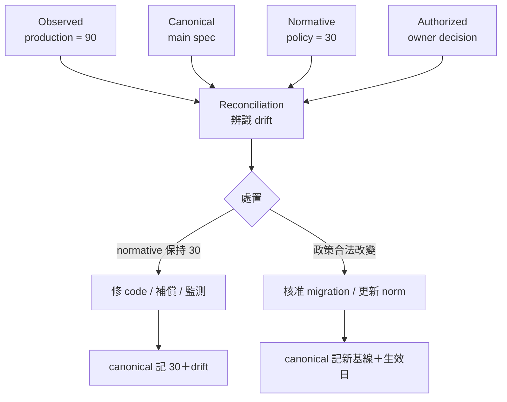

+++
title = "「Specs Are Truth」的升格風險：四種真值不能共用一個欄位"
date = "2026-09-16T06:45:04+08:00"
author = "梅乾"
draft = false
isCJKLanguage = true
description = "解構將主規格視為單一真理來源的升格風險。區分觀測值、基線值、規範值與授權值四種真值層，指出單一欄位必然隱匿漂移，必須透過對帳機制與責任狀態機暴露規格與現實的落差。"
tags = [
    "分析論述", # term:AnalyticalEssay
    "真值層", # term:TruthLayer
    "身分", # term:Identity
  ]
series = ["OpenSpec 的權威邊界：從文件一致到可撤銷承諾"]
[ai_info]
    [ai_info.generation]
        model = "GPT-5.6 Sol"
        agent = "Codex VS Code extension 26.908.40401"
    [ai_info.refinement]
        model = "Gemini 3.8 Flash"
        agent = "Antigravity IDE 2.5.5"
+++

<!--more-->

## 導言

退款政策正式規定 30 天，但 production 因設定錯誤接受 90 天內退款。工程師執行「讓 spec 與 reality 一致」，將 main spec 更新為 90 天。這個動作讓描述變準確，卻可能讓違規行為取得規範外觀。

截至 2026-09-16，OpenSpec 官方把 `openspec/specs/` 定義為目前共同同意之行為的 source of truth，並說明 archive 可把 change deltas 合併回 main specs（[OpenSpec Concepts](https://github.com/Fission-AI/OpenSpec/blob/main/docs/concepts.md)）。在設定管理語境中，這是合理設計：團隊需要一個 canonical location。

風險不是「truth」一詞哲學上不精確，而是 agent workflow 會把詞語轉成行動條件。若 canonical、observed、normative 與 authorized 四種狀態共用一個值，任何同步動作都可能把描述更新誤作正當性升格。

## 分析

### 四個問題需要四種真值

同一個「退款天數」至少存在四個不能互換的答案：

| **真值層**（Truth Layer） <!-- term:TruthLayer --> | 回答的問題 | 退款案例的值 | 來源 |
| :--- | :--- | :---: | :--- |
| observed | production 實際做什麼 | 90 | 可重現交易、log |
| canonical | 團隊主要文件怎麼記 | 90 或 30 | 被選定的 repository record |
| normative | 系統應該做什麼 | 30 | 合約、法規、核准政策 |
| authorized | 哪個決定已由誰接受 | 修 code 回 30 | 有權 owner 的具名決定 |

> [!IMPORTANT]
> **真值層** <!-- term:TruthLayer --> (Truth Layer): 將軟體工程中的真值狀態解耦為觀測值、基線值、規範值與授權值四個維度，嚴禁由單一資料欄位或主要文件位置推導出規範正當性或授權狀態，以精確捕捉並暴露各層間的漂移。 <!-- anchor:TruthLayer -->


Canonical 不是多餘的一層。它解決協作中的尋址問題：大家知道去哪裡找主要描述。它的危險只在於，被誤用來替另外三層作答。

四層的正確關係不是一條單向真值管線，而是需要對帳的狀態：



圖中沒有任何一條邊允許從 canonical 反推 authorized。文件可以記錄決定，不能因為自己是主要文件就創造決定。

### 單一欄位必然隱藏至少一種 drift

若 spec 只允許一個 `refund_days` 值，團隊必須在描述現況與保存規範之間二選一。寫 90 會隱藏 implementation drift；寫 30 會隱藏 observation drift。問題不是哪個數字比較真，而是資料模型無法同時表示兩個必要狀態。

令 $O$、$C$、$N$ 分別為 observed、canonical 與 normative value，可定義：

$$
D_{description}=[O\ne C],\qquad
D_{implementation}=[O\ne N],\qquad
D_{record}=[C\ne N]
$$

三個 drift bit 代表不同修復責任。將它們壓成一個 `consistent` 布林值，會失去「該修 code、修文件或重做決策」的方向資訊。

下面用完整狀態表走一次：

| 邊界輸入 | 關鍵判定 | 狀態轉移 | 允許宣稱 | 必要處置 |
| :--- | :--- | :--- | :--- | :--- |
| O=90, N=30, C=30 | O 是否符合 N | normal → implementation drift | 規格仍記核准政策 | 修 code、評估受影響交易 |
| O=90, N=30, C=90 | C 是否等於 N | drift → described drift | 文件忠實記現況 | 不得宣稱 90 合法 |
| O=30, N=14, C=30 | 新 norm 是否已生效 | baseline → migration pending | 政策已核准、尚未落地 | 記生效日與遷移計畫 |
| O=14, N=14, C=14 | 三層對帳 | pending → reconciled | 當前範圍內一致 | 持續 observation |

這張表拒絕把「同步完成」當成最終狀態。Reconciled 也只是某一時間與 scope 的暫時結論，未來觀察仍可使它失效。

### Archive 是 repository 事件，不是認識論奇蹟

官方命令文件說 archive 會檢查 artifacts 與 tasks、提示是否同步 delta，並把 change 移到 archive；未完成 tasks 只會觸發 warning，不阻擋 archive（[OpenSpec Commands](https://github.com/Fission-AI/OpenSpec/blob/main/docs/commands.md)）。這個行為很適合保存 change history，也明確說明 archive 的硬保證主要是 repository lifecycle。

若組織另有規則：「只有 policy owner 核准且 production evidence 通過才可 archive」，那是合理的外部治理。但不能從 OpenSpec archive 成功本身倒推出這些條件已經存在。

NIST 的 configuration change control 將變更拆成 proposal、影響考量、approve/disapprove、implementation、documentation 與後續 monitoring，而不是把歸檔當成單一步驟的全部含義（[NIST SP 800-171r3 `03.04.03](https://nvlpubs.nist.gov/nistpubs/SpecialPublications/800-171r3/NIST.SP.800-171r3.html)）。這個一手規範提供的不是 OpenSpec 必須照抄的流程，而是一個重要對照：同步、核准、實作與監測是不同事件。

### 用可執行狀態模型保留差異

以下模型不讓 canonical 值吞掉其他層，並對每種 drift 給出明確名稱：

```python
from dataclasses import dataclass

@dataclass(frozen=True)
class RequirementState:
    observed: int
    canonical: int
    normative: int
    authorized_action: str

    def drift(self) -> frozenset[str]:
        out = set()
        if self.observed != self.canonical:
            out.add("description")
        if self.observed != self.normative:
            out.add("implementation")
        if self.canonical != self.normative:
            out.add("record")
        return frozenset(out)

x = RequirementState(
    observed=90,
    canonical=90,
    normative=30,
    authorized_action="restore-to-30",
)
assert x.drift() == frozenset({"implementation", "record"})
assert x.canonical == x.observed
assert x.canonical != x.normative
```

這個 assert 鎖定最容易被語言掩蓋的狀態：canonical description 可以完全正確描述 production，同時在 normative 層錯誤。

### 「共同同意」也需要拆解

OpenSpec glossary 將 source of truth 定義為 current agreed-upon behavior。這裡的 agreed-upon 至少可能有三種含義：

1. 大家同意這是目前系統的描述。
2. 大家同意系統應該維持這個行為。
3. 有權角色已接受此行為造成的風險。

第一種是認知共識；第二種是規範共識；第三種是責任承接。它們可以同時成立，也可以分離。多人在 PR 上同意 production 確實接受 90 天退款，不代表他們有權改寫正式退款政策。

診斷矩陣用來識別「truth」是否跨層使用：

| 表面讀數／現象 | 底層病灶 | 脆弱反射 | 嚴密防衛 |
| :--- | :--- | :--- | :--- |
| spec matches reality | observed 與 canonical 對齊 | 宣稱行為因此正確 | 同時比較 normative |
| archive complete | repository lifecycle 完成 | 宣稱風險結案 | 分開 approval 與 observation |
| PR 已核准 | reviewer **身分**（Identity） <!-- term:Identity -->可見但權限範圍不明 | 宣稱政策已授權 | 驗證 role、scope、expiry |
| 所有人同意 | 共識種類未定型 | 把描述共識當規範共識 | 寫明同意的是 observation 或 norm |

> [!IMPORTANT]
> **身分** <!-- term:Identity --> (Identity): 系統元件在架構中宣告的核心職責與自我定位。 <!-- anchor:Identity -->


嚴密防衛不是禁止使用 source of truth，而是替 truth 加上 predicate：truth about what。

## 反思

最強反方是：軟體工程師普遍知道 source of truth 只表示 canonical record，沒有必要過度哲學化。若團隊既有成熟的 owner、policy 與 incident 流程，這個反方成立。術語本身未必造成傷害。

但 agent 的特性使歧義成本上升。人類會用組織常識補足「match reality」的邊界；agent 可能把它轉成機械目標，選擇讓 code 與 spec 任一方追上另一方。當自然語言成為自動化指令，原本依賴默契的限定詞需要被結構化。

第二個反方是，保留四層狀態會讓簡單變更過度工程。這也正確。私有函式改名沒有外部 norm，可能只需 canonical 與 observed。資料模型應允許缺省，而不是假裝所有 change 都受法規治理。

第三個邊界是 normative truth 也可能衝突。法規、合約、產品政策與技術限制未必給出單一答案。此時系統應保留來源、優先序與決策者，而不是把其中一份文件再命名為更高級的 truth。

## 實務對比

以下例子展示同一個動作在不同真值層 <!-- term:TruthLayer -->上的語意。

| 動作 | 脆弱解讀 | 精準解讀 | 後續控制 |
| :--- | :--- | :--- | :--- |
| update spec to 90 | 90 天已成正確政策 | canonical 現況更新為 90 | 標示 norm drift，等待決策 |
| archive change | 退款變更已完全完成 | change artifacts 已封存 | 仍需 production observation |
| owner approves | 所有爭議消失 | 指定角色在指定市場接受某決定 | 記 expiry、scope、rollback |
| tests pass | 90 天可用且合法 | implementation 符合測試 oracle | 另查政策與用戶影響 |

精準解讀不會削弱單一 canonical location。相反地，它使 main spec 能誠實承載「目前行為」「核准目標」與「兩者差距」，而不是被迫選一個數字遮住另一個事實。

## 結論

「Specs are truth」最安全、也最有用的含義，是 specs 提供團隊共同查找的 canonical behavior description。它不應自動吞併 production observation、normative obligation 與 authorized decision。

當四種真值共用一個欄位，同步就可能被誤作升格，archive 就可能被誤作結案。將 observed、canonical、normative 與 authorized 分開後，團隊才能知道差異是哪種 drift、由誰處理，以及何種證據可使它重新對帳。**可信的關鍵不是擁有唯一真值，而是每一種「真」都清楚回答自己的問題。**