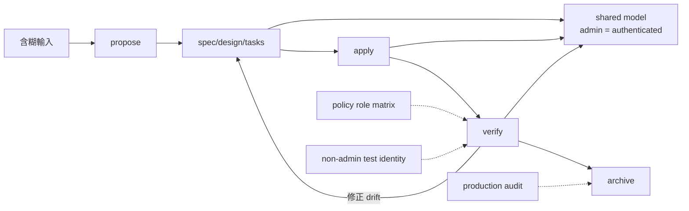

+++
title = "OPSX 的封閉驗證：全綠如何精確地實作錯誤前提"
date = "2026-09-16T06:45:05+08:00"
author = "梅乾"
draft = false
isCJKLanguage = true
description = "分析驗證拓撲中「一致性」與「外部有效性」的本質差異。透過租戶管理員權限漏洞案例，揭示當規格、設計與程式碼共享同一個錯誤前提時，封閉式驗證全綠只代表錯誤被更完整地實作，必須引入異源證據打破共同原因。"
tags = [
    "分析論述", # term:AnalyticalEssay
    "封閉驗證", # term:ClosedLoopVerification
    "外部有效性", # term:ExternalValidity
    "異源證據", # term:HeterogeneousEvidence
    "資訊增益", # term:InformationGain
    "外部裁決", # term:ExternalArbitration
  ]
series = ["OpenSpec 的權威邊界：從文件一致到可撤銷承諾"]
[ai_info]
    [ai_info.generation]
        model = "GPT-5.6 Sol"
        agent = "Codex VS Code extension 26.908.40401"
    [ai_info.refinement]
        model = "Gemini 3.8 Flash"
        agent = "Antigravity IDE 2.5.5"
+++

<!--more-->

## 導言

一個租戶管理員匯出功能經歷完整流程：proposal 清楚、spec 有 scenarios、design 描述 middleware、tasks 全勾、verify 無 critical、archive 成功。上線後才發現任何登入使用者都能匯出資料。事故調查沒有找到遺漏的 task；它找到的是一條被所有 artifacts 共同接受的錯誤等式：`tenant-admin = authenticated-user`。

這不是「驗證沒用」。相反地，驗證精確完成了它取得的任務：確認 implementation 與 artifacts 一致。問題在於 artifacts 與 code 共享同一前提，所以一致性愈高，只代表錯誤被實作得愈完整。

本文分析的是驗證拓撲，而不是特定工具的品質。核心問題不是 verify 有沒有跑，而是驗證結果是否取得了不由待驗系統與其規格共同生成的新資訊。

## 分析

### 先分清 verification 與 validation

NASA 的系統工程指引把 verification 描述為建立「符合 requirements」的證據，把 validation 描述為建立「系統符合 customer expectations」的證據；同一份 V&V plan 還要求標明責任與 change authority（[NASA Systems Engineering Handbook Appendix](https://www.nasa.gov/reference/system-engineering-handbook-appendix/)）。這個區分很適合解析 OPSX：

- Artifact-code verification 問：是否照目前 artifacts 做出來？
- External validation 問：artifacts 與結果是否解決正確問題，且符合真實限制？

截至 2026-09-16，OpenSpec 的 `/opsx:verify` 位於 expanded workflow，官方文件說它檢查 completeness、correctness、coherence，搜尋 codebase 中的實作證據，並把 issue 分成 CRITICAL、WARNING、SUGGESTION（[OpenSpec Commands](https://github.com/Fission-AI/OpenSpec/blob/main/docs/commands.md)）。這是一個實用的 implementation-artifact 檢查，不應因名稱相同就被等同於完整的外部 validation。

### 封閉迴圈的問題是共同原因

租戶權限案例可以畫成一個回饋系統：



實線迴圈對內部 drift 很敏感：漏做 task、code 未反映 design、scenario 沒有實作，都可能被抓到。虛線 oracle 若缺席，迴圈就對共同前提錯誤不敏感。這是一種 common-mode failure：多個看似獨立的檢查受同一原因支配。

### 「另一個 reviewer」不等於異源證據

驗證獨立性不是身份標籤，而是資訊性質。讓第二個 agent 在相同 prompt、相同 artifacts 與相同 tests 上重跑 review，可能提高錯字與局部缺陷的發現率，但不一定打破共同世界模型。

一個 oracle 是否異源，可用三個問題判斷：

1. 它是否由待驗 implementation 任意改寫？
2. 它是否由同一份起始假設推導？
3. 它失敗時，是否能迫使 artifact 或 code 改變，而不是被回寫成綠燈？

正式角色矩陣、真實測試帳號、外部契約、production telemetry 與 stakeholder 決定，通常比「換一個模型再讀一次」更具有異源性。

### 用權限事故走一次

以下表格把每一步能通過什麼、缺少什麼，放在同一條因果鏈上。

| 邊界輸入 | 內部判定 | 狀態轉移 | 為何仍全綠 | 能揭露錯誤的輸入 |
| :--- | :--- | :--- | :--- | :--- |
| admin 一詞 | proposal 有明確 actor | ambiguous → documented | 錯誤定義已被文字化 | policy owner 的角色定義 |
| spec scenario | 登入者可匯出 | documented → specified | scenario 本身承接錯誤 | tenant-admin matrix |
| middleware | session 存在即允許 | specified → implemented | code 完全符合 spec | non-admin 測試帳號 |
| verify | requirement 有 code、test | implemented → coherent | test oracle 同樣只查登入 | 負向授權 property |
| archive | artifacts/tasks 完整 | coherent → canonical | repository 條件已滿足 | audit log、canary、revoke gate |

這個走法顯示，外部 oracle 不必取代原檢查。它只需要在閉環中注入一個無法由錯誤前提自行生成的否證條件。

### 一致性與外部有效性是兩個座標

令 $C$ 表示 artifact-code coherence，$V$ 表示 external validity。可靠判讀應保留二維狀態，而不是合成一個 `quality` 分數：

| $C$ | $V$ | 狀態 | 工程含義 |
| :---: | :---: | :--- | :--- |
| 低 | 低 | 方向錯且實作也漂移 | 先釐清目標，再修一致性 |
| 低 | 高 | 目標有根據但尚未落地 | 修 code/artifacts 的對齊 |
| 高 | 低 | 自洽地做錯事 | 最高誤導風險，需外部否證 |
| 高 | 高 | 目前證據下較可信 | 仍受 scope、時間與覆蓋限制 |

最危險的是第三格，因為所有 repository 指標都可能漂亮。若 dashboard 只顯示 $C$，系統會把風險最高的狀態呈現成成功。

### 相關性決定證據增益

假設測試 $T_1,\dots,T_n$ 都由同一錯誤 spec 生成。直覺上「有很多測試」似乎提高信心，但其**資訊增益**（Information Gain） <!-- term:InformationGain -->取決於它們與原假設的相關性。用條件機率表示：

> [!IMPORTANT]
> **資訊增益** <!-- term:InformationGain --> (Information Gain): 系統在觀測到新資料或實驗結果後，不確定性（熵）減少的程度；變異為零意味著無法從中取得任何資訊增益。 <!-- anchor:InformationGain -->


$$
P(H\mid T_1=\cdots=T_n=\mathrm{pass})
$$

只有當 tests 在 $H$ 錯誤時有足夠失敗機率，pass 才能提高 $H$ 的可信度。若 $T_i$ 只是檢查 implementation 是否符合 $H$，則：

$$
P(T_i=\mathrm{pass}\mid H\ \mathrm{wrong},\ I\models H)\approx 1
$$

此時測試數量增加的是 implementation confidence，不是 requirement confidence。

最小程式可重現「coherence 綠、validation 紅」：

```python
spec_roles = {"authenticated"}       # 錯誤前提
implemented_roles = {"authenticated"}
tested_roles = {"authenticated"}
policy_roles = {"tenant-admin"}      # 異源 oracle

coherent = spec_roles == implemented_roles == tested_roles
externally_valid = implemented_roles == policy_roles

assert coherent
assert not externally_valid

# 負向帳號集合讓錯誤成為可執行反例。
all_roles = {"anonymous", "authenticated", "tenant-admin"}
must_deny = all_roles - policy_roles
assert "authenticated" in must_deny
```

程式的核心不是集合語法，而是 oracle 的來源。若 `policy_roles` 也從 spec 自動生成，最後兩行又會失去反駁能力。

### Validate、verify、archive 量到不同東西

CLI 結構檢查、OPSX verify 與 archive 常被口語合稱為「驗證」。截至觀測日期，官方 commands 文件對它們的定位不同：verify 對照 implementation 與 artifacts；archive 檢查完成狀態、提示同步並保存歷史；schema/CLI validation 則處理結構與規則。

下面的診斷矩陣限制每個綠燈能宣稱的範圍：

| 表面讀數／現象 | 底層機制 | 脆弱反射 | 嚴密防衛 |
| :--- | :--- | :--- | :--- |
| schema valid | 結構可解析 | 宣稱內容正確 | 只標為 structural validity |
| verify 無 critical | code-artifact coherence 較高 | 宣稱需求正確 | 接入 policy/runtime oracle |
| tasks 全勾 | checklist state 完成 | 宣稱行為已驗收 | task 引用可重現 evidence |
| archive 成功 | lifecycle 與保存動作完成 | 宣稱風險已關閉 | 保留 observation、expiry、revoke |

把讀數命名準確，就能保留 OPSX 的效率，同時防止組織把綠燈升格成它沒有量到的東西。

## 反思

最強反方是：OpenSpec verify 從未宣稱形式證明或 NASA 式 IV&V，把它批評成不完美 oracle 是錯置要求。這個反方完全成立。本文的結論因此不是 verify 不足，而是使用者不應把 artifact-code verification 單獨升格成 requirement validation。

第二個反方是，外部 oracle 也可能錯。Policy 會過期、stakeholder 會誤判、production telemetry 會偏。**異源證據**（Heterogeneous Evidence） <!-- term:HeterogeneousEvidence -->降低共同錯誤風險，不會產生絕對真理。可靠系統需要 provenance、scope 與可撤銷性，而不是尋找一個永不錯的權威。

> [!IMPORTANT]
> **異源證據** <!-- term:HeterogeneousEvidence --> (Heterogeneous Evidence): 來自與待驗系統及其規格生成過程相互獨立的真實觀測、政策約束或外部裁決來源，能打破封閉迴圈並提供具備反駁能力的新資訊。 <!-- anchor:HeterogeneousEvidence -->


第三個邊界是封閉問題。Compiler type checking、cryptographic hash、完整 corpus 的 round-trip property，可能提供足夠強且不可任意改寫的 oracle。同一 agent 執行它們仍能獲得有效新資訊。形式上的「不同人」不是必要條件。

第四個邊界是成本。所有 change 都要求獨立人員與 production experiment 會拖垮低風險工作。外部 oracle 的強度應隨 impact、irreversibility 與 uncertainty 調整。

## 實務對比

以下對比顯示如何保留 OPSX 每一步，而不讓其承擔超額語意。

| 現有步驟 | 只做封閉檢查 | 加入異源入口 | 可宣稱 |
| :--- | :--- | :--- | :--- |
| propose | 將 prompt 展成 artifacts | intent owner 確認 actor/scope | 目的在指定 scope 被確認 |
| apply | 依 tasks 實作 | 讀取正式 policy/test corpus | 實作不只複製 prompt |
| verify | 搜尋 code 對應與 scenarios | 執行負向帳號、runtime contract | coherence＋指定 oracle 通過 |
| archive | 同步 delta、保存 change | 核准 scope、rollback、到期日 | 可暫時升格，不等於永久結案 |

這種設計不要求推翻 OPSX。它只把內部一致性迴圈與**外部裁決**（External Arbitration） <!-- term:ExternalArbitration -->入口並列，讓兩者各自保留強項。

> [!IMPORTANT]
> **外部裁決** <!-- term:ExternalArbitration --> (External Arbitration): 由非同源機制（人類、測試、policy engine、權限邊界或獨立 verifier）授權信任狀態，而非讓生成系統自我批准。 <!-- anchor:ExternalArbitration -->


## 結論

OPSX 的封閉迴圈能快速提高 artifacts、code 與 tasks 的一致性。這是明確價值，不是需要消除的風險。然而同源 artifacts 與 tests 無法靠彼此同意證明共同前提正確；當起點錯誤時，高 coherence 甚至會讓錯誤更難被看見。

工程信心需要兩個座標：內部一致與外部有效。前者可由 verify 高效檢查；後者必須接入不受原始假設任意支配的 policy、stakeholder、runtime 或其他 oracle。**封閉迴圈能證明承諾被忠實實作；只有新資訊進場，才能檢驗那是否是值得實作的承諾。**