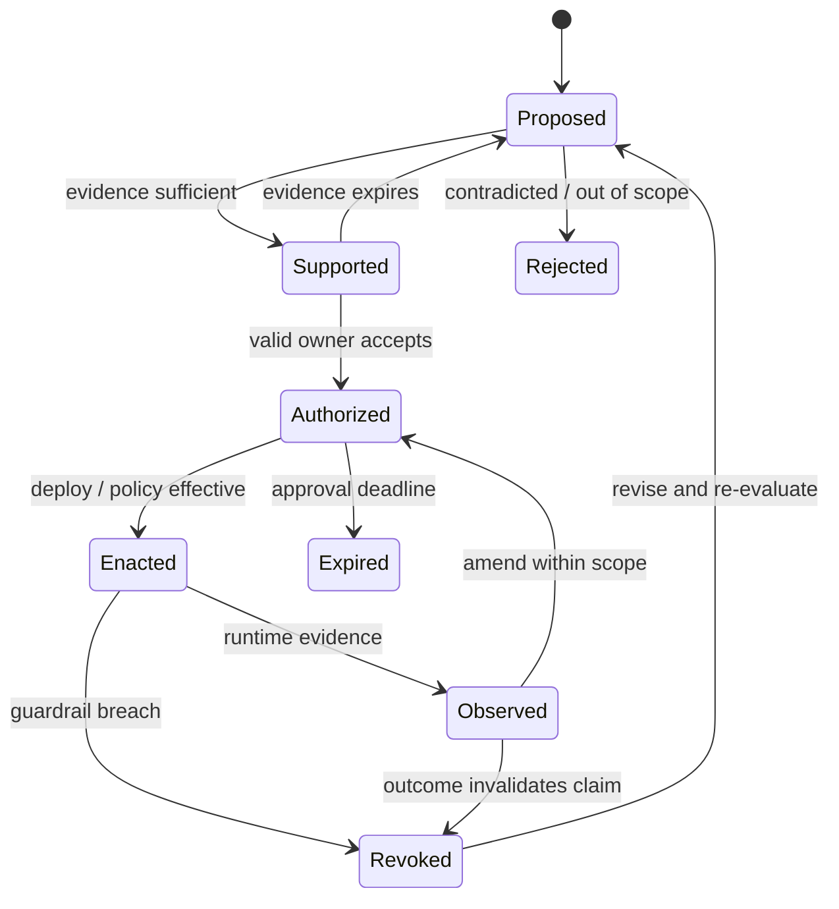

+++
title = "從完成旗標到升格狀態機：風險、證據、授權與撤銷"
date = "2026-09-16T06:45:06+08:00"
author = "梅乾"
draft = false
isCJKLanguage = true
description = "將二元完成旗標重構為可撤銷的主張升格狀態機。依影響範圍、不可逆性與不確定性三個維度建立相稱准入閘門，明確界定完成、授權、生效與驗證四個事件，並保留過期與撤銷退出路徑。"
tags = [
    "分析論述", # term:AnalyticalEssay
    "軟體工程與規格", # term:SoftwareEngineeringSpecifications
    "主張升格", # term:ClaimPromotion
    "升格狀態機", # term:PromotionStateMachine
    "不可逆性", # term:Irreversibility
    "不確定性", # term:Uncertainty
    "不變式", # term:Invariant
    "可證偽性", # term:Falsifiability
  ]
series = ["OpenSpec 的權威邊界：從文件一致到可撤銷承諾"]
[ai_info]
    [ai_info.generation]
        model = "GPT-5.6 Sol"
        agent = "Codex VS Code extension 26.908.40401"
    [ai_info.refinement]
        model = "Gemini 3.8 Flash"
        agent = "Antigravity IDE 2.5.5"
+++

<!--more-->

## 導言

一個「刪除離職員工資料」的 change 已完成所有 tasks。單元測試確認刪除 API 回傳成功，verify 也找得到 requirement 對應的 code。此時若直接 archive，可能仍遺漏三件事：備份是否同步刪除、法定保留期是否允許刪除、錯刪後是否可恢復。

這三件事不屬於同一種完成度。第一是系統範圍，第二是規範授權，第三是可逆性。用一個 `complete=true` 同時表示它們，會把資訊壓成無法治理的布林值。

本文把 change completion 重建成**主張升格**（Claim Promotion） <!-- term:ClaimPromotion -->狀態機。升格不是把文件宣布為 truth，而是在指定 scope、證據與期限下，允許某個決定暫時驅動現實；若觀察不符，系統必須能撤銷或修訂。

> [!IMPORTANT]
> **主張升格** <!-- term:ClaimPromotion --> (Claim Promotion): 在指定的適用範圍、證據強度與有效期限下，允許某個陳述或技術決定暫時驅動系統行為的狀態轉移機制；若執行觀測與預期不符，系統必須具備明確的撤銷或修訂路徑。 <!-- anchor:ClaimPromotion -->


## 分析

### 完成、核准、上線與有效是四個事件

先用資料刪除案例區分四種事件：

| 事件 | 它回答的問題 | 可能成立而其他不成立嗎 |
| :--- | :--- | :--- |
| implementation complete | code/tasks 是否完成 | 可以；尚未核准 |
| authorized | 有權角色是否接受 | 可以；尚未部署 |
| enacted | production 是否已套用 | 可以；效果未知 |
| validated | 結果是否符合目的與限制 | 可以暫時成立；未來仍可能失效 |

將這些事件合成 archive，會讓 repository lifecycle 替代 change lifecycle。更合理的模型是，archive 保存歷史；promotion gate 決定主張能否進入下一個責任狀態。

### 一個可撤銷的狀態機

主張至少經歷 proposed、supported、authorized、enacted、observed 五種正向狀態，並保留 rejected、expired、revoked 三種退出：



這個狀態機刻意沒有 `Done` 終點。對會影響 production 的承諾，「完成」通常只是責任轉移：從實作責任轉成運行觀察與撤銷責任。

### Gate 強度由三個風險維度決定

不應為每個 change 要求相同證據。可用三個維度決定最低 gate：

- 影響（impact）：錯誤會傷害多少使用者、資料或資產。
- **不可逆性**（Irreversibility） <!-- term:Irreversibility -->：發生後能否完整回復。
- **不確定性**（Uncertainty） <!-- term:Uncertainty -->：需求、環境與因果效果有多不清楚。

> [!IMPORTANT]
> **不可逆性** <!-- term:Irreversibility --> (Irreversibility): 評估系統變更或主張升格風險的核心維度，指狀態改變或操作執行後無法透過反向操作完全復原的程度，決定了准入閘門所需的最小外部證據與授權層級。 <!-- anchor:Irreversibility -->
> **不確定性** <!-- term:Uncertainty --> (Uncertainty): 估計值因抽樣與執行變異而帶有的波動範圍，是判定分數差異是否顯著的前提。 <!-- anchor:Uncertainty -->


這三者可形成序位風險，而不必假裝存在精確機率：

$$
R=\max(I,\ J,\ U)
$$

採 max 而非平均有實際理由：極高不可逆性 <!-- term:Irreversibility -->不應被低發生頻率或小開發量稀釋。這不是通用風險公式，而是一個保守 gate selector。

| 風險級 | 典型變更 | 最小 evidence | Authority | 上線後控制 |
| :--- | :--- | :--- | :--- | :--- |
| 低 | 私有重構、可回滾 UI | 自動測試一種 | 工程 owner 可自核 | 一般 rollback |
| 中 | API 行為、有限資料修改 | 測試＋領域 review | service owner | canary、期限內檢查 |
| 高 | 權限、付款、大量刪除 | 兩種**異源證據**（Heterogeneous Evidence） <!-- term:HeterogeneousEvidence -->＋演練 | producer 以外的 owner | 持續監測、kill switch |
| 未知且不可逆 | 未知資料範圍的刪除 | 不足以升格 | 不得以 approval 補洞 | 先盤點或縮小 scope |

> [!IMPORTANT]
> **異源證據** <!-- term:HeterogeneousEvidence --> (Heterogeneous Evidence): 來自與待驗系統及其規格生成過程相互獨立的真實觀測、政策約束或外部裁決來源，能打破封閉迴圈並提供具備反駁能力的新資訊。 <!-- anchor:HeterogeneousEvidence -->


最後一列很重要。授權不是證據不足時的萬用 bypass；有權角色可以接受已知殘餘風險，不能把未知範圍變成已知。

### 用資料刪除走一次

下面將一個 change 從輸入推到處置，顯示每個 gate 新增了什麼資訊。

| 邊界輸入 | 關鍵判定／**不變式**（Invariant） <!-- term:Invariant --> | 狀態轉移 | 若失敗 | 最終處置 |
| :--- | :--- | :--- | :--- | :--- |
| 「刪除離職員工資料」 | scope 是否含 primary、replica、backup | proposed → scoped | 保持 proposed | 列清資料位置 |
| retention policy | 是否已過法定保留期 | scoped → supported | rejected/deferred | 不執行刪除 |
| dry run manifest | 刪除集合是否可審查 | supported → reviewable | revise | 固定 hash 與筆數 |
| owner＋operator 核准 | producer 與 approver 是否分離 | reviewable → authorized | blocked | 具名接受殘餘風險 |
| staged deletion | 是否有 recovery window | authorized → enacted | rollback | 先 quarantine |
| post-run audit | 實際刪除集合是否等於 manifest | enacted → observed | revoke/incident | 完成或補救 |

> [!IMPORTANT]
> **不變式** <!-- term:Invariant --> (Invariant): 系統在任何合法狀態下都必須成立的斷言，是把評估規則寫成可執行檢查的基本單位。 <!-- anchor:Invariant -->


這張表中的每一關都改變主張內容，而不是只增加簽名。例如 dry run 將「可能刪哪些」轉成固定 manifest；post-run audit 則提供執行後的新觀察。

### Authority 必須有角色、範圍與期限

`human_reviewed: true` 幾乎沒有治理資訊。完整 authorization 至少需要：

$$
a=\langle principal,\ role,\ claim,\ scope,\ issued\_at,\ expires\_at\rangle
$$

若缺少 scope，核准可能被挪用到另一市場或另一資料集；若缺少 expiry，昨日針對舊架構的判斷會永久有效；若 principal 與 producer 在高風險變更中相同，review 可能只是自我確認。

NIST 對 separation of duties 的要求是辨識需要分離的職責並用授權支持；其說明特別列出 assessment、programming、configuration management 等角色的分離（[NIST SP 800-171r3 `03.01.04](https://nvlpubs.nist.gov/nistpubs/SpecialPublications/800-171r3/NIST.SP.800-171r3.html)）。這不代表每個軟體 change 都要雙人核准，而是高風險 gate 若宣稱獨立，就應在權限上真的分離。

### 可執行 promotion policy

以下模型把風險、異源 evidence、角色分離、rollback 與期限放進同一個純函式：

```python
from dataclasses import dataclass
from datetime import date

@dataclass(frozen=True)
class Candidate:
    risk: str
    producer: str
    approver: str
    evidence: frozenset[str]
    rollback: str
    expires: date

def promotable(x: Candidate, today: date) -> bool:
    if not x.rollback or x.expires < today:
        return False
    if x.risk == "high":
        return (
            x.producer != x.approver
            and len(x.evidence) >= 2
            and {"policy", "dry-run"} <= x.evidence
        )
    return len(x.evidence) >= 1

today = date(2026, 9, 16)
good = Candidate(
    "high", "agent", "data-owner",
    frozenset({"policy", "dry-run", "restore-drill"}),
    "quarantine-24h", date(2026, 9, 30),
)
bad = Candidate(
    "high", "agent", "agent",
    frozenset({"agent-review"}),
    "", date(2026, 9, 30),
)

assert promotable(good, today)
assert not promotable(bad, today)
```

這段程式沒有聲稱集合大小等於證據品質。它鎖定的是最低結構不變式 <!-- term:Invariant -->：高風險 change 不能只有同源 review、不能缺 rollback，也不能使用過期核准。

### Revoke 不是失敗處理附錄，而是升格契約的一半

若 promotion 沒有 revoke，authorization 就被誤當成永久真理。升格時應同時寫下撤銷條件，例如：

- 非管理員出現一次成功匯出，即停用 endpoint。
- 刪除 manifest 與實際筆數不符，即停止下一批。
- 錯誤率超過 baseline 指定幅度，即 rollback。
- Approval 過期而未重新評估，即降回 proposed。

這些條件把「我們相信它」改成「在這些可觀察條件未被破壞前，我們允許它生效」。可靠性由**可證偽性**（Falsifiability） <!-- term:Falsifiability -->與可撤銷性共同提供。

> [!IMPORTANT]
> **可證偽性** <!-- term:Falsifiability --> (Falsifiability): 宣稱必須事先指明何種觀測結果會推翻它；缺乏反駁條件的評估無法構成證據。 <!-- anchor:Falsifiability -->


診斷矩陣可以辨識表面治理與真正 gate：

| 表面讀數／現象 | 底層病灶 | 脆弱反射 | 嚴密防衛 |
| :--- | :--- | :--- | :--- |
| 有 approval 欄位 | principal/role/scope 不明 | 把布林值當授權 | 驗證**身分**（Identity） <!-- term:Identity -->、角色、期限 |
| evidence 有兩份 | 兩份都由同一 spec 生成 | 用數量假裝獨立 | 要求 evidence kind 與 provenance |
| 有 rollback 文字 | 未演練、無操作能力 | 把計畫當能力 | restore drill 或 feature flag |
| change 已 archive | observation 尚未開始 | 把保存當結案 | 保留 enacted/observed/revoked 狀態 |

> [!IMPORTANT]
> **身分** <!-- term:Identity --> (Identity): 系統元件在架構中宣告的核心職責與自我定位。 <!-- anchor:Identity -->


真正的 gate 會拒絕某些狀態；只產生更多欄位而沒有拒絕器，仍是文件儀式。

## 反思

第一個反方是：狀態機太重，會破壞 OpenSpec 的 minimal ceremony。若所有 change 都走高風險路徑，批評成立。正確設計應讓低風險 change 在一個測試與可回滾條件下快速升格，只讓高 impact、低 reversibility 或高 uncertainty 觸發更多 gate。

第二個反方是，分離 producer 與 approver 不一定提高品質。若第二人缺乏脈絡，只會機械按鈕，獨立性是空的。因此 separation of duties 必須配合資訊與權限；形式上的兩個帳號不是目的。

第三個邊界是緊急事故。Production incident 可能無法等待完整 evidence。Break-glass 路徑可以存在，但它應縮小 scope、設定短 expiry、強制事後 review，並保留誰承擔風險。例外不是跳過狀態機，而是另一條明示且更短命的狀態轉移。

第四個邊界是未知未知。再完整的 gate 也只能檢查已表達的風險。持續 observation 與 revoke 正是為此存在；治理若在 deploy 時終止，就把未知未知留給事故發現。

## 實務對比

以下對比顯示，風險相稱不等於所有變更套相同流程。

| 情境 | 過度薄弱 | 過度沉重 | 風險相稱 |
| :--- | :--- | :--- | :--- |
| 私有函式改名 | 無測試直接合併 | 雙 owner＋canary | 單元測試＋一般 rollback |
| 租戶權限修改 | agent 自核後 archive | 全公司 change board | policy owner＋負向測試＋audit |
| 大量資料刪除 | tasks 全勾即執行 | 永不允許刪除 | manifest＋保留期＋quarantine＋restore |
| 緊急安全修補 | 跳過所有紀錄 | 等完整常規流程 | break-glass＋短 expiry＋事後審核 |

好 gate 的衡量方式不是表單多寡，而是它是否在風險真正上升的地方要求新證據與新責任。

## 結論

Change completion 不能由單一旗標承擔。Implementation complete、authorized、enacted 與 validated 是不同事件；它們需要不同證據，也把責任交給不同角色。

風險相稱的**升格狀態機**（Promotion State Machine） <!-- term:PromotionStateMachine -->讓低風險工作維持輕量，讓高風險工作必須具備異源 evidence、有效 authority、rollback、expiry 與 observation。最重要的是，它把 revoke 寫進承諾本身。**可信的決定不是被宣布為永久真理，而是在清楚範圍內暫時生效，並在反例出現時確實能被撤回。**

> [!IMPORTANT]
> **升格狀態機** <!-- term:PromotionStateMachine --> (Promotion State Machine): 取代二元完成旗標的治理模型，定義主張從提議、證據支持、授權、生效到觀測的生命週期狀態，並提供對應的拒絕、過期與撤銷退出路徑。 <!-- anchor:PromotionStateMachine -->