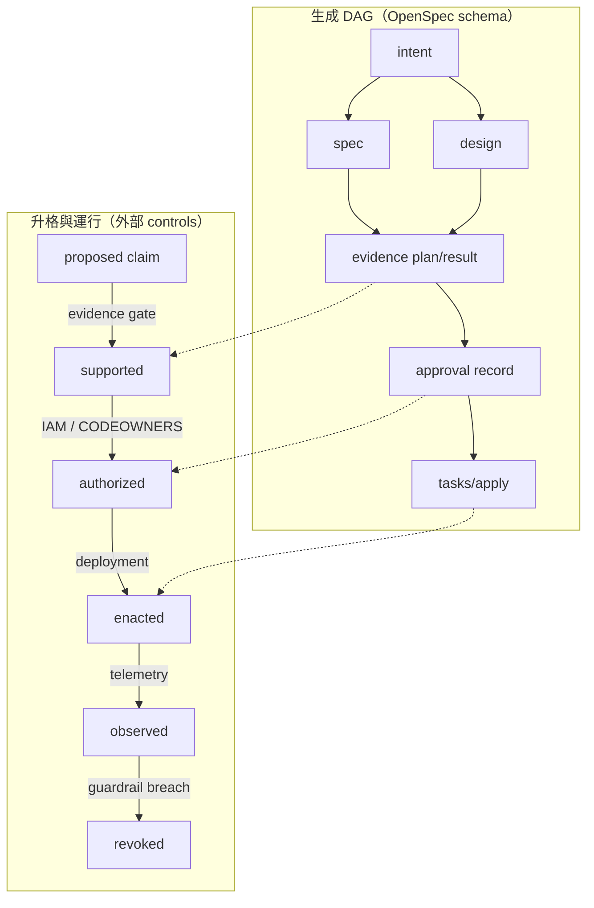

+++
title = "把 OpenSpec 重建為變更帳本：Typed Artifacts、證據邊與可撤銷升格"
date = "2026-09-16T06:45:07+08:00"
author = "梅乾"
draft = false
isCJKLanguage = true
description = "保留 OpenSpec 差量規格與工作夾優勢，將其定位重建為記錄責任與承諾的變更帳本。分離生成相依與升格相依兩張圖，結合型別化產物、異源證據與外部控制，實現嚴謹的可撤銷升格治理。"
tags = [
    "分析論述", # term:AnalyticalEssay
    "軟體工程與規格", # term:SoftwareEngineeringSpecifications
    "變更帳本", # term:ChangeLedger
    "認識論角色", # term:EpistemologicalRole
    "外部有效性", # term:ExternalValidity
    "擴充點", # term:ExtensionPoint
  ]
series = ["OpenSpec 的權威邊界：從文件一致到可撤銷承諾"]
[ai_info]
    [ai_info.generation]
        model = "GPT-5.6 Sol"
        agent = "Codex VS Code extension 26.908.40401"
    [ai_info.refinement]
        model = "Gemini 3.8 Flash"
        agent = "Antigravity IDE 2.5.5"
+++

<!--more-->

## 導言

前提不是「OpenSpec 失敗，所以另造平台」。它最有價值的能力正適合作為重建基礎：每個 change 有獨立資料夾、行為差異以 delta 表示、artifact graph 可客製、agent 能依明確上下文工作。真正需要縮小的是權威宣稱，而不是資料模型本身。

重建後的定位是**變更帳本**（Change Ledger） <!-- term:ChangeLedger -->：記錄誰提出什麼、哪種行為要改、採取何種設計、什麼 evidence 支持或反駁、誰在何種 scope 核准、上線後發生什麼，以及何時必須撤銷。帳本保存與約束承諾，但不假裝 Markdown 自己創造正當性。

> [!IMPORTANT]
> **變更帳本** <!-- term:ChangeLedger --> (Change Ledger): 將變更規格視為承諾與責任的審計記錄器，負責保存提案、差量、證據鏈、授權範圍與撤銷條件，而非將文件自身視為能無中生有創造正當性的真理來源。 <!-- anchor:ChangeLedger -->


截至 2026-09-16，OpenSpec 官方支援 project-local custom schemas。團隊可 fork `spec-driven`，新增 artifacts、templates 與 dependencies；schema 位於 repository 中並可版本控制（[OpenSpec Customization](https://github.com/Fission-AI/OpenSpec/blob/main/docs/customization.md)）。因此這個方案可以沿用官方**擴充點**（Extension Point） <!-- term:ExtensionPoint -->，但簽章、身份、CI refusal 與 production control 仍需外部系統執行。

> [!IMPORTANT]
> **擴充點** <!-- term:ExtensionPoint --> (Extension Point): 系統架構中預留供新增變體或功能的結構化介面，通常為收斂性任務的承載體。 <!-- anchor:ExtensionPoint -->


## 分析

### 重建目標：讓不同主張不能共用完成旗標

預設 artifacts 主要按工作分工：proposal、specs、design、tasks。重建增加的不是更多散文，而是不同**認識論角色**（Epistemological Role） <!-- term:EpistemologicalRole -->：

> [!IMPORTANT]
> **認識論角色** <!-- term:EpistemologicalRole --> (Epistemological Role): 指工程文件中各組成部分在知識證成鏈條中所承擔的功能定位（如事實觀察、意圖陳述、規範約束或授權憑證），各角色必須由對應的外部證據與授權者支撐，不能由文字容器形式直接替代。 <!-- anchor:EpistemologicalRole -->


| Artifact | 核心問題 | 合法 producer | 升格條件 | 不能宣稱 |
| :--- | :--- | :--- | :--- | :--- |
| intent | 為誰解決什麼 | stakeholder；agent 可草擬 | owner 確認 scope | 效益已證實 |
| spec | 外部可觀察行為 | agent／engineer | 可驗收、連到 intent | 行為具政策正當性 |
| design | 如何實作、放棄什麼 | technical owner | trade-off 與 rollback 明示 | 需求已驗證 |
| evidence | 什麼支持或反駁 | tests、runtime、review | provenance 可追、種類合規 | 決定已授權 |
| approval | 誰接受哪項殘餘風險 | 有權 principal | role、scope、expiry 有效 | 結果一定成功 |
| observation | 上線後實際發生什麼 | runtime／operator | 不可由 proposal 代填 | 規範自動改變 |
| revoke/amend | 何時撤回或重啟 | gate／owner | 明示 trigger | 歷史被抹除 |

每一列都有「不能宣稱」，因為治理最重要的功能之一是阻止語意溢出。

### 兩張圖：生成 DAG 與升格圖

若只在原 artifact graph 上增加節點，仍容易把 dependency 當 approval。重建應明確保留兩張圖：

1. 生成 DAG：agent 產生下一份 artifact 需要哪些上下文。
2. 升格圖：哪種 evidence 與 authority 允許 claim 進入下一狀態。



實線生成邊可由 custom schema 表示；虛線跨到升格圖時，需要 CI、Git hosting、IAM、test runner 與 deployment platform。若只寫 template 而沒有拒絕器，第二張圖仍然不存在。

### 最小 custom schema 不是七份長文

低風險 change 不需要七個獨立文件。**結構合約**（Schema） <!-- term:Schema --> 可以用 profile 或條件，把最小路徑壓成三個 typed records：

> [!IMPORTANT]
> **結構合約** <!-- term:Schema --> (Schema): 定義資料欄位、型別與排版限制的強型別規格定義，用於強制約束模型產出的格式。 <!-- anchor:Schema -->


- `intent.md`：問題、owner、scope、可撤回假設。
- `specs/**`：可觀察行為與負向 scenarios。
- `evidence.yaml`：測試結果、provenance、risk、rollback。

只有當 risk 上升時，才展開 design、approval、observation 與 revoke。OpenSpec 官方 schema 本來就允許自訂 artifacts 與 `requires`（[OpenSpec OPSX](https://github.com/Fission-AI/OpenSpec/blob/main/docs/opsx.md)）；progressive rigor 可以實現在 schema 選擇與外部 gate，而非要求每個 change 都填同樣模板。

### 以租戶資料匯出走完整閉環

這個案例同時包含 intent、policy、implementation 與運行風險，足以檢驗重建是否只是文件換皮。

| 邊界輸入 | 關鍵 artifact／判定 | 狀態轉移 | 外部控制 | 最終結果 |
| :--- | :--- | :--- | :--- | :--- |
| 「管理員可匯出」 | intent 標出 actor 未定義 | ambiguous → proposed | product owner 確認 use case | 不先生成權限細節 |
| 正式 role matrix | spec 限定 tenant-admin | proposed → supported | policy provenance check | 產生正、負 scenarios |
| middleware design | rollback 與 audit event | supported → implementable | security review | 避免只查登入 |
| test evidence | tenant-admin allow；member deny | implemented → evidenced | CI 以真實角色 fixture 執行 | 同源 scenario 外另有 policy oracle |
| approval | security owner＋service owner | evidenced → authorized | CODEOWNERS/IAM | 限定 tenant scope 與 expiry |
| canary/export logs | 無 member 成功事件 | authorized → observed | runtime guardrail | 符合則擴大 rollout |
| member 成功事件 | revoke trigger 命中 | observed → revoked | kill switch | 停止 endpoint、啟動 incident |

每一步都新增無法由前一步任意捏造的資訊或能力。這才是閉環，而不是 artifacts 從 proposal 一路互相確認。

### Provenance 是證據可審查的前提

`evidence: tests passed` 幾乎沒有資訊。Evidence 至少需要：

$$
e=\langle kind,\ producer,\ activity,\ subject,\ result,\ timestamp,\ digest\rangle
$$

W3C PROV 將 entity、activity、agent 與 derivation 分開，並明示 provenance 可支援對品質、可靠性與可信度的評估（[W3C PROV Overview](https://www.w3.org/TR/prov-overview/)）。實務上不必完整導入 PROV ontology；但 test report 應至少能回答誰執行、對哪個 commit/config、使用哪個 fixture、結果與 digest 為何。

Provenance 不使證據為真。它使證據可重現、可撤銷，也使兩份 evidence 是否其實來自同一來源變得可見。

### 可執行 ledger gate

以下最小模型把 artifact existence 與 promotion policy 分開。前者由 schema/CLI 檢查，後者由 CI gate 執行：

```python
from dataclasses import dataclass

@dataclass(frozen=True)
class Ledger:
    risk: str
    artifacts: frozenset[str]
    evidence_kinds: frozenset[str]
    producer: str
    approver: str
    rollback: str
    observation: str

BASE = {"intent", "spec", "evidence"}
HIGH = BASE | {"design", "approval"}

def structurally_complete(x: Ledger) -> bool:
    required = HIGH if x.risk == "high" else BASE
    return required <= x.artifacts

def promotable(x: Ledger) -> bool:
    if not structurally_complete(x) or not x.rollback:
        return False
    if x.risk == "high":
        return (
            x.producer != x.approver
            and {"policy", "negative-test"} <= x.evidence_kinds
        )
    return bool(x.evidence_kinds)

good = Ledger(
    "high",
    frozenset({"intent", "spec", "design", "evidence", "approval"}),
    frozenset({"policy", "negative-test", "canary"}),
    "agent", "security-owner", "disable-export", "audit-log",
)
bad = Ledger(
    "high",
    frozenset({"intent", "spec", "design", "evidence", "approval"}),
    frozenset({"agent-review"}),
    "agent", "agent", "", "",
)

assert structurally_complete(good) and structurally_complete(bad)
assert promotable(good)
assert not promotable(bad)
```

最重要的 assert 是 `structurally_complete(bad)`：它保留「結構完整但不得升格」這個狀態。若系統無法表示它，就會再次把 artifact completeness 當成 authority。

### External controls 的責任分配

Custom schema 能表達文件與 dependencies，不能單獨保證組織控制。重建必須把責任放在能執行的層：

| 控制 | 合適執行者 | 結構合約 <!-- term:Schema --> 的角色 | 失敗時應做什麼 |
| :--- | :--- | :--- | :--- |
| artifact shape | OpenSpec CLI / CI | 定義 required artifacts | 阻擋 merge |
| identity/role | Git hosting / IAM | 保存 approver reference | 拒絕無權簽署 |
| evidence execution | CI / test platform | 保存 command、result、digest | 標記 evidence invalid |
| deployment | CD platform | 連結 authorized change | 拒絕未升格部署 |
| observation/revoke | telemetry / feature flag | 保存 guardrail 與事件 | 自動 rollback 或告警 |

這個分工避免「因為 schema 裡有 approval.yaml，所以治理已完成」的假象。Artifact 是控制面的契約；真正的執行面必須能拒絕。

### 漸進導入，而非一次重寫

重建可以分三層導入：

1. 語意層：先把命令輸出改名精準，例如「artifact verification passed」而非「change validated」。
2. 資料層：為高風險 change 新增 intent/evidence/approval/observation 欄位與 provenance。
3. 執行層：用 CI、CODEOWNERS、deployment gate 與 runtime guardrail 強制 promotion policy。

第一層幾乎沒有流程成本，卻能阻止過度宣稱。第二層提高可審查性。第三層才建立真正拒絕器。團隊不必在沒有執行能力時，先堆出大量貌似治理的模板。

下面的診斷矩陣用於檢查重建是否退化成文件增生：

| 表面讀數／現象 | 底層病灶 | 脆弱重建 | 嚴密重建 |
| :--- | :--- | :--- | :--- |
| 多了 evidence.md | evidence 無 provenance | agent 再摘要一次 | CI 產生 result＋digest |
| 多了 approval.yaml | role 未驗證 | 任意人填名字 | IAM/CODEOWNERS 驗證 |
| schema dependencies 更多 | generation 邊冒充升格邊 | 有檔案即可下一步 | promotion gate 可拒絕 |
| archive 後有 observation | observation 可由 proposal 代填 | 預測當成結果 | runtime/operator 產生 |
| 有 rollback 欄位 | rollback 無能力 | 寫「可回滾」 | feature flag／restore drill |

嚴密重建的判準不是 artifacts 數量，而是每個關鍵欄位是否連到不同來源與可執行控制。

## 反思

第一個反方是，這套模型可能把輕量 OpenSpec 變成 change-management suite。若所有變更都走完整路徑，確實會破壞其價值。解法不是刪掉治理，而是按風險選 schema：低風險使用 intent/spec/evidence；高風險才要求角色分離、canary 與 revoke。

第二個反方是，欄位與 CI 仍可被敷衍。這也成立。結構只能保證資料存在、型別相符與權限受限，不能保證人誠實、測試充分或未知風險不存在。Observation 與 revoke 必須保留，因為任何 pre-deployment gate 都有盲區。

第三個邊界是外部系統整合成本。Git hosting、IAM 與 deployment platform 可能無法提供統一 API。此時 OpenSpec 可以先保存連結與人工證據，但不應把人工流程描述成機械保證。

第四個邊界是 main specs 的角色。它們仍可作為 canonical behavior description；重建不要求把每個歷史觀察塞進主規格。Active change ledger 保存 evidence、approval 與 drift，main specs 保存目前對外行為，兩者透過明確 promotion event 銜接。

## 實務對比

將重建前後並列，可看出方案保留了哪些 OpenSpec 優點。

| 原有路徑 | 重建後 | 保留的能力 | 新增的限制 |
| :--- | :--- | :--- | :--- |
| proposal 展開全部 artifacts | agent 可草擬，intent owner 確認 scope | 快速起草、單一 change folder | 目的不能自我授權 |
| verify 比對 artifacts 與 code | 保留 verify，再接異源 oracle | 快速抓 drift | 綠燈不等於外部有效 |
| archive 同步 delta | archive 保存歷史；promotion 另行判定 | delta merge、可追溯歷史 | 不以目錄移動關閉風險 |
| custom schema 定義 dependencies | 生成 DAG＋外部升格圖 | 官方擴充點 <!-- term:ExtensionPoint --> | dependency 不冒充 approval |

這不是在 OpenSpec 外面再造一個互不相干的流程，而是把它定位為可審查的控制面，並讓真正有能力的系統執行身份、證據與 deployment gate。

## 結論

OpenSpec 最值得保留的核心不是「spec 驅動一切」，而是 change folder、delta、artifact graph 與可客製 schema。把它重建為變更帳本 <!-- term:ChangeLedger -->後，intent、behavior、design、evidence、approval、observation 與 revoke 各有自己的 producer、來源與升格條件。

可靠重建需要兩張圖：schema 管理生成依賴，promotion policy 管理證據與權威。前者讓 agent 高效工作；後者阻止 artifacts 自我證成。**衝突封存**（Archive） <!-- term:Archive --> 完成 canonicalization 與保存，不終結責任。**好的治理不靠增加散文，而靠型別、來源、權限與可撤銷控制，限制每份文件到底有資格宣稱什麼。**

> [!IMPORTANT]
> **衝突封存** <!-- term:Archive --> (Archive): 這是 SDD 治理框架中的三層防禦之一，旨在記錄版本歷史與衝突狀態，但在底層模型發生無聲漂移時，由於缺乏清晰分界點，難以有效捕捉連續的品質滑坡。 <!-- anchor:Archive -->
