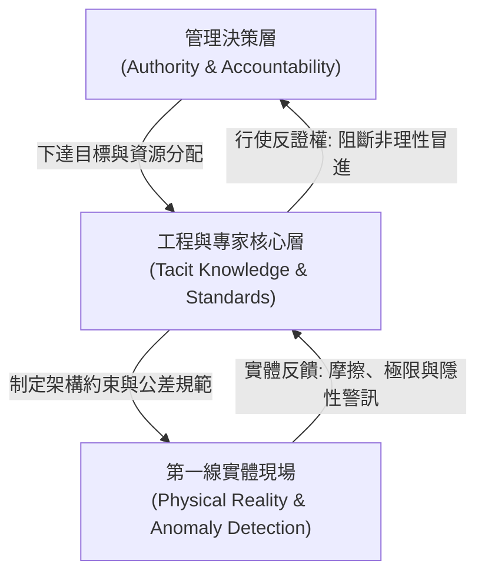
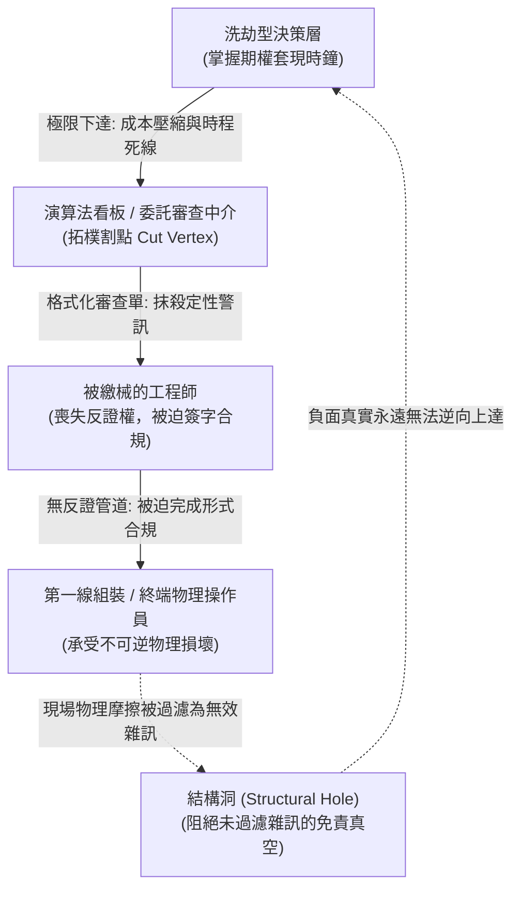

+++
title = "合法的洗劫：論高歌離席者的責任洗錢、拓樸撕裂與期權套現"
date = "2026-09-18T06:23:01+08:00"
author = "梅乾"
draft = false
isCJKLanguage = true
description = "當經理人任期與期權歸屬遠短於工程系統崩潰潛伏期，削減安全冗餘會成為合法的個人財富策略。本文以波音 737 MAX 為標本，證明洗劫協定如何透過拓樸割點與商業判斷法則完成免責套現。"
tags = [
    "分析論述", # term:AnalyticalEssay
    "AI 經濟與社會", # term:AiEconomics
    "受託人義務", # term:FiduciaryDuty
    "代理理論", # term:AgencyTheory
    "股票期權", # term:StockOptions
    "商業判斷法則", # term:BusinessJudgmentRule
    "割點", # term:CutVertex
    "結構約束", # term:StructuralConstraint
  ]
series = ["演算法資本主義：權力、代理與合法掠奪的拓樸"]
[ai_info]
    [ai_info.generation]
        model = "Gemini 3.8 Flash"
        agent = "Antigravity IDE 2.5.5"
    [ai_info.refinement]
        model = "Grok 4.6"
        agent = "GitHub Copilot Chat v0.66.0"
+++

<!--more-->

## 導言

在古典公司治理與契約理論中，高階經理人（Agents）的存在正當性完全依附於其對公司與全體利害關係人的「**受託人義務**（Fiduciary Duty） <!-- term:FiduciaryDuty -->」。這項義務在法理上包含兩條不可分割的支柱：**注意義務**（Duty Of Care） <!-- term:DutyOfCare -->與**忠實義務**（Duty Of Loyalty） <!-- term:DutyOfLoyalty -->。自 Adolf Berle 與 Gardiner Means 於 1932 年提出《現代公司與私有財產》確立所有權與經營權分離以來，治理學界的核心命題始終是如何化解委託人（股東/利害關係人）與代理人（職業經理人）之間的利益衝突。

> [!IMPORTANT]
> **受託人義務** <!-- term:FiduciaryDuty --> (Fiduciary Duty): 經理人對公司與利害關係人負有的注意與忠實義務，是古典公司治理中代理人正當性的法理基礎。 <!-- anchor:FiduciaryDuty -->
> **注意義務** <!-- term:DutyOfCare --> (Duty Of Care): 受託人須以合理謹慎作成知情決策的義務。 <!-- anchor:DutyOfCare -->
> **忠實義務** <!-- term:DutyOfLoyalty --> (Duty Of Loyalty): 受託人不得將個人利益置於公司利益之上的義務。 <!-- anchor:DutyOfLoyalty -->

1970 年代 Michael Jensen 與 William Meckling 開創性地提出**代理理論**（Agency Theory） <!-- term:AgencyTheory -->，西方資本市場隨後開出的處方是將經理人薪酬與股價深度綁定，特別是以**股票期權**（Stock Options） <!-- term:StockOptions -->作為解決代理問題的靈丹妙藥。其底層假設是：如果經理人成為準股東，其個人物質回報便會與企業組織的長期實體存續（Going Concern）自然重合。

> [!IMPORTANT]
> **代理理論** <!-- term:AgencyTheory --> (Agency Theory): 以委託人與代理人間的利益衝突為核心，解釋經理人誘因如何偏離組織長期存續。 <!-- anchor:AgencyTheory -->
> **股票期權** <!-- term:StockOptions --> (Stock Options): 將經理人薪酬與股價綁定的激勵工具；當歸屬週期短於系統崩潰潛伏期時，會打開跨期套現空間。 <!-- anchor:StockOptions -->

然而，當現代企業治理全面金融化，並將內部工程運作深度包裝上複雜技術、自動化流程與演算法外衣時，這項受託契約發生了災難性的拓樸突變。

一個實體組織在物理世界上運作時，其安全冗餘、隱性工藝、物理公差與**糾錯緩衝**（Slack） <!-- term:Slack -->本質上是高度連續且昂貴的資產。維護這些資產需要長期的**沉沒成本**（Sunk Cost） <!-- term:SunkCost -->投入，無法在季度財報上產出立竿見影的暴利，反而會被追求資本效率的投行視為「待切除的沉睡資產」。當經理人任期、期權歸屬時鐘與實體工程系統的生命週期產生巨大錯配時，制度便製造出了一種惡質誘因：經理人可以合法地將組織的實體抗震能力變現，轉化為個人的短期股票期權 <!-- term:StockOptions -->溢價。

> [!IMPORTANT]
> **糾錯緩衝** <!-- term:Slack --> (Slack): 用以吸收極端風險的安全冗餘與隱性工藝存量。 <!-- anchor:Slack -->
> **沉沒成本** <!-- term:SunkCost --> (Sunk Cost): 指已經付出且無法收回的成本（如時間、精力或 token 費用）。在決策中，人們常因不願浪費已投入的資源而繼續追加投入，導致非理性決策。 <!-- anchor:SunkCost -->

這裡要證明的是：在特定的組織拓樸撕裂與合約時間軸錯配下，摧毀一家企業的實體工程基礎與長期生存能力，並非經理人的「能力不足」或「戰略誤判」，而是經理人在精確計算個人效用最大化後的「**最優洗劫策略**（Optimal Looting Strategy） <!-- term:OptimalLootingStrategy -->」。這不是偶發的管理悲劇，而是一套具有嚴密因果機制的合法掠奪協定。

> [!IMPORTANT]
> **最優洗劫策略** <!-- term:OptimalLootingStrategy --> (Optimal Looting Strategy): 在有限責任與短歸屬週期下，掏空實體抗震能力以最大化個人效用的策略。 <!-- anchor:OptimalLootingStrategy -->

## 分析

### 一、洗劫協議的博弈本質：時間軸不對稱與道德風險

洗劫協議的第一個物理支柱，是經理人任期與實體系統壽命之間的跨期張力。

令 $T_{\text{vesting}}$ 為經理人股權激勵歸屬並可在公開市場清算的平均週期（現代企業通常為 3 至 5 年）；令 $T_{\text{collapse}}$ 為一個高度複雜的工程/製造系統在被抽乾安全冗餘、中斷研發投資後走向災難性崩潰的物理潛伏期（通常為 7 至 15 年）。

當制度環境滿足：

$$
T_{\text{vesting}} \ll T_{\text{collapse}}
$$

跨期套利的空間便被物理性地打開。在 $t \in [0, T_{\text{vesting}}]$ 區間內，經理人面臨兩種策略選擇：

1. **守護者策略（Stewardship）**：持續投入沉沒成本 <!-- term:SunkCost -->維護不可見的安全冗餘、保留資深工匠的隱性知識緩衝、嚴格執行多重交叉反證。此策略下，短期的帳面利潤被「防禦性支出」平抑，股價波動平緩，經理人在任期內僅能獲得常規薪酬，且隨時承受外部資本市場「經營保守、資金使用效率低下」的指責。
2. **掠奪者策略（Looting）**：將安全冗餘與長期研發資本化，把原本用於抵禦極端風險的緩衝資金（Slack），逆向操作為當期的營業利潤（Operating Margin）與股票回購資金。此舉在短期內人為製造出極其亮麗的財務槓桿與每股盈餘（EPS），直接觸發股價飆升與期權完全歸屬。

諾貝爾經濟學獎得主 George Akerlof 與 Paul Romer 在其 1993 年論文 *Looting: The Economic Underworld of Bankruptcy for Profit* 中指出，在**有限責任**（Limited Liability） <!-- term:LimitedLiability -->制度保護下，若會計與激勵規則允許當期確認未經檢驗的未來利益，經理人將企業實體價值掏空並轉化為個人私產的淨收益，將遠大於維持企業長青的清算價值。

> [!IMPORTANT]
> **有限責任** <!-- term:LimitedLiability --> (Limited Liability): 將個人賠償上限隔離於企業破產損失之外的法人制度。 <!-- anchor:LimitedLiability -->

設經理人的跨期預期效用函數為：

$$
E[U] = \sum_{t=0}^{T_{\text{vesting}}} \beta^t \cdot \left[ W_t + \alpha_t \cdot P_t(\text{Slack}_t \downarrow, \text{EPS}_t \uparrow) \right] - P(\text{Sanction}) \cdot \text{Liability}
$$

其中 $W_t$ 為基本薪酬，$\alpha_t$ 為股權激勵係數，$P_t$ 為短期股票市場價格，$P(\text{Sanction})$ 為事後承擔個人法律賠償或刑事責任的概率。

在現代公司治理實務中：
1. 有限責任 <!-- term:LimitedLiability -->將個人法律賠償上限嚴格隔離於企業破產損失之外；
2. 經理人透過建立成千上萬頁的流程指引、引入第三方諮詢背書與演算法中介，使法律追責概率 $P(\text{Sanction}) \to 0$。

由此得出嚴格推論：

$$
\frac{\partial E[U]}{\partial \text{Slack}_t} < 0
$$

即：每減少一分系統安全冗餘、每削弱一層第一線反證能力，經理人的個人預期財富就單調遞增。組織的物理脆弱性，在此被精確地定價並轉化為高管的個人流動性資產。當物理災難爆發於 $t > T_{\text{vesting}}$ 時，當事經理人早已合規行權、兌現財富、高歌離席。

### 二、組織拓樸撕裂：從雙向連通圖到免責有向無環圖

為了完成這場跨期套利，決策層必須對組織既有的資訊與權力拓樸進行深度的外科手術式重構。

#### 1. 原始狀態：具備雙向連通度（Biconnectivity）的健康工程組織

在健康的實體組織中，行政結構表面上是自上而下的樹，但在實質知識流動上是一個包含封閉反饋環路的**雙向連通圖**（Biconnected Graph） <!-- term:BiconnectedGraph -->：

> [!IMPORTANT]
> **雙向連通圖** <!-- term:BiconnectedGraph --> (Biconnected Graph): 現場、工程與管理層之間存在封閉反饋環的健康組織拓樸。 <!-- anchor:BiconnectedGraph -->

在此拓樸中，權力（Authority）、現場知識（Knowledge）、評量標準（Evaluation）與法定個人責任（Accountability）在核心工程決策節點上高度重合（Homological Congruence）。現場的物理異常與資深工匠的直覺，能夠透過獨立的**反證權**（Right To Contest） <!-- term:RightToContest -->逆向傳導，強制約束管理層的短視壓榨。

> [!IMPORTANT]
> **反證權** <!-- term:RightToContest --> (Right To Contest): 第一線以獨立路徑阻斷非理性冒進、否定錯誤系統輸出的權利。 <!-- anchor:RightToContest -->

#### 2. 異化狀態：製造「拓樸割點（Cut Vertex）」與單向免責 DAG

掠奪型決策層為了推動指標爆發，必須**物理性地切斷所有逆向反饋路徑**，將網路重組為嚴格的單向有向無環圖（Directed Acyclic Graph, DAG）：

此拓樸變更包含三個致命機制：
1. **插入**割點**（Cut Vertex） <!-- term:CutVertex -->**：引進標準化數位看板或合規審查人。所有來自現場的技術異議，必須被翻譯成「不影響交付節奏的格式化數據」；無法**量化**（Quantization） <!-- term:Quantization -->的隱性警訊直接被割點 <!-- term:CutVertex -->節點判定為非標準輸入而予以丟棄。
2. **製造**結構洞**（Structural Hole） <!-- term:StructuralHoles -->**：依據社會學家 Ronald Burt 的網路結構理論，居於結構洞 <!-- term:StructuralHoles -->中介位置的節點能攫取最大的資訊優勢與控制租金。高管刻意在決策層與第一線物理現實之間製造一道認知的結構洞 <!-- term:StructuralHoles -->，不聽取具體技術細節，以在法律審計中維持自身的「**不知情特權**（Plausible Deniability） <!-- term:PlausibleDeniability -->」。
3. **拓樸解耦（Decoupling of Subgraphs）**：權力留在頂層，知識被困在底層，評量交給虛假量化 <!-- term:Quantization -->，責任則在法律結構上被精準導向底層簽字的工程師與最終乘客。

> [!IMPORTANT]
> **割點** <!-- term:CutVertex --> (Cut Vertex): 資訊與責任傳遞網路中一旦被插入或破壞，即導致子圖孤立、反饋中斷的關鍵節點。 <!-- anchor:CutVertex -->
> **量化** <!-- term:Quantization --> (Quantization): 以較少位元表示權重或啟動值，改變數值格點以降低記憶體與計算成本的近似方法。 <!-- anchor:Quantization -->
> **結構洞** <!-- term:StructuralHoles --> (Structural Holes): 兩個孤立群落之間的資訊斷層，佔位者可抽取話語權租金。 <!-- anchor:StructuralHoles -->
> **不知情特權** <!-- term:PlausibleDeniability --> (Plausible Deniability): 透過割點過濾資訊，使高層得以主張對缺陷不知情。 <!-- anchor:PlausibleDeniability -->

#### 3. 三部圖結構性解離（Tripartite Structural Decoupling）

在圖論與組織網路分析中，一個具備自癒能力的健全系統，其「決策權頂點集合 $V_{\text{Authority}}$」、「現場默會知識頂點集合 $V_{\text{Knowledge}}$」與「法定個人責任頂點集合 $V_{\text{Accountability}}$」在結構上必須具備實質重合（Vertex Identity）或高電導雙向路徑。

然而在洗劫型組織架構中，管理層實施了系統性的「三部圖分離」：
- **頂點集人為割裂**：$V_{\text{Authority}} \cap V_{\text{Knowledge}} = \varnothing$，決策節點掌握資源配置卻被刻意隔絕於物理現場直覺之外；
- **單向有向邊鎖定**：從第一線工程節點至決策節點的抗辯反饋邊被全面刪除，僅保留自上而下的單向行政控制邊；
- **外部責任釘死底層**：法律與監管責任頂點集 $V_{\text{Accountability}}$ 被排他性地約束在底層簽字工程師與委外包商之上。

這種結構性的解離與非對稱割點 <!-- term:CutVertex -->插入，使得組織在圖論拓樸上退化為無法形成任何負反饋閉環的單向耗散樹，徹底喪失了阻斷物理災難的自愈本能。

### 三、審計標本解剖：波音 737 MAX 案例的病理驗證

現在，我們傳喚近代工業史上最典型的洗劫標本——**波音公司（The Boeing Company）在 737 MAX 專案上的管理金融化過程**，驗證上述理論預言。

#### 1. 掠奪動機的確立：麥道基因與股票回購狂熱

1997 年波音併購麥克唐納·道格拉斯（McDonnell Douglas），前麥道 CEO 哈利·斯通西弗（Harry Stonecipher）主導了波音企業文化的徹底轉向。斯通西弗公開表示其意圖就是改變波音的工程立社文化，將其「像純商業公司一樣運作」。

根據經濟學家 William Lazonick 在 2024 年發表的實證研究，在 Dennis Muilenburg 及前任高管治下（2013 至 2019 年間）：
- 波音將高達 **434 億美元**的現金用於回購自家股票，佔其同期自由現金流的 **74%**；
- 加上現金股利，資本分紅總額超過同期自由現金流的 **100%**；
- 面對空中巴士 A320neo 的競爭，管理層拒絕投入約 100 億美元研發全新機型，而是選擇在有 50 年歷史的 737 舊機體上硬塞直徑更大的 CFM LEAP-1B 發動機。為補償氣動不穩定性，催生了 MCAS（機動特性增強系統）。

#### 2. 拓樸割點的實體化：MCAS 資訊隱瞞與 FAA 授權審查捕獲

波音管理層向客戶承諾「無需額外全額模擬機培訓」（否則每架飛機需賠償西南航空 100 萬美元）。為了保住此一商業賣點，管理層在組織拓樸中強行植入了致命的割點 <!-- term:CutVertex -->：
- **單感測器致命依賴**：MCAS 具備極大配平自動低頭權限，卻僅依賴單一攻角（AOA）感測器，去除了物理雙冗餘。
- **手冊抹除**：波音 737 首席技術試飛員 Mark Forkner 在 2016 年內部通訊中證實，其成功向 FAA 隱瞞了 MCAS 的運作邏輯，使其在飛行員操作手冊中被徹底刪除。
- **內部 ODA 捕獲**：FAA 依據授權認證制度（ODA）將安全審查委託給波音內部工程師。管理層直接掌控這些審查工程師的薪酬與晉升，將外部監管節點徹底降格為內部免責工具。
- **國會調查證實的反饋切斷**：美國眾議院運輸與基礎設施委員會 2020 年調查報告記載，飛行控制工程師 Curtis Ewbank 提出安裝合成空速或備用感測器的方案被管理層直接否決；品質經理 John Barnett 指控裝配瑕疵被刻意隱匿，舉報者遭受考績打壓。

#### 3. 跨期套現與高歌離席的時間軸吻合

2018 年 10 月印尼獅航 610 班機墜毀；2019 年 3 月衣索比亞航空 302 班機墜毀，造成 346 人喪生。

| 時間節點 | 組織實體工程狀態 | 管理層個人收益與行動 |
| :--- | :--- | :--- |
| **2013–2018 年** | 隱性工藝流失、MCAS 單點故障缺陷固化進系統 | 股票因回購狂熱推升至歷史高點（每股 >$440），管理層兌現頂格期權 |
| **2018 年末** | 獅航墜機，實體系統發出最初血腥警訊 | CEO Dennis Muilenburg 公開宣稱飛機設計絕對安全，甩鍋印尼飛行員操作 |
| **2019 年底** | 全球停飛，內部遮蔽郵件曝光，商譽崩塌 | 董事會解職 Muilenburg，但依約發放價值約 **6,220 萬美元**的股票與退休金，無刑事指控 |
| **2020 年至今** | 波音股價腰斬、產線品質醜聞不斷、陷入數十億虧損 | 承擔代價的是被裁撤的基層工人、罹難者家屬與承接巨虧的公眾投資人 |

這套時間軸精準印證了 $T_{\text{vesting}} \ll T_{\text{collapse}}$ 的洗劫定律：管理層在安全裕度尚能維持假象的區間內完成資產收割，在物理崩塌降臨的瞬間帶著法律免責盾牌全身而退。

#### 4. SEC 10b5-1 預設交易計畫的法律防火牆

在金融工程維度，經理人進一步透過美國證券交易委員會（SEC）的 Rule 10b5-1 預設交易計畫構築資金套現的絕緣層。高管在系統內部測試出現初期不穩定徵兆時，預先設立股票拋售排程。當**技術債**（Technical Debt） <!-- term:TechnicalDebt -->務轉化為公開危機時，經理人可以抗辯股票拋售是「數月前自動程式化設定的常規交易」，徹底阻斷內部人內線交易（Insider Trading）的司法指控路徑。

> [!IMPORTANT]
> **技術債** <!-- term:TechnicalDebt --> (Technical Debt): 程式碼中為求快速交付而妥協、待重構與修復的設計或品質缺陷。 <!-- anchor:TechnicalDebt -->

## 反思：商業判斷法則的制度性墮落與 Caremark 審查的鈍化

波音案例揭示了當代公司法理與司法審計的深層危機。

在美國德拉瓦州公司法實務中，**商業判斷法則**（Business Judgment Rule, BJR） <!-- term:BusinessJudgmentRule -->推定經理人在無利益衝突、知情且出於善意的情況下做出決策。若要刺穿 BJR 追究管理者的個人賠償責任，原告必須證明其存在「惡意（Bad Faith）」或「極端不作為」。即使依據知名的 *Caremark* 判例（*In re Caremark International Inc. Derivative Litigation, 1996*）以及後續針對關鍵任務安全的 *Marchand v. Barnhill*（2019）判例，董事會必須建立監控關鍵任務風險（Mission-critical risks）的通報系統，但洗劫型經理人精準利用了形式合規對抗實質審查：

> [!IMPORTANT]
> **商業判斷法則** <!-- term:BusinessJudgmentRule --> (Business Judgment Rule): 推定經理人在知情且善意時免於個人賠償；形式合規常被用來對抗實質的安全與審計審查。 <!-- anchor:BusinessJudgmentRule -->

1. **形式主義的過度合規**：經理人沒有「不作為」，他們建立了成千上萬頁的流程標準，引進了數位儀表板、風險矩陣與第三方認證。在審計表面，他們每一步都「遵從了既定程序，有會議紀錄可稽」。
2. **責任的程式碼化隱匿**：當削弱物理冗餘被包裝成「透過先進軟體演算法最佳化空氣動力補償」時，法官與外部審查者很難認定這是故意的惡意欺詐。

最終，司法體系只能對作為虛擬法人實體的公司處以延期起訴協議（DPA）或罰款；而真正制定洗劫策略的具體自然人，其個人資產早已受到有限責任 <!-- term:LimitedLiability -->與免責條款的合法庇護。

## 結論：不可侵犯的治理拓樸學不變量

任何宣稱透過「演算法賦能」、「極限敏捷轉型」或「流程再造」的現代企業，其治理體系的實質抗洗劫能力，不應取決於公關修辭，而可由以下三大不可侵犯的結構不變量（Structural Invariants）進行嚴格驗證：

### 治理不變量 I：權責收斂律（Invariant of Authority-Knowledge-Accountability Co-location）

> **結構約束**（Structural Constraint） <!-- term:StructuralConstraint -->：權力（Authority）、現場默會知識（Knowledge）、評量指標制定權（Evaluation）與法定個人連帶責任（Accountability），在組織圖譜中必須且只能收斂於同一決策實體，嚴禁發生跨子圖的實質剝離。

> [!IMPORTANT]
> **結構約束** <!-- term:StructuralConstraint --> (Structural Constraint): 限制開發自由度與變體形狀的程式碼結構設計，用以消除非法操作空間、收窄錯誤表面。 <!-- anchor:StructuralConstraint -->

任何試圖透過委外顧問、演算法評分看板、專案特遣隊或內部合規人（如波音 ODA），將「資本處分權」與「物理現場認知」及「法律賠償責任」人為切割的架構，在制度學上均應直接推定為「蓄意建構的免責洗劫通道」。凡行使重組權力者，必須就其重組所引發的系統性故障承擔穿透有限責任 <!-- term:LimitedLiability -->的個人法定追償。

### 治理不變量 II：跨期追回時限對稱性（Invariant of Temporal Clawback Symmetry）

> **時間約束**：高階經理人因推行「成本壓縮、外包裁員、演算法自動化」而獲取的所有股票期權 <!-- term:StockOptions -->、績效獎金與限制性股票，其法定追回期限（Clawback Horizon $T_{\text{clawback}}$），必須嚴格覆蓋該物理工程系統的潛在崩潰潛伏期（$T_{\text{collapse}}^{\text{physical}}$）。

在重型工業、航空航太、電網與醫療等長週期領域，該追回期在法理上至少應設定為十年以上。凡無法在時間軸上承受長期延遲審計的激勵機制，在經濟學實質上等同於由董事會向經理人核發的「合法掏空特許執照」。唯有使 $T_{\text{clawback}} \ge T_{\text{collapse}}^{\text{physical}}$，才能徹底消除經理人「任內製造隱性炸彈、期滿高歌離席」的跨期套利誘因。

### 治理不變量 III：基層反證通道的不可割裂性（Invariant of Unmediated Refutation Paths）

> **拓樸約束**：任何第一線工程師、品質檢驗員與第一線操作節點，在圖論上必須擁有直達最高受託治理層（董事會獨立安全與審計委員會）的保密直通邊，且該路徑上不得存在任何單一管理層或數位看板割點 <!-- term:CutVertex -->。

中介管理階層絕對不允許擁有「過濾技術異議、重構安全指標格式」的單向閘門權限。一旦組織內部的獨立反證通道被數位系統或行政層級阻斷，系統便在拓樸學上失去了負反饋調節能力。缺乏反證權 <!-- term:RightToContest -->的組織不再是有機生命體，而是一列拆除了緊急煞車閥、正加速駛向懸崖的金融列車。

唯有藉由司法體系穿透「商業判斷法則 <!-- term:BusinessJudgmentRule -->」的迷霧，將上述三大不變量固化為公司法信託責任與刑事過失追訴的法定邊界，我們才能在演算法神話與金融化浪潮的夾擊下，終結這場長達數十年的合法洗劫遊戲。

## 參考文獻

1. Akerlof, G. A., & Romer, P. M. (1993). *Looting: The Economic Underworld of Bankruptcy for Profit*. Brookings Papers on Economic Activity, 1993(2), 1-73. [doi:10.2307/2534564](https://doi.org/10.2307/2534564)
2. Lazonick, W. (2014). *Profits Without Prosperity*. Harvard Business Review, 92(9), 46-55. （無 DOI；[HBR 原文](https://hbr.org/2014/09/profits-without-prosperity)）
3. Jensen, M. C., & Meckling, W. H. (1976). *Theory of the Firm: Managerial Behavior, Agency Costs and Ownership Structure*. Journal of Financial Economics, 3(4), 305-360. [doi:10.1016/0304-405X(76)90026-X](https://doi.org/10.1016/0304-405X(76)90026-X)
4. Burt, R. S. (2004). *Structural Holes and Good Ideas*. American Journal of Sociology, 110(2), 349-399. [doi:10.1086/421787](https://doi.org/10.1086/421787)
5. U.S. House Committee on Transportation and Infrastructure. (2020). *The Design, Development, and Certification of the Boeing 737 MAX*. Final Committee Report. [美國眾議院運輸委員會](https://democrats-transportation.house.gov/committee-activity/boeing-737-max-investigation)
6. Bebchuk, L. A., & Fried, J. M. (2004). *Pay without Performance: The Unfulfilled Promise of Executive Compensation*. Harvard University Press. ISBN 978-0-674-01665-1
7. In re Caremark International Inc. Derivative Litigation, 698 A.2d 959 (Del. Ch. 1996). [CourtListener](https://www.courtlistener.com/?q=%22In+re+Caremark%22+698+A.2d+959)
8. Marchand v. Barnhill, 212 A.3d 805 (Del. 2019). [CourtListener](https://www.courtlistener.com/?q=%22Marchand+v.+Barnhill%22+212+A.3d+805)
