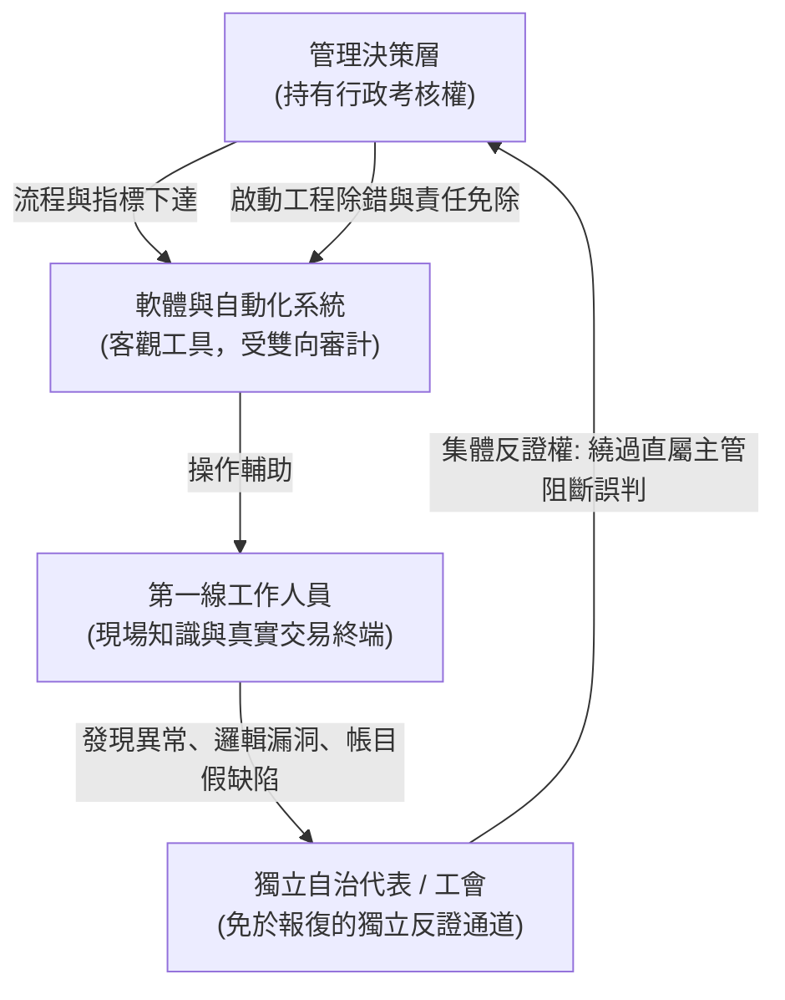
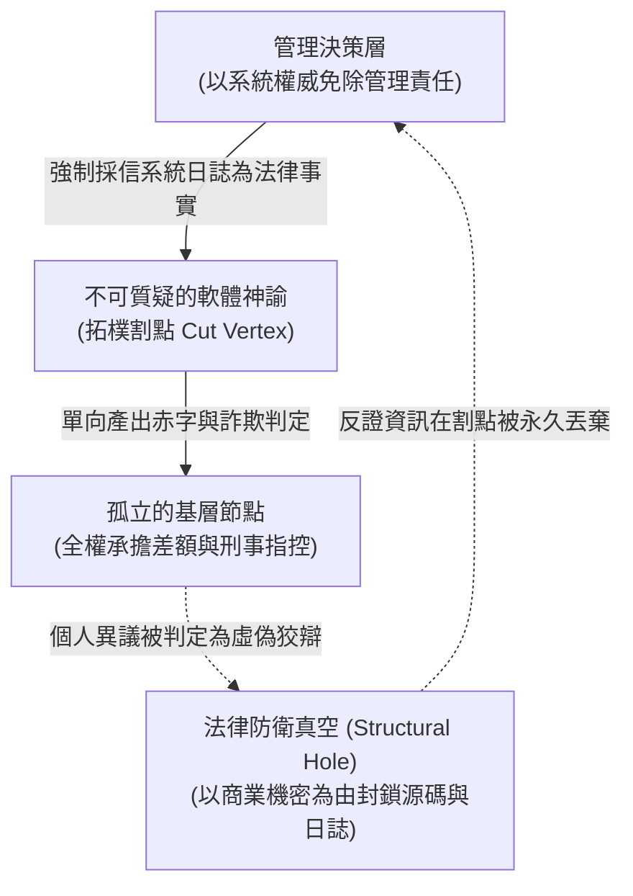

+++
title = "電腦不可質疑的法理謬誤：論演算法對反證拓樸的閹割與組織沉默"
date = "2026-09-18T06:27:02+08:00"
author = "梅乾"
draft = false
isCJKLanguage = true
description = "當法律推定電腦輸出即為事實，第一線勞動者便失去反證通道。本文以英國郵政 Horizon 冤案為標本，說明演算法如何閹割可抗辯性並製造組織沉默。"
tags = [
    "分析論述", # term:AnalyticalEssay
    "可抗辯性", # term:Contestability
    "組織沉默", # term:OrganizationalSilence
    "反證權", # term:RightToContest
    "割點", # term:CutVertex
    "似然比", # term:LikelihoodRatio
    "假性本體論特權", # term:SpuriousOntologicalPrivilege
    "代表性發聲通道", # term:RepresentativeVoiceChannels
  ]
series = ["演算法資本主義：權力、代理與合法掠奪的拓樸"]
[ai_info]
    [ai_info.generation]
        model = "Gemini 3.8 Flash"
        agent = "Antigravity IDE 2.5.5"
    [ai_info.refinement]
        model = "Grok 4.6"
        agent = "GitHub Copilot Chat v0.66.0"
+++

<!--more-->

## 導言

現代科層制度與司法的共同理性基石，建立在「**可抗辯性**（Contestability） <!-- term:Contestability -->」與「**對席辯論**（Adversarial Principle） <!-- term:AdversarialPrinciple -->」之上。在任何健全的組織與契約結構中，一項指控、一筆帳目或一個風險評級要獲得拘束外部現實的合法性，必須允許受影響的相對人提出反證。若一項制度在結構上使反證成本趨近於無窮大，該制度在法理上便喪失了正當程序（Due Process）的屬性，退化為一種純粹的權力技術。

> [!IMPORTANT]
> **可抗辯性** <!-- term:Contestability --> (Contestability): 一項指控或評級取得拘束力前，受影響相對人必須能夠提出反證的制度條件。 <!-- anchor:Contestability -->
> **對席辯論** <!-- term:AdversarialPrinciple --> (Adversarial Principle): 訴訟或組織程序中雙方得對等提出證據與質疑的辯論結構。 <!-- anchor:AdversarialPrinciple -->

然而，當數位系統、會計軟體與演算法預測被全面嵌入組織運作時，法學與管理實務中悄然形成了一種極其危險的認識論特權：**將機器的輸出預設為客觀物理事實，並將舉證軟體出錯的全部責任倒置給最缺乏技術存取權的第一線個體**。

在組織內部，這項特權直接摧毀了 OECD 與國際勞工組織（ILO）多年來所強調的員工參與、自治代表制與**獨立發聲**（Worker Voice） <!-- term:WorkerVoice -->通道。自治代表與工會的核心治理價值，從來不只是經濟利益的重分配，而是作為組織內部的**「獨立資訊通道、**反證權**（Right To Contest） <!-- term:RightToContest -->載體與權力制衡器」**。它的存在是為了降低第一線人員向管理層傳遞負面真實時所必須承受的個人報復成本。

> [!IMPORTANT]
> **獨立發聲** <!-- term:WorkerVoice --> (Worker Voice): 第一線人員經由免於報復的獨立通道向上傳遞負面真實的發聲機制。 <!-- anchor:WorkerVoice -->
> **反證權** <!-- term:RightToContest --> (Right To Contest): 第一線以獨立路徑阻斷非理性冒進、否定錯誤系統輸出的權利。 <!-- anchor:RightToContest -->

當演算法看板被管理層單向賦予神諭般的不可質疑地位時，組織內部的反證拓樸被徹底物理閹割。第一線的「知情」無法轉化為系統的「修正」，組織陷入了由制度性恐懼所維繫的死寂——即**「**組織沉默**（Organizational Silence） <!-- term:OrganizationalSilence -->」**。

> [!IMPORTANT]
> **組織沉默** <!-- term:OrganizationalSilence --> (Organizational Silence): 第一線知情無法轉化為系統修正時，由制度性恐懼所維繫的發聲停滯。 <!-- anchor:OrganizationalSilence -->

這裡要證明的是：法律上對自動化系統可靠性的盲目推定，與組織內部反證通道的拓樸阻斷，本質上是一場司法與官僚體系的共謀。它將系統缺陷的經濟與刑事後果，以「科學客觀」的外衣精準轉嫁給弱勢的基層節點，最終使整個組織在不可逆的系統性自欺中走向治理破產。

## 分析

### 一、認識論特權與舉證責任的非對稱性倒置

反證權 <!-- term:RightToContest -->被閹割的核心機制，源於法學與管理認知中對數位資訊的**「**假性本體論特權**（Spurious Ontological Privilege） <!-- term:SpuriousOntologicalPrivilege -->」**。

> [!IMPORTANT]
> **假性本體論特權** <!-- term:SpuriousOntologicalPrivilege --> (Spurious Ontological Privilege): 把機器輸出預設為客觀物理事實，從而免除制度自行查驗義務的認識論特權。 <!-- anchor:SpuriousOntologicalPrivilege -->

在傳統手工記帳與紙本作業時代，一筆短缺或帳目矛盾被視為「待查驗的爭議事實」，主管或檢察官必須提供帳簿、交易簽單與實體收據等連續因果鏈條，由人類證人出庭接受交叉質問。

然而，當軟體系統介入後，制度製造了一條致命的法理推定：

> **「電腦系統之數位輸出狀態預設恆等於客觀事實；除非弱勢相對人能提出系統存在具體程式碼瑕疵之絕對證明，否則法律與管理審計不承擔任何自主查驗義務。」**

令 $C_{\text{falsification}}$ 為被告（基層員工、郵政代理商、前線操作員）證明軟體存在缺陷的邊際成本；令 $C_{\text{system}}$ 為軟體產權方（大企業、軟體供應商、國家機關）維持其「系統無瑕疵」宣稱的抗辯成本。

在現實的資訊結構中，存在極端的拓樸不對稱：

1. **資訊單向黑箱化**：軟體原始碼、資料庫交易日誌（Transaction Logs）、遠端修補權限（Remote Access Audit Trails）完全被集中控制在企業與外部技術供應商手中。
2. **舉證成本的無限發散**：
   $$
   C_{\text{falsification}} \to \infty, \qquad C_{\text{system}} \to 0
   $$
   第一線人員面對終端機上憑空出現的帳面虧損或負面評級，若要自證清白，必須自行聘請頂級軟體鑑識專家、申請調閱數億條加密底層日誌，並在封閉專有協議中重現偶發性併發死鎖（Race Conditions）。這在個人財務與技術能力上是絕對不可能完成的任務。

在**貝氏推論**（Bayesian Inference） <!-- term:BayesianInference -->框架下，法庭與管理層對證據**似然比**（Likelihood Ratio） <!-- term:LikelihoodRatio -->的計算發生了病理扭曲：

> [!IMPORTANT]
> **貝氏推論** <!-- term:BayesianInference --> (Bayesian Inference): 以條件機率更新信念的推論框架；此處用來說明舉證似然比如何被制度扭曲。 <!-- anchor:BayesianInference -->
> **似然比** <!-- term:LikelihoodRatio --> (Likelihood Ratio): 在特定假設成立與不成立下觀測到同一徵候的條件機率之比，決定貝氏後驗更新的幅度。 <!-- anchor:LikelihoodRatio -->

$$
\Lambda = \frac{P(\text{Software Artifact} \mid \text{Guilty})}{P(\text{Software Artifact} \mid \text{Innocent} \land \text{Software Bug})}
$$

當制度強制設定 $P(\text{Software Bug}) \equiv 0$ 時，似然比 <!-- term:LikelihoodRatio --> $\Lambda \to \infty$。任何由軟體邏輯缺陷產生的虛擬虧損，均被數學上鎖定為「被告必然有罪」的無懈可擊證明。

法律與管理體系將「無法證明系統有錯」等同於「系統絕對正確」，進而將「帳面短缺」直接推論為「操作員貪污或虛報」。這在認識論上犯了最嚴重的範疇謬誤（Category Mistake）：**把機率性的程式碼執行過程，偽裝成不可質疑的幾何公理。**

### 二、反證拓樸的閹割：從雙向制衡環路到單向審判樹

在健康的組織拓樸中，OECD 所倡導的「**代表性發聲通道**（Representative Voice Channels） <!-- term:RepresentativeVoiceChannels -->」構成了一個具有容錯能力的雙向通訊環路：

> [!IMPORTANT]
> **代表性發聲通道** <!-- term:RepresentativeVoiceChannels --> (Representative Voice Channels): 工會或自治代表作為獨立於直屬主管的反證與資訊通道。 <!-- anchor:RepresentativeVoiceChannels -->

- **拓樸特性**：第一線節點 $F$ 與最高層 $M$ 之間存在兩條獨立不重合的路徑（Vertex-independent paths）。即使直屬主管試圖掩蓋系統問題，基層依然可透過獨立代表節點 $W$ 行使反證權 <!-- term:RightToContest -->。在此拓樸下，異議成本被集體制度吸收。

然而，當決策層推動以演算法為中心的單向治理時，組織拓樸被閹割為嚴格的**非平面單向審判樹**：

- **拓樸閹割機制**：
  1. **消滅獨立反證路徑**：工會或現場代表的諮詢權被架空，管理層宣稱「系統數據是中立科學的，不需要政治協商」。獨立節點 $W$ 被物理拔除。
  2. **確立單一**割點**（Cut Vertex） <!-- term:CutVertex -->**：軟體系統的數據庫日誌成為判定真實的唯一仲裁節點。在圖論視角下，割點 <!-- term:CutVertex --> $CV$ 的移除會使圖分裂為互不連通的分支。任何來自人類肉眼、紙本底根或現場經驗的抗辯，只要與數據庫記錄不符，一律在割點 <!-- term:CutVertex -->被判定為「無效雜訊」予以丟棄。
  3. **瓶頸傳導率（Conductance） <!-- term:Conductance -->趨零**：設第一線節點集合為 $S$，管理決策節點為 $\bar{S}$。組織反證網路的瓶頸傳導率 <!-- term:Conductance --> $\Phi(S)$ 滿足：
     $$
     \Phi(S) = \frac{\sum_{i \in S, j \in \bar{S}} A_{ij}}{\min(\operatorname{vol}(S), \operatorname{vol}(\bar{S}))} \to 0
     $$
     當管理層人為切斷所有非格式化溝通邊時，$A_{ij} = 0$，負面真實資訊的傳導率在拓樸上徹底歸零。
  4. **基層節點的原子化孤立**：管理層對每個出現「異常」的基層人員宣稱：「其他人用這套系統都沒問題，只有你的終端機天天出錯，這顯然是你的個人問題。」透過阻斷橫向資訊流通，基層被各個擊破，陷入徹底的習得性無助。

> [!IMPORTANT]
> **割點** <!-- term:CutVertex --> (Cut Vertex): 資訊與責任傳遞網路中一旦被插入或破壞，即導致子圖孤立、反饋中斷的關鍵節點。 <!-- anchor:CutVertex -->
> **瓶頸傳導率** <!-- term:Conductance --> (Conductance): 圖論中衡量子圖之間資訊流通能力的量；趨零表示反證被物理阻斷。 <!-- anchor:Conductance -->

### 三、審計標本解剖：英國郵政 Horizon 醜聞的司法暴力屍檢

現在，我們傳喚世界司法與治理歷史上最慘烈、最漫長的演算法冤案——**英國皇家郵政（UK Post Office）與富士通（Fujitsu）Horizon IT 系統案**，進入法庭接受病理審計。

> **審計宣告**：我們不將 Horizon 案視為個別法官或檢察官的道德敗壞，而是將其視為一具驗證「電腦可靠性推定如何淪為組織性殺人工具」的標準解剖標本。

#### 1. 制度性推定的起點：1999 年《警察與刑事證據法》第 69 條廢除的惡果

在英國法律史上，原本 1984 年《警察與刑事證據法》（PACE）第 69 條要求：控方若要引述電腦產出的記錄作為證據，必須先行舉證證明該電腦在關鍵時刻運作正常。

然而，在 1997 年英國法律委員會（Law Commission）的第 245 號報告建議下，英國國會於 1999 年廢除了該條款，恢復普通法下的普通推定：**在沒有相反證據的情況下，法院推定電腦在所有關鍵時刻均正常運作（Presumption that computers are reliable）**。

法學教授 Richard Moorhead 與數位證據專家 Stephen Mason 在其系列研究中指出，正是這項看似技術性的程序法修改，為日後長達二十年的冤案鋪平了制度鐵軌：
- 英國郵政不需要證明 Horizon 軟體是無 bug 的；
- 面對全國數百名資深、誠實、在地方社群享有崇高聲望的郵政分局長（Sub-postmasters），郵政管理層只需印出終端機的帳面赤字清單，就能在法庭上形成壓倒性的有罪推定。

#### 2. 富士通 Horizon 系統的工程腐爛與遠端篡改

英國高等法院法官 Peter Fraser 在 2019 年 *Bates v Post Office Ltd* 歷史性判決（[2019] EWHC 3408 (QB)）中揭露了令人髮指的事實：
- Horizon 系統內部存在大量嚴重的軟體缺陷（Bugs, Errors, and Defects），包括在通訊中斷時交易被重複記帳、以及夜間對帳程序的邏輯漏洞，會在分局長完全不知情的情況下憑空虛構出數萬英鎊的赤字。
- **神聖日誌的騙局**：郵政管理層在法庭上宣誓堅稱「沒有任何人能遠端存取或修改分局長終端機的分支帳戶（Branch Accounts）」。但審計證實，位於布拉克內爾（Bracknell）的富士通工程總部擁有不受限制的遠端特權存取通道，工程師經常在未經分局長知情或同意的情況下，在後台直接竄改即時帳目以「平衡報表」。

#### 3. 組織性否認與對第一線的冷酷絞殺

郵政管理層在明知系統存在廣泛缺陷的情況下，為了保全公共機構聲譽與維護合約利益，啟動了國家機器級別的法律絞殺：
- **謊言的統一口徑**：調查人員在面對每一位陷入絕望的分局長時，都說出完全相同的謊言：「你是唯一一個抱怨 Horizon 系統出錯的人。」
- **惡意起訴（Malicious Prosecution）**：在 2000 至 2014 年間，英國郵政動用其歷史遺留的私訴特權（Private Prosecution），起訴並定罪了超過 **900 名**無辜的分局長，罪名包括假帳罪、詐欺罪與重大盜竊罪。
- **毀滅性的實體代價**：數百人被判入獄服刑，包括孕婦與年輕母親；許多人傾家蕩產以個人畢生積蓄填補根本不存在的「演算法赤字」；家庭破碎、破產、遭受社區唾棄，至少有四名分局長因無法承受羞辱而自殺身亡。

#### 4. 高層在拓樸結構上的冷血自保

郵政前執行長 Paula Vennells 在任內因「帶領傳統郵政轉型盈利」獲得大英帝國勳章（CBE），並領取數百萬英鎊的薪酬與獎金。

當外部獨立法務會計師機構 Second Sight 於 2013 年提出初步調查報告、明確指出 Horizon 系統存在缺陷且分局長很可能是無辜的時，管理層的第一反應是：
1. 終止與 Second Sight 的審計合約；
2. 銷毀關鍵內部會議紀錄；
3. 封鎖任何可能暴露遠端篡改特權的技術檔案，繼續將無辜員工送上法庭。

#### 5. 公共調查聽證會（Wyn Williams Inquiry）的法務倫理審計

由前法官 Sir Wyn Williams 主持的獨立公共調查案卷證實了法務階層的共謀實況：
- **Clarke 法律意見書的刻意扣押**：2013 年大律師 Simon Clarke 曾出具正式法律備忘錄，警告管理層富士通核心技術證人 Gareth Jenkins 在法庭上作出了虛假證言，其證詞具有致命誤導性。郵政法務高層非但未依法向被告律師披露此項對被告有利的關鍵證據，反而將其列入最高機密進行物理封鎖。
- **律師專業操守的全面淪陷**：外部法律顧問事務所（如 Cartwright King 及 Womble Bond Dickinson）在長達十餘年中，將客戶的訴訟利益與免責需求置於真實之上，主動參與銷毀會議錄音，將國家司法程序徹底工具化為掩蓋系統缺陷的絞肉機。

## 反思：認識論不公與現代官僚體制的反向自然法

英國郵政醜聞徹底擊穿了現代技術官僚制度的道德神話，暴露了兩層深刻的法哲學危機：

### 1. 證言不公（Testimonial Injustice）的制度化

哲學家 Miranda Fricker 在其著作《認識論不公》（*Epistemic Injustice*）中指出，當一個說話者的證言因為體制的偏見而遭受信用降級（Credibility Deficit）時，便構成了認識論不公。

在 Horizon 案中，我們目睹了**證言不公**（Testimonial Injustice） <!-- term:TestimonialInjustice -->的極端變態形式：
- 一個工作了三十年、從未有任何瑕疵的資深郵政員工的人格與肉身證言，其信用權重被判定為 **0**；
- 一個由遠端外包商編寫、內部充滿競態條件漏洞的軟體螢幕輸出，其信用權重被法律預設為 **1**。

> [!IMPORTANT]
> **證言不公** <!-- term:TestimonialInjustice --> (Testimonial Injustice): 說話者因制度偏見而被系統性降低信用權重的認識論傷害。 <!-- anchor:TestimonialInjustice -->

人被非人化，程式碼被神聖化。這是一種倒退回原始神學「神明裁判（Trial by Ordeal）」的高科技異端：只不過中世紀是用滾燙的鐵條燙嫌疑人的手皮，現代法庭是用軟體日誌去烙印無辜者的命運。

### 2. 反向自然法：只要系統沒報錯，人間慘劇便不具法律意義

在傳統法理學中，法律必須具備最低限度的實質正義（Substantive Justice）。但在演算法官僚體系中，實質正義被「系統狀態的一致性（Consistency of System State）」徹底替換。

法官在判決書中寫道：「我們同情你的處境，但電腦記錄顯示赤字確實存在，而你拿不出證據證明電腦何時何地發生了 bug。」
這種司法的自我太監化，宣告了法律受託精神的徹底淪喪。司法者不再追求客觀物理事實，而是退化為專有軟體終端機的自動執行緒。

## 結論：重建抗辯拓樸與不可質疑性之死

如果現代文明不想徹底淪為演算法專制與官僚卸責的集中營，我們必須在法理與組織拓樸學層面，對所有自動化與演算法決策樹立起不可妥協的防禦性憲法邊界：

### 治理不變量 I：電腦可靠推定之全面廢除律（Repeal of the Presumption of Computer Reliability）

> **法理約束**：在任何涉及個體財產、人身自由、勞動權益與刑事責任的法律或組織審計爭議中，全面廢止「電腦或演算法系統預設運作正常」的程序法推定。

演算法的任何計算結果，在法理屬性上永遠只能被界定為「**待證之主張**（Unsubstantiated Claim） <!-- term:UnsubstantiatedClaim -->」，絕不具備「自證為客觀事實」的特權地位。舉證系統在交易發生的精確時間戳具備物理完整性、無未捕獲死鎖、無未經授權之遠端改寫的全部責任與完全成本，必須法定倒置給掌控該軟體原始碼與運行環境的機構主體。

> [!IMPORTANT]
> **待證之主張** <!-- term:UnsubstantiatedClaim --> (Unsubstantiated Claim): 演算法輸出在法理上只能作為尚待證明的主張，不得自證為事實。 <!-- anchor:UnsubstantiatedClaim -->

### 治理不變量 II：反證平權與鏡像審計鏈律（Mirror Audit Logging Principle）

> **證據法約束**：任何組織依據數位系統對第一線勞動者發動考核、罰扣或追訴時，相對人享有與管理層或檢控方完全對等的「**鏡像取證權**（Mirror Access Right） <!-- term:MirrorAccessRight -->」。

> [!IMPORTANT]
> **鏡像取證權** <!-- term:MirrorAccessRight --> (Mirror Access Right): 相對人與控方對等取得原始碼、日誌與遠端修補紀錄的證據權。 <!-- anchor:MirrorAccessRight -->

這項權能包含直接、無延遲、無遮蔽地調取原始程式碼、底層資料庫變更日誌（Write-Ahead Logs）、Fujitsu 等委外廠商之遠端連線修補紀錄（Remote Support Records），以及通訊協議鑑識報告。任何以「商業機密（Trade Secrets）」或「專利所有權」為由抗拒完整資訊披露的系統，其數值輸出在法庭上直接喪失證據能力（Inadmissible as Evidence）。

### 治理不變量 III：反證通道與管理考績鏈之物理隔離律（Physical Decoupling of Voice and Appraisal）

> **拓樸約束**：第一線工作者質疑系統異常、通報數位缺陷與提出反證的溝通拓樸，必須在物理上與直屬管理層的考績評定、薪酬分配與職級晉升鏈條完全解耦。

工會代表、自治安全委員與獨立舉報管道，必須被制度化為獨立於行政科層之外的外部阻尼節點。任何對行使反證權 <!-- term:RightToContest -->的工程師或代理商進行打壓、調離或邊緣化的管理層人員，在法理上直接構成「妨害司法與治理審計罪（Obstruction of Governance Audit）」，依法追究其個人不容推卸的法定懲戒責任。

---

> **終局裁決**：  
> 一個健康的組織，其生命力恰恰體現於它能否敏銳地接納來自最底層的異議與反證。
> 
> 當一家企業或國家機器開始宣稱「我們的系統絕對客觀、不容質疑」時，那絕不是科技的進步，而是特權階級在為一場即將展開的制度性屠殺，提前築好免責的掩體。

## 參考文獻

1. Fraser, P. (2019). *Bates v Post Office Ltd (No 6: Horizon Issues)* [2019] EWHC 3408 (QB). High Court of Justice of England and Wales. [英國司法機構判決全文](https://www.judiciary.uk/judgments/bates-others-v-post-office/)
2. Law Commission of England and Wales. (1997). *Evidence in Criminal Proceedings: Hearsay and Related Topics*. Law Com No. 245. （無官方線上來源；HMSO 出版）
3. Christie, J. (2020). *The Post Office Horizon IT scandal and the presumption of the dependability of computer evidence*. Digital Evidence and Electronic Signature Law Review, 17, 49-70. [doi:10.14296/deeslr.v17i0.5226](https://doi.org/10.14296/deeslr.v17i0.5226)

> 編按：原稿此條作「Mason, S., & Christie, S. (2020), *The presumption of the proper operation of a device*, 17, 47-58」，經查證 DEESLR 第 17 卷無此條目，係生成時拼湊之引用；本文實際依據之來源為 Christie 此篇，特予更正。
4. Williams, W. (2024). *Post Office Horizon IT Inquiry: Transcripts, Evidence and Clarke Advice Records*. Official Inquiry Secretariat. [官方調查網站](https://www.postofficehorizoninquiry.org.uk/)
5. Mill, J. S. (1859). *On Liberty*. John W. Parker and Son. （1859 年初版，John W. Parker and Son）
6. Habermas, J. (1981). *Theorie des kommunikativen Handelns*. Suhrkamp Verlag. ISBN 978-3-518-28775-7
7. Fricker, M. (2007). *Epistemic Injustice: Power and the Ethics of Knowing*. Oxford University Press. ISBN 978-0-19-823790-7
8. Morrison, E. W., & Milliken, F. J. (2000). *Organizational silence: A barrier to change and development in a pluralistic world*. Academy of Management Review, 25(4), 706-725. [doi:10.5465/amr.2000.3707697](https://doi.org/10.5465/amr.2000.3707697)
9. Citron, D. K. (2007). *Technological Due Process*. Washington University Law Review, 85(6), 1249-1313. [WU Open Scholarship](https://openscholarship.wustl.edu/law_lawreview/vol85/iss6/2/)
