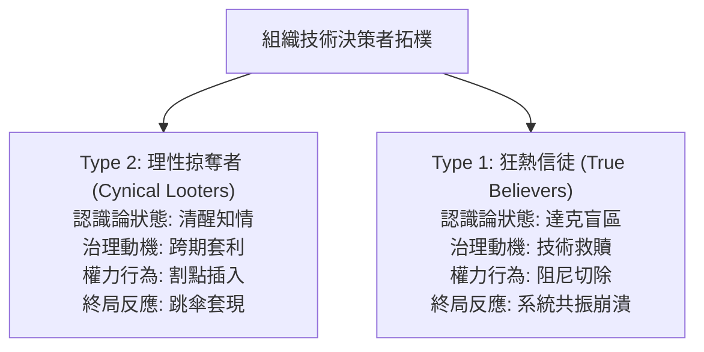
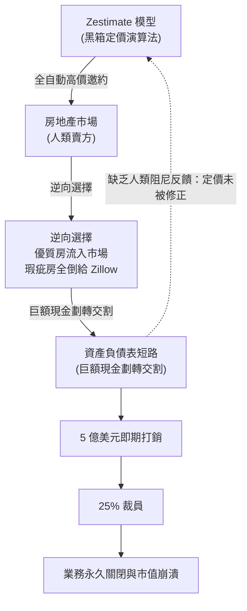

+++
title = "達克效應與資產負債表短路：論技術狂熱者的認知盲區與系統性崩潰"
date = "2026-09-18T06:30:04+08:00"
author = "梅乾"
draft = false
isCJKLanguage = true
description = "狂熱信徒把資產負債表無阻尼接到黑箱預測時，組織會在分佈漂移與逆向選擇下共振崩潰。本文以 Zillow Offers 為標本，說明達克效應如何切除控制論阻尼。"
tags = [
    "分析論述", # term:AnalyticalEssay
    "AI 經濟與社會", # term:AiEconomics
    "達克效應", # term:DunningKrugerEffect
    "分佈漂移", # term:DistributionShift
    "逆向選擇", # term:AdverseSelection
    "人在迴路", # term:HumanInTheLoop
    "商業判斷法則", # term:BusinessJudgmentRule
    "不確定性", # term:Uncertainty
  ]
series = ["演算法資本主義：權力、代理與合法掠奪的拓樸"]
[ai_info]
    [ai_info.generation]
        model = "Gemini 3.8 Flash"
        agent = "Antigravity IDE 2.5.5"
    [ai_info.refinement]
        model = "Grok 4.6"
        agent = "GitHub Copilot Chat v0.66.0"
+++

<!--more-->

## 導言

在技術官僚與企業治理的病理學光譜中，存在著兩種截然不同卻互為表裡的破壞者：第一種是冷酷理性的「機會主義掠奪者（Type 2 Looters）」，他們洞悉系統的脆弱性，精準利用期權行權與任期時間差進行合法掏空；而第二種，則是更具悲劇色彩卻對組織更具毀滅性的**「狂熱信徒（Type 1 True Believers）」**。

狂熱信徒絕非心懷惡意的詐欺犯，恰恰相反，他們對技術神話懷抱著近乎宗教般的赤誠。他們深信數學公式、神經網路權重與大數據預測具備超越人類經驗的「全知性（Omniscience）」。在心理學拓樸上，這群決策者深陷於**「達克效應（Dunning-Kruger Effect） <!-- term:DunningKrugerEffect -->」**的雙重維度：對複雜現實世界的非線性本質「不知其不知（Unknown Unknowns）」，同時對自身掌握的粗糙統計模型抱持著極度的「能力過度自信（Epistemic Hubris）」。

> [!IMPORTANT]
> **達克效應** <!-- term:DunningKrugerEffect --> (Dunning-Kruger Effect): 對複雜現實不知其不知、同時對粗糙模型過度自信的雙重認知盲區。 <!-- anchor:DunningKrugerEffect -->

當這種認知盲區僅停留在學術象牙塔或實驗室沙盒時，其代價不過是幾篇被駁回的論文或幾行廢棄的程式碼。然而，當組織權力結構允許狂熱信徒將企業的實體資產負債表（Balance Sheet），**「無阻尼短路（Undamped Short-Circuiting） <!-- term:UndampedShortCircuiting -->」**直接串接至黑箱演算法的自動化決策輸出端時，一場毀滅性的物理與金融災難便不可避免。

> [!IMPORTANT]
> **無阻尼短路** <!-- term:UndampedShortCircuiting --> (Undamped Short-Circuiting): 把資產負債表直接接到黑箱預測、切除人類審查阻力的控制論操作。 <!-- anchor:UndampedShortCircuiting -->

在傳統商業模式中，資本的配置與資產的收購由多層具備在地**默會知識**（Tacit Knowledge） <!-- term:TacitKnowledge -->的人類專業節點層層把關。這些節點在組織中扮演著阻尼器（Dampers）與濾波器的角色，吸收市場噪聲並抵禦極端風險。狂熱信徒卻將這些不可或缺的審查阻力視為「效率低下的**摩擦力**（Friction） <!-- term:Friction -->」，並以「完全演算法化、端到端自動化」為名，將人類反饋迴圈徹底物理切除。

> [!IMPORTANT]
> **默會知識** <!-- term:TacitKnowledge --> (Tacit Knowledge): 無法完全言傳、只能在學徒制實踐與痛感反饋中內化的工程判斷。 <!-- anchor:TacitKnowledge -->
> **摩擦力** <!-- term:Friction --> (Friction): 流程中的阻力或成本；在約束系統中也可能是失敗點正在生效的可感知表現。 <!-- anchor:Friction -->

這裡要證明的是：技術狂熱者在達克效應 <!-- term:DunningKrugerEffect -->支配下所推動的端到端決策自動化，本質上是一種破壞控制論反饋穩定的致命短路。當統計模型遭遇現實世界的「**分佈漂移**（Distribution Shift） <!-- term:DistributionShift -->」與「**逆向選擇**（Adverse Selection） <!-- term:AdverseSelection -->」時，缺乏人類認知阻尼的系統將迅速陷入共振放大崩潰，最終在數月之內將企業數十年累積的資本實力焚燒殆盡。

> [!IMPORTANT]
> **分佈漂移** <!-- term:DistributionShift --> (Distribution Shift): 部署資料的分佈偏離訓練分佈，使模型在參數不變下失去效用的現象。 <!-- anchor:DistributionShift -->
> **逆向選擇** <!-- term:AdverseSelection --> (Adverse Selection): 資訊優勢方把瑕疵標的賣給定價失靈的買方，使資產組合系統性惡化。 <!-- anchor:AdverseSelection -->

## 分析

### 一、狂熱信徒與掠奪者的雙重拓樸分化

在分析組織技術災難時，傳統委託**代理理論**（Agency Theory） <!-- term:AgencyTheory -->往往過度聚焦於道德風險（Moral Hazard）與利益衝突，預設所有決策者皆為冷靜計算個人效用的理性經紀人。然而，這種簡化模型無法解釋為何許多高階主管在公司崩潰前夕，非但沒有拋售股票套現，反而將個人名譽與資產全額押注在注定失敗的技術賭局中。

> [!IMPORTANT]
> **代理理論** <!-- term:AgencyTheory --> (Agency Theory): 以委託人與代理人間的利益衝突為核心，解釋經理人誘因如何偏離組織長期存續。 <!-- anchor:AgencyTheory -->

我們必須在認識論架構上，嚴格區分兩種治理失靈的主體拓樸：

1. **Type 2 掠奪者的拓樸特徵**：其核心行為是「拉長資訊不對稱，縮短套現週期」。他們清楚系統存在致命缺陷，因此透過破壞反證通道與公關包裝，維持短期的假性繁榮，直至其**股票期權**（Stock Options） <!-- term:StockOptions -->全額歸屬（Vesting）後從容離場；
2. **Type 1 狂熱信徒的拓樸特徵**：他們真誠地相信自身正在推動一場超越時代的「生產力革命」。他們並非企圖掏空企業，而是將客觀物理世界的摩擦、市場的**不確定性**（Uncertainty） <!-- term:Uncertainty -->與人類第一線專家的在地判斷，全數歸類為「落後的、可被演算法完全清洗的噪聲」。

> [!IMPORTANT]
> **股票期權** <!-- term:StockOptions --> (Stock Options): 將經理人薪酬與股價綁定的激勵工具；當歸屬週期短於系統崩潰潛伏期時，會打開跨期套現空間。 <!-- anchor:StockOptions -->
> **不確定性** <!-- term:Uncertainty --> (Uncertainty): 估計值因抽樣與執行變異而帶有的波動範圍，是判定分數差異是否顯著的前提。 <!-- anchor:Uncertainty -->

狂熱信徒最危險的治理病理在於：**他們主動瓦解了組織內部對自身決策的保護性防禦**。掠奪者尚且需要顧及審計防線以延緩敗露時間，而狂熱信徒則會以無比的道德優越感與行政狂暴，將所有警告系統有缺陷的專業工程師連根拔除。

### 二、控制論短路：阻尼阻抗切除與諧振災難

從**控制理論**（Cybernetics） <!-- term:Cybernetics -->與動力系統的角度審視，任何能夠在非平穩環境中存續的複雜適應系統（Complex Adaptive System），必須具備相應的「**反饋阻抗**（Feedback Impedance） <!-- term:FeedbackImpedance -->」。

> [!IMPORTANT]
> **控制理論** <!-- term:Cybernetics --> (Cybernetics): 以反饋、阻抗與穩定性描述控制系統行為的理論。 <!-- anchor:Cybernetics -->
> **反饋阻抗** <!-- term:FeedbackImpedance --> (Feedback Impedance): 吸收噪聲、約束極端輸出的審查阻力；被切除後系統易進入共振。 <!-- anchor:FeedbackImpedance -->

在穩健的商業採購與資產配置拓樸中，訊號傳遞遵循閉環負反饋路徑：

> **閉環負反饋鏈**：市場訊號 $\xrightarrow{K_{\text{sensor}}}$ 預測模型 $\xrightarrow{K_{\text{decision}}}$ 人類專家評估 $\xrightarrow{Z_{\text{friction}}}$ 資本出資 $\longrightarrow$ 物理交割 $\longrightarrow$ 損益校正

在此系統中，人類專家的實地勘驗、合規審查與價格談判，在動力學方程中充當著關鍵的阻尼係數 $Z_{\text{friction}} > 0$。阻尼的存在雖然微幅增加了單筆交易的時間延遲 $\tau$，但其關鍵功能是過濾掉高頻市場噪聲，並對統計模型的估值極值施加物理約束。

當狂熱信徒掌舵時，他們將組織目標單一簡化為「極致的交易輸送量（Throughput Maximization）」。在他們的意識形態中，演算法的預測即是現實本身。

狂熱信徒採取了致命的拓樸操作：**強制切除 $Z_{\text{friction}}$，使系統阻抗趨近於零（$Z \to 0$）**。

其產生的直接後果，是控制迴路傳遞函數的極點（Poles）穿透虛軸，進入右半平面（Right-Half Plane）。在缺乏阻尼反饋的情況下，系統退化為一個自激振盪器：
$$\frac{d^2 x(t)}{dt^2} + \omega_0^2 x(t) = F_{\text{market}}(t)$$
當外部市場環境 $F_{\text{market}}(t)$ 出現微小的週期性擾動時，系統的資本輸出響應 $x(t)$ 將產生災難性的諧振放大（Resonant Blow-up）。每一次演算法的錯誤定價，不再被人類及時糾偏，而是直接觸發真實資金的巨額劃轉；而這些資金劃轉所引發的局部市場扭曲，又被系統當作「新的訓練數據」重新餵回神經網路，形成了自我毀滅的正反饋死循環。

### 三、認識論陷阱：統計平穩性假說與各態歷經性破缺

狂熱信徒之所以深陷達克效應 <!-- term:DunningKrugerEffect -->，核心在於他們混淆了「相關性挖掘」與「因果機制」，並將統計**機器學習**（Machine Learning） <!-- term:MachineLearning -->的兩大基石假設，盲目套用於高度演化的社會經濟系統中：

> [!IMPORTANT]
> **機器學習** <!-- term:MachineLearning --> (Machine Learning): 先界定可選函數的範圍，再以資料估計其中參數的建模方法。 <!-- anchor:MachineLearning -->

#### 1. 獨立同分佈（I.I.D.）假說的破滅

現代統計模型與深度學習的**泛化**（Generalization） <!-- term:Generalization -->能力，極度依賴於訓練集與測試集服從相同且獨立的分佈。然而，實體經濟與金融市場本質上是「二階混沌系統（Second-Order Chaotic System）」：市場主體會根據模型的預測調整自身策略，進而主動摧毀模型原有的統計基礎。

> [!IMPORTANT]
> **泛化** <!-- term:Generalization --> (Generalization): 模型在訓練樣本以外的資料上維持表現的能力。 <!-- anchor:Generalization -->

狂熱信徒無視物理世界的非平穩性（Non-stationarity），堅信歷史數據中提取的高維權重足以捕捉未來的極端邊界。當現實世界發生宏觀利率轉向、供應鏈中斷或地緣政治衝擊等結構性相變（Phase Transition）時，黑箱模型非但無法泛化 <!-- term:Generalization -->，反而會在「高度自信的狀態下輸出致命的荒謬決策（High-Confidence Hallucination）」。

#### 2. 各態歷經性破缺（Breakdown of Ergodicity）

在統計物理與決策科學中，**各態歷經性**（Ergodicity） <!-- term:Ergodicity -->意味著系統的「時間均值（Time Average）」等於其「空間均值（Ensemble Average）」：
$$\lim_{T \to \infty} \frac{1}{T} \int_0^T f(x(t)) dt = \int_{\Omega} f(x) d\mu(x)$$

> [!IMPORTANT]
> **各態歷經性** <!-- term:Ergodicity --> (Ergodicity): 時間平均與系綜平均可互換的統計假設。 <!-- anchor:Ergodicity -->

在一個具備各態歷經性 <!-- term:Ergodicity -->的世界中，一個模型如果預測 100 筆交易在統計上有 80% 的勝率，企業可以安全地同時執行這 100 筆交易。但在真實的資本運作中，金融生存具有嚴格的「**吸收壁**（Absorbing Barrier） <!-- term:AbsorbingBarrier -->」——即破產。

> [!IMPORTANT]
> **吸收壁** <!-- term:AbsorbingBarrier --> (Absorbing Barrier): 一旦觸及即無法返回的破產或流動性終態。 <!-- anchor:AbsorbingBarrier -->

狂熱信徒在空間均值的假象中狂歡，卻忽視了單一路徑的時間破產風險。當演算法短路直接操作資產負債表時，企業不再是在多元宇宙中平行抽樣，而是在一條不可逆的時間單行道上狂奔。只要模型在短期內連續遭遇三次極端離群值（Outliers），即使其名義勝率高達 99%，企業也會在瞬間撞上流動性吸收壁 <!-- term:AbsorbingBarrier -->而徹底覆滅。

### 四、歷史個案解剖：Zillow Offers 的演算法短路與千億市值蒸發

在當代商業史中，最具典型性、最純粹的「達克狂熱信徒毀滅案例」，莫過於美國房地產巨頭 Zillow 在 2021 年爆發的「iBuying（即時購屋）」災難。

#### 1. 演算法神話的誕生：從參考指標到資本發動機

Zillow 原本是全美最大的房地產資訊入口平台，其核心壁壘是流量與廣告。在多年的運營中，Zillow 開發了一套著名的自動房屋估價演算法——**「Zestimate」**。

在最初的治理框架下，Zestimate 僅是一個供購屋者與屋主參考的純資訊產品，其背後有著清晰的聲明：「此預測不構成正式估價，買賣雙方應尋求專業房地產經紀人與鑑價師的現場勘查」。此時，Zestimate 與實體資本之間存在著堅實的人類專業防火牆。

然而，在宏觀低利率與科技泡沫的推波助瀾下，Zillow 高階管理層（以共同創辦人兼執行長 Rich Barton 為核心）陷入了嚴重的技術神話崇拜。管理層認為：既然我們的神經網路擁有全美數千萬棟房屋的歷史交易數據、衛星地圖、街景與學區評級，演算法對房屋價值的定價精度，理應遠超過那些依靠直覺與肉眼觀察的傳統地方仲介。

2018 年，Zillow 正式啟動「Zillow Offers」業務，宣告跨入 iBuying 領域。更致命的是，管理層做出了載入商學院教材的狂妄決定：**將 Zestimate 估價模型的輸出端，直接短路連接至公司的現金支票簿**。系統依據模型計算出的數值，自動向屋主發送具備法律效力的全現金收購邀約（All-Cash Offers），承諾在幾天內完成交割，並計畫在稍加翻新後迅速加價轉售，企圖成為房地產界的超大型高頻做市商。

#### 2. 人類阻尼的全面清除與地方默會知識的放逐

在推進 Zillow Offers 的過程中，組織內部的專業力量曾多次發出警告。資深的房地產估價師指出：
- 房屋具有極強的物理異質性（Heterogeneity），演算法無法識別隱蔽的白蟻侵蝕、地基下陷、鄰里氣味、採光死角以及室內裝修的真實損耗；
- 房屋交易市場是非流動性的、非同質的，極易受到「逆向選擇 <!-- term:AdverseSelection -->」的致命侵蝕。

但沉浸在達克效應 <!-- term:DunningKrugerEffect -->中的技術高層，將這些經驗之談斥為「傳統從業者的垂死掙扎」。為了追求在財報電話會議上向華爾街展示幾何級數的營收增長，管理層做出了進一步的激進調整：
1. **調高收購激進度係數**：人為調高模型中的購屋激進係數，下令演算法全面拉高出價，以擊敗競爭對手（如 OpenDoor）；
2. **切除人類核驗權限**：將原本第一線現場勘驗人員的「否決權」，降級為純粹的「文件簽收員」，勘驗報告中的負面瑕疵評語在系統中被演算法權重自動忽略；
3. **加槓桿融資**：Zillow 透過發行數十億美元的資產抵押證券（ABS）與銀行信貸，將整間公司的信用資產負債表，毫無防護地敞開給自動化購屋管線。

#### 3. 逆向選擇的黑洞：現實物理對黑箱模型的降維打擊

當 2021 年下半年美國房地產市場在宏觀通膨與疫情常態化下出現微妙的結構性分化時，系統的控制論崩潰瞬間爆發。

市場中的人類屋主展現出了博弈論中的絕對理性：
- 當 Zestimate 演算法因模型盲區**嚴重高估**某棟存在隱形瑕疵或地段衰退的房屋時，精明的屋主毫不猶豫地選擇「點擊確認，立刻全現金賣給 Zillow」；
- 當 Zestimate 演算法**低估**或合理估價優質房屋時，屋主則直接轉向公開市場尋求人類買家的高價競標。

這導致了金融學上最嚴重的**「阿克洛夫檸檬市場（Akerlof's Market for Lemons） <!-- term:MarketForLemons -->」逆向選擇 <!-- term:AdverseSelection -->陷阱**：Zillow 的演算法以驚人的速度，將全美各大都會區最難以轉手、維護成本最高、溢價最嚴重的「房地產垃圾」全額收入囊中。

> [!IMPORTANT]
> **檸檬市場** <!-- term:MarketForLemons --> (Market For Lemons): 因買方無法辨識品質而按平均價值交易，進而排擠高品質供給的資訊不對稱市場。 <!-- anchor:MarketForLemons -->

在幾個月之內，Zillow 的資產負債表上積壓了近萬棟無法轉售的庫存房屋。隨著市場利率抬頭，演算法庫存發生毀滅性的資產崩塌。

2021 年 11 月，Zillow 董事會不得不召開緊急會議，宣佈一場震驚華爾街的崩潰性聲明：
- **全面且永久終止 Zillow Offers 業務**；
- **認列超過 5 億美元的房屋庫存資產減損與相關虧損**；
- **即刻裁撤公司 25% 的員工（超過 2,000 名工作崗位）**；
- **公司股價在消息公佈後數日內狂跌超過 60%，市值蒸發數百億美元**。

Zillow Offers 的屍檢報告，以無可辯駁的殘酷事實證明：**當狂熱信徒將資產負債表直接短路給演算法黑箱時，他們不是在創造未來，而只是在用股東的資本，為自身的認知盲區買單。**

#### 4. 監管與證券集體訴訟的後續餘震

Zillow Offers 的崩潰並未隨業務關閉而劃下句點，隨之而來的是激烈的法律追責。在美國聯邦地方法院提起的證券集體訴訟中，股東指控 Zillow 高階管理階層違反 1934 年《證券交易法》：
- 管理層明知 Zestimate 演算法在非平穩市場環境中存在嚴重的價格預測偏差與逆向選擇 <!-- term:AdverseSelection -->風險，卻持續在公開財報電話會中向投資人保證「系統具備強大的自我修正能力與風險控制」；
- 管理層刻意隱瞞了內部工程師與估價專家對庫存積壓與資產減損的警告，持續動用巨額信貸額度擴大高風險採購；
- 這一行為使公司的市值在虛假繁榮中被嚴重高估，最終在泡沫破裂時造成了無辜公開市場投資人的慘重損失。

這一訴訟奠定了現代公司治理的重大先例：**黑箱演算法的輸出不能作為管理層推卸證券詐欺與未盡披露責任的免死金牌**。

### 五、反思：自動化決策系統中「人在迴路」的實質化條件

Zillow 的慘劇徹底粉碎了「演算法全自動化治理」的烏托邦神話，迫使系統工程界重新思考控制論中「**人在迴路**（Human-in-the-Loop, HITL） <!-- term:HumanInTheLoop -->」的實質意涵。

> [!IMPORTANT]
> **人在迴路** <!-- term:HumanInTheLoop --> (Human-In-The-Loop): 人類節點對自動化決策保留實質否決與阻尼的控制條件，而非形式性的一鍵通過。 <!-- anchor:HumanInTheLoop -->

在許多狂熱推動自動化的企業中，HITL 往往退化為一種純粹的形式主義。管理層雖然在系統中保留了人類審核按鈕，但透過以下手段使人類監督形同虛設：
1. **極端的時間配額壓迫**：要求審核員在數十秒內完成一筆涉及數十萬美元的交易覆核，迫使人類只能在資訊超載中機械式地「一鍵點擊通過（Click-through Rubber-stamping）」；
2. **責任歸屬的非對稱懲罰**：若人類審核員駁回演算法的提議，需要撰寫冗長的反駁報告並承擔「拖慢業務進度」的政治指責；而若順從演算法批准，即便事後證明虧損，亦可將責任推給系統缺陷。

要使組織重新具備抵禦諧振崩潰的認識論阻尼，HITL 必須完成制度化的實質重構：
- **獨立的默會知識 <!-- term:TacitKnowledge -->加權**：在決策拓樸中，第一線人類專家的反對意見必須具備足夠的數學權重，能夠直接中斷自動化採購管線；
- **強制性的冷卻期（Mandatory Cooling-off Periods）**：當演算法在特定時間窗口內的交易頻率或資產集中度異常攀升時，系統應自動觸發熔斷機制，強制介入長達數小時至數天的冷靜覆核期；
- **異質性檢驗通道**：對於高度非標準化、非同質的實體資產，嚴禁採取端到端黑箱定價，必須在最後一哩路強制嵌入獨立第三方的物理勘驗證明。

## 結論

達克效應 <!-- term:DunningKrugerEffect -->支配下的技術狂熱，是當代公司治理中最隱蔽也最具破壞力的系統性腫瘤。狂熱信徒不同於掠奪者，他們不屑於繁瑣的跨期套現，而是直接在意識形態上將自身晉升為客觀真理的代言人。在他們的認知世界中，統計模型的數值輸出具有神聖性，而客觀世界的物理摩擦、人類專家的在地經驗與控制系統的審慎阻尼，皆被視為可以隨意切除的官僚障礙。

這種治理失靈的本質，是**控制論結構上的致命短路**。將龐大的資本負債表毫無緩衝地掛載在黑箱預測模型之上，必然使組織在非平穩的現實世界衝擊下，陷入不可逆的諧振崩塌。Zillow Offers 的破產清算，不僅僅是一家網路巨頭的商業滑鐵盧，更是對所有試圖以「純粹演算法崇拜」取代「嚴謹組織治理」者的嚴肅歷史判決。

為了防範狂熱信徒將組織拖入系統性深淵，未來的企業治理與系統工程必須確立不可妥協的拓樸邊界：
1. **嚴禁資產負債表與演算法黑箱直接短路**：在任何涉及真實貨幣轉移、資產收購或實體人身安全的關鍵節點，必須在體制上強制維持「**人類實質在環**（Meaningful Human-In-The-Loop） <!-- term:MeaningfulHumanInTheLoop -->」的審批阻尼；
2. **制度化保障第一線默會知識 <!-- term:TacitKnowledge -->的否決權**：建立直接對審計委員會負責的在地專業勘驗通道，確保第一線專業人員對異常數據與物理瑕疵具備獨立的一票否決權；
3. **建立反達克技術審計機制**：任何自動化決策系統在上線前，必須通過嚴格的二階混沌對抗測試與極端非平穩分佈壓力測試，徹底粉碎「樣本內擬合良好即代表未來平穩」的技術幻想；
4. **將認知傲慢列入公司法重大過失（Gross Negligence） <!-- term:GrossNegligence -->**：在法律責任維度，明確認定高階主管「盲目切除組織既有防護機制、將資本無阻尼交付未經充分驗證黑箱模型」之行為，屬於不可受**商業判斷法則**（BJR） <!-- term:BusinessJudgmentRule -->庇護的重大過失 <!-- term:GrossNegligence -->。

> [!IMPORTANT]
> **人類實質在環** <!-- term:MeaningfulHumanInTheLoop --> (Meaningful Human-In-The-Loop): 人類對自動化決策保有足以中斷資金劃轉的實質否決權。 <!-- anchor:MeaningfulHumanInTheLoop -->
> **重大過失** <!-- term:GrossNegligence --> (Gross Negligence): 盲目切除防護機制、將資本無阻尼交付未驗證黑箱，不受商業判斷法則庇護的過失。 <!-- anchor:GrossNegligence -->
> **商業判斷法則** <!-- term:BusinessJudgmentRule --> (Business Judgment Rule): 推定經理人在知情且善意時免於個人賠償；形式合規常被用來對抗實質的安全與審計審查。 <!-- anchor:BusinessJudgmentRule -->

唯有在技術狂熱面前捍衛組織的控制論阻尼，企業才能在統計幻象與市場風暴的交織中，守住自身賴以生存的理性基石。

## 參考文獻

1. Kruger, J., & Dunning, D. (1999). *Unskilled and unaware of it: How difficulties in recognizing one's own incompetence lead to inflated self-assessments*. Journal of Personality and Social Psychology, 77(6), 1121-1134. [doi:10.1037/0022-3514.77.6.1121](https://doi.org/10.1037/0022-3514.77.6.1121)
2. Akerlof, G. A. (1970). *The Market for "Lemons": Quality Uncertainty and the Market Mechanism*. The Quarterly Journal of Economics, 84(3), 488-500. [doi:10.2307/1879431](https://doi.org/10.2307/1879431)
3. Wiener, N. (1948). *控制理論 <!-- term:Cybernetics -->: Or Control and Communication in the Animal and the Machine*. MIT Press. ISBN 978-0-262-73009-9
4. Taleb, N. N. (2018). *Skin in the Game: Hidden Asymmetries in Daily Life*. Random House. ISBN 978-0-425-28462-9
5. Peters, O. (2019). *The ergodicity problem in economics*. Nature Physics, 15(12), 1216-1221. [doi:10.1038/s41567-019-0732-0](https://doi.org/10.1038/s41567-019-0732-0)
6. Zillow Group, Inc. (2021). *Form 8-K: Current Report Pursuant to Section 13 or 15(d) of the Securities Exchange Act of 1934 (November 2, 2021)*. U.S. Securities and Exchange Commission. [SEC EDGAR](https://www.sec.gov/cgi-bin/browse-edgar?action=getcompany&CIK=0001617640&type=8-K)
7. Polanyi, M. (1966). *The Tacit Dimension*. Doubleday & Company. ISBN 978-0-226-67298-4
8. Kahneman, D. (2011). *Thinking, Fast and Slow*. Farrar, Straus and Giroux. ISBN 978-0-374-27563-1
9. Ashby, W. R. (1956). *An Introduction to Cybernetics*. Chapman & Hall. ISBN 978-1-61427-765-1
10. O'Neil, C. (2016). *Weapons of Math Destruction: How Big Data Increases Inequality and Threatens Democracy*. Crown. ISBN 978-0-553-41881-1
11. Sterman, J. D. (2000). *Business Dynamics: Systems Thinking and Modeling for a Complex World*. Irwin/McGraw-Hill. ISBN 978-0-07-231135-8
12. Taleb, N. N. (2007). *The Black Swan: The Impact of the Highly Improbable*. Random House. ISBN 978-1-4000-6351-2
