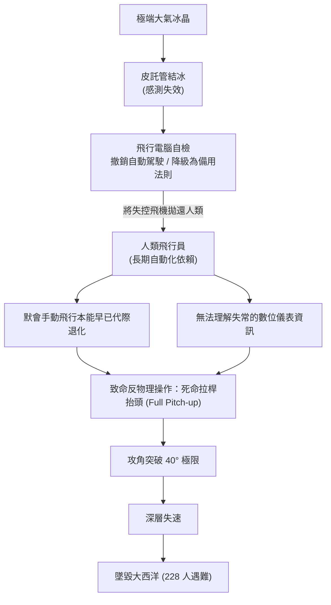

+++
title = "認識論荒漠化與調試反射的退化：論自動化生成的代際技術失傳"
date = "2026-09-18T06:33:01+08:00"
author = "梅乾"
draft = false
isCJKLanguage = true
description = "自動化生成切斷了工程師與底層錯誤的摩擦，調試反射與默會知識隨之萎縮。本文以法航 447 為標本，說明認識論荒漠化如何讓組織在極端故障中喪失自癒能力。"
tags = [
    "分析論述", # term:AnalyticalEssay
    "軟體工程與規格", # term:SoftwareEngineeringSpecifications
    "認識論荒漠化", # term:EpistemicDesertification
    "調試反射", # term:DebuggingReflex
    "默會知識", # term:TacitKnowledge
    "認知萎縮", # term:CognitiveAtrophy
    "學徒制除錯", # term:ApprenticeshipDebugging
    "突觸修剪", # term:SynapticPruning
  ]
series = ["演算法社會：物質病理、認識論衰變與自噬拓樸"]
[ai_info]
    [ai_info.generation]
        model = "Gemini 3.8 Flash"
        agent = "Antigravity IDE 2.5.5"
    [ai_info.refinement]
        model = "Grok 4.6"
        agent = "GitHub Copilot Chat v0.66.0"
+++

<!--more-->

## 導言

在技術文明的演化歷程中，人類對工具的每一次升級，表面上皆被描繪為生產力邊界的線性擴張。從蒸汽機、內燃機到現代數位計算機，每一次自動化浪潮的核心承諾，皆是將人類智力從繁重、重複與低階的機械勞動中解放出來，使其得以攀登至更高階的抽象設計與策略創新領域。

然而，當自動化技術跨越傳統的「機械執行」範疇，全面入侵「符號推理、程式碼生成、系統除錯與因果診斷」等核心認知領域時，一場隱蔽卻具備不可逆毀滅性的文明退化悄然降臨：**「**認識論荒漠化**（Epistemic Desertification） <!-- term:EpistemicDesertification -->」與「人類**調試反射**（Debugging Reflex） <!-- term:DebuggingReflex -->的代際滅絕」**。

> [!IMPORTANT]
> **認識論荒漠化** <!-- term:EpistemicDesertification --> (Epistemic Desertification): 自動化切斷人類與底層錯誤的摩擦後，默會知識與除錯直覺代際失傳、知識土壤趨於均質貧瘠的認識論退化。 <!-- anchor:EpistemicDesertification -->
> **調試反射** <!-- term:DebuggingReflex --> (Debugging Reflex): 長期直面編譯失敗與物理異常所形成的身體化本能，能在噪聲中穿透抽象屏障並定位底層因果。 <!-- anchor:DebuggingReflex -->

麥可·波蘭尼（Michael Polanyi）在其奠基性著作《默會維度（The Tacit Dimension）》中提出了一條著名的認識論定律：「我們所知遠多於我們所能言傳（We know more than we can tell）」。真正支撐高可靠性工程、航空航太與大型軟體架構的，從來不只是白紙黑字的規格手冊或程式碼語法，而是深植於工程師肌肉、神經網路與長期實踐中的**「**默會知識**（Tacit Knowledge） <!-- term:TacitKnowledge -->」**。這種知識只能在直面物理阻力、承受編譯失敗、經歷深夜線上故障診斷的殘酷「**學徒制除錯**（Apprenticeship Debugging） <!-- term:ApprenticeshipDebugging -->」中，透過痛苦的突觸重構代代相傳。

> [!IMPORTANT]
> **默會知識** <!-- term:TacitKnowledge --> (Tacit Knowledge): 無法完全言傳、只能在學徒制實踐與痛感反饋中內化的工程判斷。 <!-- anchor:TacitKnowledge -->
> **學徒制除錯** <!-- term:ApprenticeshipDebugging --> (Apprenticeship Debugging): 透過低階缺陷排查累積微觀阻力，從而建立除錯資格與默會直覺的傳承機制。 <!-- anchor:ApprenticeshipDebugging -->

當生成式模型被作為「即時解答神諭」全面覆蓋在整個軟體開發與工程生命週期之上時，新一代工程師被系統性地剝奪了與真實物理底層碰撞的機會。表面的交付速度大幅攀升，程式碼產出量呈現幾何級數暴增；但在光鮮的生產力指標背後，人類心智對底層因果關係的掌握力卻發生了全面的「**認知萎縮**（Cognitive Atrophy） <!-- term:CognitiveAtrophy -->」。

> [!IMPORTANT]
> **認知萎縮** <!-- term:CognitiveAtrophy --> (Cognitive Atrophy): 因代理黑箱隔離而失去高低層因果連通，心智對底層機制的掌握力全面衰退。 <!-- anchor:CognitiveAtrophy -->

本文旨在證明：自動化生成工具在切斷人類與底層錯誤直接摩擦的同時，摧毀了工程組織賴以自愈的認識論根基。當整個世代的工程師退化為僅能被動接受模型建議的「語意搬運工」時，一旦底層系統在極端環境下發生模型無法理解的罕見崩潰，人類將徹底喪失排查與修復的能力，導致現代技術基礎設施不可逆地陷入深層癱瘓。

## 分析

### 一、波蘭尼默會知識與調試反射的神經拓樸

要理解認識論荒漠化 <!-- term:EpistemicDesertification -->的機制，必須先還原人類在複雜系統中建立「調試反射 <!-- term:DebuggingReflex -->」的心智認知拓樸。

在認知科學與複雜系統工程中，一個資深的系統工程師之所以能在幾千行報錯日誌中迅速鎖定競態條件（Race Condition）或記憶體洩漏（Memory Leak），其核心機制並非窮舉式的符號比對，而是高度整合的**「模式識別與身體化隱喻（Embodied Metaphor）」**。這種能力由三個緊密嵌合的拓樸環路構成：

1. **痛感反饋環路**（Nociceptive Feedback Loop） <!-- term:NociceptiveFeedbackLoop -->：工程師在初學階段，必須經歷無數次「假設—寫入—崩潰—重構」的挫折循環。每一次指針越界崩潰（Segmentation Fault）所引發的挫敗感與長達數小時的逐步單步調試（Single-stepping），在大腦皮層中烙印下了對特定程式碼壞味道（Code Smells）的警覺突觸；
2. **多層因果心理模型（Multilayer Causal Mental Models）**：工程師的心智並非僅停留在高階語法層面，而是能夠在符號操作時，自動在下意識中映射出底層的暫存器調度、快取行命中率（Cache Line Invalidation）、作業系統中斷與網路封包重傳等物理現象；
3. **直覺反駁能力（Adversarial Intuition）**：對「看似正常運行的程式碼」保持警惕，能本能地預判邊界條件、並發衝突與非平穩負載下的崩潰情境。

> [!IMPORTANT]
> **痛感反饋環路** <!-- term:NociceptiveFeedbackLoop --> (Nociceptive Feedback Loop): 崩潰、單步除錯與挫敗感在神經系統中烙印壞味道警覺的訓練迴路。 <!-- anchor:NociceptiveFeedbackLoop -->

在圖論模型中，定義工程師的知識結構為一個深層有向網路 $G_{\text{mind}} = (V_{\text{concept}}, E_{\text{causal}})$。頂層是業務語意節點，底層是硬體與物理協議節點。在傳統的工程訓練中，邊集合 $E_{\text{causal}}$ 具備強烈的雙向連通性（Biconnectivity）與高密度鏈接：
$$\forall u \in V_{\text{high}}, \exists \text{ path } P(u \to v), v \in V_{\text{low}}$$

然而，當生成式自動化介入後，它在 $V_{\text{high}}$ 與 $V_{\text{low}}$ 之間插入了一個不透明的「代理黑箱隔離層」。工程師只需提出自然語言需求，黑箱便直接輸出看似完美的底層實現。

表面上，工程師節省了大量的認知摩擦（Cognitive Friction），但在認知拓樸上，所有連通高低維度的邊 $E_{\text{causal}}$ 因長期缺乏電訊號刺激，發生了劇烈的**突觸修剪**（Synaptic Pruning） <!-- term:SynapticPruning -->。知識圖譜從強連通圖退化為一組懸空的孤立點集合，工程師的大腦被「外包化（Cognitive Offloading）」，徹底喪失了在系統故障時向下穿透抽象屏障的本體感受力。

> [!IMPORTANT]
> **突觸修剪** <!-- term:SynapticPruning --> (Synaptic Pruning): 長期缺乏電訊號刺激後，連通高低維度的因果邊被剪除，知識圖譜退化為孤立點。 <!-- anchor:SynapticPruning -->

### 二、學徒傳承鏈的斷裂：認知階梯的梯級被抽空

在人類歷史上的所有高可靠性領域（如傳統石造建築、精密鐘錶、水利工程到大型主機維護），技術的卓越性從來不是透過教科書單向灌輸的，而是依靠**「學徒制實踐網路（Communities of Practice）」**的跨代淬鍊。

在健全的工程組織架構中，資深工程師（Master）與初級學徒（Apprentice）之間存在著精細的「**認知階梯**（Cognitive Ladder） <!-- term:CognitiveLadder -->」：
- 學徒期：負責編寫邊界單元測試、排查次要日誌、清理陳舊**技術債**（Technical Debt） <!-- term:TechnicalDebt -->與修復邊緣缺陷；
- 熟練期：參與模組架構設計、承擔中等複雜度的並發開發；
- 大師期：主導全域架構選型、制定容錯邊界，並在災難級事故中進行現場決斷。

> [!IMPORTANT]
> **認知階梯** <!-- term:CognitiveLadder --> (Cognitive Ladder): 從低階除錯到高階架構決斷的學徒傳承結構，底層梯級被抽空即無法養成大師。 <!-- anchor:CognitiveLadder -->
> **技術債** <!-- term:TechnicalDebt --> (Technical Debt): 程式碼中為求快速交付而妥協、待重構與修復的設計或品質缺陷。 <!-- anchor:TechnicalDebt -->

學徒期那些看似瑣碎、重複且低效的除錯任務，其真正的組織功能不是為公司創造即期商業價值，而是**為新一代工程師構建其認知基礎設施的「強制性微觀阻力」**。正是在一次次尋找遺漏的分號、排查微小的邏輯越界、手動對齊記憶體字節的痛苦過程中，年輕人內化了對邊界條件的敬畏感，學會了懷疑自己的每一步假設。

然而，當代管理層在降本增效與「AI 賦能」的狂熱驅使下，做出了毀滅性的組織改造：
> **認知階梯 <!-- term:CognitiveLadder -->切斷決策（Severance of Cognitive Ladder）**：
> 管理層試圖以生成式黑箱工具全額替代初級工程師的基礎除錯產出，實質上消滅了新手透過微觀阻力累積默會知識 <!-- term:TacitKnowledge -->的實體場域。

這一決策在組織拓樸上直接抽空了認知階梯 <!-- term:CognitiveLadder -->的底層梯級。初級工程師被要求直接跳過基礎除錯階段，轉而扮演「模型產物的審閱者（Reviewers）」。

這引發了一個極度荒謬的認識論悖論：**一個從未親手除錯過上千個低階缺陷的人，根本不具備識別高階隱蔽邏輯錯誤的認識論資格**。

當組織的初級層級被空心化，資深工程師成為最後一批具備底層直覺的「文明遺老」。隨著這批專家因年齡增長逐步退休、離職或轉向管理崗，組織內部的高階除錯能力發生了斷崖式的代際滅絕。整個技術團隊被全面置換為一群「能指揮神諭輸出程式碼、卻在神諭出錯時束手無策」的幼態化工程師。

### 三、荒漠化的自我強化：合成語料污染與認知單一栽培

認識論的荒漠化不僅發生在個人心智與組織傳承之中，更在資訊環境層面形成了致命的自我加劇負反饋。

在農業生態學中，「**單一栽培**（Monoculture） <!-- term:Monoculture -->」會迅速耗盡土壤中的微量元素，使整片農田失去抗病能力，最終退化為貧瘠的荒漠。當代軟體與資訊生態系統正在經歷完全同構的生態浩劫：

> [!IMPORTANT]
> **單一栽培** <!-- term:Monoculture --> (Monoculture): 程式碼風格、依賴與軟體堆疊趨同後，抗病力與多樣性同時枯竭的生態狀態。 <!-- anchor:Monoculture -->

1. **程式碼庫的合成均質化**：由於主流大語言模型均是在相似的公開開源程式碼庫上進行預訓練，其輸出的程式碼模式、依賴庫選擇與演算法風格展現出高度的趨同性。原本充滿多樣性、針對特定邊界極致最佳化的工程實踐，被千篇一律的「模型平均值程式碼」所淹沒；
2. **公開知識沉積層的永久污染**：當全球開發者將海量由模型生成的、未經充分測試的程式碼回傳至 GitHub、Stack Overflow 等公共知識庫時，網際網路的基礎資訊土壤被「合成放射性物質」所覆蓋。後續訓練的新模型只能以這些退化的合成文本為食，引發了數學上的「**模型坍塌**（Model Collapse） <!-- term:ModelCollapse -->」；
3. **人類批判性提問能力的退化**：當工程師習慣於直接接受模型的「自信回答」後，人類不再願意耗費數小時去研讀官方規範（RFCs）或深入 Linux 核心源碼。人類向系統提出的問題變得越來越淺薄，搜尋空間被大幅壓縮在模型易於回答的舒適區內。

> [!IMPORTANT]
> **模型坍塌** <!-- term:ModelCollapse --> (Model Collapse): 遞歸訓練合成數據導致長尾滅絕、方差發散，分佈不可逆退化為奇異點或噪聲。 <!-- anchor:ModelCollapse -->

原本繁茂、多元、充滿爭鳴與嚴格驗證的工程知識森林，在幾年之內被迅速風化為毫無生機的認識論荒漠。

### 四、歷史個案解剖：法航 447 空難與自動化依賴的致命反噬

歷史早已在對物理可靠性要求最嚴苛的民航領域，為「人類調試反射 <!-- term:DebuggingReflex -->退化」留下了最慘痛的屍檢標本——**2009 年法國航空 447 號班機（Air France 447, AF447）空難**。

#### 1. 完美自動化神話與手動飛行反射的退化

法航 447 號班機是一架空中巴士 A330 客機，配備了全球最先進的線傳飛控系統（Fly-by-wire）。在空中巴士的工程哲學中，飛行電腦被賦予了至高無上的地位：電腦擁有嚴格的「飛行控制律（Flight Control Laws）」，在正常法規（Normal Law）下，系統嚴格限制飛機的俯仰角、坡度與過載，電腦甚至會自動覆寫飛行員的危險操作，保證客機「絕不可能進入氣動失速（Stall）」。

這套高度先進的自動化系統，在和平時期創造了極其卓越的安全記錄，但也帶來了致命的副作用：**飛行員在長達數千小時的巡航中，淪為純粹的「系統監視員」**。他們的手動操縱時間被壓縮至每趟航班僅有的幾分鐘起飛與降落，在大氣極端湍流與高空複雜氣象下「感知飛機能量狀態、依靠手動桿力維持姿態」的核心飛行本能，在舒適的自動駕駛艙中被系統性地鈍化與遺忘。

#### 2. 邊界感測器失效與控制律的突發降級

2009 年 6 月 1 日凌晨，AF447 在大西洋赤道無風帶上空遭遇強烈雷暴雲團。在數萬英尺的高空，過冷水滴瞬間凍結了飛機外部的全部三支皮託管（Pitot Tubes），導致空速測量數據（Airspeed Data）全面失真。

面對輸入數據的荒謬矛盾，飛行控制電腦做出了完全合乎邏輯的程序性反應：
> **飛控降級狀態轉換（State Transition of Flight Control Laws）**：
> `[電腦自檢異常 / 數據失真]` $\longrightarrow$ `[自動駕駛儀主動脫扣（AP Disengage）]` $\longrightarrow$ `[控制律強制降級為備用法則（Alternate Law）]`

在「備用法則」下，空中巴士的保護傘被瞬間撤除：電腦不再限制飛行員的操縱極限，飛機的控制權在無任何警告的情況下，被粗暴地拋還給駕駛艙內的人類飛行員。

#### 3. 認知超載下的反射倒置與深層失速墜海

此時，坐在右座操縱席的是年輕的副駕駛 Pierre-Cédric Bonin。面對座艙內刺耳的失速警報、混亂的儀表警示與劇烈晃動的機身，Bonin 的大腦瞬間陷入了嚴重的認知超載與認識論失明。

在傳統的手動飛行物理直覺中，每一位飛行學徒在飛行學校的第一課便深植了一條鐵律：**「一旦遭遇失速，唯一的求生操作是推桿低頭（Push Nose Down），減小攻角，讓機翼重新獲得氣流附著與升力」**。

然而，長期依賴「自動防護」的 Bonin，其神經系統中從未真正內化過高空大攻角失速的身體化恐懼。在**達克效應**（Dunning-Kruger Effect） <!-- term:DunningKrugerEffect -->與恐慌的雙重打擊下，他做出了一個反物理直覺的致命反射：
> **副駕駛致命操作（Fatal Pilot Reaction）**：
> Bonin 將操縱側桿（Side-stick）死死向後拉到底（Full Pitch-up），試圖依靠飛機強大的發動機推力將客機「硬拉出危險」。

> [!IMPORTANT]
> **達克效應** <!-- term:DunningKrugerEffect --> (Dunning-Kruger Effect): 對複雜現實不知其不知、同時對粗糙模型過度自信的雙重認知盲區。 <!-- anchor:DunningKrugerEffect -->

這一錯誤操作直接將客機的攻角推高至驚人的 40 度以上，機翼上表面氣流徹底分離，客機陷入了無法挽回的「深層氣動失速」。

更具悲劇色彩的是，即便機艙內的失速警報器連續鳴叫了 74 次，另一位經驗豐富的資深副駕駛與隨後趕回座艙的機長，在長達 3 分 30 秒的下墜過程中，竟然沒有任何人意識到飛機正處於失速狀態。他們盯著紊亂的數位儀表板，無法理解為何擁有全世界最完美自動化保護的空中巴士正在以每分鐘一萬英尺的速度垂直拍向海面。

直到飛機距離海面僅剩最後幾百英尺的最後幾秒，機長才驚恐地發現 Bonin 一直在向後拉桿，但一切為時已晚。飛機以高速撞擊大西洋，機上 228 名乘客與機組人員全數罹難。

#### 4. 軟體工程維度的現代映射

將法航 447 的悲劇映射至現代軟體架構，我們會發現同構的死神正在程式碼庫上空盤旋：
- **皮託管結冰** 被抽換為 **生產環境中非平穩的外部 API 故障、資料庫網路分區或惡意輸入滲透**；
- **電腦降級備用法則** 被抽換為 **自動化生成系統拋出未捕獲的底層系統異常（Unhandled Panic / Core Dump）**；
- **副駕駛盲目拉桿** 被抽換為 **缺乏除錯反射的工程師，在生產事故中驚慌失措地利用模型隨機生成未經驗證的補丁狂暴部署**；
### 五、班布里奇自動化悖論與堆疊追蹤釋經學的消亡

早在 1983 年，心理學家莉桑·班布里奇（Lisanne Bainbridge）在其經典論文《自動化的諷刺（Ironies of Automation）》中，便指出了技術官僚的一個致命宿命：**自動化系統越是完善、越是接管了常態下的平穩運行，它對人類操作者在極端緊急狀態下的認知要求就越高；然而，恰恰是因為常態下被自動化全面接管，人類恰恰喪失了積累應對極端狀態所需經驗的一切機會。**

在當代軟體工程實踐中，這項諷刺體現為「堆疊追蹤釋經學（Stack Trace Hermeneutics）」的徹底消亡。

在過去的純手工工程時代，面對一段長達五十層的調用堆疊（Call Stack）與十六進位核心轉儲（Hex Core Dump），工程師必須進行一場深度的認識論重構：
1. **心智逆向工程**：逐層回溯堆疊框架中的區域變數、暫存器指標與系統調用狀態，在腦海中重播整個應用程式在崩潰前微秒級的時間切片；
2. **假設的**可證偽性**（Falsifiability） <!-- term:Falsifiability -->驗證**：在程式碼中插入斷點（Breakpoints）、設計反例測試，透過對實體執行序的精確觀測，逐步排除偽因果；
3. **理解問題的本質結構**：即使修復過程耗時數天，工程師最終獲得的不僅是幾行程式碼的修改，而是對底層函式庫邊界限制、並發鎖競爭與作業系統虛擬記憶體映射的深刻洞見。

> [!IMPORTANT]
> **可證偽性** <!-- term:Falsifiability --> (Falsifiability): 宣稱必須事先指明何種觀測結果會推翻它；缺乏反駁條件的評估無法構成證據。 <!-- anchor:Falsifiability -->

然而，當代生成式自動化將這一神聖的認知旅程徹底粉碎。面對報錯，年輕工程師的標準處置流程退化為閉環試錯：
> **試錯管線退化（Degenerated Debugging Pipeline）**：
> `[複製終端報錯文字]` $\longrightarrow$ `[貼入生成式對話模型]` $\longrightarrow$ `[盲目採納建議補丁]` $\longrightarrow$ `[若無紅字報錯即宣佈完成]`

在這種「黑箱套黑箱」的試錯遊戲中，工程師從未真正理解故障的物理根因。補丁往往只是在最外層加了一個粗暴的條件判斷（如隨意捕獲所有異常或返回預設值），實質上掩蓋了底層數據結構的靜態損壞。

當阿波羅 11 號登月艙在距離月面三分鐘時遭遇雷達過載、觸發「1201」與「1202」警報時，軟體主管瑪格麗特·漢密爾頓（Margaret Hamilton）設計的非同步優先順序排程器（Asynchronous Priority Executive）之所以能拯救登月任務，正是因為每一位工程師對每一行組合語言的物理週期與中斷優先權擁有絕對清晰的心智模型。

### 六、認識論主權與工程心智的自我保全

在哲學層面，認識論荒漠化 <!-- term:EpistemicDesertification -->不僅關乎程式碼質量與航空安全，更是一場深刻的「**認識論不公**（Epistemic Injustice） <!-- term:EpistemicInjustice -->」。

> [!IMPORTANT]
> **認識論不公** <!-- term:EpistemicInjustice --> (Epistemic Injustice): 因制度位置而使主體證言被系統性降級、喪失被聽見資格的認識論傷害。 <!-- anchor:EpistemicInjustice -->

當工程師將理解底層因果關係的權利主動割讓給不透明的神經網路時，人類實質上喪失了自身的「**認知自主權**（Cognitive Autonomy） <!-- term:CognitiveAutonomy -->」。在這一過程中，工程實踐不再是一種人類藉由理性與實踐征服客觀物理世界的解放力量，反而異化為一種盲目服從神諭輸出的現代新巫術。

> [!IMPORTANT]
> **認知自主權** <!-- term:CognitiveAutonomy --> (Cognitive Autonomy): 人類保有對底層因果自行演繹、拒絕把理解權外包給黑箱的權利。 <!-- anchor:CognitiveAutonomy -->

要守住工程文明的火種，每一位從業者與每一個技術社群必須確立不可妥協的「認識論底線」：永遠不要部署一段自己無法在紙上進行因果演繹的程式碼；永遠不要將未經物理除錯的生成物，視為工程師自身的智力成就。

## 結論

認識論荒漠化 <!-- term:EpistemicDesertification -->不是未來科幻小說的虛構預警，而是當前技術官僚與企業追求極致降本增效時所繳納的不可逆「智力抵押品」。當我們歡呼生成式工具消除了初級程式設計的重複與痛苦時，我們實質上正在將文明延續數千年的「學徒制除錯 <!-- term:ApprenticeshipDebugging -->神經拓樸」親手閹割。

沒有經歷過底層程式碼痛苦磨練的心智，不可能具備駕馭複雜系統的真正權威；缺乏默會知識 <!-- term:TacitKnowledge -->沉澱的組織，其抵禦系統性崩潰的免疫力實質為零。將人類從底層細節中全面連根拔起，並非將人類昇華為智慧的神明，而是將全人類的命運，盲目綁定在隨時可能遭遇氣候冰晶的黑箱機器之上。

要遏止這一場代際技術失傳的文化浩劫，技術社群與治理機構必須發起深刻的「工程認識論文藝復興」：
1. **保護微觀阻力與基層除錯權**：嚴禁在教育與初級工程師培訓中全面依賴黑箱程式碼生成，強制保留深入組合語言、作業系統核心與手動記憶體管理的「底層實戰沙盒」；
2. **制度化實施「**手動飛行演習**（Manual Flight Drills） <!-- term:ManualFlightDrills -->」**：借鑑航空航太的高強度對抗訓練，大型軟體系統與基礎設施團隊應定期斷開所有 AI 輔助工具，強制工程師僅憑原始終端機、日誌分析器與內核調試工具，在限時環境下排查深層混沌故障；
3. **拒絕初級工程師隊伍空心化**：公司治理層必須清醒認識到，初級除錯職位的存在是組織繁衍未來的必備「認識論生態圈」，不能以純粹短期的產出量指標將其全額裁撤；
4. **建立合成程式碼的隔離檢疫制度**：對任何由機器大規模生成的程式碼，實施嚴格的認識論可解釋性審查，確保團隊內部至少有兩名以上人類工程師能夠在白板上完整重繪其底層因果邏輯圖；
5. **重構工程師績效評估指標**：徹底廢止以純粹程式碼產出行數（LOC）或拉取請求（PR）合併速度為核心的庸俗度量，將「深入排查並根除深層架構隱患、產出高價值可證偽性 <!-- term:Falsifiability -->測試用例、傳授學徒默會除錯直覺」作為高級技術職稱晉升的核心考核維度；
6. **建立**工程知識保護區**（Epistemic Sanctuaries） <!-- term:EpistemicSanctuaries -->**：在大型企業與關鍵基礎設施內部，特意保留部分不允許引入任何黑箱生成式工具的核心底層模組與微服務，強制由人類工程師進行手動設計、調試與最佳化，作為鍛鍊新一代系統架構師的「認識論高地」與組織自癒的「技術火種保護區」；
7. **落實雙人**結對除錯**（Adversarial Pair Debugging） <!-- term:AdversarialPairDebugging -->機制**：恢復並制度化資深專家與初級學徒的現場結對調試，將排查線上故障的即時思維鏈（Thinking Aloud）作為組織最寶貴的默會知識 <!-- term:TacitKnowledge -->傳承儀式；
8. **法理確立程式碼產出的認識論問責（Epistemic Liability）**：在重大軟體招標與系統交付契約中，明文規定開發商必須具備脫離生成式工具後對核心邏輯的獨立維護能力，嚴禁以「模型生成無法追溯根因」作為免責辯詞。

> [!IMPORTANT]
> **手動飛行演習** <!-- term:ManualFlightDrills --> (Manual Flight Drills): 定期斷開自動化輔助、僅憑原始工具排查故障，以維持調試反射的對抗訓練。 <!-- anchor:ManualFlightDrills -->
> **工程知識保護區** <!-- term:EpistemicSanctuaries --> (Epistemic Sanctuaries): 禁止引入生成式黑箱、強制人類手動設計與除錯的核心模組保留區。 <!-- anchor:EpistemicSanctuaries -->
> **結對除錯** <!-- term:AdversarialPairDebugging --> (Adversarial Pair Debugging): 資深與學徒現場共查故障，把即時思維鏈當作默會知識傳承儀式。 <!-- anchor:AdversarialPairDebugging -->

唯有守護人類與物理世界碰撞的痛感，捍衛每一代人親手調試系統的尊嚴，技術文明才不至於在無知與虛飾的繁華中，轟然墜向深不可測的大洋。

## 參考文獻

1. Polanyi, M. (1966). *The Tacit Dimension*. Doubleday & Company. ISBN 978-0-226-67298-4
2. Bureau d'Enquêtes et d'Analyses pour la Sécurité de l'Aviation Civile (BEA). (2012). *Final Report: On the accident on 1st June 2009 to the Airbus A330-203 registered F-GZCP operated by Air France flight AF 447 Rio de Janeiro - Paris*. Ministère de l'Écologie, du Développement durable et de l'Énergie. [BEA 最終報告](https://bea.aero/en/investigation-reports/notified-events/detail/accident-to-the-airbus-a330-203-registered-f-gzcp-and-operated-by-air-france-occured-on-06-01-2009-in-the-atlantic-ocean)
3. Carr, N. (2014). *The Glass Cage: Automation and Us*. W. W. Norton & Company. ISBN 978-0-393-24076-4
4. Dreyfus, H. L., & Dreyfus, S. E. (1986). *Mind over Machine: The Power of Human Intuition and Expertise in the Era of the Computer*. Free Press. ISBN 978-0-02-908060-3
5. Bainbridge, L. (1983). *Ironies of Automation*. Automatica, 19(6), 775-779. [doi:10.1016/0005-1098(83)90046-8](https://doi.org/10.1016/0005-1098(83)90046-8)
6. Shumailov, I., Shumaylov, Z., Zhao, Y., Gal, Y., Papernot, N., & Anderson, R. (2024). *AI models collapse when trained on recursively generated data*. Nature, 631(8022), 755-759. [doi:10.1038/s41586-024-07566-y](https://doi.org/10.1038/s41586-024-07566-y)
7. Sennett, R. (2008). *The Craftsman*. Yale University Press. ISBN 978-0-300-11909-1
8. Norman, D. A. (1990). *The 'problem' with automation: inappropriate feedback and interaction, not 'over-automation'*. Philosophical Transactions of the Royal Society of London. B, Biological Sciences, 327(1241), 585-593. [doi:10.1098/rstb.1990.0101](https://doi.org/10.1098/rstb.1990.0101)
9. Lave, J., & Wenger, E. (1991). *Situated Learning: Legitimate Peripheral Participation*. Cambridge University Press. ISBN 978-0-521-42374-8
10. Woods, D. D., & Dekker, S. (2000). *Anticipating the Effects of Technological Change: A New Era of Dynamics for Human Factors*. Theoretical Issues in Ergonomics Science, 1(3), 273-282. [doi:10.1080/14639220110037452](https://doi.org/10.1080/14639220110037452)
11. Weizenbaum, J. (1976). *Computer Power and Human Reason: From Judgment to Calculation*. W. H. Freeman and Company. ISBN 978-0-7167-0464-5
12. Dijkstra, E. W. (1972). *The Humble Programmer*. Communications of the ACM, 15(10), 859-866. [doi:10.1145/355604.361591](https://doi.org/10.1145/355604.361591)
13. Brooks, F. P. (1975). *The Mythical Man-Month: Essays on Software Engineering*. Addison-Wesley. ISBN 978-0-201-83595-3
14. Perrow, C. (1984). *Normal Accidents: Living with High-Risk Technologies*. Basic Books. ISBN 978-0-691-00412-9
15. Leveson, N. (2011). *Engineering a Safer World: Systems Thinking Applied to Safety*. MIT Press. ISBN 978-0-262-01662-9
16. Reason, J. (1990). *Human Error*. Cambridge University Press. ISBN 978-0-521-31419-0
17. Hutchins, E. (1995). *Cognition in the Wild*. MIT Press. ISBN 978-0-262-58146-2
18. Zuboff, S. (1988). *In the Age of the Smart Machine: The Future of Work and Power*. Basic Books. ISBN 978-0-465-03211-2
