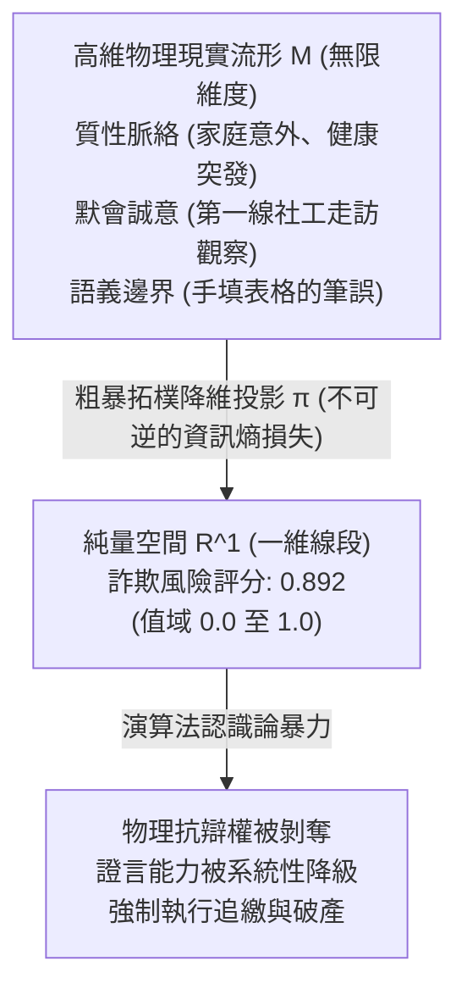
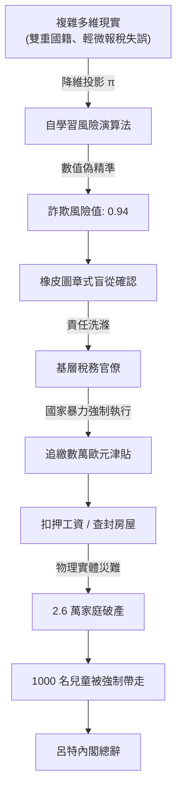

+++
title = "偽精準與認識論暴力：論官僚演算法對物理實體的降維霸權"
date = "2026-09-18T06:33:02+08:00"
author = "梅乾"
draft = false
isCJKLanguage = true
description = "官僚演算法把無限維的人類生活投影成小數點後三位的風險分數，並以此剝奪抗辯。本文以荷蘭托兒津貼醜聞為標本，說明偽精準如何升級為認識論暴力。"
tags = [
    "分析論述", # term:AnalyticalEssay
    "認識論暴力", # term:EpistemicViolence
    "數值偽精準", # term:SpuriousPrecision
    "純量指標", # term:ScalarMetrics
    "古哈特定律", # term:GoodhartSLaw
    "坎貝爾定律", # term:CampbellSLaw
    "人在迴路", # term:HumanInTheLoop
    "責任去中心化洗滌槽", # term:MoralCrumpleZone
  ]
series = ["演算法社會：物質病理、認識論衰變與自噬拓樸"]
[ai_info]
    [ai_info.generation]
        model = "Gemini 3.8 Flash"
        agent = "Antigravity IDE 2.5.5"
    [ai_info.refinement]
        model = "Grok 4.6"
        agent = "GitHub Copilot Chat v0.66.0"
+++

<!--more-->

## 導言

在現代科層官僚體系與數位治理的結合過程中，最普遍也最具破壞力的意識形態，莫過於對**「**純量指標**（Scalar Metrics） <!-- term:ScalarMetrics -->」與「**數值偽精準**（Spurious Precision） <!-- term:SpuriousPrecision -->」**的病態狂熱。

> [!IMPORTANT]
> **純量指標** <!-- term:ScalarMetrics --> (Scalar Metrics): 將無限維社會脈絡強制投影到一維可排序實數，以便科層機器消化的度量形式。 <!-- anchor:ScalarMetrics -->
> **數值偽精準** <!-- term:SpuriousPrecision --> (Spurious Precision): 以高解析度純量分數偽裝客觀性，掩蓋降維投影造成的資訊損失與責任外包。 <!-- anchor:SpuriousPrecision -->

從公共福利審查、信用評分、犯罪風險評估到員工績效度量，官僚機器始終面臨著一個根本性的治理矛盾：客觀物理世界與人類社會生活充滿了無限維度的複雜性、**脈絡相依性**（Context-Dependency） <!-- term:ContextDependency -->與質性微光；而中央集權的科層行政，卻只能消化經過標準化清洗、可排序且可計算的純量數據。

> [!IMPORTANT]
> **脈絡相依性** <!-- term:ContextDependency --> (Context-Dependency): 社會事實的意義綁定於不可完全結構化的在地脈絡，無法被純量獨立承載。 <!-- anchor:ContextDependency -->

為了解決這一矛盾，現代治理廣泛引入黑箱演算法，將原本需要深入質性調查的複雜現實，粗暴地投射（Project）為一個介於 0 與 1 之間的機率評分——例如「詐欺風險係數：0.892」。

這種看似高度科學、客觀且具備極致精準度（小數點後三位）的數值輸出，實質上發動了一場深刻的**「**認識論暴力**（Epistemic Violence） <!-- term:EpistemicViolence -->」**。哲學家米蘭達·弗里克（Miranda Fricker）指出，**認識論不公**（Epistemic Injustice） <!-- term:EpistemicInjustice -->的核心在於「**證言不公**（Testimonial Injustice） <!-- term:TestimonialInjustice -->」——某個主體的發聲與陳述，僅僅因為其身處的制度劣勢地位，而被系統性地剝奪了可信度。

> [!IMPORTANT]
> **認識論暴力** <!-- term:EpistemicViolence --> (Epistemic Violence): 以演算法評分剝奪主體證言可信度與物理抗辯權，使質性生活被定性為無效噪聲。 <!-- anchor:EpistemicViolence -->
> **認識論不公** <!-- term:EpistemicInjustice --> (Epistemic Injustice): 因制度位置而使主體證言被系統性降級、喪失被聽見資格的認識論傷害。 <!-- anchor:EpistemicInjustice -->
> **證言不公** <!-- term:TestimonialInjustice --> (Testimonial Injustice): 說話者因制度偏見而被系統性降低信用權重的認識論傷害。 <!-- anchor:TestimonialInjustice -->

當演算法看板打出高風險標籤時，官僚體系立即將舉證責任完全倒置給無權無勢的個體。個體的真實生活歷史、不可替代的物理證據與痛苦呼喊，在小數點後三位的冷酷數字面前被全數定性為「無效的噪聲」。原本旨在保護人權的正當程序（Due Process），被退化為官僚對演算法建議進行機械式確認的「橡皮圖章儀式」。

本文旨在證明：數值偽精準 <!-- term:SpuriousPrecision -->本質上是官僚體系為了推卸行政調查成本、規避政治責任而發明的「認識論遮羞布」。當多維度的物理實體被強制降維為一維純量指標 <!-- term:ScalarMetrics -->時，**古哈特定律**（Goodhart's Law） <!-- term:GoodhartSLaw -->與**坎貝爾定律**（Campbell's Law） <!-- term:CampbellSLaw -->必然觸發系統性失真，最終演變為一場由演算法驅動、國家暴力執行、毀滅成千上萬無辜生命的制度化暴政。

> [!IMPORTANT]
> **古哈特定律** <!-- term:GoodhartSLaw --> (Goodhart's Law): 當一項度量變成目標時，它便不再是好的度量；官僚演算法把代理變數當成犯罪傾向本身。 <!-- anchor:GoodhartSLaw -->
> **坎貝爾定律** <!-- term:CampbellSLaw --> (Campbell's Law): 定量社會指標一旦用於決策，就越容易被腐化並扭曲其原本要監控的社會進程。 <!-- anchor:CampbellSLaw -->

## 分析

### 一、高維現實的拓樸降維與資訊熵破壞

要從第一性原理理解認識論暴力 <!-- term:EpistemicViolence -->，必須先解析官僚演算法在數學拓樸上的本質操作。

人類社會的真實運作，是一個定義在無限維流形 $\mathcal{M}_{\text{life}}$ 上的高度非線性動態系統。一個家庭是否真誠申領福利、一個員工是否對團隊做出實質貢獻，取決於健康狀況、親屬照護、意外變故、在地社群互助等無數無法被完全結構化的質性變數。

官僚演算法所執行的操作，是一個極端激進的**降維映射**（Dimensionality Reduction Projection） <!-- term:DimensionalityReductionProjection -->：
$$\pi: \mathcal{M}_{\text{life}} \to \mathbb{R}^1, \quad \mathbf{x} \mapsto s \in [0, 1]$$

> [!IMPORTANT]
> **降維映射** <!-- term:DimensionalityReductionProjection --> (Dimensionality Reduction Projection): 把無限維生活流形投影到一維分數，造成不可逆資訊熵損失的官僚操作。 <!-- anchor:DimensionalityReductionProjection -->

在圖論與微分幾何的視角下，這種映射造成了兩個不可逆的數學災難：

1. **同倫拓樸的撕裂與資訊熵的毀滅性損失**：在流形 $\mathcal{M}_{\text{life}}$ 上原本相距極遠、具有本質區別的兩個狀態——例如「一位因重病而漏填收入申報附件的誠實母親」與「一個跨國洗錢團伙的專業騙保代辦」——在粗暴的投影函數 $\pi$ 下，極可能因為「填表延遲天數」與「雙重國籍」等代理變數（Proxies），被映射到一維數軸上的完全相同點（$s = 0.91$）；
2. **偽精準的**幻覺**（Hallucination） <!-- term:Hallucination -->效應**：將複雜脈絡壓縮為連續實數後，系統給予該數值小數點後多位的表象（如 0.8923）。在人類心理學與官僚認知中，高解析度（High Resolution）常被盲目等同於高精確度（High Accuracy）。數字的微觀刻度，賦予了官僚一種虛妄的「控制感」與「科學神聖感」，從而徹底免除了官僚親自前往現場進行調查的倫理焦慮。

> [!IMPORTANT]
> **幻覺** <!-- term:Hallucination --> (Hallucination): 大型語言模型在面對不實或矛盾資訊時，生成不符合客觀現實或超出脈絡之回應的錯誤現象。 <!-- anchor:Hallucination -->

### 二、古哈特定律與坎貝爾定律的雙重異化

當一維純量評分被官僚機構正式確立為績效考核與資源分配的核心指標時，社會科學中的兩大定律必然無情生效：

- **古哈特定律** <!-- term:GoodhartSLaw -->：「當一項度量指標變成目標時，它便不再是一項好的度量指標」；
- **坎貝爾定律** <!-- term:CampbellSLaw -->：「在社會決策中使用的定量社會指標越多，該指標就越容易受到腐化壓力的影響，並越容易扭曲和腐化其原本旨在監控的社會進程」。

官僚演算法的運作邏輯，精準體現了這兩大定律的毀滅性聯動：

#### 1. 代理變數的自肥與偏見鎖定

在真實世界中，「詐欺傾向」是無法直接測量的隱變數（Latent Variable）。演算法工程師不得不依賴容易獲取的數位足跡作為代理變數（如申報修改次數、郵件回覆速度、居住地郵遞區號、族裔與國籍背景）。

一旦演算法被部署，官僚體系為了展示「反詐欺成效」，必然要求系統每季度交出更多的案件指標。為了迎合這一目標，演算法開始在代理變數上進行極致的模式過擬合（Overfitting）：
> **指標異化公理（Indicator Alienation Axiom）**：
> 演算法強行將低成本代理特徵分佈 $\mathbf{x}_{\text{proxy}}$ 映射為犯罪傾向的後驗機率，實質上以統計相關性暴力置換了客觀因果鏈，在行政拓樸上將「具有特定邊緣特徵的弱勢個體」直接等同於「潛在犯罪者」。

#### 2. 認識論回音室（Epistemic Echo Chamber）

更為致命的是，這套系統具備內生的自我驗證閉環：
- 系統給特定群體打上高風險標籤；
- 官僚依據標籤對該群體展開掘地三尺的侵入式審查；
- 在嚴苛的審查下，任何輕微的行政瑕疵（如單據發票破損）皆被定性為詐欺；
- 官僚將這些「戰果」重新作為真實標註數據（Ground Truth）餵回演算法；
- 演算法的偏見被進一步強化，輸出更高的風險權重。

物理世界的真實反饋迴路在此被徹底掐斷。系統不再反映現實，而是利用行政暴力，強行將現實塑造成符合演算法偏差的模樣。

### 三、橡皮圖章式的形式在環：官僚責任的拓樸轉移

面對公眾與人權團體對自動化決策的質疑，現代組織與政府最常祭出的防禦修辭是「**人在迴路**（Human-in-the-Loop, HITL） <!-- term:HumanInTheLoop -->」：「我們的系統不是全自動的，最終處分決定均由具備專業資格的人類審查員審批」。

> [!IMPORTANT]
> **人在迴路** <!-- term:HumanInTheLoop --> (Human-In-The-Loop): 人類節點對自動化決策保留實質否決與阻尼的控制條件，而非形式性的一鍵通過。 <!-- anchor:HumanInTheLoop -->

然而，在組織拓樸學中，這種制度安排非但沒有提供實質的人性保護，反而構成了一種更加精密的**「**責任去中心化洗滌槽**（Moral Crumple Zone） <!-- term:MoralCrumpleZone -->」**。

> [!IMPORTANT]
> **責任去中心化洗滌槽** <!-- term:MoralCrumpleZone --> (Moral Crumple Zone): 人在迴路被設計成吸收政治責難的緩衝區，而非具備實質否決權的控制節點。 <!-- anchor:MoralCrumpleZone -->

在實際的行政流水線中，人類審查員面臨著極端的非對稱約束：
1. **認知超載與配額壓迫**：一名基層公務員被分配每天必須覆核 80 至 120 宗案件，平均每宗案件僅有 3 到 5 分鐘的閱讀時間。在如此微小的時間窗口內，審查員根本不可能重新核驗演算法背後的複雜事實鏈；
2. **不對稱的政治風險成本**：
   - 若審查員**推翻**演算法的高風險警報，放行了某個個案，一旦事後被上級抽查出任何微小瑕疵，審查員個人將承擔嚴重的失職懲戒；
   - 若審查員**順從**演算法的指示，簽署裁決書，即便事後證明屬於冤假錯案，審查員亦可辯稱「我只是依據系統官方評估辦理」，責任被成功稀釋給不可見的軟體程式碼。

在這種博弈結構下，理性的人類審查員必然選擇「100% 盲從演算法」。HITL 的存在，其真實功能不是為了糾偏，而是為這套冷酷的黑箱操作披上一層「程序合法」與「人類主權仍在」的法律偽裝。

### 四、歷史個案解剖：荷蘭托兒津貼醜聞的演算法暴政

歷史上將「數值偽精準 <!-- term:SpuriousPrecision -->、認識論暴力 <!-- term:EpistemicViolence -->與橡皮圖章官僚」演繹至最慘烈極致的國家級標本，當屬爆發於 2013 年至 2021 年的**荷蘭托兒津貼醜聞（Toeslagenaffaire）**。

#### 1. 系統性偏見的演算法化：自學習風險模型的引入

在 2010 年代初期，荷蘭稅務與海關總署（Belastingdienst）在政府全面縮減預算、推動「精益數位政府」的號召下，決定引入一套基於**機器學習**（Machine Learning） <!-- term:MachineLearning -->的自學習風險評估演算法，專門用於監控數十萬領取托兒津貼的家庭是否存在詐欺行為。

> [!IMPORTANT]
> **機器學習** <!-- term:MachineLearning --> (Machine Learning): 先界定可選函數的範圍，再以資料估計其中參數的建模方法。 <!-- anchor:MachineLearning -->

稅務官員與演算法開發者在這套黑箱模型中，悄悄嵌入了極具歧視性的特徵變數：
- 是否持有**雙重國籍（Dual Nationality）**；
- 是否為低收入移民家庭；
- 托兒機構的郵遞區號；
- 過去是否有過微小的報稅補正紀錄。

模型輸出一個精準至小數點的風險評分。只要評分超過特定閾值，該家庭即被系統自動標記為「極可能蓄意騙保（Intentional Fraud）」。

#### 2. 行政裁量權的死滅與反證權的全面剝奪

當演算法輸出高風險標籤後，荷蘭稅務局啟動了一場冷酷的行政清洗。

稅務局採納了一種極端嚴苛的「全有或全無（All-or-Nothing）」裁量標準：一旦某個家庭被演算法標記，稅務局便要求其在極短期限內提交過去數年所有的托兒合約、工時證明與銀行繳費水單。

只要家長在厚達數百頁的單據中，遺漏了一張發票、缺少了一個簽名，或者托兒費用有 10 歐元的計算誤差，稅務官僚便依據演算法的預設判斷：**「該家庭構成惡意詐欺」**。

此時，行政法體系中的**比例原則**（Proportionality Principle） <!-- term:Proportionality -->與抗辯權被徹底撕碎：
- 稅務局不由分說地要求受害家庭**全額退還過去數年領取的所有托兒津貼**，金額往往高達 3 萬至 10 萬歐元；
- 系統剝奪了這些家庭分期償還或申請法律援助的資格，直接由演算法自動通知雇主扣押工資、凍結銀行帳戶、查封房產；
- 當受害家長親自前往稅務局辦公室痛哭申訴、出示孩子真實入托的照片與老師證言時，基層官僚冷漠地指向電腦螢幕：「系統已經判定你有高詐欺風險，我們無法更改」。

> [!IMPORTANT]
> **比例原則** <!-- term:Proportionality --> (Proportionality): 治理流程的繁簡程度應與變更影響範圍及風險大小相匹配的設計原則。 <!-- anchor:Proportionality -->

在這一過程中，人類公民的肉身經驗在數位純量面前被完全剝奪了認識論合法性。

#### 3. 社會災難與內閣集體總辭

這場由演算法驅動的迫害，在荷蘭社會內部引爆了長達數年的毀滅性人道災難：
- 超過 **26,000 個家庭** 被逼入破產絕境；
- 數千對夫妻在沈重的債務與精神折磨下婚姻破裂；
- 超過 **1,000 名無辜兒童** 因父母被強制扣押財產導致家庭貧困，被荷蘭兒童保護機構強制帶走、送入寄養家庭，造成骨肉分離的終生創傷；
- 至少數十名受害家長因無法承受污名與絕望而選擇自殺。

荷蘭最高行政法院（國務委員會行政審判庭，Afdeling bestuursrechtspraak van de Raad van State）在此案中扮演了長期的失職角色，盲目採信稅務局的電腦報告，駁回了數千起家長的合法上訴。

直到 2020 年底，荷蘭議會特別調查委員會發布了題為**《前所未有的不公正（Ongekend Onrecht）》**的重磅調查報告，這場被掩蓋近十年的演算法暴政才徹底曝光。報告以無可辯駁的事實證明：稅務局的演算法存在嚴重的種族歧視，整個官僚機構在長達數年的時間裡，以自動化為盾牌，系統性地踐踏了法治國家（Rechtsstaat）的根本底線。

2021 年 1 月 15 日，面對排山倒海的公憤與道德譴責，荷蘭首相馬克·呂特（Mark Rutte）率領全體第三屆內閣宣布**集體總辭**；最高行政法院院長公開向全體國民致歉；荷蘭資料保護局（AP）對稅務局開出了數百萬歐元的歷史級巨額罰單。

## 結論

荷蘭托兒津貼醜聞不是某個演算法軟體的單純漏洞（Bug），而是**現代數位官僚體系對客觀物理世界發動認識論暴力 <!-- term:EpistemicViolence -->的必然終局**。

當組織與國家為了追求極致的行政效率與成本外包，將活生生的人類生活壓縮為冰冷的純量數值時，它便徹底摧毀了正義賴以存在的質性基礎。偽精準的背後是絕對的冷漠，小數點後三位的精準度掩蓋的是對人類尊嚴的徹底踐踏。

要破除演算法對物理實體的降維霸權，未來的法律體系與公共治理必須建立不可妥協的「認識論憲章」：
1. **確立法定的反降維抗辯權（Right to Contest Dimensionality Reduction）**：任何公民或員工在面對演算法的不利評估時，享有法定權利要求系統暫停執行，並強制要求人類調查官在場聆聽其質性脈絡與實體證言；
2. **嚴禁將敏感**身分**（Identity） <!-- term:Identity -->變數作為風險代理**：在法律層面徹底禁止將國籍、族裔、居住地等結構性弱勢特徵納入任何公共資源分配或執法預測模型，斬斷偏見的自反性強化迴圈；
3. **終結橡皮圖章免責體系**：明確定性「在缺乏實質調查時間與權限情況下對演算法輸出進行的機械式簽批」不具備合法行政處分效力，追究主管官員以「技術中立」為名推卸**注意義務**（Duty Of Care） <!-- term:DutyOfCare -->的法律責任；
4. **重建公共演算法的完全可解釋性與開源審計**：任何用於公權力行使的演算法，其特徵權重、訓練數據源與決策邏輯必須對全體公眾完全透明，接受獨立人權機構與法學界的常態化對抗審計。

> [!IMPORTANT]
> **身分** <!-- term:Identity --> (Identity): 系統元件在架構中宣告的核心職責與自我定位。 <!-- anchor:Identity -->
> **注意義務** <!-- term:DutyOfCare --> (Duty Of Care): 受託人須以合理謹慎作成知情決策的義務。 <!-- anchor:DutyOfCare -->

唯有捍衛人類生活經驗超越純量數字的不可約簡性，我們才能在數位利維坦的凝視下，守護住法治國家的最後尊嚴與人性的溫暖。

## 參考文獻

1. Fricker, M. (2007). *認識論不公 <!-- term:EpistemicInjustice -->: Power and the Ethics of Knowing*. Oxford University Press.
2. Campbell, D. T. (1979). *Assessing the impact of planned social change*. Evaluation and Program Planning, 2(1), 67-90.
3. Goodhart, C. A. E. (1984). *Problems of Monetary Management: The U.K. Experience*. In Monetary Theory and Practice (pp. 91-121). Palgrave Macmillan.
4. Tweede Kamer der Staten-Generaal. (2020). *Ongekend onrecht: Verslag van de Parlementaire ondervragingscommissie Kinderopvangtoeslag*. POK, Kamerstuk 35 510, nr. 2.
5. O'Neil, C. (2016). *Weapons of Math Destruction: How Big Data Increases Inequality and Threatens Democracy*. Crown.
6. Scott, J. C. (1998). *Seeing Like a State: How Certain Schemes to Improve the Human Condition Have Failed*. Yale University Press.
7. Eubanks, V. (2018). *Automating Inequality: How High-Tech Tools Profile, Police, and Punish the Poor*. St. Martin's Press.
8. Benjamin, R. (2019). *Race After Technology: Abolitionist Tools for the New Jim Code*. Polity.
9. Citron, D. K. (2007). *Technological Due Process*. Washington University Law Review, 85(6), 1249-1313.
10. Autoriteit Persoonsgegevens. (2020). *Verwerking van nationaliteit van aanvragers van kinderopvangtoeslag*. Onderzoeksrapport Belastingdienst/Toeslagen.
11. Pasquale, F. (2015). *The Black Box Society: The Secret Algorithms That Control Money and Information*. Harvard University Press.
12. Supiot, A. (2017). *Governance by Numbers: The Making of a Legal Model of Allegiance*. Hart Publishing.