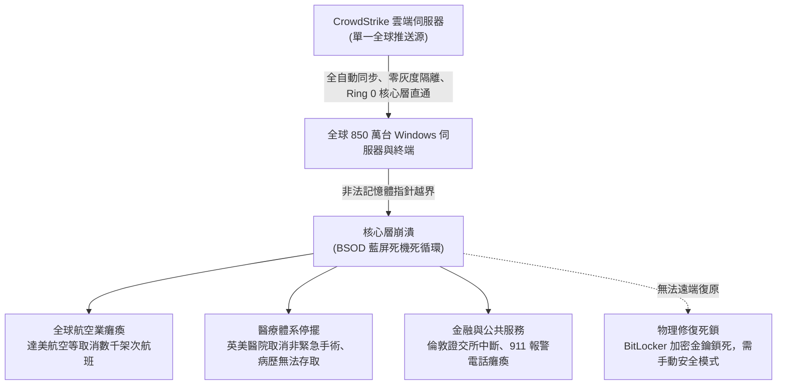

+++
title = "零冗餘的致命脆性：論全球技術供應鏈的超音速牛鞭效應"
date = "2026-09-18T06:34:03+08:00"
author = "梅乾"
draft = false
isCJKLanguage = true
description = "精益與及時制剃掉工程冗餘後，供應鏈對微小擾動的耐受力歸零。本文以 CrowdStrike 世紀當機為標本，說明超音速牛鞭如何把局部缺陷放大成全域休克。"
tags = [
    "分析論述", # term:AnalyticalEssay
    "超音速牛鞭效應", # term:SupersonicBullwhipEffect
    "超脆性", # term:HyperFragility
    "及時制", # term:JustInTime
    "單一來源採購", # term:SingleSourcing
    "共模故障", # term:CommonModeFailure
    "驚群效應", # term:ThunderingHerd
    "數位營運韌性法案", # term:DigitalOperationalResilienceAct
  ]
series = ["演算法社會：物質病理、認識論衰變與自噬拓樸"]
[ai_info]
    [ai_info.generation]
        model = "Gemini 3.8 Flash"
        agent = "Antigravity IDE 2.5.5"
    [ai_info.refinement]
        model = "Grok 4.6"
        agent = "GitHub Copilot Chat v0.66.0"
+++

<!--more-->

## 導言

在當代全球化與金融資本主義的統治範式下，「精益（Lean）」、「**及時制**（Just-In-Time, JIT） <!-- term:JustInTime -->」與「極致資本回報率（ROIC）」被管理學界奉為不可動搖的最高圖騰。半個世紀以來，跨國科技巨頭與顧問機構不遺餘力地推動一場激進的「組織去脂手術」：視所有庫存為浪費，視所有備份系統為無謂的折舊包袱，視所有工程冗餘（Redundancy）與組織彈性（Slack）為阻礙資本高效流轉的**摩擦力**（Friction） <!-- term:Friction -->。

> [!IMPORTANT]
> **及時制** <!-- term:JustInTime --> (Just-In-Time): 以零庫存與移動中庫存極大化資本回報，同時剝除吸收衝擊的物理阻尼。 <!-- anchor:JustInTime -->
> **摩擦力** <!-- term:Friction --> (Friction): 流程中的阻力或成本；在約束系統中也可能是失敗點正在生效的可感知表現。 <!-- anchor:Friction -->

然而，當這套消滅一切緩衝區的精益教條，與現代高度集中、深度互聯的數位軟體與半導體供應鏈深度嵌合時，一個毀滅性的拓樸特徵浮現出來：**系統對任何微小擾動的耐受力被徹底歸零，演化為極端的「**超脆性**（Hyper-Fragility） <!-- term:HyperFragility -->」**。

> [!IMPORTANT]
> **超脆性** <!-- term:HyperFragility --> (Hyper-Fragility): 消滅緩衝與冗餘後，系統對任何微小擾動的耐受力歸零的拓樸狀態。 <!-- anchor:HyperFragility -->

納西姆·塔雷伯（Nassim Nicholas Taleb）在《反脆弱》中深刻指出：「追求極致的效率，必然以犧牲系統的生存能力為代價」。在複雜系統拓樸中，冗餘並非未被充分利用的閒置資本，而是系統抵禦黑天鵝衝擊、吸收未知衝擊波的「認識論阻尼與物理避震器」。

更致命的是，當供應鏈的排程、庫存分配、威脅檢測與軟體更新被全面交付給自動化演算法時，傳統經濟學中的「**牛鞭效應**（Bullwhip Effect） <!-- term:BullwhipEffect -->」發生了相變。原本需要數週甚至數月才能沿著供應鏈傳遞的供需扭曲與震盪，在光纖網路、雲端同步與核心層（Ring 0）自動推送的推波助瀾下，被壓縮至微秒與秒級反應——演變為破壞力摧枯拉朽的**「**超音速牛鞭效應**（Supersonic Bullwhip Effect） <!-- term:SupersonicBullwhipEffect -->」**。

> [!IMPORTANT]
> **牛鞭效應** <!-- term:BullwhipEffect --> (Bullwhip Effect): 下游微小波動沿供應鏈逐級放大；在零時延自動化下相變為超音速共振。 <!-- anchor:BullwhipEffect -->
> **超音速牛鞭效應** <!-- term:SupersonicBullwhipEffect --> (Supersonic Bullwhip Effect): 全自動即時管道把供應鏈震盪壓縮到秒級，局部微小錯誤無阻尼放大為全域休克。 <!-- anchor:SupersonicBullwhipEffect -->

本文旨在證明：現代技術供應鏈在消滅冗餘的狂熱中，已經退化為一個高度中心化、無阻尼且高度共振的脆弱圖譜。單一節點的微小擾動不再能被局部隔離，而是會在極短時間內沿著單一依賴鏈引爆全域相變，導致全球關鍵基礎設施在瞬間陷入不可逆的多米諾骨牌式癱瘓。

## 分析

### 一、精益教條與冗餘剝離的拓樸代價

要理解超脆性 <!-- term:HyperFragility -->的根源，必須從網路拓樸學的角度審視「精益管理」對系統結構的實質破壞。

在圖論與網路可靠性理論中，一個系統抵禦隨機故障與針對性攻擊的能力，取決於其**「頂點連通度（Vertex Connectivity）」**與**「雙連通分量（Biconnected Components）」**的密度。若一個網路具備高度的結構冗餘，即在任意兩個關鍵節點之間存在多條邊不相交路徑（Edge-disjoint Paths），當其中某一條路徑或某個中間節點中斷時，流動性（封包、物流或電力）能透過替代路徑迅速完成動態旁路（Bypass）。

然而，金融資本主義的最佳化函數（Optimization Function）與系統可靠性背道而馳：
$$\max_{\mathbf{G}} \text{ROIC} = \frac{\text{NOPAT}}{\text{Invested Capital}}$$

為了極大化分母中的資本報酬率，財務工程師對供應鏈網路實施了系統性的「拓樸修剪」：
1. **多重路徑的惡意剪除**：將原本向三家不同供應商分散採購的模式，整合為向單一報價最低的龍頭供應商進行「**單一來源採購**（Single-Sourcing） <!-- term:SingleSourcing -->」；
2. **安全庫存的完全歸零**：將實體倉庫替換為行駛在公路上或貨輪上的「**移動中庫存**（Inventory In Transit） <!-- term:InventoryInTransit -->」；
3. **基礎架構的極致集中**：全球成千上萬家企業放棄自建資料中心與內部異地備援，將所有運算負載打包遷移至少數幾家超大規模公有雲服務商（Hyperscalers）。

> [!IMPORTANT]
> **單一來源採購** <!-- term:SingleSourcing --> (Single-Sourcing): 把多重路徑修剪為單一最低價供應商，使關鍵流動懸繫於單點故障。 <!-- anchor:SingleSourcing -->
> **移動中庫存** <!-- term:InventoryInTransit --> (Inventory In Transit): 以在途貨物取代實體安全庫存，使緩衝從可調度存量變成不可即用的運輸狀態。 <!-- anchor:InventoryInTransit -->

在拓樸演化上，網路結構從具備豐富局部環路與網狀交織的「網狀圖（Mesh Graph）」，被強行修剪為一個高度中心化、極度依賴少數超級樞紐的**「**星狀樹狀圖**（Star/Tree Topology） <!-- term:StarTreeTopology -->」**。

> [!IMPORTANT]
> **星狀樹狀圖** <!-- term:StarTreeTopology --> (Star/Tree Topology): 網狀冗餘被修剪後，流動完全依賴少數樞紐與割點的退化網絡結構。 <!-- anchor:StarTreeTopology -->

在這種退化的拓樸中，樞紐節點（Hubs）的度數（Degree）極高，而介數中心性（Betweenness Centrality）呈現極端的極化分佈。系統的平均路徑長度雖然縮短了（體現為表面營運成本的降低），但網路的「**臨界割點集合**（Critical Cut Vertices） <!-- term:CriticalCutVertices -->」急劇擴大。整個全球數位文明的存續，實質上懸繫於少數幾個不可替代的單點故障（Single Points of Failure, SPOF）之上。

> [!IMPORTANT]
> **臨界割點集合** <!-- term:CriticalCutVertices --> (Critical Cut Vertices): 一旦移除即令網絡分裂的頂點集合，其擴大意味單點故障面急劇膨脹。 <!-- anchor:CriticalCutVertices -->

### 二、超音速牛鞭效應：演算法同步引爆的共振風暴

在傳統實體製造業中，牛鞭效應 <!-- term:BullwhipEffect -->指的是：下游終端需求微小的波動，沿著分銷商、批發商、製造商向供應鏈上游傳遞時，由於預測偏差、批量訂購與資訊傳遞延遲，震盪幅度會被逐級放大。然而，在古典時代，由於存在實體紙本審批、人類採購員的電話核對與船運物流的時間阻尼，這種波動的傳播週期是以「月」或「季度」計，系統仍保留了充足的人類干預與修正時間。

但當整個供應鏈的資訊流被**「全自動化即時管道（Real-time Automated Pipelines）」**貫通時，系統動力學發生了本質上的突變。

考慮一個具備自動化更新機制的軟體與服務供應鏈。定義節點 $i$ 在時間 $t$ 的狀態更新為 $s_i(t)$。在傳統阻尼系統中，狀態傳播具備空間擴散時延 $\tau_{ij} > 0$：
$$s_i(t) = f\left(s_i(t-1), \sum_{j \in \mathcal{N}(i)} w_{ij} s_j(t - \tau_{ij})\right)$$

在當代雲端原生架構與安全防護體系中，為了追求「零日漏洞防禦（Zero-Day Protection）」，軟體供應商引入了自動推送技術，強制將傳播延遲壓縮至極限：$\tau_{ij} \to 0$。

從控制系統頻域分析的角度來看，閉環系統的傳遞函數為：
$$H(s) = \frac{G(s)}{1 + G(s) K(s)}$$
當工程師為了消除靜態偏差，不斷提高控制增益 $K(s)$ 並切除相位延遲時，系統的高頻極點將迅速跨越虛軸，移向不穩定的右半平面。在波特圖（Bode Plot）上，系統在特定共振頻率 $\omega_r$ 處出現巨大的諧振峰（Resonance Peak）：
$$\lim_{\tau \to 0, K \to \infty} |H(j\omega_r)| = \infty$$

與此同時，由於全球企業廣泛採用完全同質化的軟體堆疊（如全球超過 70% 的跨國企業終端均運行同一套作業系統與同一家安全套件），節點之間的耦合權重 $w_{ij}$ 被人為鎖定為完全同步的剛性矩陣。

其產生的致命後果是**「超音速共振坍塌」**：
- 一個帶有缺陷的微小邏輯更新，在幾秒鐘之內跨越全球各大洲，無阻尼地穿透數百萬台伺服器與終端；
- 各個節點的自動化故障防護機制在遭遇異常時，同時觸發崩潰重啟；
- 數百萬台機器的同時崩潰重啟，又向上游網路基礎設施發起天文數字的 DNS 查詢與**身分**（Identity） <!-- term:Identity -->驗證請求，引爆自我拒絕服務攻擊（Self-Inflicted DDoS）；
- 原本設計用於保護系統的自動化機制，轉化為在毫秒級時間尺度內摧毀整個生態系統的超音速震盪波。

> [!IMPORTANT]
> **身分** <!-- term:Identity --> (Identity): 系統元件在架構中宣告的核心職責與自我定位。 <!-- anchor:Identity -->

### 三、公有雲單一栽培與可用區的認識論假象

在雲端運算時代，企業董事會與技術主管常被公有雲巨頭的行銷話術所安撫：「我們採用了多可用區（Multi-Availability Zone, Multi-AZ）與多地域部署（Multi-Region Deployment），具備極高的容災能力」。

然而，在分散式系統拓樸學中，這種「多可用區容災」往往只是一種危險的認識論假象：
1. **控制平面的全域單點（Global Control Plane SPOF）**：儘管各個可用區在物理機房與供電上彼此隔離，但它們共用同一個全域身分 <!-- term:Identity -->認證系統（IAM）、同一個域名解析中樞（DNS）與同一套軟體定義網路（SDN）控制平面。一旦控制平面的程式碼或配置發生邏輯性損壞，所有看似獨立的可用區將在數微秒內同時休克；
2. **共模故障（Common-Mode Failure） <!-- term:CommonModeFailure -->的盲目忽略**：當全球數十萬家企業同時將容器編排、日誌收集與安全監控外包給同一個雲端平台時，整個世界的數位基礎設施形成了一個前所未有的「超大規模**單一栽培**（Monoculture） <!-- term:Monoculture -->生態」。系統不再具有生物多樣性，任何針對單一架構的擾動，都將演變為跨越所有行業的全域性系統崩潰；
3. **自癒演算法引發的「**驚群效應**（Thundering Herd Problem） <!-- term:ThunderingHerd -->」**：當某個區域發生網路抖動時，自動擴展演算法（Auto-scaler）會在瞬間向其他區域申請數以萬計的新虛擬機實例，瞬間抽乾雲端資源池，將局部的暫態故障迅速擴散為跨地域的連環雪崩。

> [!IMPORTANT]
> **共模故障** <!-- term:CommonModeFailure --> (Common-Mode Failure): 看似隔離的節點共用同一控制平面或軟體堆疊，因而同時休克的故障模式。 <!-- anchor:CommonModeFailure -->
> **單一栽培** <!-- term:Monoculture --> (Monoculture): 代碼風格、依賴與軟體堆疊趨同後，抗病力與多樣性同時枯竭的生態狀態。 <!-- anchor:Monoculture -->
> **驚群效應** <!-- term:ThunderingHerd --> (Thundering Herd): 自動擴展在局部抖動時同步搶資源，把暫態故障擴散為跨地域雪崩。 <!-- anchor:ThunderingHerd -->

### 四、歷史個案解剖：CrowdStrike 世紀當機與半導體物理咽喉

歷史在 2024 年以一場席捲全球的現實海嘯，為「零冗餘與超音速牛鞭效應 <!-- term:SupersonicBullwhipEffect -->」寫下了最震撼的屍檢報告。

#### 1. CrowdStrike Falcon 世紀大當機：Ring 0 核心層的連環雪崩

2024 年 7 月 19 日，全球雲端安全巨頭 CrowdStrike 向其核心產品「Falcon Sensor」推送了一個常規的感測器配置更新文件（Channel File 291）。

在軟體工程架構中，Falcon Sensor 擁有最高特權的作業系統「核心層（Ring 0）」存取權限。Ring 0 是現代計算架構的聖殿，直接控制 CPU、記憶體與硬體中斷，任何在此層級發生的未捕獲記憶體指針異常，將直接觸發微軟 Windows 系統的「藍屏死機（Blue Screen of Death, BSOD）」。

當日協調世界時（UTC）04:09，CrowdStrike 的自動化發布系統將一個存在邏輯缺陷、大小僅數十 KB 的通道文件，未經任何分階段灰度發布（Canary Deployment），亦未給客戶任何手動延遲更新的選擇窗口，直接透過雲端管道全球強制同步：

其連鎖反應以「超音速」在全球拓樸中炸裂：
- 在短短數十分鐘內，全球超過 **850 萬台運行 Windows 的關鍵伺服器與工作站** 陷入無限重啟的藍屏死循環；
- **全球航空網路瞬間休克**：達美航空（Delta Air Lines）、聯合航空、美航等巨頭全線停飛，行李分揀系統癱瘓，全球數千個航班取消，數十萬旅客滯留機場長達數日，單一航空公司損失高達數億美元；
- **醫療急救系統全面停擺**：英國國民保健署（NHS）與美國各大醫療中心的掛號與病歷數據庫癱瘓，醫生無法調取患者過敏史與電子病歷，大量重大心臟與腫瘤手術被迫緊急取消；
- **全球金融與公共服務中斷**：銀行 ATM 無法提款，倫敦證券交易所即時行情中斷，美國多個州的 911 緊急報警電話在數小時內無法接通。

更具諷刺意味的是，由於伺服器在開機初期便崩潰，遠端管理工具（如 SSH、RDP）完全失效；再加上企業普遍啟用了全磁碟加密（BitLocker），使得 IT 工程師無法透過網路遠端修復，必須由人類工程師親自帶著 USB 隨身碟，逐台前往世界各地的機房、機場登機門與醫院急診室，手動進入安全模式刪除特定驅動文件。

這場直接經濟損失高達數百億美元的世紀浩劫，血淋淋地證明：**當全球所有關鍵行業共用同一套缺乏冗餘的防護軟體，且允許該軟體具備超音速直通核心層的無阻尼更新權限時，人類現代文明的運轉，實質上脆弱得不堪一擊**。

#### 2. 半導體物理咽喉：ASML 與台積電的單點壟斷

如果說 CrowdStrike 展示了軟體邏輯層的超音速脆弱性，那麼現代半導體硬體供應鏈則展現了物理空間中更令人窒息的「極致單點依賴」：

| 咽喉節點 (Chokepoint) | 物理與技術壟斷特徵 | 全球替代彈性 (Slack) | 潛在單點中斷的系統後果 |
| :--- | :--- | :--- | :--- |
| **ASML 極紫外光刻機 (EUV)** | 荷蘭 Veldhoven 總部組裝；整合德國蔡司鏡頭、美國 Cymer 光源與全球數萬特製零件 | **零（Zero Slack）** 全球唯一商用供應商，技術替代週期超過 15 年 | 全球 3nm/2nm 先進製程晶片製造即刻中斷，AI 與高階運算基礎設施完全停擺 |
| **台積電 (TSMC) 先進封裝** | 台灣新竹與台南晶圓廠；集中全球 90% 以上高階 GPU 與先進邏輯晶片的 CoWoS 封裝產能 | **極低（Near-Zero）** 異地重建同等良率晶圓廠需耗資數百億美元與 5-7 年 | 全球消費電子、伺服器、汽車與國防晶片供應鏈面臨毀滅性斷裂 |
| **特種電子化學品與光阻劑** | 日本信越化學、JSR、東京應化；掌握氟化聚醯亞胺與極紫外光阻劑的高純度配方 | **極度受限** 需跨越極高專利壁壘與數十年的化學製程工藝積累 | 單一出口管制或自然災害即可迫使全球先進半導體產線在數週內停工 |

在這一物理拓樸中，全球半導體產能被精準壓縮在西太平洋地質板塊交界處的狹長島嶼，以及歐洲幾處高度專精的精密實驗室中。為了追求每片晶圓極致的成本效益與良率，人類文明將全部的數位未來，押注在極少數無法承受任何地緣政治摩擦、地震海嘯或供應鏈中斷的超脆弱節點之上。

### 五、實體物流與海底光纖的幾何咽喉：從長賜輪擱淺到紅海斷纜

超脆性 <!-- term:HyperFragility -->不僅體現於軟體邏輯與半導體晶片，更深植於現代全球實體貿易與數據傳輸的物理地理幾何之中。

#### 1. 幾何瓶頸與全球物流休克：2021 年長賜輪（Ever Given）事件
在 2021 年 3 月，長達 400 米的超大型貨櫃輪「長賜輪」在埃及蘇伊士運河擱淺，將寬度僅數百公尺的單一航道徹底封堵長達六天。
在精益供應鏈的無庫存模型下，這場局部的幾何擱淺引爆了全球實體供應鏈的超音速震盪：
- 每天阻斷價值近 100 億美元的跨歐亞貨物往來；
- 由於歐美工廠全面取消了實體原料緩衝庫存，歐洲多家主要汽車組裝廠在航道封閉第四天即因「缺少單一零組件」而被迫全線停工；
- 港口自動化調度演算法在遭遇船期嚴重滯後時陷入混亂，引發全球主要貨櫃港長達數月的世紀大塞港與海運運價暴漲十倍的金融衝擊。

#### 2. 數位神經的物理脆弱性：海底光纖電纜集群
全球 99% 的跨洲網際網路數據傳輸，並非依賴衛星，而是仰賴沉浸在幽暗深海中的數百條海底光纖電纜。而在地理拓樸上，這些電纜高度集中於極少數淺海海峽（如馬六甲海峽、呂宋海峽、紅海曼德海峽與英吉利海峽）。
當商船船錨拖曳、海底地震或地緣衝突導致紅海多條跨洲核心電纜同時被切斷時，高達 25% 的歐亞即時網路流量在瞬間中斷。儘管路由協議具備動態尋路功能，但由於備用陸地電纜與繞道好望角的光纖頻寬早已被高頻交易與雲端同步佔滿，全球雲端基礎架構遭遇嚴重的封包遺失與延遲暴增。

這再次證明：現代文明將天量的資訊與物資流動，強行約束於極端狹窄的自然幾何通道中，任何試圖以「純演算法最佳化」掩蓋物理單點依賴的努力，在真實世界的物理擾動面前皆脆弱不堪。

### 六、全球法規重塑：從數位營運韌性法案（DORA）到關鍵依賴審計

面對超音速牛鞭效應 <!-- term:SupersonicBullwhipEffect -->對主權安全與實體經濟的巨大衝擊，全球監管機構開始從傳統的「事後處罰」轉向「事前強制韌性架構規制」。

最具代表性的是歐盟頒布的《**數位營運韌性法案**（Digital Operational Resilience Act, DORA） <!-- term:DigitalOperationalResilienceAct -->》以及《第二版網路與資訊系統安全指令（NIS 2）》：
1. **穿透第三方關鍵資訊服務商（Critical ICT Third-party Providers）**：金融機構與關鍵基礎設施不能再將責任完全推給外包雲端商，監管機構獲得直接審查超大規模雲端巨頭（AWS、Azure、GCP）與關鍵軟體供應商架構的法理授權；
2. **強制威脅引導的實戰紅隊測試（TLPT）**：要求核心企業定期進行全域斷網與雲端單點中斷的極端沙盒演練，證明其在失去主要供應商時具備自主切換的能力；
3. **單一依賴度上限規制作為法定約束**：法案明確要求受監管實體評估「**集中度風險**（Concentration Risk） <!-- term:ConcentrationRisk -->」，對於在單一外部供應商處集中超過特定門檻的業務，強制要求維持可驗證的替代服務協議或本地備份方案。

> [!IMPORTANT]
> **數位營運韌性法案** <!-- term:DigitalOperationalResilienceAct --> (Digital Operational Resilience Act): 要求關鍵實體評估集中度風險、接受第三方穿透監管並證明可切換能力的歐盟法。 <!-- anchor:DigitalOperationalResilienceAct -->
> **集中度風險** <!-- term:ConcentrationRisk --> (Concentration Risk): 關鍵業務過度集中於單一外部供應商，使局部故障具備系統性傳染力。 <!-- anchor:ConcentrationRisk -->

這標誌著法理拓樸的根本轉向：**冗餘不再是企業可以自由削減的內部成本，而是維護社會公共安全所必須承擔的法定責任**。

## 結論

零冗餘不是文明進步的標誌，而是金融資本對物理現實極度傲慢的體制性盲目。在將所有工程緩衝區與組織彈性變現為短期財報利潤的狂歡之後，人類構築起了一座由高度中心化程式碼、單點硬體與自動化光纖網路所支撐的「玻璃摩天大樓」。

超音速牛鞭效應 <!-- term:SupersonicBullwhipEffect -->的本質，是**控制論反饋速度超越了人類理性的感知與干預極限**。當我們賦予演算法在秒級時間尺度內重塑全域狀態的能力，卻剝奪了各個節點自我隔離、拒絕更新與維持本地獨立運行的能力時，任何微小的人為筆誤或惡意攻擊，都足以觸發文明級別的系統休克。

為了免於在下一場不可避免的全球共振風暴中徹底沉淪，現代系統工程與基礎設施治理必須發起一場「反精益的拓樸重建」：
1. **法理確立「**冗餘優先原則**（Mandatory Redundancy Standards） <!-- term:MandatoryRedundancyStandards -->」**：在民航、醫療、電網、通信與金融等關鍵基礎設施中，立法禁止任何單一軟體或雲端供應商市場佔有率超過 40%，強制實施**異質性雙架構**（Heterogeneous Dual-Stack） <!-- term:HeterogeneousDualStack -->常態熱備份；
2. **切除超音速推送鏈條，強制引入「物理灰度阻尼」**：嚴禁任何供應商直接向核心層（Ring 0）推送全域即時更新，法定要求所有底層配置變更必須經過長達數週的漸進式 Canary 驗證，並強制保留本地管理員手動延遲與否決的權力；
3. **推動去中心化與本地自治（Local Autonomy）**：終端系統必須具備在與母雲端完全斷網的極端情況下，至少維持 72 小時關鍵核心功能獨立運行的本地離線生存能力；
4. **改革會計與治理激勵機制**：將「系統彈性與備援能力」正式列入 ESG 與企業審計評估指標，從稅收政策層面鼓勵企業維持必要的安全庫存與在地供應鏈節點，制止以消滅冗餘為手段的短期股東套利；
5. **強制實施**軟體物料清單**（SBOM） <!-- term:SoftwareBillOfMaterials -->與依賴樹穿透審計**：關鍵軟體招標必須附帶經加密簽署的完整端到端動態依賴拓樸圖，嚴格標註所有開源基礎函式庫、第三方外部 API 與 Ring 0 核心驅動的單點依賴風險，未通過拓樸隔離認證者嚴禁接入生產環境；
6. **建設國家級帶外應急旁路網路（Out-of-Band Fallback Networks）**：公用事業與國防民生機構必須投資建設完全脫離商業公有雲控制平面與商業作業系統生態的獨立異質性應急調度網，確保在遭遇全球同質化軟體雪崩時，仍能維持最基礎的電網、供水、急救與空中管制通訊。

> [!IMPORTANT]
> **冗餘優先原則** <!-- term:MandatoryRedundancyStandards --> (Mandatory Redundancy Standards): 把異質備援與市場佔有上限提升為法定義務，而非可被財務裁切的閒置成本。 <!-- anchor:MandatoryRedundancyStandards -->
> **異質性雙架構** <!-- term:HeterogeneousDualStack --> (Heterogeneous Dual-Stack): 以不同供應商與技術棧維持熱備份，避免共模故障一次擊穿全域。 <!-- anchor:HeterogeneousDualStack -->
> **軟體物料清單** <!-- term:SoftwareBillOfMaterials --> (Software Bill Of Materials): 標註端到端依賴與 Ring 0 單點風險、供穿透審計的軟體成分清單。 <!-- anchor:SoftwareBillOfMaterials -->

唯有重新學會敬畏物理阻力，重塑系統的**吸收壁**（Absorbing Barrier） <!-- term:AbsorbingBarrier -->與工程阻尼，我們才能在風暴頻仍的互聯世界中，為人類文明保留一份不致瞬間崩解的安全餘裕。

> [!IMPORTANT]
> **吸收壁** <!-- term:AbsorbingBarrier --> (Absorbing Barrier): 一旦觸及即無法返回的破產或流動性終態。 <!-- anchor:AbsorbingBarrier -->

## 參考文獻

1. Taleb, N. N. (2012). *Antifragile: Things That Gain from Disorder*. Random House. ISBN 978-1-4000-6782-4
2. Perrow, C. (1984). *Normal Accidents: Living with High-Risk Technologies*. Basic Books. ISBN 978-0-691-00412-9
3. Barabási, A. L., & Albert, R. (1999). *Emergence of scaling in random networks*. Science, 286(5439), 509-512. [doi:10.1126/science.286.5439.509](https://doi.org/10.1126/science.286.5439.509)
4. Forrester, J. W. (1961). *Industrial Dynamics*. MIT Press. ISBN 978-0-262-06003-7
5. CrowdStrike Holdings, Inc. (2024). *External Technical Root Cause Analysis: Channel File 291 Incident*. CrowdStrike Engineering & Security Architecture. [CrowdStrike 官方](https://www.crowdstrike.com/falcon-content-update-remediation-and-guidance-hub/)
6. Miller, J. (2022). *Chip War: The Fight for the World's Most Critical Technology*. Scribner. ISBN 978-1-982172-00-8
7. Sterman, J. D. (1989). *Modeling managerial behavior: Misperceptions of feedback in a dynamic decision making experiment*. Management Science, 35(3), 321-339. [doi:10.1287/mnsc.35.3.321](https://doi.org/10.1287/mnsc.35.3.321)
8. Microsoft Corporation. (2024). *Helping our customers through the CrowdStrike outage*. Microsoft Security Blog (July 20, 2024). [Microsoft 官方部落格](https://blogs.microsoft.com/blog/2024/07/20/helping-our-customers-through-the-crowdstrike-outage/)
9. Leveson, N. (2011). *Engineering a Safer World: Systems Thinking Applied to Safety*. MIT Press. ISBN 978-0-262-01662-9
10. Sheffi, Y. (2005). *The Resilient Enterprise: Overcoming Vulnerability for Competitive Advantage*. MIT Press. ISBN 978-0-262-69537-9
11. European Parliament and Council. (2022). *Regulation (EU) 2022/2554 on digital operational resilience for the financial sector (DORA)*. Official Journal of the European Union, L 333, 1-79. [EUR-Lex 全文](https://eur-lex.europa.eu/eli/reg/2022/2554/oj)
12. Lee, H. L., Padmanabhan, V., & Whang, S. (1997). *Information distortion in a supply chain: The bullwhip effect*. Management Science, 43(4), 546-558. [doi:10.1287/mnsc.43.4.546](https://doi.org/10.1287/mnsc.43.4.546)
13. Simchi-Levi, D., Schmidt, W., & Wei, Y. (2014). *From Superstorms to Factory Fires: Managing High-Impact, Low-Probability Supply-Chain Risks*. Harvard Business Review, 92(1-2), 96-101. （無 DOI；[HBR 原文](https://hbr.org/2014/01/from-superstorms-to-factory-fires-managing-unpredictable-supply-chain-disruptions)）
14. Helbing, D. (2013). *Globally networked risks and how to respond*. Nature, 497(7447), 51-59. [doi:10.1038/nature12047](https://doi.org/10.1038/nature12047)
15. Lovins, A. B., & Lovins, L. H. (1982). *Brittle Power: Energy Strategy for National Security*. Brick House Publishing. ISBN 978-0-931790-28-7
16. Wiener, N. (1948). ***控制理論**（Cybernetics） <!-- term:Cybernetics -->: Or Control and Communication in the Animal and the Machine*. MIT Press. ISBN 978-0-262-73009-9
17. Simon, H. A. (1962). *The Architecture of Complexity*. Proceedings of the American Philosophical Society, 106(6), 467-482. [JSTOR 985254](https://www.jstor.org/stable/985254)
18. Hollnagel, E., Woods, D. D., & Leveson, N. (2006). *Resilience Engineering: Concepts and Precepts*. Ashgate Publishing. ISBN 978-0-7546-4641-9
19. Boin, A., & McConnell, A. (2007). *Preparing for Critical Infrastructure Breakdowns: The Limits of Crisis Management and the Need for Resilience*. Policy and Society, 26(4), 17-30. [doi:10.1111/j.1468-5973.2007.00504.x](https://doi.org/10.1111/j.1468-5973.2007.00504.x)
20. May, R. M. (1972). *Will a large complex system be stable?*. Nature, 238(5364), 413-414. [doi:10.1038/238413a0](https://doi.org/10.1038/238413a0)
21. Bak, P., Tang, C., & Wiesenfeld, K. (1987). *Self-organized criticality: An explanation of the 1/f noise*. Physical Review Letters, 59(4), 381-384. [doi:10.1103/PhysRevLett.59.381](https://doi.org/10.1103/PhysRevLett.59.381)
22. Watts, D. J., & Strogatz, S. H. (1998). *Collective dynamics of 'small-world' networks*. Nature, 393(6684), 440-442. [doi:10.1038/30918](https://doi.org/10.1038/30918)

> [!IMPORTANT]
> **控制理論** <!-- term:Cybernetics --> (Cybernetics): 以反饋、阻抗與穩定性描述控制系統行為的理論。 <!-- anchor:Cybernetics -->