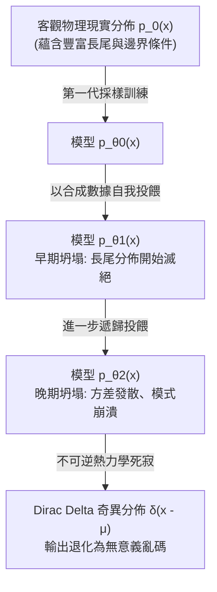
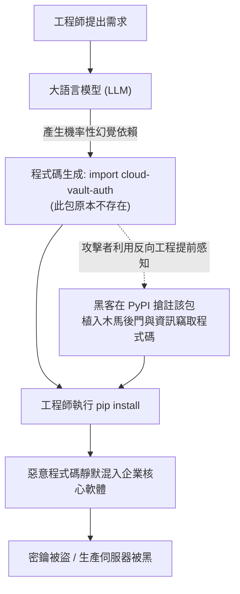

+++
title = "程式碼放射性與模型坍塌：論合成數據狂熱下的組織自噬"
date = "2026-09-18T06:36:04+08:00"
author = "梅乾"
draft = false
isCJKLanguage = true
description = "遞歸吞食合成數據會讓模型丟失長尾、程式碼庫積累放射性毒素。本文說明模型坍塌與程式碼放射性如何把組織推進自噬螺旋。"
tags = [
    "分析論述", # term:AnalyticalEssay
    "大型語言模型", # term:LargeLanguageModel
    "程式碼放射性", # term:CodeRadioactivity
    "模型坍塌", # term:ModelCollapse
    "合成數據", # term:SyntheticData
    "組織自噬", # term:OrganizationalAutophagy
    "認識論近親繁殖", # term:EpistemicInbreeding
    "幻覺依賴", # term:HallucinatedDependencies
  ]
series = ["演算法社會：物質病理、認識論衰變與自噬拓樸"]
[ai_info]
    [ai_info.generation]
        model = "Gemini 3.8 Flash"
        agent = "Antigravity IDE 2.5.5"
    [ai_info.refinement]
        model = "Grok 4.6"
        agent = "GitHub Copilot Chat v0.66.0"
+++

<!--more-->

## 導言

在**資訊理論**（Information Theory） <!-- term:InformationTheory -->與複雜適應系統的演化史中，一個開放系統能夠維持其內部低熵秩序（Negentropy）的根本先決條件，在於它必須持續從外部物理現實中汲取具備「真實負熵」的新鮮資訊，並將系統內部產生的熱力學廢棄物向外耗散。

> [!IMPORTANT]
> **資訊理論** <!-- term:InformationTheory --> (Information Theory): 研究訊號傳輸、資訊量化、熵與通道容量的應用數學分支，用以分析系統在不確定性下的觀測與編碼邊界。 <!-- anchor:InformationTheory -->

然而，當前由生成式人工智慧所引發的技術崇拜，正在推動一場前所未有的**「**認識論近親繁殖**（Epistemic Inbreeding） <!-- term:EpistemicInbreeding -->」與「**組織自噬**（Organizational Autophagy） <!-- term:OrganizationalAutophagy -->」**。

> [!IMPORTANT]
> **認識論近親繁殖** <!-- term:EpistemicInbreeding --> (Epistemic Inbreeding): 封閉系統反覆吸收自身合成產物，無法引入真實負熵而走向資訊熵增。 <!-- anchor:EpistemicInbreeding -->
> **組織自噬** <!-- term:OrganizationalAutophagy --> (Organizational Autophagy): 企業以機器生成物自我投餵並裁撤人類專家，從而消耗自身認識論根基。 <!-- anchor:OrganizationalAutophagy -->

在追求無限**擴展法則**（Scaling Laws） <!-- term:ScalingLaws -->的狂熱下，前沿 AI 實驗室面臨著嚴峻的「人類高質量文字耗盡危機（Data Wall）」。為了解決這一瓶頸，技術官僚與企業管理層共同擁抱了一個極具危險性的技術自欺：**「**合成數據**（Synthetic Data） <!-- term:SyntheticData -->」可以無限替代人類在實踐中產生的真實經驗**。與此同時，在軟體工程生產端，海量由統計模型自動生成的程式碼片段，未經深入的因果審計與物理驗證，正以每秒數百萬行的規模被瘋狂注入企業的核心程式碼庫中。

> [!IMPORTANT]
> **擴展法則** <!-- term:ScalingLaws --> (Scaling Laws): 以資料、參數與算力同步放大來換取能力的經驗規律；並不能免除真實負熵耗盡。 <!-- anchor:ScalingLaws -->
> **合成數據** <!-- term:SyntheticData --> (Synthetic Data): 由模型推論產生、用以替代真實物理經驗的訓練或程式碼產物。 <!-- anchor:SyntheticData -->

這種未經消化的合成產物，在系統工程中表現出嚴重的**「**程式碼放射性**（Code Radioactivity） <!-- term:CodeRadioactivity -->」**。如同核子物理中的長半衰期放射性同位素，合成程式碼一旦滲透進程式碼庫，便會在組織的數位動脈中持續釋放難以察覺的微量衰變毒素——隱形邏輯陷阱、幽靈依賴、未定義行為與安全後門。

> [!IMPORTANT]
> **程式碼放射性** <!-- term:CodeRadioactivity --> (Code Radioactivity): 未經因果審計的似真合成程式碼入庫後持續釋放隱性競態與洩漏，鑑識成本極高。 <!-- anchor:CodeRadioactivity -->

更致命的是，當全球程式碼庫被放射性程式碼全面污染後，下一代模型又被迫以這些被污染的語料為食。牛津大學與劍橋大學學者在《Nature》（2024）上發表的研究已在數學上嚴格證明：**遞歸使用模型產生的數據進行訓練，必然引發統計分佈方差發散與長尾分佈滅絕，導致不可逆的「**模型坍塌**（Model Collapse） <!-- term:ModelCollapse -->」**。

> [!IMPORTANT]
> **模型坍塌** <!-- term:ModelCollapse --> (Model Collapse): 遞歸訓練合成數據導致長尾滅絕、方差發散，分佈不可逆退化為奇異點或噪聲。 <!-- anchor:ModelCollapse -->

本文旨在證明：合成數據 <!-- term:SyntheticData -->狂熱本質上是現代組織在資本壓力下發動的自噬性食腐行為。當企業以「提高程式碼產出速度」為名裁撤人類領域專家、以機器生成物自我投餵時，整個軟體基礎設施與組織認知體系，將在一條由不可逆資訊熵增所鋪就的單行道上，無可避免地滑向系統性心智瓦解。

## 分析

### 一、模型坍塌的數學拓樸與資訊熵增定律

要理解組織自噬 <!-- term:OrganizationalAutophagy -->的物理本質，必須先還原《Nature》（2024）所證明的「模型坍塌 <!-- term:ModelCollapse -->」之數學動力學機制。

考慮一個連續隨機變數 $X \in \mathbb{R}^d$，其服從客觀物理世界的原始真實數據分佈 $p_0(x)$。真實分佈包含著人類數千年文明累積的多樣性、極端邊界條件（Tail Events）以及隱含的物理因果約束。

在第 0 代，我們利用從物理世界採集到的獨立同分佈樣本 $D_0 = \{x_1, \dots, x_N\} \sim p_0(x)$，訓練一個參數化機率模型 $p_{\theta_0}(x)$。在傳統**機器學習**（Machine Learning） <!-- term:MachineLearning -->範式中，只要模型容量足夠且正則化適當，$p_{\theta_0}$ 能夠較好地逼近真實邊緣分佈。

> [!IMPORTANT]
> **機器學習** <!-- term:MachineLearning --> (Machine Learning): 先界定可選函數的範圍，再以資料估計其中參數的建模方法。 <!-- anchor:MachineLearning -->

然而，在「合成自噬迴路」中，第 $n+1$ 代模型的訓練集 $D_{n+1}$，完全由第 $n$ 代模型的推論輸出生成：
$$D_{n+1} \sim p_{\theta_n}(x)$$

在測度論與資訊幾何的框架下，定義分佈序列之間的 Kullback-Leibler (KL) 散度與 Wasserstein 距離。在每一輪自我投餵過程中，系統遭受兩重不可逆的資訊侵蝕：

1. **統計估計誤差的級聯累積（Cascade of Estimation Errors）**：在有限樣本抽樣下，模型對概率密度極低的尾部事件（Tail Events，如罕見的系統故障處理、極端金融行情、非典型邊界語法）存在內在的採樣偏差。每一代模型都會將上一代的微小隨機偏差作為絕對客觀先驗進行放大；
2. **函數逼近能力的退化（Loss of Functional Diversity）**：神經網路本質上是高維空間中的平滑插值器。在反覆的遞歸映射中，高頻細節與拓樸斷裂被視為「噪聲」遭到連續平滑。

隨著世代數 $n \to \infty$，分佈的支撐集（Support）發生不可逆的幾何收縮：
$$\text{Support}(p_{\theta_n}) \subset \text{Support}(p_{\theta_{n-1}}) \subset \dots \subset \text{Support}(p_0)$$

最終，系統經歷了從「早期坍塌（Early Collapse，丟失分佈的尾部）」到「晚期坍塌（Late Collapse，整個分佈崩塌為一個退化的奇異狄拉克函數或方差無限發散的噪聲泥潭）」的突變。

這意味著：**封閉系統內的合成數據 <!-- term:SyntheticData -->無法創造任何新的柯爾莫哥洛夫複雜度（Kolmogorov Complexity），它所進行的只是一場資訊熵不斷暴增的不可逆熱力學死亡。**

### 二、程式碼放射性：現代軟體倉庫的半衰期中毒

將模型坍塌 <!-- term:ModelCollapse -->的拓樸推演投射至微觀工程實踐，其具體物質載體便是「程式碼放射性 <!-- term:CodeRadioactivity -->」。

在軟體工程中，一段健康的程式碼是由人類工程師在直面業務邊界、架構限制與安全威脅時，經過審慎思考所敲定的「因果意圖**結晶**（Crystallize） <!-- term:Crystallize -->」。然而，大語言模型生成的程式碼，本質上只是對大量開源文字進行高維條件機率預測後的「**似真文本**（Plausible-Looking Text） <!-- term:PlausibleLookingText -->」。

> [!IMPORTANT]
> **結晶** <!-- term:Crystallize --> (Crystallize): 將蒸餾後的關鍵知識沉澱並結構化為正式報告或規格的過程。 <!-- anchor:Crystallize -->
> **似真文本** <!-- term:PlausibleLookingText --> (Plausible-Looking Text): 條件機率生成、表面合法卻未經因果證偽的合成文字或程式碼。 <!-- anchor:PlausibleLookingText -->

當這些未經嚴格證偽的合成程式碼被大規模合併進主幹分支（Main Branch）時，它們對組織體現出如同「放射性核種」般的病理特徵：

#### 1. 隱性毒素與不可證偽性陷阱

合成程式碼最危險之處，不在於它會產生顯而易見的編譯語法錯誤，而恰恰在於它**「表面上極其完美」**。它擁有無懈可擊的縮排、規範的變數命名與詳盡的程式碼註解，甚至能通過基礎的 Happy-Path 單元測試。

然而，在涉及以下深層工程維度時，其放射性本質暴露無遺：
- **邊界競態條件（Race Conditions）**：缺乏對並發記憶體模型（Memory Model）與快取一致性協議（MESI）的實質理解，埋下極難復現的死鎖隱患；
- **資源生命週期洩漏**：在異常處理分支中，遺漏對底層作業系統文件描述符（File Descriptors）、資料庫連線池或 GPU 顯存上下文的及時釋放；
- **假性防護**（Phantom Safeguards） <!-- term:PhantomSafeguards -->：生成看似嚴密的輸入校驗函數，實質上其正規表示式存在指數級回溯（ReDoS）漏洞，或能被特殊編碼輕易繞過。

> [!IMPORTANT]
> **假性防護** <!-- term:PhantomSafeguards --> (Phantom Safeguards): 看似嚴密、實則可被繞過或自身成為攻擊面的校驗與防護程式。 <!-- anchor:PhantomSafeguards -->

#### 2. 程式碼半衰期與鑑識成本的指數攀升

在放射性物理中，半衰期決定了污染物殘留的時間。在軟體倉庫中，一段放射性程式碼一旦被合併，它便會被後續的業務模組引用、包裝與依賴。

當六個月後線上系統在高並發衝擊下發生詭異崩潰時，新接手的工程師面臨著極端的認識論災難：
- 撰寫這段程式碼的原工程師早已被裁員或離職；
- 原工程師當初根本沒有理解程式碼的因果邏輯，只是隨機點擊了「Tab 鍵自動補全」；
- 由於缺乏設計文檔與思維鏈條記錄，這段程式碼成為程式碼庫中不可觸碰、不可重構亦無法調試的「高放射性切爾諾貝利廢墟」。

組織排查並根除這段程式碼的工程鑑識成本（Forensic Cost），甚至數十倍於最初從零手工編寫的成本。

### 三、幽靈依賴與投毒攻擊：Slopsquatting 的供應鏈寄生

程式碼放射性 <!-- term:CodeRadioactivity -->不僅在組織內部造成**技術債**（Technical Debt） <!-- term:TechnicalDebt -->累積，更向外衍生出一種全新的軟體供應鏈攻擊向量：**「**幻覺包搶註寄生**（Slopsquatting / Hallucinated Package Hijacking） <!-- term:Slopsquatting -->」**。

> [!IMPORTANT]
> **技術債** <!-- term:TechnicalDebt --> (Technical Debt): 程式碼中為求快速交付而妥協、待重構與修復的設計或品質缺陷。 <!-- anchor:TechnicalDebt -->
> **幻覺包搶註寄生** <!-- term:Slopsquatting --> (Slopsquatting): 攻擊者搶先註冊模型常幻覺出的套件名，藉安裝路徑植入惡意程式碼。 <!-- anchor:Slopsquatting -->

深度學習模型在生成程式碼時，受限於機率分佈抽樣的隨機性，經常會產生「**幻覺依賴**（Hallucinated Dependencies） <!-- term:HallucinatedDependencies -->」——自信地呼叫一個在公共套件庫（如 npm、PyPI、RubyGems）中根本不存在的第三方庫名稱（例如 `crypto-auth-jwt-utils` 或 `azure-blob-stream-sync`）。

> [!IMPORTANT]
> **幻覺依賴** <!-- term:HallucinatedDependencies --> (Hallucinated Dependencies): 模型自信呼叫不存在的套件名稱，為幽靈包搶註與供應鏈投毒打開入口。 <!-- anchor:HallucinatedDependencies -->

黑客組織利用大數據分析，**反向工程**（Reverse Engineering） <!-- term:ReverseEngineering -->主流大語言模型在特定領域的常見幻覺依賴 <!-- term:HallucinatedDependencies -->名稱，並展開精密的「幽靈寄生攻擊」：

> [!IMPORTANT]
> **反向工程** <!-- term:ReverseEngineering --> (Reverse Engineering): 透過分析現行系統的原始碼或運作行為，推導並重建出系統架構與規格的工程手段。 <!-- anchor:ReverseEngineering -->

1. **幻覺（Hallucination） <!-- term:Hallucination -->預測與搶註**：黑客每天向主流程式碼模型發送數萬次隨機架構設計 Prompts，收集模型反覆捏造的高頻虛構套件名稱，隨後在 npm 或 PyPI 上以合法開發者名義全自動註冊這些套件；
2. **木馬程式碼植入**：黑客在這些套件中編寫與模型預期完全相符的空殼函數接口，但在其底層安裝腳本（`postinstall`）中秘密植入鍵盤記錄器、環境變數竊取程式或逆向 Shell 後門；
3. **無防禦滲透**：當全球成千上萬的初級工程師在使用模型輔助開發時，他們對模型輸出的 `import cloud-vault-auth` 深信不疑，機械式地在終端機中運行 `pip install cloud-vault-auth`。

> [!IMPORTANT]
> **幻覺** <!-- term:Hallucination --> (Hallucination): 大型語言模型在面對不實或矛盾資訊時，生成不符合客觀現實或超出脈絡之回應的錯誤現象。 <!-- anchor:Hallucination -->

惡意程式碼由此繞過了所有傳統防火牆與**程式碼審查**（Code Review） <!-- term:CodeReview -->，以「合法第三方依賴」的身份，長驅直入全球頂級科技公司、國防承包商與金融系統的核心伺服器中。

> [!IMPORTANT]
> **程式碼審查** <!-- term:CodeReview --> (Code Review): 由團隊成員或自動化工具對新提交的原始碼進行品質、風格與邏輯檢查的審查程序。 <!-- anchor:CodeReview -->

### 四、組織自噬：裁撤真知與食腐文化的制度化

在宏觀組織治理層面，程式碼放射性 <!-- term:CodeRadioactivity -->與模型坍塌 <!-- term:ModelCollapse -->的最終受害者，是企業自身的「**制度性記憶**（Institutional Memory） <!-- term:InstitutionalMemory -->」與「認識論自我複製能力」。

> [!IMPORTANT]
> **制度性記憶** <!-- term:InstitutionalMemory --> (Institutional Memory): 組織把除錯經驗、失敗模式與因果判斷沉澱為可傳承資產的能力。 <!-- anchor:InstitutionalMemory -->

當代上市公司管理層在管理諮詢機構「AI 將使軟體工程產出效率提升 10 倍」的狂妄口號忽悠下，啟動了自殺性的組織自噬 <!-- term:OrganizationalAutophagy -->流程：

#### 1. 領域專家的物理放逐與經驗清零
企業大規模裁撤具有十年以上經驗、深諳底層協議與歷史技術債 <!-- term:TechnicalDebt -->的資深系統架構師與首席工程師，並以極低的薪資聘用剛畢業的初級人員，要求他們「以 AI 為核心驅動日常開發」。
管理層誤以為，軟體資產的價值體現為程式碼行數（Lines of Code），只要模型能源源不絕產出程式碼，企業的核心資產便安然無恙。殊不知，**程式碼本身不是資產，程式碼背後凝結的「對非平穩業務邊界的深刻理解與除錯直覺」才是唯一的無形資產**。將經驗豐富的專家驅逐出境，等同於主動對企業大腦實施額葉切除手術。

#### 2. 食腐文化與認識論近親繁殖
當組織失去了能夠辨別程式碼美醜與真偽的智慧大腦後，企業內部不可避免地演化出一種「食腐文化」：
- 新程式碼完全由模型生成；
- 程式碼審查 <!-- term:CodeReview -->由模型進行自動審核（AI Reviewing AI）；
- 單元測試用例由模型自編自導自演；
- 故障排查報告（Postmortem）由模型自動生成漂亮的公關修辭；
- 新模型的內部微調數據，取自上述模型自我循環生成的垃圾程式碼庫。

這形成了一個自我毀滅的拓樸環路：
#### 3. 開源生態系統的公地悲劇與語料庫死滅

組織自噬 <!-- term:OrganizationalAutophagy -->的毒性並不局限於單一企業的圍牆之內，它正在引發全球開源軟體公地（Open Source Commons）的全面枯竭。

開源社群三十年來的繁榮，建立在一種純粹的「利他主義贈與經濟（Gift Economy）」之上——全世界最優秀的工程師，將無數深夜與週末精心打磨、經過真實物理伺服器驗證的高質量程式碼與詳細文檔，免費奉獻給公共領域。正是這片無比肥沃的純淨語料土壤，才孕育出了第一代大語言模型的出現。

然而，當代商業模型實驗室以掠奪性的爬蟲清空了這片公地，卻以海量未經修剪的「AI 合成垃圾程式碼（AI Slop）」反向灌滿了 GitHub 與 Stack Overflow：
- 真正的資深開發者面對鋪天蓋地的機器生成垃圾 Pull Request 與虛假問題反饋，心智不堪重負，紛紛關閉個人倉庫、退出公共討論或將開源專案轉為私有；
- 公共論壇上的有效知識密度急劇稀釋，初學者在搜尋引擎中檢索到的全是模型生成的自我複製廢話；
- 公共知識公地的「沙漠化」，徹底摧毀了下一代 AI 模型賴以訓練的高質量原始燃料來源。

這場技術自噬最終演變為一場諷刺的文明寓言：**資本主義對公共知識庫的極致搾取與合成污染，最終親手掐死了維持其自身技術神話的母體。**

## 結論

合成數據 <!-- term:SyntheticData -->狂熱下的程式碼放射性 <!-- term:CodeRadioactivity -->與模型坍塌 <!-- term:ModelCollapse -->，標誌著數位技術文明遭遇到了物理學熱力學第二定律的冷酷審判。世界上沒有不勞而獲的認識論永動機。試圖用統計模型自身的推論產物來取代人類深入客觀物理世界的艱苦探索，無異於在沙漠中試圖依靠飲用自己的尿液維持生命，最終必將在嚴重的體內酸中毒與器官衰竭中痛苦死去。

程式碼不是排列組合的符號玩具，而是直接對現實物理世界施加控制權能的契約。當我們將契約的起草權、審查權與維護權全額割讓給缺乏物理身體感知與道德責任承擔能力的隨機生成器時，我們便親手將現代社會的關鍵基礎設施，推入了隨時可能觸發不可逆鏈式核反應的放射性泥潭。

要從組織自噬 <!-- term:OrganizationalAutophagy -->的末日螺旋中挽救工程理性，技術界與現代治理機構必須確立最高層級的「認識論防擴散條約」：
1. **立法確立「程式碼溯源與標記法規（Mandatory Synthetic Code Provenance）」**：建立像食品成分標籤與輻射防護標準一樣嚴格的軟體鑑識體系，強制要求所有在生產環境中運行的程式碼，必須明確標記其生成來源，對機器生成的片段實施長達數百天的隔離期與強制人工審查；
2. **切除合成自噬投餵迴路**：嚴禁任何前沿模型使用由其他模型遞歸生成的合成文本作為核心訓練基石，強制重建對物理實踐、紙本典籍、實驗室原始觀測數據等「未被合成污染之真實負熵」的採集保護機制；
3. **重建工程師的「全因果責任制」**：在法律責任維度明確規定，任何工程師或管理層不得以「這是 AI 生成的建議」推卸系統崩潰與資安後門的民刑事責任，實質提高組織引入黑箱程式碼的法律違法成本；
4. **捍衛人類默會專家的至高治理權限**：停止以產量為導向裁撤資深專家的愚蠢行徑，將「是否具備深層系統除錯與架構證偽能力」，作為企業技術資產估值與評級的**決定性**（Deterministic） <!-- term:Deterministic -->標準；
5. **建立開源公地淨化基金與反污染防火牆**：國際軟體基金會應聯合設立「真實人類原創認證（Human-Authored Cryptographic Signatures）」，對公共程式碼倉庫進行常態化去放射性清洗，嚴禁未經驗證的機器批量程式碼污染公共知識沉積層；
6. **落實組織知識多樣性指數（Epistemic Diversity Index）**：將團隊內部對異質性架構、多元程式語言與非主流演算法範式的包容度，列為評估大型科技組織反脆弱能力的核心體系。

> [!IMPORTANT]
> **決定性** <!-- term:Deterministic --> (Deterministic): 保證在相同的輸入與控制下，自動化管線每次執行所產出的文件結構與內容完全收斂一致的特性。 <!-- anchor:Deterministic -->

唯有守護真實人類經驗的純粹性，拒絕組織自噬 <!-- term:OrganizationalAutophagy -->的食腐誘惑，我們才能在數位幻象的汪洋大海中，保全工程理性最後的淨土與文明存續的希望。

## 參考文獻

1. Shumailov, I., Shumaylov, Z., Zhao, Y., Gal, Y., Papernot, N., & Anderson, R. (2024). *AI models collapse when trained on recursively generated data*. Nature, 631(8022), 755-759. [doi:10.1038/s41586-024-07566-y](https://doi.org/10.1038/s41586-024-07566-y)
2. Shannon, C. E. (1948). *A Mathematical Theory of Communication*. Bell System Technical Journal, 27(3), 379-423. [doi:10.1002/j.1538-7305.1948.tb01338.x](https://doi.org/10.1002/j.1538-7305.1948.tb01338.x)
3. Kolmogorov, A. N. (1965). *Three approaches to the quantitative definition of information*. Problems of Information Transmission, 1(1), 1-7. [doi:10.1007/BF01195534](https://doi.org/10.1007/BF01195534)
4. Laranjeiro, N., Soydemir, S., & Bernardino, J. (2024). *Lost in Hallucination: Investigating the Security Risks of Generative AI Code Assistants in Open-Source Ecosystems*. IEEE Transactions on Software Engineering. （卷期待補；IEEE TSE）
5. Cover, T. M., & Thomas, J. A. (2006). *Elements of Information Theory*. John Wiley & Sons. ISBN 978-0-471-24195-9
6. Brooks, F. P. (1987). *No Silver Bullet—Essence and Accidents of Software Engineering*. IEEE Computer, 20(4), 10-19. [doi:10.1109/MC.1987.1663532](https://doi.org/10.1109/MC.1987.1663532)
7. Amodei, D., Olah, C., Steinhardt, J., Christiano, P., Schulman, J., & Mané, D. (2016). *Concrete Problems in AI Safety*. arXiv preprint arXiv:1606.06565. [arXiv:1606.06565](https://arxiv.org/abs/1606.06565)
8. Bubeck, S., Chandrasekaran, V., Eldan, R., Gehrke, J., Horvitz, E., Kamar, E., ... & Zhang, Y. (2023). *Sparks of Artificial General Intelligence: Early experiments with GPT-4*. arXiv preprint arXiv:2303.12712. [arXiv:2303.12712](https://arxiv.org/abs/2303.12712)
9. Wiener, N. (1954). *The Human Use of Human Beings: Cybernetics and Society*. Houghton Mifflin. （1954 年初版，Houghton Mifflin）
10. Taleb, N. N. (2007). *The Black Swan: The Impact of the Highly Improbable*. Random House. ISBN 978-1-4000-6351-2
11. Ostrom, E. (1990). *Governing the Commons: The Evolution of Institutions for Collective Action*. Cambridge University Press. ISBN 978-0-521-40599-7
12. Raymond, E. S. (1999). *The Cathedral and the Bazaar: Musings on Linux and Open Source by an Accidental Revolutionary*. O'Reilly Media. ISBN 978-1-56592-724-7
13. Hardin, G. (1968). *The Tragedy of the Commons*. Science, 162(3859), 1243-1248. [doi:10.1126/science.162.3859.1243](https://doi.org/10.1126/science.162.3859.1243)
14. Georgescu-Roegen, N. (1971). *The Entropy Law and the Economic Process*. Harvard University Press. ISBN 978-0-674-25780-1
15. Postman, N. (1992). *Technopoly: The Surrender of Culture to Technology*. Vintage Books. ISBN 978-0-679-74540-2
16. Mumford, L. (1967). *The Myth of the Machine: Technics and Human Development*. Harcourt Brace Jovanovich. ISBN 978-0-15-662341-4
17. Winner, L. (1980). *Do Artifacts Have Politics?*. Daedalus, 109(1), 121-136. [JSTOR 20024652](https://www.jstor.org/stable/20024652)
