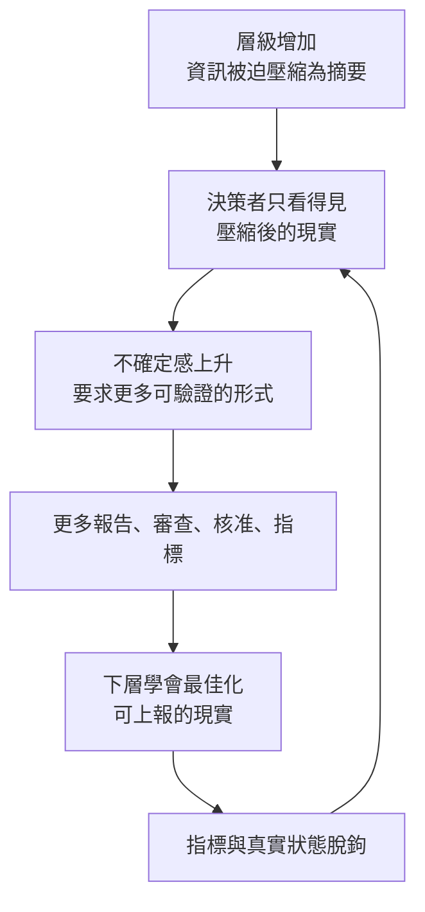

+++
title = "決策者看得到的只剩摘要，更好的指標也只是更好的摘要"
date = "2026-09-23T11:10:02+08:00"
author = "梅乾"
draft = false
isCJKLanguage = true
description = "決策者依賴層層摘要與代理指標時，判斷和預測先被丟掉。以挑戰者號的審查紀錄檢視資訊壓縮與指標失真的連鎖。"
tags = [
    "分析論述", # term:AnalyticalEssay
    "默會知識", # term:TacitKnowledge
    "代理指標", # term:ProxyMetric
    "古德哈特定律", # term:GoodhartSLaw
    "坎貝爾定律", # term:CampbellSLaw
    "飛行準備審查", # term:FlightReadinessReview
    "挑戰者號", # term:Challenger
    "判斷", # term:Judgment
  ]
series = ["表徵治理：通過、摘要與零回報如何取代現場"]
term_exclude = ["Desynchronization", "Deterministic", "Quantization"]
[ai_info]
    [ai_info.generation]
        model = "Claude Opus 5.5"
        agent = "GitHub Copilot Chat v0.66.0"
    [ai_info.refinement]
        model = "GPT-6 Sol"
        agent = "GitHub Copilot Chat v0.66.0"
+++

<!--more-->

## 導言

一線工程師寫下一句完全真實的話：這個系統沒有出事，但有幾個脆弱的耦合正在累積。這句話有三個成分：目前的事實（沒有出事）、對結構的**判斷**（耦合脆弱） <!-- term:Judgment -->、對趨勢的預測（正在累積）。讓它沿著組織層級往上傳。每經過一層，接收者都要把它摘要一次。摘要的選擇壓力偏向可驗證、可比較、能放進一格表格的成分。到了決策者手上，它可能只剩「無事故、服務水準達標、審查已完成」。這是用來說明形狀的例子，不是一份紀錄。

> [!IMPORTANT]
> **判斷** <!-- term:Judgment --> (Judgment): 面對規則未覆蓋或情境已改變時，根據脈絡評估決定的實質後果。 <!-- anchor:Judgment -->

本文只處理一個主張：決策者只能透過層層摘要看見現場，所以他依賴的指標，在被設計之前就已經是壓縮的殘骸。指標失真不從指標設計開始，而從摘要鏈開始。由此推出，改良指標不是修法；修法是讓現實偶爾繞過摘要，而這些繞道本身也會在被形式化之後失效。

本文不處理另一種失真：資訊從一開始就沒有被送進管道。那需要不同的診斷工具。

## 分析

### 摘要鏈丟掉的是哪些成分

一個管三百人的主管，一天只有二十四小時。他不可能直接觀察所有一線情境，只能依賴摘要、指標、流程與代理人。這不是能力問題，而是注意力預算的約束。資訊每往上一層，就被壓縮一次；每一次壓縮都丟掉脈絡。

小團隊裡這個問題較輕。主管能直接知道誰真正解決了問題、哪個模組其實沒人敢碰、上次事故真正的導火線是什麼。這種**默會知識**（Tacit Knowledge） <!-- term:TacitKnowledge -->本身就是一條未經壓縮的通道。組織一大，這條通道消失，只能以形式化的代理取代：用文件代替共事，用評分代替了解，用流程代替信任。

> [!IMPORTANT]
> **默會知識** <!-- term:TacitKnowledge --> (Tacit Knowledge): 無法完全言傳、只能在學徒制實踐與痛感反饋中內化的工程判斷。 <!-- anchor:TacitKnowledge -->

向上溝通的研究早就把這件事當成結構問題處理。Glauser (1984) 回顧向上資訊流的文獻，把影響因素分成下屬特性、主管特性、上下級關係、訊息特性與結構特性五類。五類中只有一類關於下屬本人。資訊能否準確上傳，不只是說的人誠不誠實。Whetsell、Kroll 與 DeHart-Davis 在一個 143 人的市政府裡發現，正式地位、權限路徑與部門歸屬都會影響員工向誰尋求資訊。組織圖決定了哪些訊息有機會相遇。

摘要丟東西的順序不是隨機的。事實可驗證，留得最久。判斷 <!-- term:Judgment -->不可驗證，先被丟。預測既不可驗證又不可比較，最早被丟。

### 已發生的現場：18 頁變成一頁

**挑戰者號**（Challenger） <!-- term:Challenger -->事故總統調查委員會的報告第六章，記下了一次可以逐頁對照的壓縮。

> [!IMPORTANT]
> **挑戰者號** <!-- term:Challenger --> (Challenger): 1986 年發射失事的太空梭；其調查紀錄用於檢視豁免、摘要與資訊回報的失效。 <!-- anchor:Challenger -->

太空梭的**飛行準備審查**（Flight Readiness Review） <!-- term:FlightReadinessReview -->是一個多層的審查，設計目的是讓資訊從承包商往上流到馬歇爾太空飛行中心（Level III）、再到詹森太空中心的計畫辦公室（Level II），最後到總部（Level I）。NASA 的政策手冊為中間一層審查列出的第一個目標是：提供審查團隊足夠的資訊，使他們能對飛行準備狀態做出獨立判斷 <!-- term:Judgment -->。

> [!IMPORTANT]
> **飛行準備審查** <!-- term:FlightReadinessReview --> (Flight Readiness Review): 太空梭計畫中供不同層級檢視發射條件、限制與疑慮的審查程序。 <!-- anchor:FlightReadinessReview -->

1985 年 1 月 24 日發射的 STS 51-C，O 形環溫度為 53°F，是當時最冷的一次。兩具推進器都出現 O 形環侵蝕。承包商為下一次飛行的審查準備了到當時為止最詳盡的分析，第一次把溫度列為侵蝕與竄氣（blow-by，燃氣越過 O 形環）的因素。這份分析被帶進馬歇爾太空計畫辦公室的審查時是 18 頁，結論寫著：51-C 與侵蝕資料庫一致；低溫提高了竄氣的機率；51-C 經歷了佛羅里達史上最差的溫度變化；下一次飛行可能出現同樣的表現；狀況可以接受。

1985 年 2 月 21 日的 Level I 審查上，委員會寫道：先前 18 頁的分析被縮成一頁圖表，結論是「可接受的風險，因為暴露時間有限且有冗餘」。Level I 的報告裡找不到任何關於溫度的字。

用導言的三個成分讀這一頁：事實留下了，化成「可接受的風險」。判斷（低溫提高竄氣機率） <!-- term:Judgment -->被丟掉。預測（下一次可能重演）被丟掉。留下的「有冗餘」，是一個在 1982 年底已被正式撤銷的前提：接頭密封在那時已被改列為沒有備援的 Criticality 1。

報告沒有說有人刻意刪掉溫度。本文也不這樣讀。它記下的是一份分析在上傳時，被摘要成最能放進一頁、最能跨次比較的形狀。那個形狀正好不含決定性的那一項。

### 代理為什麼會和它代表的東西脫鉤

決策者依賴摘要，摘要就成為**代理指標**（proxy） <!-- term:ProxyMetric -->。代理一旦被拿來做決定，就開始承受被最佳化的壓力。Goodhart 在貨幣政策中觀察到：一個被拿來作為控制目標的統計規律，會傾向崩解，這後來被稱為**古德哈特定律**（Goodhart's Law） <!-- term:GoodhartSLaw -->。Campbell (1979) 給出社會面的版本，後稱**坎貝爾定律**（Campbell's Law） <!-- term:CampbellSLaw -->：一個量化社會指標被用於社會決策的程度越高，它承受的腐化壓力就越大，也越會扭曲它原本要監測的社會過程。

> [!IMPORTANT]
> **代理指標** <!-- term:ProxyMetric --> (Proxy Metric): 用可觀察的量或摘要代替無法直接觀察的真實狀態，可能在被用於控制後與狀態脫鉤。 <!-- anchor:ProxyMetric -->
> **古德哈特定律** <!-- term:GoodhartSLaw --> (Goodhart's Law): 指標一旦成為控制目標，原先與真實狀態的統計關係便可能失效。 <!-- anchor:GoodhartSLaw -->
> **坎貝爾定律** <!-- term:CampbellSLaw --> (Campbell's Law): 定量社會指標一旦用於決策，就越容易被腐化並扭曲其原本要監控的社會進程。 <!-- anchor:CampbellSLaw -->

這些現象不限於組織。Fire 與 Guestrin 分析了超過一億兩千萬篇論文，發現論文數、引用數等指標在成為目標之後逐漸失去作為品質代理的效力。Karwowski 等人在強化學習中把問題形式化：當獎勵函數只是真實目標的不完美代理時，把代理最佳化超過某個臨界點之後，真實目標的表現反而下降。

挑戰者號 <!-- term:Challenger -->的紀錄裡，代理有一個名字：「在經驗範圍內」。委員會觀察到，後來的審查因為相信飛行中的 O 形環侵蝕「在資料庫之內」，只做粗略的檢視，常以「可接受」或「容許」的範圍打發反覆出現的侵蝕。聽證中有委員問計畫經理：當侵蝕超過預期的最大值時，你們**豁免**（Waiver） <!-- term:Waiver -->那次飛行，說還有餘裕；隨著經驗累積，放行標準也跟著上升，是嗎？他確認，就主密封失效的那一次而言，是的。代理量沒有被造假。它只是隨著每一次沒出事的飛行，把自己的邊界往外推。

> [!IMPORTANT]
> **豁免** <!-- term:Waiver --> (Waiver): 經批准而不適用特定限制的例外處置；形式上的批准不代表原本的風險已消失。 <!-- anchor:Waiver -->

把整條鏈寫出來，它有一個回到起點的迴圈：

這個迴圈裡沒有壞人。上層要求更多可驗證的東西是合理的，因為他們看不見現場。下層最佳化可上報的現實也是合理的，因為他們被這些東西考核。每一個局部都理性，整體卻走向誰都沒有選擇的結果。脫鉤還有延遲：接頭侵蝕從 1981 年的第二次飛行就出現，要到 1986 年才以事故的形式被看見。

壓縮與 Goodhart 是同一條因果鏈的上下游。壓縮說明代理為什麼必然被引入。Goodhart 說明代理被引入之後為什麼必然失真。只處理下游，會以為換一個更好的指標就好；只處理上游，會以為把報告寫清楚就好。

### 更好的指標仍是摘要

如果失真始於摘要鏈，那麼設計更好的指標只是次優解。更好的代理仍是代理。它縮小誤差，不縮短距離。它甚至可能讓事情更糟：代理越可信，決策者越放心地把判斷 <!-- term:Judgment -->交給它，脫鉤被發現得越晚。

修法只有兩類：縮短資訊路徑，或保留一些不經高度壓縮的通道，讓現實偶爾繞過摘要抵達決策者。後者有幾種常見的形態，每一種都針對摘要鏈上的一個環節，也各有典型的失效：

| 通道 | 繞過的環節 | 典型失效 |
| :--- | :--- | :--- |
| 決策者直接接觸一線案例 | 層級摘要本身 | 變成安排好的參訪，一線呈現的是排練過的現場 |
| 重大決定保留異議與少數意見 | 共識形成對異議的磨平 | 異議被記錄但不影響結果 |
| 指標之外要求敘事 | 數字對脈絡的丟棄 | 敘事被模板化，成為另一種可最佳化的形式 |
| 定期回看決定的長期後果 | 決定當下對未來成本的不可見 | 回看沒有後果承擔，變成例行會議 |
| 決策者承擔部分運營後果 | 決策權與後果的分離 | 象徵性參與，痛苦仍由一線吸收 |

右欄有一個共同的規律：每一條通道一旦被做成可考核的形式，就會被它要繞過的那套邏輯重新殖民。參訪會被編排，因為接待本身可被考核。異議會被儀式化，因為「已記錄反對意見」比「反對意見改變了決定」更容易交代。這是同一個 Goodhart 機制，施加在對策上。評估一條通道時，最直接的問題是：它的儀式化版本長什麼樣子，現在的實踐離那個版本有多遠。

挑戰者號 <!-- term:Challenger -->的紀錄裡也有一條這樣的通道。委員會在第五章指出，除了飛行準備審查 <!-- term:FlightReadinessReview -->，還有其他獨立的回報路徑，其中之一是承包商與馬歇爾工程師在 1985 年組成的密封問題任務小組，那裡留下了逐步升高的擔憂與挫折的書面紀錄。但 Level II 不在這條路徑的回報線上。通道存在，沒有接到決策者。

通道也是昂貴的。決策者直接接觸一線，消耗組織最稀缺的注意力；保留異議，拖慢決策節奏。組織不可能在每一件事上都保留未壓縮的通道。一個可用的配置標準是：決定越不可逆、越依賴判斷 <!-- term:Judgment -->而非規則，就越值得付這個成本。可逆而規則化的決定，就讓摘要去處理。

## 反思

本文沒有證明失真程度是距離的函數。本文主張的是一條鏈：距離迫使摘要，摘要迫使代理，代理在被用於控制之後脫鉤。鏈上的每一環都有來源；「距離越遠、失真越快」是把各環接起來的推論，沒有被量化過。

本文也不處理資訊從未進入管道的情形。即使摘要鏈很短、指標設計精良，知道問題的人仍可能不說。那是另一種失敗，與壓縮互相獨立：壓縮處理訊號在管道中的衰減，另一種處理訊號從未進入管道。治好一個，不治好另一個。

挑戰者號 <!-- term:Challenger -->的 18 頁與一頁，容易被收成兩個不屬於本文的結論。第一個是「Level I 失職」。報告沒有這樣寫，本文也不需要。一頁的形狀，是每一層都在做合理的摘要之後得到的形狀。第二個是「所以報告要寫長」。18 頁搬到 Level I，下一次仍會被摘要，因為 Level I 的注意力預算沒有變。問題不在頁數，在於沒有一條通道讓 18 頁裡那一句「下一次可能重演」繞過摘要。

## 實務對比

面對指標失真，三種常見的反應處理的是鏈上不同的位置：

| 反應 | 處理的位置 | 能做到什麼 | 做不到什麼 |
| :--- | :--- | :--- | :--- |
| 設計更好的指標 | 代理的品質 | 縮小代理與目標的誤差 | 不縮短距離；代理越可信，脫鉤越晚被發現 |
| 縮短資訊路徑 | 摘要的次數 | 減少被丟掉的成分 | 受限於組織規模；層級不會消失 |
| 保留未壓縮通道 | 繞過摘要 | 讓判斷 <!-- term:Judgment -->與預測偶爾原樣抵達 | 昂貴；被形式化之後會被重新殖民 |

三者不互斥。第一列最常被選，因為它不需要改變任何人的注意力分配。它也是唯一一個完全停留在摘要之內的選項。

## 結論

指標是壓縮的殘骸。讀一個指標時該問的，是它被摘要了幾次、每次丟了什麼。

摘要丟東西有順序：判斷 <!-- term:Judgment -->與預測先走，事實留下。挑戰者號 <!-- term:Challenger --> 51-E 的審查裡，18 頁縮成一頁，溫度與「下一次可能重演」都不在那一頁上。

壓縮說明代理為什麼被引入，Goodhart 說明代理為什麼失真。只修指標，停留在摘要之內。

修法是縮短路徑，或保留未壓縮的通道。通道被做成可考核的形式之後，會被它要繞過的邏輯重新殖民；通道也昂貴，應配置在不可逆、判斷 <!-- term:Judgment -->密集的決定上。

每一個局部都理性的系統，仍可能整體失真。修法因此必須改結構，不能只要求任何一方更誠實。

## 來源

- Presidential Commission on the Space Shuttle Challenger Accident. (1986). *Report of the Presidential Commission on the Space Shuttle Challenger Accident*, Vol. 1, Chapter VI: An Accident Rooted in History. National Aeronautics and Space Administration. [https://www.nasa.gov/history/rogersrep/v1ch6.htm](https://www.nasa.gov/history/rogersrep/v1ch6.htm). 本文只引用該章寫明的飛行準備審查 <!-- term:FlightReadinessReview -->目標、STS 51-C 與 51-E 審查的內容、Level I 報告的一頁摘要、「在資料庫之內」的觀察，以及聽證中關於放行標準的問答。
- Presidential Commission on the Space Shuttle Challenger Accident. (1986). *Report of the Presidential Commission on the Space Shuttle Challenger Accident*, Vol. 1, Chapter V: The Contributing Cause of the Accident. National Aeronautics and Space Administration. [https://www.nasa.gov/history/rogersrep/v1ch5.htm](https://www.nasa.gov/history/rogersrep/v1ch5.htm). 本文只引用該章關於密封任務小組回報路徑的段落。
- Glauser, M. J. (1984). Upward information flow in organizations: Review and conceptual analysis. *Human Relations*, 37(8), 613–643. [https://doi.org/10.1177/001872678403700804](https://doi.org/10.1177/001872678403700804)
- Whetsell, T. A., Kroll, A., & DeHart-Davis, L. (2020). Formal hierarchies and informal networks: How organizational structure shapes information search in local government. [arXiv:2006.08019](https://arxiv.org/abs/2006.08019)。作者註明已獲 *Journal of Public Administration Research and Theory* 接受；本文依 arXiv 版。
- Goodhart, C. A. E. (1984). Problems of Monetary Management: The UK Experience. In *Monetary Theory and Practice: The UK Experience* (pp. 91–121). Macmillan. ISBN 9780333360606. [https://doi.org/10.1007/978-1-349-17295-5_4](https://doi.org/10.1007/978-1-349-17295-5_4). 此為 1975 年論文的重印。
- Campbell, D. T. (1979). Assessing the impact of planned social change. *Evaluation and Program Planning*, 2(1), 67–90. [https://doi.org/10.1016/0149-7189(79)90048-X](https://doi.org/10.1016/0149-7189(79)90048-X)
- Fire, M., & Guestrin, C. (2019). Over-optimization of academic publishing metrics: Observing Goodhart's Law in action. *GigaScience*, 8(6), giz053. [https://doi.org/10.1093/gigascience/giz053](https://doi.org/10.1093/gigascience/giz053)
- Karwowski, J., Hayman, O., Bai, X., Kiendlhofer, K., Griffin, C., & Skalse, J. (2023). Goodhart's law in reinforcement learning. [arXiv:2310.09144](https://arxiv.org/abs/2310.09144)