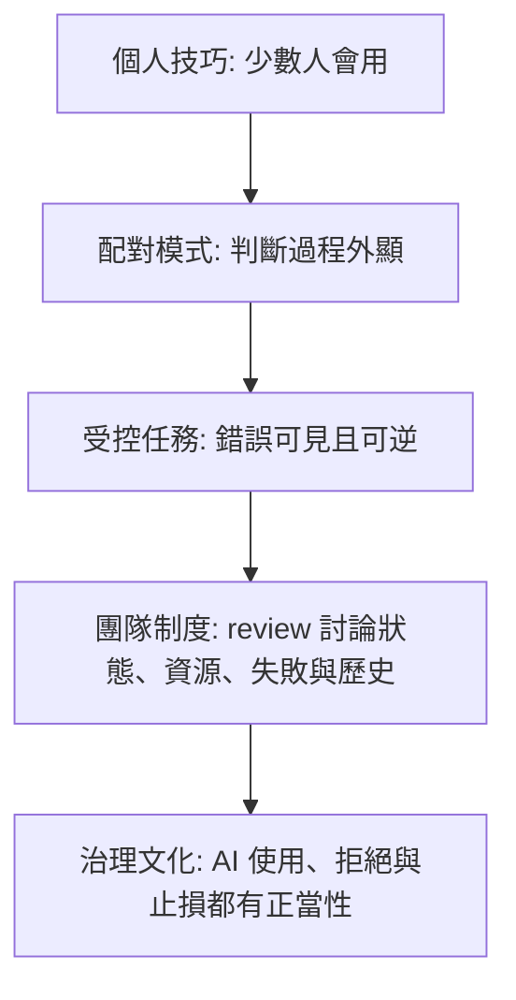

+++
title = "人機協作與能力培育：從外化失效到判斷力內化"
date = "2026-06-14T16:41:01+08:00"
author = "TTL::0"
draft = false
isCJKLanguage = true
description = "AI 協作真正的瓶頸不是工具知識，而是判斷力。本文從文字介質的失真預算談起，說明外化規則為何報酬遞減、觀念化能力如何只能內化、團隊擴散如何放大個體差異，並界定何時不該用 AI，以及手寫代碼為何仍是裁決權的來源。"
tags = [
    "分析論述", # term:AnalyticalEssay
    "AI 代理人", # term:AiAgent
    "人機協作", # term:HumanAiCollaboration
    "觀念化能力", # term:ConceptualSkill
    "團隊擴散", # term:TeamDiffusion
    "驗證能力", # term:VerificationSkill
    "技術技能", # term:TechnicalSkill
  ]
[ai_info]
    [ai_info.generation]
        model = "GPT 5.5"
        agent = "Codex VS Code extension 26.609.30741"
    [ai_info.refinement]
        model = "Claude Opus 4.8"
        agent = "Claude Code VSCode Extension 2.1.177"
+++

<!--more-->

## 導言

AI 協作最容易被誤解為工具擴散問題：給所有人帳號，教大家 prompt，提供模板、checklist 與最佳實踐，團隊就會自然獲得生產力。但真正的瓶頸不是工具知識，而是判斷力。AI 可以更快生成程式碼、文件、測試與方案；它不能替人判斷這些產物在具體系統、具體失敗模式與具體成本結構下是否成立。

歸結起來，真正的核心主張是：可持續的**人機協作**（Human-AI Collaboration） <!-- term:HumanAiCollaboration -->不是把更多判斷力外化成文字規則，而是讓人形成足夠的**觀念化能力**（Conceptual Skill） <!-- term:ConceptualSkill -->，並用團隊制度保護這種能力的培育路徑。文字 artifacts 可以傳遞部分狀態，卻不能無損搬運人的情境判斷。當組織把 AI 導入設計成「更多規則、更高採用率、更少手寫」，它看似在提高效率，實際上可能正在消耗未來判斷力。

> [!IMPORTANT]
> **人機協作** <!-- term:HumanAiCollaboration --> (Human-AI Collaboration): 人與 AI 共同完成工作的分工模式：AI 負責放大產出與展開候選方案，人負責對邊界、失敗模式、成本與系統物理性做出判斷與裁決。其可持續性取決於人類判斷力的培育，而非 AI 採用率。 <!-- anchor:HumanAiCollaboration -->
> **觀念化能力** <!-- term:ConceptualSkill --> (Conceptual Skill): 將複雜且模糊的情境抽象化為可操作架構、概念，並能判斷其語意與限制的心智能力。 <!-- anchor:ConceptualSkill -->

因此，AI 協作治理要回答的不是「如何讓大家都使用 AI」，而是「如何讓人在使用 AI 的同時仍然學會判斷、驗證、拒絕與負責」。這個問題貫穿個人操作、**團隊擴散**（Team Diffusion） <!-- term:TeamDiffusion -->、專案成本、人才培育與手寫代碼的價值。

> [!IMPORTANT]
> **團隊擴散** <!-- term:TeamDiffusion --> (Team Diffusion): AI 協作能力從少數個人擴展到整個團隊的過程。統一的工具與培訓無法消除個體起點差異，品質方差會從可見的產出轉移到不可見的判斷品質，因此需要配對模式、受控任務與制度設計來保護判斷力的形成。 <!-- anchor:TeamDiffusion -->

## 分析

AI 協作依賴文字介質來跨越一個基本落差：人類協作需要狀態延續，LLM 推理卻是**無狀態**（Stateless） <!-- term:Stateless -->的。一次決策的理由、某個設計禁忌、對未來 reviewer 的提醒，都必須被寫進文件、規格、commit message、rules 或 skill，才能進入下一次推理的 context。這使文字 artifacts 承擔了狀態介質的角色。

> [!IMPORTANT]
> **無狀態** <!-- term:Stateless --> (Stateless): 不依賴任何中介追蹤檔、任務完成與否完全由輸出目錄的實體檔案決定的設計，帶來冪等性與韌性。 <!-- anchor:Stateless -->

問題在於，這個介質有結構性失真。第一層失真發生在人把判斷力寫成文字時。判斷力原本運作在無限情境中，規則只能捕捉有限條件；人還會省略自己覺得不言而喻的前提。第二層失真發生在文字被 Agent 讀入時。短文本會被模型先驗展開，長文本會被 attention 選擇性關注。規則越少，解釋空間越大；規則越多，優先序越容易被重新排序。

這形成一個失真預算。低於預算時，文件和規則能提供必要約束；高於預算時，增加文字不再增加可靠性，反而增加不可預測性。許多 AI 協作失效不是因為規則寫得不夠多，而是因為團隊誤以為任何判斷力都可以繼續壓縮進同一個文字介質。

外化陷阱就在這裡出現。當 commit message、規格或 AI 產出品質不穩時，管理直覺常常是加模板、加欄位、加 checklist、加 lint。這些措施在處理穩定**技術技能**（Technical Skill） <!-- term:TechnicalSkill -->時有效，因為格式、語法與流程可以標準化。但判斷力不是格式問題。好的 commit message 之所以好，不只是它填滿欄位，而是作者知道未來的人與 Agent 需要哪些資訊才能還原意圖。

> [!IMPORTANT]
> **技術技能** <!-- term:TechnicalSkill --> (Technical Skill): 與工具、語法或具體操作程序相關的硬實力，其正確答案在不同情境下通常是穩定且標準化的。 <!-- anchor:TechnicalSkill -->

當組織用更多外化規則替代這種能力，合規容易取代溝通。操作者開始填表，而不是判斷什麼值得記錄；reviewer 看到欄位齊全，卻仍要自行重建意圖；Agent 從模糊歷史中學到模糊模式，再產出新的模糊結果。規則集也會出現**棘輪**（Ratchet） <!-- term:Ratchet -->效應：每次事故新增一條規則，卻少有機制移除過時規則。最後，團隊得到的是更厚的文字介質，而不是更強的判斷力。

> [!IMPORTANT]
> **棘輪** <!-- term:Ratchet --> (Ratchet): 噪音一旦寫入全域可變、長期保留的儲存層便只進不退、複利累積的現象；能被洗掉的短暫噪音無害，出不去的噪音才致命。 <!-- anchor:Ratchet -->

這裡需要把能力模型拆開。AI 協作至少牽涉五種能力：

| 能力 | 作用 | 是否適合外化 |
| :--- | :--- | :--- |
| 技術技能 <!-- term:TechnicalSkill --> | 工具操作、語法、指令、固定流程。 | 適合，因為正確答案相對穩定。 |
| 觀念化能力 <!-- term:ConceptualSkill --> | 把模糊情境抽象為可操作模型，判斷邊界與限制。 | 不適合完整外化，只能透過練習內化。 |
| **人際技能**（Human Skill） <!-- term:HumanSkill --> | 讓團隊同步判斷、共識與責任分工。 | 可被流程支持，但不能被流程取代。 |
| **驗證能力**（Verification Skill） <!-- term:VerificationSkill --> | 分辨自洽、正確、可信與不確定。 | 可被工具輔助，但核心仍依賴領域經驗。 |
| 拒絕能力 | 知道何時停止 AI、改成人手、縮小範圍或要求證據。 | 需要成本模型與專業判斷共同支撐。 |

> [!IMPORTANT]
> **人際技能** <!-- term:HumanSkill --> (Human Skill): Katz 管理技能模型中的核心能力之一，指協調他人、溝通說服及建立團隊合作的能力；在人機協作中代表引導與協調各成員使用 AI 介質的溝通與理解力。 <!-- anchor:HumanSkill -->
> **驗證能力** <!-- term:VerificationSkill --> (Verification Skill): 分辨 AI 產出是自洽、正確、可信或仍不確定的能力。可被工具輔助，但核心仍依賴領域經驗；它是人機協作真正的產能瓶頸，因為 AI 擴充的是生成產能而非驗證產能。 <!-- anchor:VerificationSkill -->

其中最容易被低估的是觀念化能力 <!-- term:ConceptualSkill -->。它不是知道某個 AI 工具有哪些參數，而是在提問前預測 Agent 可能怎麼展開，判斷哪些 context 會污染方向，並**校準**（Calibration） <!-- term:Calibration -->問題的範圍與結構。這種**設問式操作**（Socratic Prompting） <!-- term:SocraticPrompting -->看起來像 prompt 技巧，實際上是即時建模能力。它依賴當下 context、任務風險、系統歷史與模型行為的綜合判斷，無法被有限規則完全覆蓋。

> [!IMPORTANT]
> **校準** <!-- term:Calibration --> (Calibration): 模型輸出機率與實際正確率的一致程度。 <!-- anchor:Calibration -->
> **設問式操作** <!-- term:SocraticPrompting --> (Socratic Prompting): 在向 AI 提問前先模擬其可能的回應，並據此校準問題的措辭、範圍與結構，以引導 context 沿著最小必要方向展開的即時心智校準與操作能力。 <!-- anchor:SocraticPrompting -->

觀念化能力 <!-- term:ConceptualSkill -->通常經過四個階段形成：無意識的無能、有意識的無能、有意識的能力、無意識的能力。最關鍵的是第二階段：人開始看見自己與高品質操作者之間的差異，並意識到差異不在模板，而在思維方式。團隊能做的不是把這條路壓縮到零，而是創造足夠多安全、具體、可比較的判斷場景。

這也解釋了為什麼團隊擴散 <!-- term:TeamDiffusion -->不能只靠統一培訓。同一套 AI 工具交到不同人手上，效果可能相反。技術深度足夠的人能把 AI 當加速器，因為他知道哪些地方要驗證；技術深度不足的人可能被 AI 的專業外觀說服。高模糊耐受的人上手快，但也容易放過 95% 正確的陷阱；低模糊耐受的人起步慢，但可能有更強的審查紀律。探索型的人需要護欄，計畫型的人需要可靠性框架。

團隊擴散 <!-- term:TeamDiffusion -->的成熟度可以用一條階梯表示：

這條階梯的重點不是讓每個人同速前進，而是讓判斷力的形成有場域。**配對模式**（Pair Collaboration） <!-- term:PairCollaboration -->的價值不只是教工具，而是讓資深工程師把平常無聲完成的判斷說出來。受控任務的價值不只是簡單，而是錯誤能立即暴露且可逆。團隊制度的價值不只是流程一致，而是把 AI 產出重新放回人類能討論的架構語境中。

> [!IMPORTANT]
> **配對模式** <!-- term:PairCollaboration --> (Pair Collaboration): 複數開發者協同工作（如配對程式設計），藉由即時對話與思維外顯化來傳遞與培育情境判斷力的模式。 <!-- anchor:PairCollaboration -->

在這個框架下，「什麼時候不用 AI」不是反 AI 立場，而是能力治理的必要邊界。可以用一個簡單矩陣判斷：

| 對問題的理解程度 | AI 的可能價值 | 主要風險 | 建議 |
| :--- | :--- | :--- | :--- |
| 完整理解 | 低，AI 多半只是打字中介。 | context 準備、等待與驗證成本超過手動修改。 | 允許直接手動，尤其是小修與明確 bug。 |
| 部分理解 | 高，AI 可協助探索與補齊。 | 需要足夠能力驗證 AI 補出的部分。 | 適合協作，但要設驗證與**止損**（Stop-Loss） <!-- term:StopLoss -->條件。 |
| 幾乎不理解 | 不穩定，AI 可提供學習入口。 | 專業外觀掩蓋未知，產生無法判斷的半成品。 | 用於探索與提問，不宜直接產出高風險變更。 |

> [!IMPORTANT]
> **止損** <!-- term:StopLoss --> (Stop-Loss): 源自投資的風險控制機制，指在損失達到預設閾值時自動退出或切換策略，以防止因沉沒成本效應而導致無限制的資源浪費。 <!-- anchor:StopLoss -->

這個矩陣的盲點是：判斷自己在哪一格，本身也需要判斷力。越缺乏判斷力的人，越可能高估自己對問題的理解。因此，「不用 AI」不能只留給個人良心，也要有組織空間：允許工程師說這個任務手動更便宜，允許在 AI 互動超過某個時間或返工次數後止損 <!-- term:StopLoss -->，允許用成本資料挑戰高採用率的表面成功。

若組織強制所有任務都經過 AI，會把可選開銷變成強制開銷。兩分鐘能修好的錯字，可能被迫經歷 prompt、context、生成、額外 diff 驗證與 token 成本。更嚴重的是，context 本身會漂移：規則過時、spec 和實作不同步、歷史文件互相矛盾。工程師花時間修 context，從報表上看卻像是在慢慢修 bug。採用率上升，淨效益未必上升。

這也是專案管理要重新守住的地方。AI 擴充的是生成產能，不是驗證產能。若**產能規劃**（Capacity Planning） <!-- term:CapacityPlanning -->把 AI 增益當成穩定平均值，卻沒有配置相應的人類審查、風險評估與返工緩衝，就會在瓶頸前累積越來越多看似完成的在製品。最危險的不是 AI 產出明顯錯誤，而是產出自洽、整潔、可通過表層檢查，卻在真實邊界下偏離系統意圖。

> [!IMPORTANT]
> **產能規劃** <!-- term:CapacityPlanning --> (Capacity Planning): 組織評估與配置生產資源（如人力、工期與技術工具產出）的決策過程，在 AI 導入中常因過於樂觀的平均值而錯估實際產能增益。 <!-- anchor:CapacityPlanning -->

這條因果鏈最後落到人才培育。傳統工程能力很大一部分來自底層實作經驗：處理 race condition、追 database lock、修 retry storm、理解 worker crash 後狀態怎麼恢復。這些經驗看似低階，卻是高階判斷的養分。AI 若太早拿走這些工作，初階工程師可能直接被推上「描述架構、審查產物、整合系統」的位置，卻還沒有形成足夠的系統物理感。

AI 協作要求人先定義狀態機、權威來源、錯誤語義、**冪等**（Idempotent） <!-- term:Idempotent -->性、資源邊界、故障恢復與歷史禁忌。這些能力過去往往是在大量實作與事故中長出來的。於是產生反轉：AI 最需要人提供的，正是 AI 容易讓新人少經歷的東西。人才斷層不只是「不會手寫 for loop」，而是不再自然形成失敗想像力、局部與整體的轉換能力，以及拒絕工具的能力。

> [!IMPORTANT]
> **冪等** <!-- term:Idempotent --> (Idempotent): 一個步驟可反覆執行而結果穩定的性質；對已是最新狀態的產物再跑一次，應為無變更。 <!-- anchor:Idempotent -->

手寫代碼的價值也因此改變。它不再只是主要產能來源，而是判斷資格的來源。懂得手寫核心路徑的人，知道查詢不是抽象資料取得，而是索引、鎖、等待與回滾；知道 retry 不是簡單再試一次，而可能放大流量；知道 cache 不是速度魔法，而是權威來源與失效策略的承諾。這些物理感讓人能在 AI 給出流暢答案時追問：這在我們的壓力場景下仍然成立嗎？

因此，健康的分工不是「AI 寫，人類審」這麼簡單。審查需要比撰寫更高的判斷密度。低風險、低耦合、可快速驗證的程式碼，可以大量交給 AI 展開。中風險模組，可以讓 AI 生成候選版本，但人要審查狀態、錯誤與資源模型。高風險核心路徑，應先由人手寫最小版本或定義不可違反的 invariants，再讓 AI 協助補測試、找反例與改善表達。

更好的培育路徑，是讓 AI 變成訓練場，而不是代工廠。初階工程師可以用 AI 產生反例、壓力測試、替代設計與測試矩陣，但不應一開始就把核心可靠性模型交給 AI 完成。團隊可以保留手寫 drill：小型佇列、限流器、交易補償流程、timeout wrapper、狀態機。這些練習不一定直接進產品，卻能建立拒絕平均解的能力。

## 省思

這裡最重要的張力，是外化與內化之間的錯位。組織自然偏好外化，因為外化看得見、可度量、可審核：有文件、有模板、有採用率、有 checklist。但真正決定 AI 協作品質的，往往是內化後的判斷：知道何時補 context、何時縮 scope、何時要求證據、何時停止、何時自己動手。

這不代表外化無用。技術技能 <!-- term:TechnicalSkill -->、固定流程、機械檢查、低風險產物都應該被外化和自動化。問題是邊界要清楚：外化可以支援判斷，但不能假裝取代判斷。當 checklist 被用來提醒有判斷力的人，它有價值；當 checklist 被用來證明沒有判斷力的人已經完成審查，它就製造了合規**幻覺**（Hallucination） <!-- term:Hallucination -->。

> [!IMPORTANT]
> **幻覺** <!-- term:Hallucination --> (Hallucination): 大型語言模型在面對不實或矛盾資訊時，生成不符合客觀現實或超出脈絡之回應的錯誤現象。 <!-- anchor:Hallucination -->

另一個張力是效率與培育。AI 確實能讓很多產出變快，但若所有低階工作都被消除，低階工作過去承擔的訓練功能也一起消失。成熟工程師可以跳過樣板，因為他已經知道樣板背後的力學；初階工程師若從未碰過力學，只看到 AI 的完整外觀，就可能把**形狀**（Data Shape） <!-- term:DataShape -->誤認為成熟。

> [!IMPORTANT]
> **形狀** <!-- term:DataShape --> (Data Shape): 資料結構或物件所包含的屬性與型別定義，通常由型別系統來描述 <!-- anchor:DataShape -->

所以，團隊不應用「有沒有使用 AI」作為成熟指標。更好的問題是：哪些任務允許不用 AI？哪些任務有止損 <!-- term:StopLoss -->條件？哪些核心路徑要求人先手寫或先定義 invariants？review 是否仍在同步團隊的架構記憶？AI 是否被用來產生反例，而不只是產生實作？新人是否有機會在安全環境中親自遭遇系統失敗？

這些問題都比採用率更難度量，也更不討好。但它們更接近 AI 協作的真實瓶頸：人類驗證、判斷與負責的能力。

## 結論

AI 協作的可持續性取決於人類判斷力的培育，而不是 AI 採用率。文字 artifacts 有失真預算，外化規則有報酬遞減，團隊擴散 <!-- term:TeamDiffusion -->有個體差異，AI 使用有不適用邊界，人才培育有不可跳過的經驗階梯。忽略這些限制，組織會得到更多生成、更厚文件與更漂亮報表，卻未必得到更可靠的系統。

真正成熟的人機協作 <!-- term:HumanAiCollaboration -->，不是讓人少判斷，而是讓人把判斷用在更關鍵的位置。AI 負責展開，人負責邊界；AI 負責候選答案，人負責裁決；AI 負責提高成功路徑的速度，人負責想像失敗路徑。手寫能力、配對討論、故障注入、成本可視化與不用 AI 的正當性，都是為了守住這個分工。

因此，能力培育不是 AI 導入的附屬配套，而是 AI 導入本身的核心治理問題。若團隊希望長期受益於 AI，就不能只問如何把更多工作交給模型；它還要問如何讓更多人逐漸成為能控制模型、驗證模型、拒絕模型的人。這條路比較慢，但它保護的是未來仍有人知道系統為什麼成立。