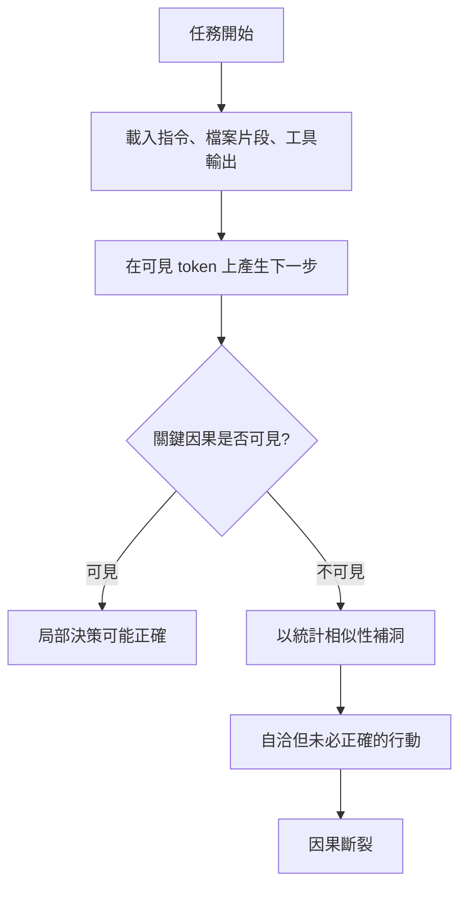

+++
title = "Agent 認知限制與錯誤表面：從因果斷裂到結構約束"
date = "2026-06-14T15:42:01+08:00"
author = "TTL::0"
draft = false
isCJKLanguage = true
description = "把 agent 想成「偶爾失誤的開發者」是危險誤解——它是無狀態序列生成系統。本文追蹤因果斷裂如何被封裝、runtime 落差、過度自由度與命名碰撞放大成錯誤表面，並以局部完備性與結構約束兩道防線，把 agent safety 從「希望模型別犯錯」轉為「讓錯誤更難發生、更難擴散」。"
tags = [
    "分析論述", # term:AnalyticalEssay
    "AI 代理人", # term:AiAgent
    "錯誤表面", # term:ErrorSurface
    "因果斷裂", # term:CausalBreakpoint
    "結構約束", # term:StructuralConstraint
    "局部完備性", # term:LocalCompleteness
    "命名空間碰撞", # term:NamespaceCollision
    "跨模組因果", # term:CrossModuleCausality
  ]
series = ["失效的源頭：在治理介入之前，錯誤與污染如何取得權威"]
[ai_info]
    [ai_info.generation]
        model = "GPT 5.5"
        agent = "Codex VS Code extension 26.609.30741"
    [ai_info.refinement]
        model = "Claude Opus 4.8"
        agent = "Claude Code VSCode Extension 2.1.177"
+++

---

<!--more-->

## 導言

AI agent 在工程協作中最危險的誤解，是把它想成「一位有時會失誤的開發者」。這個比喻太容易讓人把問題歸因為粗心、能力不足、prompt 不精確，或模型版本還不夠好。更準確的起點是：agent 是**無狀態**（Stateless） <!-- term:Stateless -->的序列生成系統。它每次只在當前載入的 token、工具輸出與指令集合內產生下一步行動，沒有跨 session 的自然記憶，也沒有自發追問「我缺了什麼因果背景」的能力。

> [!IMPORTANT]
> **無狀態** <!-- term:Stateless --> (Stateless): 不依賴任何中介追蹤檔、任務完成與否完全由輸出目錄的實體檔案決定的設計，帶來冪等性與韌性。 <!-- anchor:Stateless -->


這個限制本身不等於錯誤。錯誤發生在工程系統把「不可見的因果」包進封裝、抽象、runtime 綁定、過期文件、命名碰撞與自動回寫流程之後。對人類而言，這些缺口常能靠經驗、記憶、直覺與主動懷疑補上；對 agent 而言，不在可見 token 中的資訊就不參與決策。於是局部理解缺口會進入程式碼、文件與規格，最後變成系統性的**錯誤表面**（Error Surface） <!-- term:ErrorSurface -->。

> [!IMPORTANT]
> **錯誤表面** <!-- term:ErrorSurface --> (Error Surface): 系統中 AI 代理人或開發者可能引入錯誤或偏離設計意圖的自由度與決策空間範圍。 <!-- anchor:ErrorSurface -->


這裡真正想主張的是：agent safety 在工程層的第一個問題不是「如何要求 agent 更正確」，而是「如何設計讓錯誤更難被表示、放大與固化的結構」。**局部完備性**（Local Completeness） <!-- term:LocalCompleteness -->與**結構約束**（Structural Constraint） <!-- term:StructuralConstraint -->不是風格偏好，而是針對無狀態 <!-- term:Stateless -->生成限制的工程回應。

> [!IMPORTANT]
> **局部完備性** <!-- term:LocalCompleteness --> (Local Completeness): Agent 在單一檔案或函式內，無須跳轉或探索其他上下文即能做出正確修改決策的程式碼設計原則 <!-- anchor:LocalCompleteness -->
> **結構約束** <!-- term:StructuralConstraint --> (Structural Constraint): 限制開發自由度與變體形狀的程式碼結構設計，用以消除非法操作空間、收窄錯誤表面。 <!-- anchor:StructuralConstraint -->


## 最小模型：無狀態生成到因果斷裂

Agent 的工作狀態可以用一個最小模型描述：



這裡有三個判斷必須分開：

- 自洽：輸出內部看起來不矛盾。
- 正確：輸出符合系統真實狀態與需求。
- 可信：輸出的正確性有可檢查證據與授權邊界支撐。

自洽不等於正確，正確也不自動等於可信。Agent 可以根據可見 token 產生一段非常流暢、結構完整、局部一致的修改建議，但如果關鍵因果沒有被載入，它只是用相似模式把缺口補成合理敘事。這種敘事有時剛好正確，有時穩定錯誤；兩者在文字表面上不一定能分辨。

**因果斷裂**（Causal Breakpoint） <!-- term:CausalBreakpoint -->就是這個狀態：系統要求 agent 做出決策，但產生該決策所需的因果鏈沒有在可見材料中連續存在。斷裂可以有三種形態。第一種是「曾經存在但被刪除」，例如封裝與 DRY 把局部 why / why-not 收進遠端抽象。第二種是「從未存在」，例如 runtime 綁定、事件訂閱、非同步狀態變化本來就不在靜態文本裡。第三種是「錯誤存在」，例如過期治理文件、錯誤摘要或被污染後回寫的規格仍然以權威語氣出現在 context 中。

> [!IMPORTANT]
> **因果斷裂** <!-- term:CausalBreakpoint --> (Causal Breakpoint): AI Agent 運算中由於上下文視窗或靜態程式碼中關鍵因果資訊缺失，導致無法正確推演系統狀態的現象 <!-- anchor:CausalBreakpoint -->


這三者的危險程度不同。刪除型斷裂至少留下函式名、型別或介面作為線索；從未存在型斷裂讓 agent 不知道自己該找什麼；錯誤存在型最危險，因為它不只是缺口，而是帶著可信外觀的錯誤輸入。

## 從局部缺口到錯誤表面

錯誤表面 <!-- term:ErrorSurface -->是 agent 可能引入錯誤的自由度與決策空間。它不等於 bug 數量，而是 bug 能被寫出來、看起來合理、並通過局部檢查的空間。

一段取消訂單的程式可以說明「人類覺得整潔」與「agent 因果完整」之間的**差異**（Delta） <!-- term:Delta -->：

> [!IMPORTANT]
> **差異** <!-- term:Delta --> (Delta): 特定變更的契約，用於驅動實作並作為驗證實作的基準對象。 <!-- anchor:Delta -->


```javascript
// 對 agent 因果較完整
function processOrder(order) {
  // 只有 pending 且未出貨的訂單可取消。
  // 已出貨訂單走退貨流程，不走取消流程。
  if (order.status === "pending" && !order.shipped) {
    cancelOrder(order);
  }
}

// 對人類較整潔，但對 agent 刪掉了 why-not
function processOrder(order) {
  if (order.isCancellable()) {
    cancelOrder(order);
  }
}
```

第二段在人類眼中可能更乾淨。問題不是封裝本身錯，而是封裝把「為什麼已出貨訂單不能走這裡」移到了 agent 未必會讀到的位置。當後續任務要求修改取消規則時，agent 看見的是 `isCancellable()` 這個結果，而不是它背後排除退貨流程的因果。它很可能做出局部合理、全域錯誤的改動。

同樣的錯誤表面 <!-- term:ErrorSurface -->放大機制，也出現在過早泛化中：

```python
class SortableList:
    def sort(self, key: str = "name", reverse: bool = False, comparator=None):
        if comparator:
            self.items.sort(key=comparator, reverse=reverse)
        elif key == "name":
            self.items.sort(key=lambda x: x.name, reverse=reverse)
        elif key == "date":
            self.items.sort(key=lambda x: x.date, reverse=reverse)
        elif key == "size":
            self.items.sort(key=lambda x: x.size, reverse=reverse)

# 實際上全系統只使用這條路徑
file_list.sort("name")
```

這段程式碼暗示了多個變化軸：排序鍵、反向排序、自訂 comparator。若這些自由度沒有實際消費者，它們對 agent 不是彈性，而是噪音。Agent 會努力保護不存在的需求，甚至在變更時為幻影路徑補更多支撐。錯誤表面 <!-- term:ErrorSurface -->因此被放大：可選項越多、語意越鬆、runtime 才決定的關係越多，agent 需要猜測的地方就越多。

這不代表所有抽象都該拆掉。抽象有真實消費者、真實變化軸與清楚契約時，它能降低複雜度。風險來自抽象所暗示的自由度大於系統實際需要的自由度。對人類來說，多餘自由度只是「有點過度設計」；對 agent 來說，它會變成需要被推理、保護與延伸的假需求。

## Runtime、非同步與文本落差

Agent 擅長處理靜態可見的文本。工程系統卻大量依賴 runtime 才成立的關係。Observer、Strategy、Decorator chain、動態分派、metaclass、macro、proxy、mixin、monkey patching、`__getattr__`、`dyn Trait`、proc macro、`unsafe` block，都在不同程度上製造同一種落差：看見的文本不是實際執行的行為。

非同步程式尤其典型：

```javascript
const user = await getUser();
// 這裡讓出了控制權；其他流程可能已修改共享狀態。
const order = await getOrder(user.id);
```

人類看到 `await` 可能會想起 event loop、共享狀態、競態條件與錯誤路徑。Agent 若只做逐行模擬，會把兩行之間的世界當成靜止。中間狀態變化沒有 token，對它而言就像沒有發生。這不是「讀錯一行」；這是文本模型與執行模型不相等。

因此，agent 友善的程式碼不等於大量註解，也不等於犧牲封裝。它要求在決策點補足 agent 無法自行推導的訊號：why-not、**跨模組因果**（Cross-Module Causality） <!-- term:CrossModuleCausality -->、runtime 綁定清單、非同步邊界、型別**形狀**（Data Shape） <!-- term:DataShape -->、意圖測試與局部 README。重點不是把所有知識集中到一份百科，而是把決策所需的不可推導訊號放在決策附近。

> [!IMPORTANT]
> **跨模組因果** <!-- term:CrossModuleCausality --> (Cross-Module Causality): 一個模組的實作細節受限於另一個模組的隱含規則，且在靜態程式碼中不直接呈現的因果依賴 <!-- anchor:CrossModuleCausality -->
> **形狀** <!-- term:DataShape --> (Data Shape): 資料結構或物件所包含的屬性與型別定義，通常由型別系統來描述 <!-- anchor:DataShape -->


## 知識外化也會放大斷裂

工程團隊常以文件、規格與知識庫降低認知負擔。對 agent 來說，這些外化材料既是救命繩，也是污染入口。

人類給 agent 的矯正常常只傳遞結論，而不傳遞推理。例如「這次先跳過考古」可能在某個任務中完全合理，因為目標元件沒有歷史對應物，或行為本來就是全新設計。但如果只留下「可以跳過考古」這個模式，下一次 agent 可能把例外當規則。規則本身被記住了，規則成立的邊界卻消失了。

文件中的矯正也一樣。若某份文件曾錯稱某元件透過子行程切換權限，後來只把文字改成正確結論，卻沒有記錄「它其實在同一行程內完成，沒有 fork、沒有中間行程」這條因果，下一個協作者仍可能在相鄰問題上重建同樣的錯誤模型。只保存結論會讓文件看起來更乾淨，但更脆弱；保存推理鏈才讓 agent 能處理作者沒有預先列舉的邊界案例。

更嚴重的是自動回寫。當 agent 基於過期知識改壞共享程式碼，再由同步流程把新的壞行為寫回文件，錯誤就從暫時狀態變成權威事實。下一個 session 看到的不是「前一次可能犯錯」，而是一條乾淨、完整、語氣肯定的背景知識。錯誤不再像錯誤，而像系統現況。

這就是為什麼知識庫不能收納所有能從程式碼推導出的東西。能從程式碼推導的事實若被複製到集中知識庫，就多了一個過期入口。知識庫應保存的是程式碼推導不出的因果：被排除方案、歷史約束、跨模組依賴方向、外部整合限制。可從程式碼得到的事實應由程式碼與測試承載，避免製造第二個會漂移的真相來源。

## Token 命名空間也是錯誤表面

因果斷裂 <!-- term:CausalBreakpoint -->不只來自大型架構，也可能來自最小的 token。LLM 的 attention 不像程式語言有明確 scope。同一個 attention window 裡，相同或高度相似的 token 會互相吸引注意力，即使它們在人類語意上毫無關係。

如果一份協作文件反覆使用 `context`，而同一環境中又有 context window、context 目錄、input context、surrounding context 等不同意義，這些詞會在模型內形成不必要的群聚。人類能說「這裡的 context 只是普通英文」，模型卻不會因此切斷 attention 關聯。高頻、基礎設施含義強、又大量出現在路徑或指令裡的詞，會成為**命名空間碰撞**（Namespace Collision） <!-- term:NamespaceCollision -->點。

> [!IMPORTANT]
> **命名空間碰撞** <!-- term:NamespaceCollision --> (Namespace Collision): 專案命名（如目錄、變數）與 AI 基礎設施或 Tool 協定所使用的高權重詞彙重疊，導致 Attention 機制產生意外交叉參照與行為偏移的現象。 <!-- anchor:NamespaceCollision -->


Token 命名空間碰撞 <!-- term:NamespaceCollision -->的工程含義很直接：

- 新建目錄、檔案、規則與治理術語時，避免使用 LLM 基礎設施高權重詞彙作為反覆出現的名稱。
- 指令用**正面描述**（Positive Description） <!-- term:PositiveDescription -->允許集合，少用排除清單；排除清單會把不想讓模型注意的詞再注入一次。
- 無法避免碰撞時，用 compound term 或 domain-specific 名稱降低同形 token 的吸引力。

> [!IMPORTANT]
> **正面描述** <!-- term:PositiveDescription --> (Positive Description): 在引導 AI 時採用正面列舉允許集合的描述方式，避免使用排除清單將被排除項目的 Token 意外引入注意力空間。 <!-- anchor:PositiveDescription -->


這不是語言潔癖，而是錯誤表面 <!-- term:ErrorSurface -->控制。命名若讓模型的注意力在不相干概念間來回牽引，後續推理就會多一條隱形干擾路徑。

## 局部完備性：讓決策點自帶因果

局部完備性 <!-- term:LocalCompleteness -->指的是：agent 在一個檔案、一個函式或一個 extension point 內，能看到做出正確修改所需的最小因果。它不要求所有知識都塞在同一處；它要求「需要在此處決策的理由」不要被藏到 agent 不會自然讀到的地方。

局部完備性 <!-- term:LocalCompleteness -->可以用下表判斷：

| 決策需要什麼 | 常見缺口 | 局部補訊號 |
| :--- | :--- | :--- |
| 值的形狀 <!-- term:DataShape --> | 需要跳到多個實作才知道參數結構 | 型別標注、schema、Protocol |
| 排除原因 | 只看到做了什麼，看不到為何不做別的 | why-not 註解 |
| **預期行為**（Expected Behavior） <!-- term:ExpectedBehavior --> | 測試只覆蓋 happy path | 意圖測試與邊界測試 |
| runtime 關係 | 訂閱者、decorator、factory 只在執行期組合 | 綁定清單、註冊表、靜態表格 |
| 跨模組限制 | A 的寫法其實由 B 限制 | co-located README 或決策註解 |
| 命名邊界 | 同形詞與基礎設施語言碰撞 | domain-specific compound term |

> [!IMPORTANT]
> **預期行為** <!-- term:ExpectedBehavior --> (Expected Behavior): 系統或模組在特定輸入或情境下被要求達到的正確輸出與副作用狀態 <!-- anchor:ExpectedBehavior -->


局部完備性 <!-- term:LocalCompleteness -->也有邊界。第一，它不應成為「到處寫長註解」的藉口。能由型別、測試或結構表達的事，不必用散文重複。第二，它不適合把所有探索都預先約束。探索階段需要發散；extension 階段才需要收斂。第三，它不能替代外部驗證。局部完備只能降低 agent 在局部決策中猜錯的機率，不能證明全局需求正確。

## 結構約束：收窄可犯錯空間

局部完備性 <!-- term:LocalCompleteness -->補的是因果訊號；結構約束 <!-- term:StructuralConstraint -->收的是自由度。兩者的差異 <!-- term:Delta -->很重要：前者讓 agent 更容易理解，後者讓 agent 即使理解不完整，也比較難把錯誤寫成合法形狀 <!-- term:DataShape -->。

比較兩種 extension point：

```javascript
// 開放式自由修改：新增一種 resource 時，agent 必須自行決定順序、條件與路徑解析。
function classifyResource(path) {
  if (path.includes("/pages/")) return buildPage(path);
  if (path.includes("/posts/")) return buildPost(path);
  // 新增邏輯可能被插在任意位置，也可能複製漏掉某些路徑形式。
}
```

```typescript
// 受約束 extension point：新增變體只能填固定欄位。
type ResourceRule = {
  kind: "page" | "post" | "asset";
  pattern: RegExp;
  build: (path: string) => Resource | null;
};

const resourceRules: ResourceRule[] = [
  { kind: "page", pattern: /\/pages\//, build: buildPage },
  { kind: "post", pattern: /\/posts\//, build: buildPost },
  { kind: "asset", pattern: /\/assets\//, build: buildAsset },
];

function classifyResource(path: string): Resource | null {
  for (const rule of resourceRules) {
    if (rule.pattern.test(path)) return rule.build(path);
  }
  return null;
}
```

第一種設計把 extension 變成任意函式修改。Agent 需要判斷插入位置、條件順序、路徑解析重複、fallback 語意與副作用。第二種設計把 extension 收斂成「加一列資料，實作一個 build 函式」。錯誤仍可能發生，但錯誤表面 <!-- term:ErrorSurface -->小很多：非法形狀 <!-- term:DataShape -->被型別擋掉，變更位置集中，**引用完整性**（Referential Integrity） <!-- term:ReferentialIntegrity -->更容易檢查。

> [!IMPORTANT]
> **引用完整性** <!-- term:ReferentialIntegrity --> (Referential Integrity): 批量變更或重命名時，系統中所有交叉引用（包括非典型位置的類型標記與文件段落）皆被同步更新的狀態。 <!-- anchor:ReferentialIntegrity -->


這個原理可以寫成一句工程判斷：

```text
在收斂性任務中，error surface 與 structural constraint 成反比。
```

**收斂性任務**（Convergent Task） <!-- term:ConvergentTask -->的答案形狀 <!-- term:DataShape -->已知，工作是填入內容；extension point 通常就是這種任務。**發散性任務**（Divergent Task） <!-- term:DivergentTask -->則不同：架構探索、需求發現、方案比較，需要保留自由度。若把發散任務過早塞進固定表格，會讓 agent 只能在錯誤的空間內優化。結構約束 <!-- term:StructuralConstraint -->的用法不是「永遠約束」，而是在形狀 <!-- term:DataShape -->已知後，把後續重複 extension 轉成受限操作。

> [!IMPORTANT]
> **收斂性任務** <!-- term:ConvergentTask --> (Convergent Task): 答案形狀已知、主要工作為在既定結構內填入內容的開發任務，適合以強結構約束降低出錯率。 <!-- anchor:ConvergentTask -->
> **發散性任務** <!-- term:DivergentTask --> (Divergent Task): 答案形狀未知、需要廣泛探索設計方案的任務，此類任務需要較高的自由度而不宜過度約束。 <!-- anchor:DivergentTask -->


## 驅動模型與邊界誤用

工程系統會使用不同的決策權威：程式碼、測試、技能流程、品質**準則**（Guidelines） <!-- term:Guidelines -->、規格。每一層都能降低某些錯誤表面 <!-- term:ErrorSurface -->，也會在被過度延伸時製造新的錯誤。

> [!IMPORTANT]
> **準則** <!-- term:Guidelines --> (Guidelines): 強制性的專案準則，指導如何正確地做事 <!-- anchor:Guidelines -->


程式碼能回答系統現在做什麼，不保證為什麼這樣做。測試能回答某些行為是否回歸，不保證測試代表正確意圖。技能流程能讓操作一致，不保證目標正確。品質準則 <!-- term:Guidelines -->能提高下限，不保證方向正確。規格能定義完成條件，不保證規格本身仍然符合現實。

這個分層提醒我們：治理不是把最高層權威強塞到所有地方。低風險、低變動、局部可理解的模組，也許程式碼與測試就足夠。高風險、跨模組、會被 agent 重複 extension 的區域，則需要更強的結構與更明確的契約。錯誤不是使用了「低階」模型，而是把某一層的保證延伸到它不能保證的範圍。

對 agent 協作而言，最關鍵的問題是每一層是否說清楚自己的邊界。只要邊界不清，agent 會傾向把可見權威絕對化：文件像規格就照規格執行，MUST 像不可違反就不會質疑，過期觀察若寫得肯定就被當成事實。這也是為什麼觀察性描述、規範性需求與歷史推理不能混成同一種語氣。

## 實務含義

若要降低 agent 錯誤表面 <!-- term:ErrorSurface -->，可以從四個層次下手。

第一，讓關鍵決策點具備局部完備性 <!-- term:LocalCompleteness -->。不是所有地方都加註解，而是在有**排除邏輯**（Why-Not Comment） <!-- term:WhyNotComment -->、跨模組約束、runtime 綁定或非同步死區的地方補最小訊號。

> [!IMPORTANT]
> **排除邏輯** <!-- term:WhyNotComment --> (Why-Not Comment): 在程式碼中記錄「為何不採用某種方案」的說明，用以補全 Agent 無法從程式碼推導的因果鏈 <!-- anchor:WhyNotComment -->


第二，把重複 extension 改成受約束結構。能用 table、schema、enum、typed registry、parser 或固定欄位表達的，不要讓 agent 每次改寫任意函式。

第三，讓**知識路由**（Attribution Routing） <!-- term:AttributionRouting -->遵守「只外化不可推導者」。程式碼能推導的事不要複製成集中知識；程式碼推導不出的 why-not、歷史約束與跨模組因果 <!-- term:CrossModuleCausality -->，才值得外化。

> [!IMPORTANT]
> **知識路由** <!-- term:AttributionRouting --> (Attribution Routing): 將系統的非結構化知識或遺留債務，精準指派並分流至合適的追蹤與管理工具之機制。 <!-- anchor:AttributionRouting -->


第四，把命名當成 attention 空間設計。高頻治理詞、目錄名、規則名與工具名要避開 LLM 基礎設施語言，並優先用正面描述 <!-- term:PositiveDescription -->縮小載入集合。

這些做法的共同點是它們不要求 agent 變成人類。它們承認 agent 的限制，然後把系統設計成更少依賴隱性推理、更少暴露幻影自由度、更少把錯誤回寫成權威事實。

## 結論

Agent 的錯誤表面 <!-- term:ErrorSurface -->不是憑空出現的。它從無狀態 <!-- term:Stateless -->生成開始，經過不可見 token、因果斷裂 <!-- term:CausalBreakpoint -->、runtime 落差、過度自由度、命名碰撞與知識回寫，被工程系統一步步放大。

因此，正確的防線也不是單點技巧。局部完備性 <!-- term:LocalCompleteness -->讓決策點自帶必要因果；結構約束 <!-- term:StructuralConstraint -->讓非法或高風險操作更難被表示；知識路由 <!-- term:AttributionRouting -->避免過期事實取得權威外觀；命名空間管理減少 attention 干擾。四者合起來，才把 agent safety 從「希望模型不要犯錯」轉成「讓錯誤更難發生、更難擴散、更難固化」。

最可記憶的收束是：

```text
它能看見什麼？
它必須猜什麼？
它被允許改什麼？
```

Agent 協作的工程成熟度，就在這三個問題上。