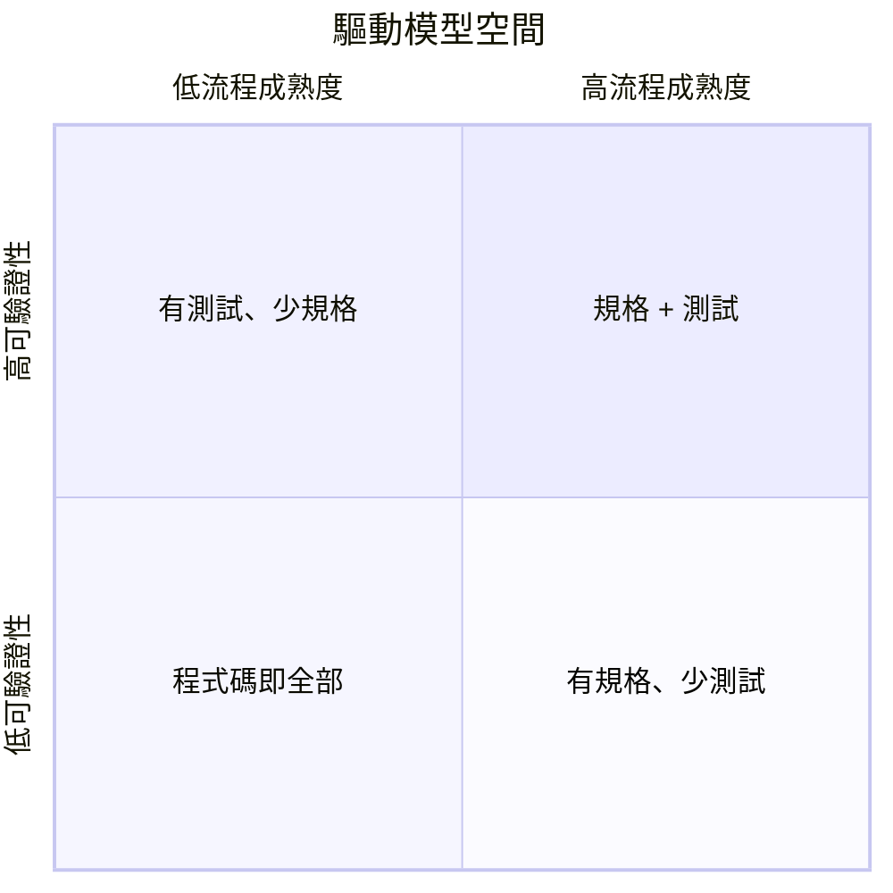
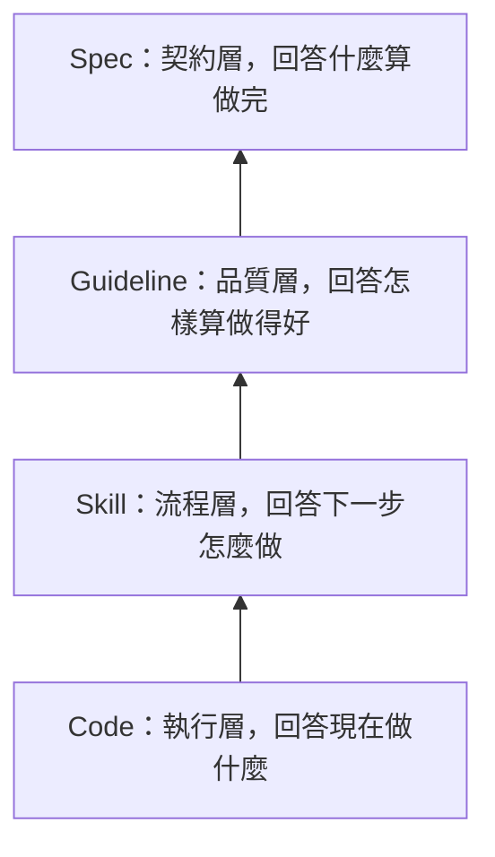

+++
title = "驅動模型與決策權威演化：從查閱什麼到由誰當家"
date = "2026-06-14T18:57:02+08:00"
author = "TTL::0"
draft = false
isCJKLanguage = true
description = "專案成熟時最難的問題不是缺什麼工具，而是「現在由誰說了算」。本文以驅動模型拆解程式碼、測試、技能、準則、規格五種決策權威的能力邊界，說明測試與流程成熟度正交、權威為層疊加法，並揭示跳層、儀式化與全域強制三種遷移反模式。"
tags = [
    "分析論述", # term:AnalyticalEssay
    "AI 代理人", # term:AiAgent
    "驅動模型", # term:DrivingModel
    "決策權威", # term:DecisionAuthority
    "能力邊界", # term:CapabilityBoundary
    "層疊共存", # term:LayeredCoexistence
    "遷移反模式", # term:MigrationAntiPattern
    "行為偶然化", # term:BehavioralAccidentalization
  ]
series = ["信任與權威的成立：可信不是輸出屬性，而是被非同源裁決授權的狀態"]
[ai_info]
    [ai_info.generation]
        model = "GPT 5.5"
        agent = "Codex VS Code extension 26.609.30741"
    [ai_info.refinement]
        model = "Claude Opus 4.8"
        agent = "Claude Code VSCode Extension 2.1.177"
+++

<!--more-->

## 導言

專案成熟時，最難回答的問題常常不是「還缺什麼工具」，而是「現在到底由誰說了算」。同一段行為可能被程式碼實作、測試案例、操作流程、品質**準則**（Guidelines） <!-- term:Guidelines -->與需求規格同時描述。當它們彼此一致時，團隊感覺不到**差異**（Delta） <!-- term:Delta -->；當它們分歧時，真正的架構才會露出來。

> [!IMPORTANT]
> **準則** <!-- term:Guidelines --> (Guidelines): 強制性的專案準則，指導如何正確地做事 <!-- anchor:Guidelines -->
> **差異** <!-- term:Delta --> (Delta): 特定變更的契約，用於驅動實作並作為驗證實作的基準對象。 <!-- anchor:Delta -->


本文把這種架構稱為**驅動模型**（Driving Model） <!-- term:DrivingModel -->。驅動模型 <!-- term:DrivingModel -->不是工具分類，也不是文件格式分類，而是**決策權威**（Decision Authority） <!-- term:DecisionAuthority -->的分配方式。判斷一個專案目前由什麼模型驅動，最實用的問題是：當團隊對「這個行為是否正確」產生分歧時，最後會查閱什麼，並讓什麼推翻其他說法。

> [!IMPORTANT]
> **驅動模型** <!-- term:DrivingModel --> (Driving Model): 專案決策權威的分配方式：當團隊對「行為是否正確」分歧時，最終會查閱並服從何種媒介（程式碼、測試、技能、準則或規格），而非工具或文件格式的分類。 <!-- anchor:DrivingModel -->
> **決策權威** <!-- term:DecisionAuthority --> (Decision Authority): 爭議發生時能裁決答案的媒介；驅動模型即由決策權威落在何處來定義，權威隨專案演化在程式碼、測試、技能、準則與規格之間轉移。 <!-- anchor:DecisionAuthority -->


這個角度會改變對成熟度的理解。程式碼驅動不是低級，規格驅動也不是天然高級。每個模型都有自己能保證的東西，也有自己不能保證的邊界。真正的失敗通常不是用了某個模型，而是把某個模型的權威延伸到它不能保證的範圍之外。

## 分析

驅動模型 <!-- term:DrivingModel -->的第一個詞是決策權威 <!-- term:DecisionAuthority -->。它指的是在爭議發生時能裁決答案的媒介：程式碼、測試、技能、準則 <!-- term:Guidelines -->或規格。第二個詞是**能力邊界**（Capability Boundary） <!-- term:CapabilityBoundary -->。它指的是這個媒介能穩定保證什麼，以及不能保證什麼。第三個詞是語義缺口。它指的是上一個模型無法表達、必須由下一個模型補上的意義。

> [!IMPORTANT]
> **能力邊界** <!-- term:CapabilityBoundary --> (Capability Boundary): 某個驅動媒介能穩定保證什麼、以及不能保證什麼的界線；典型失敗來自把決策權威過度延伸到能力邊界之外，要求媒介回答它回答不了的問題。 <!-- anchor:CapabilityBoundary -->


這三個詞放在一起，才能避免把驅動模型 <!-- term:DrivingModel -->誤讀成方法論偏好。團隊說「我們有測試」不等於測試持有決策權威 <!-- term:DecisionAuthority -->；團隊說「我們有規格」也不等於規格真的能推翻程式碼。真正要看的不是文件是否存在，而是分歧時誰會被服從。

五種模型可以先用一張矩陣定位：

| 模型 | 決策權威 <!-- term:DecisionAuthority --> | 回答的問題 | 能保證 | 不能保證 | 典型失敗 |
| :--- | :--- | :--- | :--- | :--- | :--- |
| 程式碼驅動 | 程式碼本身 | 系統現在做什麼？ | 系統可運行，真相來源單一 | 行為是否符合意圖 | **行為偶然化**（Behavioral Accidentalization） <!-- term:BehavioralAccidentalization --> |
| 測試驅動 | 測試案例 | 行為是否符合已表達的預期？ | 可驗證、可回歸 | 測試是否反映正確意圖 | 測試即規格的錯覺 |
| 技能驅動 | 技能或操作流程 | 下一步怎麼做？ | 操作流程一致 | 操作目標是否正確 | **流程儀式化**（Process Ritualization） <!-- term:ProcessRitualization --> |
| **準則驅動**（Guideline-Driven） <!-- term:GuidelineDriven --> | 品質準則 <!-- term:Guidelines --> | 怎樣算做得好？ | 品質下限、review 依據 | 品質是否對齊業務需求 | **品質空轉**（Quality Idling） <!-- term:QualityIdling --> |
| 規格驅動 | 行為規格 | 什麼算做完？ | 行為契約明確 | 規格是否反映真實需求 | 規格與現實脫節 |

> [!IMPORTANT]
> **行為偶然化** <!-- term:BehavioralAccidentalization --> (Behavioral Accidentalization): 程式碼實作中的偶然副作用，被後繼開發者誤當作預期設計意圖並據此進行決策的漸進退化機制。 <!-- anchor:BehavioralAccidentalization -->
> **流程儀式化** <!-- term:ProcessRitualization --> (Process Ritualization): 過度關注操作程序與執行步驟的一致性，卻忽略程序所服務之實際業務目標的退化現象。 <!-- anchor:ProcessRitualization -->
> **準則驅動** <!-- term:GuidelineDriven --> (Guideline-Driven): 以自動化規則與檢查哨護欄引導系統演進的過程導向開發模式。 <!-- anchor:GuidelineDriven -->
> **品質空轉** <!-- term:QualityIdling --> (Quality Idling): 系統程式碼指標完美符合所有既定的靜態品質準則，但實質功能與業務意圖卻已嚴重偏離的失敗模式。 <!-- anchor:QualityIdling -->


矩陣的重點不是排序，而是邊界。程式碼可以精確描述系統現在怎麼做，卻不擅長保存「為什麼這樣做」。測試可以保護已表達的預期，卻無法自行證明預期是對的。技能讓流程可重複，卻不保證流程服務的目標正確。準則 <!-- term:Guidelines -->能降低品質下限，卻不能替業務決定完成條件。規格能定義完成條件，卻仍可能與現實需求脫節。

這裡出現第一個統一洞見：每個模型的失敗，都是把自身權威邊界過度延伸到能力邊界 <!-- term:CapabilityBoundary -->之外。程式碼驅動失敗時，團隊把「能跑」當成「正確」。測試驅動失敗時，團隊把「測試通過」當成「意圖正確」。準則驅動 <!-- term:GuidelineDriven -->失敗時，團隊把「符合品質規則」當成「方向正確」。這些失敗不是模型本身無用，而是模型被要求回答它回答不了的問題。

程式碼驅動是最好的起點案例。它有真實價值：零抽象開銷、單一真相來源、最短迭代週期。對原型、小工具或低風險模組來說，程式碼驅動可能正是最合理的模型。它不需要維護規格，不需要同步流程，也不會出現「文件說 A、程式碼做 B」的漂移。

它的極限也同樣清楚。程式碼記錄「做什麼」和「怎麼做」，但不可靠地記錄「為什麼做」與「什麼時候算完成」。當原始作者離開、記憶消退、或系統規模超過團隊的認知容量時，行為就會從「被理解的設計」變成「碰巧存在的狀態」。後來的人看到特殊分支，無法判斷它是設計意圖、歷史偶然，還是 bug 的副作用。

這就是行為偶然化 <!-- term:BehavioralAccidentalization -->。它的危險不是單一錯誤，而是每次修改都失去可靠判斷基準。團隊開始詢問多人、延長 review、迴避觸碰核心區域。這些訊號通常是社會性的，而不是技術性的：新成員上手變慢、review 留下「不確定會不會影響 X」、修改前需要找人問歷史。當這些訊號累積，程式碼驅動的低成本開始反轉成高風險。

演化不是因為後面的模型比較高級，而是因為前一個模型的失敗成本超過了新增權威層的維護成本。這可以用一個簡單判準表達：

```text
若「保留現有模型造成的失敗成本」
大於「引入新權威層的建立與維護成本」，
才有遷移理由。
```

這個判準也解釋為什麼成熟度不能全域套用。同一個 repo 裡，核心計費邏輯可能需要規格驅動，內部一次性資料轉換腳本可能只需要程式碼驅動。把低風險模組強迫升級到最高抽象層，不是治理成熟，而是把維護成本施加到不需要的位置。

測試驅動需要特別拆開，因為它最容易被放錯位置。測試回答的是「行為是否可驗證」，而不是「流程由哪種權威裁決」。一個程式碼驅動專案可以有大量測試，因為測試能保護既有行為不被破壞；一個規格驅動專案也可能暫時缺少自動化測試，因為規格定義了契約，但驗證尚未自動化。

這使測試驅動與流程成熟度正交：



這張圖避免一個常見誤判：以為團隊必須先完成某種流程成熟度，才能引入測試。實際上，測試可以在任何位置疊加，因為它增加的是可驗證性，不是流程權威本身。反過來，有測試也不代表團隊已經解決意圖來源問題；測試若沒有上游意圖，只能穩定地保護「已經被寫成測試的行為」。

排除測試這個正交維度後，流程成熟度軸可以理解為四層：程式碼、技能、準則 <!-- term:Guidelines -->、規格。每一層都補前一層缺少的語義。



這張圖最重要的方向是由下往上。新模型不是取代舊模型，而是取得更高層的決策權威 <!-- term:DecisionAuthority -->，並讓舊模型降格為基礎設施。規格驅動的專案仍然需要準則 <!-- term:Guidelines -->、技能與程式碼。準則驅動 <!-- term:GuidelineDriven -->的專案仍然需要技能與程式碼。拿掉底層，頂層不會獨立運作。

**層疊共存**（Layered Coexistence） <!-- term:LayeredCoexistence -->也帶來成本。每多一層，就多一份需要維護的權威材料。規格要和需求同步，準則 <!-- term:Guidelines -->要和工程實踐同步，技能要和工具鏈同步，程式碼要和上層描述一致。因此演化的問題不是「能不能加一層」，而是「這一層現在是否值得維護」。

> [!IMPORTANT]
> **層疊共存** <!-- term:LayeredCoexistence --> (Layered Coexistence): 新引入的決策模型不取代前序模型，而是將前序模型降格為其底層基礎設施共同運作的演化結構。 <!-- anchor:LayeredCoexistence -->


實務上可以從一個診斷走查開始。假設團隊爭論「退款是否應該允許超過 30 天的訂單」。診斷不是先問有哪些文件，而是看裁決路徑：

```text
1. 團隊先讀 service code，因為沒有其他描述。
   -> 該模組目前由程式碼驅動。

2. 團隊先跑 refund tests，並把測試視為不可破壞的預期。
   -> 可驗證性很強，但仍要問測試是否有上游意圖來源。

3. 團隊查操作手冊，確認客服處理退款的標準步驟。
   -> 退款流程可能由技能驅動。

4. 團隊查品質準則，確認錯誤處理、審計紀錄與例外格式。
   -> 品質面由準則驅動，但完成條件仍未必被定義。

5. 團隊查需求規格，規格明定 30 天外退款需主管核准。
   -> 行為契約由規格驅動。
```

同一功能在**不同模型**（Different Models） <!-- term:DifferentModels -->下，「真相來源」與「完成判準」會完全不同。下面用 pseudo-code 展示差異 <!-- term:Delta -->：

> [!IMPORTANT]
> **不同模型** <!-- term:DifferentModels --> (Different Models): 在 1:N 協作拓撲中，指使用具備不同權重、上下文或隨機種子的模型進行交叉 Review，以利用其注意力分佈的差異來展開單一模型可能遺漏的盲區。 <!-- anchor:DifferentModels -->


```text
Feature: refund(order)

程式碼驅動：
  真相來源 = refund() 目前的 if/else
  完成判準 = 修改後仍能執行，且人工觀察結果合理

測試驅動：
  真相來源 = tests/refund_cases
  完成判準 = 所有已表達案例通過，新增案例能保護回歸

技能驅動：
  真相來源 = refund-operation.md 的處理步驟
  完成判準 = 執行者能照流程一致完成退款作業

準則驅動：
  真相來源 = error-handling / audit / privacy guidelines
  完成判準 = 實作符合紀錄、錯誤處理、權限與品質規則

規格驅動：
  真相來源 = refund.spec 的業務場景與例外規則
  完成判準 = 規格列出的場景全部被滿足，且實作不得違反契約
```

這個對照凸顯一件事：不同模型 <!-- term:DifferentModels -->不是同一件事的不同包裝，而是在不同層級回答不同問題。把測試寫得再完整，也不能自動回答 30 天外退款是否符合政策。把規格寫得再清楚，也不能自動保證程式碼品質符合安全準則 <!-- term:Guidelines -->。每層都需要自己的權威與驗證方式。

真實專案通常是混合狀態，而不是整齊落在單一格子裡。例如：

| 區域 | 合理驅動模型 <!-- term:DrivingModel --> | 理由 |
| :--- | :--- | :--- |
| 計費與退款核心 | 規格驅動 + 測試 | 行為錯誤會直接造成財務與信任風險，完成條件需明確。 |
| 後台資料修復工具 | 技能驅動 + 測試 | 重點是操作一致與可回歸，業務契約較窄。 |
| UI 樣式微調 | 準則驅動 <!-- term:GuidelineDriven --> | 需要設計與品質一致性，但不一定需要完整行為規格。 |
| 一次性 migration script | 程式碼驅動 | 生命週期短、風險可隔離，額外權威層可能不划算。 |

這種混合不是不成熟，而是模型與風險匹配。問題出在團隊假裝所有區域都由同一模型治理，或把最高風險區域的模型全域套到低風險區域。前者會遮蔽風險，後者會製造過度工程。

遷移失敗通常有三種反模式。第一種是**跳層遷移**（Layer-Skipping Migration） <!-- term:LayerSkippingMigration -->：在基礎層尚未能穩定運作時，直接引入高階權威。例如團隊沒有穩定操作流程，也沒有品質準則 <!-- term:Guidelines -->，卻要求所有功能立刻規格驅動。結果規格存在，但執行流程混亂、產出品質不一致，規格無法真正落地。

> [!IMPORTANT]
> **跳層遷移** <!-- term:LayerSkippingMigration --> (Layer-Skipping Migration): 在前置的流程或品質基礎設施尚未完備前，強行引入高階行為契約模型的演化反模式。 <!-- anchor:LayerSkippingMigration -->


第二種是**儀式化採納**（Ritualized Adoption） <!-- term:RitualizedAdoption -->：形式上導入新模型，實質上不讓它持有權威。最典型的情境是規格已建立，但爭議發生時團隊仍說「以程式碼為準」。這會產生雙重損失：規格需要維護，卻不能裁決；程式碼繼續握有權威，卻多了一份會漂移的裝飾文件。

> [!IMPORTANT]
> **儀式化採納** <!-- term:RitualizedAdoption --> (Ritualized Adoption): 形式上導入新的管理或技術模型，但實質決策權威並未真正轉移的無效演化反模式。 <!-- anchor:RitualizedAdoption -->


第三種是**全域強制**（Global Enforcement） <!-- term:GlobalEnforcement -->：不看模組風險與生命週期，要求所有區域採用同一高階模型。核心業務被規格驅動是合理的，但臨時工具、探索性原型或低風險腳本若被迫維護完整規格，成本會超過收益。全域一致看似乾淨，實際上可能讓團隊繞過流程，或讓文件快速失真。

> [!IMPORTANT]
> **全域強制** <!-- term:GlobalEnforcement --> (Global Enforcement): 不顧模組的規模與風險差異，盲目對全系統統一實施最高抽象層級之行為規格定義的反模式。 <!-- anchor:GlobalEnforcement -->


三種反模式共享同一根因：忽略層疊共存 <!-- term:LayeredCoexistence -->中的**前置條件**（Prerequisite） <!-- term:Prerequisite -->、權威轉移與維護成本。跳層忽略前置條件 <!-- term:Prerequisite -->，儀式化採納 <!-- term:RitualizedAdoption -->忽略權威轉移，全域強制 <!-- term:GlobalEnforcement -->忽略維護成本與局部差異 <!-- term:Delta -->。

> [!IMPORTANT]
> **前置條件** <!-- term:Prerequisite --> (Prerequisite): 執行某項開發活動之前必須滿足的準備工作或狀態。 <!-- anchor:Prerequisite -->


## 結論

驅動模型 <!-- term:DrivingModel -->容易被誤用成成熟度排名：程式碼驅動低、測試驅動中、規格驅動高。這種排名有吸引力，因為它把複雜判斷壓縮成單一路線。但它也最危險，因為它讓團隊追求看起來更成熟的形式，而不是辨識當前真正的能力缺口。

更好的問題不是「我們該升級到哪個模型」，而是「現在的分歧誰能裁決」。如果沒有任何東西能裁決行為意圖，可能需要規格。若流程每次都靠個人記憶，可能需要技能。若產出品質受個人口味左右，可能需要準則 <!-- term:Guidelines -->。若行為無法被自動保護，可能需要測試。這些回答可以同時成立，但它們不在同一條線上。

另一個張力是權威與現實的關係。規格驅動把完成條件放到程式碼之外，這能避免程式碼壟斷意圖，但也引入**規格漂移**（Spec Drift） <!-- term:SpecDrift -->風險。準則驅動 <!-- term:GuidelineDriven -->讓品質標準可討論，卻可能讓團隊追求可檢查的品質而忘記不可檢查的需求。測試驅動讓回歸可見，卻可能把測試資料中的偶然偏見固化。任何權威一旦取得裁決地位，都需要被它自己的失敗模式約束。

> [!IMPORTANT]
> **規格漂移** <!-- term:SpecDrift --> (Spec Drift): 系統行為規格文件與真實程式碼實作之間，隨著時間演化產生的語意偏離現象。 <!-- anchor:SpecDrift -->


因此，驅動模型 <!-- term:DrivingModel -->不是「找到唯一正確權威」的理論，而是「讓權威有名字、有邊界、有成本」的理論。命名權威讓團隊知道爭議時該查什麼。標出邊界讓團隊知道它不能回答什麼。計算成本讓團隊知道什麼時候該遷移，什麼時候該停止。

## 結論

驅動模型 <!-- term:DrivingModel -->描述的是專案此刻由哪種媒介持有決策權威 <!-- term:DecisionAuthority -->。程式碼、測試、技能、準則 <!-- term:Guidelines -->與規格各自有效，也各自有限。它們的差異 <!-- term:Delta -->不在於誰比較高級，而在於它們回答不同問題、提供不同保證、承擔不同維護成本。

本文的核心原則可以收束為四點。第一，辨識模型時問「分歧時查閱什麼」，不要只看文件或工具是否存在。第二，每個模型的失敗都來自權威邊界被過度延伸；先看能力邊界 <!-- term:CapabilityBoundary -->，再談升級。第三，測試驅動與流程成熟度正交，它增加可驗證性，但不自動提供意圖來源。第四，演化是層疊加法，不是替換；新權威層取得裁決權，舊層仍作為基礎設施運作。

最成熟的狀態不是全專案一致地規格驅動，而是每個區域的權威層與風險、成本、生命週期匹配。當團隊能說清楚「這裡由程式碼裁決，那裡由規格裁決，這一層由測試保護，那一層由準則 <!-- term:Guidelines -->控品質」，驅動模型 <!-- term:DrivingModel -->就不再是抽象分類，而成為可用的工程判斷語言。