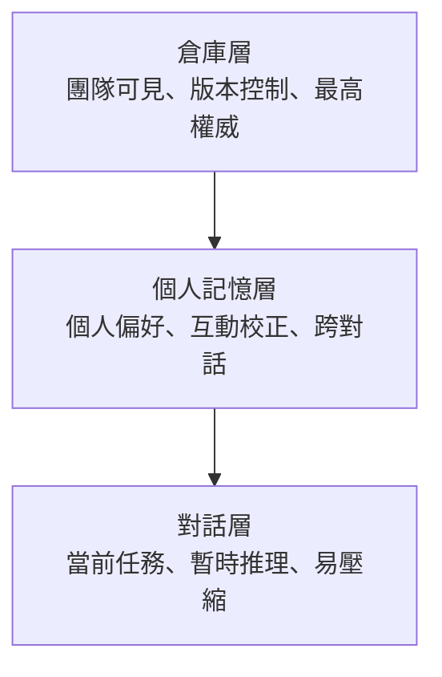
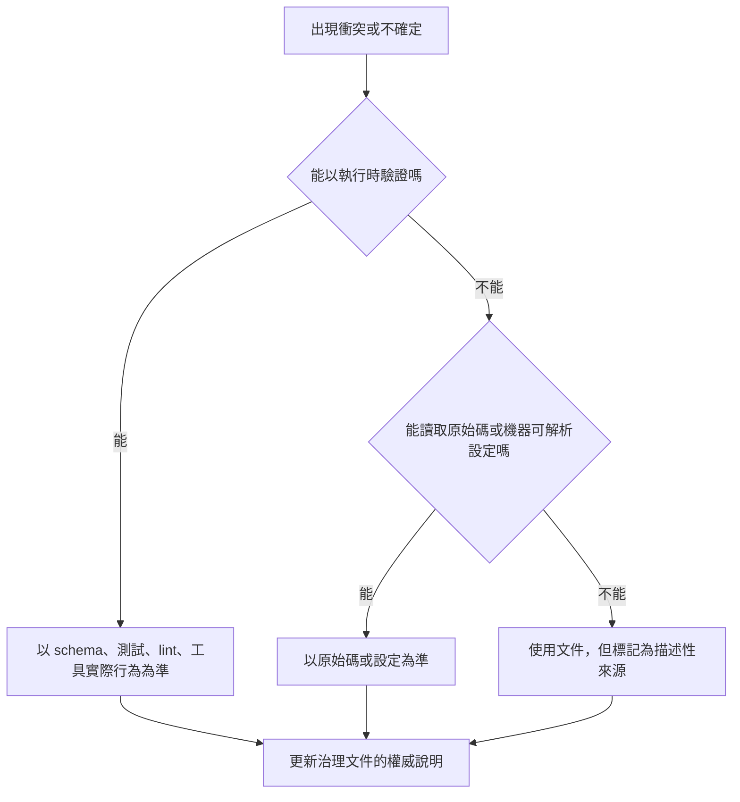
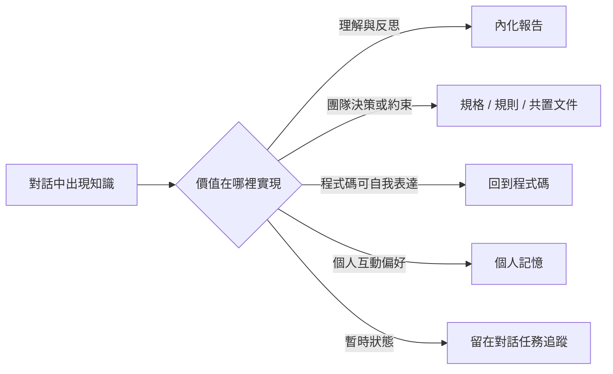

+++
title = "AI 協作治理與知識架構：薄入口、可驗證權威與知識路由"
date = "2026-06-14T16:17:01+08:00"
author = "TTL::0"
draft = false
isCJKLanguage = true
description = "AI 協作把一個老問題放大了：專案知識到底應該放在哪裡？過去，團隊主要在程式碼、文件、規格與口頭溝通之間分配知識。引入 agent 後，新的載體加入了系統：永遠載入的專案入口、工具原生規則、個人記憶、對話上下文、知識萃取報告、外部平台文件、lint 或 schema 這類執行工具。這些載體都能影響 agent 的行動，但它們的耐久性、可見性、權威性與載入時機完全不同。"
tags = [
    "分析論述", # term:AnalyticalEssay
    "AI 代理人", # term:AiAgent
    "AI 治理", # term:AIGovernance
    "知識管理", # term:KnowledgeManagement
    "權威漂移", # term:AuthorityDrift
    "知識萃取", # term:KnowledgeExtraction
    "單一事實來源", # term:SingleSourceOfTruth
    "政策聲明模型", # term:PolicyDeclarationModel
  ]
series = ["知識與意圖的治理：讓承載權威的載體回到能被驗證與退場的位置"]
[ai_info]
    [ai_info.generation]
        model = "GPT 5.5"
        agent = "Codex VS Code extension 26.609.30741"
    [ai_info.refinement]
        model = "Claude Opus 4.8"
        agent = "Claude Code VSCode Extension 2.1.177"
+++

<!--more-->

## 背景

AI 協作把一個老問題放大了：專案知識到底應該放在哪裡？過去，團隊主要在程式碼、文件、規格與口頭溝通之間分配知識。引入 agent 後，新的載體加入了系統：永遠載入的專案入口、工具原生規則、個人記憶、對話上下文、**知識萃取**（Knowledge Extraction） <!-- term:KnowledgeExtraction -->報告、外部平台文件、lint 或 schema 這類執行工具。這些載體都能影響 agent 的行動，但它們的耐久性、**可見性**（Visibility） <!-- term:Visibility -->、權威性與載入時機完全不同。

> [!IMPORTANT]
> **知識萃取** <!-- term:KnowledgeExtraction --> (Knowledge Extraction): 從非結構化的開發對話中，提取有價值決策與技術知識的過程。 <!-- anchor:KnowledgeExtraction -->
> **可見性** <!-- term:Visibility --> (Visibility): 知識在開發團隊或 AI 代理人之間的公開與可存取程度。 <!-- anchor:Visibility -->


失效通常不是因為文件太少，而是因為不同性質的知識被放進同一個容器。入口檔膨脹成百科全書，個人記憶複製了會變動的程式碼結構，治理文件重述外部工具已經定義的規則，知識庫保存早該被程式碼或規格吸收的考古筆記。表面上，這些做法都在「增加上下文」；實際上，它們製造了**權威漂移**（Authority Drift） <!-- term:AuthorityDrift -->、注意力污染與維護債務。

> [!IMPORTANT]
> **權威漂移** <!-- term:AuthorityDrift --> (Authority Drift): 治理文件複製外部權威、或後設資料殘留舊術語，使文件逐漸偏離系統實際行為、讓讀者誤信過期內容的現象。 <!-- anchor:AuthorityDrift -->


說到底，我真正想主張的是：AI 協作治理不是把知識集中，而是讓每種知識保持在能被正確消費、驗證與退場的位置。治理入口應該是地圖，不是領土；權威文件必須有驗證優先序；既有穩定權威應被委派，而不是被複製；對話中的知識要按價值路由到內化報告、專案文件或直接回到程式碼。

這裡的「**主體**（Subject） <!-- term:Subject -->、**客體**（Object） <!-- term:Object -->、能力、邊界」是最小詞彙。主體 <!-- term:Subject -->是會讀取並行動的人或 agent。客體 <!-- term:Object -->是被讀取、修改或驗證的程式碼、文件、規格、工具與記憶。能力是載入、搜尋、生成、修改、執行與驗證。邊界則決定主體 <!-- term:Subject -->在何種情境下能對哪些客體 <!-- term:Object -->使用哪些能力。治理文件的任務，就是讓這些邊界足夠清楚，讓 agent 不需要用猜測填補制度空白。

> [!IMPORTANT]
> **主體** <!-- term:Subject --> (Subject): 權限檢查中發起操作的一方，在 Linux 中由 process credentials（UID、GID、capabilities 等）描述其身分與當下能力。 <!-- anchor:Subject -->
> **客體** <!-- term:Object --> (Object): 權限檢查中被存取的目標，例如檔案、目錄、Unix socket、device 等 kernel object，其類型決定 kernel 走哪一條檢查路徑。 <!-- anchor:Object -->


## 分析

### 治理失效的起點：單體入口與錯位知識

最常見的起點是一個永遠載入的單體入口。它一開始只是專案說明，後來加上建置命令、工程慣例、架構願景、工作流模板、歷史注意事項、lint 規則、例外清單與各種警語。當所有內容都被放進同一層時，入口看似完整，實際上失去判斷力：它無法區分「任何時候都必須知道」和「只有修改特定目錄時才需要知道」。

這個錯位有兩個代價。第一是 context 成本。agent 在處理前端樣式時被迫讀到後端資料庫規則，在修改 shell script 時被迫讀到 Rust 專用範例。第二是權威模糊。當入口同時包含概覽、規則、規格片段與歷史筆記時，agent 無法判斷哪一段是必須遵守的約束，哪一段只是背景資訊。

薄入口模型解決的是這個問題。入口只保留三種內容：最高層級的邊界宣告、知識**查找順序**（Discovery Rule） <!-- term:DiscoveryRule -->、以及指向下層權威的路由。它不是把所有知識搬進來，而是讓 agent 知道往哪裡讀、何時讀、讀到衝突時誰勝出。

> [!IMPORTANT]
> **查找順序** <!-- term:DiscoveryRule --> (Discovery Rule): 決定知識或文件查找順序的規則 <!-- anchor:DiscoveryRule -->


錯誤的入口會長成這樣：

```markdown
# AGENTS.md
- 前端元件必須使用某框架慣例。
- 後端 migration 必須遵守資料庫流程。
- 所有 lint spacing 規則如下：...
- 歷史上某模組曾經有資源釋放問題，請注意。
- 發布流程、測試流程、架構原則與例外清單如下：...
```

薄入口應該更接近這樣：

```markdown
# AGENTS.md
- 先確認本次任務的客體：程式碼、規格、規則、文件或工具設定。
- 修改 `src/frontend/` 前讀取 `src/frontend/AGENTS.md`。
- 格式化規則委派給專案 lint 設定；本檔只列偏離項。
- 當規格、就近 README 與歷史知識衝突時，依查找順序處理。
```

**差異**（Delta） <!-- term:Delta -->不在於第二份比較短，而在於它保留了入口的職責。入口只讓下一步可判斷，不試圖替代所有下游文件。

> [!IMPORTANT]
> **差異** <!-- term:Delta --> (Delta): 特定變更的契約，用於驅動實作並作為驗證實作的基準對象。 <!-- anchor:Delta -->


### 知識層級：耐久性、可見性與消費者

治理入口之所以不能承載全部內容，是因為知識本來就分層。最基本的三層是**倉庫層**（Repo-Committed） <!-- term:RepoCommitted -->、**個人記憶層**（Per-User Memory） <!-- term:PerUserMemory -->與**對話層**（Conversation Context） <!-- term:ConversationContext -->。倉庫層 <!-- term:RepoCommitted -->包含程式碼、規格、共置 README、規則與提交過的治理文件；它對團隊可見，由版本控制保護，耐久性最高。個人記憶層 <!-- term:PerUserMemory -->跨對話存續，但只服務單一使用者；它適合保存使用者偏好、互動校正與外部參照，不適合保存專案事實。對話層 <!-- term:ConversationContext -->是單次工作中的短暫推理空間；它適合承載當前任務的試探、推論與暫時狀態。

> [!IMPORTANT]
> **倉庫層** <!-- term:RepoCommitted --> (Repo-Committed): 提交至版本控制系統之專案倉庫的耐久知識，如程式碼、規格與規則。 <!-- anchor:RepoCommitted -->
> **個人記憶層** <!-- term:PerUserMemory --> (Per-User Memory): 代理人為個別使用者維護的偏好與互動記憶，不提交至版本控制。 <!-- anchor:PerUserMemory -->
> **對話層** <!-- term:ConversationContext --> (Conversation Context): 對話上下文在三層知識模型中所處的即時、短暫的資訊暫存層。 <!-- anchor:ConversationContext -->




這個模型的重點不是排名，而是責任差異 <!-- term:Delta -->。倉庫層 <!-- term:RepoCommitted -->承擔團隊共享知識；個人記憶承擔使用者互動模式；對話層 <!-- term:ConversationContext -->承擔當下探索。把程式碼結構寫進個人記憶，會讓記憶在下一次重構後變成錯誤來源。把長期架構決策只留在對話裡，會讓它在**上下文壓縮**（Context Compression） <!-- term:ContextCompression -->後變成殘缺摘要。把個人偏好提交成團隊規則，則會把一個人的工作方式誤升格為制度。

> [!IMPORTANT]
> **上下文壓縮** <!-- term:ContextCompression --> (Context Compression): AI 對話中因長度限制而自動摘要上下文的機制 <!-- anchor:ContextCompression -->


分層還要看消費者。**主要消費者**（Primary Consumer） <!-- term:PrimaryConsumer -->是 agent 的文件，應該盡量可機器解析、可檢索、可路由。主要消費者 <!-- term:PrimaryConsumer -->是人類的報告，應該以理解成本最低的語言與敘事方式呈現。治理文件若忽略消費者，就會出現一種奇怪的混合物：人類讀起來像機器配置，agent 讀起來又缺少明確可執行邊界。

> [!IMPORTANT]
> **主要消費者** <!-- term:PrimaryConsumer --> (Primary Consumer): 使用或解讀特定文件/知識的核心對象（如代理人或人類團隊成員）。 <!-- anchor:PrimaryConsumer -->


知識晉升的判斷也來自這裡。當某個對話洞見重複出現、影響實作決策、來自使用者校正，或對團隊其他人也有價值，它就不應繼續只停留在對話中。它可能晉升為個人記憶，也可能直接進入倉庫層 <!-- term:RepoCommitted -->。相反地，若一段資訊只是本次任務的暫時狀態，硬把它寫進耐久層反而會製造噪音。

### 權威不是宣告，而是可驗證狀態

分層解決「知識放哪裡」，但還沒有解決「衝突時相信誰」。治理文件常宣稱自己對齊外部權威，例如官方文件、工具原生 schema、lint 預設、框架標準或組織規格。問題在於，宣稱對齊並不等於實際對齊。官方文件可能落後於執行時，範例可能停留在舊版本，front matter 或註解可能殘留舊術語，計畫中的整合也可能被寫成已完成的事實。

因此，治理框架需要驗證優先序。若要判斷某個工具欄位名稱是否有效，執行時 schema 驗證器比官方文字描述更接近實際行為；原始碼通常比文件更接近設計實作；文件則是**描述性**（Descriptive） <!-- term:Descriptive -->來源，不能無條件壓過系統實際接受的行為。

> [!IMPORTANT]
> **描述性** <!-- term:Descriptive --> (Descriptive): 用於記錄系統「實際如何運作」的知識屬性，代表逆向工程的客觀觀察事實，不具備強制的行為契約效力。 <!-- anchor:Descriptive -->


這個原則也適用於專案內部。程式碼行為高於就近文件，就近文件高於歷史知識庫；規格若已成為有效契約，則規格高於描述性 <!-- term:Descriptive -->考古筆記。權威不是一個標籤，而是一條可驗證鏈。沒有驗證優先序時，「原生定義優先」這類句子只是一個信任假設；有了驗證優先序，它才變成可操作的治理規則。



這也說明為什麼**後設資料**（Metadata） <!-- term:Metadata -->是漂移高風險區。文件主體 <!-- term:Subject -->被重命名時，front matter description、範例、註解與索引常常被漏掉。agent 讀取這些殘留文字後，可能把已退場的術語重新帶回輸出。治理若只看正文，就會留下足以污染後續工作的邊角材料。

> [!IMPORTANT]
> **後設資料** <!-- term:Metadata --> (Metadata): 描述其他資料的資料，例如 frontmatter 或標頭資訊 <!-- anchor:Metadata -->


### 委派權威，而不是複製權威

當一個穩定、廣泛接受、agent 大致認識的外部權威已經存在時，治理文件不應重述它的全部內容。重述看似自包含，實際上把自己變成一份必然落後的影子文件。更好的模式是預設委派：聲明遵循哪個權威，只列出偏離項與適用邊界。

格式化規則是典型例子。如果團隊遵循某個 lint 預設，治理文件逐條重寫 spacing、punctuation、layout 規則，會同時造成三種浪費。第一，它消耗 agent context。第二，它增加同步成本。第三，它讓 agent 面對兩個權威：真正的 lint 規則，以及 markdown 裡可能過期的人類重述。

預設委派把治理文件從「教科書」改成「政策聲明」。**教科書模型**（Textbook Model） <!-- term:TextbookModel -->試圖讓文件本身成為完整知識來源；**政策聲明模型**（Policy Declaration Model） <!-- term:PolicyDeclarationModel -->只說明遵循誰、偏離哪裡、何時不適用。這不是把責任推給外部，而是承認權威已經存在，專案只需要治理自己的差異 <!-- term:Delta -->。

> [!IMPORTANT]
> **教科書模型** <!-- term:TextbookModel --> (Textbook Model): 治理文件設計的角色模型之一。文件本身作為完整且獨立的知識來源，讀者無需查閱外部資源，但代價是需要手動與權威來源同步，容易導致內容滯後與冗餘。 <!-- anchor:TextbookModel -->
> **政策聲明模型** <!-- term:PolicyDeclarationModel --> (Policy Declaration Model): 治理文件設計的角色模型之一。文件僅宣告遵循外部權威並記錄偏離項目。該模型能讓 AI Agent 直接呼叫其預訓練知識，從而大幅減少 Context Token 的消耗。 <!-- anchor:PolicyDeclarationModel -->


委派必須有邊界。格式化可以委派給 lint，但行為語意不能因為某個 lint rule 存在就自動改寫。`==` 是否能改成 `===`，未使用參數是否能刪除，可能牽涉遺留 API、型別轉換或外部契約。這些不是格式權威能決定的事。安全的委派聲明必須同時寫出「委派範圍」與「禁止泛化範圍」。

這個模式可推廣到多個生態。若權威是穩定標準，文件列偏離項。若權威同時是可執行工具，最好讓工具成為真正的 gate。若權威不存在，才需要由專案文件定義完整規則。治理成熟度的一個標誌，就是知道什麼不該由自然語言文件維護。

### 知識路由：不是搬家，是歸位

權威委派處理既有權威，**知識路由**（Attribution Routing） <!-- term:AttributionRouting -->處理新產生的知識。AI 協作中，大量有價值的內容先出現在對話裡：替代方案比較、使用者校正、設計折衷、失敗嘗試、命名選擇、工具限制。這些內容若不處理，會隨上下文壓縮 <!-- term:ContextCompression -->而變薄；若全部寫進知識庫，又會形成新的債務。

> [!IMPORTANT]
> **知識路由** <!-- term:AttributionRouting --> (Attribution Routing): 將系統的非結構化知識或遺留債務，精準指派並分流至合適的追蹤與管理工具之機制。 <!-- anchor:AttributionRouting -->


知識路由 <!-- term:AttributionRouting -->的問題是：這塊知識的價值在哪裡實現？若價值是幫助人理解一個原理，它適合變成內化報告。若價值是讓未來 agent 或團隊遵守某個專案決策，它應該進入規則、規格、**共置文件**（Co-Located Readme） <!-- term:CoLocatedReadme -->或程式碼。若價值只是本次任務的中間狀態，它不應進入耐久層。

> [!IMPORTANT]
> **共置文件** <!-- term:CoLocatedReadme --> (Co-Located Readme): 與程式碼放在相同倉庫目錄下的說明文件，利於隨時查閱。 <!-- anchor:CoLocatedReadme -->




這也是「消解優於翻譯」的原因。把一份歷史知識檔翻譯成另一種語言，只是保留了它的外形。若它的內容其實是設計約束，就應該進入規則或規格；若它描述的是某段程式碼的行為，最好回到程式碼或就近 README；若它只是舊狀態記錄，應該標記過時或刪除。知識不是搬家，而是被提煉到能承擔它價值的位置。

在這個視角下，知識庫不是越大越好。對遺留專案而言，知識庫常常是**債務指標**（Debt Indicator） <!-- term:DebtIndicator -->：每一份逆向工程筆記都代表程式碼、規格或就近文件暫時無法表達的事。治理的進步不是知識庫增長，而是知識庫中的內容被吸收、歸位或退場。

> [!IMPORTANT]
> **債務指標** <!-- term:DebtIndicator --> (Debt Indicator): 用以標示系統或程式碼缺乏自我解釋能力的技術債務指標 <!-- anchor:DebtIndicator -->


### 多 Agent 與多工具：入口網關不是能力補丁

多工具環境讓入口治理更重要，但也更容易被誤解。AGENTS.md 或類似標準可以作為人類對 agent 的社會契約：宣告邊界、指向權威、定義載入路徑、隔離不該碰的區域。它不能讓一個 CLI agent 突然獲得另一個 IDE 的向量搜尋、**依賴圖**（Dependency Graph） <!-- term:DependencyGraph -->或專有檢索能力。它解決的是語意入口問題，不是工具執行層能力差異 <!-- term:Delta -->。

> [!IMPORTANT]
> **依賴圖** <!-- term:DependencyGraph --> (Dependency Graph): 追溯各項治理規則與機制之建立緣由所構成的依賴網絡，用以評估該機制的存續價值與拆除時機。 <!-- anchor:DependencyGraph -->


因此，跨工具治理應採用**入口網關**（Gateway） <!-- term:Gateway -->與**漸進式披露**（Progressive Disclosure） <!-- term:ProgressiveDisclosure -->。各工具可以保留極薄的原生配置檔，只做一件事：把 agent 導向共同的最高知識地圖。根入口則只宣告專案邊界與路由。當 agent 進入特定子目錄或觸碰特定客體 <!-- term:Object -->時，再讀取局部規則。這樣既保留工具互通性，也避免把所有規則塞進單一檔案。

> [!IMPORTANT]
> **入口網關** <!-- term:Gateway --> (Gateway): 作為 AI 代理降落專案時最先讀取的輕量化原生配置檔，負責指引 AI 代理至統一的知識地圖。 <!-- anchor:Gateway -->
> **漸進式披露** <!-- term:ProgressiveDisclosure --> (Progressive Disclosure): 隨著 AI 代理深入專案特定子目錄，才逐步載入該目錄專屬的細微語法限制，以避免全域上下文過載的策略。 <!-- anchor:ProgressiveDisclosure -->


漸進式披露 <!-- term:ProgressiveDisclosure -->的價值是注意力管理。它不是權限控制，因為 agent 仍然可能讀到其他檔案；它是讓相關規則在相關時刻出現，降低無關內容對推理的干擾。治理的目標不是讓 agent 一開始知道所有事，而是讓 agent 在需要時知道正確的下一步。

## 省思

這套模型有一個看似矛盾的地方：它一方面要求報告與文件自含，另一方面又反對複製權威。差別在於消費目的。內化報告需要自含，因為讀者要在一篇文章中理解一個因果模型；治理文件不應複製外部權威，因為它會成為需要同步維護的影子來源。自含服務理解，複製則偽裝成權威。

另一個張力是集中與分散。完全集中會導致入口膨脹，完全分散會讓 agent 找不到路。薄入口加路由表是中間解：入口集中的是地圖與優先序，內容分散到能被正確維護的位置。這種設計要求團隊接受一件事：治理文件的完整性不來自單一檔案，而來自路由能否可靠到達正確權威。

第三個張力是過渡重複。理想狀態下，權威只應有一份；現實中，跨 repository、子模組、工具遷移與階段性改造常常無法原子完成。這時候，暫時重複不一定是錯，只要它被明確標記為過渡狀態，有清楚的 authoritative source，有退場條件。未標記的重複是漂移來源；有方向的重複是遷移設計。

這些張力共同指向一個原則：**AI 治理**（AI Governance） <!-- term:AIGovernance -->不能只寫「應該怎麼做」，還要寫「這句話的權威從哪裡來、何時載入、何時失效、衝突時誰勝出」。少了這些後設邊界，再好的規則都會退化成文字堆疊。

> [!IMPORTANT]
> **AI 治理** <!-- term:AIGovernance --> (AI Governance): 規範 AI 在專案中行為與輸出品質的治理框架 <!-- anchor:AIGovernance -->


## 結論

AI 協作治理的核心不是更多文件，而是更清楚的知識位置。入口應該薄，因為它的責任是導航。權威應該可驗證，因為文件會漂移。既有權威應被委派，因為複製會製造影子來源。對話知識應被路由，因為不同價值需要不同目的地。知識庫應能消解，因為長期保存過渡知識本身就是債務。

可轉移的原則可以壓縮為四句話：

1. 入口是地圖，不是領土。
2. 權威是可驗證鏈，不是宣告標籤。
3. 治理文件委派穩定權威，只治理偏離與邊界。
4. 知識應歸位到能被正確消費、維護與退場的層級。

當這些原則成立時，AI agent 不需要靠猜測理解專案制度。它可以從薄入口找到正確客體 <!-- term:Object -->，沿著路由讀取相關規則，遇到衝突時依驗證優先序決策，產生新知識時再按價值歸位。這才是 AI 協作治理的實際目標：不是讓模型一次讀完所有東西，而是讓它在每一步都能找到足夠正確的權威。