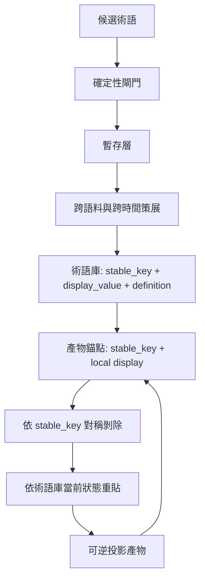

+++
title = "術語治理與可逆投影：讓延後命名不變成語意污染"
date = "2026-06-14T16:36:03+08:00"
author = "TTL::0"
draft = false
isCJKLanguage = true
description = "生成式系統很擅長在寫作、摘要、分類或知識抽取時順手產生名字。這些名字有時漂亮、有時粗糙、有時只是句子碎片。真正危險的不是候選詞裡有噪音，而是系統把噪音直接寫進共享、長期保留、會被後續產物繼承的術語層。當一個粗糙詞彙被持久化、被重複引用、被下游當成既有真相，它就不再只是一次輸出的小錯，而會變成語意污染。"
tags = [
    "分析論述", # term:AnalyticalEssay
    "AI 代理人", # term:AiAgent
    "術語管理", # term:TerminologyManagement
    "可逆投影", # term:ReversibleProjection
    "語意污染", # term:SemanticPollution
    "知識管理", # term:KnowledgeManagement
    "結構約束", # term:StructuralConstraint
    "無變更", # term:NoOp
  ]
series = ["知識與意圖的治理：讓承載權威的載體回到能被驗證與退場的位置"]
[ai_info]
    [ai_info.generation]
        model = "GPT 5.5"
        agent = "Codex VS Code extension 26.609.30741"
    [ai_info.refinement]
        model = "Claude Opus 4.8"
        agent = "Claude Code VSCode Extension 2.1.177"
+++

<!--more-->

## 導言

生成式系統很擅長在寫作、摘要、分類或知識抽取時順手產生名字。這些名字有時漂亮、有時粗糙、有時只是句子碎片。真正危險的不是候選詞裡有噪音，而是系統把噪音直接寫進共享、長期保留、會被後續產物繼承的術語層。當一個粗糙詞彙被持久化、被重複引用、被下游當成既有真相，它就不再只是一次輸出的小錯，而會變成**語意污染**（Semantic Pollution） <!-- term:SemanticPollution -->。

> [!IMPORTANT]
> **語意污染** <!-- term:SemanticPollution --> (Semantic Pollution): 指在共享上下文或設定檔中引入無關、混亂或具備多義性的指令，導致 AI 代理理解與推論精確度下降的現象。 <!-- anchor:SemanticPollution -->


說到底，我真正想主張的是：術語可信度不是生成結果，而是生命週期治理的結果。自洽的詞不等於正確的詞，正確的詞也不等於已可信地進入共享契約。可信術語需要經過可驗證的閘門、可逆的**投影**（Projection） <!-- term:Projection -->、對稱的剝除、明確的角色判定，以及依歸屬與時機安排的策展制度。

> [!IMPORTANT]
> **投影** <!-- term:Projection --> (Projection): 產物透過穩定鍵間接引用共享庫時，它不再是凍結快照，而是共享庫當前狀態一個可隨時重算的呈現。 <!-- anchor:Projection -->


因此，治理目標不應是要求模型在單次命名時永不出錯。那既不現實，也把精確性的證據需求放錯位置。比較好的目標是讓粗糙候選可以安全存在，讓不成熟詞彙不會自動永久化，並讓日後策展能低成本地合併、降級、封存與重貼。

## 分析

術語污染首先要被拆成一條因果鏈，而不是被視為模型本質的單點失敗。生成式模型會帶來固有熵：它可能產出片段、近義變體、過度通用詞，或形式正確但語意錯誤的詞。這些噪音在單次輸出裡並不稀奇，也不一定致命。致命的是弱閘門、自動晉升與持久化放大把噪音推入永久層。

可以把污染理解成一個乘積：

```text
術語污染 = 固有熵 x 弱閘門 x 自動晉升 x 持久化放大
```

固有熵無法歸零，但後三項是系統設計。結構碎片可以用格式規則攔下，近義變體可以用相似度與既有鍵檢查，過度通用詞可以用語料頻率標記。只有形式正確但語意錯誤的詞需要人或領域權威判斷。這代表多數污染不是因為系統「用了模型」，而是因為模型提案和永久真相之間缺少足夠的確定性閘門。

這裡也要就地區分三個常被混用的狀態：自洽、正確、可信。自洽表示一個詞在文字上看起來合理，定義也能和周邊敘事對上。正確表示它確實對應到某個需要命名的概念。可信則表示它已經通過足夠的驗證與授權，可以被共享系統當成穩定契約使用。術語治理的錯誤，常發生在把第一個狀態直接升格成第三個狀態。

污染的傳播路徑也不只在術語庫裡。輸入材料中的詞彙會影響模型注意力，模型注意力會影響輸出決策，輸出決策若被永久化，又會成為下一輪輸入材料。這條路徑可以寫成：

```text
輸入材料 -> 模型注意力 -> 輸出決策 -> 共享術語層 -> 下一輪輸入材料
```

若共享術語層沒有撤回能力，污染就成為**棘輪**（Ratchet） <!-- term:Ratchet -->：錯誤只進不退，甚至因反覆出現而看起來越來越正當。術語治理的第一個任務，是打斷這個棘輪 <!-- term:Ratchet -->。

> [!IMPORTANT]
> **棘輪** <!-- term:Ratchet --> (Ratchet): 噪音一旦寫入全域可變、長期保留的儲存層便只進不退、複利累積的現象；能被洗掉的短暫噪音無害，出不去的噪音才致命。 <!-- anchor:Ratchet -->


精確性之所以不能在生成當下完成，是因為它需要跨語料與跨時間證據。一個精確術語至少要有正規形式、清楚邊界、變體調和與恰當粒度。這四件事都無法從單一文件或單一瞬間穩定判斷。正規形式要知道其他文件是否已有更好的名字；邊界要看用法是否穩定；變體調和要看相近詞是否其實指向同一概念；粒度要看它在語料中是否太泛或太細。

所以，單次命名可以偶然精確，但命名窗口無法驗證它精確。這不是要求作者或模型更用心就能完全解決的問題，而是資訊結構的限制。把「候選」與「定稿」分開，才符合知識成熟曲線：先觀察，再累積，最後固化。

這個延後策略有一個前提：下游產物必須可逆。如果文章、文件或索引一旦產出就凍結，延後策展只是把債務藏進不可修的地方。**可逆投影**（Reversible Projection） <!-- term:ReversibleProjection -->補上了這塊。它讓產物不是複製術語庫某一刻顯示值的快照，而是透過穩定鍵引用術語庫的可重算呈現。

> [!IMPORTANT]
> **可逆投影** <!-- term:ReversibleProjection --> (Reversible Projection): 讓產物以穩定鍵引用術語庫的可重算呈現而非凍結快照，使術語合併、降級或改名能在源頭修一次並機械重貼到所有產物。 <!-- anchor:ReversibleProjection -->


最小模型如下：



穩定鍵是**身分**（Identity） <!-- term:Identity -->，顯示值是當前呈現，錨點是產物裡保留關聯的承載處，重貼是把術語庫當前狀態重新套用到產物。只要鍵能在讀入與寫出的往返中無損存活，術語庫中的合併、降級、移除或改名，就能透過授權的重貼步驟扇出到所有產物。錯誤不再需要逐篇手動追殺，而可以在源頭修一次，再機械傳播。

> [!IMPORTANT]
> **身分** <!-- term:Identity --> (Identity): 系統元件在架構中宣告的核心職責與自我定位。 <!-- anchor:Identity -->


但可逆投影 <!-- term:ReversibleProjection -->不能只重視重貼。它的另一半是剝除。重貼之前，系統必須先把舊的機器標註完整拆掉，再依當前術語庫重建。如果剝除沒有對準同一把穩定鍵，可逆性會靜默失效。

錯誤剝除通常有兩種代理判準：

```text
錯誤一：依當前清單剝除
  被移除的舊項目已不在清單 -> 認不出 -> 孤兒殘留

錯誤二：依外形剝除
  作者手寫內容剛好同形 -> 誤認為機器標註 -> 被錯刪

正確：依穩定鍵剝除
  帶有該鍵 -> 是機器曾經蓋章的標註 -> 可拆
  沒有該鍵 -> 不是這條投影管線的產物 -> 保留
```

**冪等**（Idempotent） <!-- term:Idempotent -->也必須被正確理解。重跑後**無變更**（No-Op） <!-- term:NoOp -->，只表示系統到達某個不動點，不表示那個不動點乾淨。帶著孤兒標註的產物也可能每次重跑都無變更 <!-- term:NoOp -->。真正要驗證的不是「第二次跑有沒有 diff」，而是 clean-then-rebuild 是否真的回到零標註基準態，再由當前術語庫重建。

> [!IMPORTANT]
> **冪等** <!-- term:Idempotent --> (Idempotent): 一個步驟可反覆執行而結果穩定的性質；對已是最新狀態的產物再跑一次，應為無變更。 <!-- anchor:Idempotent -->
> **無變更** <!-- term:NoOp --> (No-Op): 重新推導套用在已同步產物上時不產生任何實際改動的結果；但帶孤兒的不動點同樣無變更，故無變更不等於正確。 <!-- anchor:NoOp -->


這把問題推到更一般的管線戒律：依角色行事，不依外形、成員資格或語法類別行事。外形像機器標註，不代表它就是機器標註；仍在清單中，不代表它是應該剝除的身分 <!-- term:Identity -->；語法上是註解，也不代表它的語意角色就是普通註解。粗代理在常見情況下很誘人，因為它們與角色高度相關；但 bug 往往住在代理與角色分岔的邊緣。

在多階段管線中，上游用粗代理做錯決定，還會移除下游需要的訊號。下游程式可能仍會執行、仍不報錯，卻在空輸入上空轉。這種「會執行的死碼」尤其危險，因為它騙過了只檢查流程是否跑過的驗證。術語投影 <!-- term:Projection -->管線因此需要把每個階段的輸出視為下一階段的契約，而不只是中間格式。

術語治理還需要分類紀律。流程框架可以捕捉知識，但不擁有知識。某個概念在某個流程中被發現，不代表它本質上屬於那個流程。判斷歸屬時，應該問它解決什麼問題：若它回答的是產物如何排序，它是 workflow 知識；若它回答的是術語如何避免污染，它是術語治理知識；若它回答的是狀態轉移如何保持正確，它可能是系統 correctness 知識。

這個區分會直接影響術語庫是否污染。若把所有在流程中浮現的詞都收進流程術語，流程就會佔有它不擁有的知識。若把個人工具偏好寫成團隊共享規則，共享契約也會被污染。規則放哪，應跟隨它的歸屬，而不是只看它的主題。

最後，術語制度的演進應先保護契約，再擴充能力。若底層契約還允許不可逆 mutation、孤兒殘留、誤刪人寫內容或有損往返，先增加更多自動命名、更多批次重貼、更多外部整合，只會放大錯誤模型。真正的 foundation 不是「看起來比較底層」的工作，而是會阻止明確錯誤狀態被後續能力繼承的契約修正。

## 結論

這套模型的要點，是把術語從「文字輸出」改看成「有生命週期的共享契約」。候選術語可以寬鬆，因為寬鬆能保留發現；永久術語必須嚴格，因為嚴格才能被下游繼承。兩者之間需要暫存、證據、策展與可逆投影 <!-- term:ReversibleProjection -->，而不是靠單次生成瞬間完成所有判斷。

術語生命週期可以用七個狀態描述：

| 狀態 | 意義 | 主要風險 |
| :--- | :--- | :--- |
| 候選 | 在局部脈絡中出現的命名提案。 | 被誤認為已可信。 |
| 暫存 | 通過基本結構閘門，但尚未定稿。 | 沒有後續策展而自然沉積。 |
| 採納 | 經跨語料與跨時間證據確認可用。 | 過早採納導致近義詞分裂。 |
| 錨定 | 以穩定鍵寫入產物，保留可重算關聯。 | 鍵在往返中遺失。 |
| 降級 | 發現粒度、邊界或定義不足，退回非正規狀態。 | 已發布產物無法同步撤回。 |
| 合併 | 多個變體收斂到同一正規術語。 | 舊鍵與顯示值映射不清。 |
| 封存 | 不再作為活躍術語使用，但保留歷史判讀能力。 | 直接刪除造成孤兒與不可追溯。 |

這張表也說明為什麼「延後命名」不是拖延，而是一種降低錯誤成本的策略。當產物可逆、錨點穩定、重貼授權明確時，延後策展讓系統有時間取得精確性所需的證據。相反地，若沒有可逆投影 <!-- term:ReversibleProjection -->，延後只是把錯誤留給未來，而且未來更難修。

反例邊界同樣重要。第一，穩定鍵只能維護標註層的一致性，不能自動修正散文層論述。若錯誤術語已經改變整段推理，重貼只能改標註，不能替作者重寫論證。第二，沒有可靠鍵的歷史產物不能靠放寬剝除規則解決；比較安全的做法是保守保留，再用一次性遷移與人工確認處理。第三，流程越有效，越容易把所有被它捕捉的知識收入自己名下；成熟治理必須在捕捉後重新分類。

還有一個範圍控制問題。修正可逆投影 <!-- term:ReversibleProjection -->契約，可能 enable 更大的能力，例如全站批次重貼、跨語言術語同步或自動合併建議。但 enabling contract 不應在同一次變更裡吞掉 enabled feature。前者驗證的是錯誤狀態是否被拒絕、鍵是否存活、剝除是否對稱、**乾跑**（Dry-Run） <!-- term:DryRun -->是否可審查；後者驗證的是工作流、規模、使用者體驗與權限制度。混在一起，會讓錯誤面積暴增。

> [!IMPORTANT]
> **乾跑** <!-- term:DryRun --> (Dry-Run): 在實際套用跨產物變更之前，先檢視其影響範圍的預演步驟；是回寫已發佈產物這類治理行為的必要前置防護。 <!-- anchor:DryRun -->


## 結論

術語污染不是宿命。生成式候選值必然帶熵，但熵只有在穿過弱閘門、自動晉升與持久化放大後，才會變成長期污染。治理的重點不是消滅所有候選噪音，而是阻止噪音直接成為共享真相。

精確是一種事後屬性。正規形式、邊界、變體調和與粒度都需要跨語料與跨時間證據。單次命名可以提出候選，不能獨自授權可信。把候選與定稿分開，是術語治理的基本誠實。

可逆投影 <!-- term:ReversibleProjection -->讓延後策展成立。穩定鍵、顯示值、錨點與重貼把產物從凍結快照變成可重算投影 <!-- term:Projection -->。源頭修一次、全域回貼，才有資格說錯誤可回滾。

剝除是可逆性的另一半。重貼對準鍵還不夠；清除舊標註也必須對準同一把鍵。冪等 <!-- term:Idempotent --> no-op 不等於正確，帶孤兒的不動點同樣穩定。真正可信的重推導，必須證明 clean-then-rebuild 兩半都成立。

角色、歸屬與時機決定治理邊界。相似的東西不一定該合併；它們若在不同時程上變動、由不同**主體**（Subject） <!-- term:Subject -->擁有、或在不同階段固化，就應保持分開。流程能捕捉知識，但不擁有知識；契約能支撐能力，但不應吞掉能力。術語治理的成熟，正是在這些邊界上把可生成的文字，轉化為可維護的共享知識。

> [!IMPORTANT]
> **主體** <!-- term:Subject --> (Subject): 權限檢查中發起操作的一方，在 Linux 中由 process credentials（UID、GID、capabilities 等）描述其身分與當下能力。 <!-- anchor:Subject -->
