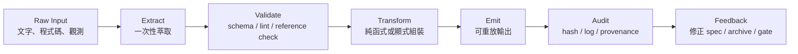
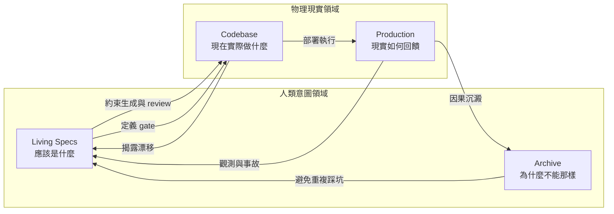

+++
title = "架構約束與決定性管線：從 SSOT 到多維治理迴路"
date = "2026-06-14T16:28:01+08:00"
author = "TTL::0"
draft = false
isCJKLanguage = true
description = "AI agent 進入工程系統後，最危險的誤解是把模型能力當成架構能力。本文主張 agent 友善架構的關鍵不是讓模型理解更多，而是把可誤解空間縮小到工程能承受的範圍——透過集中式分類、絕對歸屬、決定性管線、領域邊界與多維 SSOT，把統計生成接到可驗證、可回放、可追責的治理迴路。"
tags = [
    "分析論述", # term:AnalyticalEssay
    "AI 代理人", # term:AiAgent
    "AI 治理", # term:AIGovernance
    "單一事實來源", # term:SingleSourceOfTruth
    "決定性管線", # term:DeterministicPipeline
    "領域驅動設計", # term:DomainDrivenDesign
    "技術債", # term:TechnicalDebt
    "確定性邊界", # term:DeterministicTrustBoundary
  ]
series = ["結構與邊界：當權威必須落成程式與核心都會拒絕的約束"]
[ai_info]
    [ai_info.generation]
        model = "GPT 5.5"
        agent = "Codex VS Code extension 26.609.30741"
    [ai_info.refinement]
        model = "Claude Opus 4.8"
        agent = "Claude Code VSCode Extension 2.1.177"
+++

<!--more-->

## 背景

AI agent 進入工程系統後，最危險的誤解是把模型能力當成架構能力。模型可以讀很多上下文、生成完整方案、模仿既有代碼風格，也可以在缺少資訊時補出一條看似合理的因果鏈。但這些能力不會自動帶來可驗證性、可回復性或責任邊界。相反地，若架構沒有穩定約束，模型越會生成，系統越容易把隱式依賴、歷史污染與錯誤抽象擴散得更快。

這裡真正要主張的是：agent 友善架構不是讓模型自由理解更多東西，而是把可誤解空間縮小到工程能承受的範圍。分類規則要集中成可審計的 dispatch；資料、schema、workflow 與 script 要有明確歸屬；高風險轉換要進入 deterministic pipeline；領域邊界要壓縮 agent 的**搜尋熵**（Search Entropy） <!-- term:SearchEntropy -->；跨語言重寫要先萃取黑盒契約，而不是翻譯舊**形狀**（Data Shape） <!-- term:DataShape -->。最後，**單一事實來源**（Single Source of Truth） <!-- term:SingleSourceOfTruth -->不能只是一個檔案，而要演化為多維 SSOT：codebase 管物理現實，Living Specs 管意圖，**衝突封存**（Archive） <!-- term:Archive --> 管歷史因果，Production 管現實回饋。

> [!IMPORTANT]
> **搜尋熵** <!-- term:SearchEntropy --> (Search Entropy): AI Agent 或開發者在不確定或散亂的程式碼庫中搜尋定位特定邏輯或行為時面臨的無序度。 <!-- anchor:SearchEntropy -->
> **形狀** <!-- term:DataShape --> (Data Shape): 資料結構或物件所包含的屬性與型別定義，通常由型別系統來描述 <!-- anchor:DataShape -->
> **單一事實來源** <!-- term:SingleSourceOfTruth --> (Single Source of Truth): 指在特定工作執行緒中唯一被視為絕對真實與合法的結構化資料來源，所有操作皆以其為單向基準。 <!-- anchor:SingleSourceOfTruth -->
> **衝突封存** <!-- term:Archive --> (Archive): 這是 SDD 治理框架中的三層防禦之一，旨在記錄版本歷史與衝突狀態，但在底層模型發生無聲漂移時，由於缺乏清晰分界點，難以有效捕捉連續的品質滑坡。 <!-- anchor:Archive -->


這裡需要先定義兩個前提。第一，LLM 屬於統計生成層：當上下文缺少因果鏈時，它傾向用可見形狀 <!-- term:DataShape -->補齊空白，產生自洽但未必正確的輸出。第二，**確定性邊界**（Deterministic Trust Boundary） <!-- term:DeterministicTrustBoundary -->與統計執行層不同。需要全局一致、可重放、二元判斷或零錯誤的步驟，必須由 deterministic code、schema validator、linter、CI gate 或 runtime assertion 執行。模型可以提出假設、整理脈絡與生成候選方案，但不能成為最後的完整性裁決者。

> [!IMPORTANT]
> **確定性邊界** <!-- term:DeterministicTrustBoundary --> (Deterministic Trust Boundary): 在系統設計中，劃分確定性執行層（如腳本、CI）與統計推論層（如大語言模型）的介面契約，以確保關鍵操作的 100% 正確性。 <!-- anchor:DeterministicTrustBoundary -->


## 分析

### 從自由生成到架構約束

架構約束的第一個功能，是把「看似局部」的知識重新放回全局位置。分類規則就是典型例子。當每個 kind 都各自宣稱「我知道如何判斷自己」，系統表面上很物件導向，實際上卻把優先序、互斥關係與 fallback 藏在註冊順序裡。這種自包含是假象：分類從來不是單一物件的私事，而是整個集合的全局關係。

若再把分類、行為組合與身份查詢疊在同一個抽象上，語意斷裂就會發生。外層行為可能遮蔽內層身份，讓「唯讀」這種操作特性被誤讀為資源種類。對人類而言，這也許只是一次設計失誤；對 agent 而言，這會變成可模仿的錯誤形狀 <!-- term:DataShape -->。模型會看到某個介面同時承擔太多責任，並延續這種混雜。

更穩定的方向，是把分類規則集中為 declarative dispatch。pattern 規則、metadata guard 與 fallback 應該在同一個可審計位置被排列，kind 本身則退回純操作與構建。這不是追求 god function，而是承認「全局知識必須有全局表達」。當分類的互斥性與優先序被寫成資料表，agent 不再需要從分散檔案與註冊順序中推測真相。

這個原則可以推廣到整個 agent 架構：凡是需要全局一致性的知識，都不應偽裝成局部推理問題。架構約束的價值，不在於禁止變更，而在於讓變更發生在正確的地方。

### 歸屬隔離：資料、規格與工作流不能混在同一個語意空間

第二個功能，是建立絕對歸屬。Agent 讀到一份資料時，若不知道它是狀態、指令、schema、範例還是歷史備忘錄，就會用語言模型最自然的方式處理它：理解、聯想、延伸、補齊。這正是污染進入管線的路徑。

最小詞彙如下：

| 概念 | 問題 | 正確角色 |
| :--- | :--- | :--- |
| 架構約束 | 限制 agent 可自由詮釋的空間 | 將責任、輸入、輸出與驗證位置固定下來 |
| 歸屬 | 這份材料屬於誰、由誰消費、誰有權修改 | 防止模型把資料當指令、把願景當現況 |
| **結構合約**（Schema） <!-- term:Schema --> | 可驗證的結構合約 <!-- term:Schema --> | 由 deterministic code 檢查，不靠 prompt 記憶 |
| Workflow | 任務流程與角色分工 | 指揮執行順序，不承載資料真理 |
| SSOT | 特定維度的權威來源 | 消除雙重狀態與反向猜測 |
| 衝突封存 <!-- term:Archive --> | 歷史因果來源 | 保存為何不能那樣做，而不是替代當前契約 |

> [!IMPORTANT]
> **結構合約** <!-- term:Schema --> (Schema): 定義資料欄位、型別與排版限制的強型別規格定義，用於強制約束模型產出的格式。 <!-- anchor:Schema -->


將資料庫、schema、workflow 與 script 放在清楚分隔的物理位置，不只是整理目錄。它是在告訴 agent：這份 JSON 是狀態，不是你的寫作素材；這份 schema 是合約，不是建議；這份 workflow 是流程，不是資料來源；這支 script 是執行者，不是語意裁決者。

這種歸屬隔離會把 prompt 中的自然語言壓力移出模型注意力。與其要求 agent「請不要修改這些欄位」，更好的做法是只暴露它能填的欄位，並讓保留區由 schema validator 或 script 拒絕寫入。自然語言提醒可以作為輔助，但不能承擔邊界本身。

### 決定性管線：把文字探勘降級為編譯流程

第三個功能，是把不可靠的文字探勘改造成可重放的編譯流程。Markdown、聊天紀錄或生成草稿都可以作為原始材料，但它們不應同時被當成資料庫、契約與輸出。當 script 反覆用正則從 Markdown 裡猜 YAML、猜標題、猜術語、猜狀態，管線就會變成啟發式賭局。

**決定性管線**（Deterministic Pipeline） <!-- term:DeterministicPipeline -->的基礎模型如下：

> [!IMPORTANT]
> **決定性管線** <!-- term:DeterministicPipeline --> (Deterministic Pipeline): 把不可靠的文字探勘改造成可重放的編譯流程：萃取、驗證、轉換、輸出、審計各層只做一件事，使同一輸入產生同一輸出，並讓錯誤停在明確的 gate 上。 <!-- anchor:DeterministicPipeline -->




這條管線的關鍵，是每一層只做一件事。萃取層可以使用 LLM 協助整理候選資訊，但萃取結果必須落成結構化 manifest。驗證層不應再反向讀全文猜測，而是檢查 manifest 是否符合 schema。轉換層只讀已驗證輸入，輸出層只負責組裝，審計層記錄版本、來源與裁決結果。

最小 gate 形狀 <!-- term:DataShape -->可以像這樣：

```python
def run_pipeline(raw_input, schema, code_index):
    manifest = extract_manifest(raw_input)          # may use LLM, produces hypotheses
    validated = validate_schema(manifest, schema)   # deterministic
    validate_references(validated, code_index)      # deterministic
    output = render_from_manifest(validated)        # pure transform
    write_once(output)
    append_audit_log(input_hash=hash(raw_input),
                     manifest_hash=hash(validated),
                     output_hash=hash(output))
```

這段 pseudo-code 的重點不是語法，而是責任分離。LLM 可以參與 `extract_manifest`，但不能跳過 `validate_schema` 與 `validate_references`。輸出不是從原文中反覆修補，而是從已驗證資料一次性產生。這讓管線具備**冪等**（Idempotent） <!-- term:Idempotent -->性：同一份輸入與同一份 manifest 會產生同一份輸出，錯誤也會停在明確 gate 上。

> [!IMPORTANT]
> **冪等** <!-- term:Idempotent --> (Idempotent): 一個步驟可反覆執行而結果穩定的性質；對已是最新狀態的產物再跑一次，應為無變更。 <!-- anchor:Idempotent -->


### 領域邊界：降低 agent 搜尋熵

架構約束也必須落到代碼邊界。散亂的程序腳本對 agent 很不友善，因為每個腳本都可能偷偷解析設定、改寫物件、更新狀態或補標籤。Agent 要理解一次修改，就得閱讀大量不相干的路徑與副作用。這不是模型上下文不夠大，而是架構把行為藏在太多地方。

領域驅動的價值，在於把「如何形成合法物件」封裝進領域元件。排程器只排程與傳遞依賴，組裝器負責構建，實體負責維護不變量。這種邊界讓 agent 不必猜一個屬性是在哪十個 helper 中被突變，而是沿著顯式介面理解狀態如何形成。

反面模式如下：

```python
def publish(document, context):
    document.meta["author"] = parse_author()
    document.meta["tags"] = infer_tags(context)
    document.body = patch_terms(document.body)
    document.meta["telemetry"] = read_runtime()
    write(document)
```

正向模式如下：

```python
document = (
    DocumentAssembler(base)
    .with_author(config)
    .with_tags(vocabulary)
    .with_body_transform(term_policy)
    .with_telemetry(runtime)
    .build()
)
publisher.emit(document)
```

兩者的**差異**（Delta） <!-- term:Delta -->不只是漂亮。前者讓排程器成為神物件，所有狀態都可能在中途被暗中改寫。後者把變更入口固定在組裝器，讓每一步能被測試、替換與審計。對 agent 而言，這就是**認知壓縮**（Cognitive Compression） <!-- term:CognitiveCompression -->：它看到的是領域語意，而不是一團副作用。

> [!IMPORTANT]
> **差異** <!-- term:Delta --> (Delta): 特定變更的契約，用於驅動實作並作為驗證實作的基準對象。 <!-- anchor:Delta -->
> **認知壓縮** <!-- term:CognitiveCompression --> (Cognitive Compression): 透過抽象化、封裝與語意簡化，降低 AI Agent 或開發者理解與維護程式碼所需的認知負荷。 <!-- anchor:CognitiveCompression -->


同樣地，任務完成狀態也不應由中介 JSON 與實體檔案雙重維護。若輸出目錄已能代表任務是否完成，額外 index 就會成為第二真相來源。當兩者**脫鉤**（Desynchronization） <!-- term:Desynchronization -->，agent 會不知道該相信哪一個。**無狀態**（Stateless） <!-- term:Stateless -->與實體目錄即資料庫的設計，能把恢復流程變得簡單：重新執行，依現場狀態接續，而不是修復一份可能已過期的中介記錄。

> [!IMPORTANT]
> **脫鉤** <!-- term:Desynchronization --> (Desynchronization): 中介索引檔與真實檔案系統狀態不再一致的現象，是雙重狀態同步最典型的故障表現。 <!-- anchor:Desynchronization -->
> **無狀態** <!-- term:Stateless --> (Stateless): 不依賴任何中介追蹤檔、任務完成與否完全由輸出目錄的實體檔案決定的設計，帶來冪等性與韌性。 <!-- anchor:Stateless -->


### 重構重力井：不要把舊形狀翻譯成新宇宙

當系統進入跨語言重寫或大型重構時，架構約束會遇到另一種敵人：legacy 重力井。舊代碼、舊測試、舊 bug、原作者 PoC 與團隊習慣，會把新系統拉回舊世界。AI 會放大這個力量，因為它擅長模仿上下文。若上下文主要是舊代碼，模型會把舊形狀 <!-- term:DataShape -->當權威。

重寫的錯誤路徑通常有幾種。逐行翻譯會把舊語言的隱式狀態搬進新語言，用全域鎖、singleton 或共享 mutable state 包裝成「相容」。白盒測試搬運會把私有方法、mock 結構與中間狀態誤當契約，迫使新系統保留舊**依賴圖**（Dependency Graph） <!-- term:DependencyGraph -->。Bug-compatible 崇拜會把歷史偶然永久化。原作者 PoC 則可能把壓縮直覺以未解釋的形狀 <!-- term:DataShape -->交給 AI，成為新的定錨污染。

> [!IMPORTANT]
> **依賴圖** <!-- term:DependencyGraph --> (Dependency Graph): 追溯各項治理規則與機制之建立緣由所構成的依賴網絡，用以評估該機制的存續價值與拆除時機。 <!-- anchor:DependencyGraph -->


正確方向不是直接翻譯，而是黑盒考古。舊代碼是證據，不是藍圖；舊測試是線索，不是法律；原作者直覺是高價值材料，但需要被解壓成因果鏈。重寫前應先問：

| 問題 | 目的 |
| :--- | :--- |
| 系統對外承諾了什麼？ | 萃取真正業務契約 |
| 哪些輸入導致哪些狀態轉移？ | 建立可測試狀態機 |
| 哪些錯誤語義被呼叫端依賴？ | 保留外部相容性 |
| 哪些 bug 已被下游依賴？ | 設計相容層與退場條件 |
| 哪些歷史補丁在防禦事故？ | 避免清掉必要邊界 |
| 哪些形狀 <!-- term:DataShape -->只是舊框架遺產？ | 允許新語言使用新範式 |

這些答案應進入 Living Specs 與 衝突封存 <!-- term:Archive -->，而不是只存在於 prompt。AI 可以協助整理入口、資料流、反例與測試矩陣，但它不應在契約萃取前扮演翻譯機。

### 逆向解壓縮：把 AI 錯誤變成知識探針

專家知識往往不是文件形態，而是壓縮直覺。專家說「不要加鎖」，背後可能是熱路徑等待外部 API、worker 被耗盡、訊息重送、自我放大故障迴圈。AI 聽到的卻只是「不要使用 mutex」，於是可能改成 actor、channel 或 async queue，保留同樣的物理瓶頸。

逆向解壓縮利用了這個問題。先讓 AI 產生一份明確標記為候選假設的天真方案，再請專家攻擊它。專家看到具體錯誤，比從零口述整個系統容易。每一句「這裡會壞，因為...」都把壓縮直覺展開成因果。

這個流程必須受控。錯誤初稿不能直接進 codebase，不能使用權威語氣，也不能被當作建議實作。它的用途是觸發反駁。反駁要被轉成結構化條目：錯誤設計、失敗原因、觸發條件、保留約束、驗證方式。只有當反駁沉澱為 Living **約束性規格**（Spec） <!-- term:Spec -->、衝突封存 <!-- term:Archive --> note 或測試，AI 的錯誤才真正轉化為治理資產。

> [!IMPORTANT]
> **約束性規格** <!-- term:Spec --> (Spec): 以結構化或機器可讀格式定義的系統或 API 合約規範。 <!-- anchor:Spec -->


這讓 code review 的焦點前移。與其讓 AI 先生成大量錯誤代碼，再請資深工程師逐行修補，不如先 review 候選設計的失敗語義。規格穩定後，實作 review 才檢查代碼是否忠於契約。

### 多維 SSOT：單一真相來源不再只是一個地方

傳統 SSOT 常被理解成「唯一資料來源」。但 AI 協作工程需要更細的權威分工。Codebase、Living Specs、衝突封存 <!-- term:Archive --> 與 Production 都是真相來源，只是回答不同問題。



Codebase 是物理現實的 SSOT。文件說流程非同步，但代碼同步等待外部 API，物理上就是同步。Living Specs 是意圖真理的 SSOT，負責說明系統應該維持哪些不變量、錯誤語義、資料權威與相容性窗口。衝突封存 <!-- term:Archive --> 是歷史因果的 SSOT，負責保存曾經失敗的方案與當時條件。Production 是現實回饋的 SSOT，負責用 metrics、logs、traces、事故與使用者行為反駁紙上假設。

多維 SSOT 的價值在於衝突處理。Codebase 與 約束性規格 <!-- term:Spec --> 衝突時，要判斷是實作漂移還是意圖過期。約束性規格 <!-- term:Spec --> 與 Production 衝突時，要判斷是假設錯誤還是系統需要補強。Codebase 重引入 衝突封存 <!-- term:Archive --> 記錄過的危險模式時，review 應要求說明為何這次條件不同。若沒有這些維度，agent 只能在單一上下文裡模仿最顯眼的形狀 <!-- term:DataShape -->。

## 省思

架構約束常被誤解為降低 AI 產能。實際上，它是在保護 AI 產能不要轉化成技術熵增。沒有約束的生成很快，但每次生成都可能擴散隱式依賴、複製壞味道、增加不可回復的語意混雜。約束讓模型只在合適的位置發揮：提出假設、整理脈絡、生成候選、補測試、找反例，而不是替系統決定最後權威。

決定性管線 <!-- term:DeterministicPipeline -->也不是對模型不信任，而是承認不同工具有不同責任。LLM 擅長在模糊材料中建立候選理解；deterministic code 擅長做可重放裁決。把兩者混在一起，會讓模型背負它不適合背的責任，也讓 script 失去清楚輸入。分開之後，LLM 的錯誤可以被 gate 攔下，script 的錯誤可以被測試定位，人的判斷可以被 archive 追溯。

多維 SSOT 則提醒我們：權威不是集中到一份文件就完成了。Codebase 可能真實但污染，約束性規格 <!-- term:Spec --> 可能正確但過期，衝突封存 <!-- term:Archive --> 可能有因果但不代表當前契約，Production 可能反映現實但需要解釋。成熟治理不是消除這些張力，而是讓張力有固定對話位置。

這也解釋了為什麼跨語言重寫特別危險。重寫看似是逃離舊世界，實際上很容易把舊世界的形狀 <!-- term:DataShape -->搬得更快、更漂亮、更難拆。只有當舊代碼降級為證據、舊測試降級為線索、專家直覺升級為規格，AI 才能協助現代化，而不是成為 legacy 的複製機。

## 結論

Agent 友善架構的目標不是讓模型掌握所有事情，而是讓每一種真理住在正確位置。分類優先序、資料歸屬、schema gate、領域組裝、黑盒契約、歷史因果與 production 回饋，都需要自己的邊界與裁決方式。

可遷移的原則有五個。第一，全局知識要全局表達，不要偽裝成分散自包含。第二，資料、規格、工作流與 script 必須有明確歸屬，避免 agent 在同一語意空間中誤讀。第三，需要可重放與零錯誤的步驟必須進入決定性管線 <!-- term:DeterministicPipeline -->。第四，大型重構要先萃取黑盒契約與歷史因果，再使用 AI 生成實作。第五，SSOT 要多維化，讓 codebase、Living Specs、衝突封存 <!-- term:Archive --> 與 Production 互相制衡。

真正抵抗技術熵增的，不是一份完美 prompt，也不是一個更大的模型，而是一個能把統計生成接到確定性驗證、把專家直覺轉成規格、把歷史事故保存成因果、把生產回饋帶回設計的治理迴路。只有在這樣的迴路裡，AI 才能擴展工程能力，而不是擴展系統遺忘。