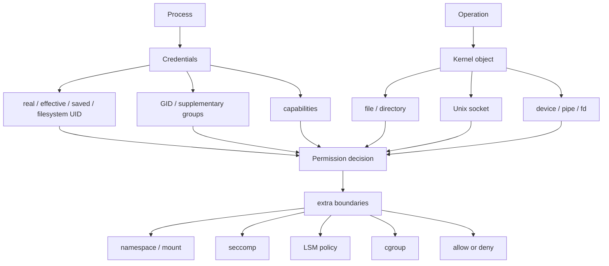
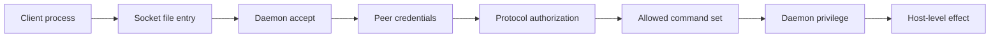
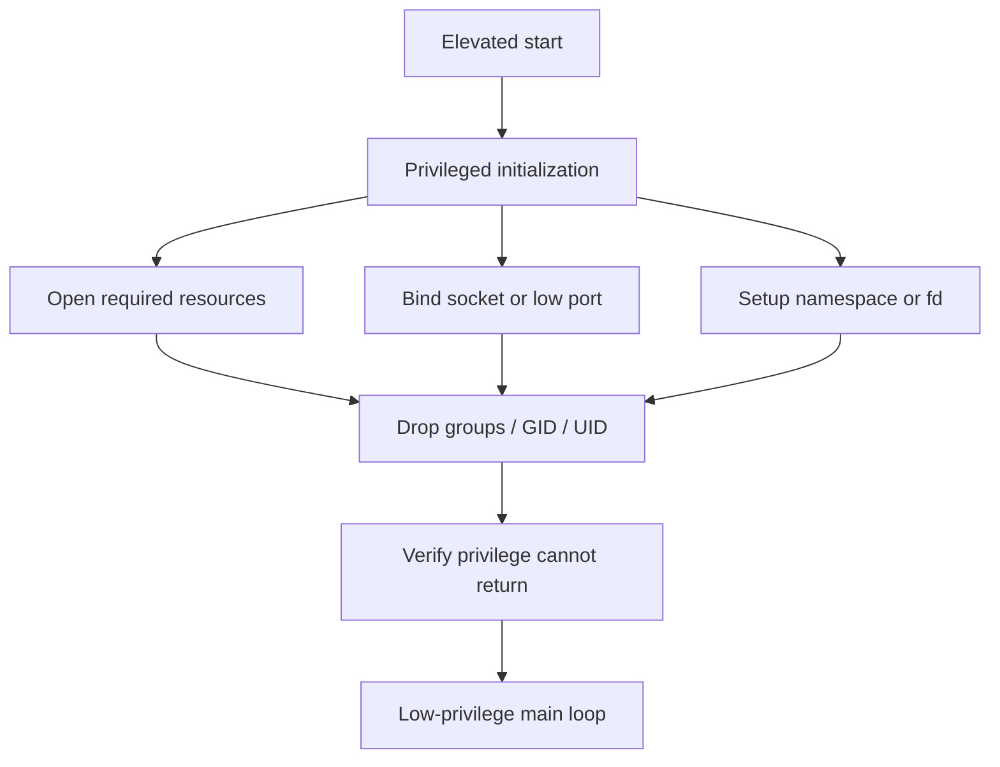
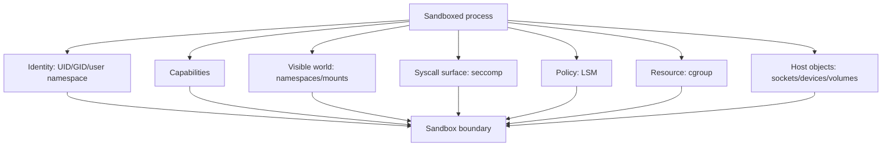

+++
title = "Linux 權限與 Sandbox 模型：從主體憑證到邊界組合"
date = "2026-06-14T16:45:02+08:00"
author = "TTL::0"
draft = false
isCJKLanguage = true
description = "Linux 權限不是標籤模型，而是關係模型。本文用主體、客體、能力、邊界四個詞，串起 process credentials、kernel object、Unix socket 授權、最小權限與 sandbox 邊界組合，並把這套模型放回 Agent 執行安全：sandbox 不是權限開關，而是可見世界、可用能力、可呼叫 syscall 與代執行責任的組合邊界。"
tags = [
    "分析論述", # term:AnalyticalEssay
    "AI 代理人", # term:AiAgent
    "Linux 權限", # term:LinuxPermissions
    "Sandbox", # term:Sandbox
    "最小權限", # term:LeastPrivilege
    "主體", # term:Subject
    "客體", # term:Object
    "形狀", # term:DataShape
  ]
series = ["結構與邊界：當權威必須落成程式與核心都會拒絕的約束"]
[ai_info]
    [ai_info.generation]
        model = "GPT 5.5"
        agent = "Codex VS Code extension 26.609.30741"
    [ai_info.refinement]
        model = "Claude Opus 4.8"
        agent = "Claude Code VSCode Extension 2.1.177"
+++

<!--more-->

## 導言

**Linux 權限**（Linux Permissions） <!-- term:LinuxPermissions -->最容易被簡化成幾個口訣：不要用 root、檢查 `chmod`、把服務放進 container、遇到 permission denied 就加權限。這些口訣各自有用，但它們會遮住真正的模型。Kernel 做權限判斷時，不是在問「登入者是誰」或「這是不是一個檔案」這麼單一的問題，而是在特定操作上比對**主體**（Subject） <!-- term:Subject -->、**客體**（Object） <!-- term:Object -->、能力與邊界。

> [!IMPORTANT]
> **Linux 權限** <!-- term:LinuxPermissions --> (Linux Permissions): Kernel 在每次操作上比對主體（process credentials）、客體（kernel object）、能力（UID/GID/capabilities/syscall）與邊界（namespace/seccomp/LSM/cgroup）的關係模型，而非單一標籤判斷。 <!-- anchor:LinuxPermissions -->
> **主體** <!-- term:Subject --> (Subject): 權限檢查中發起操作的一方，在 Linux 中由 process credentials（UID、GID、capabilities 等）描述其身分與當下能力。 <!-- anchor:Subject -->
> **客體** <!-- term:Object --> (Object): 權限檢查中被存取的目標，例如檔案、目錄、Unix socket、device 等 kernel object，其類型決定 kernel 走哪一條檢查路徑。 <!-- anchor:Object -->


這裡真正要主張的是：Linux 權限 <!-- term:LinuxPermissions -->是一個關係模型，不是一個標籤模型。主體 <!-- term:Subject -->是帶著 credentials 的 process；客體 <!-- term:Object -->是檔案、目錄、socket、device 或 daemon 入口等 kernel object；能力包含 UID/GID、groups、capabilities 與可呼叫 syscall；邊界則由 filesystem、namespace、seccomp、LSM、cgroup、mount 與 daemon protocol 一起構成。只看其中一層，就會錯估風險。

這個模型對 Agent 執行安全特別重要。Agent 的文字推理可以提出動作，但真正改檔、開 socket、執行命令、呼叫工具的是本機 process。Prompt 不能替代 OS 邊界；規則不能替代 kernel enforcement。若要讓 Agent 可以安全地動手，就必須知道它落地後到底以什麼主體 <!-- term:Subject -->身份執行、能接觸哪些客體 <!-- term:Object -->、保留哪些能力，以及被哪些邊界限制。

## 分析

最小詞彙要從四個詞開始：主體 <!-- term:Subject -->、客體 <!-- term:Object -->、能力、邊界。主體 <!-- term:Subject -->是發起操作的一方，在 Linux 中通常是 process 及其 credentials。客體 <!-- term:Object -->是被操作的目標，例如 path 上的 inode、Unix socket endpoint、device node 或 daemon API。能力是主體 <!-- term:Subject -->此刻可用來通過檢查的權限材料，例如 effective UID、supplementary groups、capabilities 或已經開好的 file descriptor。邊界是限制主體 <!-- term:Subject -->與客體 <!-- term:Object -->互動的政策組合。

這四個詞能把很多表面不同的問題放回同一張圖：



這張圖的重點是：權限不是主體 <!-- term:Subject -->或客體 <!-- term:Object -->單獨決定，而是操作發生時所有相關狀態的合成結果。`root`、`chmod 777`、`docker run` 都只是其中某些層的描述，不是完整答案。

Process credentials 是第一個容易誤解的地方。一般命令列使用者常把「我登入成 alice」等同於「程式以 alice 權限執行」。在簡單情境下這近似成立，但一遇到 setuid 程式、daemon 降權或 container，這個直覺就會失準。Kernel 看的是 process 當下的 credentials，而不是人的登入感覺。

Credentials 不是單一 UID。Real UID 保留起源身份；effective UID 通常是特權判斷的主要輸入；saved-set UID 決定能不能切回舊權限；filesystem UID 參與 VFS 檔案系統檢查。Groups 與 supplementary groups 會影響 group 權限。Capabilities 又把傳統 root 權力拆成較細的特權種類，例如綁定低 port、切換 UID、管理網路或繞過某些檔案權限。

這解釋了「暫時降權」與「永久降權」的**差異**（Delta） <!-- term:Delta -->。只呼叫 `seteuid(getuid())` 可能只是把 effective UID 放下來，saved-set UID 仍保留復權路徑。若 process 之後處理外部輸入，攻擊者一旦劫持控制流，就可能要求 process 把特權拿回來。更強的做法是清 supplementary groups，接著用 `setresgid` 與 `setresuid` 把 real、effective、saved 欄位一起降到服務身份，最後驗證不能再復權。

> [!IMPORTANT]
> **差異** <!-- term:Delta --> (Delta): 特定變更的契約，用於驅動實作並作為驗證實作的基準對象。 <!-- anchor:Delta -->


```c
setgroups(1, &gid);
setresgid(gid, gid, gid);
setresuid(uid, uid, uid);

if (setresuid(0, 0, 0) == 0) {
    abort();
}
```

這段 pseudo-code 的意義不是教所有程式都照抄，而是凸顯承諾差異 <!-- term:Delta -->：**最小權限**（Least Privilege） <!-- term:LeastPrivilege -->不是「現在看起來不是 root」，而是「未來也不能偷偷回到不必要的特權」。

> [!IMPORTANT]
> **最小權限** <!-- term:LeastPrivilege --> (Least Privilege): 讓 process 在每個生命週期階段只保留必要能力的設計原則，透過 capabilities、namespace、seccomp、LSM 與 cgroup 等層共同收斂權限邊界。 <!-- anchor:LeastPrivilege -->


第二個基本問題是客體 <!-- term:Object -->。Process 要操作的東西不一定是 regular file。Filesystem path、directory、Unix socket、pipe、device、eventfd 都可能透過 file descriptor 被使用，但它們背後的 kernel object 與檢查路徑不同。把所有東西都叫檔案，是 Unix API 的優雅；把所有東西都當普通檔案 debug，則是常見錯誤。

檔案系統權限首先要看整條 path，而不只是最後一個檔案。讀取 `/var/lib/app/config.yml` 時，process 必須能穿越 `/var`、`/var/lib`、`/var/lib/app` 這些目錄。目錄的 `x` bit 在這裡代表 search 權限。最後一個檔案 mode 看起來可讀，父目錄不可穿越，仍然會失敗。

```bash
namei -l /var/lib/app/config.yml
ls -l /var/lib/app/config.yml
getfacl /var/lib/app/config.yml
```

這三個命令回答的是不同問題。`ls -l` 看最後一個 inode；`namei -l` 展開 path 上每一層；`getfacl` 補上傳統 mode bits 之外的 ACL。若 process 是 daemon，還要看 daemon 自己的 `/proc/<pid>/status`，不能只看 shell 裡的 `id`。

Unix socket 則是另一個關鍵交界。Pathname socket 在 filesystem 裡有一個節點，因此會受到 path 與 mode bits 影響。但它不是資料檔。Client `connect("/run/app.sock")` 後，資料進入 kernel socket buffer 與 server process，不是寫進那個 pathname 對應的檔案內容。

這個雙重性讓 socket daemon 的授權必須分層。第一層是入口：socket file 的 owner、group、mode 決定誰能接近入口。第二層是 peer credentials：server 可以讀取對端 process 的 pid、uid、gid，用來辨識連進來的是誰。第三層是 protocol authorization：即使 client 可以 connect，也不代表它能執行所有命令。第四層是 daemon privilege：如果 daemon 本身握有 root 或高 capability，它代替 client 執行操作時，blast radius 就由 daemon 的權力決定。



Docker socket 的風險可以用這張圖理解。危險不是 socket file 會神奇地讀寫 host，而是能連上它的人可以要求高權限 daemon 代執行高權限操作。入口權限只是門鎖；protocol 與 daemon 權力才決定門後櫃台能替你做什麼。

這也讓 permission denied 排查變得比較清楚。`EACCES`、`EPERM`、`ECONNREFUSED`、`ENOENT` 都是拒絕或失敗，但它們指向不同層。`EACCES` 常見於 path 或 socket pathname 權限不足；`EPERM` 常見於缺 capability、seccomp 或 LSM 拒絕；`ECONNREFUSED` 常代表 socket endpoint 沒有 server listen；`ENOENT` 可能是 path 不存在，也可能是在目前 namespace 中看不到。

因此排查不應從「加權限」開始，而應從三句話開始：

```text
1. 是哪個 process 在失敗？
2. 它要碰哪種 kernel object？
3. 哪一層 policy 拒絕了這次操作？
```

第一句逼你查 process 實際 credentials。第二句逼你分辨 file、directory、socket、device、network endpoint 或 daemon API。第三句逼你看 DAC、ACL、capability、mount flag、namespace、seccomp、LSM、cgroup 或 protocol authorization。這個順序保護根因不被 `sudo` 或 `chmod` 掩蓋。

最小權限 <!-- term:LeastPrivilege -->就是把這套判斷放進生命週期。Daemon 可以在初始化期短暫持有較高權限，用來綁定低 port、打開受保護檔案、建立 socket 或設定 namespace。初始化後，主迴圈應該只保留處理請求所需的身份、groups、capabilities、可見 world 與 syscall 面。



這裡的安全價值是時間切分。特權不是永遠禁止，而是不讓它陪著 process 經過最危險的外部輸入處理階段。若服務需要某個受保護資源，可以在初始化打開 fd，再降權後使用 fd；若只需要綁定 80 或 443 port，可以評估 `CAP_NET_BIND_SERVICE`，而不是長期 root。

Container 與 sandbox 則把這個模型擴成邊界組合。Namespace 改變 process 看見的世界：mount namespace 控制 filesystem 視角，PID namespace 控制看見哪些 process，network namespace 控制網路介面與 port，user namespace 控制 UID/GID 對映。Capabilities 控制特權種類。Seccomp 收窄 syscall 面。LSM 提供額外政策裁判。Cgroup 控制資源用量。Mount options 與 host object exposure 又決定 process 能碰到哪些實體入口。

這些層沒有任何一層單獨等於安全。Container 裡的 root 不必然等於 host root，特別是在 user namespace 正確對映且 capabilities 被收窄時。但 container 也不必然安全。如果掛進 `/var/run/docker.sock`、掛進 host root filesystem、使用 `--privileged`、加入 `CAP_SYS_ADMIN`、使用 host PID 或 host network，namespace 的隔離價值就會大幅下降。



這張圖也修正一個常見說法：sandbox 不是權限開關，而是邊界組合。它限制 process 是誰、看見什麼、還握有哪些能力、能呼叫哪些 kernel 入口、能消耗多少資源，以及能不能接觸宿主機上的敏感 object。任何一格太寬，都可能讓其他格的限制被繞過或失去意義。

把這套模型放回 Agent 執行安全，重點就很直接。Agent 不應被想像成純文字智慧體，而應被想像成會透過工具落地成 process 行為的系統。當 Agent 執行 shell、改檔、呼叫 package manager、開 dev server 或連本機 socket 時，它進入 Linux 權限 <!-- term:LinuxPermissions -->模型。此時安全問題不是「Agent 答不答應」而已，而是它實際 process 能不能做、sandbox 有沒有擋、host object 有沒有暴露、工具 escalation 有沒有外部授權。

因此，Agent sandbox 的成熟設計至少要回答幾個 OS 層問題：workspace write root 是哪裡？哪些 path 是只讀？network 是否允許？哪些命令需要外部批准？是否能碰到 Docker socket、SSH agent、cloud credentials 或 package manager cache？工具 process 是否帶有過大的 groups 或 capabilities？若答案只停在「我們有 prompt 規則」，就還沒有進入真正的權限邊界。

## 省思

這個主題最重要的張力，是便利抽象與安全語意之間的落差。Unix 把許多東西都放進 file descriptor 世界，讓程式可以用一致 API 操作檔案、socket、pipe 與 device。Container 把多層 kernel 機制包成一個部署單位，讓人用一行命令取得隔離感。Agent 工具又把 shell、filesystem 與外部服務包成高階能力，讓人用自然語言觸發行動。

這些抽象都很有價值，但它們會隱藏權限語意。`write(fd, ...)` 不告訴你 fd 背後是 regular file 還是高權限 daemon socket。`root in container` 不告訴你它是否對映到 host root。`permission denied` 不告訴你是 path mode、capability、LSM、seccomp 還是 daemon protocol 拒絕。`sandbox enabled` 也不告訴你邊界組合是否真的覆蓋了危險 object。

所以，好的權限推理不是背更多命令，而是保持問題的**形狀**（Data Shape） <!-- term:DataShape -->。每次遇到失敗或設計邊界，都回到主體 <!-- term:Subject -->、客體 <!-- term:Object -->、能力、邊界。誰在做？碰什麼？憑什麼能力？穿過哪些政策？是否有另一個高權限 daemon 代執行？是否有 host object 被掛進看似隔離的世界？

> [!IMPORTANT]
> **形狀** <!-- term:DataShape --> (Data Shape): 資料結構或物件所包含的屬性與型別定義，通常由型別系統來描述 <!-- anchor:DataShape -->


這也提醒我們，最小權限 <!-- term:LeastPrivilege -->不是道德口號，而是可驗證狀態。只說「不要用 root」不夠，因為非 root 仍可能帶 dangerous capability、supplementary group 或 host socket。只說「放進 container」不夠，因為 container 可能掛了宿主機高權限入口。只說「Agent 會先問」也不夠，因為安全邊界需要在執行層被 enforcement。

## 結論

Linux 權限 <!-- term:LinuxPermissions -->與 sandbox 的核心，是把每一次操作還原為主體 <!-- term:Subject -->、客體 <!-- term:Object -->、能力與邊界的合成結果。Process credentials 決定主體 <!-- term:Subject -->當下是誰與未來能否復權；kernel object 決定 filesystem、socket、device 或 daemon 入口走哪條檢查路徑；capabilities、groups、namespace、seccomp、LSM、cgroup 與 mount 決定能力與邊界；daemon protocol 決定能 connect 之後到底能要求什麼。

這個模型能避免幾個常見誤判：登入者不等於 process；最後檔案 mode 不等於整條 path 可達；socket file 不等於普通資料檔；能 connect 不等於完整授權；container root 不等於單一風險判斷；sandbox 不等於一個開關。

對 Agent 時代的工程實務而言，這些不是低階冷知識，而是安全協作的地基。AI 可以生成命令與程式碼，但執行時仍然落在作業系統的權限模型中。讓 Agent 安全可用，不只是讓模型更聽話，也不是把所有動作都禁掉；更精確的目標是把它放進一個可描述、可檢查、可縮小、可審計的邊界組合裡。只有當這個邊界成立，生成式能力才有安全展開的空間。