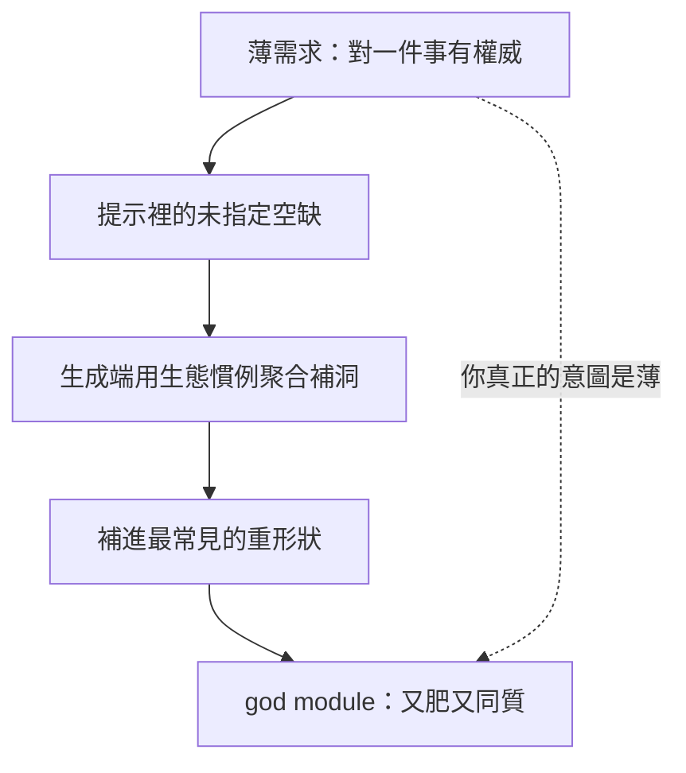

+++
title = "慣例驅動的封裝：為什麼 AI agent 元件開發預設長成 god module"
date = "2026-07-12T01:16:01+08:00"
author = "TTL::0"
draft = false
isCJKLanguage = true
description = "用 AI agent 做元件開發時，你要一個薄核，生成端卻補全成一個肥平台。這篇拆解 god module 的成因：慣例聚合如何填補你沒說出口的提示空缺、為何連刻意求薄都仍過度擁有應用語義，以及「找對消費者」本身的三難。"
tags = [
    "分析論述", # term:AnalyticalEssay
    "AI 代理人", # term:AiAgent
    "封裝邊界", # term:EncapsulationBoundary
    "過度生成", # term:OverGeneration
    "提示空缺", # term:PromptGap
    "消費者三難", # term:ConsumerTrilemma
    "薄產品", # term:ThinProduct
  ]
series = ["封裝邊界由誰劃：在 AI agent 的慣例引力下守住薄產品"]
[ai_info]
    [ai_info.generation]
        model = "Claude Opus 4.8"
        agent = "Claude Code VSCode Extension 2.1.206"
    [ai_info.refinement]
        model = "Claude Opus 4.8"
        agent = "Claude Code VSCode Extension 2.1.206"
+++

---

<!--more-->

## 導言

用 AI agent 做元件開發時，有一個反覆出現、幾乎像物理定律的現象：你要一個小東西，它給你一個大平台。

我要的是一個**生命週期保證**——某個東西被登記、被認領、要嘛完成要嘛失效。生成端給我的，是一整套 job queue：排程、重試、退避、傳輸、投遞、死信。我要的是一塊 **in-memory 暫存**，過程用完即丟。它給我一個持久化資料庫，外加耐久性契約與 payload 保證。我要的是一個**狀態機**，只管狀態怎麼轉。它附贈了 schema 版本控制，還咬死了資料遷移。

三次，我要的都是一個對「某一件事」有最終發言權的**薄核**；三次，生成端都自動把一整層我沒要的東西吸進核心。這篇要論證的是：這不是粗心，也不是模型不夠好。它是一種可預測的失敗模式——**慣例驅動的封裝**：當你沒把邊界講死，生成端會用生態系裡最常見的**形狀**（Data Shape） <!-- term:DataShape -->替你把它劃肥。理解這個機制，是理解「為什麼薄這麼難」的第一步。

> [!IMPORTANT]
> **形狀** <!-- term:DataShape --> (Data Shape): 資料結構或物件所包含的屬性與型別定義，通常由型別系統來描述 <!-- anchor:DataShape -->


## 三個同形的過度生成

先把三個案例並排，它們的形狀 <!-- term:DataShape -->完全一樣：

| 我要的薄核（對什麼有權威） | 生成端長出的重平台 | 被硬塞進來的「平台**擁有權**（Ownership） <!-- term:Ownership -->」 |
| :--- | :--- | :--- |
| 一段生命週期的保證 | 完整 job queue | 排程、重試、退避、傳輸、投遞 |
| 一塊用完即丟的暫存 | 持久化資料庫 | 持久化、耐久性契約、payload 保證 |
| 一個狀態轉移機器 | 狀態機 + schema 版本 | schema 演進、資料遷移機械 |

> [!IMPORTANT]
> **擁有權** <!-- term:Ownership --> (Ownership): 系統元件對資料、狀態或生命週期的絕對控制權。 <!-- anchor:Ownership -->


每一列左邊，都是一個只需要「掌管一件事」的核心。每一列右邊，都是那件事在生態系裡「通常長成的樣子」。從結果回推成因，問題不在於這些重平台是錯的——job queue、持久化、遷移在對的場景都對——而在於：**沒有人點過這些菜。** 它們不是需求，是預設補全。

這裡要先鎖一個區分，它貫穿全篇：薄核是「有某種權威、但刻意不擁有周邊」的中間帶。它對某個生命週期或裁決有最終發言權，卻把重試、逾時、路由、排程、持久化留在核心**外面**的**組合**（Compose） <!-- term:Compose -->層。上表右欄的每一項，都是這個中間帶刻意不該擁有、卻被吸回來的東西。

> [!IMPORTANT]
> **組合** <!-- term:Compose --> (Compose): 將多個獨立元件串聯運作的方式，強調資料流轉而非直接相依。 <!-- anchor:Compose -->


## 機制：慣例聚合填補提示空缺

為什麼生成端會這樣做？答案在「我沒說的地方」。

我要一個狀態機時，我沒說「不要持久化」、沒說「不要遷移」——我只字未提。而生成端正是在我**沒提的地方**動手。持久化、遷移、投遞保證，是跨生態系反覆出現的慣例；當提示裡留下一個未指定的空缺，生成端用它看過最多次的形狀 <!-- term:DataShape -->把空缺補滿。



關鍵的因果在最後那條虛線：**填補沉默用的是慣例，而慣例恰恰違背了你的薄意圖。** 你的意圖是「只要這一件事」，但「只要這一件事」是一個**由缺席定義**的需求——它靠你沒說的那些「不要」來界定，而生成端讀不到沉默。它只讀得到「狀態機」這三個字，然後補全成訓練資料裡「狀態機通常配什麼」。薄版本是罕見的，肥版本才是統計上的預設完成。

這也解釋了為什麼**剎不住**。漂移不是一個可以在生成當下攔截的失誤，它是生成的引力方向本身。你沒辦法要求一個補全引擎「補全得少一點」；少，正是它最不會的事。

## 連刻意求薄的核心，都仍過度擁有

有人會說：那把設計意圖講清楚不就好了？這裡有一個更深的觀察，它讓問題從「提示技巧」升級成「認知極限」。

考慮一個**刻意**求薄的背景工作執行器。它的設計者很自覺：文件上寫著「我們刻意做得少」、「我們在比傳輸層高一層的地方抽象」。它確實比一般的訊息匯流排克制得多——不做交換機路由、不做龐大的傳輸清單。以任何標準看，它都是一個有紀律的設計。

然而它仍然**擁有了 obligation semantics**：重試幾次才進死信、退避多久、如何排程、投遞保證多強——這些全烤進了核心。從回推因果看，這正是慣例引力最隱蔽的一擊：**重試策略、死信政策、排程，其實是使用者的應用語義**（不同業務對「失敗幾次算失敗」有不同答案），卻被一個「背景工作執行器通常該有這些」的慣例，收進了核心的擁有權 <!-- term:Ownership -->。

這是這篇最重要的失敗症狀：**連一個以「薄」為明確目標的產品，都會在自己沒察覺的地方過度擁有。** god module 的引力強到，你以為劃薄了，實際還握著別人的應用語義。它上線後的代價很具體：任何想換一套重試/死信政策的使用者，都得繞過或對抗核心的既定行為——核心成了它所服務的領域的主人，而不是僕人。

## 消費者三難：為何「劃對界」本身最難

如果薄核的界要由「真實消費者的關鍵路徑」來釘死，那自然的下一問是：找那個消費者不就好了？這裡藏著 AI agent 做元件開發**最難的一關**，我把它寫成一個三難：

```text
無消費者  → 訂不出契約 → 無法界定範圍 → 退回慣例驅動（漂移）
單一消費者 → 契約有了，但元件被耦合到那一個消費者的形狀
多個消費者 → 需求被稀釋，元件肥成所有人的並集（god module 從契約層復活）
```

三條路各自通向一種失敗。沒有消費者，你只能靠想像界定範圍，而想像永遠傾向全選，慣例趁虛而入。抓一個消費者，你把元件焊死在它的特殊形狀 <!-- term:DataShape -->上。抓多個消費者求穩妥，你得到的是所有需求的聯集——又是一個 god module，只是這次是從契約層長出來的。

從回推因果看，這三難其實是**「誰的實踐來驅動封裝」的三難**：沒有實踐驅動時慣例代畫，單一實踐驅動時過度貼合，多重實踐驅動時稀釋成並集。而 agent 自己解不開它——它要嘛沒有消費者就開寫，要嘛把碰得到的消費者全收。能從一堆（往往是失敗的）嘗試裡，抽出「那個能把邊界拉對、又不稀釋成聯集」的單一困難個案的，目前只有人的判斷。這是病理的頂點：不是「agent 不會劃界」，而是「劃對界需要一種 agent 交不出的判斷」。

## 邊界條件：慣例驅動何時剛好不出錯

把慣例驅動一律當成敵人，會犯下相反的錯。它有一個明確的不適用區：**當慣例恰好等於實踐時，慣例驅動不但不出錯，還是最省的選擇。**

一個標準需求的全新專案——需要的就是一套教科書式的持久化、一套標準的背景工作處理，沒有任何非典型約束——這時生成端補進來的重形狀 <!-- term:DataShape -->，剛好就是你要的。強行「求薄」反而是過度工程：你花力氣拆掉的，正是你本來就需要的東西。

判準因此不是「薄一定對」，而是回到那條缺席的意圖：**你沒說的那些「不要」，是真的不要，還是其實你要？** 如果核心的承諾真的需要那套持久化或那套投遞保證，那它們就是承重的，不該被薄化掉。慣例驅動的病，只在「慣例 ≠ 你的實踐」時才發作；診斷的價值，是讓你在動手前就分辨這兩種情況，而不是上線後才發現核心握了不該握的東西。

## 結論

god module 不是憑空出現的，也不是粗心的結果。它從一個結構性的事實開始：**元件化開發是在劃定**封裝邊界**（Encapsulation Boundary） <!-- term:EncapsulationBoundary -->，而 AI agent 會用訓練慣例替你把邊界劃肥。** 機制是慣例聚合填補**提示空缺**（Prompt Gap） <!-- term:PromptGap -->——你的薄意圖由沉默定義，而生成端讀不到沉默；它把每個未指定的縫，補成生態系裡最常見的重形狀 <!-- term:DataShape -->。

> [!IMPORTANT]
> **封裝邊界** <!-- term:EncapsulationBoundary --> (Encapsulation Boundary): 一個元件對某件事有最終發言權、又刻意不擁有周邊職責的那條劃分線。 <!-- anchor:EncapsulationBoundary -->
> **提示空缺** <!-- term:PromptGap --> (Prompt Gap): 需求中未被明確指定、於是被生成端以生態慣例補滿的空白處。 <!-- anchor:PromptGap -->


這個引力強到連刻意求薄的核心都會過度擁有別人的應用語義；而想靠「找個真實消費者來劃界」逃出去，又撞上**消費者三難**（Consumer Trilemma） <!-- term:ConsumerTrilemma -->——無消費者則慣例代畫，單消費者則耦合，多消費者則稀釋成並集。三者匯成同一個病根：

> [!IMPORTANT]
> **消費者三難** <!-- term:ConsumerTrilemma --> (Consumer Trilemma): 界定元件範圍時，無消費者則無契約、單一消費者則耦合、多消費者則稀釋成需求並集的三難困境。 <!-- anchor:ConsumerTrilemma -->


```text
當邊界由慣例代畫，你得到的是「大家通常怎麼做」，
而不是「這一件事真正需要什麼」。
```

要治這個病，唯一的方向是把劃界權從慣例手裡奪回，交還給真實的實踐與領域——並且，因為生成端剎不住，還得有守住這條界、不讓它重新長肥的紀律。那是另一個完整的問題：如何讓封裝由實踐驅動，以及如何守住。但第一步，是先認得這個引力的臉——因為認不出它，你會把每一次過度擁有，都誤當成「本來就該這樣」。